# Git for Beginners: Professional Practical Guide


## Who This Guide Is For
This guide is written for beginners who want to learn Git in a practical, real-world way. It explains concepts, commands, workflows, common problems, and team scenarios using diagrams and examples.

---

## 1. Introduction

### What Is Git?
Git is a distributed version control system used to track changes in files over time. It helps you:

- Save snapshots of your code (commits)
- Work safely on features using branches
- Collaborate with teammates
- Restore old versions when needed

Think of Git as a timeline of your project where each commit is a checkpoint.

### Git vs GitHub

| Topic | Git | GitHub |
|---|---|---|
| What it is | A version control tool | A cloud platform for hosting Git repositories |
| Runs where | Local machine | Remote server (web) |
| Internet required | No (for local work) | Yes (for push/pull, collaboration) |
| Main use | Track and manage code history | Team collaboration, pull requests, CI/CD, code review |

### Git Workflow Overview
A beginner-friendly view of how changes move through Git:

1. You edit files in the **Working Directory**.
2. You choose files for the next commit in the **Staging Area**.
3. You create a commit in the **Local Repository**.
4. You push commits to the **Remote Repository** (for example GitHub).

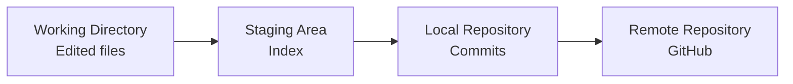
```mermaid
flowchart LR
    A[Working Directory\nEdited files] --> B[Staging Area\nIndex]
    B --> C[Local Repository\nCommits]
    C --> D[Remote Repository\nGitHub]
```

### Repository Structure Diagram

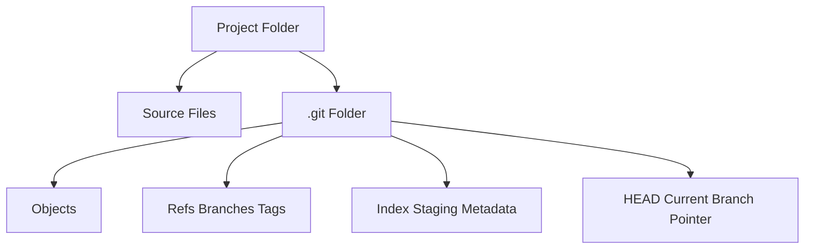
```mermaid
flowchart TD
    P[Project Folder]
    P --> W[Source Files]
    P --> G[.git Folder]
    G --> O[Objects]
    G --> R[Refs Branches Tags]
    G --> I[Index Staging Metadata]
    G --> H[HEAD Current Branch Pointer]
```

### Screenshots (Introduction)

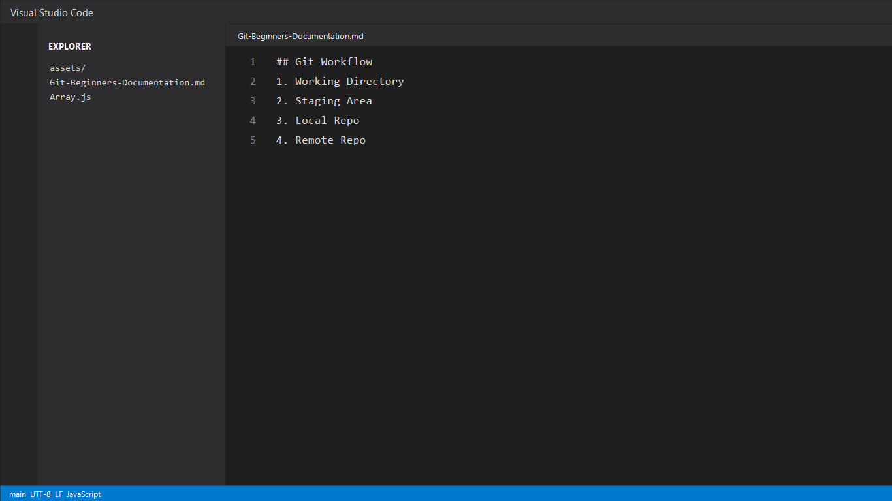
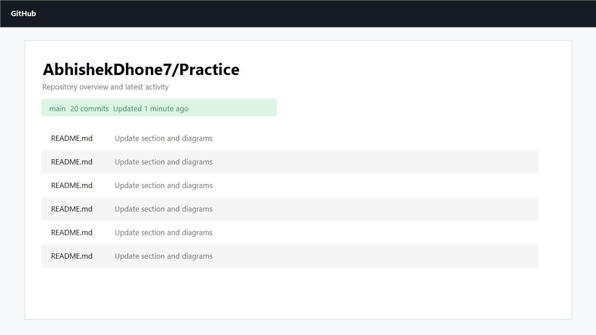


---

## 2. Initialize a Repository

You provided this command sequence:

```bash
git init
git add .
git add <file_name>
git commit -m "Commit message"
git branch -M main
git remote add origin https://github.com/AbhishekDhone7/Practice.git
git push -u origin main
git push
```

Below is the meaning of each command, expected output examples, and where it fits in the workflow.

### Step-by-Step with Command Explanations

#### 2.1 Initialize Git
```bash
git init
```
What it does:
- Creates a new `.git` folder in your current project.
- Starts version control for that folder.

Expected output (example):
```text
Initialized empty Git repository in C:/Users/Abhid/Desktop/New folder (2)/.git/
```

#### 2.2 Stage All Files
```bash
git add .
```
What it does:
- Adds all new and modified files in the current directory to the staging area.

Expected output:
- Usually no output if successful.

#### 2.3 Stage a Specific File
```bash
git add <file_name>
```
What it does:
- Adds only one specific file to staging.
- Useful when you want to commit changes in smaller, focused batches.

Example:
```bash
git add Array.js
```

Expected output:
- Usually no output if successful.

#### 2.4 Create a Commit
```bash
git commit -m "Commit message"
```
What it does:
- Creates a snapshot from staged files in your local repository.

Expected output (example):
```text
[main (root-commit) a1b2c3d] Initial commit
 3 files changed, 120 insertions(+)
 create mode 100644 Array.js
 create mode 100644 dummy2.js
 create mode 100644 Hoisting-TDZ.js
```

#### 2.5 Rename Current Branch to main
```bash
git branch -M main
```
What it does:
- Renames the current branch to `main`.
- `-M` forces rename if needed.

Expected output:
- Usually no output if successful.

#### 2.6 Add Remote Repository
```bash
git remote add origin https://github.com/AbhishekDhone7/Practice.git
```
What it does:
- Connects your local repo to a remote named `origin`.

Expected output:
- Usually no output if successful.
- If remote exists:
```text
error: remote origin already exists.
```

#### 2.7 Push First Time and Set Upstream
```bash
git push -u origin main
```
What it does:
- Pushes your `main` branch to GitHub.
- Sets upstream tracking so future `git push` and `git pull` work without extra branch names.

Expected output (example):
```text
Enumerating objects: 8, done.
Counting objects: 100% (8/8), done.
Writing objects: 100% (8/8), 1.20 KiB | 1.20 MiB/s, done.
Total 8 (delta 0), reused 0 (delta 0), pack-reused 0
To https://github.com/AbhishekDhone7/Practice.git
 * [new branch]      main -> main
branch 'main' set up to track 'origin/main'.
```

#### 2.8 Push Future Commits
```bash
git push
```
What it does:
- Pushes local commits to the configured upstream branch.

Expected output (example):
```text
Everything up-to-date
```

### Initialization Workflow Diagram

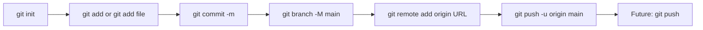
```mermaid
flowchart LR
    A[git init] --> B[git add or git add file]
    B --> C[git commit -m]
    C --> D[git branch -M main]
    D --> E[git remote add origin URL]
    E --> F[git push -u origin main]
    F --> G[Future: git push]
```

### State Transition Diagram

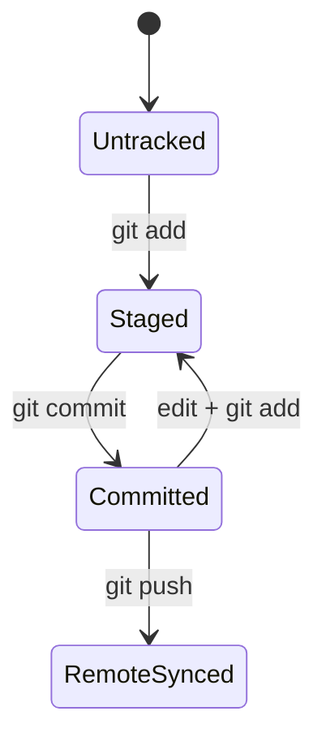
```mermaid
stateDiagram-v2
    [*] --> Untracked
    Untracked --> Staged: git add
    Staged --> Committed: git commit
    Committed --> RemoteSynced: git push
    Committed --> Staged: edit + git add
```

### Screenshots (Initialize Repository)

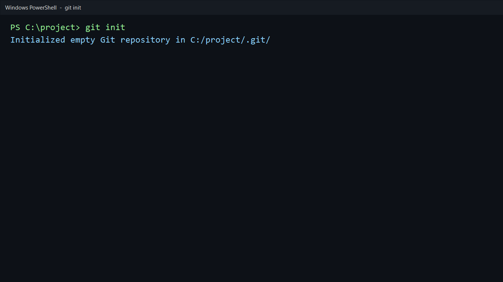
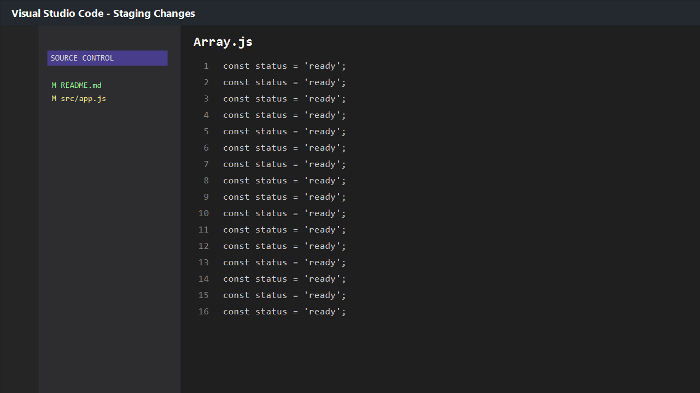


---

## 3. Daily Workflow

You provided:

```bash
git add .
git add <file_name>
git commit -m "Commit message"
git push
```

### Recommended Daily Loop

1. Pull latest code before starting work:
```bash
git pull
```
2. Edit files.
3. Stage changes:
```bash
git add .
# or
git add <file_name>
```
4. Commit with a meaningful message:
```bash
git commit -m "Fix array edge case in merge function"
```
5. Push commits:
```bash
git push
```

### Real-World Example

Scenario:
- You fixed a bug in `Array.js` where empty arrays caused errors.

Commands:
```bash
git add Array.js
git commit -m "Fix crash when array is empty"
git push
```

Result:
- Teammates can pull your fix immediately.
- Your change is documented with a clear commit message.

### Daily Workflow Diagram

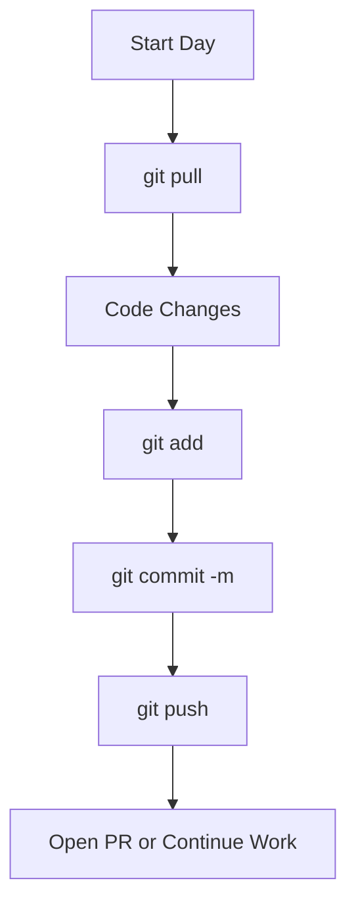
```mermaid
flowchart TD
    A[Start Day] --> B[git pull]
    B --> C[Code Changes]
    C --> D[git add]
    D --> E[git commit -m]
    E --> F[git push]
    F --> G[Open PR or Continue Work]
```

### Screenshots (Daily Workflow)


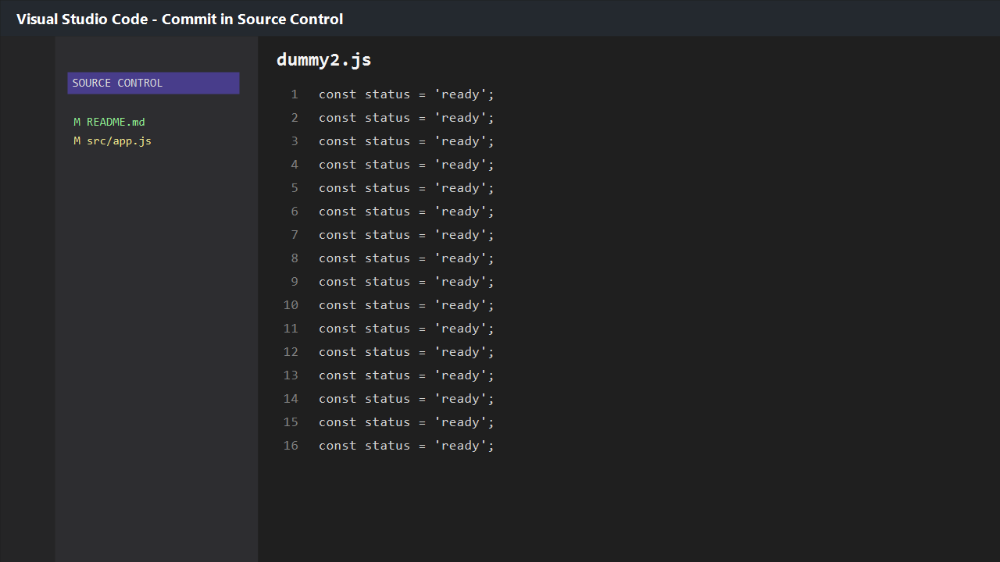
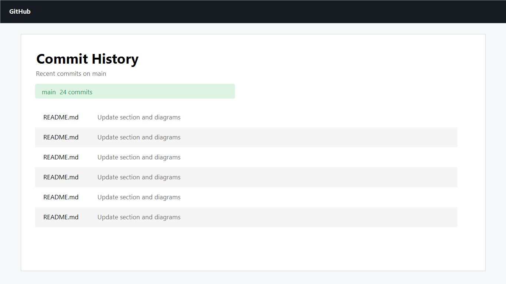

---

## 4. Clone an Existing Repository

You provided:

```bash
git clone https://github.com/AbhishekDhone7/Practice.git
git fetch
git checkout abhishek_dhone
```

### 4.1 Clone
```bash
git clone https://github.com/AbhishekDhone7/Practice.git
```
What it does:
- Downloads full repository history and files from remote.
- Creates a local folder named `Practice`.
- Automatically sets `origin` remote.

Expected output (example):
```text
Cloning into 'Practice'...
remote: Enumerating objects: 120, done.
remote: Counting objects: 100% (120/120), done.
Receiving objects: 100% (120/120), 45.33 KiB | 2.26 MiB/s, done.
Resolving deltas: 100% (35/35), done.
```

### 4.2 Fetch
```bash
git fetch
```
What it does:
- Downloads new commits/branches from remote.
- Does not modify your current working files.
- Safe way to check updates before merge.

Expected output:
- May show updated refs, for example:
```text
From https://github.com/AbhishekDhone7/Practice
   a1b2c3d..e4f5g6h  main           -> origin/main
 * [new branch]      abhishek_dhone -> origin/abhishek_dhone
```

### 4.3 Checkout
```bash
git checkout abhishek_dhone
```
What it does:
- Switches your working branch to `abhishek_dhone`.
- If only remote branch exists, use:
```bash
git checkout -b abhishek_dhone origin/abhishek_dhone
```

Expected output (example):
```text
Switched to branch 'abhishek_dhone'
Your branch is up to date with 'origin/abhishek_dhone'.
```

### Clone-Fetch-Checkout Diagram

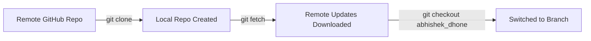
```mermaid
flowchart LR
    A[Remote GitHub Repo] -->|git clone| B[Local Repo Created]
    B -->|git fetch| C[Remote Updates Downloaded]
    C -->|git checkout abhishek_dhone| D[Switched to Branch]
```

### Branch Tracking Diagram

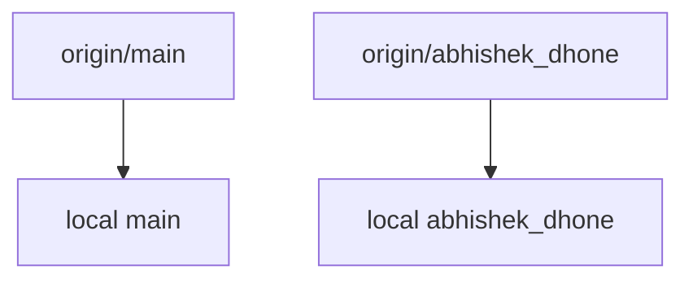
```mermaid
flowchart TD
    R1[origin/main] --> L1[local main]
    R2[origin/abhishek_dhone] --> L2[local abhishek_dhone]
```

### Screenshots (Clone)


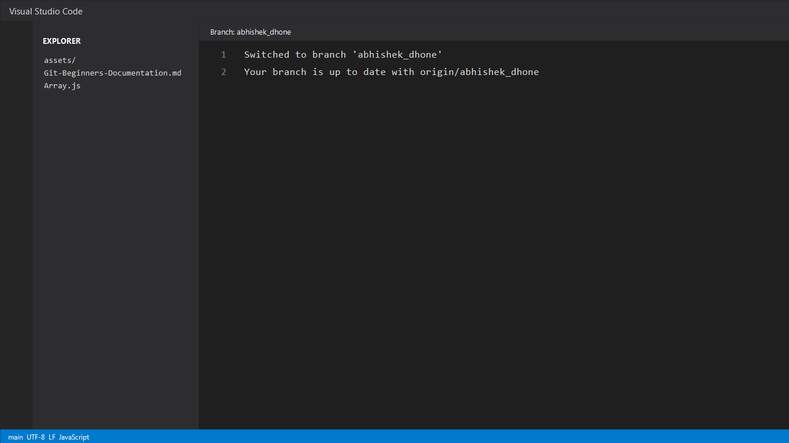
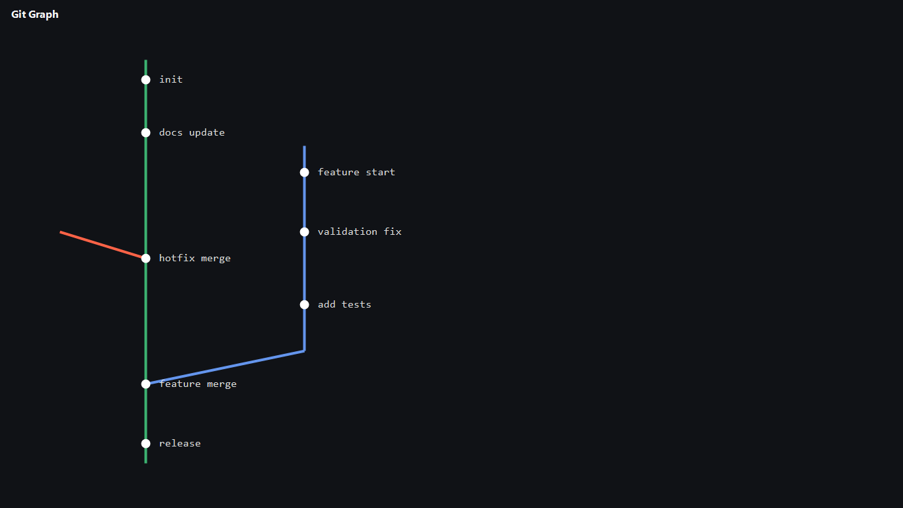

---

## 5. Merge Conflicts

A merge conflict happens when Git cannot automatically combine changes because the same lines were modified differently.

### How a Conflict Looks in a File

```text
<<<<<<< HEAD
console.log("Developer A version");
=======
console.log("Developer B version");
>>>>>>> feature-branch
```

You must edit and keep the correct final code, then stage and commit.

---

### Scenario A: Two Developers on the Same Branch

#### Situation
- Developer A and Developer B both work on `main`.
- Developer A pushes first.
- Developer B tries to push old local commits without pulling latest changes.

#### What Developer B sees

```text
! [rejected]        main -> main (non-fast-forward)
error: failed to push some refs to 'https://github.com/AbhishekDhone7/Practice.git'
hint: Updates were rejected because the remote contains work that you do not have locally.
```

#### Resolve using your requested flow

```bash
git pull
git add .
git commit
git push
```

Step explanation:
1. `git pull`: brings latest remote commits and tries automatic merge.
2. If conflicts occur, open conflicted files and resolve manually.
3. `git add .`: marks resolved files.
4. `git commit`: creates merge commit (if needed).
5. `git push`: sends merged result to remote.

#### Diagram: Same Branch Conflict

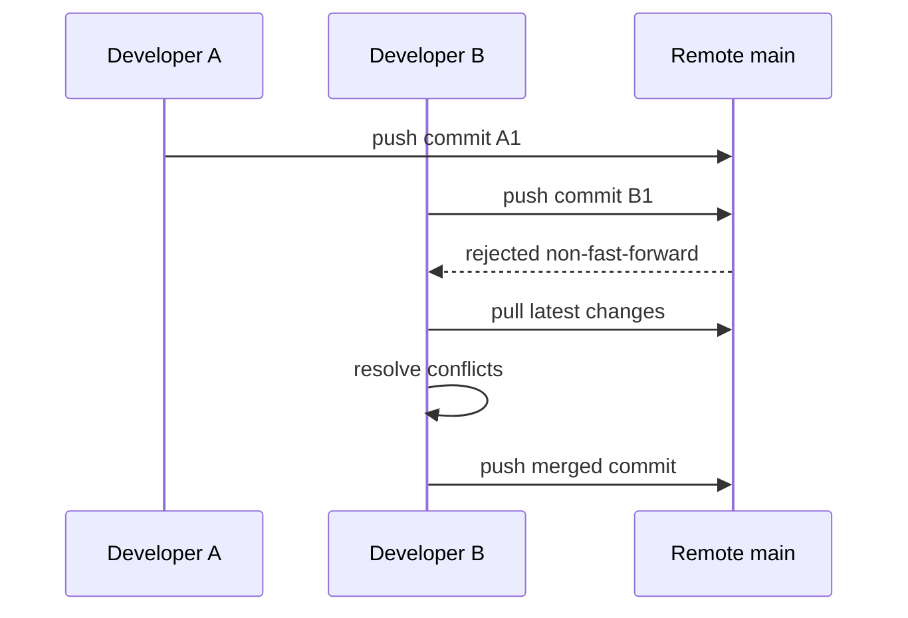
```mermaid
sequenceDiagram
    participant A as Developer A
    participant B as Developer B
    participant R as Remote main

    A->>R: push commit A1
    B->>R: push commit B1
    R-->>B: rejected non-fast-forward
    B->>R: pull latest changes
    B->>B: resolve conflicts
    B->>R: push merged commit
```

#### Command Flow Diagram

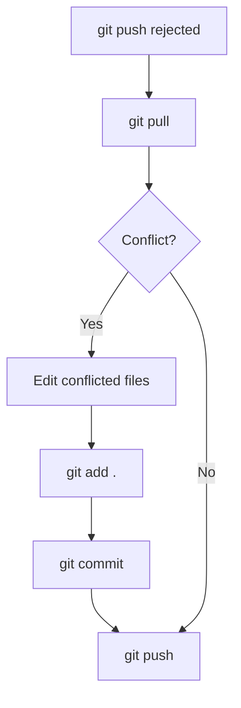
```mermaid
flowchart TD
    A[git push rejected] --> B[git pull]
    B --> C{Conflict?}
    C -->|Yes| D[Edit conflicted files]
    D --> E[git add .]
    E --> F[git commit]
    F --> G[git push]
    C -->|No| G
```

---

### Scenario B: Merging Branches Without Updating Target Branch

#### Situation
- You have `feature` branch.
- You merge into `main`, but local `main` is outdated.
- Result: potential merge conflicts or stale merges.

#### Correct Process

```bash
# Move to target branch
git checkout main

# Update target branch first
git pull origin main

# Merge feature branch
git merge feature

# If conflicts occur, resolve them in files
# Then stage, commit, push
git add .
git commit -m "Resolve merge conflicts between main and feature"
git push origin main
```

#### Diagram: Outdated Target Branch Merge

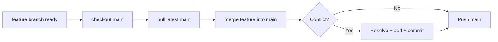
```mermaid
flowchart LR
    A[feature branch ready] --> B[checkout main]
    B --> C[pull latest main]
    C --> D[merge feature into main]
    D --> E{Conflict?}
    E -->|Yes| F[Resolve + add + commit]
    E -->|No| G[Push main]
    F --> G
```

#### Real-World Example

- Team member merged hotfixes into `main` this morning.
- You try merging your feature branch into yesterday's local `main`.
- Conflict appears in the same function.
- You pull latest `main`, re-merge, resolve file conflict, and push.

### Screenshots (Merge Conflicts)

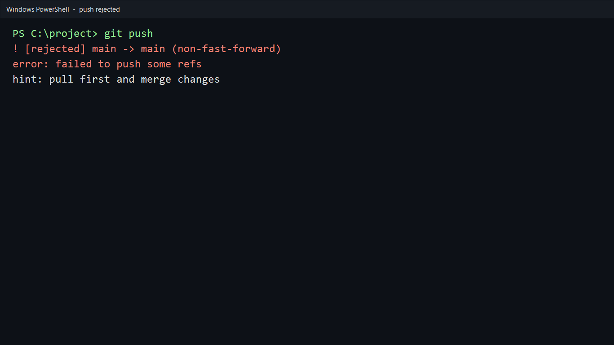
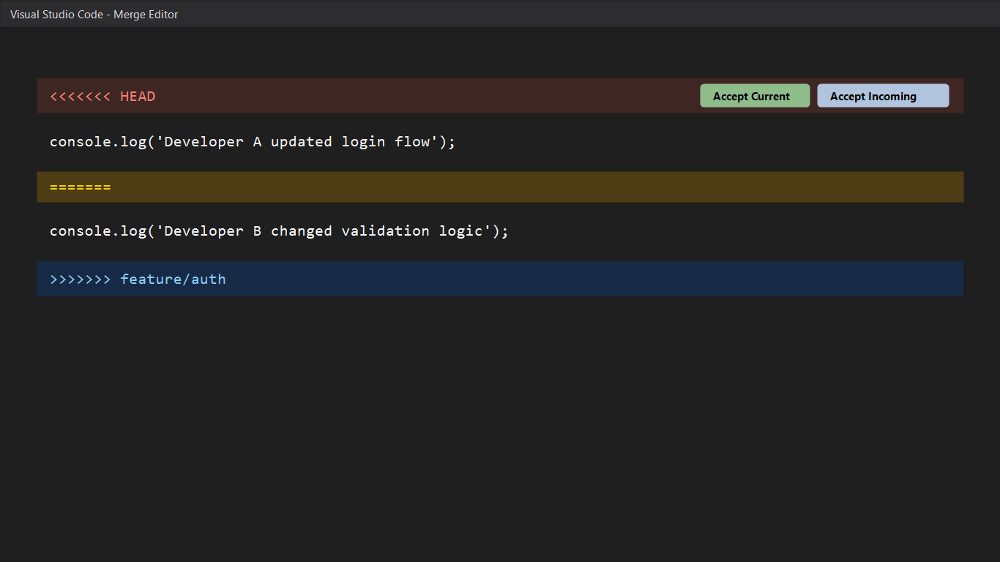

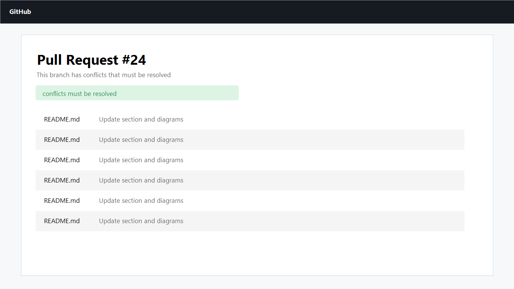

---

## 6. Git Stash

### What Is Git Stash?

Git Stash temporarily saves your uncommitted changes (staged and unstaged) to a stash stack. Your working directory is reverted to the last commit state, letting you switch contexts without committing incomplete work.

**When to use Git Stash:**
- You need to switch to another branch urgently but your current work is incomplete.
- You want to pull latest changes without committing a work-in-progress.
- You are juggling multiple incomplete tasks across different branches.

### Git Stash Commands

| Command | Description |
|---|---|
| `git stash` | Save all changes (staged + unstaged) to the stash stack |
| `git stash push -m "msg"` | Create a named stash |
| `git stash list` | List all stashes |
| `git stash show stash@{0}` | Inspect what a stash contains (summary) |
| `git stash show -p stash@{0}` | Show full diff of a stash |
| `git stash apply stash@{0}` | Apply a stash without removing it from the list |
| `git stash pop` | Apply the latest stash and remove it from the list |
| `git stash drop stash@{0}` | Delete a specific stash |
| `git stash clear` | Delete all stashes |

### `git stash apply` vs `git stash pop`

| Command | Applies Changes | Removes from Stash List |
|---|---|---|
| `git stash apply` | Yes | **No** — stash remains as backup |
| `git stash pop` | Yes | **Yes** — stash is deleted after apply |

Use `apply` when you want to keep the stash as a safety net. Use `pop` when you are done and want to clean up.

---

### Real-World Scenario 1: Urgent Bug Fix While Working on a Feature

**Situation:**
- You are working on `feature/user-profile` with uncommitted changes in `profile.js`.
- Your work is incomplete — you cannot commit yet.
- An urgent login bug is reported and must be fixed on the `main` branch immediately.

**The problem without stash:**
- Switching branches with uncommitted changes either fails (Git blocks it) or drags unrelated changes into the other branch.

**Solution — use `git stash` to park your changes:**

```bash
# Step 1: Check your current status
git status
# On branch feature/user-profile
# Changes not staged for commit:
#   modified: profile.js

# Step 2: Stash your work-in-progress
git stash
# Saved working directory and index state WIP on feature/user-profile: a3b2c1d Add profile layout

# Step 3: Confirm the working directory is clean
git status
# On branch feature/user-profile
# nothing to commit, working tree clean

# Step 4: Switch to main and create a hotfix branch
git checkout main
git checkout -b hotfix/login-crash

# Step 5: Fix the bug, stage, commit, and push
git add auth.js
git commit -m "fix: resolve login crash on null user session"
git push origin hotfix/login-crash

# Step 6: Return to your feature branch
git checkout feature/user-profile

# Step 7: Restore your stashed changes
git stash pop
# On branch feature/user-profile
# Changes not staged for commit:
#   modified: profile.js
# Dropped refs/stash@{0} (abc123...)

# Step 8: Continue working on your feature
```

#### Git Stash Workflow Diagram

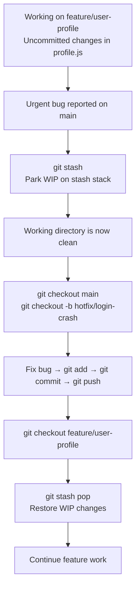
```mermaid
flowchart TD
    A["Working on feature/user-profile\nUncommitted changes in profile.js"] --> B[Urgent bug reported on main]
    B --> C["git stash\nPark WIP on stash stack"]
    C --> D[Working directory is now clean]
    D --> E["git checkout main\ngit checkout -b hotfix/login-crash"]
    E --> F["Fix bug → git add → git commit → git push"]
    F --> G[git checkout feature/user-profile]
    G --> H["git stash pop\nRestore WIP changes"]
    H --> I[Continue feature work]
```

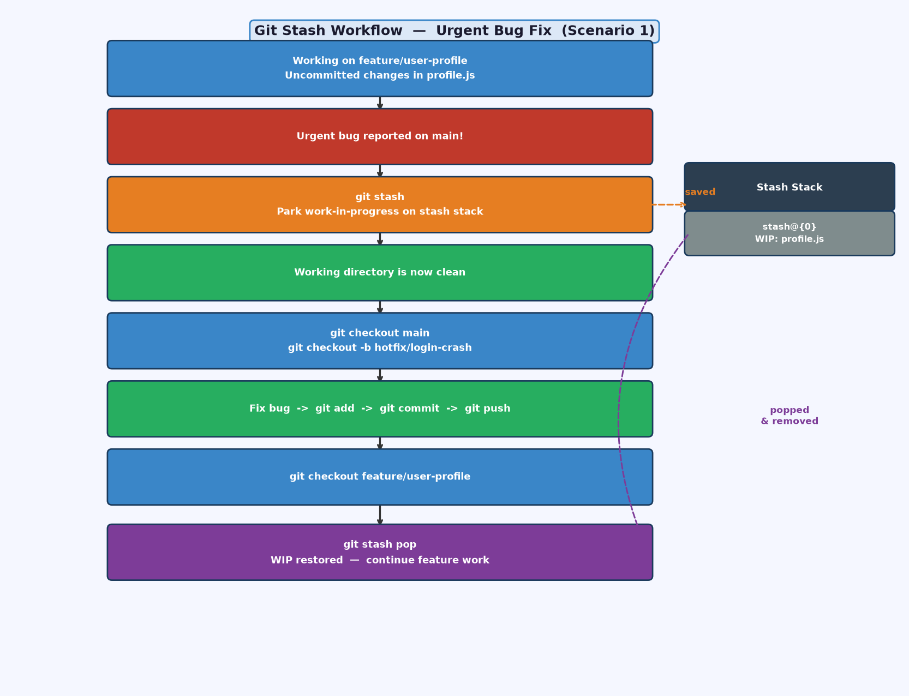

---

### Real-World Scenario 2: Managing Multiple Incomplete Tasks with Named Stashes

**Situation:**
- You are simultaneously working on three features across different branches.
- Each set of changes is incomplete and cannot be committed yet.
- You need to switch between tasks without losing any work.

**Solution — use named stashes with `git stash push -m`:**

```bash
# Step 1: Stash Task 1 work with a descriptive name
git stash push -m "feat: user profile avatar upload - wip"
# Saved working directory and index state On feature/user-profile: feat: user profile avatar upload - wip

# Step 2: Switch branch, work on Task 2, then stash it
git checkout feature/notifications
# (make changes to NotificationBell.js)
git stash push -m "feat: notification bell component - wip"

# Step 3: Switch branch, work on Task 3, then stash it
git checkout feature/sidebar
# (make changes to Sidebar.js)
git stash push -m "fix: sidebar nav active state - draft"

# Step 4: View all your stashes
git stash list
# stash@{0}: On feature/sidebar: fix: sidebar nav active state - draft
# stash@{1}: On feature/notifications: feat: notification bell component - wip
# stash@{2}: On feature/user-profile: feat: user profile avatar upload - wip

# Step 5: Inspect a specific stash before applying
git stash show stash@{1}
# NotificationBell.js | 35 +++++++++++++++
# 1 file changed, 35 insertions(+)

# Step 6: See the full code diff of a stash
git stash show -p stash@{1}

# Step 7: Apply stash@{2} (avatar work) without removing it from the list
git checkout feature/user-profile
git stash apply stash@{2}
# Changes restored. stash@{2} still exists in the stash list.

# Step 8: After finishing that work, remove the used stash manually
git stash drop stash@{2}
# Dropped stash@{2} (a1b2c3d...)

# --- OR ---

# Apply AND remove in one step using pop
git checkout feature/notifications
git stash pop stash@{1}
# Applies notification changes AND removes stash@{1} from the list

# Step 9: Once all tasks are done, clean up any remaining stashes
git stash clear
```

#### Multiple Stash Workflow Diagram

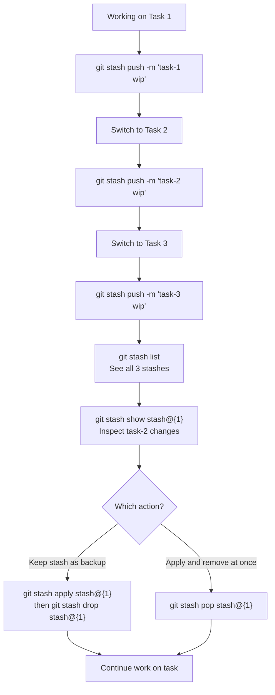
```mermaid
flowchart TD
    A[Working on Task 1] --> B["git stash push -m 'task-1 wip'"]
    B --> C[Switch to Task 2]
    C --> D["git stash push -m 'task-2 wip'"]
    D --> E[Switch to Task 3]
    E --> F["git stash push -m 'task-3 wip'"]
    F --> G["git stash list\nSee all 3 stashes"]
    G --> H["git stash show stash@{1}\nInspect task-2 changes"]
    H --> I{Which action?}
    I -->|"Keep stash as backup"| J["git stash apply stash@{1}\nthen git stash drop stash@{1}"]
    I -->|"Apply and remove at once"| K["git stash pop stash@{1}"]
    J --> L[Continue work on task]
    K --> L
```

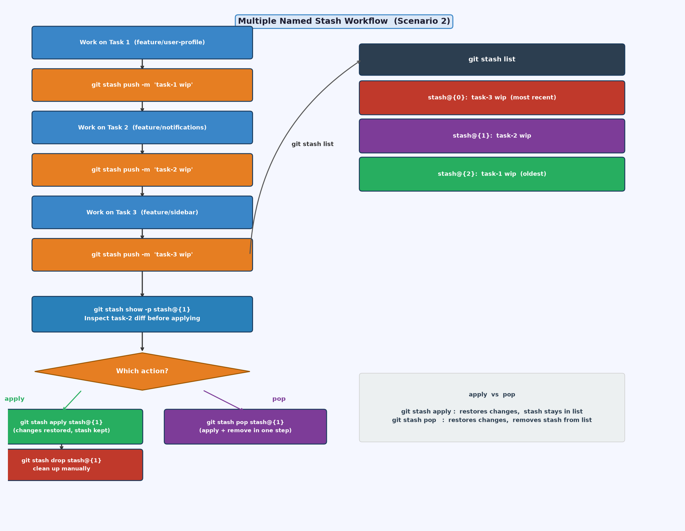

---

## 7. Git Rebase

### What Is Git Rebase?

Git Rebase moves or replays your branch commits on top of another branch tip. Unlike merge, it does not create a merge commit — instead, it rewrites your commit history to appear as if you started your work from the latest state of the target branch.

**When to use Git Rebase:**
- Your feature branch has fallen behind `main` and you want the latest changes before opening a pull request.
- You want a clean, linear commit history without merge commits cluttering the log.
- You are polishing commits before a code review.

**When NOT to use Git Rebase:**
- On branches that other teammates have already pulled from. Rebasing rewrites commit hashes and causes conflicts for others.
- Rule of thumb: **only rebase your own private or local feature branches.**

### Git Rebase Commands

| Command | Description |
|---|---|
| `git fetch origin` | Download latest remote changes without merging |
| `git rebase origin/main` | Replay your commits on top of origin/main |
| `git rebase --continue` | Resume rebase after resolving a conflict |
| `git rebase --abort` | Cancel rebase and restore original branch state |
| `git rebase --skip` | Skip the current conflicting commit |
| `git push --force-with-lease` | Safely push rebased (rewritten) history |

---

### Real-World Scenario: Updating a Feature Branch with Latest Main

**Situation:**
- You created `feature/payment-module` three days ago from `main`.
- Meanwhile, teammates merged new commits into `main`.
- You want to incorporate those updates before opening a pull request so your feature sits cleanly on top.

**Why use rebase instead of merge here?**
- Merging would create an extra merge commit that makes the PR diff harder to review.
- Rebase replays your feature commits on top of latest `main`, giving a straight history line.

```bash
# Step 1: Download latest remote changes (does not touch working files)
git fetch origin

# Step 2: Switch to your feature branch
git checkout feature/payment-module

# Step 3: Rebase your branch onto the latest origin/main
git rebase origin/main
# Output (clean case):
# Successfully rebased and updated refs/heads/feature/payment-module.

# --- If a conflict occurs during rebase ---

# Git pauses and shows:
# CONFLICT (content): Merge conflict in checkout.js
# error: could not apply a1b2c3d... feat: add card payment handler

# Step 4: Open the conflicted file and resolve it
# Remove <<<<<<<, =======, >>>>>>> markers — keep the correct final code

# Step 5: Stage the resolved file
git add checkout.js

# Step 6: Continue the rebase
git rebase --continue
# Git replays the next commit. Repeat Steps 4-6 for each conflict.

# To cancel the entire rebase and return to the original state:
git rebase --abort

# Step 7: Push your rebased branch
# A normal push is rejected because history was rewritten.
# --force-with-lease is safer than --force: it fails if someone else pushed first.
git push --force-with-lease origin feature/payment-module
```

### Git Rebase Workflow Diagram

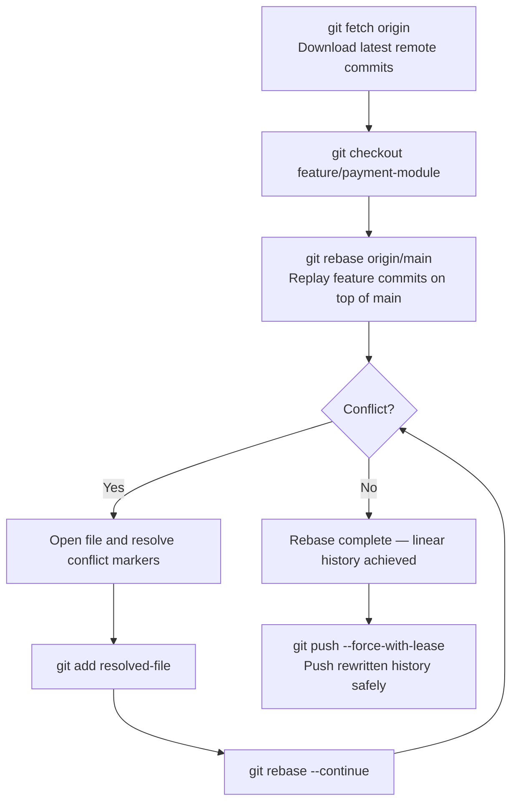
```mermaid
flowchart TD
    A["git fetch origin\nDownload latest remote commits"] --> B[git checkout feature/payment-module]
    B --> C["git rebase origin/main\nReplay feature commits on top of main"]
    C --> D{Conflict?}
    D -->|Yes| E[Open file and resolve conflict markers]
    E --> F[git add resolved-file]
    F --> G[git rebase --continue]
    G --> D
    D -->|No| H[Rebase complete — linear history achieved]
    H --> I["git push --force-with-lease\nPush rewritten history safely"]
```

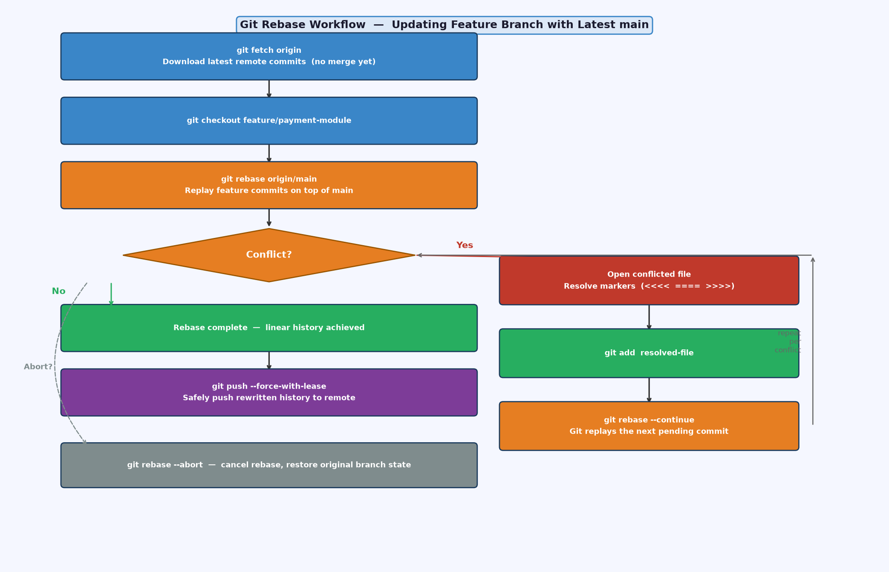

---

### Merge vs Rebase — Full Comparison

Both commands integrate changes from one branch to another, but the resulting history and workflow differ significantly.

#### How Merge Works

```bash
git checkout main
git merge feature/payment-module
```

- Git finds the common ancestor commit.
- Creates a new **merge commit** that ties both branch histories together.
- Preserves the full historical record of when branching and merging occurred.

#### How Rebase Works

```bash
git checkout feature/payment-module
git rebase main
```

- Takes each commit from your feature branch.
- Replays them one by one onto the tip of `main`.
- No extra merge commit. History becomes a single straight line.
- Commits are **re-created** with new hashes.

#### Merge vs Rebase Comparison Table

| Aspect | Merge | Rebase |
|---|---|---|
| History shape | Non-linear — branch and join are visible | Linear — single clean line |
| Extra commit | Yes — merge commit is added | No |
| Original commits preserved | Yes (same SHA hashes) | No (commits re-created, new hashes) |
| Safe on shared branches | Yes | No — never rebase public branches |
| Best for | Final integration / closing PRs | Updating local feature branch before PR |
| Conflict handling | One resolution pass at merge point | Resolved per-commit during replay |

#### Real-World Team Convention

> Use **merge** when closing a pull request into `main` — it preserves the complete branch history for future audit.
> Use **rebase** when updating your local feature branch with latest `main` before opening a PR — it keeps your changes clean and easy to review.

#### Merge vs Rebase — Git Graph Diagram

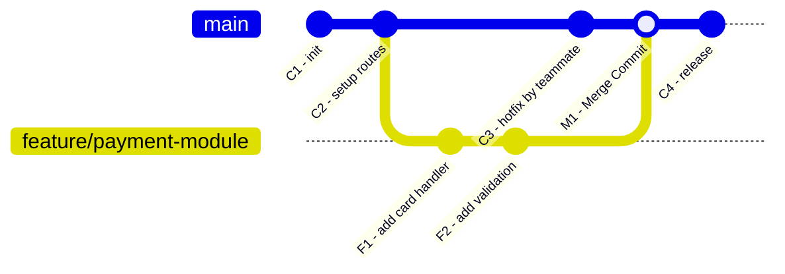
```mermaid
gitGraph
   commit id: "C1 - init"
   commit id: "C2 - setup routes"
   branch feature/payment-module
   commit id: "F1 - add card handler"
   commit id: "F2 - add validation"
   checkout main
   commit id: "C3 - hotfix by teammate"
   merge feature/payment-module id: "M1 - Merge Commit"
   commit id: "C4 - release"
```

#### Before and After Rebase Diagram

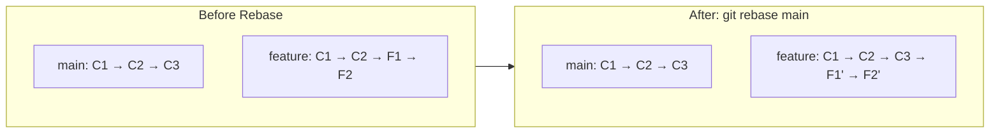
```mermaid
flowchart LR
    subgraph Before["Before Rebase"]
        direction TB
        b1["main:    C1 → C2 → C3"]
        b2["feature: C1 → C2 → F1 → F2"]
    end
    subgraph After["After: git rebase main"]
        direction TB
        a1["main:    C1 → C2 → C3"]
        a2["feature: C1 → C2 → C3 → F1' → F2'"]
    end
    Before --> After
```

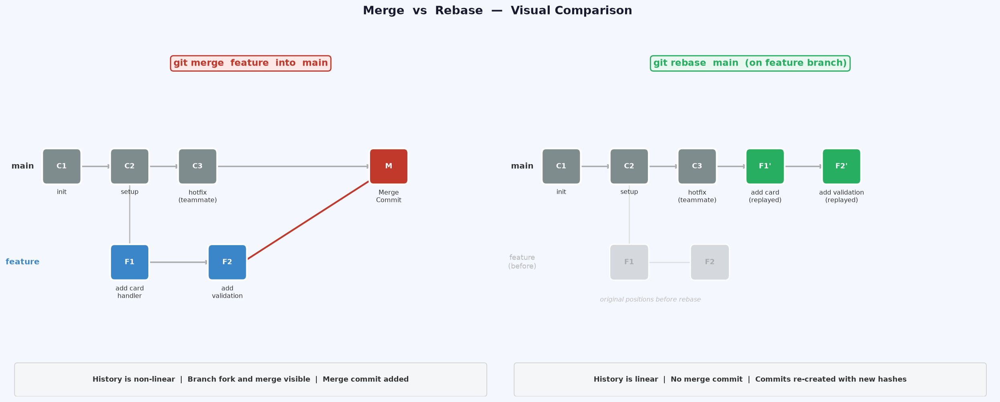

---

## 8. Git Cherry-pick

### What Is Git Cherry-pick?

`git cherry-pick` copies one or more specific commits from any branch and applies them to your current branch. Unlike merge or rebase, it does not bring the entire branch history — only the selected commit(s) are applied.

**When to use Cherry-pick:**
- A bug fix on a `release` branch must also be applied to `main` without merging the entire release branch.
- A commit was accidentally made on the wrong branch and needs to be moved.
- You need one specific feature commit from a colleague's unfinished branch without taking all their incomplete work.

**When NOT to use Cherry-pick:**
- When you need all commits from a branch (use merge instead).
- Cherry-picking too many commits creates duplicated history and makes the graph confusing.

### Git Cherry-pick Commands

| Command | Description |
|---|---|
| `git cherry-pick <hash>` | Apply a single commit to the current branch |
| `git cherry-pick <h1> <h2>` | Apply multiple specific commits |
| `git cherry-pick <h1>^..<h2>` | Apply an inclusive range of commits |
| `git cherry-pick --no-commit <hash>` | Apply changes to working directory without auto-committing |
| `git cherry-pick --continue` | Resume after resolving a conflict |
| `git cherry-pick --abort` | Cancel and restore branch to pre-cherry-pick state |
| `git cherry-pick --skip` | Skip the current conflicting commit and move to next |

---

### Real-World Scenario: Applying a Bug Fix from Release Branch to Main

**Situation:**
- Your team has a `release/v2.1` branch with several recent commits.
- One commit (`a7f3e91`) fixes a critical login crash.
- The other commits are new features that are NOT yet approved for `main`.
- You need the bug fix on `main` right now.

**Problem:**
- Merging `release/v2.1` into `main` brings ALL commits including unapproved features.
- You only want commit `a7f3e91`.

**Solution — cherry-pick only that one commit:**

```bash
# Step 1: Find the commit hash on the release branch
git log release/v2.1 --oneline
# a7f3e91 fix: resolve login crash on null session token   <-- want this
# 3b2c1d0 feat: add dark mode toggle                       <-- NOT approved
# 8e9f0a2 feat: redesign checkout page                     <-- NOT approved
# d4c3b2a chore: update dependencies                       <-- NOT approved

# Step 2: Switch to the target branch
git checkout main

# Step 3: Cherry-pick only the bug fix commit
git cherry-pick a7f3e91
# Output (clean case):
# [main c4d5e6f] fix: resolve login crash on null session token
#  Date: Mon Jul 14 10:22:31 2025 +0530
#  1 file changed, 4 insertions(+), 1 deletion(-)

# Step 4: Verify the commit is now on main
git log --oneline -5
# c4d5e6f fix: resolve login crash on null session token
# (previous main commits below)

# Step 5: Push to remote
git push origin main
```

#### Cherry-picking Multiple Commits

```bash
# Apply two specific commits (in order)
git cherry-pick a7f3e91 d4c3b2a

# Apply an inclusive range (from a7f3e91 through d4c3b2a)
git cherry-pick a7f3e91^..d4c3b2a
```

#### Resolving Conflicts During Cherry-pick

```bash
# When a conflict occurs, Git pauses:
# CONFLICT (content): Merge conflict in auth.js
# error: could not apply a7f3e91... fix: resolve login crash on null session token

# Step 1: Open the conflicted file and resolve manually
# Remove <<<<<<<, =======, >>>>>>> markers and finalize the correct code

# Step 2: Stage the resolved file
git add auth.js

# Step 3: Continue the cherry-pick
git cherry-pick --continue
# Git opens the editor to confirm or edit the commit message

# To abort and return to the state before cherry-pick started:
git cherry-pick --abort

# To skip the current conflicting commit and move to the next:
git cherry-pick --skip
```

### Git Cherry-pick Workflow Diagram

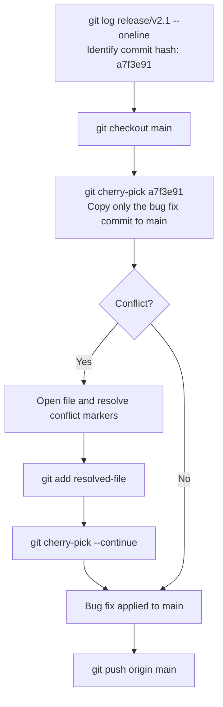
```mermaid
flowchart TD
    A["git log release/v2.1 --oneline\nIdentify commit hash: a7f3e91"] --> B[git checkout main]
    B --> C["git cherry-pick a7f3e91\nCopy only the bug fix commit to main"]
    C --> D{Conflict?}
    D -->|Yes| E[Open file and resolve conflict markers]
    E --> F[git add resolved-file]
    F --> G[git cherry-pick --continue]
    G --> H[Bug fix applied to main]
    D -->|No| H
    H --> I[git push origin main]
```

### Cherry-pick Branch Diagram

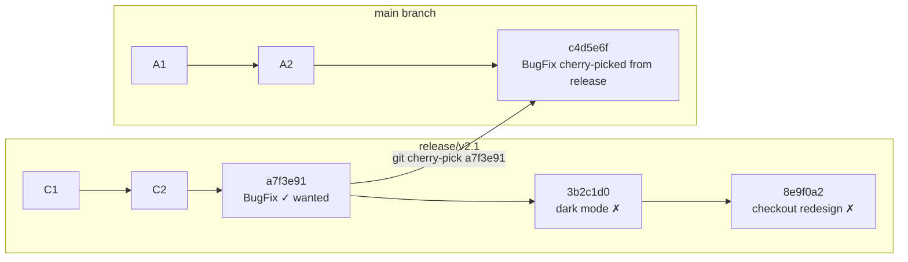
```mermaid
flowchart LR
    subgraph Release["release/v2.1"]
        R1[C1] --> R2[C2] --> R3["a7f3e91\nBugFix ✓ wanted"] --> R4["3b2c1d0\ndark mode ✗"] --> R5["8e9f0a2\ncheckout redesign ✗"]
    end
    subgraph Main["main branch"]
        M1[A1] --> M2[A2] --> M3["c4d5e6f\nBugFix cherry-picked from release"]
    end
    R3 -->|"git cherry-pick a7f3e91"| M3
```

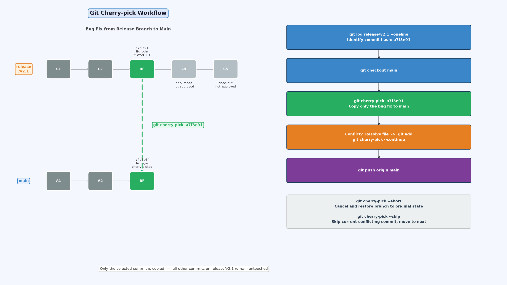

---

## 9. Visual Summary Pack

This section gives reusable diagrams for teaching, onboarding, and presentations.

### End-to-End Git Flow

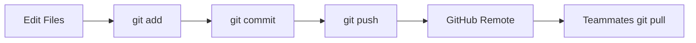
```mermaid
flowchart LR
    A[Edit Files] --> B[git add]
    B --> C[git commit]
    C --> D[git push]
    D --> E[GitHub Remote]
    E --> F[Teammates git pull]
```

### Branching Model Diagram

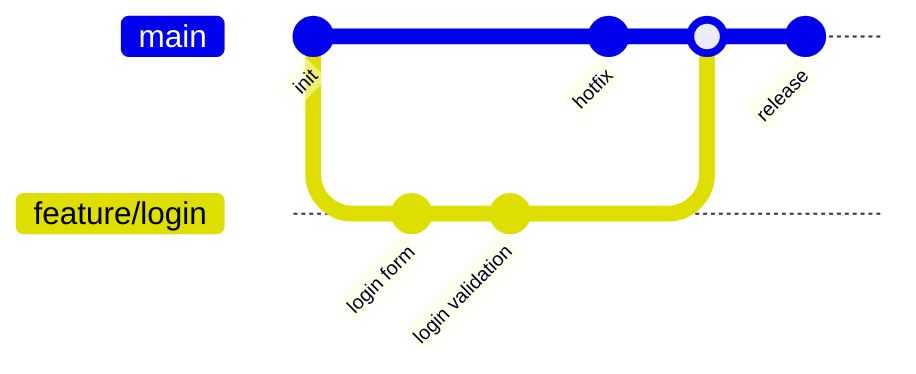
```mermaid
gitGraph
    commit id: "init"
    branch feature/login
    commit id: "login form"
    commit id: "login validation"
    checkout main
    commit id: "hotfix"
    merge feature/login
    commit id: "release"
```

### Pull Request Lifecycle Diagram

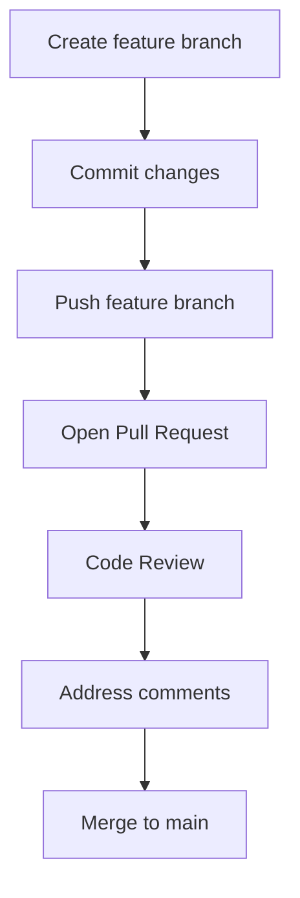
```mermaid
flowchart TD
    A[Create feature branch] --> B[Commit changes]
    B --> C[Push feature branch]
    C --> D[Open Pull Request]
    D --> E[Code Review]
    E --> F[Address comments]
    F --> G[Merge to main]
```

### Screenshots (Visual Pack)


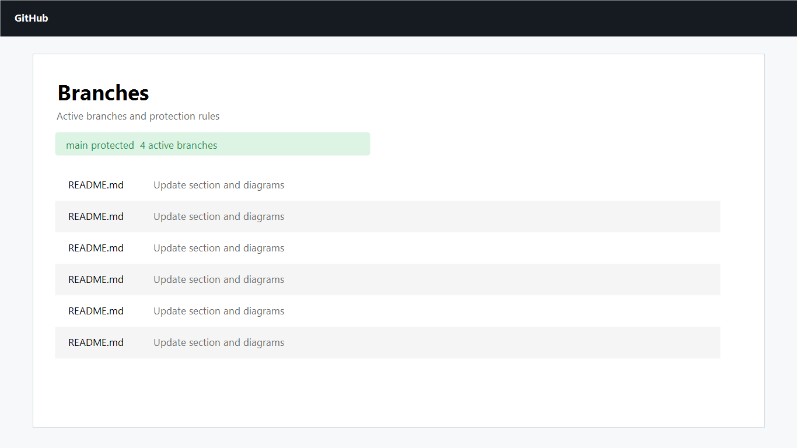
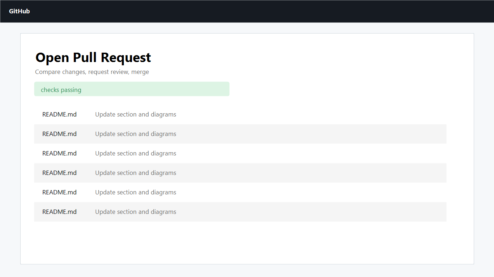


---

## 10. Final Reference Section

### 10.1 Git Command Cheat Sheet

#### Setup
```bash
git init
git clone <repo_url>
git remote -v
git remote add origin <repo_url>
```

#### Daily Work
```bash
git status
git add .
git add <file_name>
git commit -m "message"
git pull
git push
```

#### Branching
```bash
git branch
git branch <branch_name>
git checkout <branch_name>
git checkout -b <branch_name>
git merge <branch_name>
```

#### History and Inspection
```bash
git log --oneline --graph --decorate
git diff
git show <commit_id>
```

#### Undo and Fix
```bash
git restore <file_name>
git restore --staged <file_name>
git reset --soft HEAD~1
git revert <commit_id>
```

#### Stash
```bash
git stash
git stash push -m "description"
git stash list
git stash show stash@{0}
git stash show -p stash@{0}
git stash apply stash@{0}
git stash pop
git stash drop stash@{0}
git stash clear
```

#### Rebase
```bash
git fetch origin
git rebase origin/main
git rebase --continue
git rebase --abort
git rebase --skip
git push --force-with-lease
```

#### Cherry-pick
```bash
git cherry-pick <commit-hash>
git cherry-pick <hash1> <hash2>
git cherry-pick <hash1>^..<hash2>
git cherry-pick --no-commit <hash>
git cherry-pick --continue
git cherry-pick --abort
git cherry-pick --skip
```

---

### 10.2 Common Git Errors and Fixes

1. Error: `fatal: not a git repository`
- Cause: You are outside a Git project folder.
- Fix: Move into the correct folder or run `git init`.

2. Error: `remote origin already exists`
- Cause: Remote named `origin` is already configured.
- Fix:
```bash
git remote remove origin
git remote add origin <repo_url>
```

3. Error: `non-fast-forward` push rejected
- Cause: Remote has new commits you do not have locally.
- Fix:
```bash
git pull --rebase
git push
```

4. Error: `merge conflict`
- Cause: Same lines changed in different commits.
- Fix: Resolve markers, then:
```bash
git add .
git commit
git push
```

5. Error: `detached HEAD`
- Cause: Checked out a commit instead of a branch.
- Fix:
```bash
git checkout <branch_name>
```

6. Error: `src refspec main does not match any`
- Cause: No commits yet or wrong branch name.
- Fix:
```bash
git commit -m "Initial commit"
git branch -M main
git push -u origin main
```

7. Error: `Permission denied (publickey)`
- Cause: SSH key missing or not added to GitHub.
- Fix: Add SSH key to GitHub, or use HTTPS remote URL.

8. Error: `Authentication failed`
- Cause: Invalid credentials/token.
- Fix: Use a valid GitHub personal access token for HTTPS.

---

### 10.3 Git Best Practices

1. Commit small, logical changes.
2. Write clear commit messages with action words.
3. Pull before you push.
4. Use branches for every feature or bugfix.
5. Never commit secrets (API keys, passwords).
6. Review `git diff` before committing.
7. Keep `main` stable and deployable.
8. Use pull requests for team collaboration.
9. Resolve conflicts carefully, then test.
10. Tag releases for important versions.

Suggested commit style examples:
- `feat: add login validation`
- `fix: handle empty array case`
- `docs: update setup instructions`

---

### 10.4 Git Interview Questions with Answers

1. What is Git?
- Git is a distributed version control system that tracks file changes and supports collaboration.

2. What is the difference between Git and GitHub?
- Git is the tool for version control; GitHub is a platform to host and collaborate on Git repositories.

3. What is a commit?
- A commit is a snapshot of staged changes stored in repository history.

4. What is the staging area?
- It is an intermediate area where you prepare selected changes before commit.

5. What does `git init` do?
- It creates a new Git repository in the current folder.

6. What does `git clone` do?
- It copies a remote repository to your local machine, including history and branches.

7. What is the purpose of `git add`?
- It moves file changes to staging for the next commit.

8. What does `git status` show?
- It shows branch info and file states: untracked, modified, staged.

9. What does `git push` do?
- It uploads local commits to the remote repository.

10. What does `git pull` do?
- It fetches remote changes and merges them into your current local branch.

11. What is a branch?
- A branch is an independent line of development.

12. Why use branches?
- They isolate feature work and reduce risk to the main codebase.

13. What is a merge conflict?
- A conflict occurs when Git cannot auto-merge changes to the same content.

14. How do you resolve merge conflicts?
- Edit conflicted files, remove conflict markers, stage resolved files, and commit.

15. What is the difference between `git fetch` and `git pull`?
- `fetch` only downloads changes; `pull` downloads and integrates them.

16. What is HEAD in Git?
- HEAD points to your current checked-out commit or branch.

17. What does `git checkout` do?
- It switches branches or restores specific file states.

18. What is `origin`?
- `origin` is the default name for the remote repository.

19. What is the use of `-u` in `git push -u origin main`?
- It sets upstream tracking between local and remote branches.

20. What are best practices for commit messages?
- Keep them concise, clear, and action-oriented; describe what and why.

21. What is `git stash` and when would you use it?
- `git stash` temporarily saves uncommitted changes so you can switch branches or contexts without losing work. Use it when you need to handle an urgent task before your current work is ready to commit.

22. What is the difference between `git stash apply` and `git stash pop`?
- Both restore stashed changes. `apply` keeps the stash entry in the list as a backup. `pop` applies the stash and removes it from the list in one step.

23. How do you create a named stash and why is it useful?
- Use `git stash push -m "description"`. Named stashes are useful when you have multiple stashes so you can identify each one clearly with `git stash list` without guessing from the timestamp.

24. What is `git rebase` and how does it differ from `git merge`?
- Both integrate changes from one branch to another. Merge creates a new merge commit and preserves non-linear history. Rebase replays your commits on top of the target branch tip, producing a linear history with no merge commit.

25. When should you NOT use `git rebase`?
- Never rebase branches that other developers have already pulled from. Rebase rewrites commit hashes, which causes conflicts for teammates who have the old commits locally.

26. What does `git push --force-with-lease` do and why is it safer than `--force`?
- Both forcefully overwrite the remote branch. `--force-with-lease` adds a safety check: it fails if someone else has pushed new commits to the remote since your last fetch, preventing you from accidentally overwriting their work.

27. What is `git cherry-pick` and when would you use it?
- `git cherry-pick <hash>` applies one specific commit from any branch to your current branch. Use it when you need a targeted change (such as a bug fix) from another branch without merging all of its commits.

28. How do you resolve a conflict during a `git cherry-pick`?
- Edit the conflicted file to remove conflict markers, stage it with `git add`, then run `git cherry-pick --continue`. To cancel entirely, use `git cherry-pick --abort`.

29. What is the difference between `git cherry-pick` and `git merge`?
- Merge integrates the entire history of a branch. Cherry-pick copies only specific selected commits. Use cherry-pick when you want precise control over which changes to apply.

30. What does `git rebase --continue` do?
- After resolving a conflict during a rebase, you stage the resolved file and run `git rebase --continue` to tell Git to replay the next pending commit in the sequence.

---

## Quick Start Recap

If you want just the minimum start flow:

```bash
git init
git add .
git commit -m "Initial commit"
git branch -M main
git remote add origin https://github.com/AbhishekDhone7/Practice.git
git push -u origin main
```

Then daily:

```bash
git add .
git commit -m "Your message"
git push
```

You now have a complete beginner-to-intermediate Git foundation with practical conflict handling and collaboration workflows.


