# Git for Beginners: Professional Practical Guide

## Who This Guide Is For
This guide is written for beginners who want to learn Git in a practical, real-world way. It explains concepts, commands, workflows, common problems, and team scenarios using diagrams and examples.

---

## 1. Introduction

### What Is Git?
Git is a distributed version control system used to track changes in files over time. It helps you:

- Save snapshots of your code (commits)
- Work safely on features using branches
- Collaborate with teammates
- Restore old versions when needed

Think of Git as a timeline of your project where each commit is a checkpoint.

### Git vs GitHub

| Topic | Git | GitHub |
|---|---|---|
| What it is | A version control tool | A cloud platform for hosting Git repositories |
| Runs where | Local machine | Remote server (web) |
| Internet required | No (for local work) | Yes (for push/pull, collaboration) |
| Main use | Track and manage code history | Team collaboration, pull requests, CI/CD, code review |

### Git Workflow Overview
A beginner-friendly view of how changes move through Git:

1. You edit files in the **Working Directory**.
2. You choose files for the next commit in the **Staging Area**.
3. You create a commit in the **Local Repository**.
4. You push commits to the **Remote Repository** (for example GitHub).

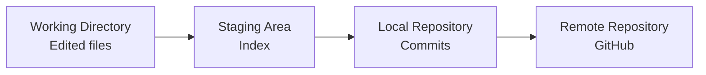

### Repository Structure Diagram

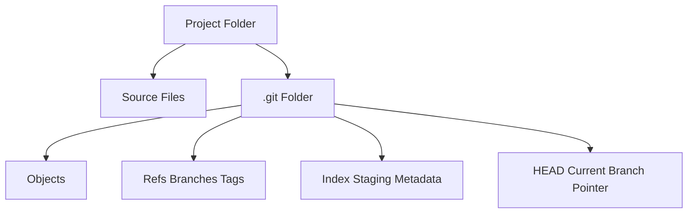

### Screenshot Placeholders (Introduction)
Replace these with real PNG images:


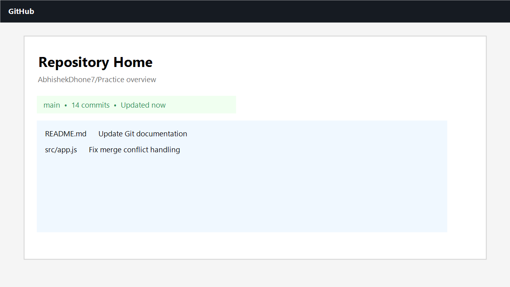
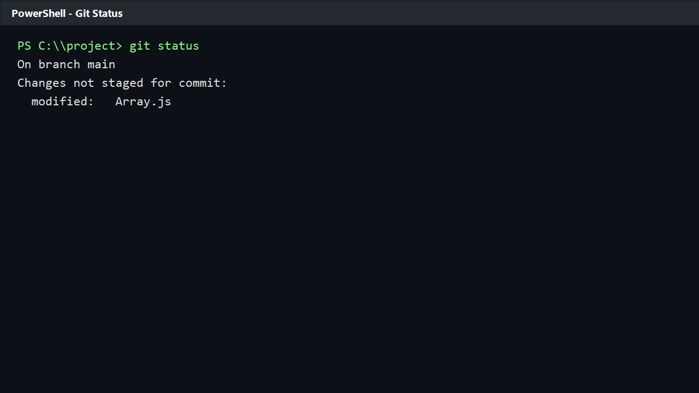

---

## 2. Initialize a Repository

You provided this command sequence:

```bash
git init
git add .
git add <file_name>
git commit -m "Commit message"
git branch -M main
git remote add origin https://github.com/AbhishekDhone7/Practice.git
git push -u origin main
git push
```

Below is the meaning of each command, expected output examples, and where it fits in the workflow.

### Step-by-Step with Command Explanations

#### 2.1 Initialize Git
```bash
git init
```
What it does:
- Creates a new `.git` folder in your current project.
- Starts version control for that folder.

Expected output (example):
```text
Initialized empty Git repository in C:/Users/Abhid/Desktop/New folder (2)/.git/
```

#### 2.2 Stage All Files
```bash
git add .
```
What it does:
- Adds all new and modified files in the current directory to the staging area.

Expected output:
- Usually no output if successful.

#### 2.3 Stage a Specific File
```bash
git add <file_name>
```
What it does:
- Adds only one specific file to staging.
- Useful when you want to commit changes in smaller, focused batches.

Example:
```bash
git add Array.js
```

Expected output:
- Usually no output if successful.

#### 2.4 Create a Commit
```bash
git commit -m "Commit message"
```
What it does:
- Creates a snapshot from staged files in your local repository.

Expected output (example):
```text
[main (root-commit) a1b2c3d] Initial commit
 3 files changed, 120 insertions(+)
 create mode 100644 Array.js
 create mode 100644 dummy2.js
 create mode 100644 Hoisting-TDZ.js
```

#### 2.5 Rename Current Branch to main
```bash
git branch -M main
```
What it does:
- Renames the current branch to `main`.
- `-M` forces rename if needed.

Expected output:
- Usually no output if successful.

#### 2.6 Add Remote Repository
```bash
git remote add origin https://github.com/AbhishekDhone7/Practice.git
```
What it does:
- Connects your local repo to a remote named `origin`.

Expected output:
- Usually no output if successful.
- If remote exists:
```text
error: remote origin already exists.
```

#### 2.7 Push First Time and Set Upstream
```bash
git push -u origin main
```
What it does:
- Pushes your `main` branch to GitHub.
- Sets upstream tracking so future `git push` and `git pull` work without extra branch names.

Expected output (example):
```text
Enumerating objects: 8, done.
Counting objects: 100% (8/8), done.
Writing objects: 100% (8/8), 1.20 KiB | 1.20 MiB/s, done.
Total 8 (delta 0), reused 0 (delta 0), pack-reused 0
To https://github.com/AbhishekDhone7/Practice.git
 * [new branch]      main -> main
branch 'main' set up to track 'origin/main'.
```

#### 2.8 Push Future Commits
```bash
git push
```
What it does:
- Pushes local commits to the configured upstream branch.

Expected output (example):
```text
Everything up-to-date
```

### Initialization Workflow Diagram

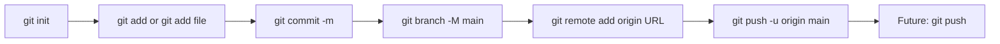

### State Transition Diagram

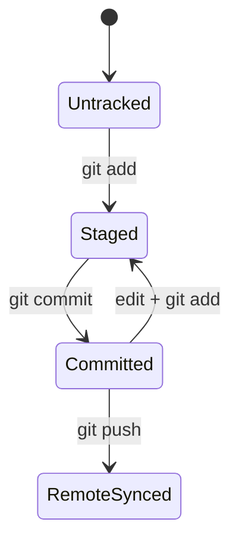

### Screenshot Placeholders (Initialize Repository)


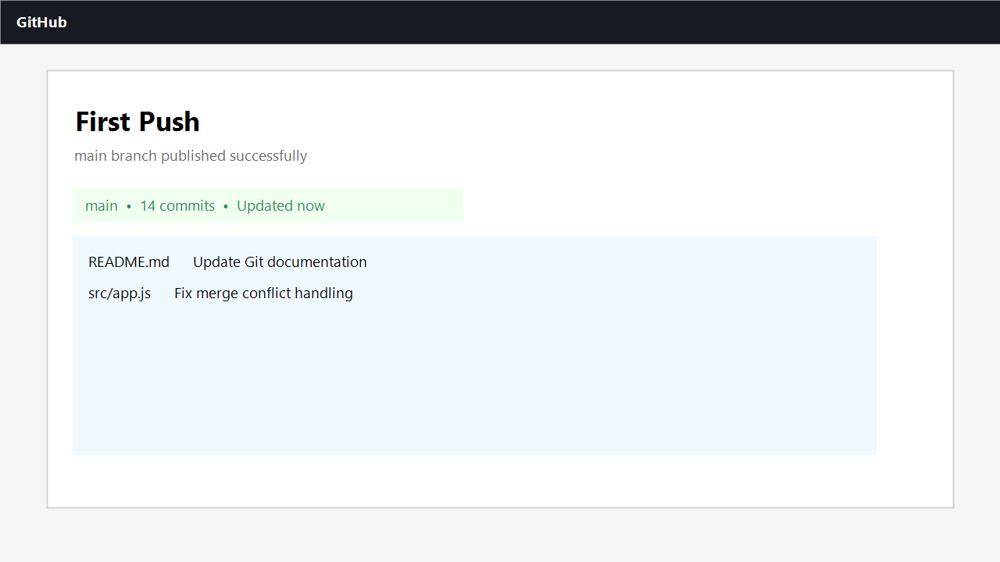

---

## 3. Daily Workflow

You provided:

```bash
git add .
git add <file_name>
git commit -m "Commit message"
git push
```

### Recommended Daily Loop

1. Pull latest code before starting work:
```bash
git pull
```
2. Edit files.
3. Stage changes:
```bash
git add .
# or
git add <file_name>
```
4. Commit with a meaningful message:
```bash
git commit -m "Fix array edge case in merge function"
```
5. Push commits:
```bash
git push
```

### Real-World Example

Scenario:
- You fixed a bug in `Array.js` where empty arrays caused errors.

Commands:
```bash
git add Array.js
git commit -m "Fix crash when array is empty"
git push
```

Result:
- Teammates can pull your fix immediately.
- Your change is documented with a clear commit message.

### Daily Workflow Diagram

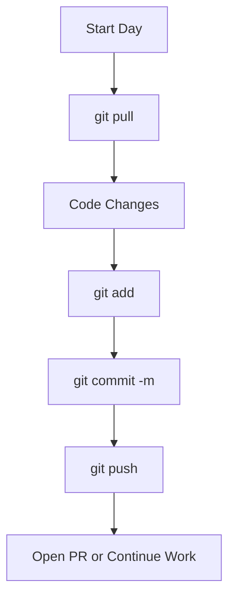

### Screenshot Placeholders (Daily Workflow)

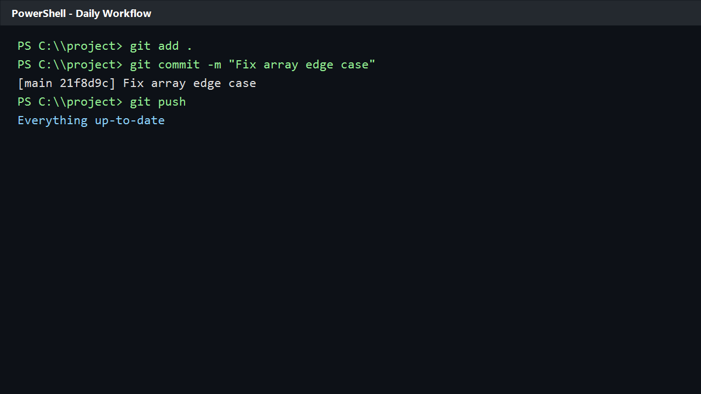

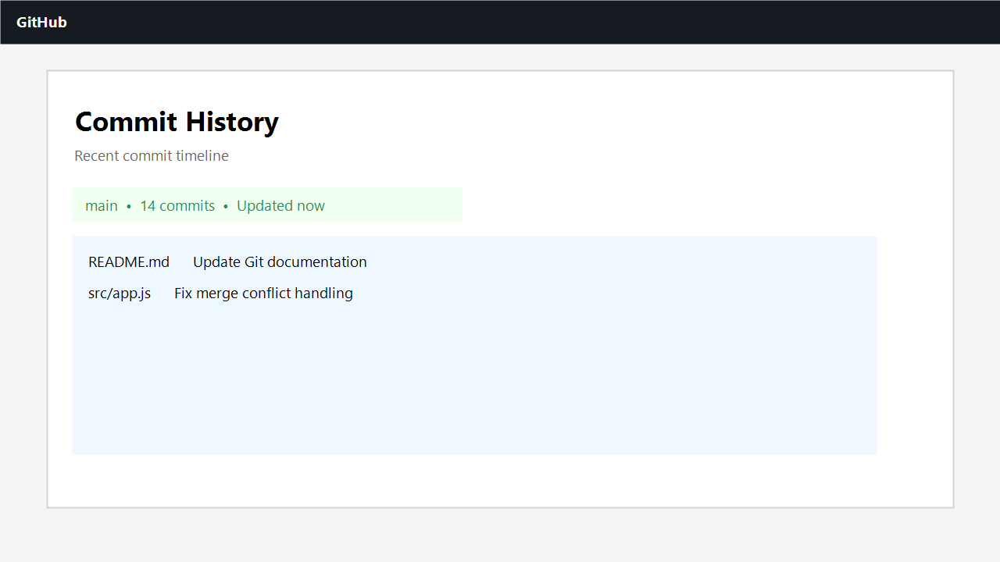

---

## 4. Clone an Existing Repository

You provided:

```bash
git clone https://github.com/AbhishekDhone7/Practice.git
git fetch
git checkout abhishek_dhone
```

### 4.1 Clone
```bash
git clone https://github.com/AbhishekDhone7/Practice.git
```
What it does:
- Downloads full repository history and files from remote.
- Creates a local folder named `Practice`.
- Automatically sets `origin` remote.

Expected output (example):
```text
Cloning into 'Practice'...
remote: Enumerating objects: 120, done.
remote: Counting objects: 100% (120/120), done.
Receiving objects: 100% (120/120), 45.33 KiB | 2.26 MiB/s, done.
Resolving deltas: 100% (35/35), done.
```

### 4.2 Fetch
```bash
git fetch
```
What it does:
- Downloads new commits/branches from remote.
- Does not modify your current working files.
- Safe way to check updates before merge.

Expected output:
- May show updated refs, for example:
```text
From https://github.com/AbhishekDhone7/Practice
   a1b2c3d..e4f5g6h  main           -> origin/main
 * [new branch]      abhishek_dhone -> origin/abhishek_dhone
```

### 4.3 Checkout
```bash
git checkout abhishek_dhone
```
What it does:
- Switches your working branch to `abhishek_dhone`.
- If only remote branch exists, use:
```bash
git checkout -b abhishek_dhone origin/abhishek_dhone
```

Expected output (example):
```text
Switched to branch 'abhishek_dhone'
Your branch is up to date with 'origin/abhishek_dhone'.
```

### Clone-Fetch-Checkout Diagram

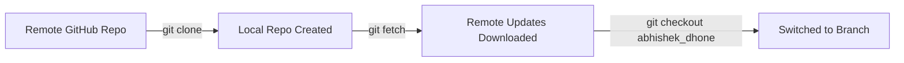

### Branch Tracking Diagram

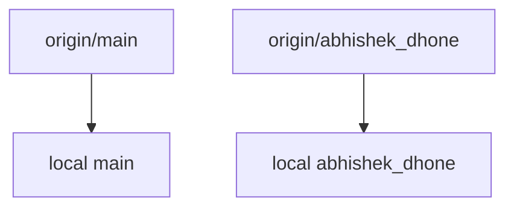

### Screenshot Placeholders (Clone)

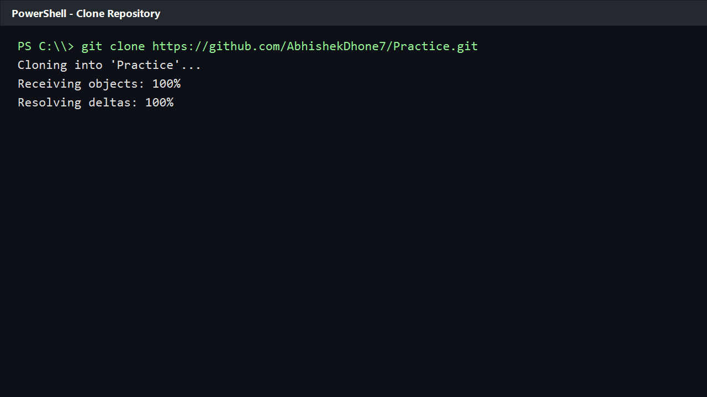


---

## 5. Merge Conflicts

A merge conflict happens when Git cannot automatically combine changes because the same lines were modified differently.

### How a Conflict Looks in a File

```text
<<<<<<< HEAD
console.log("Developer A version");
=======
console.log("Developer B version");
>>>>>>> feature-branch
```

You must edit and keep the correct final code, then stage and commit.

---

### Scenario A: Two Developers on the Same Branch

#### Situation
- Developer A and Developer B both work on `main`.
- Developer A pushes first.
- Developer B tries to push old local commits without pulling latest changes.

#### What Developer B sees

```text
! [rejected]        main -> main (non-fast-forward)
error: failed to push some refs to 'https://github.com/AbhishekDhone7/Practice.git'
hint: Updates were rejected because the remote contains work that you do not have locally.
```

#### Resolve using your requested flow

```bash
git pull
git add .
git commit
git push
```

Step explanation:
1. `git pull`: brings latest remote commits and tries automatic merge.
2. If conflicts occur, open conflicted files and resolve manually.
3. `git add .`: marks resolved files.
4. `git commit`: creates merge commit (if needed).
5. `git push`: sends merged result to remote.

#### Diagram: Same Branch Conflict

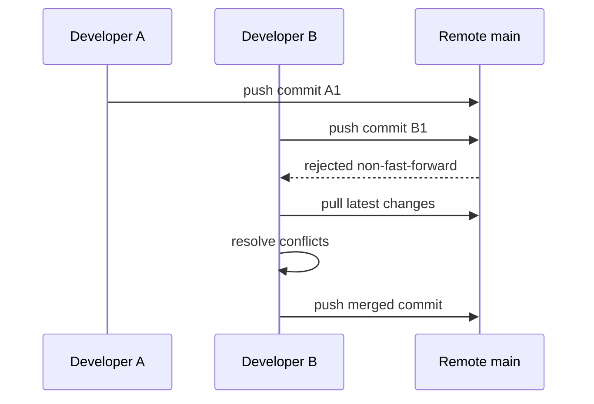

#### Command Flow Diagram

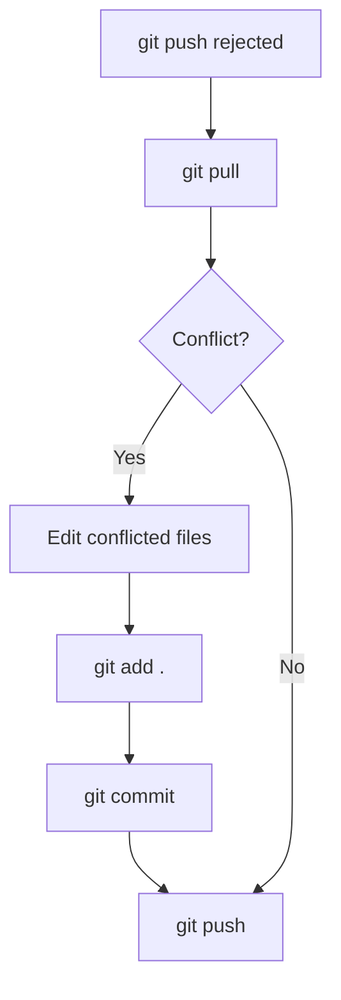

---

### Scenario B: Merging Branches Without Updating Target Branch

#### Situation
- You have `feature` branch.
- You merge into `main`, but local `main` is outdated.
- Result: potential merge conflicts or stale merges.

#### Correct Process

```bash
# Move to target branch
git checkout main

# Update target branch first
git pull origin main

# Merge feature branch
git merge feature

# If conflicts occur, resolve them in files
# Then stage, commit, push
git add .
git commit -m "Resolve merge conflicts between main and feature"
git push origin main
```

#### Diagram: Outdated Target Branch Merge

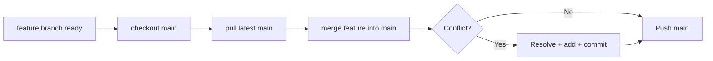

#### Real-World Example

- Team member merged hotfixes into `main` this morning.
- You try merging your feature branch into yesterday's local `main`.
- Conflict appears in the same function.
- You pull latest `main`, re-merge, resolve file conflict, and push.

### Screenshot Placeholders (Merge Conflicts)

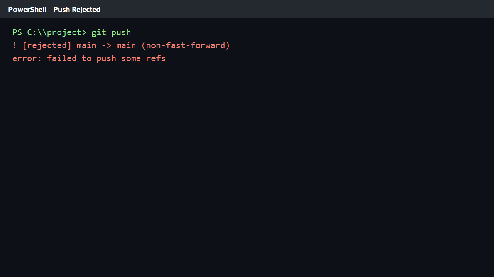

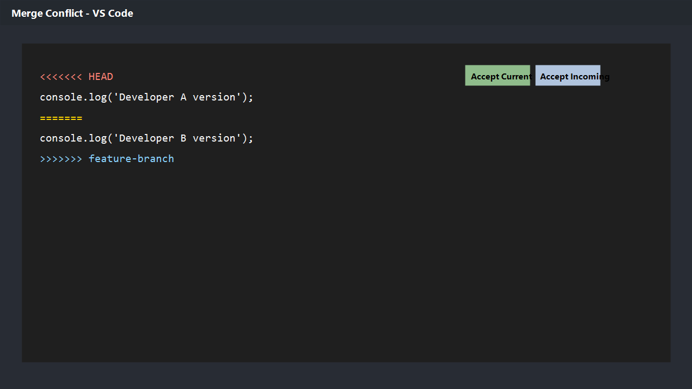
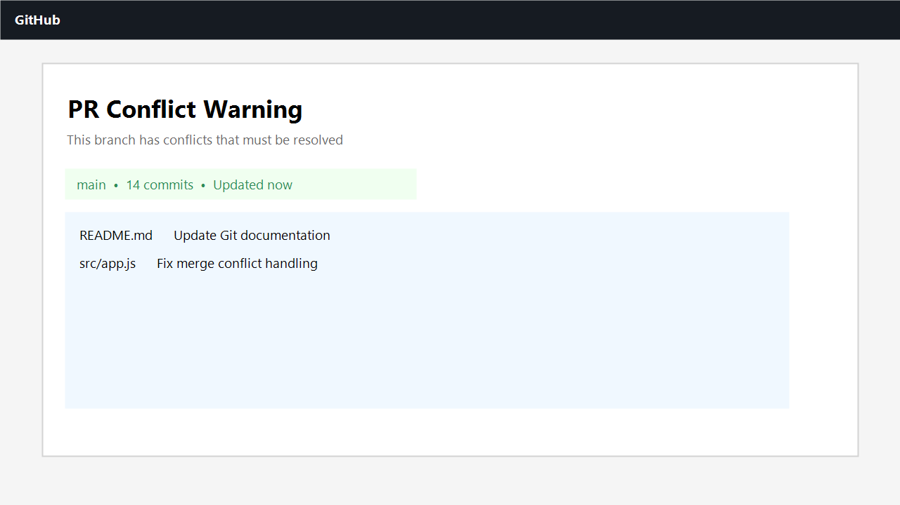

---

## 6. Visual Summary Pack

This section gives reusable diagrams for teaching, onboarding, and presentations.

### End-to-End Git Flow

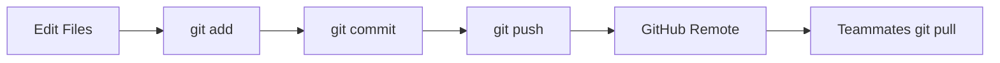

### Branching Model Diagram

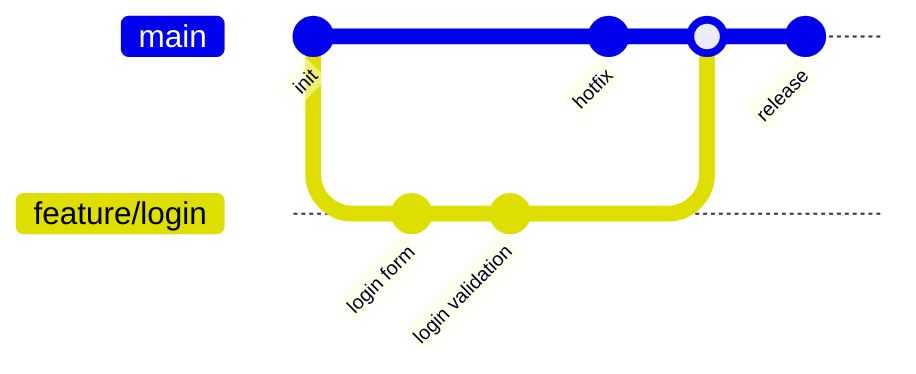

### Pull Request Lifecycle Diagram

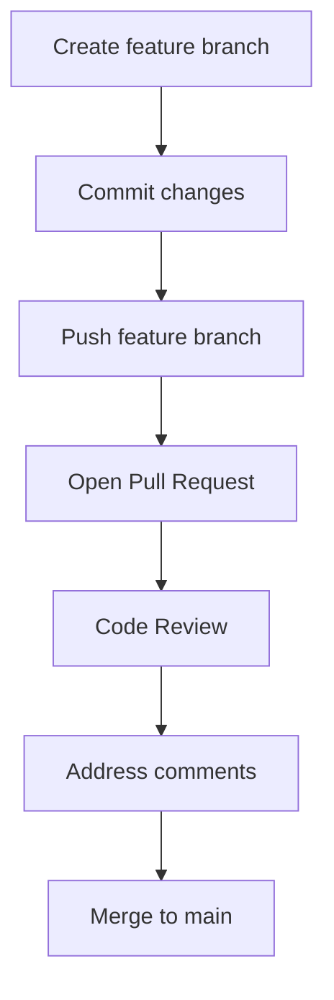

### Screenshot Placeholders (Visual Pack)

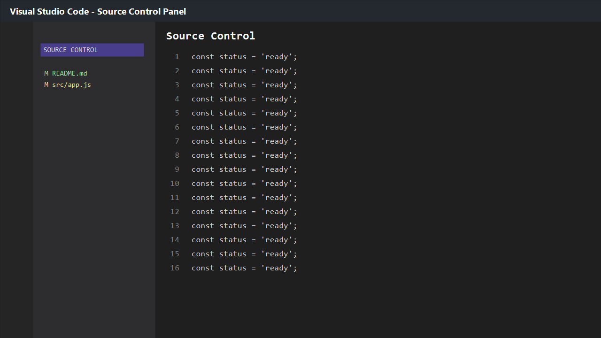

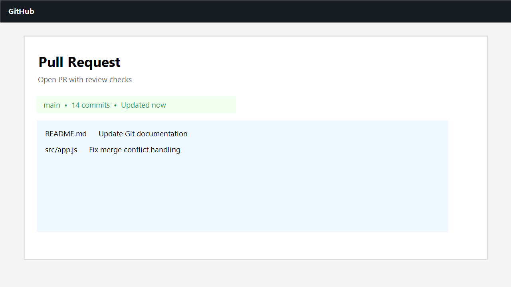
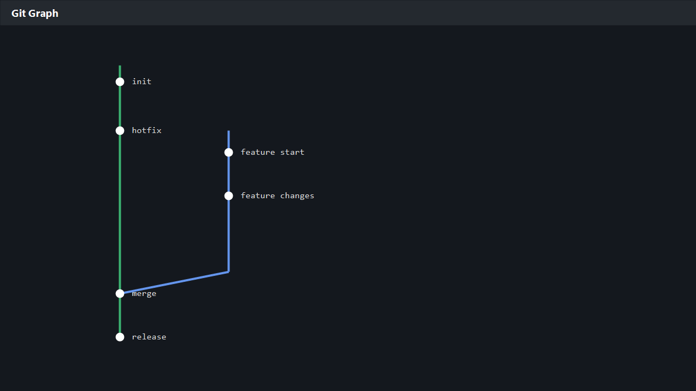

---

## 7. Final Reference Section

### 7.1 Git Command Cheat Sheet

#### Setup
```bash
git init
git clone <repo_url>
git remote -v
git remote add origin <repo_url>
```

#### Daily Work
```bash
git status
git add .
git add <file_name>
git commit -m "message"
git pull
git push
```

#### Branching
```bash
git branch
git branch <branch_name>
git checkout <branch_name>
git checkout -b <branch_name>
git merge <branch_name>
```

#### History and Inspection
```bash
git log --oneline --graph --decorate
git diff
git show <commit_id>
```

#### Undo and Fix
```bash
git restore <file_name>
git restore --staged <file_name>
git reset --soft HEAD~1
git revert <commit_id>
```

---

### 7.2 Common Git Errors and Fixes

1. Error: `fatal: not a git repository`
- Cause: You are outside a Git project folder.
- Fix: Move into the correct folder or run `git init`.

2. Error: `remote origin already exists`
- Cause: Remote named `origin` is already configured.
- Fix:
```bash
git remote remove origin
git remote add origin <repo_url>
```

3. Error: `non-fast-forward` push rejected
- Cause: Remote has new commits you do not have locally.
- Fix:
```bash
git pull --rebase
git push
```

4. Error: `merge conflict`
- Cause: Same lines changed in different commits.
- Fix: Resolve markers, then:
```bash
git add .
git commit
git push
```

5. Error: `detached HEAD`
- Cause: Checked out a commit instead of a branch.
- Fix:
```bash
git checkout <branch_name>
```

6. Error: `src refspec main does not match any`
- Cause: No commits yet or wrong branch name.
- Fix:
```bash
git commit -m "Initial commit"
git branch -M main
git push -u origin main
```

7. Error: `Permission denied (publickey)`
- Cause: SSH key missing or not added to GitHub.
- Fix: Add SSH key to GitHub, or use HTTPS remote URL.

8. Error: `Authentication failed`
- Cause: Invalid credentials/token.
- Fix: Use a valid GitHub personal access token for HTTPS.

---

### 7.3 Git Best Practices

1. Commit small, logical changes.
2. Write clear commit messages with action words.
3. Pull before you push.
4. Use branches for every feature or bugfix.
5. Never commit secrets (API keys, passwords).
6. Review `git diff` before committing.
7. Keep `main` stable and deployable.
8. Use pull requests for team collaboration.
9. Resolve conflicts carefully, then test.
10. Tag releases for important versions.

Suggested commit style examples:
- `feat: add login validation`
- `fix: handle empty array case`
- `docs: update setup instructions`

---

### 7.4 20 Git Interview Questions with Answers

1. What is Git?
- Git is a distributed version control system that tracks file changes and supports collaboration.

2. What is the difference between Git and GitHub?
- Git is the tool for version control; GitHub is a platform to host and collaborate on Git repositories.

3. What is a commit?
- A commit is a snapshot of staged changes stored in repository history.

4. What is the staging area?
- It is an intermediate area where you prepare selected changes before commit.

5. What does `git init` do?
- It creates a new Git repository in the current folder.

6. What does `git clone` do?
- It copies a remote repository to your local machine, including history and branches.

7. What is the purpose of `git add`?
- It moves file changes to staging for the next commit.

8. What does `git status` show?
- It shows branch info and file states: untracked, modified, staged.

9. What does `git push` do?
- It uploads local commits to the remote repository.

10. What does `git pull` do?
- It fetches remote changes and merges them into your current local branch.

11. What is a branch?
- A branch is an independent line of development.

12. Why use branches?
- They isolate feature work and reduce risk to the main codebase.

13. What is a merge conflict?
- A conflict occurs when Git cannot auto-merge changes to the same content.

14. How do you resolve merge conflicts?
- Edit conflicted files, remove conflict markers, stage resolved files, and commit.

15. What is the difference between `git fetch` and `git pull`?
- `fetch` only downloads changes; `pull` downloads and integrates them.

16. What is HEAD in Git?
- HEAD points to your current checked-out commit or branch.

17. What does `git checkout` do?
- It switches branches or restores specific file states.

18. What is `origin`?
- `origin` is the default name for the remote repository.

19. What is the use of `-u` in `git push -u origin main`?
- It sets upstream tracking between local and remote branches.

20. What are best practices for commit messages?
- Keep them concise, clear, and action-oriented; describe what and why.

---

## Suggested Folder for Screenshot Assets

Create this structure for your real screenshots:

```text
assets/
  screenshots/
    01-git-workflow-vscode.png
    02-github-repo-home.png
    03-terminal-git-status.png
    ...
    20-git-graph.png
```

This keeps your documentation professional and easy to maintain.

---

## Quick Start Recap

If you want just the minimum start flow:

```bash
git init
git add .
git commit -m "Initial commit"
git branch -M main
git remote add origin https://github.com/AbhishekDhone7/Practice.git
git push -u origin main
```

Then daily:

```bash
git add .
git commit -m "Your message"
git push
```

You now have a complete beginner-to-intermediate Git foundation with practical conflict handling and collaboration workflows.
