# JavaScript Beginner Guide

> Complete JavaScript documentation in simple English for beginners, interview preparation, and developers moving from other languages.

## Table of Contents

- [1. JavaScript at a Glance](#1-javascript-at-a-glance)
- [2. Runtime Model: Execution Context and Call Stack](#2-runtime-model-execution-context-and-call-stack)
- [3. Variables, Scope, and Data Types](#3-variables-scope-and-data-types)
- [4. Type Coercion and Equality](#4-type-coercion-and-equality)
- [5. Operators, Statements, and Loops](#5-operators-statements-and-loops)
- [6. Functions Deep Dive](#6-functions-deep-dive)
- [7. Arrays and Array Methods](#7-arrays-and-array-methods)
- [8. Objects and Object Patterns](#8-objects-and-object-patterns)
- [9. this, call, apply, bind](#9-this-call-apply-bind)
- [10. Prototype and Classes](#10-prototype-and-classes)
- [11. DOM and Events](#11-dom-and-events)
- [12. Async JavaScript](#12-async-javascript)
- [13. APIs, Fetch, Axios, and REST Basics](#13-apis-fetch-axios-and-rest-basics)
- [14. Error Handling and Debugging](#14-error-handling-and-debugging)
- [15. Useful Built-ins: Date, Math, Map, Set](#15-useful-built-ins-date-math-map-set)
- [16. Modern JS Features (ES6+)](#16-modern-js-features-es6)
- [17. Interview Question Bank](#17-interview-question-bank)
- [18. Final Learning Roadmap](#18-final-learning-roadmap)

---

## 1. JavaScript at a Glance

### What is it?

JavaScript is a programming language that tells your app what to do at runtime.

Runtime means "when code is actually running".

JavaScript is also:

- High-level: you write human-friendly code, not machine-level instructions
- Dynamic: data type can be decided while the program runs
- Interpreted/JIT-compiled by engine: browser engine reads and optimizes code at runtime
- Event-driven: code can run when events happen (click, submit, timer, response)

In simple words, JavaScript is the decision-maker of your application.
It reads input, applies logic, and produces output for users.

JavaScript can:

- Read user actions (click, type, scroll)
- Process data (validate, filter, calculate)
- Update UI (show error, open modal, render list)
- Talk to server APIs (get products, save orders)

JavaScript is used in:

- Browsers (frontend)
- Servers using Node.js (backend)
- Mobile and desktop apps through frameworks

### Core building blocks (beginner view)

| Building block | Simple meaning | Example |
|---|---|---|
| Variable | Store a value | `let age = 21` |
| Condition | Make decisions | `if (age >= 18)` |
| Loop | Repeat task | `for (...)` |
| Function | Reusable logic block | `function add(a,b){}` |
| Object/Array | Structured data | user object, items array |

### Where JavaScript runs

| Environment | Common use | Real-world example |
|---|---|---|
| Browser | Interactive UI | Add-to-cart, form validation |
| Node.js server | Business logic/API | Save order in database |
| Hybrid/mobile frameworks | App features | Notifications, list rendering |

### Real-world scenario

In an e-commerce app:

- User clicks Add to Cart
- JavaScript adds item in local state
- JavaScript updates cart count badge
- JavaScript sends API call to store cart

### Flow diagram

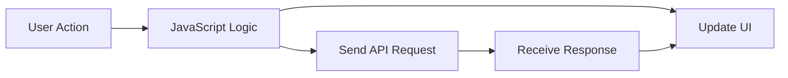

### Code example 1: Basic output

```js
const productName = "Laptop";
const price = 59999;
console.log(`${productName} added. Price: ${price}`);
```

### Output

```txt
Laptop added. Price: 59999
```

### Code example 2: Decision making

```js
const stock = 3;

if (stock > 0) {
  console.log("In stock");
} else {
  console.log("Out of stock");
}
```

### Output

```txt
In stock
```

### Code example 3: Function + input processing

```js
function calculateTotal(price, quantity) {
  return price * quantity;
}

const total = calculateTotal(499, 2);
console.log(`Total amount: ${total}`);
```

### Output

```txt
Total amount: 998
```

### Code example 4: Array processing (real-world cart)

```js
const cartPrices = [199, 299, 99];
const cartTotal = cartPrices.reduce((sum, itemPrice) => sum + itemPrice, 0);
console.log(`Cart total: ${cartTotal}`);
```

### Output

```txt
Cart total: 597
```

### Edge cases (real-world)

- If API call fails, UI should show error instead of spinner forever
- If user clicks Pay button multiple times, app can create duplicate orders
- If product price comes as string (`"499"`) and logic is wrong, total can become incorrect

### Quick checklist for beginners

- Read input carefully (user form, API response)
- Validate data before using it
- Show clear success or error messages
- Keep logic in small reusable functions

### Common mistakes

- Thinking JavaScript and Java are same language
- Thinking JavaScript runs only in browser
- Writing long code without functions
- Not handling invalid user input

### Best practices

- Build fundamentals before frameworks
- Practice daily with small problems
- Read console errors line by line
- Start with `const`, then use `let` if value must change
- Name variables by purpose, not by short unclear names

### Summary

JavaScript is the behavior engine of modern applications. It takes inputs, applies logic, and creates outputs users can see and trust.

---

## 2. Runtime Model: Execution Context and Call Stack


### What is it?

Execution context is the internal runtime environment where JavaScript executes code.

Each context stores:

- Variables in scope
- Function declarations and references
- `this` value
- Current instruction pointer

It also keeps hidden engine metadata used for scope lookup and control flow.

Every execution context runs in two internal phases:

1. Memory creation phase
2. Execution phase

In memory creation phase:

- Function declarations become fully available
- `var` is created with `undefined`
- `let` and `const` are created but not accessible before declaration line (TDZ)

In execution phase:

- JavaScript runs statements line by line
- Values are assigned
- Functions are called and new contexts are created when needed

Main types:

- Global Execution Context (created first)
- Function Execution Context (created on each function call)

Each function call is pushed to call stack, and removed when complete.

### Quick mental model

| Term | Simple meaning | Why it matters |
|---|---|---|
| Global context | First runtime context | Starting point of whole script |
| Function context | Context created per function call | Keeps local data isolated |
| Call stack | LIFO stack of active function calls | Explains execution order and errors |
| Stack trace | Error path of nested calls | Helps debug quickly |

### Real-world scenario

In checkout flow:

- `placeOrder()` calls `validateCart()`
- `validateCart()` calls `checkStock()`
- If `checkStock()` fails, stack trace helps locate exact failure point

### Flow diagram

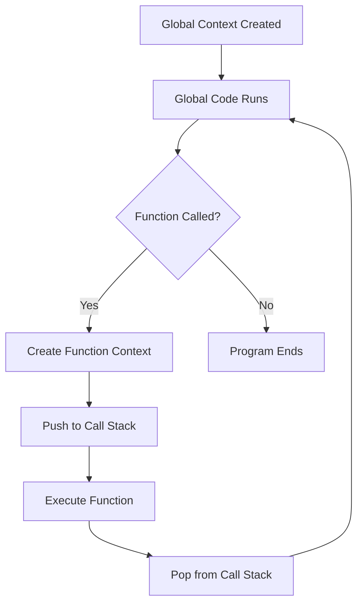

### Code example

```js
function one() {
  two();
}

function two() {
  console.log("Inside two");
}

one();
```

### Output

```txt
Inside two
```

### Code example 2: Call stack execution order

```js
function first() {
  console.log("first start");
  second();
  console.log("first end");
}

function second() {
  console.log("second start");
  third();
  console.log("second end");
}

function third() {
  console.log("third run");
}

first();
```

### Output

```txt
first start
second start
third run
second end
first end
```

### Code example 3: Memory phase behavior

```js
console.log(total);
show();

var total = 50;

function show() {
  console.log("show called");
}
```

### Output

```txt
undefined
show called
```

### Code example 4: Stack overflow edge case

```js
function loopForever() {
  return loopForever();
}

// loopForever();
console.log("If loopForever is called, it will eventually throw stack overflow");
```

### Output

```txt
If loopForever is called, it will eventually throw stack overflow
```

### Edge cases

- Deep recursion can cause call stack overflow
- Large global scope can increase accidental name conflicts
- Calling too many nested synchronous functions can freeze UI temporarily
- Unclear stack traces happen when function names are generic (for example `fn1`, `fn2`)

### Common mistakes

- Confusing memory creation with execution order
- Not reading stack traces while debugging
- Thinking asynchronous callbacks run immediately on top of current stack
- Using global variables for temporary function-level work

### Best practices

- Keep functions small and focused
- Use debugger and breakpoints for call flow
- Give clear function names so stack traces are readable
- For recursion, always keep a safe base condition
- For async code, remember callback runs after current stack is clear

### Summary

Execution context and call stack explain the exact order in which JavaScript prepares memory, runs statements, enters functions, and returns control.

---

## 3. Variables, Scope, and Data Types

### What is it?

Variable is a named container for data.

Scope is the area where a variable can be accessed.

In JavaScript, understanding variables means understanding three things together:

1. Declaration keyword (`var`, `let`, `const`)
2. Scope (where value can be used)
3. Data type (what kind of value it stores)

JavaScript keywords:

- `var`: function scope, older style
- `let`: block scope, can reassign
- `const`: block scope, cannot reassign reference

Scope types:

- Global scope: accessible from almost everywhere in the file/runtime
- Function scope: accessible only inside that function
- Block scope: accessible only inside `{ ... }` block

### Types of scope and variable access rules

| Scope type | Where it is created | Who can access it | Who cannot access it |
|---|---|---|---|
| Global scope | Outside all functions and blocks | Global code and inner scopes | N/A (top-level scope) |
| Function scope | Inside a function body | That function and its inner blocks | Outside that function |
| Block scope | Inside `{}` like `if`, `for`, `while`, `switch` block | Only inside that block | Outside that block |

Access rule in one line:

- Inner scope can read outer scope variables
- Outer scope cannot read inner scope variables

### Scope access hierarchy diagram

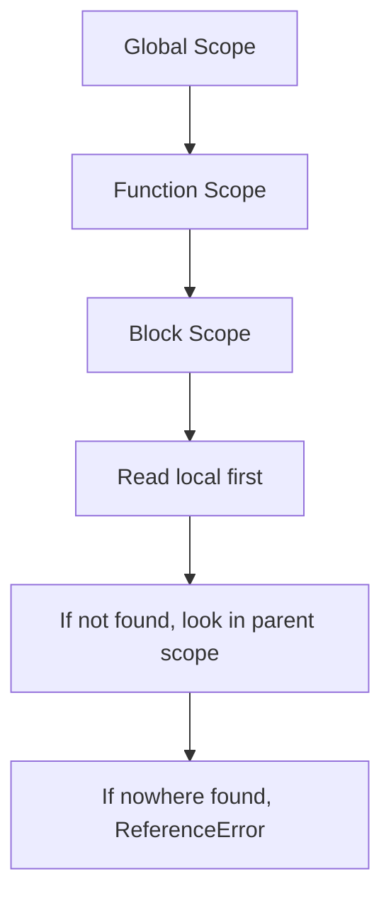

### Variable lookup (scope chain) diagram

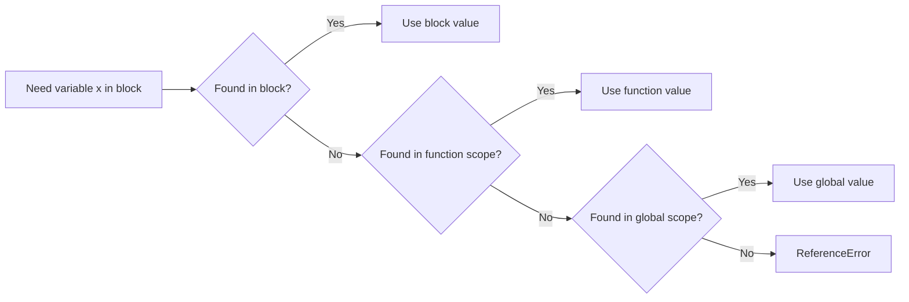

Data types:

- Primitive: string, number, boolean, null, undefined, bigint, symbol
- Non-primitive: object, array, function

Quick type meaning:

| Type | Meaning | Example |
|---|---|---|
| string | text value | `"hello"` |
| number | numeric value | `42`, `3.14` |
| boolean | true/false value | `true` |
| undefined | declared but no value yet | `let x;` |
| null | intentionally empty value | `let user = null` |
| object | grouped key-value data | `{ name: "Nisha" }` |
| array | ordered list | `[10, 20, 30]` |

### Real-world scenario

In login page:

- `const apiUrl` should not change
- `let attempts` changes after each failed login
- Avoid using `var` to prevent scope confusion

In cart page:

- `const taxRate = 0.18` should stay fixed
- `let cartTotal` changes when user adds/removes items
- Product list is often an array, user info is usually an object

### Flow diagram

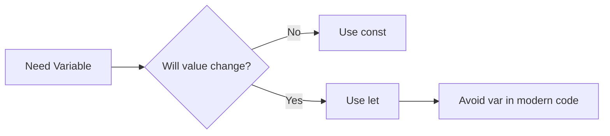

### Scope flow diagram

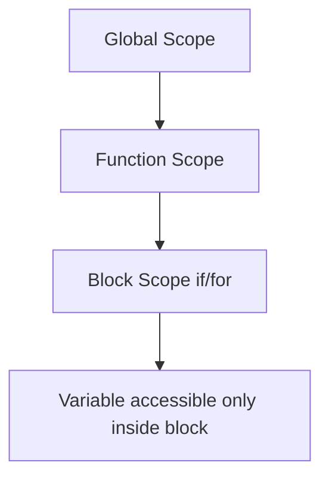

### Hoisting and TDZ with execution context

Hoisting means JavaScript prepares declarations before running code lines.

Global Execution Context (GEC) is created first.
Then, whenever a function is called, JavaScript creates a sub execution context (Function Execution Context).

Both global and function contexts run in two phases:

1. Memory creation phase
2. Execution phase

### Global and function context flow

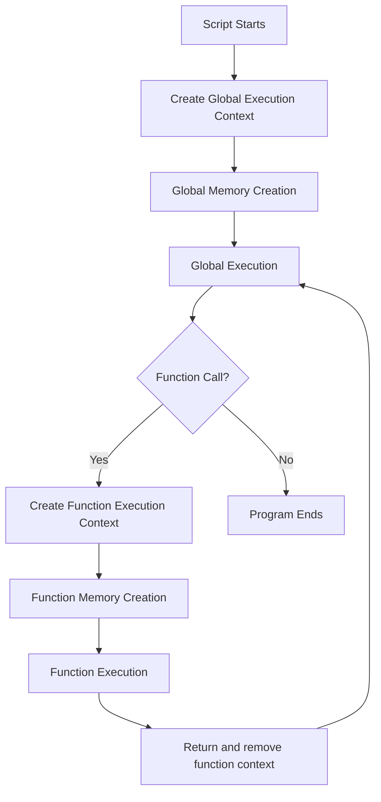

### Memory creation impact on var, let, const

| Keyword | Memory creation phase | Before declaration line in execution phase | After declaration line |
|---|---|---|---|
| `var` | Created and initialized as `undefined` | Accessible as `undefined` | Gets assigned value |
| `let` | Created but uninitialized | In TDZ, access throws `ReferenceError` | Gets assigned value |
| `const` | Created but uninitialized | In TDZ, access throws `ReferenceError` | Must be initialized once |

### TDZ and access behavior flow

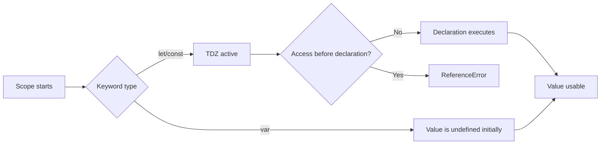

### Code example

```js
const appName = "ShopEasy";
let attempts = 0;
attempts = attempts + 1;
console.log(appName, attempts);
```

### Output

```txt
ShopEasy 1
```

### Code example 2: Scope behavior

```js
const company = "ACME";

function showUser() {
  const user = "Riya";
  if (true) {
    const role = "Admin";
    console.log(company, user, role);
  }
  // console.log(role); // would fail: role is block scoped
}

showUser();
```

### Output

```txt
ACME Riya Admin
```

### Code example 2.1: Global -> function -> block access

```js
const globalName = "Global";

function scopeDemo() {
  const functionName = "Function";

  if (true) {
    const blockName = "Block";
    console.log(globalName, functionName, blockName);
  }
}

scopeDemo();
```

### Output

```txt
Global Function Block
```

### Code example 2.2: Outer cannot access inner scope

```js
function account() {
  const pin = 1234;
  console.log("Inside function:", pin);
}

account();

try {
  console.log(pin);
} catch (error) {
  console.log(error.name);
}
```

### Output

```txt
Inside function: 1234
ReferenceError
```

### Code example 2.3: Block scope with let/const vs var

```js
if (true) {
  var varValue = "I am var";
  let letValue = "I am let";
  const constValue = "I am const";
  console.log(varValue, letValue, constValue);
}

console.log(varValue);

try {
  console.log(letValue);
} catch (error) {
  console.log(error.name);
}

try {
  console.log(constValue);
} catch (error) {
  console.log(error.name);
}
```

### Output

```txt
I am var I am let I am const
I am var
ReferenceError
ReferenceError
```

### Code example 3: `const` object mutation edge

```js
const profile = { name: "Nisha", city: "Pune" };
profile.city = "Mumbai"; // allowed
console.log(profile.city);

// profile = { name: "Nisha" }; // not allowed
```

### Output

```txt
Mumbai
```

### Code example 4: Check data types with `typeof`

```js
const title = "Phone";
const price = 999;
const inStock = true;
const tags = ["new", "sale"];
const meta = { brand: "XYZ" };

console.log(typeof title);
console.log(typeof price);
console.log(typeof inStock);
console.log(typeof tags);
console.log(typeof meta);
```

### Output

```txt
string
number
boolean
object
object
```

### Code example 5: Hoisting with `var`

```js
console.log(score);
var score = 100;
console.log(score);
```

### Output

```txt
undefined
100
```

### Code example 6: TDZ with `let` using try/catch

```js
try {
  console.log(points);
} catch (error) {
  console.log(error.name);
}

let points = 50;
console.log(points);
```

### Output

```txt
ReferenceError
50
```

### Code example 7: Sub execution context (function memory and execution)

```js
var globalValue = "G";

function demo(a) {
  console.log(a);
  console.log(localVar);
  var localVar = "L";
  console.log(localVar, globalValue);
}

demo("A");
```

### Output

```txt
A
undefined
L G
```

In this function example:

- During function memory creation, `a` is initialized from argument and `localVar` becomes `undefined`
- During function execution, `localVar` gets value `"L"` on its assignment line

### Edge cases

- `const` object properties can still change
- `var` declared in loop can leak outside block
- `typeof null` returns `"object"` (historical JavaScript behavior)
- Accessing block-scoped variable outside block throws `ReferenceError`
- Using same variable name in nested scopes can confuse debugging
- Accessing `let`/`const` before declaration line causes TDZ error
- Hoisting confusion can hide bugs when `var` appears as `undefined`

### Common mistakes

- Using `var` in modern code
- Accessing `let` or `const` before declaration
- Using unclear variable names like `a`, `x1`, `tmp` in business logic
- Assuming array type will show as `array` in `typeof`
- Assuming `let` and `const` behave like `var` during hoisting

### Best practices

- Use `const` by default
- Use `let` only when reassignment is required
- Keep variable names descriptive
- Group related values in objects instead of many loose variables
- Validate and normalize incoming data types from APIs/forms
- Declare variables before usage for readability, even if hoisting exists
- Prefer `let`/`const` to avoid accidental `undefined` from `var`

### Summary

Correct variable, scope, and data type handling prevents silent bugs, improves readability, and makes debugging much faster.

---

## 4. Type Coercion and Equality

### What is it?

Type coercion means JavaScript converts one data type to another automatically in some operations.

There are two broad forms:

- Implicit coercion: JavaScript converts types automatically
- Explicit coercion: developer converts types manually using `Number()`, `String()`, `Boolean()`

Equality checks compare values, but strictness level matters.

Equality operators:

- `==` loose equality (allows type conversion)
- `===` strict equality (no type conversion)

Quick rule:

- Use `===` for predictable behavior
- Use `==` only when you fully understand its coercion rules

### Coercion quick table

| Expression | Result | Why |
|---|---|---|
| `"10" + 2` | `"102"` | `+` with string does concatenation |
| `"10" - 2` | `8` | `-` forces numeric conversion |
| `true + 1` | `2` | `true` becomes `1` |
| `false + 5` | `5` | `false` becomes `0` |
| `Number("42")` | `42` | explicit numeric conversion |

### Real-world scenario

In payment validation, string input from form may be compared with numeric value. Wrong comparison can approve invalid data.

Another practical case:

- Quantity from input is `"2"` and price is number `500`
- If handled carelessly with `+`, total can become text instead of number

### Flow diagram

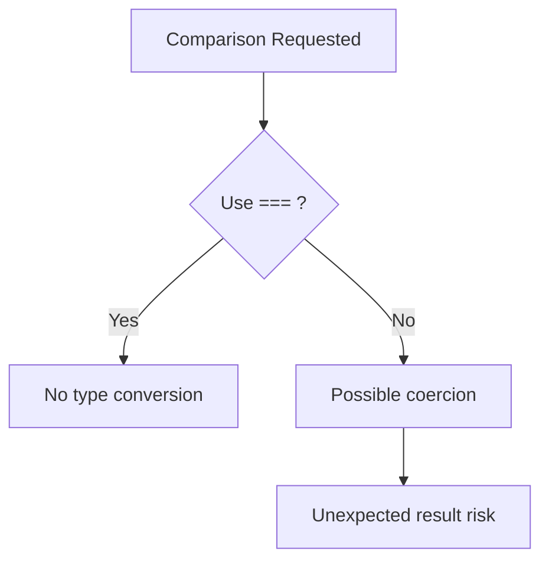

### Conversion decision diagram

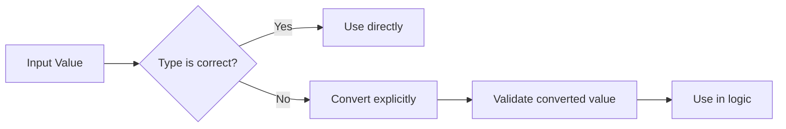

### Code example

```js
console.log(5 == "5");
console.log(5 === "5");
console.log("10" + 2);
console.log("10" - 2);
```

### Output

```txt
true
false
102
8
```

### Code example 2: Boolean coercion behavior

```js
console.log(Boolean(0));
console.log(Boolean(1));
console.log(Boolean(""));
console.log(Boolean("hello"));
```

### Output

```txt
false
true
false
true
```

### Code example 3: Safe input handling (real-world)

```js
const qtyFromInput = "2";
const price = 500;

const qty = Number(qtyFromInput);
const total = qty * price;

console.log(total);
console.log(typeof total);
```

### Output

```txt
1000
number
```

### Code example 4: Tricky equality interview cases

```js
console.log("" == 0);
console.log("" === 0);
console.log(null == undefined);
console.log(null === undefined);
console.log(NaN === NaN);
```

### Output

```txt
true
false
true
false
false
```

### Why comparisons return true or false

JavaScript returns `true` when comparison rule is satisfied, otherwise `false`.
The result depends on:

- Value itself
- Data type
- Operator used (`==`, `===`, `<`, `>`, etc.)
- Whether JavaScript is allowed to coerce type

### Internal flow of `===` (strict equality)

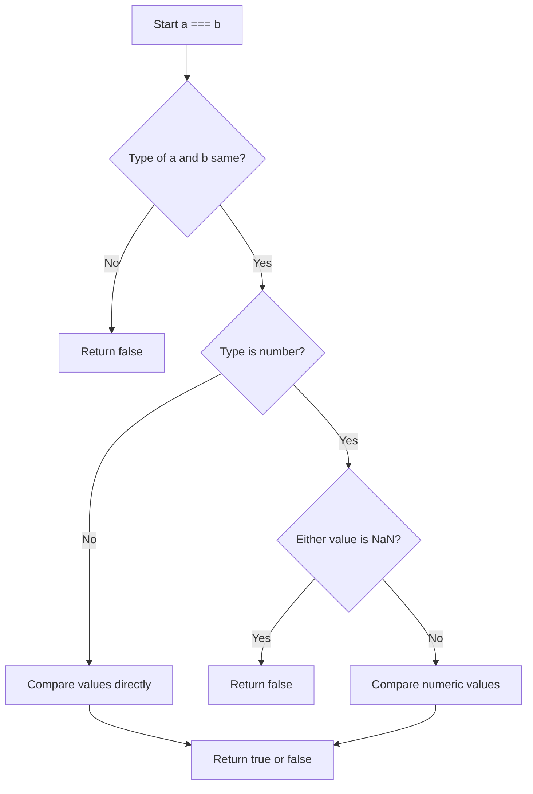

### Internal flow of `==` (loose equality)

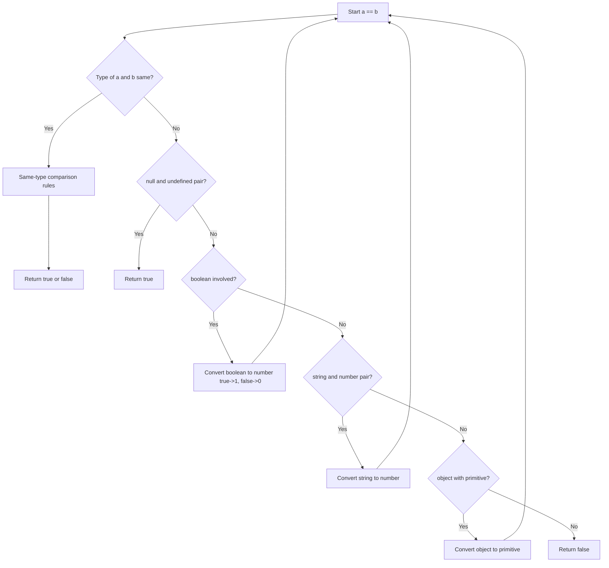

### True/false reasoning table

| Comparison | Result | Why it returns this |
|---|---|---|
| `5 == "5"` | `true` | `==` allows coercion, string `"5"` becomes number `5` |
| `5 === "5"` | `false` | `===` checks both type and value; number and string differ |
| `0 == false` | `true` | `false` coerces to `0` in loose equality |
| `0 === false` | `false` | types are different (`number` vs `boolean`) |
| `null == undefined` | `true` | special loose-equality rule in JavaScript |
| `null === undefined` | `false` | strict equality requires same type |
| `NaN === NaN` | `false` | `NaN` is never equal to anything, including itself |
| `"2" > "12"` | `true` | both are strings, so lexical (dictionary) comparison |
| `"2" > 12` | `false` | number comparison after coercion (`2 > 12` is false) |

### Code example 5: More comparison cases

```js
console.log(0 == false);
console.log(0 === false);
console.log("2" > "12");
console.log("2" > 12);
console.log(10 > "5");
console.log("apple" > "banana");
```

### Output

```txt
true
false
true
false
true
false
```

### Code example 6: Object and array comparison

```js
console.log([1, 2] == [1, 2]);
console.log([1, 2] === [1, 2]);

const arr = [1, 2];
const sameRef = arr;
console.log(arr === sameRef);
```

### Output

```txt
false
false
true
```

Why this happens:

- Arrays and objects compare by reference (memory address), not by content
- Two separate arrays with same values are still different references

### Edge cases

- `"" == 0` is true
- `null == undefined` is true, but `null === undefined` is false
- `NaN === NaN` is false (special numeric behavior)
- `0 == false` is true because of coercion
- `[] == false` can evaluate to true in loose comparison

### Common mistakes

- Using `==` in critical business logic
- Assuming `+` always does numeric addition
- Forgetting to parse number inputs from forms/APIs
- Assuming all non-empty strings are valid numbers

### Best practices

- Prefer `===` and `!==`
- Convert input explicitly: `Number(value)`, `String(value)`
- Validate conversion results with `Number.isNaN()` where needed
- Keep business rules type-safe at boundaries (API/form layer)

### Summary

Type coercion is powerful but risky when ignored. Use strict equality and explicit conversions to keep logic predictable and production-safe.

---

## 5. Operators, Statements, and Loops

### What is it?

Operators perform actions on values.

Statements decide which code should run and when.
Loops help you repeat logic without writing duplicate lines.

This topic is the core of decision-making in JavaScript.

Main categories:

- Arithmetic: `+ - * / % **`
- Assignment: `= += -=`
- Comparison: `> < >= <= ===`
- Logical: `&& || !`
- Ternary: `condition ? valueA : valueB`

Operator priorities matter. For example:

- `*` runs before `+`
- Parentheses `()` can force custom order

Statements control flow:

- `if...else`
- `switch`
- loops: `for`, `while`, `do...while`, `for...of`, `for...in`

In real projects, these are used together:

- Operator calculates result
- Condition checks rule
- Statement decides branch
- Loop repeats process for all items

### End-to-end logic flow

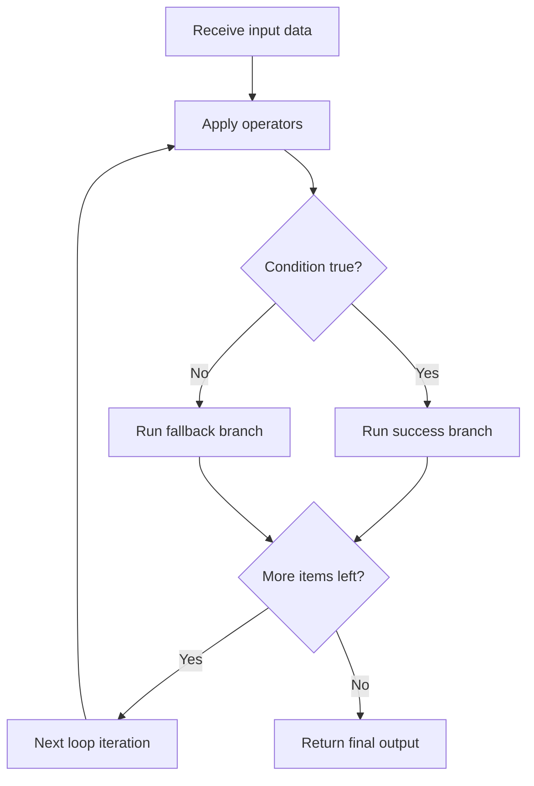

### Quick decision table

| Need | Best structure |
|---|---|
| Two-way condition | `if...else` |
| Many fixed options | `switch` |
| Fixed count repetition | `for` |
| Repeat while condition true | `while` |
| At least one run required | `do...while` |
| Iterate array values | `for...of` |
| Iterate object keys | `for...in` |

### Operator behavior quick table

| Operator type | Example | Result idea |
|---|---|---|
| Arithmetic | `20 / 4` | numeric calculation |
| Comparison | `age >= 18` | returns boolean |
| Logical | `isLoggedIn && isVerified` | combines conditions |
| Assignment | `total += 50` | updates variable |
| Ternary | `stock > 0 ? "In" : "Out"` | short if/else |

### Real-world scenario

Order discount flow:

- if amount > 5000, apply 10% discount
- else if amount > 2000, apply 5%
- else no discount

Scenario to consider:

- Amount can be invalid (negative, null, string)
- Business rules can overlap, so condition order matters
- Final amount should never become negative

### Flow diagram

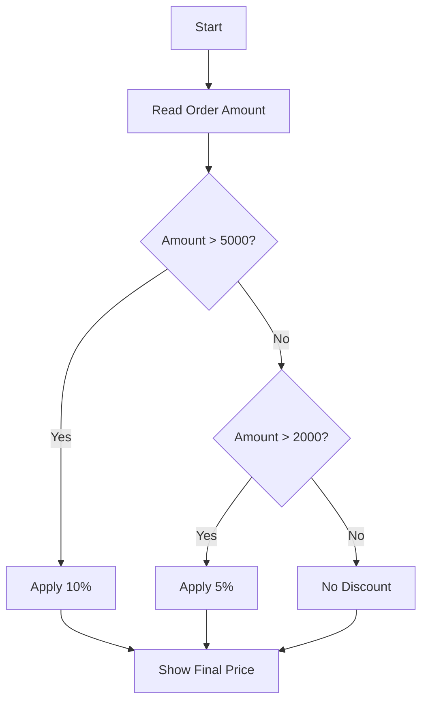

### Scenario 2: Login attempt lock system

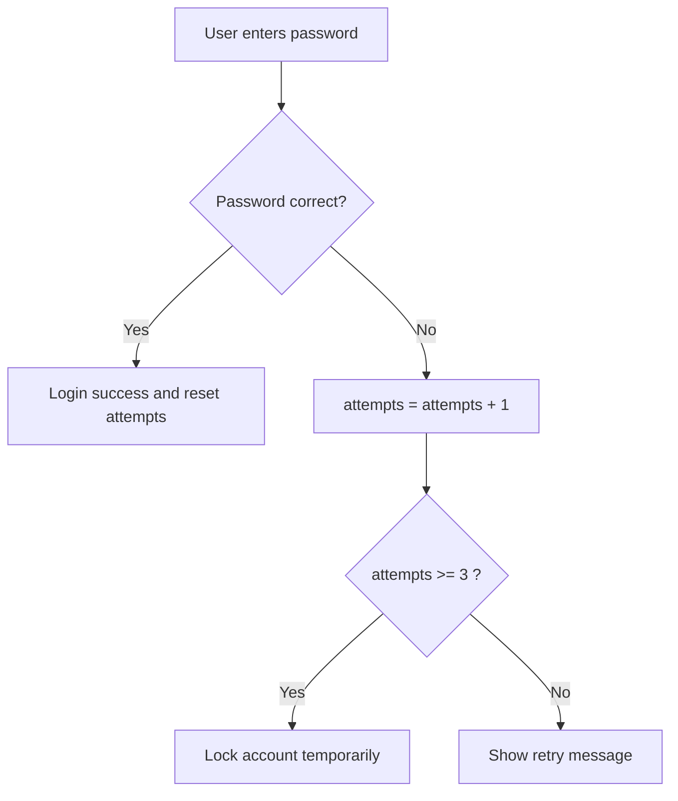

### Code example

```js
const amount = 3200;
let discount = 0;

if (amount > 5000) {
  discount = 10;
} else if (amount > 2000) {
  discount = 5;
}

console.log(`Discount: ${discount}%`);
```

### Output

```txt
Discount: 5%
```

### Code example 1.1: Safe discount with validation

```js
const amountInput = "3200";
const amount = Number(amountInput);

if (Number.isNaN(amount) || amount < 0) {
  console.log("Invalid amount");
} else {
  let discount = 0;
  if (amount > 5000) discount = 10;
  else if (amount > 2000) discount = 5;

  const finalAmount = amount - (amount * discount) / 100;
  console.log(`Discount: ${discount}%`);
  console.log(`Final amount: ${finalAmount}`);
}
```

### Output

```txt
Discount: 5%
Final amount: 3040
```

### Code example 2: Operator precedence

```js
const result1 = 10 + 2 * 5;
const result2 = (10 + 2) * 5;

console.log(result1);
console.log(result2);
```

### Output

```txt
20
60
```

### Code example 2.1: Logical operators in business rules

```js
const isLoggedIn = true;
const isEmailVerified = false;
const isAdmin = true;

const canAccessAdminPanel = isAdmin && isLoggedIn;
const canCheckout = isLoggedIn && isEmailVerified;

console.log(canAccessAdminPanel);
console.log(canCheckout);
```

### Output

```txt
true
false
```

### Code example 3: `switch` for status mapping

```js
const orderStatus = "shipped";
let message;

switch (orderStatus) {
  case "pending":
    message = "Order received";
    break;
  case "shipped":
    message = "Order is on the way";
    break;
  case "delivered":
    message = "Order delivered";
    break;
  default:
    message = "Unknown status";
}

console.log(message);
```

### Output

```txt
Order is on the way
```

### Code example 3.1: Missing break fall-through risk

```js
const level = "gold";
let benefits = "";

switch (level) {
  case "gold":
    benefits += "Priority Support ";
  case "silver":
    benefits += "Discount Vouchers";
    break;
  default:
    benefits = "Basic Benefits";
}

console.log(benefits);
```

### Output

```txt
Priority Support Discount Vouchers
```

Why this matters:

- Missing `break` after `gold` allowed code to continue into `silver`
- Sometimes useful intentionally, but usually a bug

### Code example 4: `for...of` vs `for...in`

```js
const items = ["pen", "book", "bag"];

for (const value of items) {
  console.log(`value: ${value}`);
}

for (const key in items) {
  console.log(`index: ${key}`);
}
```

### Output

```txt
value: pen
value: book
value: bag
index: 0
index: 1
index: 2
```

### Code example 4.1: `for...in` for objects

```js
const user = { name: "Nisha", role: "admin", active: true };

for (const key in user) {
  console.log(`${key}: ${user[key]}`);
}
```

### Output

```txt
name: Nisha
role: admin
active: true
```

### Code example 5: While loop safety pattern

```js
let attempts = 0;

while (attempts < 3) {
  attempts++;
  console.log(`Attempt ${attempts}`);
}
```

### Output

```txt
Attempt 1
Attempt 2
Attempt 3
```

### Code example 6: `do...while` runs at least once

```js
let count = 5;

do {
  console.log(`Executed once with count=${count}`);
  count++;
} while (count < 5);
```

### Output

```txt
Executed once with count=5
```

### Scenario checklist: What to consider before writing conditions/loops

- Is input valid and type-safe?
- Are condition branches mutually exclusive?
- Can this loop become infinite?
- Do we need `break` or `continue`?
- Are we iterating array values or object keys?
- Is there a safer built-in method like `map`, `filter`, `some`, `every`?

### Edge cases

- Infinite loop if condition never changes
- `for...in` on arrays can give unexpected keys
- Missing `break` in `switch` can cause fall-through bugs
- `NaN` comparisons are tricky (`NaN === NaN` is false)
- Wrong logical grouping (`&&` / `||`) can approve invalid business conditions
- `for...in` can also iterate inherited keys in some object patterns
- Mutating array while looping can skip or reprocess elements

### Common mistakes

- Using `for...in` instead of `for...of` for arrays
- Missing `break` inside `switch`
- Writing complex `if` blocks without intermediate variables
- Updating wrong loop variable, causing endless loop
- Comparing numbers received as strings without conversion
- Using deeply nested conditions instead of early returns

### Best practices

- Use `for...of` for array values
- Keep loop body short and readable
- Use parentheses in complex conditions for clarity
- Keep `switch` cases explicit and always handle `default`
- Use guard clauses to reduce deep nested `if` blocks
- Validate input at the boundary (form/API layer) before comparisons
- Prefer intention-revealing variable names like `isEligible`, `hasStock`
- Add tests for boundary values (`0`, `1`, min, max, empty)

### Summary

Operators, statements, and loops are the foundation of application logic. Clear conditions and safe loops directly improve correctness and maintainability.

---

## 6. Functions Deep Dive

### What is it?

Function is a reusable block of code.

Main function styles:

- Function Declaration
- Function Expression
- Arrow Function
- IIFE (Immediately Invoked Function Expression)

Advanced function patterns:

- Callback function
- Higher-order function
- Recursion
- Closure
- Currying

### Real-world scenario

In a report app:

- One function fetches data
- Another validates rows
- Another formats output
- Callback or higher-order function customizes behavior

### Flow diagram

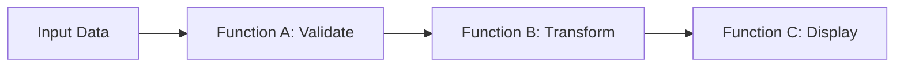

### Code example

```js
function greet(name) {
  return `Hello ${name}`;
}

const result = greet("Nisha");
console.log(result);
```

### Output

```txt
Hello Nisha
```

### Simple examples for key patterns

```js
// Callback
function processOrder(id, callback) {
  callback(`Order ${id} processed`);
}

processOrder(101, (msg) => console.log(msg));

// IIFE
(function () {
  console.log("IIFE executed once");
})();
```

### Output

```txt
Order 101 processed
IIFE executed once
```

### Edge cases

- Calling function expression before assignment causes error
- Recursive function without base condition causes stack overflow

### Common mistakes

- Huge functions with too many responsibilities
- Not returning values when caller expects output

### Best practices

- Keep single responsibility per function
- Name functions with verb + purpose

### Summary

Functions are the building blocks of clean and reusable JavaScript logic.

---

## 7. Arrays and Array Methods

### What is it?

Array is an ordered list of values.

Important methods:

- Add/remove: `push`, `pop`, `shift`, `unshift`, `splice`
- Search: `includes`, `indexOf`, `find`
- Transform: `map`, `filter`, `reduce`
- Iterate: `forEach`
- Sort: `sort` (careful with numbers)

### Real-world scenario

Product listing page:

- Filter category
- Map to UI card model
- Reduce to total cart value

### Flow diagram

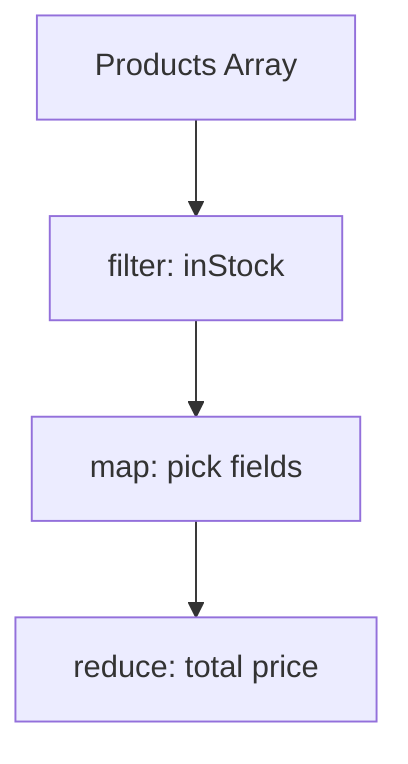

### Code example

```js
const prices = [100, 200, 300, 400];
const total = prices.reduce((sum, p) => sum + p, 0);
console.log(total);
```

### Output

```txt
1000
```

### Edge cases

- Default `sort()` sorts as strings
- Mutating original arrays can break shared state

### Common mistakes

- Forgetting to return inside `map`
- Using `map` when no transformed array is needed

### Best practices

- Use immutable patterns when possible
- Use descriptive callback names

### Summary

Array methods make data processing concise and readable.

---

## 8. Objects and Object Patterns

### What is it?

Object stores key-value pairs.

Common operations:

- Create and update properties
- Optional chaining `?.`
- Destructuring for clean extraction
- Object methods for behavior

### Real-world scenario

User profile object stores name, email, role, preferences, address, and methods like `getDisplayName()`.

### Flow diagram

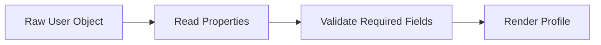

### Code example

```js
const user = {
  name: "Riya",
  role: "admin",
  isActive: true
};

console.log(user.name, user.role);
```

### Output

```txt
Riya admin
```

### Edge cases

- Accessing missing nested property throws error without optional chaining
- Shallow copy can still share nested object references

### Common mistakes

- Mutating shared objects directly
- Assuming spread makes deep copy

### Best practices

- Use optional chaining for safe reads
- Use object spread for safe shallow updates

### Summary

Objects represent real-world entities and structured application data.

---

## 9. this, call, apply, bind

### What is it?

`this` points to the object context for function execution.

`call`, `apply`, and `bind` control what `this` should be.

- `call(thisArg, a, b)`
- `apply(thisArg, [a, b])`
- `bind(thisArg)` returns new function

### Real-world scenario

A shared invoice function should run for different customer objects by switching context.

### Flow diagram

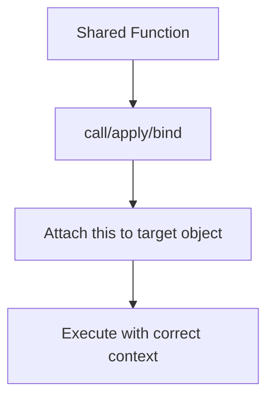

### Code example

```js
const person = { name: "Nisha" };

function say(city) {
  console.log(`${this.name} from ${city}`);
}

say.call(person, "Pune");
```

### Output

```txt
Nisha from Pune
```

### Edge cases

- Arrow functions ignore `call/apply/bind` for `this`
- Losing method context when passing method as callback

### Common mistakes

- Using arrow function for object method expecting dynamic `this`

### Best practices

- Use normal function for methods needing dynamic `this`
- Use `bind` for event handler context stability

### Summary

Understanding `this` and binding methods prevents many advanced bugs.

---

## 10. Prototype and Classes

### What is it?

JavaScript uses prototype-based inheritance.

A prototype is an object that other objects can inherit from.

Class syntax is cleaner wrapper over prototypes.

Class features:

- constructor
- instance methods
- static methods
- inheritance using `extends`

### Real-world scenario

`Vehicle` base class defines common behavior; `Car` and `Bike` inherit and add specific behavior.

### Flow diagram

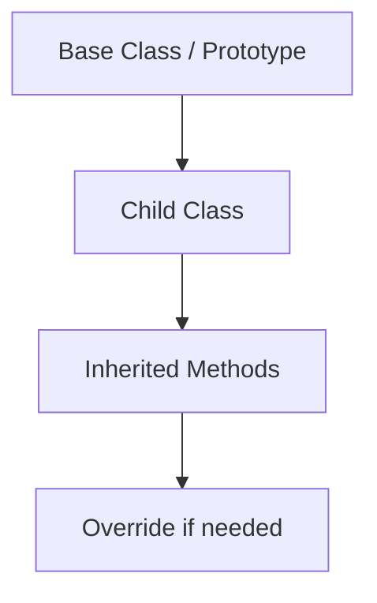

### Code example

```js
class User {
  constructor(name) {
    this.name = name;
  }

  greet() {
    return `Hello ${this.name}`;
  }
}

const u = new User("Karan");
console.log(u.greet());
```

### Output

```txt
Hello Karan
```

### Edge cases

- Forgetting `new` with constructor functions
- Confusing static methods with instance methods

### Common mistakes

- Creating duplicate methods inside constructor unnecessarily

### Best practices

- Put shared behavior on prototype or class methods
- Use classes for clear domain models

### Summary

Prototypes and classes are essential for reusable object-oriented design.

---

## 11. DOM and Events

### What is it?

DOM (Document Object Model) is browser representation of HTML as a tree of nodes.

You can:

- Select elements
- Modify content/styles/attributes
- Handle events like click, input, submit

Event propagation phases:

- Capturing
- Target
- Bubbling

Event delegation handles many child events using one parent listener.

### Real-world scenario

In a todo list:

- One click handler on list parent manages all delete buttons
- New items added later still work without new listeners

### Flow diagram

```mermaid
flowchart TD
A[User Click] --> B[Capture Phase]
B --> C[Target Element]
C --> D[Bubble Phase]
D --> E[Parent Handler Runs]
```

### Code example

```js
const btn = document.querySelector("#saveBtn");
btn.addEventListener("click", () => {
  console.log("Saved");
});
```

### Output

```txt
Saved
```

### Edge cases

- Event bubbling triggers parent unexpectedly
- Query selector returns null if element not loaded yet

### Common mistakes

- Adding too many individual listeners for list items
- Forgetting `event.preventDefault()` on form submit when needed

### Best practices

- Prefer event delegation in dynamic lists
- Register handlers after DOM is ready

### Summary

DOM and events connect user actions to JavaScript behavior.

---

## 12. Async JavaScript

### What is it?

Async JavaScript handles tasks that take time without freezing the UI.

Important parts:

- Callbacks
- `setTimeout` / `setInterval`
- Promises
- `async` / `await`
- Event loop and task queues

### Real-world scenario

When user opens dashboard:

- UI appears quickly
- API requests run in background
- Data cards update when response arrives

### Flow diagram

```mermaid
flowchart TD
A[Call async task] --> B[Browser/Web API handles timer or network]
B --> C[Task callback queued]
C --> D[Call stack empty?]
D -- Yes --> E[Event loop pushes callback]
E --> F[Callback executes]
```

### Code example

```js
console.log("Start");
setTimeout(() => console.log("Timer done"), 0);
console.log("End");
```

### Output

```txt
Start
End
Timer done
```

### Promise + async/await example

```js
function wait(ms) {
  return new Promise((resolve) => setTimeout(resolve, ms));
}

async function run() {
  console.log("A");
  await wait(100);
  console.log("B");
}

run();
```

### Output

```txt
A
B
```

### Edge cases

- Callback hell with deeply nested callbacks
- Unhandled promise rejection crashes flow

### Common mistakes

- Forgetting `await` before promise result
- Mixing callbacks and promises without clear pattern

### Best practices

- Prefer async/await for readability
- Use `try...catch` around awaited calls

### Summary

Async JavaScript keeps apps responsive and is mandatory for API-driven apps.

---

## 13. APIs, Fetch, Axios, and REST Basics

### What is it?

API is a contract to exchange data between client and server.

REST basics:

- GET: read data
- POST: create data
- PUT/PATCH: update data
- DELETE: remove data

`fetch` is browser-native HTTP client.
Axios is a popular external HTTP library.

### Real-world scenario

Product page calls GET `/products`; checkout calls POST `/orders`.

### Flow diagram

```mermaid
flowchart LR
A[Frontend Request] --> B[API Endpoint]
B --> C[Server Logic]
C --> D[JSON Response]
D --> E[Render UI]
```

### Code example (fetch)

```js
async function getUsers() {
  const res = await fetch("https://jsonplaceholder.typicode.com/users");
  const data = await res.json();
  console.log(data.length);
}

getUsers();
```

### Output (example)

```txt
10
```

### Edge cases

- Network failure or timeout
- API returns non-200 status

### Common mistakes

- Not checking `res.ok` before parsing JSON
- Assuming API always returns expected shape

### Best practices

- Validate response status and schema
- Show user-friendly loading and error states

### Summary

API handling is a core real-world JavaScript skill.

---

## 14. Error Handling and Debugging

### What is it?

Error handling catches and manages failures safely.

Core tools:

- `try...catch...finally`
- `throw new Error(...)`
- browser DevTools
- stack trace analysis

### Real-world scenario

In payment flow, if gateway call fails, app should show retry message instead of blank screen.

### Flow diagram

```mermaid
flowchart TD
A[Run risky code] --> B{Error occurs?}
B -- No --> C[Continue normally]
B -- Yes --> D[Catch and handle]
D --> E[Log + user friendly message]
```

### Code example

```js
try {
  const data = JSON.parse("{ bad json }");
  console.log(data);
} catch (error) {
  console.log("Invalid JSON:", error.message);
}
```

### Output

```txt
Invalid JSON: Unexpected token b in JSON at position 2
```

### Edge cases

- Catching error but silently ignoring it
- Throwing string instead of Error object

### Common mistakes

- No error handling for async API calls

### Best practices

- Throw `Error` objects with meaningful messages
- Keep central logging for production issues

### Summary

Good error handling improves reliability and user trust.

---

## 15. Useful Built-ins: Date, Math, Map, Set

### What is it?

JavaScript provides built-in objects for common tasks.

- `Math`: calculations
- `Date`: time handling
- `Map`: key-value with any key type
- `Set`: unique values collection

### Real-world scenario

- Use Date for order timestamps
- Use Set to remove duplicate tags
- Use Map for fast lookup by object keys

### Flow diagram

```mermaid
flowchart LR
A[Input Data] --> B{Need uniqueness?}
B -- Yes --> C[Use Set]
B -- No --> D{Need key-value with custom keys?}
D -- Yes --> E[Use Map]
D -- No --> F[Use Object/Array]
```

### Code example

```js
const tags = ["js", "api", "js"];
const uniqueTags = [...new Set(tags)];
console.log(uniqueTags);
```

### Output

```txt
[ 'js', 'api' ]
```

### Edge cases

- Date parsing varies by input format
- Floating point math precision issues

### Common mistakes

- Using object where Map is better for frequent dynamic keys

### Best practices

- Use ISO date formats
- Use Set for uniqueness and Map for lookup-heavy logic

### Summary

Built-ins reduce code and improve clarity.

---

## 16. Modern JS Features (ES6+)

### What is it?

Modern JavaScript adds cleaner syntax and safer patterns.

Key features:

- Template literals
- Destructuring
- Rest parameter
- Spread operator
- Default parameters
- Optional chaining
- Nullish coalescing

### Real-world scenario

API response object can be safely read with optional chaining and defaults to avoid runtime crashes.

### Flow diagram

```mermaid
flowchart TD
A[Complex Object] --> B[Destructure needed fields]
B --> C[Use defaults for missing values]
C --> D[Render safe UI]
```

### Code example

```js
const user = { name: "Aman", address: { city: "Delhi" } };
const city = user.address?.city ?? "Unknown";
const { name } = user;
console.log(`${name} - ${city}`);
```

### Output

```txt
Aman - Delhi
```

### Edge cases

- Spread is shallow copy, not deep copy
- Destructuring undefined object throws error

### Common mistakes

- Overusing nested destructuring reducing readability

### Best practices

- Use features where they improve clarity
- Prefer readable over clever one-liners

### Summary

ES6+ features make code shorter, safer, and easier to maintain.

---

## 17. Interview Question Bank

### JavaScript Core

1. What is JavaScript and where can it run?
2. Explain execution context and call stack.
3. Difference between `var`, `let`, and `const`.
4. What is TDZ?
5. Difference between `==` and `===`.

### Functions

1. Function declaration vs function expression.
2. Arrow function vs normal function.
3. What is callback function?
4. What is higher-order function?
5. Explain closure with practical example.
6. Explain currying with practical example.

### Objects and OOP

1. What is prototype chain?
2. Difference between constructor function and class.
3. Explain `this` keyword in different contexts.
4. Explain `call`, `apply`, and `bind`.

### DOM and Events

1. What is event bubbling and capturing?
2. What is event delegation and why use it?
3. Difference between `innerText` and `textContent`.

### Async and API

1. Explain event loop.
2. Callback vs Promise vs async/await.
3. What is promise chaining?
4. How do you handle API errors in fetch?
5. Difference between fetch and axios.

---

## 18. Final Learning Roadmap

### Concept coverage aligned with your notes collection

This guide now includes concepts reflected in your JS notes set, including:

- Variables, datatypes, arrays, objects, operators, loops
- Hoisting, scope, functions, callbacks, IIFE, recursion
- Closures, currying, higher-order functions
- `this`, `call`, `apply`, `bind`
- Prototype, classes, inheritance, static behavior
- DOM manipulation, event propagation, event delegation
- Async basics, timers, promises, async/await
- REST API, fetch, axios, and error handling
- Date, Math, Map, Set, and modern ES6 features

### Recommended learning order

1. Runtime model and variables
2. Functions and arrays
3. Objects and `this`
4. Prototype and classes
5. DOM and events
6. Async JavaScript and APIs
7. Error handling and real project patterns

> [!TIP]
> For interview preparation, do not only read definitions. Practice by writing and dry-running each concept with small code snippets.

> [!WARNING]
> Real-world bugs usually happen because of scope confusion, async timing issues, or context (`this`) mistakes. Practice these deeply.

> [!INFO]
> Use Mermaid diagrams in this file as visual memory anchors when revising concepts quickly.

