# JavaScript Beginner Guide

> A complete beginner-friendly JavaScript guide with simple explanations, real-world analogies, flow diagrams, and interview-focused notes.

## Table of Contents

- [1. What is JavaScript?](#1-what-is-javascript)
- [2. JavaScript Execution Context (Most Important Foundation)](#2-javascript-execution-context-most-important-foundation)
- [3. Global Execution Context](#3-global-execution-context)
- [4. Memory Creation Phase and Execution Phase](#4-memory-creation-phase-and-execution-phase)
- [5. Function Execution Context](#5-function-execution-context)
- [6. Function Memory Creation and Function Execution Phase](#6-function-memory-creation-and-function-execution-phase)
- [7. Hoisting in JavaScript](#7-hoisting-in-javascript)
- [8. TDZ (Temporal Dead Zone)](#8-tdz-temporal-dead-zone)
- [9. let vs const vs var](#9-let-vs-const-vs-var)
- [10. Function Declaration](#10-function-declaration)
- [11. Function Expression](#11-function-expression)
- [12. Arrow Functions](#12-arrow-functions)
- [13. Closures](#13-closures)
- [14. Currying](#14-currying)
- [15. Final Revision Tables](#15-final-revision-tables)
- [16. Quick Interview Revision Questions](#16-quick-interview-revision-questions)

---

## 1. What is JavaScript?

### What is it?

JavaScript is a **programming language** used to make websites interactive.

A programming language is a way to write instructions for a computer.

Without JavaScript, a web page is mostly static (only shows content). With JavaScript, pages can respond to user actions like clicks, typing, scrolling, form submission, and API calls.

### Why do we need it?

- To update page content without reloading the page
- To validate forms before sending data
- To create interactive UI (menus, sliders, modals)
- To build full web applications (frontend and backend with Node.js)

### Real-world analogy

Think of a website as a car:

- HTML = car body (structure)
- CSS = paint and design (style)
- JavaScript = engine + electronics (behavior and movement)

### Flow diagram

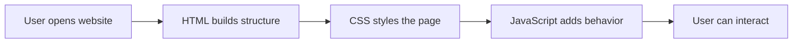

### Code example

```js
console.log("Hello World");
```

### Output

```txt
Hello World
```

### Short history (simple)

| Year | Event |
|---|---|
| 1995 | JavaScript created by Brendan Eich |
| 1996 | Sent to ECMA for standardization |
| 1997 | ECMAScript standard released |
| 2015 | ES6 (major modern update) |

### Why browsers need JavaScript

Browsers read HTML and CSS to show content and style, but they need JavaScript to run logic such as:

- "When button is clicked, open menu"
- "When user types email, check format"
- "When data comes from server, show it in table"

### Common interview questions

1. What is JavaScript and where is it used?
2. Is JavaScript the same as Java?
3. What is ECMAScript?

### Common mistakes

- Thinking JavaScript and Java are the same language
- Thinking JavaScript is only for browsers (it also runs on servers)

### Best practices

- Learn fundamentals deeply before frameworks
- Practice by building small projects
- Read browser console errors carefully

### Summary

JavaScript is the behavior layer of the web. It makes pages dynamic and interactive.

---

## 2. JavaScript Execution Context (Most Important Foundation)

> **Technical term:** Execution Context means the environment where JavaScript code is evaluated and executed.


### What is it?

Execution Context is like a box where JavaScript keeps:

- Variables
- Function definitions
- Current line of execution

JavaScript creates contexts in a stack-like order.

### Why do we need it?

Without execution context, JavaScript would not know:

- Where variables live
- Which function is currently running
- What should execute next

### Real-world analogy

Imagine an office desk:

- Files on desk = variables/functions in memory
- Person working on current file = current execution line
- New task comes = new desk (new function execution context)

### Flow diagram

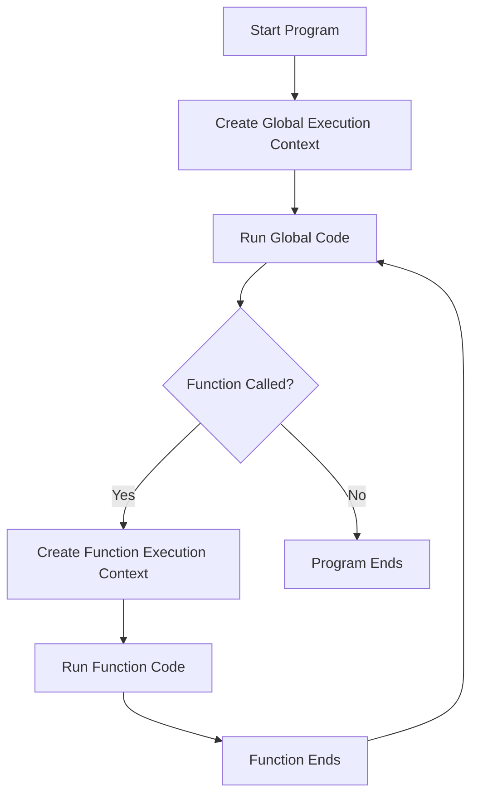

### Code example

```js
var user = "Asha";

function greet() {
  var message = "Hello";
  console.log(message, user);
}

greet();
```

### Output

```txt
Hello Asha
```

### Diagram reference

From the image:

- Global box is created first
- Function box is created when `greet()` runs
- Function box is removed after function completes

### Interview questions

1. What is an execution context in JavaScript?
2. How many phases are there in execution context creation?
3. What is the difference between global and function execution context?

### Common mistakes

- Mixing call stack with memory model
- Thinking all code runs line-by-line without context setup

### Best practices

- Visualize context creation while debugging
- Use clear variable names to track scope

### Summary

Execution context is the basic runtime model of JavaScript. Mastering it makes hoisting, closures, and scope easy.

---

## 3. Global Execution Context


### What is it?

Global Execution Context (GEC) is the default context created when JavaScript file starts running.

It handles global code (code outside any function).

### Why do we need it?

Because every program needs a starting environment.

### Real-world analogy

GEC is like the main hall of a building. Every new room (function context) connects to the main hall.

### Flow diagram

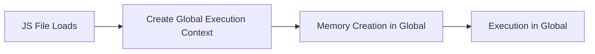

### Code example

```js
var appName = "ShopEasy";

function showApp() {
  console.log(appName);
}

showApp();
```

### Output

```txt
ShopEasy
```

### Diagram reference

In the image, the first and permanent context during script run is Global Execution Context.

### Interview questions

1. When is global execution context created?
2. Can there be multiple global execution contexts in one JS file run?

### Common mistakes

- Declaring too many globals and polluting global scope

### Best practices

- Minimize global variables
- Prefer block/function scope for safety

### Summary

Global Execution Context is the root execution environment.

---

## 4. Memory Creation Phase and Execution Phase


### What is it?

JavaScript runs each execution context in **two phases**:

1. Memory Creation Phase (also called Creation Phase)
2. Execution Phase

### Why do we need it?

This two-step process allows JavaScript to collect declarations first, then execute code safely.

### Real-world analogy

Cooking process:

1. Collect ingredients (memory creation)
2. Cook step-by-step (execution)

### Flow diagram

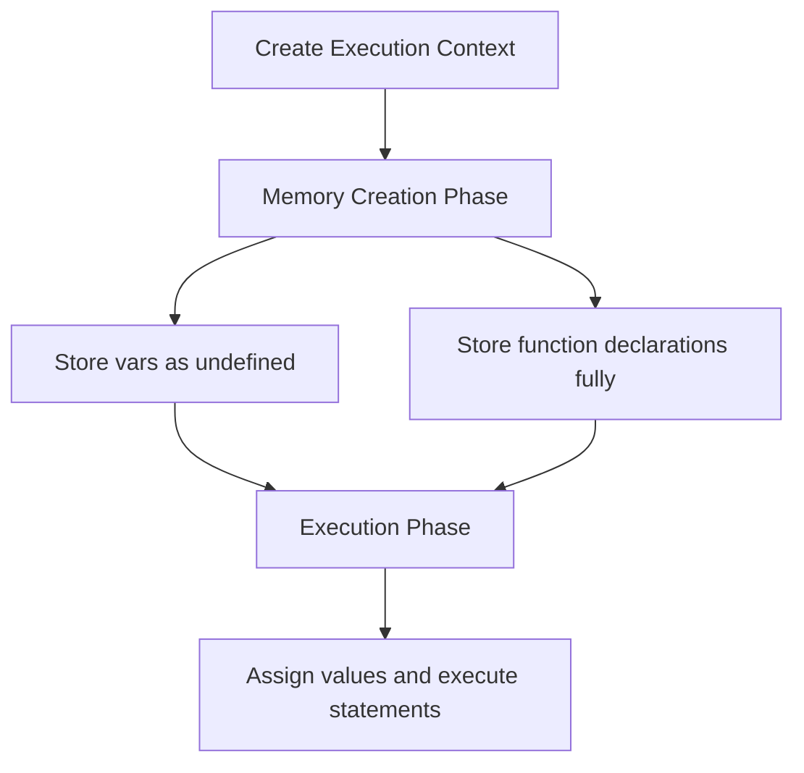

### Code example

```js
console.log(a); // during execution, a exists but is undefined
sayHi();

var a = 10;

function sayHi() {
  console.log("Hi");
}
```

### Output

```txt
undefined
Hi
```

### Diagram reference

From the image:

- In memory phase: `var` gets `undefined`, function declaration gets full function body
- In execution phase: values are assigned and function calls run

### Interview questions

1. What happens in memory creation phase?
2. Why can function declarations be called before definition line?

### Common mistakes

- Assuming `var` is not declared until its line executes
- Confusing initialization with declaration

### Best practices

- Declare variables before usage for readability
- Avoid relying on hoisting behavior in production code

### Summary

JavaScript first prepares memory, then executes code. This explains hoisting behavior.

---

## 5. Function Execution Context


### What is it?

When a function is called, JavaScript creates a new execution context for that function.

### Why do we need it?

Each function needs its own local variables and parameters.

### Real-world analogy

A company has one main office (global context). Each meeting room is a function context, with its own whiteboard notes.

### Flow diagram

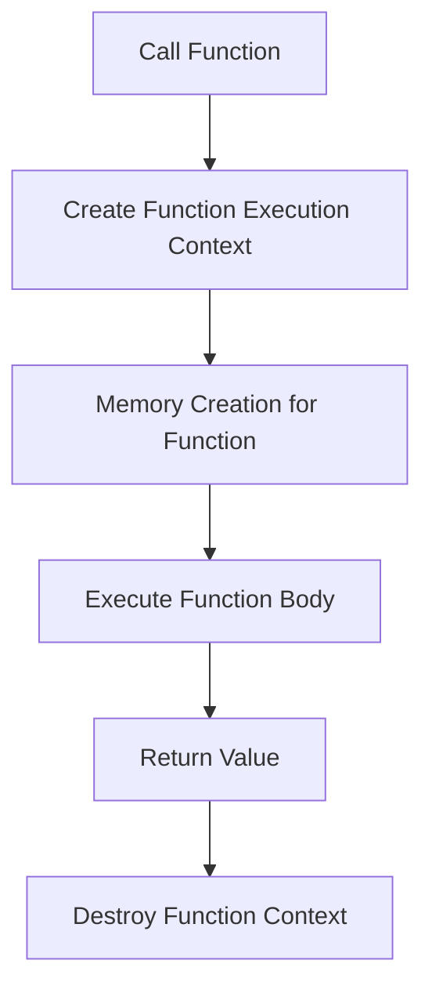

### Code example

```js
function add(x, y) {
  var result = x + y;
  return result;
}

console.log(add(2, 3));
```

### Output

```txt
5
```

### Diagram reference

In the image, each function call gets a separate function execution box. After return, that box is removed.

### Interview questions

1. When is function execution context created?
2. What happens to function local variables after function returns?

### Common mistakes

- Expecting local variable to exist outside function

### Best practices

- Keep functions focused and small
- Use parameters instead of unnecessary global variables

### Summary

Each function call creates its own temporary execution context.

---

## 6. Function Memory Creation and Function Execution Phase


### What is it?

Just like global context, function context also has:

- Memory Creation Phase
- Execution Phase

### Why do we need it?

To prepare parameter/local declarations before executing statements.

### Real-world analogy

Before a classroom session starts:

- Attendance sheet and board are prepared (memory creation)
- Teaching starts (execution)

### Flow diagram

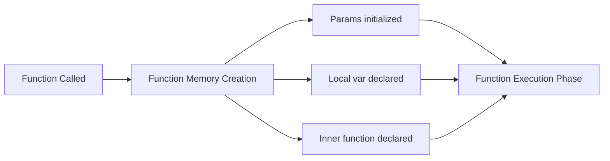

### Code example

```js
function demo(p) {
  console.log(p);
  console.log(localVar);
  var localVar = "ready";
  console.log(localVar);
}

demo("start");
```

### Output

```txt
start
undefined
ready
```

### Diagram reference

From the execution image:

- `p` is available at start of function execution
- `localVar` is declared as `undefined` in memory phase, value assigned later

### Interview questions

1. Are function parameters available before execution lines run?
2. Why is a local `var` undefined before assignment?

### Common mistakes

- Thinking local `var` is not created until line is reached

### Best practices

- Prefer `let`/`const` for predictable behavior

### Summary

Function context follows the same two-phase model as global context.

---

## 7. Hoisting in JavaScript

> **Technical term:** Hoisting means JavaScript behavior where declarations are processed before execution.


### What is it?

During memory creation:

- `var` declaration is hoisted and initialized with `undefined`
- Function declaration is hoisted with full function definition
- `let` and `const` are hoisted but stay in TDZ until declaration line

### Why do we need it?

It is part of JavaScript engine design because declaration scanning happens before execution.

### Real-world analogy

Event organizer writes all participant names before event starts. Some participants are "ready" (functions), some are listed but not ready (`var` undefined), some cannot be accessed yet (`let`/`const` in TDZ).

### Flow diagram

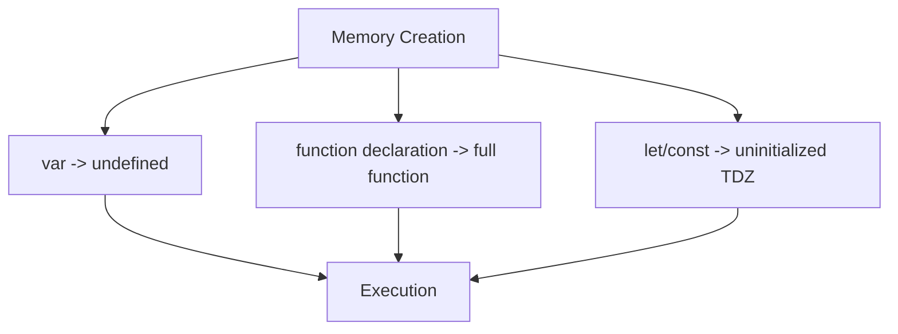

### Code example

```js
console.log(a);
hello();

var a = 1;

function hello() {
  console.log("Hello");
}
```

### Output

```txt
undefined
Hello
```

### Diagram reference

In the provided image, hoisting is visible in memory creation phase boxes.

### Interview questions

1. Is hoisting moving code physically to top?
2. Difference between variable hoisting and function hoisting?

### Common mistakes

- Assuming hoisting rewrites source code
- Using variable before assignment and expecting final value

### Best practices

- Write declarations before use, even if hoisting works
- Do not depend on hoisting for logic

### Summary

Hoisting is a creation-phase behavior, not a source-code movement.

---

## 8. TDZ (Temporal Dead Zone)

> **Technical term:** TDZ is the time between scope start and `let`/`const` declaration line where variable exists but cannot be accessed.


### What is it?

`let` and `const` are hoisted, but they are uninitialized until declaration line executes.

Accessing them before declaration gives `ReferenceError`.

### Why do we need it?

TDZ prevents accidental use of variables before proper initialization.

### Real-world analogy

A seat is reserved with your name (`let` exists), but you are not allowed to sit until event officially starts (declaration line).

### Flow diagram

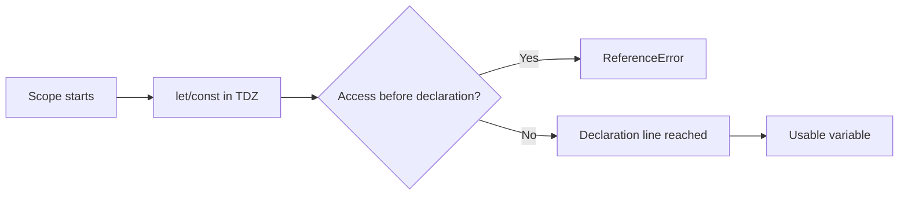

### Code example

```js
// console.log(score); // ReferenceError
let score = 100;
console.log(score);
```

### Output

```txt
100
```

### Diagram reference

In the execution diagram, TDZ lives in creation-to-declaration window for `let` and `const`.

### Interview questions

1. What is TDZ in JavaScript?
2. Does `var` have TDZ?

### Common mistakes

- Treating `let` like `var`
- Accessing `const` before declaration

### Best practices

- Declare `let`/`const` at top of their block when possible
- Use `const` by default, `let` when reassignment is needed

### Summary

TDZ is a safety feature that blocks early access to `let`/`const`.

---

## 9. let vs const vs var


### What is it?

These are three ways to declare variables.

| Feature | `var` | `let` | `const` |
|---|---|---|---|
| Scope | Function scope | Block scope | Block scope |
| Re-declare | Yes | No | No |
| Re-assign | Yes | Yes | No |
| Hoisted | Yes (`undefined`) | Yes (TDZ) | Yes (TDZ) |
| Recommended now | No | Yes | Yes (default) |

> **Technical term:** Scope means where a variable can be accessed.

### Why do we need it?

Different declarations support different safety and design requirements.

### Real-world analogy

- `var`: old flexible notebook (easy but risky)
- `let`: editable form field
- `const`: sealed label (cannot point to another value)

### Flow diagram

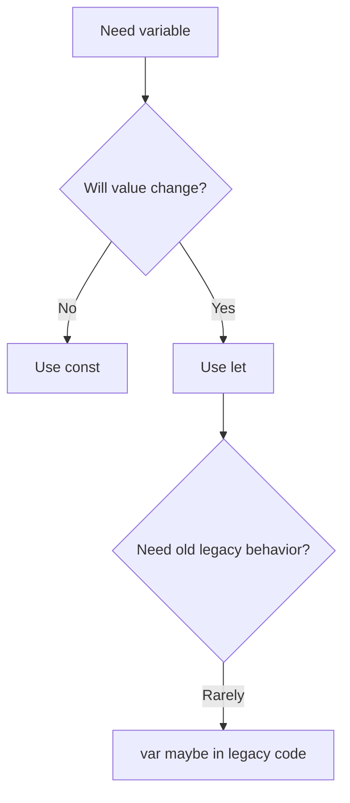

### Code example

```js
var city = "Delhi";
let age = 20;
const country = "India";

age = 21;
city = "Mumbai";

console.log(city, age, country);
```

### Output

```txt
Mumbai 21 India
```

### Diagram reference

Using the execution diagram:

- `var` appears as `undefined` in memory phase
- `let`/`const` stay in TDZ until declaration line

### Interview questions

1. Difference between `var`, `let`, and `const`?
2. Why is `const` preferred?
3. Is `const` object fully immutable?

### Common mistakes

- Using `var` in modern code
- Thinking `const` makes object deeply immutable

### Best practices

- Use `const` by default
- Use `let` when reassignment needed
- Avoid `var` unless maintaining legacy code

### Summary

`let` and `const` provide safer, clearer variable behavior than `var`.

---

## 10. Function Declaration


### What is it?

A function declaration is a named function defined with `function` keyword as a standalone statement.

### Why do we need it?

It creates reusable logic and is hoisted fully, so it can be called before definition line.

### Real-world analogy

Function declaration is like a registered office department. It exists in the company directory before someone calls it.

### Flow diagram

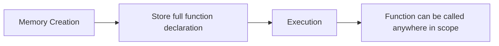

### Code example

```js
sayName();

function sayName() {
  console.log("Riya");
}
```

### Output

```txt
Riya
```

### Diagram reference

In the diagram, function declarations are fully available in memory creation phase.

### Interview questions

1. Can we call function declaration before line where it is written?
2. Why?

### Common mistakes

- Confusing declaration with expression

### Best practices

- Use clear verb-based names (`getUser`, `calculateTotal`)

### Summary

Function declarations are hoisted with full definition and are very interview-important.

---

## 11. Function Expression


### What is it?

A function expression is when a function is assigned to a variable.

### Why do we need it?

Useful when passing functions around or keeping function as data.

### Real-world analogy

Function declaration is a full-time employee with registered role. Function expression is a contractor assigned to a desk variable.

### Flow diagram

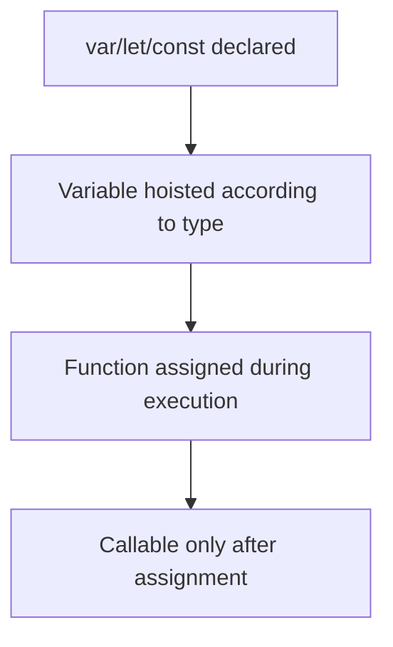

### Code example

```js
var greet = function () {
  console.log("Hello from expression");
};

greet();
```

### Output

```txt
Hello from expression
```

### Diagram reference

From execution image:

- Only variable declaration is prepared in memory phase
- Function body is assigned in execution phase

### Interview questions

1. Difference between function declaration and function expression?
2. Why calling function expression before assignment may fail?

### Common mistakes

- Calling expression before assignment

### Best practices

- Prefer `const` with function expressions to avoid reassignment

### Summary

Function expressions are assigned at runtime, not fully hoisted like declarations.

---

## 12. Arrow Functions


### What is it?

Arrow function is a shorter function syntax introduced in ES6.

### Why do we need it?

- Cleaner syntax
- Useful in callbacks
- Lexical `this` behavior (advanced, but very useful)

> **Technical term:** Lexical `this` means `this` comes from surrounding scope, not from how function is called.

### Real-world analogy

Normal function chooses identity based on who called it. Arrow function keeps identity from where it was born.

### Flow diagram

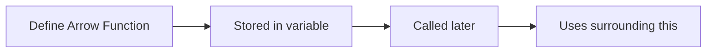

### Code example

```js
const square = (n) => n * n;
console.log(square(4));
```

### Output

```txt
16
```

### Diagram reference

Arrow functions used as expressions follow expression assignment behavior in execution context diagram.

### Interview questions

1. Difference between arrow function and normal function?
2. Do arrow functions have their own `this`?

### Common mistakes

- Using arrow function as object method when dynamic `this` is needed

### Best practices

- Use arrow functions for short callbacks
- Use normal functions when you need your own `this`

### Summary

Arrow functions are concise and powerful, but understand `this` difference clearly.

---

## 13. Closures

> **Technical term:** Closure means a function remembers variables from its outer scope even after outer function has finished.


### What is it?

A closure is created when an inner function accesses variables from outer function.

### Why do we need it?

- Data privacy
- Function factories
- Maintaining state between calls

### Real-world analogy

A backpack carried by a traveler. Even after leaving home (outer function ends), traveler still has items from home (outer variables).

### Flow diagram

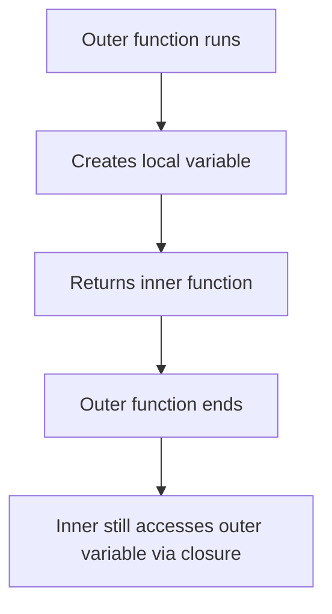

### Code example

```js
function counter() {
  let count = 0;
  return function () {
    count++;
    console.log(count);
  };
}

const inc = counter();
inc();
inc();
inc();
```

### Output

```txt
1
2
3
```

### Diagram reference

In terms of the execution diagram, inner function keeps reference to outer lexical environment even after outer execution context is popped.

### Interview questions

1. What is closure?
2. Why closures are useful?
3. Any memory risks with closures?

### Common mistakes

- Creating unnecessary closures in loops without understanding scope

### Best practices

- Use closures intentionally for encapsulation
- Release references if no longer needed in long-running apps

### Summary

Closures keep outer variables alive for inner functions. This is one of the most important JavaScript features.

---

## 14. Currying

> **Technical term:** Currying means converting a function with multiple arguments into nested functions that take one argument at a time.


### What is it?

Currying transforms:

`f(a, b, c)` into `f(a)(b)(c)`

### Why do we need it?

- Reuse partially applied functions
- Better composition
- Cleaner functional style in some cases

### Real-world analogy

Ordering food in steps:

1. Choose restaurant
2. Choose dish
3. Choose quantity

Each step returns next step.

### Flow diagram

```mermaid
flowchart LR
A[f(a,b,c)] --> B[f(a)]
B --> C[f(a)(b)]
C --> D[f(a)(b)(c)]
D --> E[Final result]
```

### Code example

```js
function multiply(a) {
  return function (b) {
    return a * b;
  };
}

const double = multiply(2);
console.log(double(5));
console.log(multiply(3)(4));
```

### Output

```txt
10
12
```

### Diagram reference

Each returned function call creates a new execution context, as shown by the context stacking concept in the execution diagram.

### Interview questions

1. What is currying?
2. Difference between currying and partial application?
3. Practical use cases?

### Common mistakes

- Overusing currying where simple function is clearer

### Best practices

- Use currying where reuse/composition benefits are clear
- Keep readability first

### Summary

Currying breaks multi-argument functions into step-by-step function calls for flexibility.

---

## 15. Final Revision Tables

### A. Execution-context-centric revision

| Concept | Key Point | Linked to Diagram |
|---|---|---|
| Global Execution Context | Created first for global code | Main/global box |
| Memory Creation Phase | Declarations processed | Memory area |
| Execution Phase | Statements run line-by-line | Execution area |
| Function Execution Context | Created on each function call | New stacked box |
| Hoisting | Declaration availability before execution lines | Creation phase |
| TDZ | `let`/`const` unavailable before declaration line | Pre-initialization zone |

### B. Functions revision

| Type | Hoisting | Can call before definition? | Notes |
|---|---|---|---|
| Function Declaration | Full function hoisted | Yes | Most interview-friendly |
| Function Expression | Variable hoisted (depends on `var/let/const`) | Usually no | Assigned during execution |
| Arrow Function | Expression style | No (before assignment) | Lexical `this` |

---

## 16. Quick Interview Revision Questions

1. Explain execution context with phases.
2. What is global execution context?
3. What is function execution context?
4. Explain hoisting of `var`, `let`, `const`, and functions.
5. What is TDZ and why does it exist?
6. Compare `var`, `let`, and `const`.
7. Function declaration vs function expression?
8. Arrow function vs normal function?
9. What is closure with practical example?
10. What is currying and where is it used?

---

## Final Notes

> [!TIP]
> Learn JavaScript in this order:
> 1) Execution Context and Hoisting
> 2) Scope and Closures
> 3) Functions and Array Methods
> 4) Async JavaScript (Promises, async/await)

> [!WARNING]
> Do not memorize only definitions. Always dry-run code line by line using the execution context model shown in the image.

> [!INFO]
> Revisit this diagram every time you get confused:
>
> 
