# JavaScript Beginner Guide

> Complete JavaScript documentation in simple English for beginners, interview preparation, and developers moving from other languages.

## Table of Contents

- [1. JavaScript at a Glance](#1-javascript-at-a-glance)
- [2. Runtime Model: Execution Context and Call Stack](#2-runtime-model-execution-context-and-call-stack)
- [3. Variables, Scope, and Data Types](#3-variables-scope-and-data-types)
- [4. Type Coercion and Equality](#4-type-coercion-and-equality)
- [5. Operators, Statements, and Loops](#5-operators-statements-and-loops)
- [6. Functions Deep Dive](#6-functions-deep-dive)
- [7. Arrays and Array Methods](#7-arrays-and-array-methods)
- [8. Objects and Object Patterns](#8-objects-and-object-patterns)
- [9. this, call, apply, bind](#9-this-call-apply-bind)
- [10. Prototype and Classes](#10-prototype-and-classes)
- [11. DOM and Events](#11-dom-and-events)
- [12. Async JavaScript](#12-async-javascript)
- [13. APIs, Fetch, Axios, and REST Basics](#13-apis-fetch-axios-and-rest-basics)
- [14. Error Handling and Debugging](#14-error-handling-and-debugging)
- [15. Useful Built-ins: Date, Math, Map, Set](#15-useful-built-ins-date-math-map-set)
- [16. Modern JS Features (ES6+)](#16-modern-js-features-es6)
- [17. Interview Question Bank](#17-interview-question-bank)
- [18. Final Learning Roadmap](#18-final-learning-roadmap)

---

## 1. JavaScript at a Glance

### What is it?

JavaScript is a programming language that tells your app what to do at runtime.

Runtime means "when code is actually running".

JavaScript can:

- Read user actions (click, type, scroll)
- Process data (validate, filter, calculate)
- Update UI (show error, open modal, render list)
- Talk to server APIs (get products, save orders)

JavaScript is used in:

- Browsers (frontend)
- Servers using Node.js (backend)
- Mobile and desktop apps through frameworks

### Real-world scenario

In an e-commerce app:

- User clicks Add to Cart
- JavaScript adds item in local state
- JavaScript updates cart count badge
- JavaScript sends API call to store cart

### Flow diagram

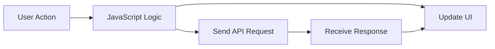

### Code example

```js
const productName = "Laptop";
const price = 59999;
console.log(`${productName} added. Price: ${price}`);
```

### Output

```txt
Laptop added. Price: 59999
```

### Common mistakes

- Thinking JavaScript and Java are same language
- Thinking JavaScript runs only in browser

### Best practices

- Build fundamentals before frameworks
- Practice daily with small problems
- Read console errors line by line

### Summary

JavaScript is the behavior engine of modern applications.

---

## 2. Runtime Model: Execution Context and Call Stack


### What is it?

Execution context is the internal runtime environment where JavaScript executes code.

Each context stores:

- Variables in scope
- Function declarations and references
- `this` value
- Current instruction pointer

Main types:

- Global Execution Context (created first)
- Function Execution Context (created on each function call)

Each function call is pushed to call stack, and removed when complete.

### Real-world scenario

In checkout flow:

- `placeOrder()` calls `validateCart()`
- `validateCart()` calls `checkStock()`
- If `checkStock()` fails, stack trace helps locate exact failure point

### Flow diagram

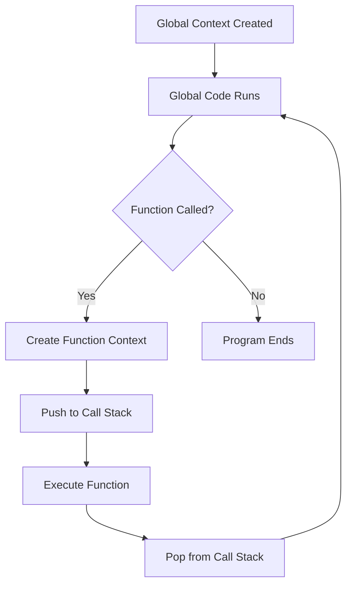

### Code example

```js
function one() {
  two();
}

function two() {
  console.log("Inside two");
}

one();
```

### Output

```txt
Inside two
```

### Edge cases

- Deep recursion can cause call stack overflow
- Large global scope can increase accidental name conflicts

### Common mistakes

- Confusing memory creation with execution order
- Not reading stack traces while debugging

### Best practices

- Keep functions small and focused
- Use debugger and breakpoints for call flow

### Summary

Execution context and call stack explain how JavaScript really runs your code.

---

## 3. Variables, Scope, and Data Types

### What is it?

Variable is a named container for data.

Scope is the area where a variable can be accessed.

JavaScript keywords:

- `var`: function scope, older style
- `let`: block scope, can reassign
- `const`: block scope, cannot reassign reference

Data types:

- Primitive: string, number, boolean, null, undefined, bigint, symbol
- Non-primitive: object, array, function

### Real-world scenario

In login page:

- `const apiUrl` should not change
- `let attempts` changes after each failed login
- Avoid using `var` to prevent scope confusion

### Flow diagram

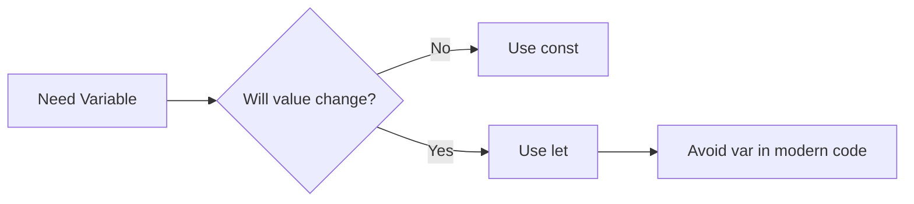

### Code example

```js
const appName = "ShopEasy";
let attempts = 0;
attempts = attempts + 1;
console.log(appName, attempts);
```

### Output

```txt
ShopEasy 1
```

### Edge cases

- `const` object properties can still change
- `var` declared in loop can leak outside block

### Common mistakes

- Using `var` in modern code
- Accessing `let` or `const` before declaration

### Best practices

- Use `const` by default
- Use `let` only when reassignment is required
- Keep variable names descriptive

### Summary

Correct variable and scope choices prevent many early bugs.

---

## 4. Type Coercion and Equality

### What is it?

Type coercion means JavaScript converts one data type to another automatically in some operations.

Equality operators:

- `==` loose equality (allows type conversion)
- `===` strict equality (no type conversion)

### Real-world scenario

In payment validation, string input from form may be compared with numeric value. Wrong comparison can approve invalid data.

### Flow diagram

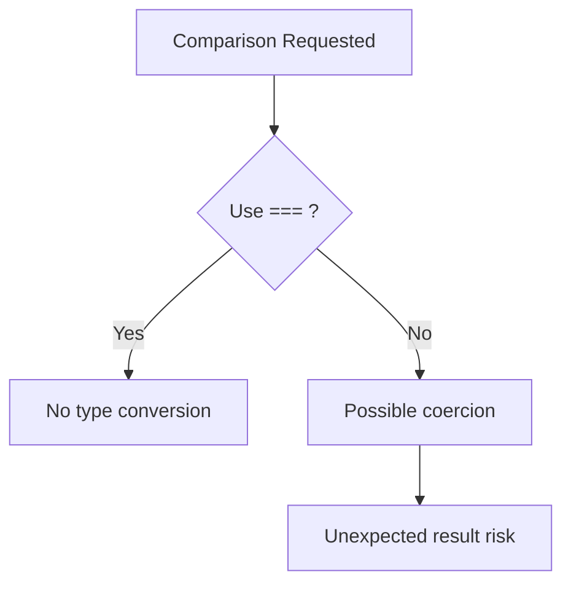

### Code example

```js
console.log(5 == "5");
console.log(5 === "5");
console.log("10" + 2);
console.log("10" - 2);
```

### Output

```txt
true
false
102
8
```

### Edge cases

- `"" == 0` is true
- `null == undefined` is true, but `null === undefined` is false

### Common mistakes

- Using `==` in critical business logic
- Assuming `+` always does numeric addition

### Best practices

- Prefer `===` and `!==`
- Convert input explicitly: `Number(value)`, `String(value)`

### Summary

Understand coercion clearly to avoid hidden logical bugs.

---

## 5. Operators, Statements, and Loops

### What is it?

Operators perform actions on values.

Main categories:

- Arithmetic: `+ - * / % **`
- Assignment: `= += -=`
- Comparison: `> < >= <= ===`
- Logical: `&& || !`

Statements control flow:

- `if...else`
- `switch`
- loops: `for`, `while`, `do...while`, `for...of`, `for...in`

### Real-world scenario

Order discount flow:

- if amount > 5000, apply 10% discount
- else if amount > 2000, apply 5%
- else no discount

### Flow diagram

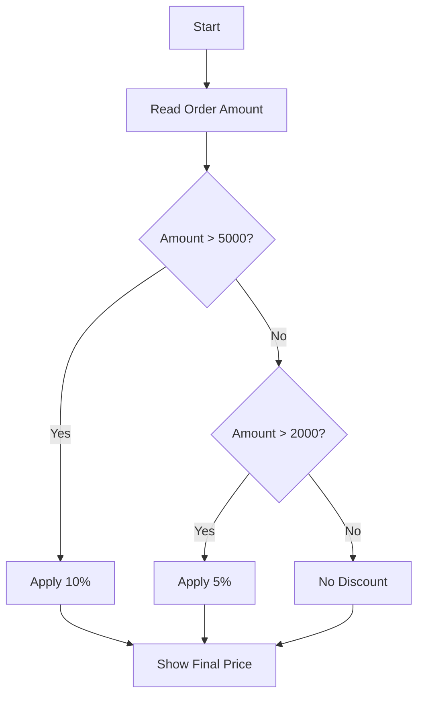

### Code example

```js
const amount = 3200;
let discount = 0;

if (amount > 5000) {
  discount = 10;
} else if (amount > 2000) {
  discount = 5;
}

console.log(`Discount: ${discount}%`);
```

### Output

```txt
Discount: 5%
```

### Edge cases

- Infinite loop if condition never changes
- `for...in` on arrays can give unexpected keys

### Common mistakes

- Using `for...in` instead of `for...of` for arrays
- Missing `break` inside `switch`

### Best practices

- Use `for...of` for array values
- Keep loop body short and readable

### Summary

Control flow and loops are core tools for program logic.

---

## 6. Functions Deep Dive

### What is it?

Function is a reusable block of code.

Main function styles:

- Function Declaration
- Function Expression
- Arrow Function
- IIFE (Immediately Invoked Function Expression)

Advanced function patterns:

- Callback function
- Higher-order function
- Recursion
- Closure
- Currying

### Real-world scenario

In a report app:

- One function fetches data
- Another validates rows
- Another formats output
- Callback or higher-order function customizes behavior

### Flow diagram

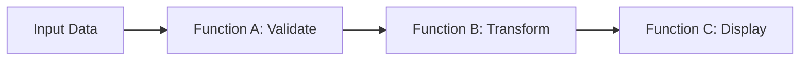

### Code example

```js
function greet(name) {
  return `Hello ${name}`;
}

const result = greet("Asha");
console.log(result);
```

### Output

```txt
Hello Asha
```

### Simple examples for key patterns

```js
// Callback
function processOrder(id, callback) {
  callback(`Order ${id} processed`);
}

processOrder(101, (msg) => console.log(msg));

// IIFE
(function () {
  console.log("IIFE executed once");
})();
```

### Output

```txt
Order 101 processed
IIFE executed once
```

### Edge cases

- Calling function expression before assignment causes error
- Recursive function without base condition causes stack overflow

### Common mistakes

- Huge functions with too many responsibilities
- Not returning values when caller expects output

### Best practices

- Keep single responsibility per function
- Name functions with verb + purpose

### Summary

Functions are the building blocks of clean and reusable JavaScript logic.

---

## 7. Arrays and Array Methods

### What is it?

Array is an ordered list of values.

Important methods:

- Add/remove: `push`, `pop`, `shift`, `unshift`, `splice`
- Search: `includes`, `indexOf`, `find`
- Transform: `map`, `filter`, `reduce`
- Iterate: `forEach`
- Sort: `sort` (careful with numbers)

### Real-world scenario

Product listing page:

- Filter category
- Map to UI card model
- Reduce to total cart value

### Flow diagram

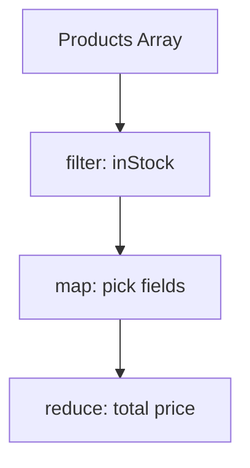

### Code example

```js
const prices = [100, 200, 300, 400];
const total = prices.reduce((sum, p) => sum + p, 0);
console.log(total);
```

### Output

```txt
1000
```

### Edge cases

- Default `sort()` sorts as strings
- Mutating original arrays can break shared state

### Common mistakes

- Forgetting to return inside `map`
- Using `map` when no transformed array is needed

### Best practices

- Use immutable patterns when possible
- Use descriptive callback names

### Summary

Array methods make data processing concise and readable.

---

## 8. Objects and Object Patterns

### What is it?

Object stores key-value pairs.

Common operations:

- Create and update properties
- Optional chaining `?.`
- Destructuring for clean extraction
- Object methods for behavior

### Real-world scenario

User profile object stores name, email, role, preferences, address, and methods like `getDisplayName()`.

### Flow diagram

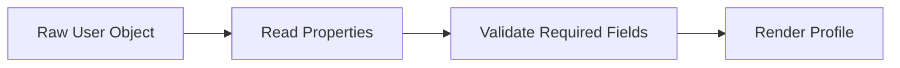

### Code example

```js
const user = {
  name: "Riya",
  role: "admin",
  isActive: true
};

console.log(user.name, user.role);
```

### Output

```txt
Riya admin
```

### Edge cases

- Accessing missing nested property throws error without optional chaining
- Shallow copy can still share nested object references

### Common mistakes

- Mutating shared objects directly
- Assuming spread makes deep copy

### Best practices

- Use optional chaining for safe reads
- Use object spread for safe shallow updates

### Summary

Objects represent real-world entities and structured application data.

---

## 9. this, call, apply, bind

### What is it?

`this` points to the object context for function execution.

`call`, `apply`, and `bind` control what `this` should be.

- `call(thisArg, a, b)`
- `apply(thisArg, [a, b])`
- `bind(thisArg)` returns new function

### Real-world scenario

A shared invoice function should run for different customer objects by switching context.

### Flow diagram

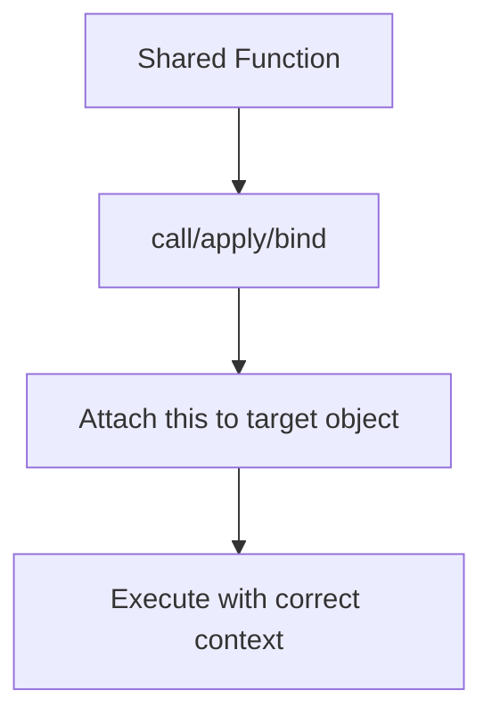

### Code example

```js
const person = { name: "Asha" };

function say(city) {
  console.log(`${this.name} from ${city}`);
}

say.call(person, "Pune");
```

### Output

```txt
Asha from Pune
```

### Edge cases

- Arrow functions ignore `call/apply/bind` for `this`
- Losing method context when passing method as callback

### Common mistakes

- Using arrow function for object method expecting dynamic `this`

### Best practices

- Use normal function for methods needing dynamic `this`
- Use `bind` for event handler context stability

### Summary

Understanding `this` and binding methods prevents many advanced bugs.

---

## 10. Prototype and Classes

### What is it?

JavaScript uses prototype-based inheritance.

A prototype is an object that other objects can inherit from.

Class syntax is cleaner wrapper over prototypes.

Class features:

- constructor
- instance methods
- static methods
- inheritance using `extends`

### Real-world scenario

`Vehicle` base class defines common behavior; `Car` and `Bike` inherit and add specific behavior.

### Flow diagram

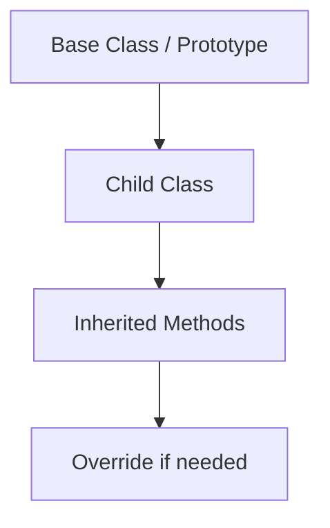

### Code example

```js
class User {
  constructor(name) {
    this.name = name;
  }

  greet() {
    return `Hello ${this.name}`;
  }
}

const u = new User("Karan");
console.log(u.greet());
```

### Output

```txt
Hello Karan
```

### Edge cases

- Forgetting `new` with constructor functions
- Confusing static methods with instance methods

### Common mistakes

- Creating duplicate methods inside constructor unnecessarily

### Best practices

- Put shared behavior on prototype or class methods
- Use classes for clear domain models

### Summary

Prototypes and classes are essential for reusable object-oriented design.

---

## 11. DOM and Events

### What is it?

DOM (Document Object Model) is browser representation of HTML as a tree of nodes.

You can:

- Select elements
- Modify content/styles/attributes
- Handle events like click, input, submit

Event propagation phases:

- Capturing
- Target
- Bubbling

Event delegation handles many child events using one parent listener.

### Real-world scenario

In a todo list:

- One click handler on list parent manages all delete buttons
- New items added later still work without new listeners

### Flow diagram

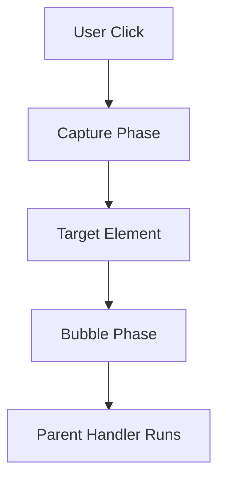

### Code example

```js
const btn = document.querySelector("#saveBtn");
btn.addEventListener("click", () => {
  console.log("Saved");
});
```

### Output

```txt
Saved
```

### Edge cases

- Event bubbling triggers parent unexpectedly
- Query selector returns null if element not loaded yet

### Common mistakes

- Adding too many individual listeners for list items
- Forgetting `event.preventDefault()` on form submit when needed

### Best practices

- Prefer event delegation in dynamic lists
- Register handlers after DOM is ready

### Summary

DOM and events connect user actions to JavaScript behavior.

---

## 12. Async JavaScript

### What is it?

Async JavaScript handles tasks that take time without freezing the UI.

Important parts:

- Callbacks
- `setTimeout` / `setInterval`
- Promises
- `async` / `await`
- Event loop and task queues

### Real-world scenario

When user opens dashboard:

- UI appears quickly
- API requests run in background
- Data cards update when response arrives

### Flow diagram

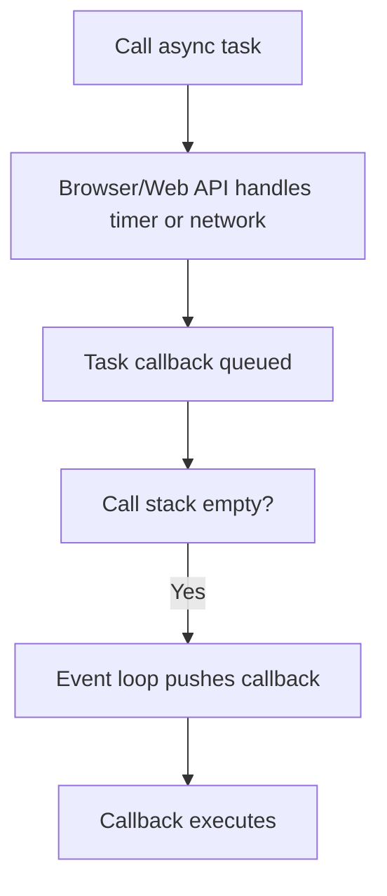

### Code example

```js
console.log("Start");
setTimeout(() => console.log("Timer done"), 0);
console.log("End");
```

### Output

```txt
Start
End
Timer done
```

### Promise + async/await example

```js
function wait(ms) {
  return new Promise((resolve) => setTimeout(resolve, ms));
}

async function run() {
  console.log("A");
  await wait(100);
  console.log("B");
}

run();
```

### Output

```txt
A
B
```

### Edge cases

- Callback hell with deeply nested callbacks
- Unhandled promise rejection crashes flow

### Common mistakes

- Forgetting `await` before promise result
- Mixing callbacks and promises without clear pattern

### Best practices

- Prefer async/await for readability
- Use `try...catch` around awaited calls

### Summary

Async JavaScript keeps apps responsive and is mandatory for API-driven apps.

---

## 13. APIs, Fetch, Axios, and REST Basics

### What is it?

API is a contract to exchange data between client and server.

REST basics:

- GET: read data
- POST: create data
- PUT/PATCH: update data
- DELETE: remove data

`fetch` is browser-native HTTP client.
Axios is a popular external HTTP library.

### Real-world scenario

Product page calls GET `/products`; checkout calls POST `/orders`.

### Flow diagram

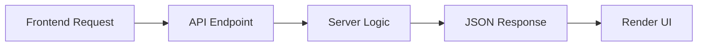

### Code example (fetch)

```js
async function getUsers() {
  const res = await fetch("https://jsonplaceholder.typicode.com/users");
  const data = await res.json();
  console.log(data.length);
}

getUsers();
```

### Output (example)

```txt
10
```

### Edge cases

- Network failure or timeout
- API returns non-200 status

### Common mistakes

- Not checking `res.ok` before parsing JSON
- Assuming API always returns expected shape

### Best practices

- Validate response status and schema
- Show user-friendly loading and error states

### Summary

API handling is a core real-world JavaScript skill.

---

## 14. Error Handling and Debugging

### What is it?

Error handling catches and manages failures safely.

Core tools:

- `try...catch...finally`
- `throw new Error(...)`
- browser DevTools
- stack trace analysis

### Real-world scenario

In payment flow, if gateway call fails, app should show retry message instead of blank screen.

### Flow diagram

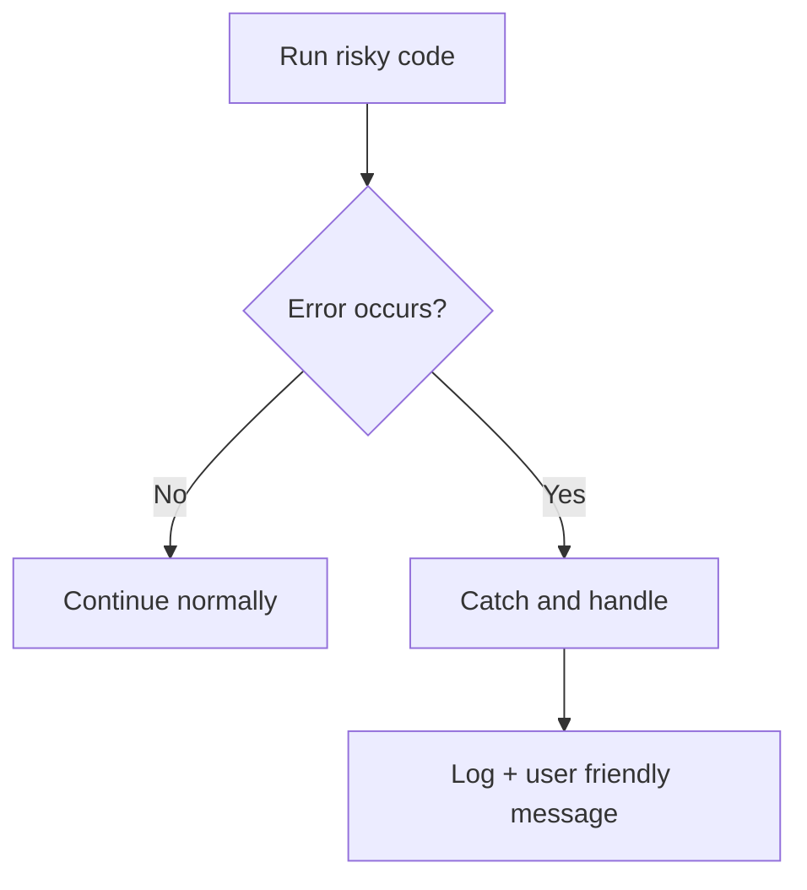

### Code example

```js
try {
  const data = JSON.parse("{ bad json }");
  console.log(data);
} catch (error) {
  console.log("Invalid JSON:", error.message);
}
```

### Output

```txt
Invalid JSON: Unexpected token b in JSON at position 2
```

### Edge cases

- Catching error but silently ignoring it
- Throwing string instead of Error object

### Common mistakes

- No error handling for async API calls

### Best practices

- Throw `Error` objects with meaningful messages
- Keep central logging for production issues

### Summary

Good error handling improves reliability and user trust.

---

## 15. Useful Built-ins: Date, Math, Map, Set

### What is it?

JavaScript provides built-in objects for common tasks.

- `Math`: calculations
- `Date`: time handling
- `Map`: key-value with any key type
- `Set`: unique values collection

### Real-world scenario

- Use Date for order timestamps
- Use Set to remove duplicate tags
- Use Map for fast lookup by object keys

### Flow diagram

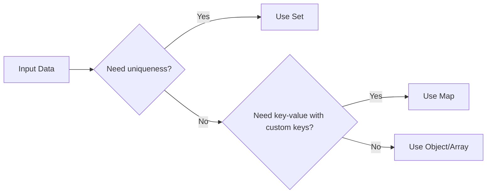

### Code example

```js
const tags = ["js", "api", "js"];
const uniqueTags = [...new Set(tags)];
console.log(uniqueTags);
```

### Output

```txt
[ 'js', 'api' ]
```

### Edge cases

- Date parsing varies by input format
- Floating point math precision issues

### Common mistakes

- Using object where Map is better for frequent dynamic keys

### Best practices

- Use ISO date formats
- Use Set for uniqueness and Map for lookup-heavy logic

### Summary

Built-ins reduce code and improve clarity.

---

## 16. Modern JS Features (ES6+)

### What is it?

Modern JavaScript adds cleaner syntax and safer patterns.

Key features:

- Template literals
- Destructuring
- Rest parameter
- Spread operator
- Default parameters
- Optional chaining
- Nullish coalescing

### Real-world scenario

API response object can be safely read with optional chaining and defaults to avoid runtime crashes.

### Flow diagram

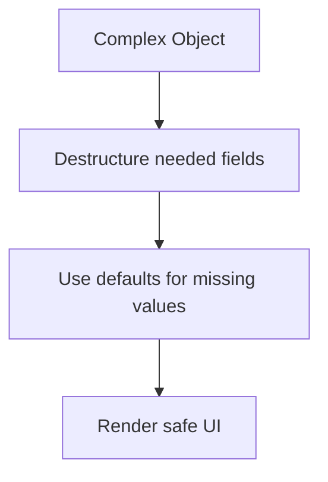

### Code example

```js
const user = { name: "Aman", address: { city: "Delhi" } };
const city = user.address?.city ?? "Unknown";
const { name } = user;
console.log(`${name} - ${city}`);
```

### Output

```txt
Aman - Delhi
```

### Edge cases

- Spread is shallow copy, not deep copy
- Destructuring undefined object throws error

### Common mistakes

- Overusing nested destructuring reducing readability

### Best practices

- Use features where they improve clarity
- Prefer readable over clever one-liners

### Summary

ES6+ features make code shorter, safer, and easier to maintain.

---

## 17. Interview Question Bank

### JavaScript Core

1. What is JavaScript and where can it run?
2. Explain execution context and call stack.
3. Difference between `var`, `let`, and `const`.
4. What is TDZ?
5. Difference between `==` and `===`.

### Functions

1. Function declaration vs function expression.
2. Arrow function vs normal function.
3. What is callback function?
4. What is higher-order function?
5. Explain closure with practical example.
6. Explain currying with practical example.

### Objects and OOP

1. What is prototype chain?
2. Difference between constructor function and class.
3. Explain `this` keyword in different contexts.
4. Explain `call`, `apply`, and `bind`.

### DOM and Events

1. What is event bubbling and capturing?
2. What is event delegation and why use it?
3. Difference between `innerText` and `textContent`.

### Async and API

1. Explain event loop.
2. Callback vs Promise vs async/await.
3. What is promise chaining?
4. How do you handle API errors in fetch?
5. Difference between fetch and axios.

---

## 18. Final Learning Roadmap

### Concept coverage aligned with your notes collection

This guide now includes concepts reflected in your JS notes set, including:

- Variables, datatypes, arrays, objects, operators, loops
- Hoisting, scope, functions, callbacks, IIFE, recursion
- Closures, currying, higher-order functions
- `this`, `call`, `apply`, `bind`
- Prototype, classes, inheritance, static behavior
- DOM manipulation, event propagation, event delegation
- Async basics, timers, promises, async/await
- REST API, fetch, axios, and error handling
- Date, Math, Map, Set, and modern ES6 features

### Recommended learning order

1. Runtime model and variables
2. Functions and arrays
3. Objects and `this`
4. Prototype and classes
5. DOM and events
6. Async JavaScript and APIs
7. Error handling and real project patterns

> [!TIP]
> For interview preparation, do not only read definitions. Practice by writing and dry-running each concept with small code snippets.

> [!WARNING]
> Real-world bugs usually happen because of scope confusion, async timing issues, or context (`this`) mistakes. Practice these deeply.

> [!INFO]
> Use Mermaid diagrams in this file as visual memory anchors when revising concepts quickly.
