# JavaScript Beginner Guide

> Beginner-first guide for students, interview preparation, and developers coming from other languages.

## Table of Contents

- [1. What is JavaScript?](#1-what-is-javascript)
- [2. JavaScript Execution Context (Core Foundation)](#2-javascript-execution-context-core-foundation)
- [3. Global Execution Context](#3-global-execution-context)
- [4. Memory Creation Phase and Execution Phase](#4-memory-creation-phase-and-execution-phase)
- [5. Function Execution Context](#5-function-execution-context)
- [6. Function Memory Creation and Function Execution Phase](#6-function-memory-creation-and-function-execution-phase)
- [7. Variable Hoisting and Function Hoisting](#7-variable-hoisting-and-function-hoisting)
- [8. TDZ (Temporal Dead Zone)](#8-tdz-temporal-dead-zone)
- [9. let vs const vs var](#9-let-vs-const-vs-var)
- [10. Function Declaration](#10-function-declaration)
- [11. Function Expression](#11-function-expression)
- [12. Arrow Functions](#12-arrow-functions)
- [13. Closures](#13-closures)
- [14. Currying](#14-currying)
- [15. Final Revision Tables](#15-final-revision-tables)
- [16. Interview Question Bank (All at One Place)](#16-interview-question-bank-all-at-one-place)

---

## 1. What is JavaScript?

### What is it?

JavaScript is a programming language used to add behavior to websites and applications.

A programming language is a way to write instructions that a computer can execute.

Without JavaScript:

- A page mostly shows text and design
- Buttons may look clickable but do nothing

With JavaScript:

- A button can open a menu
- A form can check email format
- A page can fetch and show live data

### Why do we need it?

- To make websites interactive
- To update content without full page reload
- To validate user input before sending to server
- To build full applications (browser + server using Node.js)

### Real-world analogy

Think of a website like a smart home:

- HTML = walls and rooms
- CSS = paint and decoration
- JavaScript = switches, sensors, automation logic

### Flow diagram

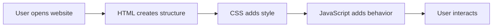

### Code example

```js
console.log("Hello World");
```

### Output

```txt
Hello World
```

### Simple real-world example

```js
const loginAttempts = 3;
console.log("Attempts left:", loginAttempts);
```

### Output

```txt
Attempts left: 3
```

### Common mistakes

- Thinking JavaScript and Java are the same language
- Thinking JavaScript runs only in browser

### Best practices

- Learn basics first: variables, functions, execution context
- Practice in browser console daily
- Read errors carefully, do not ignore them

### Summary

JavaScript is the behavior layer of modern web apps.

---

## 2. JavaScript Execution Context (Core Foundation)

> Technical term: Execution Context is the environment where JavaScript executes code.


### What is it?

Execution context is the runtime box where JavaScript stores:

- Variables
- Function definitions
- Current line being executed

JavaScript first creates a global context. Then every function call creates a new function context.

### Why do we need it?

Without execution context, JavaScript cannot track:

- Which variable belongs to which function
- Which statement should run next
- Which function should return where

### Real-world analogy

Think of a hospital system:

- Main reception = global execution context
- Doctor room for each patient = function execution context
- Patient file = variables and values

### Flow diagram

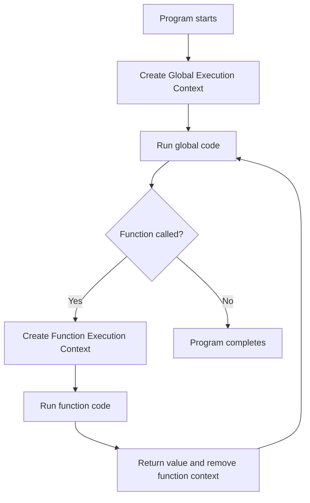

### Code example

```js
var user = "Asha";

function greet() {
  var message = "Hello";
  console.log(message, user);
}

greet();
```

### Output

```txt
Hello Asha
```

### Edge case (real-world scenario)

A payment page calls helper functions one inside another. If one helper throws error, you need to know which function context was active. Understanding execution context helps trace the issue quickly.

### Common mistakes

- Mixing call stack concept with memory values
- Assuming JS executes blindly line-by-line with no setup

### Best practices

- Dry-run code with context boxes
- Keep function scopes small and clear

### Summary

Execution context is the base model behind hoisting, scope, closures, and debugging.

---

## 3. Global Execution Context


### What is it?

Global Execution Context (GEC) is the first context created when a JS file starts.

Code written outside any function runs in global context.

### Why do we need it?

Every script needs a root space where execution begins.

### Real-world analogy

GEC is the building lobby. All rooms (functions) are entered from the lobby and return back to it.

### Flow diagram


### Code example

```js
var appName = "ShopEasy";

function showApp() {
  console.log(appName);
}

showApp();
```

### Output

```txt
ShopEasy
```

### Edge case (real-world scenario)

If two different script files both use `var data = ...` in global scope, one can overwrite the other and break checkout or profile pages. This is called global scope pollution.

### Common mistakes

- Too many global variables
- Reusing global names across files

### Best practices

- Minimize global data
- Wrap related logic in functions/modules

### Summary

Global context is the root runtime environment, but keep it clean.

---

## 4. Memory Creation Phase and Execution Phase


### What is it?

Each execution context runs in two phases:

1. Memory Creation Phase
2. Execution Phase

In memory creation:

- `var` is created with value `undefined`
- Function declarations are stored fully
- `let`/`const` are created but not initialized (TDZ)

In execution phase:

- Values are assigned
- Function calls execute

### Why do we need it?

This design lets JavaScript know all declarations before running actual statements.

### Real-world analogy

Restaurant workflow:

- Prep kitchen (memory creation): ingredients and tools set up
- Cooking service (execution): actual dishes made in order

### Flow diagram

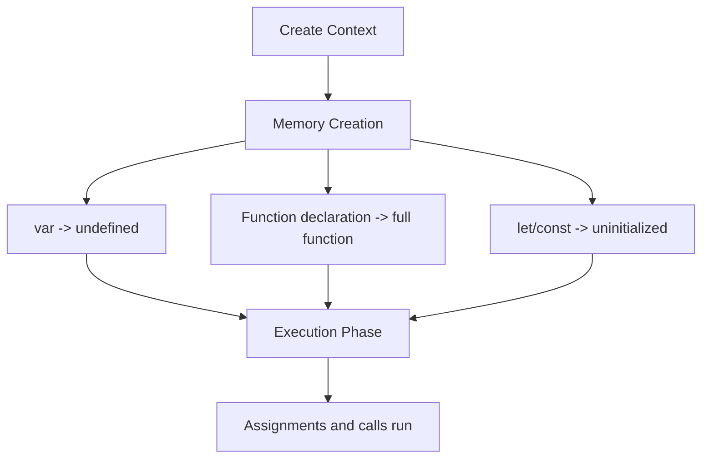

### Code example

```js
console.log(a);
sayHi();

var a = 10;

function sayHi() {
  console.log("Hi");
}
```

### Output

```txt
undefined
Hi
```

### Simple real-world example

```js
console.log(total); // exists as undefined at this moment
var total = 500;
console.log(total);
```

### Output

```txt
undefined
500
```

### Edge case (real-world scenario)

In a billing app, if you print tax before assignment, you may get `undefined` and send wrong invoice data. Always initialize before use, even if engine hoists declarations.

### Common mistakes

- Confusing declaration and initialization
- Relying on hoisting for business logic

### Best practices

- Declare near top of scope for readability
- Initialize before first use

### Summary

Memory creation explains why some names are usable before assignment and some are not.

---

## 5. Function Execution Context


### What is it?

When a function is called, JavaScript creates a new execution context for that function.

This context has its own:

- Parameters
- Local variables
- Inner function declarations

### Why do we need it?

Different function calls must not overwrite each other.

### Real-world analogy

Each customer support call opens a ticket. Ticket data is separate per customer. When call ends, ticket closes.

### Flow diagram

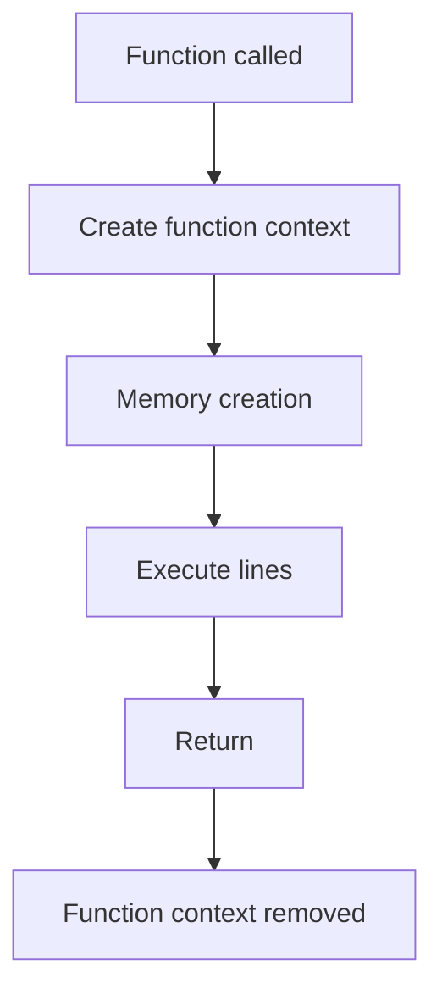

### Code example

```js
function add(x, y) {
  var result = x + y;
  return result;
}

console.log(add(2, 3));
console.log(add(10, 5));
```

### Output

```txt
5
15
```

### Edge case (real-world scenario)

If a user double-clicks "Pay Now", `processPayment()` might run twice. Each call gets its own context. You still need app-level protection (disable button, idempotency key) to avoid duplicate charge.

### Common mistakes

- Expecting local variable outside function
- Assuming one function call shares same local memory with next call

### Best practices

- Use parameters for input
- Return explicit output

### Summary

Every function call gets a fresh runtime context.

---

## 6. Function Memory Creation and Function Execution Phase


### What is it?

Function context also runs in two phases:

1. Function Memory Creation
2. Function Execution

### Why do we need it?

So JS can prepare parameter and declaration information before running statements.

### Real-world analogy

Before class:

- Attendance list ready
- Board cleaned
- Markers placed

Then teaching starts.

### Flow diagram

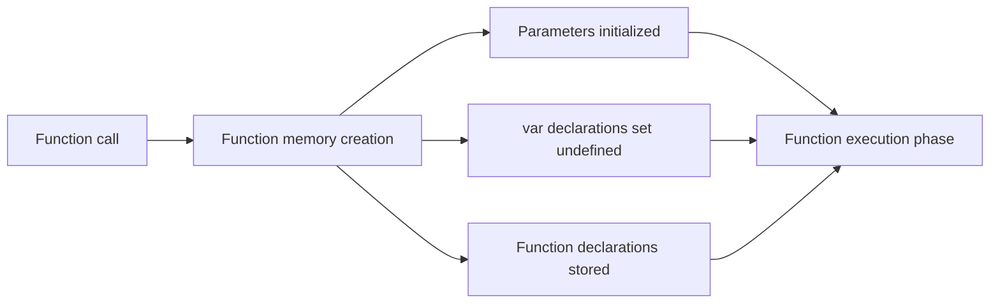

### Code example

```js
function demo(p) {
  console.log(p);
  console.log(localVar);
  var localVar = "ready";
  console.log(localVar);
}

demo("start");
```

### Output

```txt
start
undefined
ready
```

### Edge case (real-world scenario)

In a discount function, reading `var discount` before assignment gives `undefined`, and final bill can become `NaN` if used in math. This can silently break orders.

### Common mistakes

- Thinking function `var` is created only at assignment line

### Best practices

- Prefer `let`/`const` to reduce accidental `undefined`
- Keep variable declarations close to first valid use

### Summary

Function context follows exactly the same two-phase pattern as global context.

---

## 7. Variable Hoisting and Function Hoisting

> Technical term: Hoisting is JavaScript behavior where declarations are processed before execution.


### What is it?

During memory creation:

- Variable hoisting (`var`): name exists with `undefined`
- Function hoisting (declaration): full function available
- `let` and `const`: hoisted but uninitialized (TDZ)

### Why do we need it?

Because JS engine scans declarations before statement execution.

### Real-world analogy

Event organizer makes a list of all participants before event starts:

- Some are fully ready (function declarations)
- Some names exist but details missing (`var`)
- Some entries locked until official start (`let`/`const`)

### Flow diagram

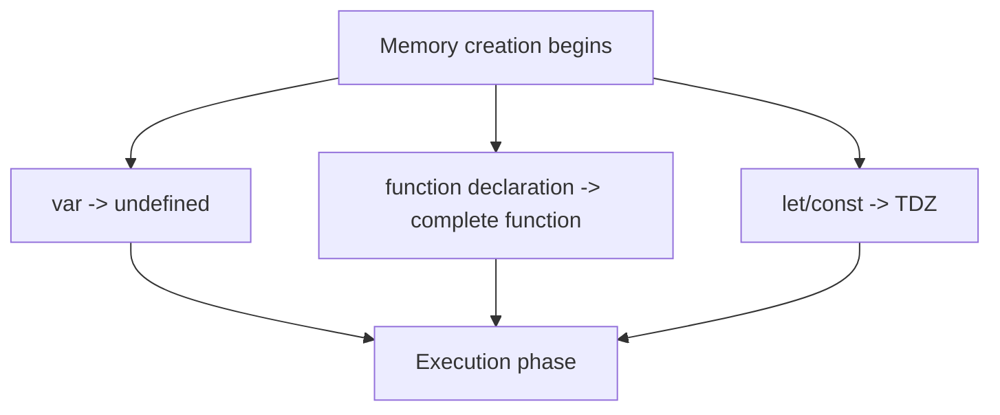

### Code example

```js
console.log(product);
show();

var product = "Laptop";

function show() {
  console.log("Product page loaded");
}
```

### Output

```txt
undefined
Product page loaded
```

### Edge case (real-world scenario)

A production bug appears because code checks `if (isAdmin)` before assignment. If `isAdmin` is `var`, condition is false due to `undefined` and admin menu hides for valid admin users.

### Common mistakes

- Believing hoisting physically moves code lines
- Using variables before assignment and expecting actual value

### Best practices

- Never depend on hoisting for correctness
- Declare before use in readable order

### Summary

Hoisting is creation-phase setup behavior, not code movement.

---

## 8. TDZ (Temporal Dead Zone)

> Technical term: TDZ is the time window where `let`/`const` exist but cannot be accessed before declaration line.


### What is it?

`let` and `const` are hoisted but uninitialized. Access before declaration throws `ReferenceError`.

### Why do we need it?

TDZ prevents accidental early usage and catches bugs early.

### Real-world analogy

A reserved parking spot has your name, but gate opens only after start time.

### Flow diagram

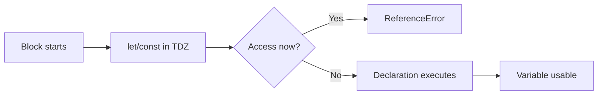

### Code example

```js
// console.log(score); // ReferenceError if uncommented
let score = 100;
console.log(score);
```

### Output

```txt
100
```

### Simple real-world example

```js
function checkout() {
  // console.log(total); // ReferenceError
  const total = 799;
  console.log("Pay:", total);
}

checkout();
```

### Output

```txt
Pay: 799
```

### Edge case (real-world scenario)

Inside a long function, reading `let token` before line of declaration can break authentication flow during peak traffic. TDZ makes this bug visible immediately instead of failing silently.

### Common mistakes

- Treating `let` like `var`
- Accessing `const` before initialization

### Best practices

- Declare variables at start of block when possible
- Keep blocks short and clear

### Summary

TDZ is a safety mechanism for predictable variable usage.

---

## 9. let vs const vs var


### What is it?

These are three keywords to create variables.

> Technical term: Scope means where a variable is accessible.

| Feature | var | let | const |
|---|---|---|---|
| Scope | Function scope | Block scope | Block scope |
| Re-declare in same scope | Yes | No | No |
| Re-assign | Yes | Yes | No |
| Hoisting behavior | `undefined` | TDZ | TDZ |
| Modern recommendation | Avoid | Use when needed | Default choice |

### Why do we need it?

Different variable behaviors support different coding needs.

### Real-world analogy

- var: old shared cupboard key (easy access, less safe)
- let: personal editable notebook
- const: sealed agreement (reference cannot change)

### Flow diagram

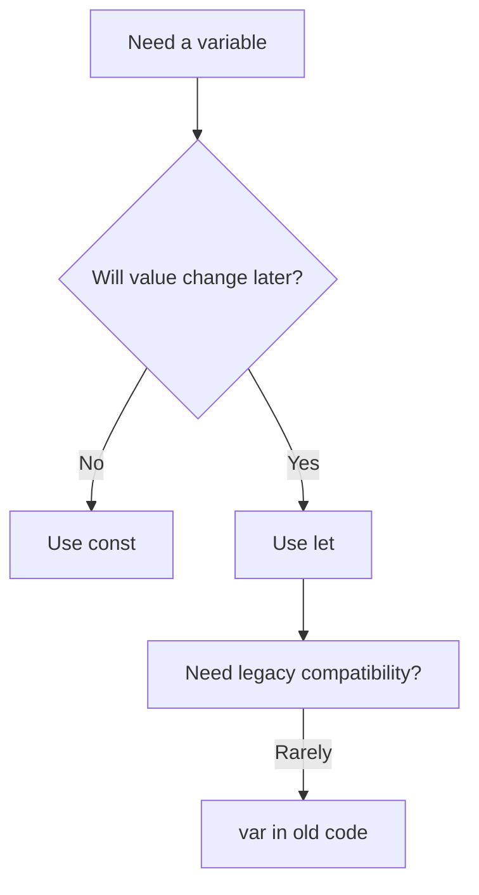

### Code example

```js
var city = "Delhi";
let age = 20;
const country = "India";

city = "Mumbai";
age = 21;

console.log(city, age, country);
```

### Output

```txt
Mumbai 21 India
```

### Edge case (real-world scenario)

`const` object can still have internal property updates:

```js
const cart = { items: 1 };
cart.items = 2; // allowed
console.log(cart.items);

// cart = { items: 3 }; // not allowed
```

### Output

```txt
2
```

### Common mistakes

- Using `var` in modern codebases
- Thinking `const` means deeply immutable object

### Best practices

- Use `const` by default
- Use `let` only when reassignment is required
- Avoid `var` unless maintaining old code

### Summary

`let` and `const` are safer and clearer than `var`.

---

## 10. Function Declaration


### What is it?

A function declaration is a named function defined as a standalone statement.

### Why do we need it?

- Reusable logic
- Clear naming
- Fully hoisted in memory creation phase

### Real-world analogy

It is like a registered service desk in office directory. Anyone can call it by name.

### Flow diagram

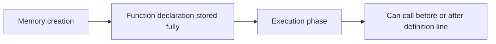

### Code example

```js
sayName();

function sayName() {
  console.log("Riya");
}
```

### Output

```txt
Riya
```

### Edge case (real-world scenario)

In large files, same function name can be redeclared later and silently replace earlier behavior. This can change tax or shipping logic unexpectedly.

### Common mistakes

- Assuming all functions behave like declarations
- Reusing same function name accidentally

### Best practices

- Use meaningful names: `calculateTotal`, `validateEmail`
- Keep one responsibility per function

### Summary

Function declarations are hoisted and easy to reuse.

---

## 11. Function Expression


### What is it?

A function expression is a function assigned to a variable.

### Why do we need it?

- Functions can be passed as values
- Great for callbacks and dynamic behavior

### Real-world analogy

A freelancer assigned to a desk variable. Work starts after assignment.

### Flow diagram

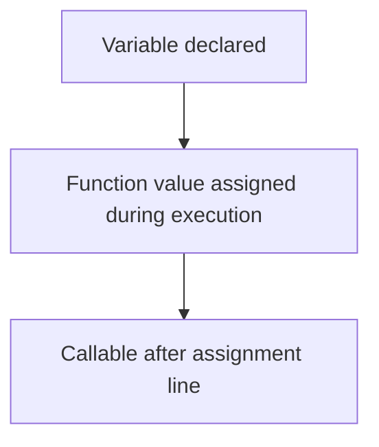

### Code example

```js
const greet = function () {
  console.log("Hello from expression");
};

greet();
```

### Output

```txt
Hello from expression
```

### Edge case (real-world scenario)

If you call a function expression before assignment in a startup file, app initialization can fail and blank page may appear.

```js
// greet(); // ReferenceError with const/let, TypeError with var in many patterns

var greet = function () {
  console.log("Hello");
};
```

### Common mistakes

- Calling expression before assignment
- Using `var` unnecessarily with function expressions

### Best practices

- Prefer `const` for function expressions
- Define before first use for readability

### Summary

Function expressions are runtime assignments, unlike hoisted declarations.

---

## 12. Arrow Functions


### What is it?

Arrow function is a shorter syntax for writing functions.

### Why do we need it?

- Concise code
- Clean callback syntax
- Lexical `this` from surrounding scope

> Technical term: Lexical means "from surrounding code location".

### Real-world analogy

Normal function chooses identity by caller. Arrow function keeps identity from where it was created.

### Flow diagram

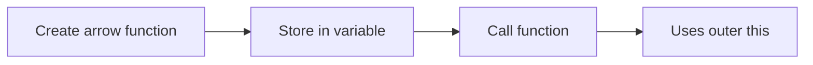

### Code example

```js
const square = (n) => n * n;
console.log(square(4));
```

### Output

```txt
16
```

### Edge case (real-world scenario)

In an object method, arrow function may break expected `this`:

```js
const user = {
  name: "Anu",
  normal() {
    return this.name;
  },
  arrow: () => {
    return this.name;
  }
};

console.log(user.normal());
console.log(user.arrow());
```

### Possible output

```txt
Anu
undefined
```

### Common mistakes

- Using arrow methods where dynamic `this` is needed

### Best practices

- Use arrow functions for short callbacks
- Use normal methods inside objects/classes when needed

### Summary

Arrow functions are concise but `this` behavior must be understood.

---

## 13. Closures

> Technical term: Closure means inner function keeps access to outer function variables even after outer function finishes.


### What is it?

A closure happens when a returned or stored inner function uses variables from outer scope.

### Why do we need it?

- Private data
- State retention between calls
- Function factories

### Real-world analogy

A delivery person carries a bag from warehouse. Even after leaving warehouse, bag items stay available.

### Flow diagram

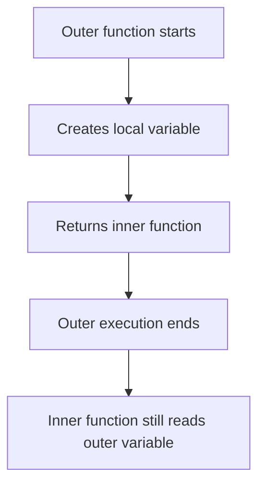

### Code example

```js
function counter() {
  let count = 0;
  return function () {
    count++;
    console.log(count);
  };
}

const inc = counter();
inc();
inc();
inc();
```

### Output

```txt
1
2
3
```

### Simple real-world example

```js
function makeDiscountCalculator(discountPercent) {
  return function (price) {
    return price - price * (discountPercent / 100);
  };
}

const tenOff = makeDiscountCalculator(10);
console.log(tenOff(500));
```

### Output

```txt
450
```

### Edge case (real-world scenario)

If closures capture large data (big arrays, DOM references) and are never released, memory usage can grow. In long-running dashboards this can slow down app.

### Common mistakes

- Using closure without understanding retained memory
- Loop closure bugs with incorrect variable declarations

### Best practices

- Use closures for intentional state
- Remove references when no longer needed
- Prefer `let` in loops to avoid classic closure bugs

### Summary

Closures are powerful for private state and reusable logic.

---

## 14. Currying

> Technical term: Currying converts a multi-argument function into a chain of one-argument functions.


### What is it?

Currying converts:

`f(a, b, c)` into `f(a)(b)(c)`

### Why do we need it?

- Partial reuse of logic
- Better composition patterns
- Cleaner function pipelines in some codebases

### Real-world analogy

Pizza order flow:

1. Choose base
2. Choose topping
3. Choose size

Each step returns next step.

### Flow diagram

```mermaid
flowchart LR
A[f(a,b,c)] --> B[f(a)]
B --> C[f(a)(b)]
C --> D[f(a)(b)(c)]
D --> E[Result]
```

### Code example

```js
function multiply(a) {
  return function (b) {
    return a * b;
  };
}

const double = multiply(2);
console.log(double(5));
console.log(multiply(3)(4));
```

### Output

```txt
10
12
```

### Edge case (real-world scenario)

Over-currying simple utility functions can make team code harder to read, especially for beginners. In payment or healthcare apps, readability is more important than style tricks.

### Common mistakes

- Using currying where simple two-argument function is enough
- Confusing currying and immediate invocation

### Best practices

- Use currying only when it improves reuse or composition
- Keep naming clear for each step function

### Summary

Currying is useful, but should improve readability and reuse.

---

## 15. Final Revision Tables

### A. Execution context quick revision

| Concept | Short meaning | Diagram connection |
|---|---|---|
| Global Execution Context | First context for script | Main context block |
| Memory Creation Phase | Declarations prepared | Left-side preparation |
| Execution Phase | Statements run | Right-side running lines |
| Function Execution Context | Context per function call | Additional context box |
| Function Memory Creation | Parameter/local setup | Function prep phase |
| Function Execution Phase | Function statements run | Function run phase |
| Variable Hoisting | `var` gets `undefined` | Creation phase |
| Function Hoisting | Declaration fully available | Creation phase |
| TDZ | `let`/`const` blocked before declaration | Between block start and declaration |

### B. Variable declaration revision

| Keyword | Scope | Re-assign | Re-declare | Hoisting behavior |
|---|---|---|---|---|
| var | Function | Yes | Yes | `undefined` |
| let | Block | Yes | No | TDZ |
| const | Block | No | No | TDZ |

### C. Function type revision

| Function type | Can call before definition line? | `this` behavior |
|---|---|---|
| Function Declaration | Yes | Dynamic (depends on call style) |
| Function Expression | No (until assigned) | Dynamic for normal function |
| Arrow Function | No (until assigned) | Lexical from outer scope |

---

## 16. Interview Question Bank (All at One Place)

### A. JavaScript basics

1. What is JavaScript and where is it used?
2. What is ECMAScript?
3. Is JavaScript same as Java?

### B. Execution context

1. What is execution context in JavaScript?
2. Difference between global and function execution context?
3. What are the two phases of execution context?

### C. Phases and hoisting

1. What happens in memory creation phase?
2. What happens in execution phase?
3. Is hoisting actual code movement?
4. Difference between variable hoisting and function hoisting?

### D. TDZ and variable declarations

1. What is TDZ and why was it introduced?
2. Compare var, let, and const.
3. Does var have TDZ?
4. Is const object immutable?

### E. Function styles

1. Function declaration vs function expression?
2. Arrow function vs normal function?
3. Why is arrow function `this` different?

### F. Closures and currying

1. What is closure with a practical example?
2. Can closures cause memory issues?
3. What is currying and where is it useful?
4. Currying vs partial application?

---

## Final Notes

> [!TIP]
> Learn in this order:
> 1) Execution context and phases
> 2) Hoisting, TDZ, var/let/const
> 3) Function types and `this`
> 4) Closures and currying

> [!WARNING]
> Do not rely on hoisting to write business logic. Always initialize values before use.

> [!INFO]
> Revisit the diagram shown in Section 2 whenever you are confused.
