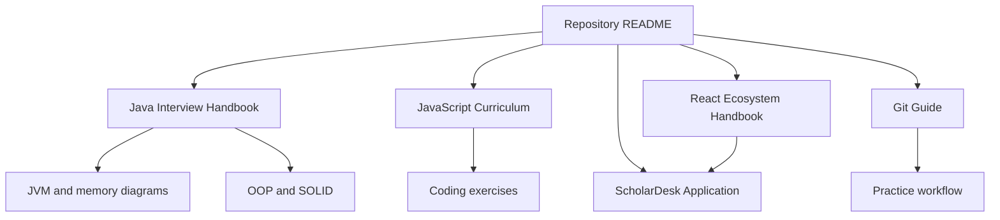

# javascript-git-basics: JavaScript and React Learning Workspace

[](#documentation)
[](docs/java.md)
[](JavaScript/README.md)
[](docs/frontend.md)
[](#mermaid-and-diagram-support)

javascript-git-basics is a structured frontend learning repository containing long-form technical documentation, focused coding exercises, interview preparation material, and a complete React practice application.

The repository is designed for progressive study: begin with JavaScript foundations, move into React and its production ecosystem, then apply those concepts in the ScholarDesk project.

## Table of Contents

- [Vision](#vision)
- [What You Will Find](#what-you-will-find)
- [Documentation](#documentation)
- [Java Interview Handbook](#java-interview-handbook)
- [Git Learning Guide](#git-learning-guide)
- [React Ecosystem Handbook](#react-ecosystem-handbook)
- [JavaScript Learning Path](#javascript-learning-path)
- [ScholarDesk React Project](#scholardesk-react-project)
- [Recommended Study Paths](#recommended-study-paths)
- [Interview Preparation Roadmap](#interview-preparation-roadmap)
- [Architecture](#architecture)
- [Diagrams](#diagrams)
- [Repository Structure](#repository-structure)
- [Quick Navigation](#quick-navigation)

## Vision

This documentation was created from the perspective of a developer who experienced the difficulty of learning advanced concepts without a clear, connected path. Its purpose is to make that path more practical for the next learner through simple language, accurate mental models, and examples that connect theory to production work.

Every major learning resource aims to explain:

- What the concept is and why it exists
- How it works at runtime
- Where it is used in real applications
- How beginner examples evolve into production implementations
- Which mistakes commonly cause incorrect behavior or poor performance
- Which questions and scenarios appear in technical interviews

## What You Will Find

- A topic-based JavaScript curriculum under [JavaScript/](JavaScript/README.md)
- A comprehensive [JavaScript guide](docs/JavaScript-Beginners-Guide.md) for long-form study
- A complete [Java interview handbook](docs/java.md) from language foundations through JVM internals and SOLID design
- A complete [React ecosystem handbook](docs/frontend.md) covering beginner through senior-level concerns
- A practical [Git learning guide](docs/Git-Beginners-Documentation.md)
- Root-level JavaScript files for focused drills and experiments
- The [ScholarDesk React project](scholer-desk/) for applying architecture, routing, state, and UI concepts
- Screenshots and supporting visual assets under [assets/screenshots](assets/screenshots)

## Documentation

| Resource | Purpose | Audience |
|---|---|---|
| [Java Interview Handbook](docs/java.md) | Java platform, JVM internals, OOP, SOLID, collections, exceptions, diagrams, and interview answers | Beginner to senior |
| [JavaScript Structured Syllabus](JavaScript/README.md) | Numbered beginner-to-advanced JavaScript learning path | Beginner to advanced |
| [JavaScript Beginner Guide](docs/JavaScript-Beginners-Guide.md) | Long-form JavaScript concepts, examples, edge cases, and interviews | Beginner and intermediate |
| [React Ecosystem Handbook](docs/frontend.md) | React 18+, internals, state, data access, tooling, architecture, security, and deployment | Beginner to senior |
| [Git Beginner Documentation](docs/Git-Beginners-Documentation.md) | Practical repository, branching, collaboration, and conflict workflows | Beginner and intermediate |
| [ScholarDesk Application](scholer-desk/README.md) | Production-style React and Redux Toolkit practice project | Intermediate and advanced |

## Java Interview Handbook

[docs/java.md](docs/java.md) is the repository's Java learning and interview reference. It converts the supplied JVM, JDK/JRE/JVM, class-loader, and dependency-inversion architecture references into GitHub-compatible Mermaid diagrams and connects each concept to executable Java examples.

### Java Topics Covered

1. Java history, compilation, execution, and platform independence
2. JVM architecture, interpreter, JIT compiler, JNI, and runtime data areas
3. JDK versus JRE versus JVM
4. Heap, stack, Metaspace, code cache, and memory diagnosis
5. Garbage collection, reachability, generations, and collector tradeoffs
6. Class loading, linking, initialization, and parent delegation
7. Thread lifecycle and concurrency foundations
8. Encapsulation, inheritance, polymorphism, and abstraction
9. All five SOLID principles with a detailed Dependency Inversion deep dive
10. Collections and exception hierarchies, examples, mistakes, and interview answers

### Java Learning Roadmap

```mermaid
flowchart LR
	BASICS[Java basics] --> OOP[OOP]
	OOP --> COLLECTIONS[Collections and generics]
	COLLECTIONS --> EXCEPTIONS[Exception handling]
	EXCEPTIONS --> THREADS[Multithreading]
	THREADS --> STREAMS[Streams and functional Java]
	STREAMS --> JVM[JVM internals]
	JVM --> SOLID[SOLID and design patterns]
	SOLID --> SPRING[Spring and persistence]
	SPRING --> SYSTEM[Testing and system design]
```



Start with [Java Platform](docs/java.md#java-platform), continue through [Object-Oriented Programming](docs/java.md#object-oriented-programming), and finish with the [Dependency Inversion Deep Dive](docs/java.md#dependency-inversion-deep-dive) and [Interview Preparation Roadmap](docs/java.md#interview-preparation-roadmap).

## Git Learning Guide

[docs/Git-Beginners-Documentation.md](docs/Git-Beginners-Documentation.md) provides a practical introduction to local version control and collaborative repository workflows.

### Git Topics Covered

- Git and GitHub responsibilities and differences
- Repository initialization and the first remote push
- Staging, committing, inspecting history, and everyday local workflows
- Branch creation, switching, merging, and deletion
- Remote repositories, cloning, fetching, pulling, and pushing
- Pull-request workflow and collaboration concepts
- Merge conflicts and practical conflict resolution
- Common commands, safe habits, best practices, and interview questions

The guide can be studied alongside JavaScript and React so every learning exercise is recorded through meaningful commits.

## React Ecosystem Handbook

[docs/frontend.md](docs/frontend.md) is a single-file React reference and learning guide. It combines conceptual explanations with execution models, production patterns, Mermaid diagrams, code examples, performance guidance, exercises, and interview preparation.

### React Topics Covered

1. React fundamentals: JSX, elements, components, props, state, events, forms, lists, keys, and styling integrations
2. React internals: browser rendering, Virtual DOM, reconciliation, Fiber, scheduling, render/commit phases, batching, and Strict Mode
3. Class and function component lifecycles, cleanup, layout effects, and error boundaries
4. React hooks from `useState` through concurrency and external-store hooks
5. Component communication, composition, compound components, render props, and higher-order components
6. React Router, nested routes, dynamic routes, lazy routes, and guarded navigation
7. Controlled and uncontrolled forms, validation, dynamic fields, and file handling
8. Axios instances, interceptors, cancellation, retries, pagination, uploads, downloads, and service architecture
9. Context API design and performance
10. Redux Toolkit, async thunks, entity adapters, middleware, RTK Query, caching, tags, optimistic updates, polling, and prefetching
11. Rendering, bundle, image, list, and loading performance optimization
12. Vite and CRA environment variables and frontend security boundaries
13. Webpack architecture, loaders, plugins, Babel, HMR, source maps, and production optimization
14. Vite development architecture, Rollup builds, plugins, assets, and migration considerations
15. Tree shaking, side effects, dead-code elimination, dynamic imports, and bundle analysis
16. Authentication, JWT/session design, token storage, refresh flows, protected routes, and role-based UI
17. Error boundaries, API errors, retry policies, fallback UI, logging, and monitoring
18. Small, medium, feature-based, and enterprise React architecture
19. Build pipelines, hosting, cache policy, CI/CD, observability, and rollback
20. React ecosystem interview preparation with theory, scenario, debugging, and output-based questions

Start with [Module 1: React Fundamentals](docs/frontend.md#module-1-react-fundamentals) and continue through the linked previous/next navigation inside the handbook.

## JavaScript Learning Path

The [JavaScript directory](JavaScript/README.md) provides a modular, numbered syllabus from initial setup through advanced topics, projects, coding exercises, career preparation, and interviews.

The long-form [JavaScript Beginner Guide](docs/JavaScript-Beginners-Guide.md) covers:

1. JavaScript at a glance
2. Runtime behavior, execution context, and the call stack
3. Variables, scope, data types, hoisting, and the temporal dead zone
4. Type coercion, loose equality, and strict equality
5. Operators, statements, conditions, and loops
6. Function declarations, expressions, arrows, IIFEs, callbacks, higher-order functions, recursion, closures, and currying
7. Strings and string-processing patterns
8. Numbers, numeric conversion, and mathematical operations
9. Arrays, array methods, return values, and collection transformations
10. Objects and production-oriented object patterns
11. `this`, `call`, `apply`, and `bind`
12. Prototypes and classes
13. DOM interaction and event handling
14. Asynchronous JavaScript and the event loop
15. REST APIs, `fetch`, and Axios
16. Error handling and debugging
17. `Date`, `Math`, `Map`, and `Set`
18. Modern JavaScript features and the final learning roadmap

The structured curriculum expands beyond the single guide into:

- Runtime behavior, execution context, scope, hoisting, and data types
- Type coercion, equality, operators, conditions, and loops
- Functions, closures, currying, recursion, strings, numbers, arrays, and objects
- `this`, function binding, prototypes, classes, DOM, events, and asynchronous JavaScript
- APIs, error handling, built-in objects, modules, tooling, storage, patterns, testing, performance, and security
- Node.js fundamentals, system design, projects, coding exercises, career preparation, and interview questions

### Structured Study Order

1. Begin with [Getting Started](JavaScript/00-Getting-Started/README.md).
2. Continue through the numbered modules in sequence.
3. Apply the concepts in [Projects and Case Studies](JavaScript/27-Projects-and-Case-Studies/README.md).
4. Solve the [Coding Exercises](JavaScript/28-Coding-Exercises/README.md).
5. Complete [Career and Interview Preparation](JavaScript/29-Career-and-Interview-Prep/README.md).
6. Finish with the dedicated [Interview Questions](JavaScript/99-Interview-Questions/README.md) section.

## ScholarDesk React Project

[ScholarDesk](scholer-desk/) is a responsive React and Redux Toolkit application for student publishing and campus administration workflows. It provides separate student and administrator experiences backed by realistic local mock data.

Design reference: [ScholarDesk UI Design on Figma](https://www.figma.com/design/3TURApKflpiN8QD8qIZILP/scholer-desk?node-id=0-1&t=Scn7SEa1AeQ4HbNX-1)

### Project Capabilities

- Student and administrator authentication flows
- Student posts, profiles, notifications, and settings
- Post creation, editing, search, filtering, and detail views
- Administrator management for students, posts, and categories
- Analytics, reports, CSV exports, and settings workflows
- Reusable components and responsive desktop/mobile navigation
- React Router, Redux Toolkit, Axios, and Create React App integration

### Run Locally

Prerequisites:

- A current Node.js LTS release
- npm installed with Node.js

```bash
cd scholer-desk
npm install
npm start
```

The development server normally runs at [http://localhost:3000](http://localhost:3000). Use `/login` for the student experience or `/admin/login` for administration. See the [ScholarDesk demo credentials](scholer-desk/README.md#demo-login-credentials) for available accounts.

Available project commands:

```bash
npm start
npm test
npm run build
```

## Recommended Study Paths

### New Frontend Developer

1. Complete JavaScript foundations through functions, arrays, objects, DOM, and asynchronous JavaScript.
2. Study the [Git guide](docs/Git-Beginners-Documentation.md) in parallel and commit each exercise.
3. Read [React Fundamentals](docs/frontend.md#module-1-react-fundamentals).
4. Continue through React internals, lifecycle, hooks, communication, routing, and forms.
5. Build small features in ScholarDesk or a separate practice application.
6. Study Axios, Context, Redux Toolkit, RTK Query, errors, and authentication.
7. Finish with performance, architecture, build tooling, deployment, and interview preparation.

### Working React Developer

1. Review React internals and lifecycle behavior.
2. Audit hook dependencies, state ownership, list identity, and component boundaries in an existing feature.
3. Study RTK Query, cancellation, authentication refresh, and normalized error handling.
4. Profile rendering and inspect production bundles before optimizing.
5. Review architecture, deployment, security, and scenario-based interview chapters.

### Interview Preparation

1. Use the question sets at the end of each handbook module.
2. Explain rendering and state transitions without running the code.
3. Complete easy, medium, and hard assignments with tests.
4. Practice production scenarios from the [Final Interview Handbook](docs/frontend.md#final-interview-handbook).
5. Revisit weak JavaScript topics in the structured syllabus.

### Java Developer

1. Build fluency with syntax, types, methods, classes, strings, and arrays.
2. Practice OOP, exception handling, collections, generics, and immutable design.
3. Trace compilation, class loading, bytecode execution, memory allocation, and garbage collection.
4. Implement concurrent tasks with executors and explain thread states and interruption.
5. Apply SOLID and design patterns to a small service without over-abstracting it.
6. Add Spring, persistence, testing, API design, and distributed-system fundamentals.

## Interview Preparation Roadmap

| Stage | Java focus | JavaScript and React focus | Practice outcome |
|---|---|---|---|
| Foundation | Types, methods, OOP, strings, arrays | Language fundamentals, functions, DOM | Predict output and explain runtime behavior |
| Core APIs | Collections, generics, exceptions, I/O | Async JavaScript, APIs, state | Select APIs and handle failure correctly |
| Runtime | JVM, memory, GC, class loading, threads | Event loop, rendering, reconciliation | Draw and defend execution models |
| Design | SOLID, patterns, testing | Component and state architecture | Refactor coupled code into testable boundaries |
| Production | Spring, persistence, security, observability | Tooling, performance, deployment | Diagnose scenarios and discuss tradeoffs |
| Interview | [Java question sets](docs/java.md#interview-preparation-roadmap) | Module questions and coding exercises | Give concise answers backed by examples |

For each topic, practice a five-part answer: definition, motivation, runtime behavior, concrete example, and tradeoff. Senior interviews usually probe the final two parts more deeply than terminology.

## Architecture

The repository separates long-form handbooks, a modular JavaScript syllabus, focused exercises, visual assets, and the ScholarDesk application. Documentation links remain relative so the same navigation works in VS Code and on GitHub.



The Java handbook also documents a ports-and-adapters dependency direction: high-level policy and low-level adapters both depend on a policy-owned abstraction. See [Dependency Inversion](docs/java.md#dependency-inversion-deep-dive) for before/after class diagrams and runtime sequences.

## Diagrams

The documentation uses diagrams as executable explanations rather than decorative images:

| Mermaid diagram | Typical use in this repository |
|---|---|
| `flowchart` | Compilation, execution, memory, GC, learning paths, and architecture |
| `classDiagram` | OOP, SOLID, collections, exceptions, and dependency relationships |
| `sequenceDiagram` | Runtime calls, class execution, and adapter interactions |
| `stateDiagram-v2` | Threads, class lifecycle, requests, and client workflow state |

### Mermaid and Diagram Support

GitHub renders fenced `mermaid` blocks directly. In VS Code, use Markdown Preview with Mermaid support enabled or install a trusted Mermaid preview extension if the built-in preview does not render a diagram. Keep node identifiers simple, quote labels containing punctuation when necessary, and preserve fenced blocks when editing.

> **Note:** A renderer may style Mermaid differently, but arrow direction, labels, and relationships should remain equivalent.

## Repository Structure

```text
javascript-git-basics/
|-- docs/
|   |-- java.md                    # Java interview handbook and JVM diagrams
|   |-- frontend.md                # Complete React ecosystem handbook
|   |-- JavaScript-Beginners-Guide.md
|   `-- Git-Beginners-Documentation.md
|-- JavaScript/                    # Numbered JavaScript curriculum
|-- scholer-desk/                  # React practice application
|-- assets/screenshots/            # Documentation and project images
|-- Array.js                       # Focused JavaScript practice
|-- String.js
|-- functions.js
|-- Hoisting-TDZ.js
|-- coding-exercises.js
|-- dummy2.js                     # Additional scratch/practice file
`-- README.md
```

Root-level JavaScript files are intentionally retained for quick experiments and focused drills. The numbered [JavaScript curriculum](JavaScript/README.md) is the primary structured path.

## How to Study Effectively

1. Read one focused topic and restate its execution flow in your own words.
2. Run the example, predict its output, and test at least one edge case.
3. Rebuild the behavior without looking at the reference.
4. Use browser and React developer tools to inspect runtime behavior.
5. Complete the module exercise before moving to the next major topic.
6. Apply the concept in ScholarDesk and verify the relevant user workflow.
7. Record what failed, why it failed, and how the final implementation behaves.

## Daily Practice Workflow

A consistent daily cycle is more valuable than reading many topics without implementation:

1. Select one topic from the JavaScript curriculum or React handbook.
2. Predict the output or execution flow before running the example.
3. Execute the code and compare the result with the prediction.
4. Modify the example to test validation, failure, and edge cases.
5. Rebuild the core behavior without looking at the reference.
6. Record the completed work in Git with a focused commit message.

## Recommended Git Practice Commands

### Initial Repository Setup

```bash
git init
git add .
git commit -m "Initial commit"
git branch -M main
git remote add origin <your-repository-url>
git push -u origin main
```

### Daily Workflow

```bash
git status
git add .
git commit -m "Document React state fundamentals"
git push
```

Before committing, review `git status` and the staged changes so generated files, credentials, and unrelated edits are not included accidentally.

## Documentation Standards

Documentation in this repository aims to provide:

- Clear theory followed by observable execution behavior
- Beginner-friendly explanations without hiding production tradeoffs
- Correct separation between browser, JavaScript, React, and build-tool responsibilities
- Practical examples, common mistakes, performance notes, and interview guidance
- Consistent headings, internal navigation, code fences, tables, and Mermaid diagrams

## Maintenance Notes

- Keep documentation links relative so they work locally and on repository hosting platforms.
- Update examples when React or major ecosystem APIs change behavior.
- Validate production build behavior separately from development behavior.
- Never commit credentials, tokens, private keys, or privileged environment values.
- Keep generated build output and installed dependencies out of documentation changes unless explicitly required.

## Quick Navigation

- [Main README](README.md)
- [Java Interview Handbook](docs/java.md)
- [Java Platform and JVM](docs/java.md#java-platform)
- [Java OOP and SOLID](docs/java.md#solid-principles)
- [Dependency Inversion Deep Dive](docs/java.md#dependency-inversion-deep-dive)
- [JavaScript Structured Syllabus](JavaScript/README.md)
- [JavaScript Beginner Guide](docs/JavaScript-Beginners-Guide.md)
- [React Ecosystem Handbook](docs/frontend.md)
- [Git Beginner Documentation](docs/Git-Beginners-Documentation.md)
- [ScholarDesk Project Documentation](scholer-desk/README.md)
- [Screenshots and Visual Assets](assets/screenshots)

## Final Note

This repository is more than a collection of notes. It is intended to provide a guided path from foundational understanding to confident implementation.

The material was shaped by the challenges I encountered while learning without enough structured guidance. The goal is to help other developers understand difficult concepts sooner, practice them deliberately, and progress toward production work and technical interviews with a clearer roadmap.

## Author

**Abhishek Dhone**

Last updated: 2026-08-04