<a id="top"></a>

# JavaScript Beginner Guide

> Complete JavaScript documentation in simple English for beginners, interview preparation, and developers moving from other languages.

## Table of Contents

- [1. JavaScript at a Glance](#1-javascript-at-a-glance)
- [2. Runtime Model: Execution Context and Call Stack](#2-runtime-model-execution-context-and-call-stack)
- [3. Variables, Scope, and Data Types](#3-variables-scope-and-data-types)
- [4. Type Coercion and Equality](#4-type-coercion-and-equality)
- [5. Operators, Statements, and Loops](#5-operators-statements-and-loops)
- [6. Functions Deep Dive](#6-functions-deep-dive)
- [7. String Methods Deep Dive](#7-string-methods-deep-dive)
- [8. Number Methods Deep Dive](#8-number-methods-deep-dive)
- [9. Arrays and Array Methods](#9-arrays-and-array-methods)
- [10. Objects and Object Patterns](#10-objects-and-object-patterns)
- [11. this, call, apply, bind](#11-this-call-apply-bind)
- [12. Prototype and Classes](#12-prototype-and-classes)
- [13. DOM and Events](#13-dom-and-events)
- [14. Async JavaScript](#14-async-javascript)
- [15. APIs, Fetch, Axios, and REST Basics](#15-apis-fetch-axios-and-rest-basics)
- [16. Error Handling and Debugging](#16-error-handling-and-debugging)
- [17. Useful Built-ins: Date, Math, Map, Set](#17-useful-built-ins-date-math-map-set)
- [18. Modern JS Features (ES6+)](#18-modern-js-features-es6)
- [19. Interview Question Bank](#19-interview-question-bank)
- [20. Final Learning Roadmap](#20-final-learning-roadmap)

<a id="section-1"></a>

## 1. JavaScript at a Glance

---

[Top](#top) | [Next: Runtime Model: Execution Context and Call Stack](#section-2)

### What is it?

JavaScript is a programming language that tells your app what to do at runtime.

Runtime means "when code is actually running".

JavaScript is also:

- High-level: you write human-friendly code, not machine-level instructions
- Dynamic: data type can be decided while the program runs
- Interpreted/JIT-compiled by engine: browser engine reads and optimizes code at runtime
- Event-driven: code can run when events happen (click, submit, timer, response)

In simple words, JavaScript is the decision-maker of your application.
It reads input, applies logic, and produces output for users.

JavaScript can:

- Read user actions (click, type, scroll)
- Process data (validate, filter, calculate)
- Update UI (show error, open modal, render list)
- Talk to server APIs (get products, save orders)

JavaScript is used in:

- Browsers (frontend)
- Servers using Node.js (backend)
- Mobile and desktop apps through frameworks

### Core building blocks (beginner view)

| Building block | Simple meaning | Example |
|---|---|---|
| Variable | Store a value | `let age = 21` |
| Condition | Make decisions | `if (age >= 18)` |
| Loop | Repeat task | `for (...)` |
| Function | Reusable logic block | `function add(a,b){}` |
| Object/Array | Structured data | user object, items array |

### Where JavaScript runs

| Environment | Common use | Real-world example |
|---|---|---|
| Browser | Interactive UI | Add-to-cart, form validation |
| Node.js server | Business logic/API | Save order in database |
| Hybrid/mobile frameworks | App features | Notifications, list rendering |

### Real-world scenario

In an e-commerce app:

- User clicks Add to Cart
- JavaScript adds item in local state
- JavaScript updates cart count badge
- JavaScript sends API call to store cart

### Flow diagram

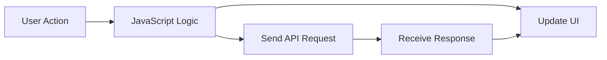

### Code example 1: Basic output

```js
const productName = "Laptop";
const price = 59999;
console.log(`${productName} added. Price: ${price}`);
```

### Output

```txt
Laptop added. Price: 59999
```

### Code example 2: Decision making

```js
const stock = 3;

if (stock > 0) {
  console.log("In stock");
} else {
  console.log("Out of stock");
}
```

### Output

```txt
In stock
```

### Code example 3: Function + input processing

```js
function calculateTotal(price, quantity) {
  return price * quantity;
}

const total = calculateTotal(499, 2);
console.log(`Total amount: ${total}`);
```

### Output

```txt
Total amount: 998
```

### Code example 4: Array processing (real-world cart)

```js
const cartPrices = [199, 299, 99];
const cartTotal = cartPrices.reduce((sum, itemPrice) => sum + itemPrice, 0);
console.log(`Cart total: ${cartTotal}`);
```

### Output

```txt
Cart total: 597
```

### Edge cases (real-world)

- If API call fails, UI should show error instead of spinner forever
- If user clicks Pay button multiple times, app can create duplicate orders
- If product price comes as string (`"499"`) and logic is wrong, total can become incorrect

### Quick checklist for beginners

- Read input carefully (user form, API response)
- Validate data before using it
- Show clear success or error messages
- Keep logic in small reusable functions

### Common mistakes

- Thinking JavaScript and Java are same language
- Thinking JavaScript runs only in browser
- Writing long code without functions
- Not handling invalid user input

### Best practices

- Build fundamentals before frameworks
- Practice daily with small problems
- Read console errors line by line
- Start with `const`, then use `let` if value must change
- Name variables by purpose, not by short unclear names

### Summary

JavaScript is the behavior engine of modern applications. It takes inputs, applies logic, and creates outputs users can see and trust.

<a id="section-2"></a>

## 2. Runtime Model: Execution Context and Call Stack

---

[Previous: JavaScript at a Glance](#section-1) | [Top](#top) | [Next: Variables, Scope, and Data Types](#section-3)

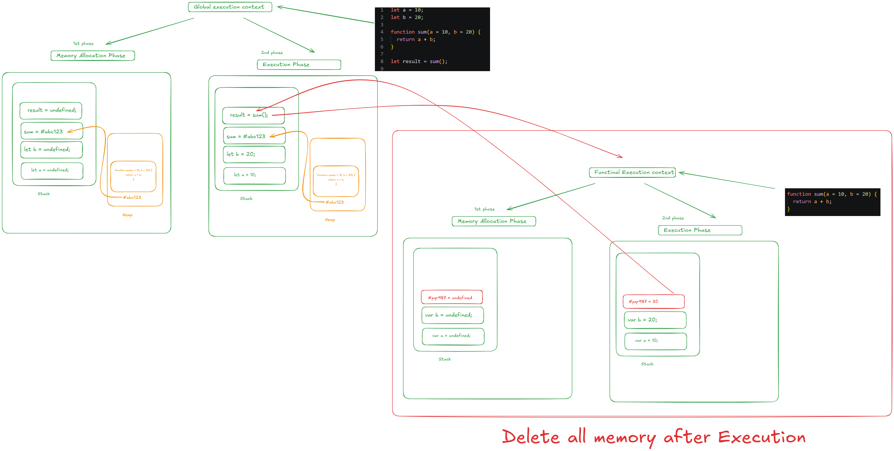

### What is it?

Execution context is the internal runtime environment where JavaScript executes code.

Each context stores:

- Variables in scope
- Function declarations and references
- `this` value
- Current instruction pointer

It also keeps hidden engine metadata used for scope lookup and control flow.

Every execution context runs in two internal phases:

1. Memory creation phase
2. Execution phase

In memory creation phase:

- Function declarations become fully available
- `var` is created with `undefined`
- `let` and `const` are created but not accessible before declaration line (TDZ)

In execution phase:

- JavaScript runs statements line by line
- Values are assigned
- Functions are called and new contexts are created when needed

Main types:

- Global Execution Context (created first)
- Function Execution Context (created on each function call)

Each function call is pushed to call stack, and removed when complete.

### Quick mental model

| Term | Simple meaning | Why it matters |
|---|---|---|
| Global context | First runtime context | Starting point of whole script |
| Function context | Context created per function call | Keeps local data isolated |
| Call stack | LIFO stack of active function calls | Explains execution order and errors |
| Stack trace | Error path of nested calls | Helps debug quickly |

### Real-world scenario

In checkout flow:

- `placeOrder()` calls `validateCart()`
- `validateCart()` calls `checkStock()`
- If `checkStock()` fails, stack trace helps locate exact failure point

### Flow diagram

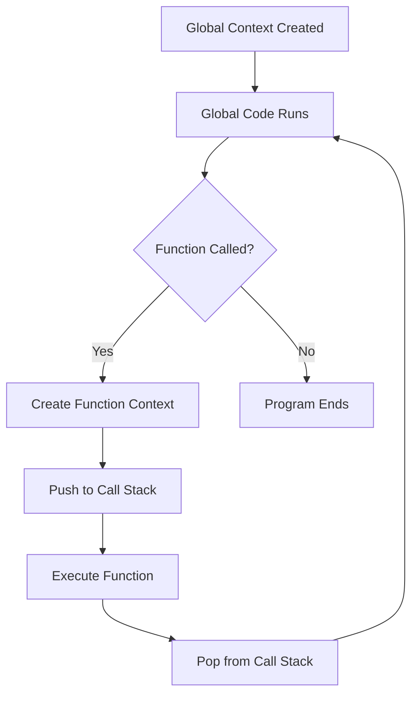

### Code example

```js
function one() {
  two();
}

function two() {
  console.log("Inside two");
}

one();
```

### Output

```txt
Inside two
```

### Code example 2: Call stack execution order

```js
function first() {
  console.log("first start");
  second();
  console.log("first end");
}

function second() {
  console.log("second start");
  third();
  console.log("second end");
}

function third() {
  console.log("third run");
}

first();
```

### Output

```txt
first start
second start
third run
second end
first end
```

### Code example 3: Memory phase behavior

```js
console.log(total);
show();

var total = 50;

function show() {
  console.log("show called");
}
```

### Output

```txt
undefined
show called
```

### Code example 4: Stack overflow edge case

```js
function loopForever() {
  return loopForever();
}

// loopForever();
console.log("If loopForever is called, it will eventually throw stack overflow");
```

### Output

```txt
If loopForever is called, it will eventually throw stack overflow
```

### Edge cases

- Deep recursion can cause call stack overflow
- Large global scope can increase accidental name conflicts
- Calling too many nested synchronous functions can freeze UI temporarily
- Unclear stack traces happen when function names are generic (for example `fn1`, `fn2`)

### Common mistakes

- Confusing memory creation with execution order
- Not reading stack traces while debugging
- Thinking asynchronous callbacks run immediately on top of current stack
- Using global variables for temporary function-level work

### Best practices

- Keep functions small and focused
- Use debugger and breakpoints for call flow
- Give clear function names so stack traces are readable
- For recursion, always keep a safe base condition
- For async code, remember callback runs after current stack is clear

### Summary

Execution context and call stack explain the exact order in which JavaScript prepares memory, runs statements, enters functions, and returns control.

<a id="section-3"></a>

## 3. Variables, Scope, and Data Types

---

[Previous: Runtime Model: Execution Context and Call Stack](#section-2) | [Top](#top) | [Next: Type Coercion and Equality](#section-4)

### What is it?

Variable is a named container for data.

Scope is the area where a variable can be accessed.

In JavaScript, understanding variables means understanding three things together:

1. Declaration keyword (`var`, `let`, `const`)
2. Scope (where value can be used)
3. Data type (what kind of value it stores)

JavaScript keywords:

- `var`: function scope, older style
- `let`: block scope, can reassign
- `const`: block scope, cannot reassign reference

Scope types:

- Global scope: accessible from almost everywhere in the file/runtime
- Function scope: accessible only inside that function
- Block scope: accessible only inside `{ ... }` block

### Types of scope and variable access rules

| Scope type | Where it is created | Who can access it | Who cannot access it |
|---|---|---|---|
| Global scope | Outside all functions and blocks | Global code and inner scopes | N/A (top-level scope) |
| Function scope | Inside a function body | That function and its inner blocks | Outside that function |
| Block scope | Inside `{}` like `if`, `for`, `while`, `switch` block | Only inside that block | Outside that block |

Access rule in one line:

- Inner scope can read outer scope variables
- Outer scope cannot read inner scope variables

### Scope access hierarchy diagram

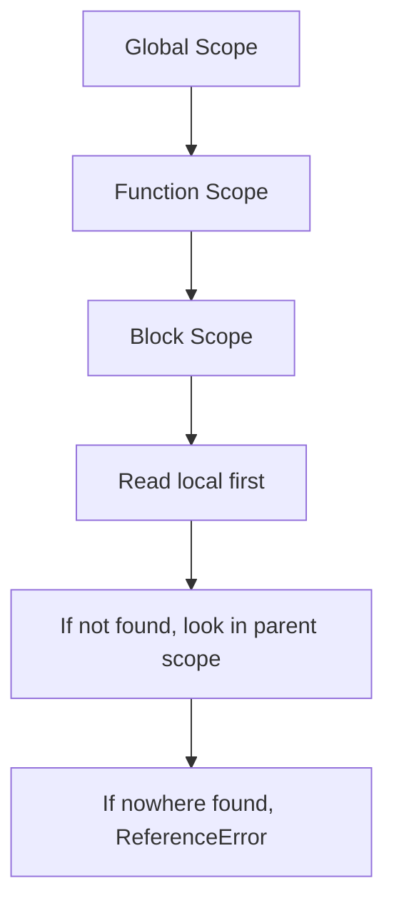

### Variable lookup (scope chain) diagram

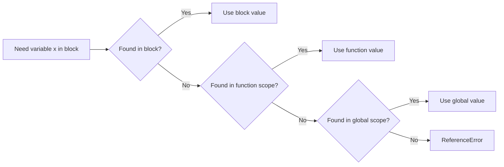

Data types:

- Primitive: string, number, boolean, null, undefined, bigint, symbol
- Non-primitive: object, array, function

Quick type meaning:

| Type | Meaning | Example |
|---|---|---|
| string | text value | `"hello"` |
| number | numeric value | `42`, `3.14` |
| boolean | true/false value | `true` |
| undefined | declared but no value yet | `let x;` |
| null | intentionally empty value | `let user = null` |
| object | grouped key-value data | `{ name: "Nisha" }` |
| array | ordered list | `[10, 20, 30]` |

### Real-world scenario

In login page:

- `const apiUrl` should not change
- `let attempts` changes after each failed login
- Avoid using `var` to prevent scope confusion

In cart page:

- `const taxRate = 0.18` should stay fixed
- `let cartTotal` changes when user adds/removes items
- Product list is often an array, user info is usually an object

### Flow diagram

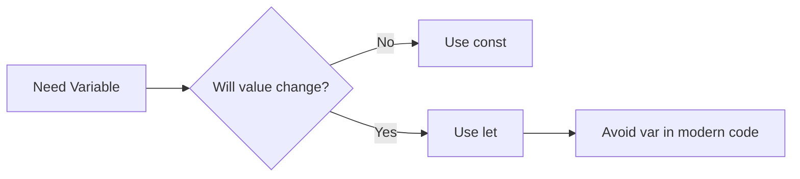

### Scope flow diagram

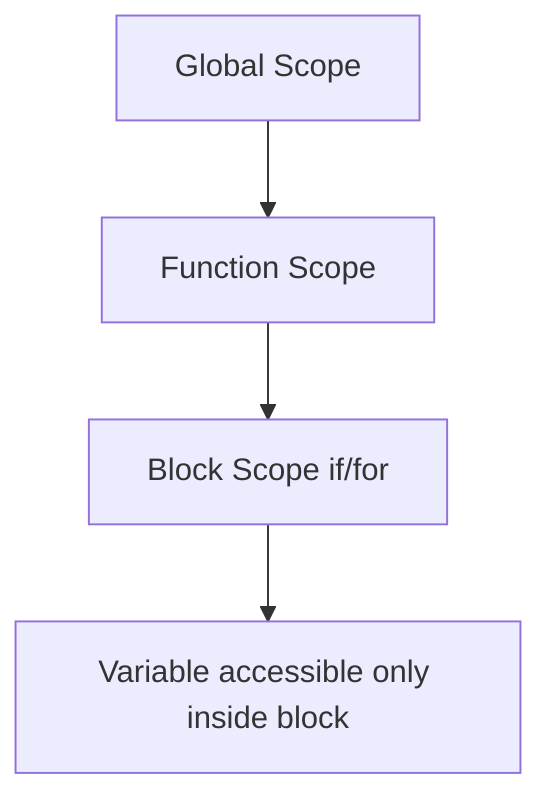

### Hoisting and TDZ with execution context

Hoisting means JavaScript prepares declarations before running code lines.

Global Execution Context (GEC) is created first.
Then, whenever a function is called, JavaScript creates a sub execution context (Function Execution Context).

Both global and function contexts run in two phases:

1. Memory creation phase
2. Execution phase

### Global and function context flow

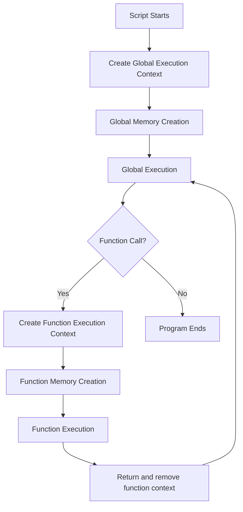

### Memory creation impact on var, let, const

| Keyword | Memory creation phase | Before declaration line in execution phase | After declaration line |
|---|---|---|---|
| `var` | Created and initialized as `undefined` | Accessible as `undefined` | Gets assigned value |
| `let` | Created but uninitialized | In TDZ, access throws `ReferenceError` | Gets assigned value |
| `const` | Created but uninitialized | In TDZ, access throws `ReferenceError` | Must be initialized once |

### TDZ and access behavior flow

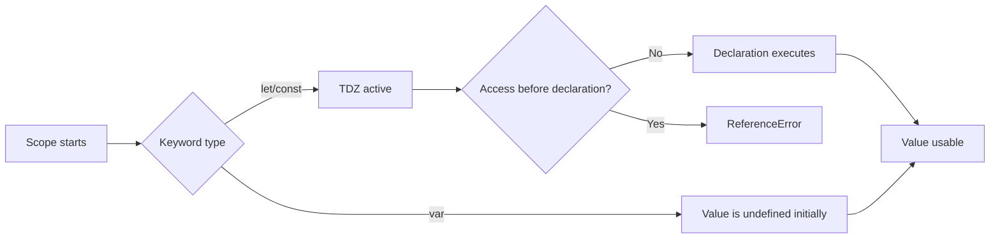

### Code example

```js
const appName = "ShopEasy";
let attempts = 0;
attempts = attempts + 1;
console.log(appName, attempts);
```

### Output

```txt
ShopEasy 1
```

### Code example 2: Scope behavior

```js
const company = "ACME";

function showUser() {
  const user = "Riya";
  if (true) {
    const role = "Admin";
    console.log(company, user, role);
  }
  // console.log(role); // would fail: role is block scoped
}

showUser();
```

### Output

```txt
ACME Riya Admin
```

### Code example 2.1: Global -> function -> block access

```js
const globalName = "Global";

function scopeDemo() {
  const functionName = "Function";

  if (true) {
    const blockName = "Block";
    console.log(globalName, functionName, blockName);
  }
}

scopeDemo();
```

### Output

```txt
Global Function Block
```

### Code example 2.2: Outer cannot access inner scope

```js
function account() {
  const pin = 1234;
  console.log("Inside function:", pin);
}

account();

try {
  console.log(pin);
} catch (error) {
  console.log(error.name);
}
```

### Output

```txt
Inside function: 1234
ReferenceError
```

### Code example 2.3: Block scope with let/const vs var

```js
if (true) {
  var varValue = "I am var";
  let letValue = "I am let";
  const constValue = "I am const";
  console.log(varValue, letValue, constValue);
}

console.log(varValue);

try {
  console.log(letValue);
} catch (error) {
  console.log(error.name);
}

try {
  console.log(constValue);
} catch (error) {
  console.log(error.name);
}
```

### Output

```txt
I am var I am let I am const
I am var
ReferenceError
ReferenceError
```

### Code example 3: `const` object mutation edge

```js
const profile = { name: "Nisha", city: "Pune" };
profile.city = "Mumbai"; // allowed
console.log(profile.city);

// profile = { name: "Nisha" }; // not allowed
```

### Output

```txt
Mumbai
```

### Code example 4: Check data types with `typeof`

```js
const title = "Phone";
const price = 999;
const inStock = true;
const tags = ["new", "sale"];
const meta = { brand: "XYZ" };

console.log(typeof title);
console.log(typeof price);
console.log(typeof inStock);
console.log(typeof tags);
console.log(typeof meta);
```

### Output

```txt
string
number
boolean
object
object
```

### Code example 5: Hoisting with `var`

```js
console.log(score);
var score = 100;
console.log(score);
```

### Output

```txt
undefined
100
```

### Code example 6: TDZ with `let` using try/catch

```js
try {
  console.log(points);
} catch (error) {
  console.log(error.name);
}

let points = 50;
console.log(points);
```

### Output

```txt
ReferenceError
50
```

### Code example 7: Sub execution context (function memory and execution)

```js
var globalValue = "G";

function demo(a) {
  console.log(a);
  console.log(localVar);
  var localVar = "L";
  console.log(localVar, globalValue);
}

demo("A");
```

### Output

```txt
A
undefined
L G
```

In this function example:

- During function memory creation, `a` is initialized from argument and `localVar` becomes `undefined`
- During function execution, `localVar` gets value `"L"` on its assignment line

### Edge cases

- `const` object properties can still change
- `var` declared in loop can leak outside block
- `typeof null` returns `"object"` (historical JavaScript behavior)
- Accessing block-scoped variable outside block throws `ReferenceError`
- Using same variable name in nested scopes can confuse debugging
- Accessing `let`/`const` before declaration line causes TDZ error
- Hoisting confusion can hide bugs when `var` appears as `undefined`

### Common mistakes

- Using `var` in modern code
- Accessing `let` or `const` before declaration
- Using unclear variable names like `a`, `x1`, `tmp` in business logic
- Assuming array type will show as `array` in `typeof`
- Assuming `let` and `const` behave like `var` during hoisting

### Best practices

- Use `const` by default
- Use `let` only when reassignment is required
- Keep variable names descriptive
- Group related values in objects instead of many loose variables
- Validate and normalize incoming data types from APIs/forms
- Declare variables before usage for readability, even if hoisting exists
- Prefer `let`/`const` to avoid accidental `undefined` from `var`

### Summary

Correct variable, scope, and data type handling prevents silent bugs, improves readability, and makes debugging much faster.

<a id="section-4"></a>

## 4. Type Coercion and Equality

---

[Previous: Variables, Scope, and Data Types](#section-3) | [Top](#top) | [Next: Operators, Statements, and Loops](#section-5)

### What is it?

Type coercion means JavaScript converts one data type to another automatically in some operations.

There are two broad forms:

- Implicit coercion: JavaScript converts types automatically
- Explicit coercion: developer converts types manually using `Number()`, `String()`, `Boolean()`

Equality checks compare values, but strictness level matters.

Equality operators:

- `==` loose equality (allows type conversion)
- `===` strict equality (no type conversion)

Quick rule:

- Use `===` for predictable behavior
- Use `==` only when you fully understand its coercion rules

### Coercion quick table

| Expression | Result | Why |
|---|---|---|
| `"10" + 2` | `"102"` | `+` with string does concatenation |
| `"10" - 2` | `8` | `-` forces numeric conversion |
| `true + 1` | `2` | `true` becomes `1` |
| `false + 5` | `5` | `false` becomes `0` |
| `Number("42")` | `42` | explicit numeric conversion |

### Real-world scenario

In payment validation, string input from form may be compared with numeric value. Wrong comparison can approve invalid data.

Another practical case:

- Quantity from input is `"2"` and price is number `500`
- If handled carelessly with `+`, total can become text instead of number

### Flow diagram

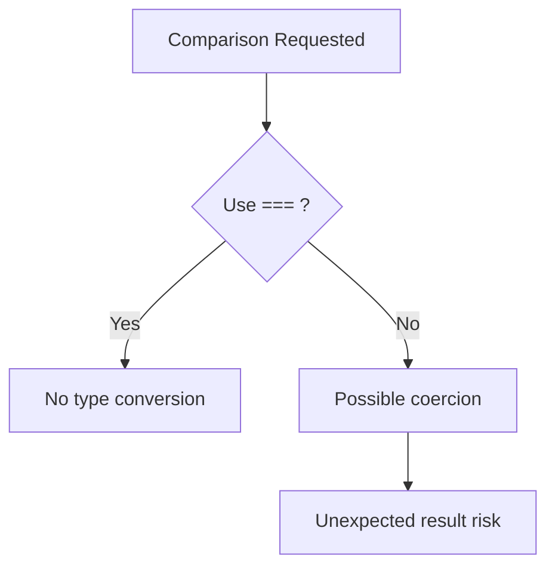

### Conversion decision diagram

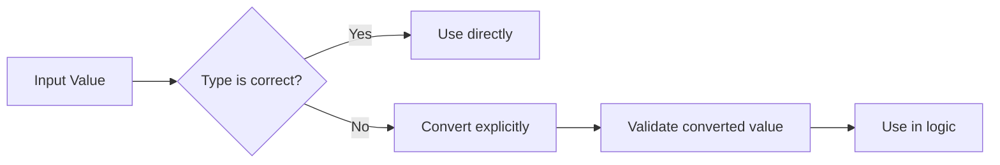

### Code example

```js
console.log(5 == "5");
console.log(5 === "5");
console.log("10" + 2);
console.log("10" - 2);
```

### Output

```txt
true
false
102
8
```

### Code example 2: Boolean coercion behavior

```js
console.log(Boolean(0));
console.log(Boolean(1));
console.log(Boolean(""));
console.log(Boolean("hello"));
```

### Output

```txt
false
true
false
true
```

### Boolean conversion reference (Truthy vs Falsy)

When JavaScript checks a condition (`if`, `while`, logical operators), values are converted to boolean.

Falsy values (convert to `false`):

- `false`
- `0`
- `-0`
- `0n`
- `""` (empty string)
- `null`
- `undefined`
- `NaN`

Most other values are truthy (convert to `true`), like non-empty strings, arrays, objects, and non-zero numbers.

### Boolean conversion table

| Value | Boolean conversion | Reason |
|---|---|---|
| `false` | `false` | already false |
| `0` | `false` | numeric zero is falsy |
| `1` | `true` | non-zero number is truthy |
| `""` | `false` | empty string is falsy |
| `"0"` | `true` | non-empty string is truthy |
| `"hello"` | `true` | non-empty string is truthy |
| `null` | `false` | empty/nullish value |
| `undefined` | `false` | missing value |
| `NaN` | `false` | invalid number |
| `[]` | `true` | object type is truthy |
| `{}` | `true` | object type is truthy |

### Code example 2.1: Boolean conversion in conditions

```js
const values = [false, 0, 1, "", "0", null, undefined, NaN, [], {}];

for (const value of values) {
  console.log(Boolean(value));
}
```

### Output

```txt
false
false
true
false
true
false
false
false
true
true
```

### Real-world caution

Form values are usually strings. For example, `"0"` is truthy, but number `0` is falsy.
So for validation, convert to number first when business logic expects numeric behavior.

### Code example 3: Safe input handling (real-world)

```js
const qtyFromInput = "2";
const price = 500;

const qty = Number(qtyFromInput);
const total = qty * price;

console.log(total);
console.log(typeof total);
```

### Output

```txt
1000
number
```

### Code example 4: Tricky equality interview cases

```js
console.log("" == 0);
console.log("" === 0);
console.log(null == undefined);
console.log(null === undefined);
console.log(NaN === NaN);
```

### Output

```txt
true
false
true
false
false
```

### Why comparisons return true or false

JavaScript returns `true` when comparison rule is satisfied, otherwise `false`.
The result depends on:

- Value itself
- Data type
- Operator used (`==`, `===`, `<`, `>`, etc.)
- Whether JavaScript is allowed to coerce type

### Internal flow of `===` (strict equality)

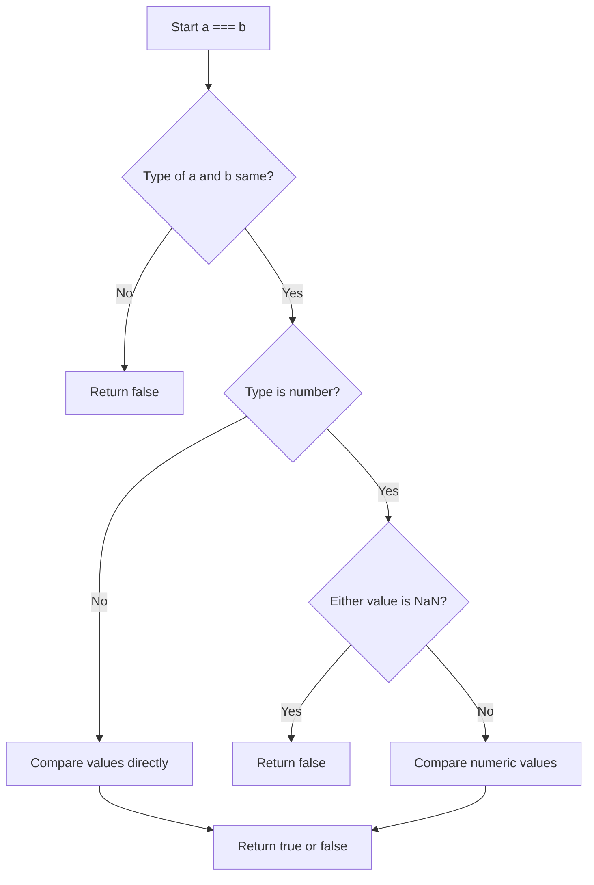

### Internal flow of `==` (loose equality)

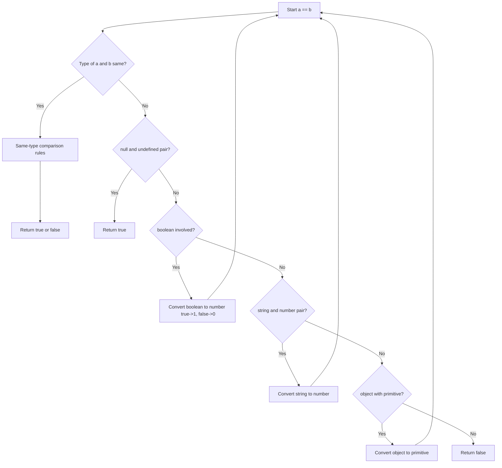

### True/false reasoning table

| Comparison | Result | Why it returns this |
|---|---|---|
| `5 == "5"` | `true` | `==` allows coercion, string `"5"` becomes number `5` |
| `5 === "5"` | `false` | `===` checks both type and value; number and string differ |
| `0 == false` | `true` | `false` coerces to `0` in loose equality |
| `0 === false` | `false` | types are different (`number` vs `boolean`) |
| `null == undefined` | `true` | special loose-equality rule in JavaScript |
| `null === undefined` | `false` | strict equality requires same type |
| `NaN === NaN` | `false` | `NaN` is never equal to anything, including itself |
| `"2" > "12"` | `true` | both are strings, so lexical (dictionary) comparison |
| `"2" > 12` | `false` | number comparison after coercion (`2 > 12` is false) |

### Code example 5: More comparison cases

```js
console.log(0 == false);
console.log(0 === false);
console.log("2" > "12");
console.log("2" > 12);
console.log(10 > "5");
console.log("apple" > "banana");
```

### Output

```txt
true
false
true
false
true
false
```

### Code example 6: Object and array comparison

```js
console.log([1, 2] == [1, 2]);
console.log([1, 2] === [1, 2]);

const arr = [1, 2];
const sameRef = arr;
console.log(arr === sameRef);
```

### Output

```txt
false
false
true
```

Why this happens:

- Arrays and objects compare by reference (memory address), not by content
- Two separate arrays with same values are still different references

### Edge cases

- `"" == 0` is true
- `null == undefined` is true, but `null === undefined` is false
- `NaN === NaN` is false (special numeric behavior)
- `0 == false` is true because of coercion
- `[] == false` can evaluate to true in loose comparison

### Common mistakes

- Using `==` in critical business logic
- Assuming `+` always does numeric addition
- Forgetting to parse number inputs from forms/APIs
- Assuming all non-empty strings are valid numbers

### Best practices

- Prefer `===` and `!==`
- Convert input explicitly: `Number(value)`, `String(value)`
- Validate conversion results with `Number.isNaN()` where needed
- Keep business rules type-safe at boundaries (API/form layer)

### Summary

Type coercion is powerful but risky when ignored. Use strict equality and explicit conversions to keep logic predictable and production-safe.

<a id="section-5"></a>

## 5. Operators, Statements, and Loops

---

[Previous: Type Coercion and Equality](#section-4) | [Top](#top) | [Next: Functions Deep Dive](#section-6)

### What is it?

Operators perform actions on values.

Statements decide which code should run and when.
Loops help you repeat logic without writing duplicate lines.

This topic is the core of decision-making in JavaScript.

Main categories:

- Arithmetic: `+ - * / % **`
- Assignment: `= += -=`
- Comparison: `> < >= <= ===`
- Logical: `&& || !`
- Ternary: `condition ? valueA : valueB`

Operator priorities matter. For example:

- `*` runs before `+`
- Parentheses `()` can force custom order

Statements control flow:

- `if...else`
- `switch`
- loops: `for`, `while`, `do...while`, `for...of`, `for...in`

In real projects, these are used together:

- Operator calculates result
- Condition checks rule
- Statement decides branch
- Loop repeats process for all items

### End-to-end logic flow

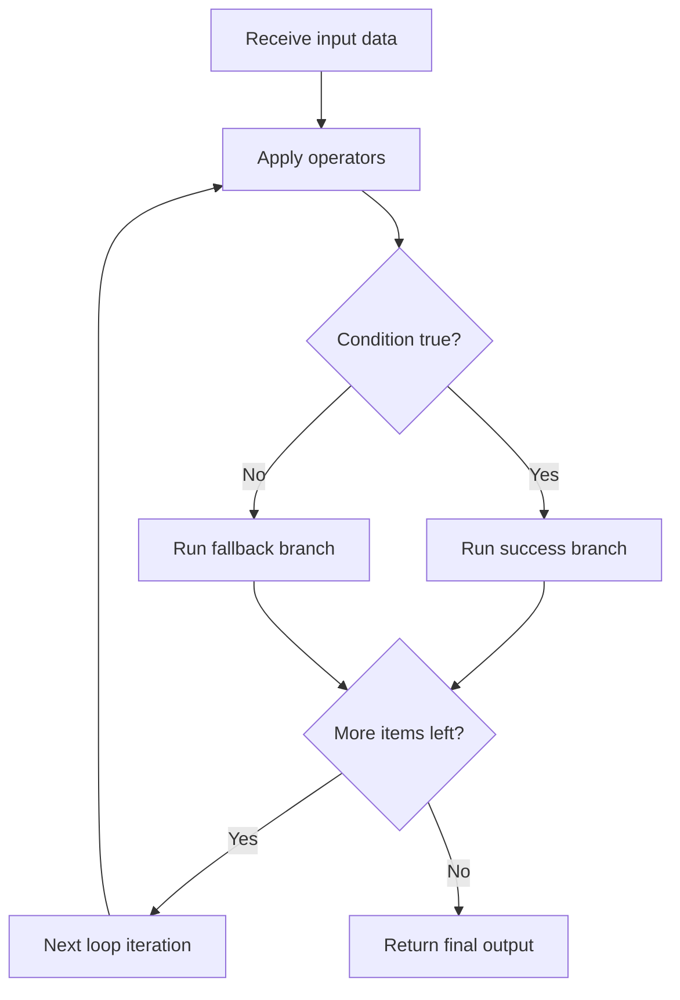

### Quick decision table

| Need | Best structure |
|---|---|
| Two-way condition | `if...else` |
| Many fixed options | `switch` |
| Fixed count repetition | `for` |
| Repeat while condition true | `while` |
| At least one run required | `do...while` |
| Iterate array values | `for...of` |
| Iterate object keys | `for...in` |

### Operator behavior quick table

| Operator type | Example | Result idea |
|---|---|---|
| Arithmetic | `20 / 4` | numeric calculation |
| Comparison | `age >= 18` | returns boolean |
| Logical | `isLoggedIn && isVerified` | combines conditions |
| Assignment | `total += 50` | updates variable |
| Ternary | `stock > 0 ? "In" : "Out"` | short if/else |

### Real-world scenario

Order discount flow:

- if amount > 5000, apply 10% discount
- else if amount > 2000, apply 5%
- else no discount

Scenario to consider:

- Amount can be invalid (negative, null, string)
- Business rules can overlap, so condition order matters
- Final amount should never become negative

### Flow diagram

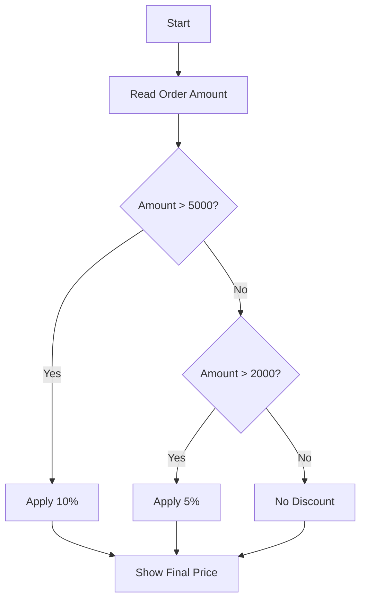

### Scenario 2: Login attempt lock system

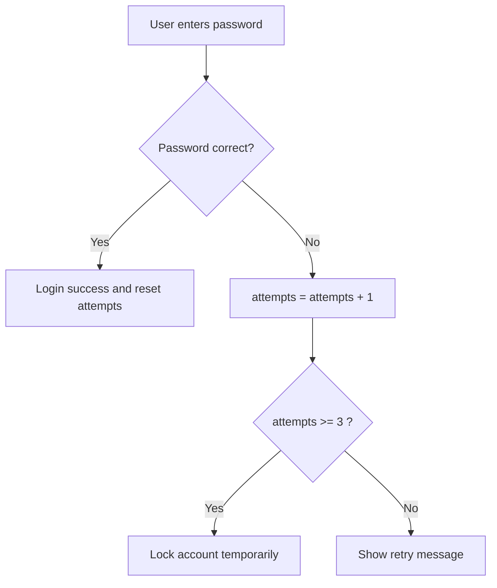

### Code example

```js
const amount = 3200;
let discount = 0;

if (amount > 5000) {
  discount = 10;
} else if (amount > 2000) {
  discount = 5;
}

console.log(`Discount: ${discount}%`);
```

### Output

```txt
Discount: 5%
```

### Code example 1.1: Safe discount with validation

```js
const amountInput = "3200";
const amount = Number(amountInput);

if (Number.isNaN(amount) || amount < 0) {
  console.log("Invalid amount");
} else {
  let discount = 0;
  if (amount > 5000) discount = 10;
  else if (amount > 2000) discount = 5;

  const finalAmount = amount - (amount * discount) / 100;
  console.log(`Discount: ${discount}%`);
  console.log(`Final amount: ${finalAmount}`);
}
```

### Output

```txt
Discount: 5%
Final amount: 3040
```

### Code example 2: Operator precedence

```js
const result1 = 10 + 2 * 5;
const result2 = (10 + 2) * 5;

console.log(result1);
console.log(result2);
```

### Output

```txt
20
60
```

### Code example 2.1: Logical operators in business rules

```js
const isLoggedIn = true;
const isEmailVerified = false;
const isAdmin = true;

const canAccessAdminPanel = isAdmin && isLoggedIn;
const canCheckout = isLoggedIn && isEmailVerified;

console.log(canAccessAdminPanel);
console.log(canCheckout);
```

### Output

```txt
true
false
```

### Code example 3: `switch` for status mapping

```js
const orderStatus = "shipped";
let message;

switch (orderStatus) {
  case "pending":
    message = "Order received";
    break;
  case "shipped":
    message = "Order is on the way";
    break;
  case "delivered":
    message = "Order delivered";
    break;
  default:
    message = "Unknown status";
}

console.log(message);
```

### Output

```txt
Order is on the way
```

### Code example 3.1: Missing break fall-through risk

```js
const level = "gold";
let benefits = "";

switch (level) {
  case "gold":
    benefits += "Priority Support ";
  case "silver":
    benefits += "Discount Vouchers";
    break;
  default:
    benefits = "Basic Benefits";
}

console.log(benefits);
```

### Output

```txt
Priority Support Discount Vouchers
```

Why this matters:

- Missing `break` after `gold` allowed code to continue into `silver`
- Sometimes useful intentionally, but usually a bug

### Code example 4: `for...of` vs `for...in`

```js
const items = ["pen", "book", "bag"];

for (const value of items) {
  console.log(`value: ${value}`);
}

for (const key in items) {
  console.log(`index: ${key}`);
}
```

### Output

```txt
value: pen
value: book
value: bag
index: 0
index: 1
index: 2
```

### Code example 4.1: `for...in` for objects

```js
const user = { name: "Nisha", role: "admin", active: true };

for (const key in user) {
  console.log(`${key}: ${user[key]}`);
}
```

### Output

```txt
name: Nisha
role: admin
active: true
```

### Code example 5: While loop safety pattern

```js
let attempts = 0;

while (attempts < 3) {
  attempts++;
  console.log(`Attempt ${attempts}`);
}
```

### Output

```txt
Attempt 1
Attempt 2
Attempt 3
```

### Code example 6: `do...while` runs at least once

```js
let count = 5;

do {
  console.log(`Executed once with count=${count}`);
  count++;
} while (count < 5);
```

### Output

```txt
Executed once with count=5
```

### Scenario checklist: What to consider before writing conditions/loops

- Is input valid and type-safe?
- Are condition branches mutually exclusive?
- Can this loop become infinite?
- Do we need `break` or `continue`?
- Are we iterating array values or object keys?
- Is there a safer built-in method like `map`, `filter`, `some`, `every`?

### Edge cases

- Infinite loop if condition never changes
- `for...in` on arrays can give unexpected keys
- Missing `break` in `switch` can cause fall-through bugs
- `NaN` comparisons are tricky (`NaN === NaN` is false)
- Wrong logical grouping (`&&` / `||`) can approve invalid business conditions
- `for...in` can also iterate inherited keys in some object patterns
- Mutating array while looping can skip or reprocess elements

### Common mistakes

- Using `for...in` instead of `for...of` for arrays
- Missing `break` inside `switch`
- Writing complex `if` blocks without intermediate variables
- Updating wrong loop variable, causing endless loop
- Comparing numbers received as strings without conversion
- Using deeply nested conditions instead of early returns

### Best practices

- Use `for...of` for array values
- Keep loop body short and readable
- Use parentheses in complex conditions for clarity
- Keep `switch` cases explicit and always handle `default`
- Use guard clauses to reduce deep nested `if` blocks
- Validate input at the boundary (form/API layer) before comparisons
- Prefer intention-revealing variable names like `isEligible`, `hasStock`
- Add tests for boundary values (`0`, `1`, min, max, empty)

### Summary

Operators, statements, and loops are the foundation of application logic. Clear conditions and safe loops directly improve correctness and maintainability.

<a id="section-6"></a>

## 6. Functions Deep Dive

---

[Previous: Operators, Statements, and Loops](#section-5) | [Top](#top) | [Next: String Methods Deep Dive](#section-7)

### What is it?

Function is a reusable block of code.

In simple words, function is a named task.
Instead of writing the same code again and again, you write it once and call it many times.

Functions help you:

- Reuse logic
- Keep code modular
- Test small pieces independently
- Improve readability

Main function styles:

- Function Declaration
- Function Expression
- Arrow Function
- IIFE (Immediately Invoked Function Expression)

Advanced function patterns:

- Callback function
- Higher-order function
- Recursion
- Closure
- Currying

### Function definitions (all important types)

| Term | Definition | Simple example |
|---|---|---|
| Function | Reusable block of code that performs a task | `function add(a, b) { return a + b; }` |
| Parameter | Variable listed in function definition | `a`, `b` in `function add(a, b)` |
| Argument | Actual value passed during function call | `10`, `20` in `add(10, 20)` |
| Return value | Value sent back by function | `return a + b` |
| Function Declaration | Named function defined with `function` statement | `function greet() {}` |
| Function Expression | Function assigned to variable | `const greet = function () {};` |
| Arrow Function | Short function syntax using `=>` | `const sum = (a, b) => a + b;` |
| Anonymous Function | Function without explicit name | `function () {}` |
| Named Function Expression | Function expression with internal name | `const fn = function helper() {};` |
| IIFE | Function that runs immediately after creation | `(function(){ ... })();` |
| Callback Function | Function passed into another function | `setTimeout(() => {}, 1000)` |
| Higher-Order Function | Function that takes/returns a function | `arr.map(x => x * 2)` |
| Pure Function | Same input always returns same output and no side effects | `x => x * 2` |
| Recursive Function | Function that calls itself with stopping condition | `factorial(n)` |
| Closure | Inner function remembering outer scope variables | `makeCounter()` pattern |
| Curried Function | Function transformed into chain of single-argument functions | `sum(a)(b)` |

### Real-world use cases by function type

| Function type | Use case 1 | Use case 2 | Use case 3 |
|---|---|---|---|
| Function Declaration | Core utility like `calculateTotal()` | Validation helpers like `validateEmail()` | Shared formatters like `formatDate()` |
| Function Expression | Config-based behavior mapping | Event handler assignment | Conditional strategy selection |
| Arrow Function | Array callbacks (`map`, `filter`) | Inline API response transforms | Short UI event callbacks |
| IIFE | One-time bootstrapping code | Isolated setup scope to avoid global pollution | Immediate feature-flag initialization |
| Callback Function | API success/error handlers | File read/process sequence | Timer completion actions (`setTimeout`) |
| Higher-Order Function | Reusable permission wrappers | Retry/debounce/throttle utilities | Array pipeline transformations |
| Recursive Function | Tree/category menu traversal | Nested comments rendering | Folder/file traversal logic |
| Closure | Private counters/state | Factory functions with saved config | Encapsulated module-like utilities |
| Curried Function | Pre-configured tax/discount calculators | Reusable logger with fixed prefix | Layered validation rules |

> [!INFO]
> Practical rule: choose function style based on readability and reuse need. Declaration is best for core reusable logic, arrow/expression is best for inline behavior, and closure/currying is best when you need preserved state or pre-configured logic.

### Interview Q&A by function type

| Function type | Common interview question | Practical answer |
|---|---|---|
| Function Declaration | What is function declaration and why is it important? | It is a named function defined with the function keyword. It is fully hoisted, so it can be called before its definition line. Good for core reusable business logic. |
| Function Expression | Function declaration vs function expression? | Function expression is assigned to a variable, so it becomes callable only after assignment line. Declaration is hoisted fully, expression is not. |
| Arrow Function | Arrow function vs normal function? | Arrow function has shorter syntax and lexical this. Normal function has its own dynamic this based on call site. |
| IIFE | What is IIFE and when is it used? | IIFE executes immediately after creation. It is useful for one-time setup and for avoiding global variable pollution. |
| Callback Function | What is callback function? | A callback is a function passed as argument to another function and executed later, often after async events or inside utility functions. |
| Higher-Order Function | What is higher-order function? | A higher-order function takes a function as input or returns a function as output. It helps build reusable and composable logic. |
| Recursive Function | What is recursion and risk in recursion? | Recursion is when a function calls itself. It must have a base condition, otherwise call stack overflow occurs. |
| Closure | What is closure in JavaScript? | Closure means inner function keeps access to outer variables even after outer function ends. Used for private state and function factories. |
| Curried Function | What is currying and where is it useful? | Currying converts multi-argument function into nested single-argument calls. Useful for pre-configured reusable functions. |
| Pure Function | What is pure function and why preferred? | Pure function gives same output for same input and has no side effects. It is easier to test and reason about. |

### Quick interview ready snippets

```js
// Q: Why declaration is hoisted?
sayHello();
function sayHello() {
  console.log("hello");
}

// Q: Why expression fails before assignment?
try {
  greetNow();
} catch (error) {
  console.log(error.name);
}
const greetNow = function () {
  console.log("hi");
};

// Q: Closure proof
function createId(prefix) {
  let count = 0;
  return function () {
    count++;
    return `${prefix}-${count}`;
  };
}

const orderId = createId("ORD");
console.log(orderId());
console.log(orderId());
```

### Output

```txt
hello
ReferenceError
ORD-1
ORD-2
```

### Quick code snippets for definitions

```js
// Parameter and argument
function multiply(x, y) {
  return x * y; // return value
}
console.log(multiply(3, 4)); // 3 and 4 are arguments

// Anonymous function used as callback
setTimeout(function () {
  console.log("Timer done");
}, 10);

// Named function expression
const parser = function parseText(value) {
  return value.trim();
};

console.log(parser("  hello  "));
```

### Output

```txt
12
hello
Timer done
```

### Function lifecycle in execution context

When function runs, JavaScript does:

1. Create function execution context
2. Memory creation phase (params, vars, inner declarations)
3. Execution phase (line-by-line run)
4. Return value and remove function context from stack

### Function execution flow diagram

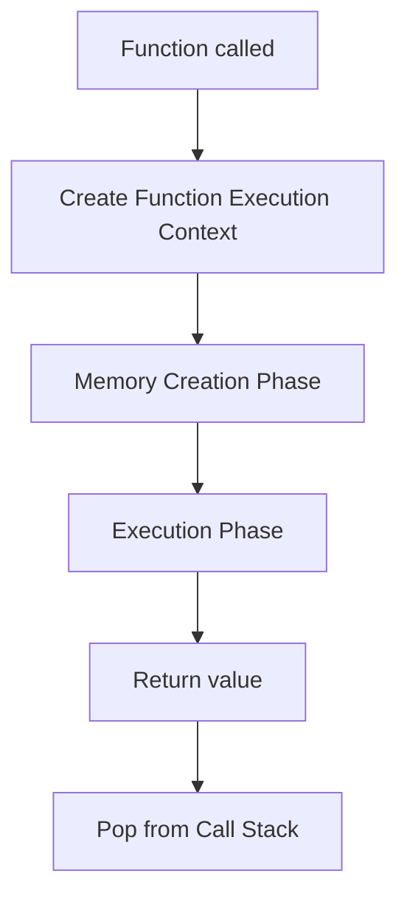

### Hoisting in functions (important)

Function-related hoisting behavior:

- Function declaration is fully hoisted
- `var` variable is hoisted as `undefined`
- Function expression and arrow function are available only after assignment line executes

### Hoisting impact table

| Pattern | Can call before definition line? | Why |
|---|---|---|
| Function declaration | Yes | Full function body available in memory creation phase |
| Function expression with `var` | No safe call | variable hoisted as `undefined`, call fails |
| Function expression with `let/const` | No | TDZ before declaration line |
| Arrow function (`const`) | No | behaves like expression assignment |

### Hoisting flow diagram

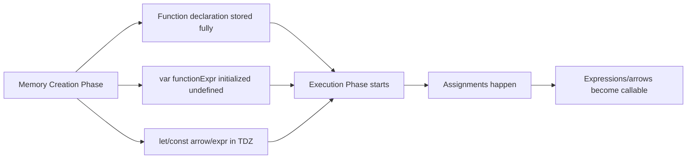

### Real-world scenario

In a report app:

- One function fetches data
- Another validates rows
- Another formats output
- Callback or higher-order function customizes behavior

Production impact:

- If `validateRows` fails, you stop pipeline early
- If callback throws error, report may remain half-rendered
- Clear function boundaries make bug tracing easier

### Flow diagram

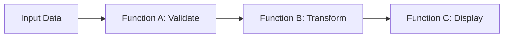

### Code example 1: Function declaration

```js
function greet(name) {
  return `Hello ${name}`;
}

const result = greet("Nisha");
console.log(result);
```

### Output

```txt
Hello Nisha
```

### Code example 2: Function declaration hoisting

```js
sayHi();

function sayHi() {
  console.log("Hi from declaration");
}
```

### Output

```txt
Hi from declaration
```

### Code example 3: Function expression hoisting behavior

```js
try {
  greetExpr();
} catch (error) {
  console.log(error.name);
}

var greetExpr = function () {
  console.log("Hi from expression");
};

greetExpr();
```

### Output

```txt
TypeError
Hi from expression
```

Why first call fails:

- `var greetExpr` exists as `undefined` during memory creation
- `undefined()` is invalid, so TypeError

### Code example 4: Arrow function

```js
const add = (a, b) => a + b;
console.log(add(2, 3));
```

### Output

```txt
5
```

### Code example 5: IIFE

```js
(function () {
  console.log("IIFE executed immediately");
})();
```

### Output

```txt
IIFE executed immediately
```

### Code example 6: Callback function

```js
function processOrder(id, callback) {
  callback(`Order ${id} processed`);
}

processOrder(101, function (msg) {
  console.log(msg);
});
```

### Output

```txt
Order 101 processed
```

### Code example 7: Higher-order function

```js
function applyOperation(a, b, operation) {
  return operation(a, b);
}

const sum = applyOperation(10, 20, (x, y) => x + y);
console.log(sum);
```

### Output

```txt
30
```

### Code example 8: Recursion

```js
function factorial(n) {
  if (n <= 1) return 1;
  return n * factorial(n - 1);
}

console.log(factorial(5));
```

### Output

```txt
120
```

### Code example 9: Closure

```js
function makeCounter() {
  let count = 0;
  return function () {
    count++;
    console.log(count);
  };
}

const counter = makeCounter();
counter();
counter();
```

### Output

```txt
1
2
```

### Code example 10: Currying

```js
function multiply(a) {
  return function (b) {
    return a * b;
  };
}

console.log(multiply(3)(4));
```

### Output

```txt
12
```

### Call stack and execution order

Execution order is last-in-first-out (LIFO):

- Last called function runs first
- First called function finishes last

### Call stack diagram

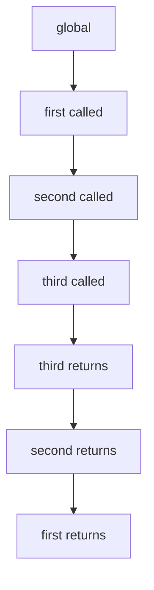

### Code example 11: Call stack order

```js
function first() {
  console.log("first start");
  second();
  console.log("first end");
}

function second() {
  console.log("second start");
  third();
  console.log("second end");
}

function third() {
  console.log("third run");
}

first();
```

### Output

```txt
first start
second start
third run
second end
first end
```

### Scenario checklist for functions

- Is this function doing one clear job?
- Are input and output types clear?
- Could this function be reused?
- Can this function fail? If yes, how is error handled?
- Is there any recursion base condition?
- Is this function declaration or expression, and does hoisting matter here?

### Edge cases

- Calling function expression before assignment causes error
- Recursive function without base condition causes stack overflow
- Too many nested function calls can make debugging hard
- Closure can retain data longer than expected, increasing memory usage

### Common mistakes

- Huge functions with too many responsibilities
- Not returning values when caller expects output
- Assuming all function styles hoist the same way
- Using arrow function where dynamic `this` is required

### Best practices

- Keep single responsibility per function
- Name functions with verb + purpose
- Prefer function declarations for core reusable utilities
- Use expression/arrow when passing behavior as value
- Write small pure functions where possible

### Summary

Functions are the building blocks of JavaScript architecture. Understanding function types, hoisting behavior, and call stack order helps you write correct, reusable, and debuggable code.

<a id="section-7"></a>

## 7. String Methods Deep Dive

---

[Previous: Functions Deep Dive](#section-6) | [Top](#top) | [Next: Number Methods Deep Dive](#section-8)

### What is it?

String methods are built-in tools to clean, search, split, combine, and format text.

Important concept:

- Strings are immutable in JavaScript
- Methods return a new string (original string is not changed)

### Real-world scenarios

- Clean user input from forms (`trim`)
- Case-insensitive search (`toLowerCase` + `includes`)
- Extract parts from IDs/emails (`slice`, `substring`)
- Parse CSV text from API (`split`)

### String method families

| Family | Methods | Real-world use |
|---|---|---|
| Case conversion | `toUpperCase`, `toLowerCase` | search normalization |
| Cleanup | `trim` | remove accidental spaces |
| Search | `includes`, `startsWith`, `endsWith`, `indexOf` | validations/filters |
| Extract | `slice`, `substring`, `charAt` | preview/masking |
| Replace | `replace`, `replaceAll` | text transformation |
| Convert | `split` | convert text to array |
| Build | `concat`, template literals, `repeat` | output messages/UI |

### String method selection flow

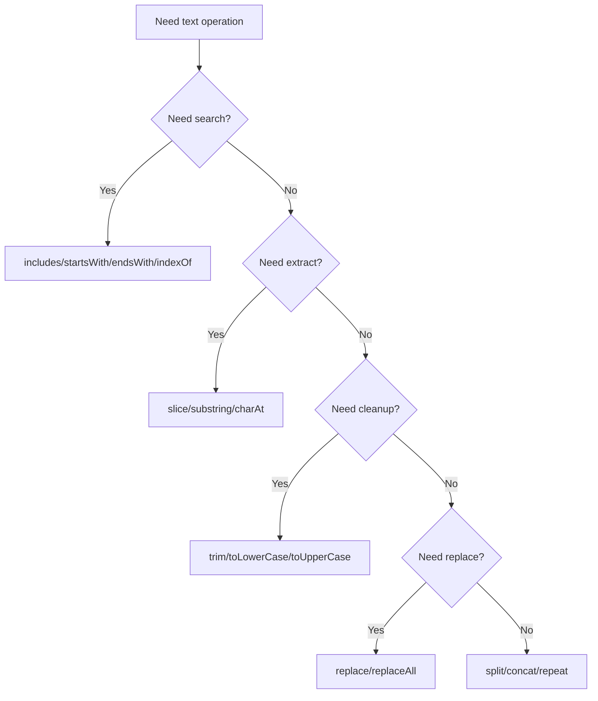

### String methods with return type

| Method | What it does | Return type |
|---|---|---|
| `length` | count characters | `number` |
| `toUpperCase()` | upper-case text | `string` |
| `toLowerCase()` | lower-case text | `string` |
| `trim()` | remove outer spaces | `string` |
| `includes()` | substring exists? | `boolean` |
| `startsWith()` | prefix check | `boolean` |
| `endsWith()` | suffix check | `boolean` |
| `indexOf()` | first index or `-1` | `number` |
| `slice()` | extract part | `string` |
| `substring()` | extract part | `string` |
| `charAt()` | character at index | `string` |
| `replace()` | replace first match | `string` |
| `replaceAll()` | replace all matches | `string` |
| `split()` | convert to array | `array` |
| `concat()` | join strings | `string` |
| `repeat()` | repeat text | `string` |

### String method snippet bank (all methods one by one)

```js
// length
const s1 = "JavaScript";
console.log(s1.length); // 10

// toUpperCase
const s2 = "nisha";
console.log(s2.toUpperCase()); // NISHA

// toLowerCase
const s3 = "NISHA";
console.log(s3.toLowerCase()); // nisha

// trim
const s4 = "  hello  ";
console.log(s4.trim()); // hello

// includes
const s5 = "javascript";
console.log(s5.includes("script")); // true

// startsWith
const s6 = "ORD-2026";
console.log(s6.startsWith("ORD")); // true

// endsWith
const s7 = "report.pdf";
console.log(s7.endsWith(".pdf")); // true

// indexOf
const s8 = "frontend";
console.log(s8.indexOf("end")); // 4

// slice
const s9 = "ABCDEFG";
console.log(s9.slice(2, 5)); // CDE

// substring
const s10 = "ABCDEFG";
console.log(s10.substring(2, 5)); // CDE

// charAt
const s11 = "Nisha";
console.log(s11.charAt(0)); // N

// replace (first match only)
const s12 = "a-b-c";
console.log(s12.replace("-", "_")); // a_b-c

// replaceAll
const s13 = "a-b-c";
console.log(s13.replaceAll("-", "_")); // a_b_c

// split
const s14 = "js,node,api";
console.log(s14.split(",")); // [ 'js', 'node', 'api' ]

// concat
const first = "Hello ";
const second = "Nisha";
console.log(first.concat(second)); // Hello Nisha

// repeat
const s15 = "ha";
console.log(s15.repeat(3)); // hahaha
```

### Code example 1: Cleanup and search

```js
const raw = "  Nisha Dhone  ";
const cleaned = raw.trim();

console.log(cleaned);
console.log(cleaned.toLowerCase());
console.log(cleaned.includes("Dhone"));
console.log(cleaned.startsWith("Nisha"));
console.log(cleaned.endsWith("Dhone"));
```

### Output

```txt
Nisha Dhone
nisha dhone
true
true
true
```

### Code example 2: Extract and replace

```js
const orderId = "ORD-2026-001";

console.log(orderId.slice(0, 3));
console.log(orderId.substring(4, 8));
console.log(orderId.charAt(0));
console.log(orderId.replace("-", "_"));
console.log(orderId.replaceAll("-", "/"));
```

### Output

```txt
ORD
2026
O
ORD_2026-001
ORD/2026/001
```

### Code example 3: Convert and build

```js
const csv = "js,node,api";
const parts = csv.split(",");

console.log(parts);
console.log("Hello ".concat("Nisha"));
console.log("ha".repeat(3));
console.log("javascript".indexOf("script"));
```

### Output

```txt
[ 'js', 'node', 'api' ]
Hello Nisha
hahaha
4
```

### Edge cases

- `replace()` changes only first match
- `indexOf()` returns `-1` when not found
- String methods do not mutate original string

### Common mistakes

- Forgetting to `trim()` user input
- Case-sensitive search without normalization
- Expecting `split()` to return string instead of array

### Best practices

- Normalize text before comparisons
- Use `replaceAll` when replacing repeated patterns
- Validate empty strings after `trim()`

### Summary

String methods are essential for input cleaning, validation, search, and output formatting in real applications.

<a id="section-8"></a>

## 8. Number Methods Deep Dive

---

[Previous: String Methods Deep Dive](#section-7) | [Top](#top) | [Next: Arrays and Array Methods](#section-9)

### What is it?

Number methods and numeric helpers are used for parsing, validating, formatting, and calculating numeric values.

### Real-world scenarios

- Convert form/API input strings into numbers
- Format currency display with fixed decimal places
- Validate integer quantities in carts and stock
- Round totals for invoices and reporting

### Number processing flow

```mermaid
flowchart TD
A[Input value] --> B{Numeric input?}
B -- No --> C[Convert Number/parseInt/parseFloat]
B -- Yes --> D[Validate Number.isNaN / Number.isInteger]
C --> D
D --> E[Calculate]
E --> F[Format with toFixed/toPrecision]
```

### Number methods and helpers table

| Method/helper | What it does | Return type | Typical use |
|---|---|---|---|
| `Number(value)` | convert to number | `number` | input conversion |
| `parseInt(str, 10)` | parse integer | `number` | numeric id extraction |
| `parseFloat(str)` | parse decimal | `number` | decimal input parsing |
| `Number.isNaN(v)` | strict NaN check | `boolean` | invalid number detection |
| `Number.isInteger(v)` | integer check | `boolean` | quantity validation |
| `toFixed(n)` | fixed decimal string | `string` | currency display |
| `toPrecision(n)` | significant digits string | `string` | compact reports |
| `Math.round(n)` | nearest int | `number` | rounded totals |
| `Math.floor(n)` | round down | `number` | page/index count |
| `Math.ceil(n)` | round up | `number` | package count |
| `Math.max(...)` | max value | `number` | highest score/price |
| `Math.min(...)` | min value | `number` | lowest price |
| `Math.random()` | pseudo random 0-1 | `number` | OTP/test values |

### Number and Math method snippet bank (all methods one by one)

```js
// Number(value)
const n1 = Number("42");
console.log(n1); // 42

// parseInt(str, 10)
const n2 = parseInt("42px", 10);
console.log(n2); // 42

// parseFloat(str)
const n3 = parseFloat("99.75kg");
console.log(n3); // 99.75

// Number.isNaN(v)
const n4 = Number("abc");
console.log(Number.isNaN(n4)); // true

// Number.isInteger(v)
const n5 = 12;
console.log(Number.isInteger(n5)); // true

// toFixed(n)
const n6 = 199.456;
console.log(n6.toFixed(2)); // 199.46

// toPrecision(n)
const n7 = 199.456;
console.log(n7.toPrecision(4)); // 199.5

// Math.round(n)
console.log(Math.round(4.6)); // 5

// Math.floor(n)
console.log(Math.floor(4.9)); // 4

// Math.ceil(n)
console.log(Math.ceil(4.1)); // 5

// Math.max(...)
console.log(Math.max(10, 20, 5)); // 20

// Math.min(...)
console.log(Math.min(10, 20, 5)); // 5

// Math.random()
const otpLike = Math.floor(1000 + Math.random() * 9000);
console.log(otpLike); // random 4-digit number
```

### Code example 1: Parse and validate

```js
const qtyInput = "3";
const qty = Number(qtyInput);
const invalid = Number("abc");

console.log(qty);
console.log(Number.isInteger(qty));
console.log(Number.isNaN(invalid));
```

### Output

```txt
3
true
true
```

### Code example 2: Format and round

```js
const price = 199.456;

console.log(price.toFixed(2));
console.log(price.toPrecision(4));
console.log(Math.round(4.6));
console.log(Math.floor(4.9));
console.log(Math.ceil(4.1));
```

### Output

```txt
199.46
199.5
5
4
5
```

### Code example 3: Practical billing scenario

```js
const amount = Number("1200.50");
const taxRate = 0.18;
const tax = amount * taxRate;
const total = amount + tax;

console.log(tax.toFixed(2));
console.log(total.toFixed(2));
console.log(Math.max(10, 20, 5));
console.log(Math.min(10, 20, 5));
```

### Output

```txt
216.09
1416.59
20
5
```

### Edge cases

- `toFixed()` returns string, not number
- Floating point precision issue: `0.1 + 0.2 !== 0.3`
- `Number("")` becomes `0`, which can be surprising

### Common mistakes

- Doing calculations before input conversion
- Using `parseInt` for decimal currency values
- Forgetting radix in `parseInt`

### Best practices

- Convert and validate at input boundary
- Keep raw numeric values for calculations
- Use formatted strings only for display

### Summary

Number methods and helpers are critical for safe calculations, reliable validation, and clean financial/data output.

<a id="section-9"></a>

## 9. Arrays and Array Methods

---

[Previous: Number Methods Deep Dive](#section-8) | [Top](#top) | [Next: Objects and Object Patterns](#section-10)

### What is it?

Array is an ordered list of values.

Array methods help you:

- Add and remove data
- Search items
- Transform one array into another
- Calculate totals
- Validate conditions
- Prepare API/UI data quickly

### Array method families

| Family | Methods | Typical use |
|---|---|---|
| Add/remove (mutating) | `push`, `pop`, `shift`, `unshift`, `splice` | cart updates, queue processing |
| Copy/extract (non-mutating) | `slice` | pagination, preview lists |
| Search | `includes`, `indexOf`, `find`, `findIndex` | lookup by id/name/status |
| Transform | `map`, `flatMap` | UI model creation |
| Filter/validate | `filter`, `some`, `every` | in-stock checks, validation rules |
| Aggregate | `reduce` | totals, grouped values |
| Iterate | `forEach` | side effects like logging/rendering |
| Sort/order | `sort` | price/order/date sorting |
| Flatten | `flat` | nested category/tag arrays |

### Return type of each array method

| Method | Returns | Return type | Mutates original array? |
|---|---|---|---|
| `push()` | New array length | `number` | Yes |
| `pop()` | Removed last item | `any` or `undefined` | Yes |
| `shift()` | Removed first item | `any` or `undefined` | Yes |
| `unshift()` | New array length | `number` | Yes |
| `splice()` | Removed items list | `array` | Yes |
| `slice()` | Copied portion | `array` | No |
| `includes()` | Found or not | `boolean` | No |
| `indexOf()` | Item position or -1 | `number` | No |
| `find()` | First matching item | `any` or `undefined` | No |
| `findIndex()` | First matching index or -1 | `number` | No |
| `map()` | Transformed items | `array` | No |
| `filter()` | Matching items | `array` | No |
| `reduce()` | Single accumulated value | `any` (based on accumulator) | No |
| `forEach()` | No useful return value | `undefined` | No |
| `some()` | At least one matched? | `boolean` | No |
| `every()` | All matched? | `boolean` | No |
| `sort()` | Sorted same array reference | `array` | Yes |
| `flat()` | Flattened array | `array` | No |
| `flatMap()` | Mapped + flattened array | `array` | No |

> [!TIP]
> If you need a new array and want to keep original data unchanged, prefer non-mutating methods like `map`, `filter`, `slice`, `flat`, and `flatMap`.

### Method selection flow

```mermaid
flowchart TD
A[Need array operation] --> B{Need single value output?}
B -- Yes --> C{Need total/summary?}
C -- Yes --> D[Use reduce]
C -- No --> E[Use find/findIndex/includes/indexOf]
B -- No --> F{Need transformed array?}
F -- Yes --> G[Use map/flatMap]
F -- No --> H{Need filtered array?}
H -- Yes --> I[Use filter]
H -- No --> J{Need validation?}
J -- Yes --> K[Use some/every]
J -- No --> L[Use forEach or mutating methods]
```

### Real-world scenario

Product listing page:

- Filter category
- Map to UI card model
- Reduce to total cart value

Also in real apps:

- Sort by price low-to-high
- Find selected product by id
- Check if any item is out of stock
- Remove item from cart by index

### Flow diagram

```mermaid
flowchart TD
A[Products Array] --> B[filter: inStock]
B --> C[map: pick fields]
C --> D[reduce: total price]
```

### Code example: `push()`

What it does: adds item at end of array and returns new length.

Real-world scenario: add new product to cart.

```js
const cart = ["pen", "book"];
const newLength = cart.push("bag");
console.log(cart);
console.log(newLength);
```

### Output

```txt
[ 'pen', 'book', 'bag' ]
3
```

### Code example: `pop()`

What it does: removes last item and returns removed value.

Real-world scenario: remove most recently added cart item.

```js
const cart = ["pen", "book", "bag"];
const removed = cart.pop();
console.log(removed);
console.log(cart);
```

### Output

```txt
bag
[ 'pen', 'book' ]
```

### Code example: `shift()`

What it does: removes first item.

Real-world scenario: process first waiting token in a queue.

```js
const queue = ["T1", "T2", "T3"];
const first = queue.shift();
console.log(first);
console.log(queue);
```

### Output

```txt
T1
[ 'T2', 'T3' ]
```

### Code example: `unshift()`

What it does: adds item at beginning.

Real-world scenario: high-priority alert should be shown first.

```js
const alerts = ["normal-1", "normal-2"];
alerts.unshift("critical");
console.log(alerts);
```

### Output

```txt
[ 'critical', 'normal-1', 'normal-2' ]
```

### Code example: `splice()`

What it does: add/remove/replace items at specific index (mutates array).

Real-world scenario: remove canceled order from middle of list.

```js
const orders = [101, 102, 103, 104];
const removed = orders.splice(1, 1); // remove one item at index 1
console.log(removed);
console.log(orders);
```

### Output

```txt
[ 102 ]
[ 101, 103, 104 ]
```

### Code example: `slice()`

What it does: copies a portion without changing original array.

Real-world scenario: show first 5 products as featured list.

```js
const products = ["p1", "p2", "p3", "p4", "p5", "p6"];
const featured = products.slice(0, 5);
console.log(featured);
console.log(products);
```

### Output

```txt
[ 'p1', 'p2', 'p3', 'p4', 'p5' ]
[ 'p1', 'p2', 'p3', 'p4', 'p5', 'p6' ]
```

### Code example: `includes()`

What it does: checks if value exists and returns boolean.

Real-world scenario: check if user already has role permission.

```js
const roles = ["viewer", "editor", "admin"];
console.log(roles.includes("admin"));
console.log(roles.includes("owner"));
```

### Output

```txt
true
false
```

### Code example: `indexOf()`

What it does: returns first index of value, otherwise `-1`.

Real-world scenario: find selected tab position.

```js
const tabs = ["home", "orders", "profile"];
console.log(tabs.indexOf("orders"));
console.log(tabs.indexOf("settings"));
```

### Output

```txt
1
-1
```

### Code example: `find()`

What it does: returns first item matching condition.

Real-world scenario: get product by id.

```js
const products = [
  { id: 1, name: "Pen" },
  { id: 2, name: "Book" }
];

const product = products.find((p) => p.id === 2);
console.log(product);
```

### Output

```txt
{ id: 2, name: 'Book' }
```

### Code example: `findIndex()`

What it does: returns index of first matching item.

Real-world scenario: locate item index before update/remove.

```js
const products = [
  { id: 1, name: "Pen" },
  { id: 2, name: "Book" }
];

const idx = products.findIndex((p) => p.id === 2);
console.log(idx);
```

### Output

```txt
1
```

### Code example: `map()`

What it does: creates new array by transforming each item.

Real-world scenario: backend product object to UI card model.

```js
const products = [
  { name: "Pen", price: 10 },
  { name: "Book", price: 50 }
];

const cards = products.map((p) => `${p.name} - Rs.${p.price}`);
console.log(cards);
```

### Output

```txt
[ 'Pen - Rs.10', 'Book - Rs.50' ]
```

### Code example: `filter()`

What it does: returns items that satisfy condition.

Real-world scenario: show only in-stock products.

```js
const products = [
  { name: "Pen", inStock: true },
  { name: "Book", inStock: false }
];

const inStockItems = products.filter((p) => p.inStock);
console.log(inStockItems);
```

### Output

```txt
[ { name: 'Pen', inStock: true } ]
```

### Code example: `reduce()`

What it does: reduces array to one value.

Real-world scenario: cart total amount.

```js
const prices = [100, 200, 300, 400];
const total = prices.reduce((sum, p) => sum + p, 0);
console.log(total);
```

### Output

```txt
1000
```

### Code example: `forEach()`

What it does: runs callback for each item (no returned transformed array).

Real-world scenario: render each log line.

```js
const logs = ["start", "processing", "done"];
logs.forEach((item) => console.log(`log: ${item}`));
```

### Output

```txt
log: start
log: processing
log: done
```

### Code example: `some()`

What it does: returns true if at least one item matches.

Real-world scenario: detect if any cart item is out of stock.

```js
const items = [
  { name: "Pen", inStock: true },
  { name: "Book", inStock: false }
];

const hasOutOfStock = items.some((i) => !i.inStock);
console.log(hasOutOfStock);
```

### Output

```txt
true
```

### Code example: `every()`

What it does: returns true only if all items match.

Real-world scenario: ensure all required documents are uploaded.

```js
const docs = [
  { name: "ID", uploaded: true },
  { name: "Address", uploaded: true }
];

const allUploaded = docs.every((d) => d.uploaded);
console.log(allUploaded);
```

### Output

```txt
true
```

### Code example: `sort()`

What it does: sorts array in place (mutates original).

Real-world scenario: price low-to-high sorting.

```js
const prices = [100, 20, 3];
const wrong = [...prices].sort();
const correct = [...prices].sort((a, b) => a - b);

console.log(wrong);
console.log(correct);
```

### Output

```txt
[ 100, 20, 3 ]
[ 3, 20, 100 ]
```

### Code example: `flat()`

What it does: flattens nested arrays.

Real-world scenario: merge nested category tags.

```js
const nested = [["js", "web"], ["api"], ["node", "db"]];
const flatTags = nested.flat();
console.log(flatTags);
```

### Output

```txt
[ 'js', 'web', 'api', 'node', 'db' ]
```

### Code example: `flatMap()`

What it does: map + flatten in one step.

Real-world scenario: user roles expanded into permission labels.

```js
const users = [
  { name: "Nisha", roles: ["admin", "editor"] },
  { name: "Riya", roles: ["viewer"] }
];

const roleLabels = users.flatMap((u) => u.roles.map((r) => `${u.name}:${r}`));
console.log(roleLabels);
```

### Output

```txt
[ 'Nisha:admin', 'Nisha:editor', 'Riya:viewer' ]
```

### Real-world pipeline example

```js
const products = [
  { name: "Pen", price: 10, inStock: true },
  { name: "Book", price: 50, inStock: false },
  { name: "Bag", price: 200, inStock: true }
];

const totalInStock = products
  .filter((p) => p.inStock)
  .map((p) => p.price)
  .reduce((sum, p) => sum + p, 0);

console.log(totalInStock);
```

### Output

```txt
210
```

### Edge cases

- Default `sort()` sorts as strings
- Mutating original arrays can break shared state
- `map()` without return gives `undefined` items
- `reduce()` without initial value can fail on empty arrays
- `forEach()` cannot be stopped using `break`
- `splice()` mutates original array directly

### Common mistakes

- Forgetting to return inside `map`
- Using `map` when no transformed array is needed
- Using `for...in` with arrays and expecting values
- Sorting numbers without comparator function
- Mutating shared array by mistake in reducers/services

### Best practices

- Use immutable patterns when possible
- Use descriptive callback names
- Prefer `find()` when expecting one item, `filter()` for many
- Always pass comparator in numeric/date sorting
- Add initial accumulator value in `reduce()`
- Use `some()`/`every()` for clear boolean intent

### Summary

Array methods are the backbone of JavaScript data processing. Choosing the right method improves readability, correctness, and real-world maintainability.

<a id="section-10"></a>

## 10. Objects and Object Patterns

---

[Previous: Arrays and Array Methods](#section-9) | [Top](#top) | [Next: this, call, apply, bind](#section-11)

### What is it?

Object stores key-value pairs.

Object is used to model real-world entities like:

- user profile
- product
- order
- invoice
- app configuration

In objects:

- key is property name
- value can be any type (string, number, array, object, function)

Common operations:

- Create and update properties
- Read values using dot and bracket notation
- Optional chaining `?.` for safe nested reads
- Destructuring for clean extraction
- Object methods for behavior
- Merge and copy objects using spread or `Object.assign`

### Object structure diagram

```mermaid
flowchart TD
A[Object] --> B[Primitive properties]
A --> C[Nested object]
A --> D[Array property]
A --> E[Method function]
```

### Access and update flow

```mermaid
flowchart LR
A[Need object value] --> B{Property exists?}
B -- Yes --> C[Read/Update value]
B -- No --> D{Use optional chaining?}
D -- Yes --> E[Get undefined safely]
D -- No --> F[Possible runtime error]
```

### Object method quick table

| Pattern | What it does | Real-world use |
|---|---|---|
| Dot notation | Read fixed property name | `user.name` |
| Bracket notation | Read dynamic property key | `user[fieldName]` |
| Optional chaining | Safe nested access | `user.address?.city` |
| Destructuring | Extract fields quickly | `const { name, role } = user` |
| Spread copy | Shallow copy/merge | update profile settings |
| `Object.keys` | Get property names | table headers/filter fields |
| `Object.values` | Get property values | summary panels |
| `Object.entries` | Key-value iteration | generic renderers |
| `Object.freeze` | Prevent modifications | protect constants/config |

### Real-world scenario

User profile object stores name, email, role, preferences, address, and methods like `getDisplayName()`.

Additional production scenarios:

- API response normalization before rendering UI
- Role-based access checks from user object
- Creating updated object state without mutating old state

### Flow diagram

```mermaid
flowchart LR
A[Raw User Object] --> B[Read Properties]
B --> C[Validate Required Fields]
C --> D[Render Profile]
```

### Code example 1: Create and read object

```js
const user = {
  name: "Nisha",
  role: "admin",
  isActive: true
};

console.log(user.name, user.role);
```

### Output

```txt
Nisha admin
```

### Code example 2: Dot vs bracket notation

```js
const product = {
  id: 101,
  name: "Notebook",
  price: 120
};

const dynamicKey = "price";

console.log(product.name);       // dot notation
console.log(product[dynamicKey]); // bracket notation
```

### Output

```txt
Notebook
120
```

### Code example 3: Nested object + optional chaining

```js
const order = {
  id: "ORD-1",
  customer: {
    name: "Nisha",
    address: { city: "Pune" }
  }
};

console.log(order.customer.address.city);
console.log(order.customer.contact?.phone);
```

### Output

```txt
Pune
undefined
```

### Code example 4: Destructuring

```js
const profile = {
  name: "Nisha",
  role: "editor",
  stats: { posts: 14 }
};

const { name, role } = profile;
const { posts } = profile.stats;
console.log(name, role, posts);
```

### Output

```txt
Nisha editor 14
```

### Code example 5: Immutable-style update with spread

```js
const state = {
  user: { name: "Nisha", city: "Pune" },
  theme: "light"
};

const nextState = {
  ...state,
  user: { ...state.user, city: "Mumbai" }
};

console.log(state.user.city);
console.log(nextState.user.city);
```

### Output

```txt
Pune
Mumbai
```

### Code example 6: Object iteration helpers

```js
const metrics = { users: 12, orders: 7, revenue: 4200 };

console.log(Object.keys(metrics));
console.log(Object.values(metrics));

for (const [key, value] of Object.entries(metrics)) {
  console.log(`${key}: ${value}`);
}
```

### Output

```txt
[ 'users', 'orders', 'revenue' ]
[ 12, 7, 4200 ]
users: 12
orders: 7
revenue: 4200
```

### Code example 7: `Object.freeze()` for protected configuration

```js
const config = Object.freeze({
  appName: "ShopEasy",
  version: "1.0.0"
});

config.version = "2.0.0"; // ignored in non-strict mode
console.log(config.version);
```

### Output

```txt
1.0.0
```

### Scenario checklist for objects

- Is object shape consistent across API responses?
- Are you mutating shared object by mistake?
- Do you need safe nested read (`?.`)?
- Should this update be immutable (spread/assign)?
- Are dynamic keys needed (bracket notation)?

### Edge cases

- Accessing missing nested property throws error without optional chaining
- Shallow copy can still share nested object references
- `Object.freeze()` is shallow, nested objects can still change
- Two objects with same content are not equal by reference (`{} === {}` is false)

### Common mistakes

- Mutating shared objects directly
- Assuming spread makes deep copy
- Using dot notation for dynamic keys (fails in many cases)
- Forgetting default value while destructuring optional fields

### Best practices

- Use optional chaining for safe reads
- Use object spread for safe shallow updates
- Prefer clear object schema and predictable property names
- Use `Object.entries` for generic key-value rendering
- Keep methods small and avoid mixing too much business logic in one object

### Summary

Objects represent real-world entities and structured application data. Mastering access, update, and safe-read patterns is essential for production JavaScript.

<a id="section-11"></a>

## 11. this, call, apply, bind

---

[Previous: Objects and Object Patterns](#section-10) | [Top](#top) | [Next: Prototype and Classes](#section-12)

### What is it?

this is a runtime reference that points to the current execution context of a function.

Important: this is decided by how a function is called, not where it is written.

call, apply, and bind are function methods used to explicitly control this.

- call(thisArg, arg1, arg2, ...): calls immediately
- apply(thisArg, [arg1, arg2, ...]): calls immediately with array of arguments
- bind(thisArg, arg1, arg2, ...): returns a new function for later execution

### How this is decided (core rules)

1. Global call

```js
function show() {
  console.log(this);
}
show();
```

In browsers (non-strict), this is window. In strict mode, this is undefined.

2. Method call

```js
const user = {
  name: "Nisha",
  greet() {
    console.log(this.name);
  }
};

user.greet(); // Nisha
```

Here this points to the object before dot, so this.name is Nisha.

3. Constructor call with new

```js
function User(name) {
  this.name = name;
}

const u = new User("Nisha");
console.log(u.name); // Nisha
```

With new, this points to the newly created object.

4. Explicit binding with call/apply/bind

```js
function intro(city, country) {
  console.log(`${this.name} from ${city}, ${country}`);
}

const person = { name: "Nisha" };

intro.call(person, "Pune", "India");
intro.apply(person, ["Pune", "India"]);
const boundIntro = intro.bind(person, "Pune");
boundIntro("India");
```

### call vs apply vs bind (diff table)

| Feature | call | apply | bind |
|---|---|---|---|
| Execution | Immediate | Immediate | Later (returns function) |
| Argument style | Comma-separated | Array | Comma-separated at bind time (optional partial args) |
| Return value | Function result | Function result | New bound function |
| Best use case | Known fixed arguments now | Arguments already in array | Event handlers, delayed execution, callbacks |

### this behavior diff table (normal vs arrow)

| Function type | this source | Can be changed by call/apply/bind? | Typical use |
|---|---|---|---|
| Normal function | Dynamic (call-site based) | Yes | Object methods needing dynamic this |
| Arrow function | Lexical (from outer scope) | No (ignored for this) | Short callbacks, closures |

### this behavior inside object (all invocation combinations)

| Case | Pattern | this points to | Output expectation |
|---|---|---|---|
| 1 | Object regular method | That object | Works as expected |
| 2 | Object arrow method | Outer lexical scope (not object) | Usually undefined/window-based |
| 3 | Nested regular inside regular | Inner regular call-site | Context often lost |
| 4 | Nested arrow inside regular | Captures outer regular method this | Uses object context |
| 5 | Nested regular inside arrow | Inner regular call-site | Context lost unless bound |
| 6 | Nested arrow inside arrow | Lexical chain from outer scope | Not object (unless outer already has object this) |

### Case 1: Invoked as regular function inside object method

```js
const user1 = {
  name: "Nisha",
  regularMethod: function () {
    console.log(this.name);
  }
};

user1.regularMethod();
```

Output:

```txt
Nisha
```

Why:

- regularMethod is called with object-dot syntax
- so this becomes user1

### Case 2: Invoked as arrow function inside object

```js
const user2 = {
  name: "Nisha",
  arrowMethod: () => {
    console.log(this?.name);
  }
};

user2.arrowMethod();
```

Output:

```txt
undefined
```

Why:

- arrow does not create its own this
- it captures this from outer scope, not from user2

### Case 3: Nested regular + regular

```js
const user3 = {
  name: "Nisha",
  outerRegular: function () {
    console.log("outer:", this.name);

    function innerRegular() {
      console.log("inner:", this?.name);
    }

    innerRegular();
  }
};

user3.outerRegular();
```

Output:

```txt
outer: Nisha
inner: undefined
```

Why:

- outerRegular gets object context
- innerRegular is plain function invocation, so context is lost

### Case 4: Nested regular + arrow

```js
const user4 = {
  name: "Nisha",
  outerRegular: function () {
    console.log("outer:", this.name);

    const innerArrow = () => {
      console.log("inner:", this.name);
    };

    innerArrow();
  }
};

user4.outerRegular();
```

Output:

```txt
outer: Nisha
inner: Nisha
```

Why:

- innerArrow captures this from outerRegular
- outerRegular has this = user4

### Case 5: Nested arrow + regular

```js
const user5 = {
  name: "Nisha",
  outerArrow: () => {
    console.log("outer:", this?.name);

    function innerRegular() {
      console.log("inner:", this?.name);
    }

    innerRegular();
  }
};

user5.outerArrow();
```

Output:

```txt
outer: undefined
inner: undefined
```

Why:

- outerArrow already does not get object this
- innerRegular plain call also does not get object this

### Case 6: Nested arrow + arrow

```js
const user6 = {
  name: "Nisha",
  outerArrow: () => {
    console.log("outer:", this?.name);

    const innerArrow = () => {
      console.log("inner:", this?.name);
    };

    innerArrow();
  }
};

user6.outerArrow();
```

Output:

```txt
outer: undefined
inner: undefined
```

Why:

- both arrows use lexical this from outer scope
- object user6 is not the lexical this source here

### Quick fix patterns for lost context

```js
const user7 = {
  name: "Nisha",
  outerRegular: function () {
    function innerRegular() {
      console.log(this.name);
    }

    // Fix 1: bind
    const bound = innerRegular.bind(this);
    bound();

    // Fix 2: call
    innerRegular.call(this);
  }
};

user7.outerRegular();
```

### Real-world scenario

A billing utility method should work for multiple customer objects without duplicating function logic.

```mermaid
flowchart TD
A[Reusable function] --> B[call/apply/bind]
B --> C[Attach selected object as this]
C --> D[Run with correct customer data]
```

### Core example: one function, multiple objects

```js
const customerA = { name: "Nisha", plan: "Gold" };
const customerB = { name: "Riya", plan: "Silver" };

function showPlan(region) {
  console.log(`${this.name} uses ${this.plan} plan in ${region}`);
}

showPlan.call(customerA, "APAC");
showPlan.call(customerB, "EMEA");
```

### Output

```txt
Nisha uses Gold plan in APAC
Riya uses Silver plan in EMEA
```

### React code snippets and detailed explanation

Important React context:

- Functional components generally do not use this.
- Class components can need this binding for event handlers.
- Arrow handlers in classes avoid manual bind by lexical this capture.

### React snippet 1: Class component without bind (problem)

```jsx
import React from "react";

class Counter extends React.Component {
  state = { count: 0 };

  increment() {
    this.setState({ count: this.state.count + 1 });
  }

  render() {
    return <button onClick={this.increment}>Add</button>;
  }
}
```

Explanation:

- onClick receives a function reference.
- When increment runs as callback, context is lost.
- this can become undefined, causing this.setState error.

### React snippet 2: Class component using bind in constructor (solution)

```jsx
import React from "react";

class Counter extends React.Component {
  constructor(props) {
    super(props);
    this.state = { count: 0 };
    this.increment = this.increment.bind(this);
  }

  increment() {
    this.setState((prev) => ({ count: prev.count + 1 }));
  }

  render() {
    return <button onClick={this.increment}>Add</button>;
  }
}
```

Explanation:

- bind creates a new function permanently attached to component instance.
- this inside increment always points to Counter instance.
- setState works reliably.

### React snippet 3: Class component with arrow handler (modern class pattern)

```jsx
import React from "react";

class Counter extends React.Component {
  state = { count: 0 };

  increment = () => {
    this.setState((prev) => ({ count: prev.count + 1 }));
  };

  render() {
    return <button onClick={this.increment}>Add</button>;
  }
}
```

Explanation:

- Arrow method captures lexical this from class instance context.
- No manual constructor bind required.
- Cleaner and commonly used in class components.

### React snippet 4: Functional component (no this needed)

```jsx
import React, { useState } from "react";

export default function Counter() {
  const [count, setCount] = useState(0);

  const increment = () => {
    setCount((prev) => prev + 1);
  };

  return <button onClick={increment}>Add: {count}</button>;
}
```

Explanation:

- Functional components rely on hooks and closures.
- No this keyword is involved.
- Preferred pattern in modern React apps.

### React diff table (class vs function for this)

| Aspect | Class component | Functional component |
|---|---|---|
| Uses this | Yes | No |
| State access | this.state / this.setState | useState hook |
| Handler binding need | Often yes (unless arrow field) | No |
| Recommended in modern React | Legacy/valid | Preferred |

### call/apply practical argument difference

```js
function sum(a, b, c) {
  return `${this.label}: ${a + b + c}`;
}

const ctx = { label: "Total" };

console.log(sum.call(ctx, 10, 20, 30));
console.log(sum.apply(ctx, [10, 20, 30]));
const boundSum = sum.bind(ctx, 10, 20);
console.log(boundSum(30));
```

### Output

```txt
Total: 60
Total: 60
Total: 60
```

### Method extraction problem and fix

```js
const account = {
  holder: "Nisha",
  showHolder() {
    console.log(this.holder);
  }
};

const fn = account.showHolder;
// fn(); // undefined (context lost in strict mode)

const safeFn = account.showHolder.bind(account);
safeFn(); // Nisha
```

### Edge cases

- Arrow functions ignore rebinding attempts for this.
- In strict mode, plain function call gives this as undefined.
- bind only binds once; rebinding a bound function does not change original bound this.

### Common mistakes

- Using object method as callback without preserving context.
- Assuming arrow function is always correct for every method.
- Confusing apply array-args with call positional args.

### Best practices

- Use normal function when dynamic this is required.
- Use bind for delayed callbacks/event handlers when context may be lost.
- Prefer functional React components to avoid this complexity in new code.
- In class React components, use arrow handlers or explicit constructor bind consistently.

### Summary

Mastering this, call, apply, and bind helps you avoid context bugs, write reusable functions, and correctly handle callbacks in JavaScript and React.

### Real-world scenario

A shared invoice function should run for different customer objects by switching context.

### Flow diagram

```mermaid
flowchart TD
A[Shared Function] --> B[call/apply/bind]
B --> C[Attach this to target object]
C --> D[Execute with correct context]
```

### Code example

```js
const person = { name: "Nisha" };

function say(city) {
  console.log(`${this.name} from ${city}`);
}

say.call(person, "Pune");
```

### Output

```txt
Nisha from Pune
```

### Edge cases

- Arrow functions ignore `call/apply/bind` for `this`
- Losing method context when passing method as callback

### Common mistakes

- Using arrow function for object method expecting dynamic `this`

### Best practices

- Use normal function for methods needing dynamic `this`
- Use `bind` for event handler context stability

### Summary

Understanding `this` and binding methods prevents many advanced bugs.

<a id="section-12"></a>

## 12. Prototype and Classes

---

[Previous: this, call, apply, bind](#section-11) | [Top](#top) | [Next: DOM and Events](#section-13)

### What is it?

JavaScript is prototype-based, and class syntax is a cleaner way to model Object-Oriented Programming (OOP).

Simple meaning:

- Prototype: shared parent object for methods/properties
- Class: readable syntax over prototype system
- Object: actual instance created from class/constructor

### OOP concepts covered in this section

| Concept | Meaning | Why it matters |
|---|---|---|
| Class and Object | Blueprint and instance | Organizes real entities |
| Encapsulation | Keep data + methods together, hide internals | Prevents misuse |
| Abstraction | Show what to use, hide complex internal logic | Reduces mental load |
| Inheritance | Child reuses parent behavior | Avoids duplicate code |
| Polymorphism | Same method name, different behavior | Flexible design |
| Composition | Build feature by combining small objects | Better maintainability |
| Static members | Belong to class, not instances | Utilities/factories |
| Getter/Setter | Controlled read/write | Validation and safety |

### OOP relationship diagram

```mermaid
classDiagram
class Person {
  +name
  +getRole()
}

class Customer {
  +loyaltyPoints
  +getRole()
}

class PaymentMethod {
  +pay(amount)
}

class CardPayment {
  +pay(amount)
}

class UpiPayment {
  +pay(amount)
}

class Order {
  +confirm(orderId)
}

class EmailNotifier {
  +send(message)
}

class SmsNotifier {
  +send(message)
}

Person <|-- Customer
PaymentMethod <|-- CardPayment
PaymentMethod <|-- UpiPayment
Order --> EmailNotifier : uses
Order --> SmsNotifier : uses
```

This diagram shows both inheritance (is-a) and composition (has-a) in one view.

### OOP interview table (concept ID + answer)

| Concept | Common interview question | Interview-ready answer |
|---|---|---|
| Class and Object | What is class vs object in JavaScript? | A class is a blueprint that defines structure and behavior, while an object is a runtime instance created from that blueprint. |
| Encapsulation | What is encapsulation and why use it? | Encapsulation bundles data with methods and restricts direct access to internals, so state changes happen through controlled APIs. |
| Abstraction | Explain abstraction with an example. | Abstraction exposes only required operations and hides implementation details; for example, a `pay()` method hides gateway retries and validation logic. |
| Inheritance | What is inheritance in JavaScript? | Inheritance allows a child class to reuse parent behavior using `extends`, reducing duplication and enabling specialization via overridden methods. |
| Polymorphism | What is polymorphism? | Polymorphism means the same method name can produce different behavior based on object type, such as `pay()` in `CardPayment` and `UpiPayment`. |
| Composition | Composition vs inheritance: which is better? | Prefer composition when behavior must change independently; it is more flexible and testable, while inheritance is best for clear is-a relationships. |
| Static members | When should we use static methods? | Use static methods for utilities or factory behavior that belongs to the class itself and does not depend on instance state. |
| Getter/Setter | Why use getters and setters? | Getters and setters provide controlled property access, allowing validation, transformation, or side-effects while keeping a clean object API. |

### Rapid interview one-liners

| Concept | One-liner answer |
|---|---|
| Class and Object | Class defines; object uses. |
| Encapsulation | Hide data, expose safe methods. |
| Abstraction | Show interface, hide complexity. |
| Inheritance | Reuse parent behavior in child. |
| Polymorphism | Same method, different runtime behavior. |
| Composition | Build objects from smaller reusable parts. |
| Static members | Class-level behavior without object creation. |
| Getter/Setter | Controlled read/write with validation. |

### Real-world domain example: E-commerce Order System

We model a shopping system with:

- Base user behavior
- Customer and admin specialization
- Order calculation and discount rules
- Payment abstraction
- Notification composition

### High-level architecture flow

```mermaid
flowchart TD
A[Person Class] --> B[Customer Class]
A --> C[Admin Class]
B --> D[Order Class]
D --> E[Payment Strategy]
D --> F[Notifier Composition]
```

### 1) Class and Object

```js
class Product {
  constructor(id, name, price) {
    this.id = id;
    this.name = name;
    this.price = price;
  }

  label() {
    return `${this.name} - Rs.${this.price}`;
  }
}

const pen = new Product(1, "Pen", 10);
console.log(pen.label());
```

Output:

```txt
Pen - Rs.10
```

What happened:

- Product is the class (blueprint)
- pen is an object (instance)
- label method is shared via prototype

### 2) Encapsulation (with private fields)

```js
class Wallet {
  #balance;

  constructor(initialAmount = 0) {
    this.#balance = initialAmount;
  }

  deposit(amount) {
    if (amount <= 0) throw new Error("Amount must be positive");
    this.#balance += amount;
  }

  getBalance() {
    return this.#balance;
  }
}

const w = new Wallet(1000);
w.deposit(500);
console.log(w.getBalance());
```

Output:

```txt
1500
```

Why this is encapsulation:

- #balance cannot be changed directly from outside
- all updates go through controlled methods

### 3) Abstraction (hide internal complexity)

```js
class PaymentService {
  pay(orderAmount) {
    // Internal steps hidden from caller:
    // 1) validate
    // 2) connect gateway
    // 3) retry if temporary failure
    // 4) return final status
    return `Paid Rs.${orderAmount}`;
  }
}

const payment = new PaymentService();
console.log(payment.pay(1200));
```

Output:

```txt
Paid Rs.1200
```

Why this is abstraction:

- Caller only uses pay()
- Caller does not need gateway internals

### 4) Inheritance

```js
class Person {
  constructor(name) {
    this.name = name;
  }

  getRole() {
    return "Person";
  }
}

class Customer extends Person {
  constructor(name, loyaltyPoints) {
    super(name);
    this.loyaltyPoints = loyaltyPoints;
  }

  getRole() {
    return "Customer";
  }
}

const c = new Customer("Nisha", 120);
console.log(c.name);
console.log(c.getRole());
```

Output:

```txt
Nisha
Customer
```

Why this is inheritance:

- Customer reuses Person properties
- Child extends and specializes parent behavior

### 5) Polymorphism (same method, different behavior)

```js
class PaymentMethod {
  pay(amount) {
    return `Base payment: ${amount}`;
  }
}

class CardPayment extends PaymentMethod {
  pay(amount) {
    return `Card charged: Rs.${amount}`;
  }
}

class UpiPayment extends PaymentMethod {
  pay(amount) {
    return `UPI paid: Rs.${amount}`;
  }
}

function processPayment(method, amount) {
  console.log(method.pay(amount));
}

processPayment(new CardPayment(), 900);
processPayment(new UpiPayment(), 900);
```

Output:

```txt
Card charged: Rs.900
UPI paid: Rs.900
```

Why this is polymorphism:

- processPayment uses one interface: pay()
- runtime object decides actual implementation

### 6) Composition (has-a relationship)

```js
class EmailNotifier {
  send(message) {
    return `Email: ${message}`;
  }
}

class SmsNotifier {
  send(message) {
    return `SMS: ${message}`;
  }
}

class Order {
  constructor(notifier) {
    this.notifier = notifier;
  }

  confirm(orderId) {
    return this.notifier.send(`Order ${orderId} confirmed`);
  }
}

const emailOrder = new Order(new EmailNotifier());
const smsOrder = new Order(new SmsNotifier());

console.log(emailOrder.confirm("ORD-101"));
console.log(smsOrder.confirm("ORD-102"));
```

Output:

```txt
Email: Order ORD-101 confirmed
SMS: Order ORD-102 confirmed
```

Why composition is powerful:

- behavior is injected, not hardcoded
- easy to replace, test, and extend

### 7) Static methods and static properties

```js
class Invoice {
  static gstRate = 0.18;

  static withTax(amount) {
    return amount + amount * Invoice.gstRate;
  }
}

console.log(Invoice.withTax(1000));
```

Output:

```txt
1180
```

Why static:

- utility belongs to class itself
- no object creation required

### 8) Getter and Setter

```js
class Account {
  #email = "";

  set email(value) {
    if (!value.includes("@")) {
      throw new Error("Invalid email");
    }
    this.#email = value;
  }

  get email() {
    return this.#email;
  }
}

const acc = new Account();
acc.email = "nisha@example.com";
console.log(acc.email);
```

Output:

```txt
nisha@example.com
```

Why getter/setter:

- validates data at write time
- keeps class API clean (`acc.email = ...`)

### Prototype vs Class (diff table)

| Topic | Prototype style | Class style |
|---|---|---|
| Readability | Verbose for beginners | Cleaner and structured |
| Inheritance | Manual setup | `extends` + `super` |
| Private state | Closure tricks/manual | `#privateField` support |
| Industry usage | Still valid | Preferred for app models |

### Constructor function + prototype (under the hood)

```js
function User(name) {
  this.name = name;
}

User.prototype.greet = function () {
  return `Hello ${this.name}`;
};

const u = new User("Karan");
console.log(u.greet());
```

Output:

```txt
Hello Karan
```

This shows class syntax is a nicer layer over prototype mechanics.

### OOP checklist for real projects

- Is inheritance really needed, or is composition better?
- Are important fields protected (private + setter validation)?
- Are static utilities separated from instance behavior?
- Is each class focused on one responsibility?
- Can behavior vary via polymorphism instead of if-else chains?

### Edge cases

- Forgetting super() in child constructor before using this
- Trying to access private fields outside class (`obj.#x` is invalid)
- Confusing static methods with instance methods
- Overusing inheritance for cases better solved by composition

### Common mistakes

- Putting too much logic in one class
- Duplicating methods inside constructor (wastes memory)
- Using inheritance where there is no true is-a relationship
- Mixing data validation in many places instead of central setter/service

### Best practices

- Prefer composition for changing behavior
- Keep class methods small and purpose-driven
- Use private fields for sensitive/internal state
- Use polymorphism for extensibility
- Document class responsibilities clearly

### Summary

Prototype and class understanding gives you production-level OOP design in JavaScript. With encapsulation, abstraction, inheritance, polymorphism, and composition, you can build scalable and maintainable real-world systems.

<a id="section-13"></a>

## 13. DOM and Events

---

[Previous: Prototype and Classes](#section-12) | [Top](#top) | [Next: Async JavaScript](#section-14)

### What is it?

DOM (Document Object Model) is the in-memory tree representation of your HTML page.

Every HTML tag becomes a node, and JavaScript can:

- Find nodes (query/select)
- Read or change content and attributes
- Change styles and classes
- Listen to user actions (events)

### Why DOM matters in real projects

Without DOM APIs, your UI cannot react to user input.

Typical product features using DOM/events:

- Login form validation
- Search filtering while typing
- Cart add/remove buttons
- Modal open/close
- Table sorting and pagination

### DOM node model at a glance

```mermaid
flowchart TD
A[document] --> B[html]
B --> C[head]
B --> D[body]
D --> E[div app]
E --> F[input]
E --> G[button]
E --> H[ul list]
```

### DOM operations quick table

| Operation | Common API | Example use |
|---|---|---|
| Select one element | `querySelector` | get save button |
| Select many elements | `querySelectorAll` | get all todo rows |
| Read/write text | `textContent` | show status message |
| Read/write HTML | `innerHTML` | render list markup |
| Attribute update | `getAttribute`, `setAttribute` | update image src, ARIA attrs |
| CSS class toggle | `classList.add/remove/toggle` | active/inactive state |
| Create nodes | `createElement`, `append` | add new todo item |
| Remove nodes | `remove`, `removeChild` | delete row/card |

### Events fundamentals

An event is a signal that something happened.

Common events:

- Mouse: `click`, `dblclick`, `mouseenter`
- Keyboard: `keydown`, `keyup`
- Form: `submit`, `input`, `change`, `focus`, `blur`
- Page: `DOMContentLoaded`, `load`

### Event propagation (capture -> target -> bubble)

```mermaid
flowchart LR
A[Window/Document] --> B[Capture phase]
B --> C[Target element]
C --> D[Bubble phase]
D --> E[Parent handlers]
```

### Event delegation runtime diagram

```mermaid
sequenceDiagram
participant U as User
participant B as Child Button
participant L as Parent List Listener

U->>B: Click delete
B-->>L: Bubble event
L->>L: Check event.target.closest("[data-action='delete']")
L->>L: Remove matched row
```

This explains why one parent listener can manage many child buttons, including dynamically added items.

### Event APIs quick table

| API / property | Purpose | Notes |
|---|---|---|
| `addEventListener(type, handler)` | attach listener | preferred over inline handlers |
| `event.target` | exact clicked/input element | useful in delegation |
| `event.currentTarget` | element where listener is attached | may differ from target |
| `event.preventDefault()` | stop default browser action | form submit/navigation |
| `event.stopPropagation()` | stop bubbling to parent | use carefully |
| `removeEventListener()` | cleanup listener | important in large apps |

### Real-world scenario: Todo app with dynamic items

Requirements:

- Add todo using form
- Delete any todo
- Works for future items too

Best pattern: one delegated listener on list container.

### Example 1: Safe element selection + click handler

```js
document.addEventListener("DOMContentLoaded", () => {
  const saveBtn = document.querySelector("#saveBtn");
  const status = document.querySelector("#status");

  if (!saveBtn || !status) return;

  saveBtn.addEventListener("click", () => {
    status.textContent = "Saved successfully";
  });
});
```

Output (UI text):

```txt
Saved successfully
```

### Example 2: Event delegation for dynamic delete buttons

```js
const list = document.querySelector("#todoList");

list.addEventListener("click", (event) => {
  const deleteBtn = event.target.closest("[data-action='delete']");
  if (!deleteBtn) return;

  const row = deleteBtn.closest("li");
  row?.remove();
});
```

Why this is powerful:

- One listener handles all existing and future delete buttons
- Better performance than adding listener to each row

### Example 3: Form submit + prevent default + validation

```js
const form = document.querySelector("#todoForm");
const input = document.querySelector("#todoInput");
const errorText = document.querySelector("#errorText");

form.addEventListener("submit", (event) => {
  event.preventDefault();

  const value = input.value.trim();
  if (!value) {
    errorText.textContent = "Todo cannot be empty";
    return;
  }

  errorText.textContent = "";
  console.log("Todo added:", value);
  form.reset();
});
```

Console output example:

```txt
Todo added: Buy milk
```

### Example 4: target vs currentTarget difference

```js
const card = document.querySelector("#card");

card.addEventListener("click", (event) => {
  console.log("target:", event.target.tagName);
  console.log("currentTarget:", event.currentTarget.tagName);
});
```

When clicking a child button inside card, target may be `BUTTON` and currentTarget is `DIV`.

### Example 5: classList + attribute updates

```js
const themeBtn = document.querySelector("#themeBtn");
const box = document.querySelector("#box");

themeBtn.addEventListener("click", () => {
  box.classList.toggle("dark");
  const isDark = box.classList.contains("dark");
  box.setAttribute("aria-pressed", String(isDark));
});
```

### event bubbling vs delegation (diff table)

| Topic | Bubbling behavior | Delegation usage |
|---|---|---|
| What it is | Event moves child to parent | Parent uses bubbling to manage child actions |
| Listener count | Often many (if attached per child) | Usually one on container |
| Dynamic elements | Need extra listeners | Works automatically |
| Performance | Can be heavy for big lists | More efficient |

### Mini workflow for DOM-driven features

```mermaid
flowchart TD
A[Select DOM nodes] --> B[Attach listeners]
B --> C[User action]
C --> D[Validate input/event target]
D --> E[Update DOM state]
E --> F[Persist if needed localStorage/API]
```

### Scenario checklist

- Are elements selected after DOM is ready?
- Are null checks present before using nodes?
- Do you need `preventDefault` for form/links?
- Would delegation reduce listener count?
- Are you updating text safely (`textContent`) where possible?

### Edge cases

- `querySelector` returns null when selector is wrong or element not loaded
- `innerHTML` can replace nodes and remove old event listeners
- Bubbling may trigger parent handler unexpectedly
- `stopPropagation` can break analytics/global listeners if overused
- Events on disabled form elements may not fire as expected

### Common mistakes

- Attaching listeners inside loops without cleanup
- Using `innerHTML` with unsanitized user content (XSS risk)
- Assuming `event.target` is always the container
- Forgetting trim/validation for form input
- Registering listeners before DOM is ready

### Best practices

- Prefer `addEventListener` over inline HTML handlers
- Prefer `textContent` for plain text updates
- Use event delegation for dynamic collections
- Keep handlers small and call dedicated functions
- Add ARIA and semantic attributes when UI state changes
- Cleanup listeners in SPA components when unmounting

### Summary

DOM and events are the bridge between UI and JavaScript logic. Mastering selection, event propagation, delegation, and safe updates is essential for real-world frontend development.

<a id="section-14"></a>

## 14. Async JavaScript

---

[Previous: DOM and Events](#section-13) | [Top](#top) | [Next: APIs, Fetch, Axios, and REST Basics](#section-15)

### What is it?

Async JavaScript lets your app continue running while slow work (network, timers, file I/O) completes in the background.

Without async behavior, the UI would freeze until each slow operation finishes.

Core pieces:

- Call stack
- Web APIs (browser) or runtime APIs (Node.js)
- Callback queue (macrotask queue)
- Microtask queue (Promise jobs)
- Event loop scheduler

### Why event loop matters

Most interview confusion happens because developers know Promise and setTimeout syntax but do not know task priority rules.

Event loop understanding helps you:

- Predict exact log order
- Avoid race conditions
- Prevent UI jank and long blocking tasks
- Debug async bugs faster

### Event loop architecture

```mermaid
flowchart LR
A[Call Stack] -->|empty?| B{Event Loop}
C[Web APIs: timer/fetch/DOM] --> D[Task Queues]
D --> E[Microtask Queue\nPromise.then catch finally\nqueueMicrotask]
D --> F[Macrotask Queue\nsetTimeout setInterval UI events]
B -->|1st priority| E
B -->|2nd priority| F
B --> A
```

### Step-by-step execution model

1. Run synchronous code on call stack.
2. Async operations go to Web APIs/runtime.
3. Completed callbacks are queued.
4. When stack is empty, event loop runs:
   - Drain all microtasks first.
   - Then run one macrotask.
   - Repeat.

### Queue priority diff table

| Queue type | Examples | Priority | Execution behavior |
|---|---|---|---|
| Microtask | `Promise.then`, `catch`, `finally`, `queueMicrotask` | Higher | Drained fully before next macrotask |
| Macrotask | `setTimeout`, `setInterval`, DOM events | Lower | One task per loop turn |

### Real-world scenario

Dashboard loading flow:

- show skeleton immediately (sync)
- fetch metrics (async API)
- Promise handlers update cards (microtask)
- delayed tooltip animation (macrotask timer)

```mermaid
sequenceDiagram
participant UI as UI Thread
participant API as Fetch API
participant MT as Microtask Queue
participant MA as Macrotask Queue

UI->>UI: Render skeleton (sync)
UI->>API: fetch /metrics
API-->>MT: Promise resolve handler queued
UI->>MA: setTimeout(animation, 0)
UI->>MT: Run Promise handler first
UI->>MA: Then run timer callback
```

### Example 1: Basic async ordering

```js
console.log("Start");
setTimeout(() => console.log("Timer"), 0);
console.log("End");
```

Output:

```txt
Start
End
Timer
```

Why:

- timer callback is macrotask
- sync logs finish first

### Example 2: Promise microtask vs timer macrotask

```js
console.log("A");

setTimeout(() => console.log("setTimeout"), 0);

Promise.resolve()
  .then(() => console.log("promise then 1"))
  .then(() => console.log("promise then 2"));

console.log("B");
```

Output:

```txt
A
B
promise then 1
promise then 2
setTimeout
```

Why:

- microtasks run before macrotasks
- Promise chain continues in microtask queue

### Example 3: Nested queues

```js
setTimeout(() => {
  console.log("T1");
  Promise.resolve().then(() => console.log("micro in T1"));
}, 0);

setTimeout(() => console.log("T2"), 0);
```

Output:

```txt
T1
micro in T1
T2
```

Why:

- after macrotask T1 finishes, event loop drains microtasks before next macrotask T2

### Example 4: async/await under the hood

```js
function wait(ms) {
  return new Promise((resolve) => setTimeout(resolve, ms));
}

async function run() {
  console.log("run start");
  await wait(10);
  console.log("run resume");
}

console.log("script start");
run();
console.log("script end");
```

Output:

```txt
script start
run start
script end
run resume
```

Why:

- async function starts synchronously until first await
- continuation after await runs later as microtask when promise resolves

### async/await flow diagram

```mermaid
flowchart TD
A[Call async function] --> B[Execute sync part]
B --> C[Hit await]
C --> D[Pause function and return Promise]
D --> E[Awaited Promise settles]
E --> F[Queue continuation as microtask]
F --> G[Resume function]
```

### Callback, Promise, async/await diff table

| Style | Strength | Weakness | Best use |
|---|---|---|---|
| Callback | Simple for one step | Nested callback hell | Very small async tasks |
| Promise | Better chaining and error flow | Can still become complex | Medium async workflows |
| async/await | Most readable sequential style | Must handle errors carefully | API/service business logic |

### Parallel async with Promise.all

```js
function api(name, delay) {
  return new Promise((resolve) => {
    setTimeout(() => resolve(`${name} done`), delay);
  });
}

async function loadAll() {
  const [users, orders] = await Promise.all([
    api("users", 100),
    api("orders", 120)
  ]);

  console.log(users);
  console.log(orders);
}

loadAll();
```

Output:

```txt
users done
orders done
```

Use case:

- When tasks are independent, run in parallel to reduce total wait time.

### Important Promise combinator methods (real-world)

| Method | Behavior | Real-world scenario |
|---|---|---|
| `Promise.all` | Fails fast if any promise rejects | Load dashboard cards that all must succeed |
| `Promise.allSettled` | Waits for all, returns success/failure per task | Bulk file upload where partial success is acceptable |
| `Promise.race` | Resolves/rejects with first settled promise | API timeout fallback strategy |
| `Promise.any` | Resolves with first successful promise | Read from fastest healthy mirror server |

### Master Promise methods table

| Method | Type | Purpose | Returns |
|---|---|---|---|
| `then(onFulfilled, onRejected?)` | Instance | Handle resolved value / chain next step | New Promise |
| `catch(onRejected)` | Instance | Handle rejection/error | New Promise |
| `finally(onFinally)` | Instance | Run cleanup regardless of success/failure | New Promise |
| `Promise.resolve(value)` | Static | Create immediately fulfilled Promise | Promise |
| `Promise.reject(error)` | Static | Create immediately rejected Promise | Promise |
| `Promise.all(iterable)` | Static | Wait all; fail fast on first rejection | Promise of array |
| `Promise.allSettled(iterable)` | Static | Wait all; collect status of each | Promise of result objects |
| `Promise.race(iterable)` | Static | Settle on first settled Promise | Promise of first settled value/error |
| `Promise.any(iterable)` | Static | Resolve on first fulfilled Promise | Promise of first success |

### Promise combinators comparison table

| Method | Success condition | Failure condition | Output shape | Best use |
|---|---|---|---|---|
| `Promise.all` | All promises fulfill | Any one rejects | Array of values | All data required together |
| `Promise.allSettled` | Always resolves after all settle | Never rejects due to member rejection | Array of `{ status, value/reason }` | Partial success reporting |
| `Promise.race` | First settled fulfills | First settled rejects | Single value or error | Timeout and fastest response patterns |
| `Promise.any` | First fulfilled | Rejects only when all reject | Single fulfilled value | Multi-mirror/high-availability fetch |

#### 1) Promise.all with required data

Scenario: product page requires both product info and inventory before render.

```js
function getProduct() {
  return Promise.resolve({ id: 101, name: "Pen" });
}

function getInventory() {
  return Promise.resolve({ id: 101, qty: 20 });
}

async function loadProductPage() {
  const [product, inventory] = await Promise.all([getProduct(), getInventory()]);
  console.log(product.name, inventory.qty);
}

loadProductPage();
```

Output:

```txt
Pen 20
```

#### 2) Promise.allSettled for bulk operations

Scenario: upload 3 files and show status for each file, even if one fails.

```js
function upload(name, shouldFail = false) {
  return new Promise((resolve, reject) => {
    setTimeout(() => {
      if (shouldFail) reject(new Error(`${name} failed`));
      else resolve(`${name} uploaded`);
    }, 100);
  });
}

async function uploadAll() {
  const results = await Promise.allSettled([
    upload("invoice.pdf"),
    upload("photo.png", true),
    upload("notes.txt")
  ]);

  console.log(results.map((r) => r.status));
}

uploadAll();
```

Output:

```txt
[ 'fulfilled', 'rejected', 'fulfilled' ]
```

#### 3) Promise.race for timeout fallback

Scenario: cancel a slow API response and show timeout state quickly.

```js
function fetchSlowData() {
  return new Promise((resolve) => setTimeout(() => resolve("data loaded"), 2000));
}

function timeout(ms) {
  return new Promise((_, reject) =>
    setTimeout(() => reject(new Error("Request timeout")), ms)
  );
}

async function loadWithRace() {
  try {
    const data = await Promise.race([fetchSlowData(), timeout(500)]);
    console.log(data);
  } catch (error) {
    console.log(error.message);
  }
}

loadWithRace();
```

Output:

```txt
Request timeout
```

#### 4) Promise.any for first successful source

Scenario: try multiple CDN mirrors and use the first one that succeeds.

```js
function mirrorA() {
  return Promise.reject(new Error("A down"));
}

function mirrorB() {
  return new Promise((resolve) => setTimeout(() => resolve("B success"), 300));
}

function mirrorC() {
  return new Promise((resolve) => setTimeout(() => resolve("C success"), 500));
}

async function loadFromAny() {
  try {
    const firstSuccess = await Promise.any([mirrorA(), mirrorB(), mirrorC()]);
    console.log(firstSuccess);
  } catch {
    console.log("All mirrors failed");
  }
}

loadFromAny();
```

Output:

```txt
B success
```

#### Which Promise combinator to choose

```mermaid
flowchart TD
A[Multiple async tasks] --> B{Need all to succeed?}
B -- Yes --> C[Promise.all]
B -- No --> D{Need result of every task?}
D -- Yes --> E[Promise.allSettled]
D -- No --> F{Need first settled result?}
F -- Yes --> G[Promise.race]
F -- No --> H[Promise.any for first success]
```

### Error handling in async code

```js
async function getData() {
  try {
    const res = await fetch("https://jsonplaceholder.typicode.com/users/99999");
    if (!res.ok) throw new Error(`HTTP ${res.status}`);

    const data = await res.json();
    console.log(data);
  } catch (error) {
    console.log("Request failed:", error.message);
  } finally {
    console.log("Request finished");
  }
}
```

### Event loop interview order problem

```js
console.log(1);

setTimeout(() => console.log(2), 0);

Promise.resolve().then(() => {
  console.log(3);
  setTimeout(() => console.log(4), 0);
});

Promise.resolve().then(() => console.log(5));

console.log(6);
```

Expected output:

```txt
1
6
3
5
2
4
```

Reason:

- sync first: 1, 6
- microtasks: 3 then 5
- macrotasks in queue order: 2 then 4

### Common async patterns in production

- Debounce search input to reduce API calls
- Retry transient failures with backoff
- Cancel old requests when user types new query
- Show loading, empty, success, and error states

### Edge cases

- Long synchronous loops block event loop and freeze UI
- Unhandled promise rejection can crash flow/log noise
- setTimeout delay is minimum time, not exact guaranteed runtime
- Promise chains without return can break data flow silently

### Common mistakes

- Mixing callbacks, then, and await in one function without plan
- Forgetting to return promise in chain
- Using await sequentially for independent APIs (slow)
- Not checking HTTP status before parsing JSON

### Best practices

- Prefer async/await for readability
- Use Promise.all for independent tasks
- Use try/catch around awaited risky code
- Keep heavy CPU work off main thread (Web Worker if needed)
- Measure performance before optimizing queue behavior

### Summary

Async JavaScript and the event loop are the backbone of modern frontend behavior. If you understand stack, queues, and microtask priority, you can predict execution order, write responsive apps, and debug async issues confidently.

<a id="section-15"></a>

## 15. APIs, Fetch, Axios, and REST Basics

---

[Previous: Async JavaScript](#section-14) | [Top](#top) | [Next: Error Handling and Debugging](#section-16)

### What is it?

API (Application Programming Interface) is a contract that defines how clients and servers exchange data.

In frontend apps, API calls are used for:

- Login and authentication
- Product listing and search
- Cart and checkout
- Profile update
- Dashboard analytics

### REST basics in detail

REST usually maps resources to URLs.

Example resource: products

- `GET /products` -> read list
- `GET /products/101` -> read one
- `POST /products` -> create
- `PUT /products/101` -> full replace
- `PATCH /products/101` -> partial update
- `DELETE /products/101` -> remove

### HTTP method diff table

| Method | Typical use | Request body | Idempotent? |
|---|---|---|---|
| GET | Read data | Usually no | Yes |
| POST | Create/action | Yes | No |
| PUT | Full update | Yes | Yes |
| PATCH | Partial update | Yes | Usually yes (depends design) |
| DELETE | Delete resource | Optional | Yes |

### Request-response lifecycle

```mermaid
sequenceDiagram
participant UI as Frontend UI
participant API as Backend API
participant DB as Database

UI->>API: HTTP Request (method + URL + headers + body)
API->>DB: Query / update
DB-->>API: Data / status
API-->>UI: HTTP Response (status + headers + JSON)
UI->>UI: Update loading/success/error state
```

### Anatomy of an HTTP request

- URL: endpoint path and query params
- Method: GET/POST/PUT/PATCH/DELETE
- Headers: metadata (content type, auth)
- Body: payload (mostly JSON for create/update)

Example:

```http
POST /orders
Content-Type: application/json
Authorization: Bearer <token>

{
  "items": [{ "productId": 101, "qty": 2 }],
  "addressId": "ADDR-1"
}
```

### Important status codes

| Range/code | Meaning | UI behavior suggestion |
|---|---|---|
| 200/201 | Success | show data/success message |
| 204 | Success no body | update UI without parse |
| 400 | Bad request | show validation error |
| 401 | Unauthorized | redirect login / refresh token |
| 403 | Forbidden | show permission message |
| 404 | Not found | empty/not found state |
| 409 | Conflict | handle duplicate/concurrent update |
| 422 | Validation issue | show field-level errors |
| 500+ | Server error | retry option + fallback UI |

### fetch vs axios (diff table)

| Topic | fetch | axios |
|---|---|---|
| Built-in | Yes (browser native) | No (install package) |
| JSON parse | Manual `res.json()` | Auto parse response JSON |
| Error for non-2xx | No (must check `res.ok`) | Yes (rejects on non-2xx) |
| Timeout | Manual with AbortController | Built-in timeout option |
| Interceptors | No | Yes (request/response interceptors) |

### Real-world scenario

E-commerce flow:

- `GET /products?category=stationary&page=1` to render catalog
- `POST /cart/items` to add item
- `POST /orders` to place order
- `GET /orders/:id` to show confirmation

```mermaid
flowchart LR
A[Load page] --> B[GET products]
B --> C[Render product cards]
C --> D[User adds to cart]
D --> E[POST cart item]
E --> F[Checkout]
F --> G[POST order]
G --> H[Show order confirmation]
```

### Example 1: GET with fetch + status handling

```js
async function getProducts() {
  try {
    const res = await fetch("https://jsonplaceholder.typicode.com/users");

    if (!res.ok) {
      throw new Error(`HTTP ${res.status}`);
    }

    const data = await res.json();
    console.log("Count:", data.length);
  } catch (error) {
    console.log("Request failed:", error.message);
  }
}

getProducts();
```

Output (example):

```txt
Count: 10
```

### Example 2: POST with fetch

```js
async function createPost() {
  const payload = {
    title: "Notebook",
    body: "Premium quality",
    userId: 1
  };

  const res = await fetch("https://jsonplaceholder.typicode.com/posts", {
    method: "POST",
    headers: {
      "Content-Type": "application/json"
    },
    body: JSON.stringify(payload)
  });

  if (!res.ok) throw new Error(`HTTP ${res.status}`);

  const created = await res.json();
  console.log(created.id);
}
```

Output (example):

```txt
101
```

### Example 3: Query params and pagination

```js
function buildProductsUrl(baseUrl, page, limit, search) {
  const url = new URL(baseUrl);
  url.searchParams.set("_page", String(page));
  url.searchParams.set("_limit", String(limit));
  if (search) url.searchParams.set("q", search);
  return url.toString();
}

console.log(buildProductsUrl("https://example.com/products", 2, 20, "pen"));
```

Output:

```txt
https://example.com/products?_page=2&_limit=20&q=pen
```

### Example 4: Abort slow request (important UX)

```js
async function loadWithTimeout(url, timeoutMs = 5000) {
  const controller = new AbortController();
  const timerId = setTimeout(() => controller.abort(), timeoutMs);

  try {
    const res = await fetch(url, { signal: controller.signal });
    if (!res.ok) throw new Error(`HTTP ${res.status}`);
    return await res.json();
  } finally {
    clearTimeout(timerId);
  }
}
```

### Example 5: Axios-style client pattern (interceptor concept)

```js
const api = axios.create({
  baseURL: "https://api.example.com",
  timeout: 10000
});

api.interceptors.request.use((config) => {
  config.headers.Authorization = `Bearer ${token}`;
  return config;
});

api.interceptors.response.use(
  (res) => res,
  (err) => {
    if (err.response?.status === 401) {
      redirectToLogin();
    }
    return Promise.reject(err);
  }
);
```

Why this pattern matters:

- central place for auth headers
- common error behavior in one place
- avoids repeating logic in every API call

### API state management flow

```mermaid
flowchart TD
A[Start request] --> B[Set loading true]
B --> C{Success?}
C -- Yes --> D[Set data]
C -- No --> E[Set error]
D --> F[Set loading false]
E --> F
```

### Authentication basics

- Token-based auth typically uses `Authorization: Bearer <token>`
- Never hardcode secret tokens in source code
- Handle `401` and `403` with user-friendly flows

### Edge cases

- Network down / offline mode
- Slow API causing stale UI state
- Duplicate submit from repeated clicks
- Partial success in multi-request workflows
- Race conditions when user changes filters quickly

### Common mistakes

- Not checking `res.ok` in fetch
- Parsing JSON blindly for `204 No Content`
- No timeout/cancel strategy
- Ignoring retries for transient 5xx failures
- Coupling UI components tightly to raw API shape

### Best practices

- Use small reusable API service functions
- Validate response status and data shape
- Add loading, empty, error, and retry UI states
- Use AbortController for canceling stale requests
- Debounce fast search input before firing API calls
- Keep auth and common headers centralized

### Interview quick answers table

| Question | Short answer |
|---|---|
| Why check `res.ok` in fetch? | fetch does not throw on non-2xx by default. |
| PUT vs PATCH? | PUT replaces full resource; PATCH updates partial fields. |
| Why use API client wrapper? | Reuse auth, error handling, and base URL setup. |
| Why cancel requests? | Prevent stale response overwriting latest UI state. |

### Summary

API handling is a core real-world JavaScript skill. When you understand HTTP methods, status codes, request lifecycle, and fetch/axios patterns, you can build reliable, secure, and user-friendly data-driven applications.

<a id="section-16"></a>

## 16. Error Handling and Debugging

---

[Previous: APIs, Fetch, Axios, and REST Basics](#section-15) | [Top](#top) | [Next: Useful Built-ins: Date, Math, Map, Set](#section-17)

### What is it?

Error handling and debugging are the processes of:

- Detecting failures
- Understanding root cause
- Recovering gracefully
- Logging enough detail for future fixes

In production apps, this directly affects user trust, revenue, and support costs.

### Failure types you should know

| Type | Example | Where it appears |
|---|---|---|
| Syntax error | missing bracket | build or immediate runtime parse |
| Reference error | variable not defined | runtime |
| Type error | calling method on undefined | runtime |
| Logic error | wrong condition, no crash but wrong output | runtime/business flow |
| Network/API error | timeout, DNS, 500 | async API calls |
| Validation error | invalid form payload | client/server boundaries |

### Error handling lifecycle

```mermaid
flowchart TD
A[Error happens] --> B[Capture error]
B --> C[Classify type and severity]
C --> D{Recoverable?}
D -- Yes --> E[Retry/Fallback/User message]
D -- No --> F[Fail safely + stop risky flow]
E --> G[Log context]
F --> G
G --> H[Debug and fix root cause]
```

### Real-world scenario

Checkout payment flow:

- User clicks Pay
- API may fail due to timeout or 500
- UI should show retry + preserve cart state
- Error must be logged with request id

```mermaid
sequenceDiagram
participant U as User
participant UI as Checkout UI
participant API as Payment API
participant LOG as Logger

U->>UI: Click Pay
UI->>API: POST /payments
API-->>UI: 500 or timeout
UI->>UI: Show "Payment failed, retry"
UI->>LOG: log error + requestId + cartId
```

### Core tools table

| Tool | Purpose | Example |
|---|---|---|
| `try...catch` | capture synchronous thrown errors and awaited rejections | JSON parse, API call |
| `finally` | cleanup always | hide loader, close resource |
| `throw new Error` | raise meaningful failure | validation fail |
| `console.error` | immediate local debugging | dev phase |
| `debugger` | pause execution at runtime | inspect variable state |
| DevTools breakpoints | step-by-step tracing | complex flow analysis |
| Stack trace | shows call chain | find source line quickly |

### Synchronous error handling example

```js
function parseUser(jsonText) {
  try {
    const user = JSON.parse(jsonText);
    if (!user.name) {
      throw new Error("Missing required field: name");
    }
    return user;
  } catch (error) {
    console.error("parseUser failed:", error.message);
    return null;
  }
}

console.log(parseUser('{"name":"Nisha"}'));
console.log(parseUser('{ bad json }'));
```

Output:

```txt
{ name: 'Nisha' }
null
```

### Asynchronous error handling with async/await

```js
async function fetchProfile(userId) {
  try {
    const res = await fetch(`https://jsonplaceholder.typicode.com/users/${userId}`);

    if (!res.ok) {
      throw new Error(`HTTP ${res.status}`);
    }

    return await res.json();
  } catch (error) {
    console.error("fetchProfile failed:", error.message);
    throw error;
  }
}
```

Why rethrow sometimes:

- lower layer logs technical details
- upper layer decides UI message/recovery strategy

### Error propagation flow (layered apps)

```mermaid
flowchart LR
A[API function] -->|throw| B[Service layer]
B -->|wrap/rethrow| C[UI handler]
C --> D[Show user-safe message]
C --> E[Send structured log]
```

### Custom error classes for better handling

```js
class ValidationError extends Error {
  constructor(message, details = {}) {
    super(message);
    this.name = "ValidationError";
    this.details = details;
  }
}

class ApiError extends Error {
  constructor(message, status) {
    super(message);
    this.name = "ApiError";
    this.status = status;
  }
}

function validateCheckout(input) {
  if (!input.addressId) {
    throw new ValidationError("Address is required", { field: "addressId" });
  }
}
```

Benefit:

- you can handle error by type (`instanceof ValidationError`)
- gives cleaner business-specific recovery paths

### Retry pattern for transient failures

```js
async function retry(fn, maxAttempts = 3, delayMs = 300) {
  let lastError;

  for (let attempt = 1; attempt <= maxAttempts; attempt++) {
    try {
      return await fn();
    } catch (error) {
      lastError = error;
      if (attempt < maxAttempts) {
        await new Promise((resolve) => setTimeout(resolve, delayMs * attempt));
      }
    }
  }

  throw lastError;
}
```

Use when:

- network glitches
- temporary 5xx responses

Do not retry blindly for:

- validation errors (4xx client mistakes)

### Debugging workflow (practical)

```mermaid
flowchart TD
A[Bug reported] --> B[Reproduce consistently]
B --> C[Collect logs + inputs + environment]
C --> D[Set breakpoint / debugger]
D --> E[Inspect state and call stack]
E --> F[Identify root cause]
F --> G[Implement fix]
G --> H[Add regression test]
H --> I[Verify in staging]
```

### DevTools debugging checklist

- Check Console for errors and warnings
- Use Sources panel breakpoints on suspicious lines
- Watch variables and call stack during step-over
- Inspect Network tab for failed requests/status codes
- Verify request payload and response body

### Error message quality guideline

Bad message:

- "Something went wrong"

Better message:

- "Failed to place order. Please retry in a few seconds."

Developer log should include:

- operation name
- user/session/request id
- endpoint/status code
- sanitized payload shape (no secrets)

### Async pitfalls and fixes table

| Pitfall | Why it fails | Better approach |
|---|---|---|
| No `await` before Promise | logic runs before result | await or return promise chain |
| Empty catch block | hides root cause | log + recover or rethrow |
| Throwing plain string | weak stack/context | throw Error object |
| No timeout for API | hanging UI | AbortController + timeout |
| Parsing JSON without checks | crashes on empty/invalid body | status check and safe parse |

### Interview quick Q&A

| Question | Strong short answer |
|---|---|
| Why use `finally`? | For cleanup that must run regardless of success/failure. |
| `throw` vs `console.error`? | `throw` changes control flow; `console.error` only logs. |
| Why custom errors? | To handle different failure categories cleanly. |
| Should all errors be retried? | No, retry only transient failures, not validation/business rule errors. |

### Edge cases

- `try...catch` does not catch errors in non-awaited async callbacks
- Promises rejected without catch can cause unhandled rejection
- Over-logging noisy stack traces can hide signal
- User-facing messages should not leak internal details

### Common mistakes

- Catching and swallowing errors silently
- Mixing user message and technical message together
- No correlation id/request id in logs
- Missing fallback UI states for API failures

### Best practices

- Fail fast for invalid input
- Use typed/custom errors for business clarity
- Centralize logging and error normalization
- Separate user-safe message from technical log details
- Add tests for failure paths, not only success paths

### Summary

Strong error handling and debugging turn fragile apps into reliable systems. If you can classify, capture, recover, and trace errors systematically, you can solve production issues faster and build user trust.

<a id="section-17"></a>

## 17. Useful Built-ins: Date, Math, Map, Set

---

[Previous: Error Handling and Debugging](#section-16) | [Top](#top) | [Next: Modern JS Features (ES6+)](#section-18)

### What is it?

JavaScript provides built-in objects for common tasks.

- `Math`: calculations
- `Date`: time handling
- `Map`: key-value with any key type
- `Set`: unique values collection

String methods are already deeply covered in Section 7.
Number methods are already deeply covered in Section 8.

This section focuses only on Date, Math, Map, and Set.

### Real-world scenario

- Use Date for order timestamps
- Use Set to remove duplicate tags
- Use Map for fast lookup by object keys

### Flow diagram

```mermaid
flowchart LR
A[Need built-in utility] --> B{Time/date logic?}
B -- Yes --> C[Date]
B -- No --> D{Numeric helper?}
D -- Yes --> E[Math]
D -- No --> F{Unique collection?}
F -- Yes --> G[Set]
F -- No --> H{Dynamic key-value map?}
H -- Yes --> I[Map]
H -- No --> J[Object or Array]
```

### A) Date deep dive

Date is used for timestamps, expiry checks, durations, scheduling, and reports.

#### Date methods table

| Method | Meaning | Typical use |
|---|---|---|
| `Date.now()` | current epoch milliseconds | timer math, latency calc |
| `new Date()` | current date-time object | current stamp |
| `new Date(iso)` | parse ISO date-time | server timestamp parse |
| `getTime()` | epoch from Date object | duration diff |
| `toISOString()` | UTC standard format | API transport |
| `getFullYear()` | year number | yearly grouping |
| `getMonth()` | month index 0-11 | monthly grouping |
| `getDate()` | day of month | calendar render |

#### Date example: order age in days

```js
const createdAt = new Date("2026-07-20T10:00:00Z");
const now = new Date("2026-07-28T10:00:00Z");

const diffMs = now.getTime() - createdAt.getTime();
const diffDays = Math.floor(diffMs / (1000 * 60 * 60 * 24));

console.log(diffDays);
console.log(createdAt.toISOString());
```

### Output

```txt
8
2026-07-20T10:00:00.000Z
```

#### Date timeline diagram

```mermaid
flowchart LR
A[Order created timestamp] --> B[Convert to milliseconds]
B --> C[Current timestamp milliseconds]
C --> D[Subtract]
D --> E[Convert to days/hours]
```

### B) Math deep dive

Math provides deterministic numeric helpers and pseudo-random generation.

#### Math methods quick table

| Method | Real-world use |
|---|---|
| `Math.round` | nearest integer billing/score |
| `Math.floor` | pagination, bucket index |
| `Math.ceil` | package count, page count |
| `Math.max` | highest price/score |
| `Math.min` | lowest price/score |
| `Math.random` | random token/test sample |
| `Math.abs` | distance, delta normalization |
| `Math.pow` | exponent calculations |

#### Math example: pricing and random coupon

```js
const subtotal = 999.49;
const taxRate = 0.18;
const total = subtotal + subtotal * taxRate;

const roundedTotal = Math.round(total);
const absDelta = Math.abs(120 - 165);
const couponNumber = Math.floor(1000 + Math.random() * 9000);

console.log(roundedTotal);
console.log(absDelta);
console.log(couponNumber >= 1000 && couponNumber <= 9999);
```

### Output

```txt
1179
45
true
```

### C) Map deep dive

Map stores key-value pairs where keys can be any type, including objects and functions.

Why Map over Object:

- predictable iteration order
- key types are not limited to strings/symbols
- better APIs for dynamic key-value workloads

#### Map operations table

| Operation | Method |
|---|---|
| Add/update | `map.set(key, value)` |
| Read | `map.get(key)` |
| Exists | `map.has(key)` |
| Delete one | `map.delete(key)` |
| Clear all | `map.clear()` |
| Size | `map.size` |

#### Map example: inventory by object key

```js
const p1 = { sku: "PEN-1" };
const p2 = { sku: "BOOK-1" };

const inventory = new Map();
inventory.set(p1, { qty: 10, price: 12 });
inventory.set(p2, { qty: 5, price: 120 });

console.log(inventory.get(p1).qty);
console.log(inventory.has(p2));
console.log(inventory.size);
```

### Output

```txt
10
true
2
```

### D) Set deep dive

Set stores only unique values.

Common uses:

- remove duplicates
- maintain selected IDs
- quick membership checks

#### Set operations table

| Operation | Method |
|---|---|
| Add | `set.add(value)` |
| Exists | `set.has(value)` |
| Delete | `set.delete(value)` |
| Clear | `set.clear()` |
| Size | `set.size` |
| Count | `set.size` |

#### Set example: deduplicate and membership checks

```js
const rawTags = ["js", "api", "js", "frontend", "api"];
const uniqueTags = new Set(rawTags);

console.log([...uniqueTags]);
console.log(uniqueTags.has("api"));

uniqueTags.delete("api");
console.log(uniqueTags.has("api"));
console.log(uniqueTags.size);
```

### Output

```txt
[ 'js', 'api', 'frontend' ]
true
false
2
```

### Map vs Object and Set vs Array (diff table)

| Comparison | Use first | Why |
|---|---|---|
| Map vs Object | Map for dynamic dictionaries | non-string keys, dedicated APIs, easier size checks |
| Set vs Array | Set for uniqueness/membership | O(1)-like membership pattern with clear intent |

### Built-in selection diagram

```mermaid
flowchart TD
A[Need to store data] --> B{Unique values only?}
B -- Yes --> C[Set]
B -- No --> D{Key-value mapping?}
D -- Yes --> E{Need non-string keys or high dynamic ops?}
E -- Yes --> F[Map]
E -- No --> G[Object]
D -- No --> H[Array]
```

### Edge cases

- `getMonth()` is zero-based (January is 0)
- Date parsing of non-ISO strings can vary by environment
- `Math.random()` is not cryptographically secure
- Set uniqueness for objects uses reference equality, not deep equality
- Map keys that look same but are different object references are treated separately

### Common mistakes

- Assuming Date month is 1-based
- Using Array `includes` repeatedly when Set is better for membership checks
- Using Object when Map is required for object keys
- Using random values from `Math.random` for security tokens

### Real-world scenario

In checkout flow:

- `placeOrder()` calls `validateCart()`
- Convert dates to UTC or agreed timezone before comparisons
- Keep math and date utilities in small helper functions
- Prefer clear data structures over clever shortcuts

### Flow diagram

Date, Math, Map, and Set are high-impact built-ins for production JavaScript. Choosing the right one improves correctness, performance, and readability across real applications.

### Summary

Date, Math, Map, and Set are high-impact built-ins for production JavaScript. Choosing the right one improves correctness, performance, and readability across real applications.

<a id="section-18"></a>

## 18. Modern JS Features (ES6+)

---

[Previous: Useful Built-ins: Date, Math, Map, Set](#section-17) | [Top](#top) | [Next: Interview Question Bank](#section-19)

### What is it?

Modern JavaScript (ES6+) introduces syntax and language features that make code more readable, safer, and easier to maintain.

This section is a deep dive into the most important ES6+ concepts used in real projects and interviews.

### ES6+ concept map

| Group | Concepts |
|---|---|
| Variables and scope | `let`, `const`, block scope, TDZ |
| Function syntax | arrow function, default params, rest params |
| Data handling | destructuring, spread, template literals |
| Safe access | optional chaining `?.`, nullish coalescing `??` |
| Collections and iteration | `for...of`, `Map`, `Set` |
| Async and modules | modules `import/export`, dynamic import |
| Robust operators | `??=`, `||=`, `&&=` |

### ES6+ processing flow

```mermaid
flowchart TD
A[Raw API/inputs] --> B[Destructure + defaults]
B --> C[Validate with ?? and ?.]
C --> D[Transform with spread/rest]
D --> E[Compose output string/template]
E --> F[Export reusable module function]
```

### 1) `let` and `const` (block scope)

```js
const appName = "ShopEasy";
let page = 1;

if (true) {
  const inside = "block-only";
  page += 1;
}

console.log(appName, page);
```

Why important:

- prevents accidental global leaks
- safer than `var` due to block scope and TDZ behavior

### 2) Arrow functions

```js
const prices = [10, 20, 30];
const withTax = prices.map((p) => p * 1.18);
console.log(withTax);
```

Use when:

- short callbacks
- lexical `this` is desired

Avoid for:

- object methods requiring dynamic `this`

### 3) Template literals

```js
const user = "Nisha";
const city = "Pune";
console.log(`User ${user} from ${city}`);
```

Benefits:

- interpolation without string concatenation noise
- multiline string support

### 4) Destructuring (object and array)

```js
const profile = { name: "Nisha", role: "admin", stats: { posts: 12 } };
const { name, role, stats: { posts } } = profile;

const colors = ["red", "green", "blue"];
const [first, , third] = colors;

console.log(name, role, posts, first, third);
```

### 5) Default parameters

```js
function createLabel(name = "Guest", city = "Unknown") {
  return `${name} - ${city}`;
}

console.log(createLabel());
console.log(createLabel("Nisha", "Pune"));
```

### 6) Rest parameter and Spread operator

```js
function total(...nums) {
  return nums.reduce((sum, n) => sum + n, 0);
}

const base = { id: 1, name: "Pen" };
const updated = { ...base, price: 10, inStock: true };

console.log(total(10, 20, 30));
console.log(updated);
```

Rest vs spread:

- rest collects many values into one array
- spread expands array/object into individual values/properties

### 7) Optional chaining and nullish coalescing

```js
const response = { user: { profile: { city: "Pune" } } };

const city = response.user?.profile?.city ?? "Unknown";
const pin = response.user?.profile?.pin ?? "N/A";

console.log(city);
console.log(pin);
```

Why `??` instead of `||` sometimes:

- `||` treats `0`, `""`, `false` as fallback triggers
- `??` only falls back for `null` or `undefined`

### 8) Logical assignment operators

```js
let a = null;
a ??= "default";

let b = "";
b ||= "fallback";

let c = true;
c &&= false;

console.log(a, b, c);
```

### 9) `for...of` iteration

```js
const items = ["pen", "book", "bag"];
for (const item of items) {
  console.log(item);
}
```

Prefer `for...of` when:

- you need values directly
- cleaner iteration than index-based loops

### 10) Modules (`export` / `import`)

`math.js`

```js
export function add(a, b) {
  return a + b;
}

export const TAX = 0.18;
```

`app.js`

```js
import { add, TAX } from "./math.js";
console.log(add(10, 20), TAX);
```

Dynamic import example:

```js
async function loadChart() {
  const mod = await import("./chart.js");
  mod.renderChart();
}
```

### Module loading diagram

```mermaid
sequenceDiagram
participant App as app.js
participant Loader as Module Loader
participant M as math.js

App->>Loader: import { add, TAX }
Loader->>M: resolve and load module
M-->>Loader: exports
Loader-->>App: bound imports
```

### 11) Object literal enhancements

```js
const name = "Nisha";
const city = "Pune";
const field = "role";

const user = {
  name,
  city,
  [field]: "admin",
  greet() {
    return `Hello ${this.name}`;
  }
};

console.log(user.greet());
```

### 12) Symbol and BigInt (often missed)

```js
const id = Symbol("id");
const obj = { [id]: 101, name: "Pen" };

const big = 9007199254740993n;
console.log(typeof id, typeof big, obj[id]);
```

Use cases:

- Symbol: unique non-colliding keys
- BigInt: integers larger than Number safe limit

### ES6+ feature selection guide

```mermaid
flowchart TD
A[Need cleaner modern code] --> B{Safe nested access needed?}
B -- Yes --> C[Use optional chaining + nullish]
B -- No --> D{Need immutable update?}
D -- Yes --> E[Use spread]
D -- No --> F{Need flexible params?}
F -- Yes --> G[Use default + rest]
F -- No --> H{Need code split/lazy load?}
H -- Yes --> I[Use dynamic import]
H -- No --> J[Use simplest readable syntax]
```

### Common edge cases

- Spread is shallow copy, not deep clone
- Destructuring undefined object throws unless fallback is provided
- Arrow function does not have its own `this`
- `??` and `||` are not interchangeable
- BigInt cannot be mixed directly with Number in arithmetic

### Common mistakes

- Overusing one-liner patterns that reduce readability
- Using nested destructuring without defaults
- Forgetting file extension/path correctness in browser ES modules
- Using `var` in new code causing scope confusion

### Best practices

- Prefer `const` by default
- Keep modern syntax readable, not clever
- Use optional chaining for uncertain API fields
- Use modules to separate business logic cleanly
- Adopt immutable update patterns with spread for predictable state

### Interview quick table

| Question | Strong short answer |
|---|---|
| `let` vs `const`? | Both are block scoped; `const` forbids reassignment and is default choice. |
| Rest vs spread? | Rest collects values; spread expands values. |
| `??` vs `||`? | `??` only falls back on null/undefined, `||` falls back on any falsy value. |
| Why modules? | Encapsulation, reuse, dependency clarity, and maintainability. |

### Summary

ES6+ is not just shorter syntax; it is a set of patterns for safer, clearer, and scalable JavaScript. Mastering these concepts improves interview performance and real-world code quality.

<a id="section-19"></a>

## 19. Interview Question Bank

---

[Previous: Modern JS Features (ES6+)](#section-18) | [Top](#top) | [Next: Final Learning Roadmap](#section-20)

### How to use this bank

1. Start with fundamentals, then move to scenario-based questions.
2. Try to answer with one short version and one detailed version.
3. Dry-run code mentally for async, this, and closures.

### A) JavaScript Foundations and Runtime

1. What is JavaScript and where can it run?
2. What is the difference between interpreted and JIT-compiled behavior in JavaScript engines?
3. What is execution context in JavaScript?
4. What are the phases of execution context creation and execution?
5. What is the call stack and why is it LIFO?
6. What is global execution context vs function execution context?
7. What causes stack overflow in JavaScript?
8. How does JavaScript handle memory allocation for primitives and references?
9. What is garbage collection in JavaScript?
10. Why is JavaScript called single-threaded?

### B) Variables, Scope, Hoisting, TDZ, Data Types

1. Difference between var, let, and const.
2. What is hoisting in JavaScript?
3. Why is let/const said to be hoisted but unusable before declaration?
4. What is TDZ (Temporal Dead Zone)?
5. Function scope vs block scope.
6. What are primitive and non-primitive data types?
7. Why is typeof null equal to object?
8. What is the difference between undefined and null?
9. What is pass-by-value vs pass-by-reference behavior in JavaScript?
10. What is lexical scope?

### C) Type Coercion and Equality

1. Difference between == and ===.
2. Explain implicit type coercion with examples.
3. Why is [] == false true in JavaScript?
4. Why is null == undefined true but null === undefined false?
5. What is truthy and falsy in JavaScript?
6. Difference between || and ??.
7. Difference between Number(""), Number(null), and Number(undefined).
8. Why should strict equality be preferred in most cases?

### D) Operators, Control Flow, and Loops

1. Difference between for, while, do-while, for...of, and for...in.
2. When should you use switch instead of if-else?
3. What is short-circuit evaluation?
4. Difference between break and continue.
5. Why is for...in not preferred for arrays?
6. What are logical assignment operators (&&=, ||=, ??=)?

### E) Functions, Closures, and Functional Patterns

1. Function declaration vs function expression.
2. Arrow function vs normal function.
3. What is an IIFE and why was it used?
4. What is a callback function?
5. What is a higher-order function?
6. What is closure and where is it useful in real projects?
7. What is currying and why use it?
8. What is recursion and what is base condition importance?
9. What is pure function and why is it useful?
10. What is function composition?

### F) this, call, apply, bind

1. How is this decided in JavaScript?
2. this in global context, function call, method call, and constructor call.
3. Difference between call, apply, and bind.
4. Why does method context get lost when passing it as callback?
5. Why do arrow functions ignore call/apply/bind for this?
6. Nested regular + regular this behavior.
7. Nested regular + arrow this behavior.
8. Nested arrow + regular this behavior.
9. Nested arrow + arrow this behavior.
10. How do you fix lost context bugs?

### G) Arrays and Array Methods

1. Difference between mutating and non-mutating array methods.
2. map vs forEach.
3. filter vs find vs findIndex.
4. reduce use cases in real projects.
5. some vs every.
6. slice vs splice.
7. Why does default sort fail for numbers?
8. flat vs flatMap.
9. How do you remove duplicates from array?
10. How to chain array methods for readable pipelines?

### H) Objects and Object Patterns

1. Dot notation vs bracket notation.
2. What is optional chaining and where should it be used?
3. Object destructuring with defaults.
4. Object spread for immutable updates.
5. Object.keys, Object.values, Object.entries differences.
6. What is shallow copy and why is it risky for nested data?
7. How does Object.freeze work and what are its limits?
8. How do you compare objects in JavaScript?

### I) Prototype and OOP Concepts

1. What is prototype in JavaScript?
2. How does prototype chain lookup work?
3. Class syntax vs constructor function.
4. Explain encapsulation with JavaScript example.
5. Explain abstraction with JavaScript example.
6. Explain inheritance with extends and super.
7. Explain polymorphism with method overriding.
8. Composition vs inheritance: when to choose which?
9. Static methods vs instance methods.
10. Getter and setter use cases.
11. What are private class fields and when should they be used?

### J) DOM and Events

1. What is DOM and how is it represented in memory?
2. querySelector vs querySelectorAll.
3. textContent vs innerText vs innerHTML.
4. Event capturing vs bubbling.
5. event.target vs event.currentTarget.
6. What is event delegation and why is it important?
7. preventDefault vs stopPropagation.
8. How do you handle dynamic list item events efficiently?
9. Why can innerHTML remove old event listeners?
10. How do you avoid null element errors when binding events?

### K) Async JavaScript and Event Loop

1. What is asynchronous programming in JavaScript?
2. Explain event loop in detail.
3. What are microtask and macrotask queues?
4. Promise then callbacks belong to which queue?
5. setTimeout callbacks belong to which queue?
6. Why do microtasks execute before macrotasks?
7. What is callback hell and how do promises solve it?
8. Promise chaining vs async/await.
9. How does async function behave before first await?
10. What happens if await is missing?
11. Promise.all vs Promise.allSettled.
12. Promise.race vs Promise.any.
13. When should Promise.all not be used?
14. How do you implement timeout for fetch?

### L) APIs, HTTP, Fetch, Axios

1. What is REST API?
2. Difference between GET, POST, PUT, PATCH, DELETE.
3. What is idempotency in HTTP?
4. Why must res.ok be checked in fetch?
5. What are common HTTP status codes and handling strategy?
6. fetch vs axios differences.
7. What are interceptors and why useful in axios?
8. How do you send auth token securely?
9. How do you handle retry logic for APIs?
10. How do you avoid race conditions in search APIs?
11. What is AbortController and when to use it?
12. How do you design loading, success, empty, and error UI states?

### M) Error Handling and Debugging

1. try...catch...finally purpose and behavior.
2. throw new Error vs console.error.
3. Why should errors be classified by type?
4. How do custom error classes help?
5. When should errors be rethrown?
6. Which failures are recoverable and which are not?
7. How do you debug with breakpoints and call stack?
8. What is unhandled promise rejection and how to avoid it?
9. How do you log errors without leaking sensitive data?
10. What is a good production error message strategy?

### N) Built-ins: Date, Math, Map, Set

1. Why is getMonth zero-based?
2. Why should ISO date format be preferred?
3. Date.now vs new Date().getTime.
4. Common Math methods used in production.
5. Why Math.random is not cryptographically secure.
6. Map vs Object differences.
7. Set vs Array for uniqueness checks.
8. How does Set compare object values?
9. When to choose Map for dynamic dictionaries?

### O) Modern JavaScript (ES6+ and beyond)

1. let vs const best practices.
2. Rest vs spread.
3. Optional chaining and nullish coalescing use cases.
4. Why spread is shallow copy only.
5. Destructuring edge cases with undefined values.
6. Modules: named export vs default export.
7. Static import vs dynamic import.
8. Logical assignment operators practical use.
9. Symbol use cases.
10. BigInt limitations and use cases.

### P) Scenario-based Interview Questions (Real World)

1. Product API is slow and user types search quickly. How will you prevent stale result rendering?
2. A form submit is triggered twice on double click. How will you prevent duplicate order creation?
3. A callback method loses this context in a class component. How will you fix it?
4. App crashes because nested API field is missing. How will you make it safe?
5. Need to upload 10 files and show status of each. Which promise method is best and why?
6. Need fastest successful mirror response from 3 CDNs. Which promise method is best and why?
7. Date comparison gives wrong result across timezones. How will you normalize it?
8. Array sorting gives wrong numeric order. Why and how to fix?
9. How will you structure error handling between API layer and UI layer?
10. How will you design a reusable API client with auth and centralized error handling?

### Q) Rapid Fire Revision

1. Explain event loop in 30 seconds.
2. Explain closure in 30 seconds.
3. Explain this in 30 seconds.
4. Explain Promise.all vs Promise.allSettled in 30 seconds.
5. Explain Map vs Object in 30 seconds.
6. Explain optional chaining + nullish coalescing in 30 seconds.

<a id="section-20"></a>

## 20. Final Learning Roadmap

---

[Previous: Interview Question Bank](#section-19) | [Top](#top)

### What this roadmap gives you

This section converts the full guide into an action plan so you can:

- finish all JavaScript fundamentals with depth
- build practical confidence through coding drills
- prepare for interviews with structured revision

### Full coverage checkpoint

You now have end-to-end coverage of:

- JavaScript runtime model, scope, hoisting, TDZ
- Functions, closures, currying, recursion, call stack
- String/Number methods, arrays, objects, and patterns
- this, call, apply, bind, and context edge cases
- OOP concepts: encapsulation, abstraction, inheritance, polymorphism, composition
- DOM/events, event propagation, delegation, form flows
- Async JavaScript, event loop, microtask/macrotask, Promise combinators
- APIs, HTTP methods, fetch/axios patterns, interceptors, cancellation
- Error handling, debugging workflow, custom errors, retries
- Date, Math, Map, Set
- ES6+ modern features and module system
- Interview question bank with scenario-based preparation

### 4-phase learning path

#### Phase 1: Foundations (Week 1)

Focus sections:

1. Section 1 to Section 5

Goals:

1. Understand execution context, scope, and coercion deeply.
2. Write 20 tiny snippets for scope, TDZ, and equality.
3. Explain each snippet output without running it first.

#### Phase 2: Core coding power (Week 2)

Focus sections:

1. Section 6, 7, 8, 9, 10, 11

Goals:

1. Master function patterns and array pipelines.
2. Build 1 mini module using closures + array methods + objects.
3. Practice this/call/apply/bind context problems daily.

#### Phase 3: Architecture and browser runtime (Week 3)

Focus sections:

1. Section 12, 13, 14

Goals:

1. Implement OOP models and explain trade-offs.
2. Build a DOM mini app with delegation and validation.
3. Dry-run event loop interview questions until output order is instant.

#### Phase 4: Production and interview readiness (Week 4)

Focus sections:

1. Section 15, 16, 17, 18, 19

Goals:

1. Build robust API layer with loading/error/retry handling.
2. Practice failure-first debugging workflows.
3. Revise interview bank with timed mock answers.

### Daily study loop (90 minutes)

1. 20 min concept revision
2. 40 min coding snippets by hand
3. 20 min output prediction (without execution)
4. 10 min interview rapid-fire speaking

### Weekly output checklist

1. Create one practice file per week with 25+ snippets.
2. Add one mini project per phase.
3. Maintain "mistake log" with bug + root cause + fix.
4. Revisit old mistakes every Sunday.

### Interview preparation strategy

#### Round 1: Theory clarity

1. Answer all Section 19 A-N questions in short form.

#### Round 2: Scenario depth

1. Solve Section 19 P scenario questions with architecture-level answers.

#### Round 3: Rapid-fire speed

1. Practice Section 19 Q with 30-second time limit per question.

### Priority topics to over-practice

These are high-frequency failure areas in interviews and projects:

1. Scope + hoisting + TDZ
2. this binding rules
3. Event loop queue order
4. Promise combinator selection
5. API error handling and retries
6. Immutable updates in objects/arrays

### Self-evaluation rubric

| Level | What you can do |
|---|---|
| Beginner | Understand syntax and run examples |
| Intermediate | Predict outputs and solve medium logic tasks |
| Advanced | Design robust async/API flows and debug confidently |

### Final execution mantra

1. Learn concept
2. Write snippet
3. Predict output
4. Run and verify
5. Explain in interview language

> [!TIP]
> Do not move to the next section until you can explain current concepts in your own words with one real-world example.

> [!WARNING]
> Most real-world bugs come from async timing, this context loss, and unsafe data assumptions. Practice these areas repeatedly.

> [!INFO]
> Use Mermaid diagrams in this guide as visual memory anchors during quick revision sessions.

### Closing note

If you complete this roadmap with consistent snippet practice, you will be strong in JavaScript fundamentals, practical implementation, debugging confidence, and interview performance.

