# Java Interview Handbook

> A beginner-to-advanced reference for Java fundamentals, object-oriented design, SOLID principles, JVM internals, and interview preparation.

[Back to repository README](../README.md)

## Table of Contents

- [Java Platform](#java-platform)
    - [Introduction to Java](#introduction-to-java)
  - [History](#history)
    - [Features of Java](#features-of-java)
  - [JVM](#jvm-java-virtual-machine)
  - [JDK vs JRE vs JVM](#jdk-vs-jre-vs-jvm)
  - [Compilation and Execution](#compilation-and-execution)
    - [Bytecode and JIT Compilation](#bytecode-and-jit-compilation)
  - [Memory Management](#memory-management)
  - [Garbage Collection](#garbage-collection)
  - [Class Loading](#class-loading)
  - [Thread Lifecycle](#thread-lifecycle)
- [Java Language Foundations](#java-language-foundations)
    - [Variables and Data Types](#variables-and-data-types)
    - [Operators and Control Statements](#operators-and-control-statements)
    - [Methods and Method Invocation](#methods-and-method-invocation)
    - [Arrays](#arrays)
    - [Strings](#strings)
    - [Wrapper Classes](#wrapper-classes)
- [Object-Oriented Programming](#object-oriented-programming)
- [Constructors, Packages, and Access](#constructors-packages-and-access)
- [SOLID Principles](#solid-principles)
- [Dependency Inversion Deep Dive](#dependency-inversion-deep-dive)
- [Collections Framework](#collections-framework)
- [Generics, Enums, and Annotations](#generics-enums-and-annotations)
- [Exception Handling](#exception-handling)
- [I/O, Serialization, and Reflection](#io-serialization-and-reflection)
- [Concurrency and Asynchronous Java](#concurrency-and-asynchronous-java)
- [Functional and Modern Java](#functional-and-modern-java)
- [Design Patterns](#design-patterns)
- [Interview Preparation Roadmap](#interview-preparation-roadmap)

---

# Java Platform

Java is a strongly typed, class-based language and runtime platform. Java source is compiled to platform-neutral bytecode, which a Java Virtual Machine (JVM) interprets or compiles to native machine instructions.

## Introduction to Java

Java is both a programming language and an execution platform. Developers write `.java` source using classes, interfaces, methods, and strong types. The JDK compiler translates source into `.class` bytecode. A JVM for the target operating system verifies and runs that bytecode.

Java was designed for long-lived software that benefits from portability, automatic memory management, rich libraries, strong tooling, and explicit concurrency support. It is widely used for banking, e-commerce, Android-related ecosystems, data platforms, enterprise services, and backend APIs.

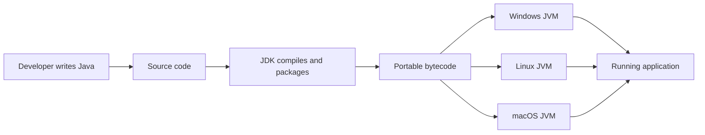

```java
public class Welcome {
    public static void main(String[] args) {
        String learner = args.length == 0 ? "Java learner" : args[0];
        System.out.println("Welcome, " + learner);
    }
}
```

**Output without arguments:** `Welcome, Java learner`

**Line-by-line explanation:** `public class Welcome` declares a type visible to the launcher. `main` is the conventional entry point. `String[] args` carries command-line values. The conditional expression chooses a default name, and `println` writes one line to standard output.

**Why Java exists:** Native languages offered speed but required platform-specific builds and manual memory care; many dynamic environments traded away static guarantees. Java chose a portable managed runtime with static typing and runtime optimization. The tradeoffs include JVM startup/warmup, garbage-collection behavior, and less direct control over memory layout than systems languages.

**Beginner mistakes:** Java is case-sensitive; the public class and source filename convention must match; execution begins at a valid `main`; Java and JavaScript are unrelated languages despite the names.

**Interview check:** Is Java purely object-oriented? No. It has primitive types and static members, among other pragmatic features.

**Summary:** Java source becomes portable bytecode, and a platform-specific JVM provides execution, memory management, and runtime optimization.

## History

| Milestone | Significance |
|---|---|
| 1991 | James Gosling's Green Project begins at Sun Microsystems; the language is initially called Oak. |
| 1995 | Java 1.0 is announced with the "write once, run anywhere" model. |
| 1998 | Java 2 introduces the Collections Framework and separates J2SE, J2EE, and J2ME. |
| 2004 | Java 5 adds generics, annotations, enums, enhanced `for`, and concurrency utilities. |
| 2010 | Oracle acquires Sun Microsystems. |
| 2014 | Java 8 adds lambdas, streams, default methods, and the modern date/time API. |
| 2017 | Java 9 introduces modules and a six-month release cadence. |
| Today | OpenJDK is the reference implementation; long-term-support releases provide stable upgrade targets. |

### Java Example

```java
public class HelloJava {
    public static void main(String[] args) {
        System.out.println("Portable bytecode, platform-specific JVM");
    }
}
```

**Real-world example:** The same application JAR can run on Windows or Linux when each host provides a compatible JVM.

> **Interview Tip:** Java is not purely compiled or purely interpreted. `javac` compiles source to bytecode; the JVM interprets and JIT-compiles bytecode at runtime.

**Interview question:** Why is Java platform independent?

**Expected answer:** Java source compiles to architecture-neutral bytecode. A platform-specific JVM executes that bytecode, so the application is portable while the JVM itself is not.

**Common mistakes**

- Saying Java source runs directly on every operating system.
- Treating Java and JavaScript as related runtime platforms.

**Best practices**

- Compile and test with the JDK version targeted by the deployment runtime.
- Prefer an LTS release for long-lived production systems unless newer features justify a shorter upgrade cycle.

## Features of Java

| Feature | What it provides | Limitation or cost |
|---|---|---|
| Platform portability | One bytecode artifact can target compatible JVMs | Native integrations remain platform-specific |
| Static typing | Compile-time contracts, refactoring, IDE support | More explicit type design |
| Object-oriented model | Encapsulation, interfaces, polymorphism | Poor modeling can create deep class hierarchies |
| Automatic memory management | Reclaims unreachable objects | GC timing and retention still require engineering |
| Managed safety | Bytecode verification, bounds checks, no ordinary pointer arithmetic | Some low-level control is intentionally unavailable |
| Concurrency libraries | Threads, executors, locks, atomics, futures, virtual threads | Data races and deadlocks remain possible |
| Rich standard library | Collections, I/O, networking, time, security | APIs vary by Java release |
| Runtime optimization | Profiling and JIT compilation optimize hot paths | Warmup affects short-lived programs and benchmarks |
| Backward compatibility | Mature ecosystem and long-lived applications | Old APIs and compatibility constraints accumulate |

**Real-world example:** A payment service is compiled in CI, tested once against a pinned JDK, and deployed as the same JAR to Linux hosts. The JVM optimizes frequently used validation and routing paths while GC manages request objects.

**When Java is a strong choice:** Large maintainable services, high-throughput backends, mature library ecosystems, and teams valuing static contracts and diagnostics. **When it may not be:** tiny scripts where startup and distribution dominate, strict hard real-time control, or highly constrained devices without an appropriate JVM.

**Interview checks:** Explain "write once, run anywhere" without claiming every native dependency is portable. Compare compile-time type safety with runtime verification. Explain why managed memory does not remove the need to understand allocation and retention.

## JVM (Java Virtual Machine)

The JVM is an abstract execution machine defined by a specification. Implementations such as HotSpot load, verify, and execute bytecode while managing memory, threads, security boundaries, and native calls.

### JVM Architecture

This diagram recreates the component architecture from the reference images.

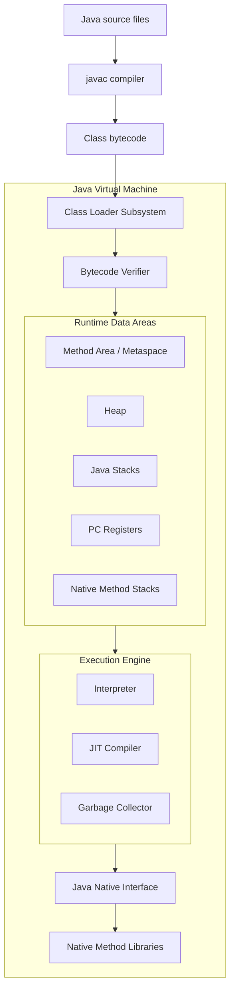

| Component | Responsibility | Scope |
|---|---|---|
| Class loader | Locates and defines classes | JVM process |
| Verifier | Rejects structurally invalid or unsafe bytecode | Class-loading pipeline |
| Runtime data areas | Store objects, class metadata, frames, and instruction positions | Shared and per-thread |
| Interpreter | Executes bytecode instruction by instruction | Runtime |
| JIT compiler | Compiles frequently executed methods to native code | Runtime optimization |
| Garbage collector | Reclaims unreachable heap objects | Runtime memory |
| JNI | Bridges Java and native code | Interoperability boundary |

### Execution Engine Sequence

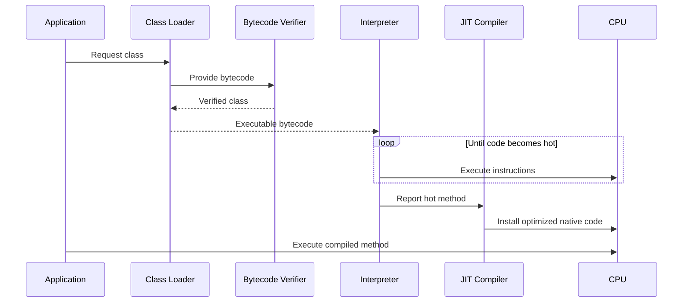

### Java Example

```java
public class JitCandidate {
    static long sum(int limit) {
        long result = 0;
        for (int number = 0; number < limit; number++) {
            result += number;
        }
        return result;
    }

    public static void main(String[] args) {
        for (int run = 0; run < 20_000; run++) {
            sum(10_000); // Repetition can make this method a JIT candidate.
        }
    }
}
```

**Real-world example:** A service starts with interpreted code, then becomes faster as HotSpot profiles and compiles frequently used request paths.

**Interview question:** What is the difference between the interpreter and JIT compiler?

**Expected answer:** The interpreter starts quickly and executes bytecode one instruction at a time. The JIT uses runtime profiling to compile hot code into optimized native instructions, trading compilation cost for faster repeated execution.

**Common mistakes**

- Assuming every method is compiled immediately.
- Calling the JVM an operating system process without distinguishing the specification from its implementations.

**Best practices**

- Measure warmed-up code with a harness such as JMH rather than timing one invocation.
- Diagnose JVM behavior with supported observability tools before changing flags.

## JDK vs JRE vs JVM

The reference images show these as nested layers: the JDK contains development tools and a runtime; the runtime contains libraries and the JVM.

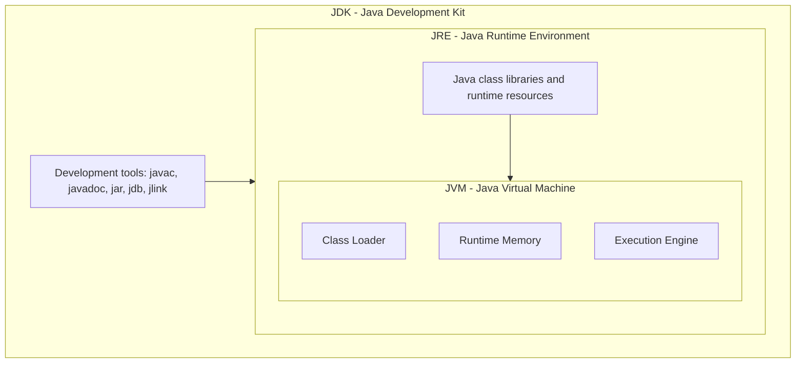

| Layer | Contains | Primary user |
|---|---|---|
| JVM | Class loading, runtime memory, execution engine, GC, JNI | Running program |
| JRE | JVM plus runtime libraries and resources | Application operator |
| JDK | Runtime plus compiler, debugger, packaging, and diagnostic tools | Developer |

> **Note:** Since Java 9, vendors generally distribute JDKs and applications may create custom runtime images with `jlink`; a separate public JRE download is no longer the universal deployment model.

### Java Example

```bash
javac HelloJava.java
java HelloJava
javadoc HelloJava.java
```

**Real-world example:** CI uses the JDK to compile and test; a production container may use a reduced runtime image containing only required modules.

**Interview question:** Can a JVM compile Java source code?

**Expected answer:** Source compilation is normally performed by the JDK's `javac`. The JVM consumes bytecode and may JIT-compile it to native code during execution.

**Common mistakes**

- Saying JRE and JVM are identical.
- Assuming `javac` is part of the JVM.

**Best practice:** Keep build and runtime Java versions compatible, and pin them in CI and deployment configuration.

## Compilation and Execution

### Compilation Process

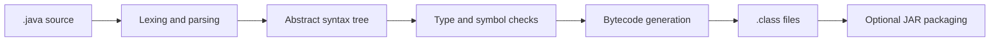

`javac` checks syntax and static types, resolves symbols, and emits one or more `.class` files. Inner, nested, record, and anonymous classes may produce additional class files.

### Execution Process

```mermaid
flowchart LR
    COMMAND[java command] --> START[Create JVM process]
    START --> LOAD[Load main class]
    LOAD --> LINK[Verify, prepare, resolve]
    LINK --> INIT[Initialize class]
    INIT --> MAIN[Invoke main method]
    MAIN --> PROFILE[Interpret and profile]
    PROFILE --> JIT[JIT-compile hot code]
    JIT --> NATIVE[Execute native instructions]
```

### Java Example

```java
public class OrderTotal {
    static int total(int price, int quantity) {
        return Math.multiplyExact(price, quantity);
    }

    public static void main(String[] args) {
        System.out.println(total(250, 4));
    }
}
```

```bash
javac OrderTotal.java
java OrderTotal
```

**Real-world example:** A Maven or Gradle build compiles many source sets, packages bytecode and resources into a JAR, and launches its entry point with `java -jar`.

**Interview question:** What happens from `java OrderTotal` to the first printed line?

**Expected answer:** The launcher creates the JVM, the class loader loads `OrderTotal`, linking verifies and prepares it, initialization runs static initialization, and the execution engine invokes `main` and executes its bytecode.

**Common mistakes**

- Confusing compile-time errors with runtime exceptions.
- Believing a JAR contains native machine code by default.

**Best practices**

- Treat compiler warnings as actionable and use reproducible build tooling.
- Compile with an explicit release target when distributing libraries across JDK versions.

## Bytecode and JIT Compilation

Bytecode is the JVM instruction set stored in class files. It is higher-level than one CPU's machine code and includes symbolic references, method descriptors, fields, constants, stack-oriented instructions, and metadata. Inspect it with `javap -c -v ClassName`.

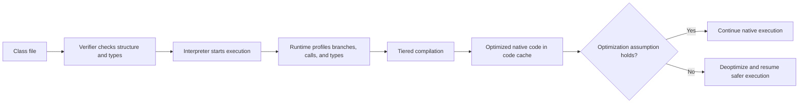

For `int sum = left + right`, bytecode typically loads local slots, executes `iadd`, and stores or returns the result. The verifier checks that operand-stack types and control-flow merges are valid before execution.

HotSpot commonly uses tiered compilation: interpretation gathers information, earlier compiler tiers produce code quickly, and later optimization uses profile evidence. Optimizations can include inlining, dead-code elimination, loop optimization, escape analysis, scalar replacement, and lock elimination. If a speculative assumption becomes false, the JVM can deoptimize compiled code.

```java
public class BytecodeDemo {
    static int add(int left, int right) {
        return left + right;
    }

    public static void main(String[] args) {
        System.out.println(add(20, 22));
    }
}
```

**Output:** `42`

**Internal sequence:** `main` pushes constants and invokes `add`; `add` loads two integer locals, performs `iadd`, and returns with `ireturn`. Repeated calls may cause inlining, so optimized machine code might contain no physical call at all.

**Common mistakes:** Reading bytecode as final machine code; assuming a method is optimized identically on every run; timing one invocation; disabling JIT based on intuition; relying on implementation details as language guarantees.

**Performance tips:** Use JMH for microbenchmarks because it handles warmup and protects against dead-code elimination. Use JFR and compiler diagnostics to investigate real applications. Optimize source for clear semantics first so the JIT has analyzable code.

**Interview checks:** Compare bytecode, interpreted execution, and native compiled code. Explain profiling and deoptimization. Why can escape analysis make a logically allocated object disappear? Why is warmup relevant?

**Summary:** Bytecode provides portability and verification; runtime profiling lets the JIT specialize hot code for the actual workload while retaining a path back when assumptions fail.

## Memory Management

Java divides memory into shared areas and per-thread areas. Objects normally live on the heap; method frames and local variables live on each thread's Java stack; class metadata lives in Metaspace.

### Memory Layout

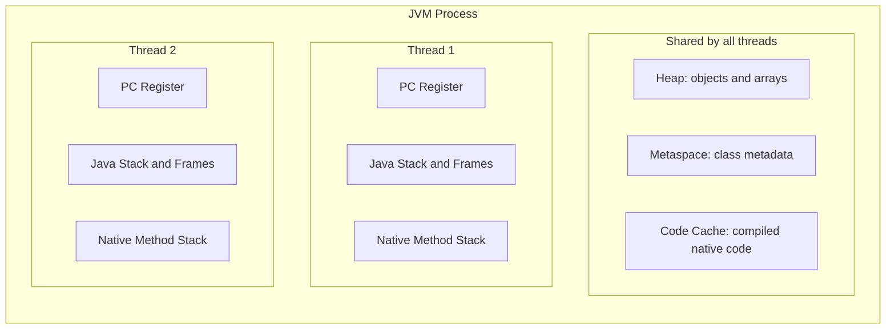

| Area | Shared? | Stores | Typical failure |
|---|---:|---|---|
| Heap | Yes | Objects and arrays | `OutOfMemoryError: Java heap space` |
| Java stack | No | Frames, locals, operand stacks, return data | `StackOverflowError` |
| Metaspace | Yes | Class metadata | `OutOfMemoryError: Metaspace` |
| PC register | No | Current bytecode instruction position | JVM-managed |
| Native method stack | No | Native call state | Implementation-dependent overflow |
| Code cache | Yes | JIT-compiled native code | Code cache exhaustion/warnings |

### Java Example

```java
public class MemoryExample {
    private final String orderId; // Object field belongs to a heap object.

    MemoryExample(String orderId) {
        this.orderId = orderId;
    }

    int length() {
        int result = orderId.length(); // Local variable belongs to this frame.
        return result;
    }
}
```

**Real-world example:** Every web request runs on a thread with its own stack, while request DTOs and cached domain objects are allocated on the shared heap.

**Interview question:** Are Java objects always allocated on the heap?

**Expected answer:** The Java language model exposes references without promising a physical location. Objects are logically heap objects, but a JIT may eliminate an allocation or scalar-replace a non-escaping object.

**Common mistakes**

- Claiming primitive values always live on the stack; fields are part of their containing object.
- Treating `System.gc()` as a command that guarantees collection.

**Best practices**

- Use heap dumps, allocation profiling, and GC logs to diagnose memory pressure.
- Bound caches, queues, and retained histories.

### Heap

The heap is the shared, garbage-collected area used for object and array storage. Many collectors organize it by object age, but exact regions vary by collector.

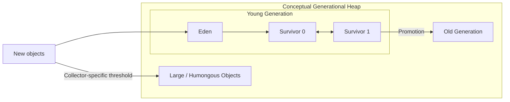

> **Note:** This is a conceptual generational view. G1 uses regions; ZGC and Shenandoah use different internal layouts and concurrent techniques.

### Java Example

```java
import java.util.ArrayList;
import java.util.List;

public class HeapExample {
    public static void main(String[] args) {
        List<byte[]> buffers = new ArrayList<>();
        buffers.add(new byte[1024 * 1024]);
        System.out.println(buffers.size());
    }
}
```

**Real-world example:** Short-lived request objects usually die young, while an application cache can retain objects long enough for promotion.

**Interview question:** Why do many collectors use generations?

**Expected answer:** Most objects die young. Grouping by age lets collectors reclaim short-lived objects frequently and cheaply while scanning long-lived objects less often.

**Common mistake:** Assuming `new` is inherently slow; JVM allocation is commonly a fast pointer bump in a thread-local allocation buffer.

**Best practice:** Reduce accidental retention before attempting to eliminate ordinary short-lived allocations.

### Stack

Each JVM thread owns a Java stack composed of frames. A method invocation creates a frame containing local variables, an operand stack, and method bookkeeping; return or exception unwinding removes it.

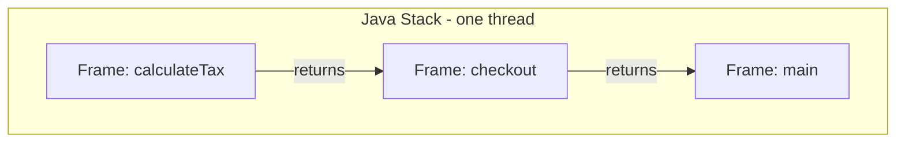

### Java Example

```java
public class StackExample {
    static int factorial(int number) {
        if (number <= 1) {
            return 1;
        }
        return number * factorial(number - 1);
    }
}
```

**Real-world example:** Deep recursion or circular method calls can exhaust a thread's finite stack even when heap space remains.

**Interview question:** Why is stack access thread-safe by default?

**Expected answer:** Each thread owns its stack, so another thread cannot directly access its frames. Referenced heap objects can still be shared and require synchronization.

**Common mistake:** Assuming a local reference makes the referenced object thread-confined.

**Best practice:** Prefer iterative algorithms when recursion depth depends on untrusted or very large input.

### Metaspace

Metaspace stores class metadata in native memory. It replaced PermGen in Java 8 and grows according to demand and configured limits.

### Java Example

```java
Class<?> type = Class.forName("java.util.ArrayList");
System.out.println(type.getDeclaredMethods().length);
```

**Real-world example:** Repeatedly creating class loaders during hot redeployment can leak loaders and all classes they define, causing Metaspace exhaustion.

**Interview question:** What is the difference between Metaspace and PermGen?

**Expected answer:** PermGen was a fixed JVM heap region used before Java 8. Metaspace uses native memory, grows dynamically by default, and can still be capped or exhausted.

**Common mistake:** Believing Metaspace cannot leak because it is native memory.

**Best practice:** Investigate class-loader retention when class counts keep increasing after redeployments.

## Garbage Collection

Garbage collection identifies objects that are not reachable from GC roots and reclaims their storage. It manages memory, not arbitrary external resources such as files or sockets.

### Reachability and Collection

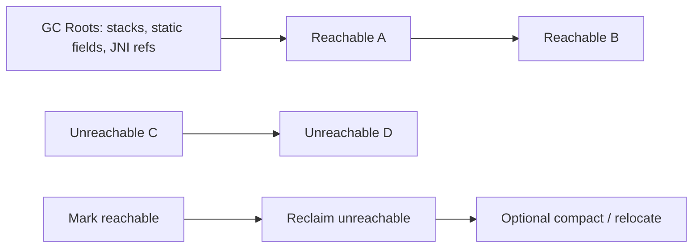

### Generational Collection Flow

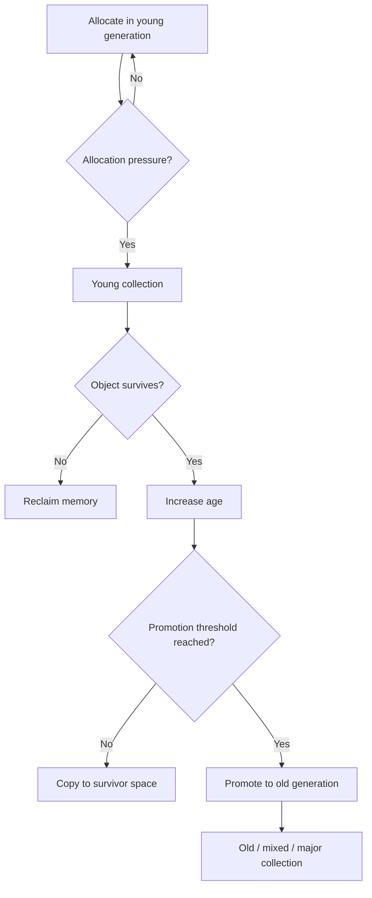

| Collector | General goal | Typical consideration |
|---|---|---|
| Serial | Simplicity and small heaps | Single GC worker |
| Parallel | Throughput | Stop-the-world parallel work |
| G1 | Balanced throughput and pause goals | Region-based; common server default |
| ZGC | Very low pauses on large heaps | Mostly concurrent; verify JDK/platform support |
| Shenandoah | Low pauses through concurrency | Distribution and version support vary |

### Java Example

```java
public final class ReportWriter implements AutoCloseable {
    @Override
    public void close() {
        System.out.println("Release file or network resource deterministically");
    }

    public static void main(String[] args) {
        try (ReportWriter writer = new ReportWriter()) {
            System.out.println("Write report");
        }
    }
}
```

**Real-world example:** A low-latency API may choose a concurrent collector and tune only after observing pause-time and allocation metrics under representative load.

**Interview question:** What are GC roots?

**Expected answer:** Starting points used for reachability analysis, including active stack references, static references from loaded classes, and certain JVM/JNI references.

**Common mistakes**

- Equating an unreachable object with immediate reclamation.
- Using finalizers or GC to release database connections.

**Best practices**

- Use try-with-resources for deterministic cleanup.
- Select a collector based on measured latency, throughput, heap size, and operational constraints.

## Class Loading

Class loading follows loading, linking, and initialization. Linking includes verification, preparation, and optional resolution.

### Class Loader Architecture

This parent-delegation structure recreates the class-loader hierarchy shown in the references.

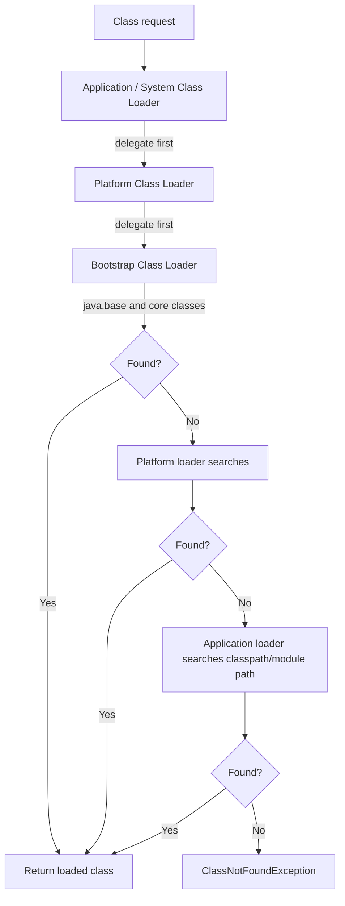

### Class Lifecycle

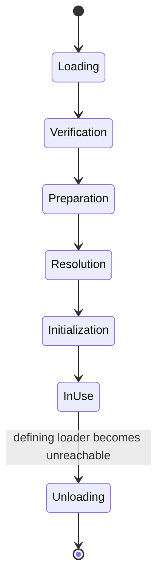

| Phase | Work performed |
|---|---|
| Loading | Find bytes and create a `Class` representation. |
| Verification | Validate bytecode structure and type safety. |
| Preparation | Allocate static storage and assign default values. |
| Resolution | Convert symbolic references to direct runtime references. |
| Initialization | Execute static field initializers and static blocks. |

### Java Example

```java
public class LoadingExample {
    static {
        System.out.println("Initialized once per defining class loader");
    }

    public static void main(String[] args) throws Exception {
        Class<?> type = Class.forName("LoadingExample");
        System.out.println(type.getClassLoader());
    }
}
```

**Real-world example:** Plugin systems use dedicated class loaders to discover implementations while isolating dependencies.

**Interview question:** Why does parent-first delegation matter?

**Expected answer:** It avoids duplicate definitions of core classes, improves consistency, and prevents application classes from casually replacing trusted platform classes.

**Common mistakes**

- Saying `ClassNotFoundException` and `NoClassDefFoundError` are identical.
- Assuming loading always initializes a class immediately.

**Best practices**

- Avoid custom class loaders unless isolation or dynamic loading is a real requirement.
- Close closeable loaders and release references during undeployment.

## Thread Lifecycle

A Java `Thread` moves through states exposed by `Thread.State`. `RUNNABLE` includes ready-to-run and running at the operating-system level.

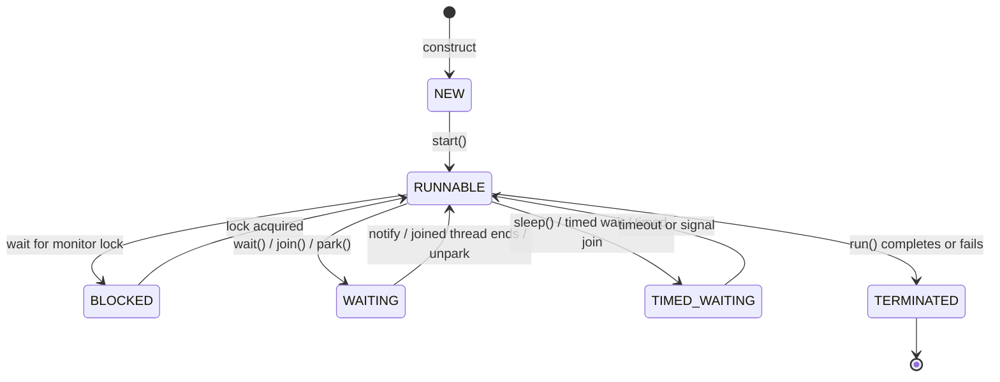

### Java Example

```java
public class ThreadStateExample {
    public static void main(String[] args) throws InterruptedException {
        Thread worker = new Thread(() -> System.out.println("Working"));
        System.out.println(worker.getState()); // NEW
        worker.start();
        worker.join();
        System.out.println(worker.getState()); // TERMINATED
    }
}
```

**Real-world example:** A server thread can be `WAITING` for work, `BLOCKED` on a contended monitor, or `RUNNABLE` while processing a request.

**Interview question:** What is the difference between `BLOCKED` and `WAITING`?

**Expected answer:** `BLOCKED` means waiting to acquire an intrinsic monitor. `WAITING` means waiting indefinitely for another action, such as notification, join completion, or unpark.

**Common mistakes**

- Calling `run()` directly and expecting a new thread.
- Swallowing `InterruptedException` without restoring interruption or ending the task.

**Best practices**

- Prefer executors or structured concurrency facilities appropriate to the target JDK over unmanaged thread creation.
- Minimize shared mutable state and keep critical sections short.

---

# Java Language Foundations

This section starts from first principles. A Java program is a collection of types. A type defines what data a value can hold and which operations are legal. Statements describe actions, expressions produce values, and methods group reusable behavior. Java checks most type rules before execution, which catches many mistakes early.

## Variables and Data Types

### Introduction and Motivation

A variable is a named storage location whose declared type limits the values it can hold. Java uses explicit, static typing so tools and the compiler can detect incompatible operations before code reaches production. This makes large systems easier to navigate and refactor, at the cost of more declarations than dynamically typed languages.

Java has eight primitive types and reference types. A primitive variable directly represents a simple value. A reference variable identifies an object or array, or contains `null`.

| Category | Type | Typical size | Default field value | Example |
|---|---|---:|---|---|
| Integer | `byte` | 8 bits | `0` | `byte level = 3;` |
| Integer | `short` | 16 bits | `0` | `short year = 2026;` |
| Integer | `int` | 32 bits | `0` | `int quantity = 4;` |
| Integer | `long` | 64 bits | `0L` | `long views = 9_000_000L;` |
| Floating point | `float` | 32 bits | `0.0f` | `float ratio = 0.5f;` |
| Floating point | `double` | 64 bits | `0.0d` | `double score = 9.5;` |
| Character | `char` | 16-bit UTF-16 unit | `\u0000` | `char grade = 'A';` |
| Logical | `boolean` | JVM-dependent storage | `false` | `boolean active = true;` |

> **Important:** Local variables have no automatic default and must be definitely assigned before use. Fields receive defaults during object preparation.

### Scope, Lifetime, and Inference

- A local variable exists within its block and usually contributes to a stack frame or register-level optimized state.
- An instance field belongs to an object; a static field belongs to a class.
- `final` prevents reassignment after initialization. It does not automatically make the referenced object immutable.
- `var` (Java 10) asks the compiler to infer a local variable's static type from its initializer. It is not dynamic typing and cannot be used for fields or method parameters.

```java
public class VariableDemo {
    private static int nextOrderNumber = 1;
    private final String storeName;

    VariableDemo(String storeName) {
        this.storeName = storeName;
    }

    public static void main(String[] args) {
        var quantity = 3;             // Inferred as int.
        double unitPrice = 49.50;
        double total = quantity * unitPrice;
        System.out.printf("Order %d at %s: %.2f%n",
                nextOrderNumber++, "Central Store", total);
    }
}
```

**Output**

```text
Order 1 at Central Store: 148.50
```

**Line-by-line explanation:** `quantity` is an `int` inferred at compile time. Binary numeric promotion converts it to `double` for multiplication. `total` stores the result. `printf` formats the integer, string, and decimal values. The postfix increment returns the old order number and then increments the static field.

**Internal working:** `javac` records local-variable and field descriptors in bytecode. A method frame holds local slots and an operand stack, although the JIT may keep values in CPU registers. An instance contains its fields plus implementation-specific object metadata. Static data is associated with the loaded class.

**Real-world example:** Use `BigDecimal`, not `double`, for banking amounts because binary floating point cannot exactly represent many decimal fractions.

**Common mistakes**

- Comparing floating-point results with exact `==` when rounding error matters.
- Using `int` for values that can exceed about 2.1 billion.
- Assuming `final List<String>` makes the list contents immutable.
- Unboxing a `null` wrapper, causing `NullPointerException`.

**Performance tips:** Prefer primitives in numeric hot paths to avoid allocation and unboxing. Choose a type for domain correctness before saving a few bytes. Do not use `var` when it hides an important or surprising type.

**Interview checks**

- **Beginner:** What is the difference between a primitive and a reference?
- **Intermediate:** Why can `0.1 + 0.2` differ from `0.3` with `double`?
- **Advanced:** Can escape analysis remove an object allocation?
- **Scenario:** Which type should hold a payment amount and why?
- **Output-based:** What prints for `int value = 5; System.out.println(value++ + ++value);`? It prints `12`: the operands are evaluated left to right as `5 + 7`.

**Summary:** Types define legal values and operations; scope controls visibility, lifetime controls retention, and `final` controls reassignment. Continue with operators, which combine values into expressions.

## Operators and Control Statements

### Why They Exist

Operators create expressions; control statements select and repeat work. Without them, a program could only execute a fixed straight-line sequence. Java favors explicit control flow because it is predictable, optimizable, and easy for tools to analyze.

| Group | Operators / statements | Purpose |
|---|---|---|
| Arithmetic | `+ - * / %` | Numeric calculation; `+` also concatenates strings |
| Comparison | `== != < <= > >=` | Produce a boolean result |
| Logical | `&& || !` | Combine boolean conditions with short-circuiting |
| Bitwise | `& | ^ ~ << >> >>>` | Manipulate integer bits |
| Assignment | `= += -= *= /=` | Store a value |
| Selection | `if`, `switch`, ternary `?:` | Choose a path or value |
| Iteration | `for`, enhanced `for`, `while`, `do-while` | Repeat work |
| Transfer | `break`, `continue`, `return`, `throw` | Change normal flow |

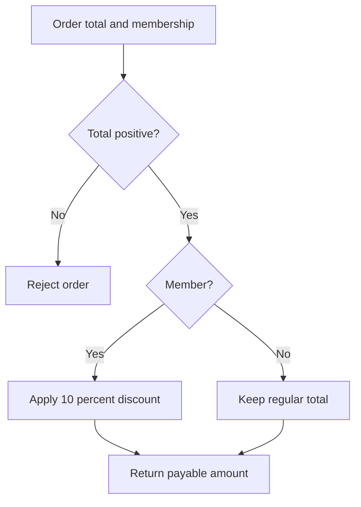

```java
public class CheckoutDecision {
    static int payable(int total, boolean member) {
        if (total <= 0) {
            throw new IllegalArgumentException("Total must be positive");
        }
        return member ? total * 90 / 100 : total;
    }

    public static void main(String[] args) {
        for (int total : new int[] {100, 250}) {
            System.out.println(payable(total, true));
        }
    }
}
```

**Output**

```text
90
225
```

**Explanation:** The guard clause rejects invalid state. The conditional expression selects a value. Enhanced `for` visits each array element without exposing an index.

**Internal working:** Branches compile to conditional jump bytecodes. `tableswitch` or `lookupswitch` may implement a `switch`, depending on key density. Short-circuit `&&` and `||` skip the right operand when the left operand decides the result.

**Common mistakes:** Integer division truncates (`5 / 2` is `2`); `=` assigns while `==` compares; a missing `break` in a statement-style `switch` falls through; changing a loop condition incorrectly can create an infinite loop.

**Performance tips:** Choose clarity first. Avoid repeated invariant work inside loops. Use a `Set` for repeated membership checks rather than a nested scan when data volume is significant.

**Interview checks:** Explain short-circuiting; compare `while` and `do-while`; predict `false && expensiveCall()`; explain why modern switch expressions avoid accidental fall-through.

**Summary:** Expressions calculate values and control statements direct execution. Guard clauses and small loops are usually easier to reason about than deeply nested branches.

## Methods and Method Invocation

### Introduction and Theory

A method names a reusable operation. Its signature consists of the name and parameter types; the return type is not part of overload resolution. Instance methods participate in runtime polymorphism, while static methods belong to the declaring type and are selected statically.

Java is always pass-by-value. Passing an object copies the reference value, so both variables can identify the same mutable object, but the callee cannot replace the caller's variable.

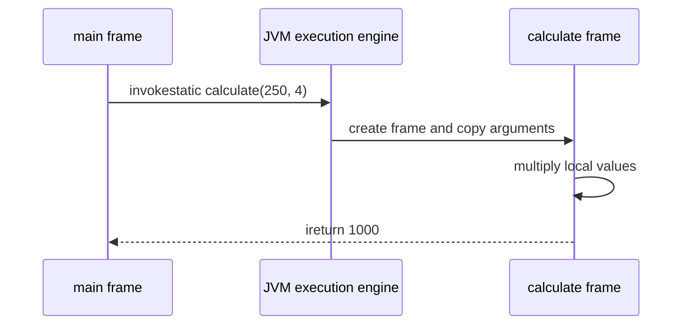

```java
public class MethodDemo {
    static int total(int price, int quantity) {
        return Math.multiplyExact(price, quantity);
    }

    static int total(int price, int quantity, int discount) {
        return total(price, quantity) - discount;
    }

    public static void main(String[] args) {
        System.out.println(total(250, 4));
        System.out.println(total(250, 4, 100));
    }
}
```

**Output**

```text
1000
900
```

**Line-by-line explanation:** The first overload performs checked integer multiplication. The second delegates to it and subtracts a discount. At each call the compiler selects an overload from declared argument types.

**Internal working:** Invocation uses bytecodes such as `invokestatic`, `invokevirtual`, `invokeinterface`, `invokespecial`, and `invokedynamic`. Each non-inlined call creates a conceptual frame with local variables and an operand stack. Hot small methods are often inlined by the JIT, enabling further optimization.

**Real-world example:** A pricing service exposes a small method that validates inputs and delegates tax and discount policies to collaborators.

**Common mistakes:** Confusing overloading with overriding; expecting object arguments to be passed by reference; creating methods with many unrelated parameters; using recursion without a guaranteed base case.

**Performance tips:** Do not avoid small methods out of fear of call overhead; the JIT can inline them. Avoid allocation-heavy varargs in measured hot paths. Prefer clear APIs before micro-optimizing.

**Interview checks:** Can return type alone overload a method? No. Are private methods overridden? No. What is dynamic dispatch? Runtime selection of an overridden instance method based on the actual object.

**Summary:** Methods define contracts and reusable behavior. Java copies every argument value, and the invocation bytecode depends on whether a target is static, special, virtual, interface-based, or dynamic.

## Arrays

An array is a fixed-length, indexed object that stores values of one component type. Arrays provide constant-time indexed access and compact storage, but insertion in the middle requires shifting values and their length cannot change.

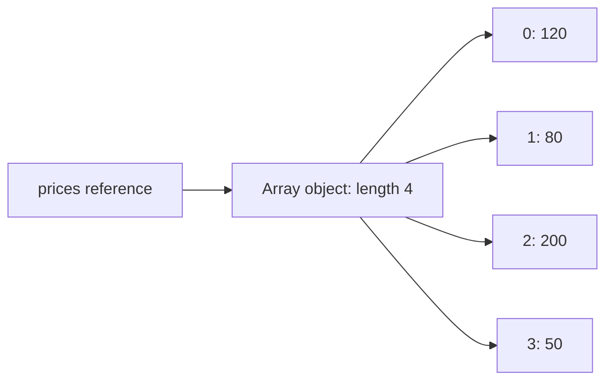

```java
import java.util.Arrays;

public class ArrayDemo {
    public static void main(String[] args) {
        int[] prices = {120, 80, 200, 50};
        int[] sorted = Arrays.copyOf(prices, prices.length);
        Arrays.sort(sorted);
        System.out.println(Arrays.toString(sorted));
        System.out.println(Arrays.binarySearch(sorted, 120));
    }
}
```

**Output**

```text
[50, 80, 120, 200]
2
```

**Explanation:** `copyOf` prevents sorting from mutating the original. `sort` orders the copy. `binarySearch` requires sorted input and returns the matching index.

**Internal working:** `newarray`, `anewarray`, and `multianewarray` allocate array objects. Every indexed access includes a runtime bounds check unless the JIT proves it redundant. Primitive arrays store primitive values; object arrays store references and are covariant, which can produce `ArrayStoreException` at runtime.

**Common mistakes:** Using `array.length()` instead of the field `array.length`; shallow-copying a nested array and expecting deep independence; passing unsorted input to `binarySearch`; off-by-one conditions using `<= length`.

**Performance tips:** Arrays are excellent for fixed-size, primitive-heavy data and locality-sensitive algorithms. Use `ArrayList` when size changes. Use `System.arraycopy` or library methods for bulk movement.

**Interview checks:** Why are arrays covariant but generics invariant? What is the complexity of indexed access, scan, and insertion? Respectively $O(1)$, $O(n)$, and generally $O(n)$.

**Summary:** Arrays trade resizing flexibility for direct indexing, predictable layout, and low overhead.

## Strings

### Introduction and Internal Working

`String` represents an immutable sequence of UTF-16 code units. Immutability enables safe sharing, stable hash codes, pooling, secure API use, and straightforward concurrency. Operations that appear to modify a string create a new value.

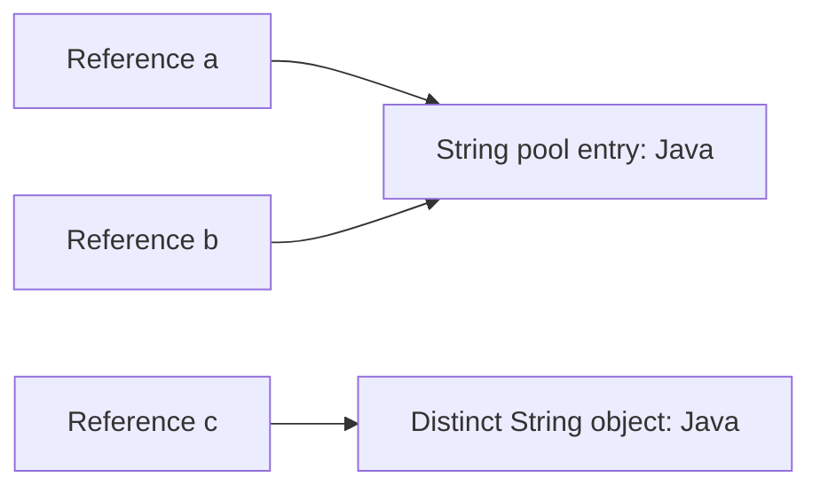

String literals are interned in the pool. `new String("Java")` deliberately creates a distinct object. `equals` compares character content; `==` compares reference identity. The hash code is computed from content and may be cached because content never changes. Since Java 9, compact strings may use a `byte[]` plus an encoding marker when possible; this is an implementation detail, not an API guarantee.

```java
public class StringDemo {
    public static void main(String[] args) {
        String first = "Java";
        String second = "Ja" + "va";
        String third = new String("Java");

        System.out.println(first == second);
        System.out.println(first == third);
        System.out.println(first.equals(third));

        StringBuilder receipt = new StringBuilder();
        receipt.append("Order").append('-').append(42);
        System.out.println(receipt);
    }
}
```

**Output**

```text
true
false
true
Order-42
```

**Line-by-line explanation:** Compile-time constant concatenation is folded and pooled, so `first` and `second` share a reference. Explicit construction produces `third`. Content equality remains true. `StringBuilder` efficiently accumulates mutable text before one final conversion.

**Real-world example:** Immutable request IDs can be shared among logs and maps. A report generator uses `StringBuilder` for repeated concatenation in a loop.

**Common mistakes:** Comparing content with `==`; concatenating repeatedly in a large loop; assuming `length()` counts user-perceived characters; storing passwords indefinitely in immutable strings.

**Performance tips:** Use `StringBuilder` for iterative construction, but ordinary `+` is clear and efficient for a few operands. Avoid unnecessary `new String`. Be Unicode-aware: code points and grapheme clusters can differ from UTF-16 units.

**Interview checks:** Why is `String` immutable? Where is the pool? What is the `equals`/`hashCode` contract? Why is `StringBuilder` faster than repeated concatenation in loops?

**Summary:** Strings are immutable value objects. Compare content with `equals`, understand pooling separately from equality, and use a builder for substantial incremental construction.

## Wrapper Classes

Wrappers such as `Integer`, `Long`, `Double`, `Character`, and `Boolean` represent primitive values as objects. They exist because generics and collections require reference types and because object APIs need parsing, comparison, nullable state, and constants.

```java
import java.util.List;

public class WrapperDemo {
    public static void main(String[] args) {
        Integer boxed = 42;              // Autoboxing: Integer.valueOf(42)
        int unboxed = boxed;              // Auto-unboxing: boxed.intValue()
        List<Integer> scores = List.of(10, 20, 30);
        int total = scores.stream().mapToInt(Integer::intValue).sum();
        System.out.println(unboxed + total);
    }
}
```

**Output:** `102`

**Internal working:** The compiler inserts boxing and unboxing calls. `Integer.valueOf` commonly reuses cached objects for values from `-128` through `127`; identity outside that range must never be relied on.

**Common mistakes:** Using `==` for wrapper value comparison; unboxing `null`; creating wrappers explicitly with constructors; using boxed values unnecessarily in tight numeric loops.

**Performance tips:** Prefer primitives unless nullability, generics, or object behavior is required. Use primitive streams such as `IntStream` to reduce boxing.

**Interview checks:** Why can `Integer.valueOf(100) == Integer.valueOf(100)` be true while the same expression with `1000` may be false? Explain caching and why `equals` is still required.

**Summary:** Wrappers bridge primitives and object-based APIs, but add identity, nullability, and allocation concerns.

---

# Object-Oriented Programming

OOP models behavior around objects with state, responsibilities, and contracts. The four common pillars are encapsulation, inheritance, polymorphism, and abstraction.

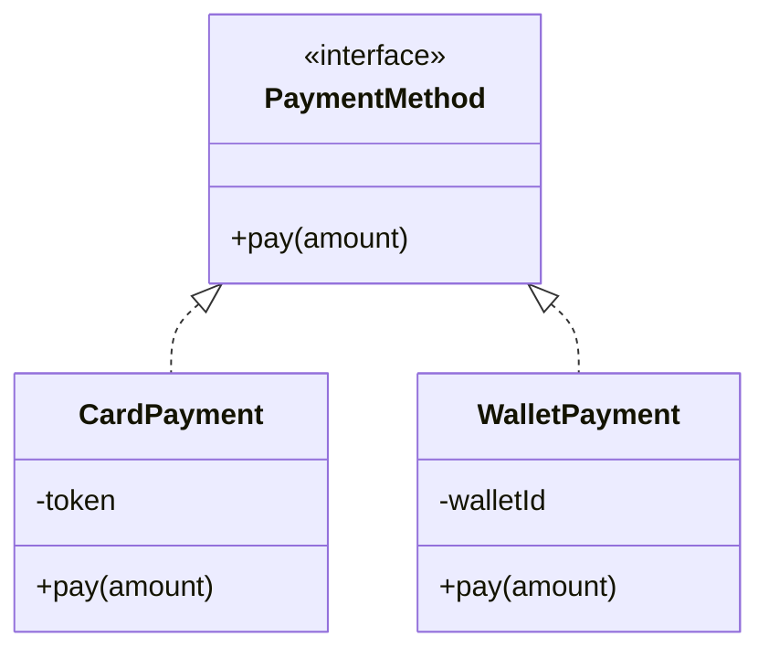

## Classes, Objects, and Object Creation

A class is a blueprint that declares state and behavior. An object is a runtime instance with identity, field values, and access to the class's methods. Classes let a program model domain concepts such as `Patient`, `Train`, `Order`, or `Payment` rather than manipulating unrelated variables.

```mermaid
sequenceDiagram
    participant Code as Application code
    participant JVM as JVM
    participant Heap as Heap
    participant Init as Constructor
    Code->>JVM: new Order("ORD-42")
    JVM->>Heap: allocate and zero object memory
    Heap-->>JVM: object reference
    JVM->>Init: invokespecial Order.<init>
    Init->>Init: initialize fields and validate
    Init-->>Code: initialized reference
```

```java
public final class Order {
    private final String id;
    private boolean paid;

    public Order(String id) {
        if (id == null || id.isBlank()) {
            throw new IllegalArgumentException("Order id is required");
        }
        this.id = id;
    }

    public void markPaid() {
        paid = true;
    }

    public String status() {
        return id + ": " + (paid ? "PAID" : "PENDING");
    }

    public static void main(String[] args) {
        Order order = new Order("ORD-42");
        order.markPaid();
        System.out.println(order.status());
    }
}
```

**Output:** `ORD-42: PAID`

**Explanation:** The constructor establishes a valid identity. State remains private. `markPaid` names a domain transition instead of exposing a generic setter. `status` derives a readable result.

**Internal working:** `new` allocates memory and pushes a reference. `dup` preserves it while `invokespecial` calls `<init>`. Memory is zero-initialized before field initializers and constructor statements run. A constructor cannot return a different object.

**Common mistakes:** Treating classes as bags of public fields; allowing partially valid objects; calling overridable methods from constructors; confusing an object reference with the object itself.

**Performance tip:** Object creation is usually cheap. Focus on lifetimes, retention, and measured allocation rates rather than replacing clear domain objects with primitive arrays prematurely.

**Interview checks:** What are identity, state, and behavior? What happens during `new`? Can a constructor be inherited or overridden? No; constructors initialize their declaring type and may be overloaded.

## Encapsulation

Encapsulation protects invariants by hiding representation and exposing controlled operations.

```java
import java.math.BigDecimal;

public final class BankAccount {
    private BigDecimal balance = BigDecimal.ZERO;

    public BigDecimal balance() {
        return balance;
    }

    public void deposit(BigDecimal amount) {
        if (amount.signum() <= 0) {
            throw new IllegalArgumentException("Amount must be positive");
        }
        balance = balance.add(amount);
    }
}
```

**Real-world example:** An account exposes `deposit` rather than a public balance field, so invalid transitions cannot bypass business rules.

**Interview question:** Is encapsulation the same as making fields private?

**Expected answer:** Private fields are a mechanism. Encapsulation is the broader design of protecting invariants and hiding implementation details behind a cohesive API.

**Common mistake:** Generating setters for every field and calling the class encapsulated.

**Best practice:** Expose behavior-oriented methods and return immutable views of internal collections.

## Inheritance

Inheritance creates an "is-a" relationship in which a subtype receives accessible behavior and can satisfy its parent's contract.

```java
abstract class Employee {
    abstract int monthlyPay();
}

final class SalariedEmployee extends Employee {
    private final int salary;

    SalariedEmployee(int salary) {
        this.salary = salary;
    }

    @Override
    int monthlyPay() {
        return salary;
    }
}
```

**Real-world example:** Framework base classes can define stable lifecycle hooks that specialized components implement.

**Interview question:** When should composition be preferred over inheritance?

**Expected answer:** Prefer composition when reuse does not represent a true substitutable "is-a" relationship, or when behavior must vary independently at runtime.

**Common mistake:** Extending a class only to reuse utility methods.

**Best practice:** Keep inheritance hierarchies shallow and preserve parent contracts.

## Polymorphism

Polymorphism lets client code invoke one contract while runtime dispatch selects the implementation.

```java
interface PriceRule {
    int apply(int price);
}

final class RegularPrice implements PriceRule {
    public int apply(int price) {
        return price;
    }
}

final class DiscountPrice implements PriceRule {
    public int apply(int price) {
        return price * 90 / 100;
    }
}
```

**Real-world example:** A checkout workflow applies any configured `PriceRule` without conditionals for every campaign type.

**Interview question:** What is compile-time versus runtime polymorphism?

**Expected answer:** Overloading is resolved from declared types and arguments at compile time. Overridden instance methods use dynamic dispatch based on the runtime object.

**Common mistake:** Assuming fields and static methods use runtime overriding like instance methods.

**Best practice:** Program to a stable contract and keep implementations behaviorally substitutable.

## Abstraction

Abstraction exposes essential capabilities while hiding implementation details. Java supports it through interfaces, abstract classes, and ordinary APIs.

```java
interface MessageSender {
    void send(String destination, String body);
}

final class EmailSender implements MessageSender {
    public void send(String destination, String body) {
        System.out.printf("Email to %s: %s%n", destination, body);
    }
}
```

**Real-world example:** Business logic depends on `MessageSender`, not SMTP connection details.

**Interview question:** Interface or abstract class?

**Expected answer:** Use an interface for a capability or role that unrelated types can implement. Use an abstract class when closely related types need shared state, protected implementation, or a controlled template.

**Common mistake:** Creating interfaces with only one implementation and no meaningful boundary or variation.

**Best practice:** Make abstractions small, cohesive, and owned by the code that consumes them.

## Interfaces and Abstract Classes

Both define abstractions, but they solve different ownership problems.

| Concern | Interface | Abstract class |
|---|---|---|
| Main purpose | Capability or role | Shared base for closely related types |
| Multiple inheritance | A class can implement many | A class can extend one class |
| Instance state | No ordinary instance fields | Can own instance fields |
| Constructors | None | Supported |
| Methods | Abstract, default, static, private helpers | Abstract and concrete methods |
| Compatibility | Default methods can evolve contracts carefully | Protected implementation can evolve hierarchy |

```java
interface Trackable {
    String currentLocation();

    default boolean isLocationKnown() {
        return !currentLocation().isBlank();
    }
}

abstract class DeliveryVehicle implements Trackable {
    private final String registration;

    protected DeliveryVehicle(String registration) {
        this.registration = registration;
    }

    protected String registration() {
        return registration;
    }
}
```

**Real-world example:** A food-delivery rider and a railway carriage can both be `Trackable` without sharing an implementation hierarchy. Closely related vehicle types can share validated registration state in an abstract base class.

**Common mistake:** Using an abstract class merely to avoid duplicating two utility methods. Composition or a helper often communicates intent better.

**Interview check:** Java avoids multiple class inheritance because duplicated state and conflicting base behavior create ambiguity. Multiple interface inheritance is safer because contracts do not carry ordinary instance state, though default-method conflicts must be resolved explicitly.

## Object Relationships

Real models are built from relationships, not only inheritance.

```mermaid
classDiagram
    class Hospital
    class Department
    class Doctor
    class Patient
    class PaymentGateway {
        <<interface>>
    }
    Hospital *-- Department : composition
    Department o-- Doctor : aggregation
    Doctor --> Patient : association
    Doctor ..> PaymentGateway : dependency
```

| Relationship | Meaning | Lifetime implication | Example |
|---|---|---|---|
| Association | Objects know or communicate with each other | Independent | Doctor treats patient |
| Aggregation | Whole groups independently living parts | Parts can outlive whole | Department has doctors |
| Composition | Whole strongly owns parts | Part normally dies with whole | Order owns order lines |
| Dependency | Temporary use through parameter/local | No ownership | Service calls gateway |
| Inheritance | Subtype is substitutable for parent | Type-level relationship | Card payment is a payment method |

```java
import java.util.ArrayList;
import java.util.List;

final class OrderLine {
    private final String product;
    private final int quantity;

    OrderLine(String product, int quantity) {
        this.product = product;
        this.quantity = quantity;
    }
}

final class ShoppingOrder {
    private final List<OrderLine> lines = new ArrayList<>();

    void addLine(String product, int quantity) {
        lines.add(new OrderLine(product, quantity));
    }
}
```

**Design guidance:** Prefer composition when behavior must vary independently or reuse does not represent a true "is-a" relationship. Use inheritance only when every subtype preserves the base contract.

**Summary:** OOP is responsibility-oriented modeling, not simply creating classes. Protect invariants, depend on small abstractions, preserve subtype contracts, and choose relationships based on ownership and lifetime.

---

# Constructors, Packages, and Access

## Constructors

Constructors establish an object's initial invariant. Their name matches the class and they have no return type. If no constructor is declared, the compiler supplies a default no-argument constructor only when the superclass construction is valid.

```mermaid
flowchart TD
    NEW[new PremiumAccount arguments] --> SUPER[Invoke Account constructor first]
    SUPER --> BASE_FIELDS[Run Account field initializers and body]
    BASE_FIELDS --> CHILD_FIELDS[Run PremiumAccount field initializers]
    CHILD_FIELDS --> CHILD_BODY[Run PremiumAccount constructor body]
    CHILD_BODY --> READY[Fully initialized object]
```

```java
public final class Patient {
    private final String id;
    private final String name;

    public Patient(String id, String name) {
        this.id = requireText(id, "id");
        this.name = requireText(name, "name");
    }

    public Patient(String id) {
        this(id, "Unknown");
    }

    private static String requireText(String value, String field) {
        if (value == null || value.isBlank()) {
            throw new IllegalArgumentException(field + " is required");
        }
        return value;
    }
}
```

**Explanation:** The convenience constructor delegates with `this(...)`, which must be its first statement. Validation is centralized. Every successful construction produces a valid patient.

**Internal working:** A subclass constructor starts with `this(...)` or `super(...)`; if neither is written, the compiler inserts `super()`. Dynamic dispatch from a constructor is dangerous because subclass fields may not yet be initialized.

**Common mistakes:** Writing a return type and accidentally declaring a method; forgetting that a custom constructor removes the implicit default constructor; leaking `this` before initialization; accepting invalid state and hoping setters repair it.

**Performance tip:** Validate once at construction for immutable value objects. Use a builder when many optional parameters would otherwise produce telescoping constructors.

**Interview checks:** Can a constructor be `final`, `static`, or `abstract`? No. Can it be private? Yes, for controlled factories or singleton-like construction.

## Packages

Packages provide namespaces, access boundaries, and organization. The declared package should match the source directory used by conventional build tools. Package names are lowercase and usually reverse a controlled domain, such as `com.example.orders`.

```java
package com.example.orders;

import java.time.Instant;

public record OrderCreated(String orderId, Instant occurredAt) {}
```

Compile from the source root with `javac -d out com/example/orders/OrderCreated.java`. The `-d` option writes class files into package directories. Imports shorten source names; they do not copy code or load classes.

**Common mistakes:** Using the default package in real projects; wildcard imports that hide dependencies; creating packages only by technical layer in a large domain; confusing packages with Java 9 modules.

**Best practice:** Organize cohesive features together and expose a small public surface. Split packages when ownership or access boundaries differ, not merely because a folder has many files.

## Access Modifiers

Access control limits which code may depend on an implementation detail.

| Modifier | Same class | Same package | Subclass in another package | Unrelated external code |
|---|:---:|:---:|:---:|:---:|
| `private` | Yes | No | No | No |
| package-private | Yes | Yes | No | No |
| `protected` | Yes | Yes | Yes, through inheritance rules | No |
| `public` | Yes | Yes | Yes | Yes |

Top-level classes can be `public` or package-private. Members can use all four levels. `protected` is not simply "package plus world subclasses": cross-package subclass access is restricted through an appropriate subclass reference.

```java
package com.example.accounts;

public final class Account {
    private long balanceInCents;

    public long balanceInCents() {
        return balanceInCents;
    }

    void applyInternalAdjustment(long cents) { // Package-private.
        balanceInCents += cents;
    }
}
```

**Real-world example:** Banking code keeps balance mutation internal while exposing a read operation and explicit business transactions.

**Common mistakes:** Making everything public for convenience; exposing mutable collections; treating `protected` fields as an extension API; assuming package-private means private to a directory independent of the package declaration.

**Performance tip:** Access modifiers are design boundaries, not runtime optimization controls. Use the narrowest access that supports the intended collaborators.

**Interview checks:** What is default access? Package-private. Can a private method be overridden? No. Why minimize public APIs? Public contracts are expensive to change and broaden coupling.

**Summary:** Constructors establish invariants, packages organize ownership, and access modifiers enforce the intended dependency surface. These tools make encapsulation concrete.

---

# SOLID Principles

SOLID is a set of design heuristics for code that changes safely. It is not a requirement to create an interface for every class.

```mermaid
flowchart LR
    S[SRP: one reason to change] --> MAINTAIN[Maintainable design]
    O[OCP: extend through stable seams] --> MAINTAIN
    L[LSP: preserve contracts] --> MAINTAIN
    I[ISP: focused interfaces] --> MAINTAIN
    D[DIP: depend on abstractions] --> MAINTAIN
```

## Single Responsibility Principle

A module should have one reason to change, meaning one cohesive responsibility owned by one actor.

```java
record Invoice(String customerEmail, int total) {}

final class InvoiceCalculator {
    int calculateTotal(Invoice invoice) {
        return invoice.total();
    }
}

final class InvoiceEmailer {
    void send(Invoice invoice) {
        System.out.println("Sending invoice to " + invoice.customerEmail());
    }
}
```

**Real-world example:** Tax rules and email delivery change for different business reasons, so they belong in separate components.

**Interview question:** Does SRP mean every class should have one method?

**Expected answer:** No. A class can have many cohesive methods serving one responsibility and one primary reason to change.

**Common mistake:** Splitting code into tiny classes that add navigation cost but no ownership clarity.

**Best practice:** Group behavior by business responsibility, not by arbitrary technical verbs.

## Open Closed Principle

Software entities should be open for extension but closed for modification: stable behavior should accept new variants without repeatedly editing central conditionals.

```java
interface ShippingCost {
    int calculate(int weightInGrams);
}

final class StandardShipping implements ShippingCost {
    public int calculate(int weightInGrams) {
        return 50 + weightInGrams / 100;
    }
}

final class ExpressShipping implements ShippingCost {
    public int calculate(int weightInGrams) {
        return 150 + weightInGrams / 50;
    }
}
```

**Real-world example:** Adding a shipping strategy does not modify the checkout algorithm.

**Interview question:** Is code ever literally closed to modification?

**Expected answer:** No. OCP means identifying likely variation points and protecting stable policy from changes for each new variant, not forbidding edits.

**Common mistake:** Designing abstractions for speculative variants that may never exist.

**Best practice:** Introduce extension points after a real axis of change becomes clear.

## Liskov Substitution Principle

Any subtype should be usable where its base type is expected without breaking correctness. Subtypes must preserve preconditions, postconditions, and invariants.

```java
interface ReadableFile {
    byte[] read();
}

interface WritableFile extends ReadableFile {
    void write(byte[] content);
}

final class ReadOnlyFile implements ReadableFile {
    public byte[] read() {
        return new byte[0];
    }
}
```

**Real-world example:** A read-only file does not implement a writable contract and then throw `UnsupportedOperationException` for normal use.

**Interview question:** How can an override violate LSP?

**Expected answer:** It can require stricter inputs, promise less, throw unexpected exceptions, alter invariants, or otherwise surprise callers relying on the base contract.

**Common mistake:** Checking only whether code compiles, not whether behavior remains substitutable.

**Best practice:** Specify and test contracts at the abstraction level against every implementation.

## Interface Segregation Principle

Clients should not depend on methods they do not use. Prefer focused role interfaces over broad "god interfaces."

```java
interface Printer {
    void print(String document);
}

interface Scanner {
    String scan();
}

final class BasicPrinter implements Printer {
    public void print(String document) {
        System.out.println(document);
    }
}
```

**Real-world example:** A basic printer is not forced to implement fax and scan operations it cannot support.

**Interview question:** How does ISP improve testing?

**Expected answer:** A client depending on a small contract needs smaller fakes and has fewer unrelated reasons to change.

**Common mistake:** Creating one interface per method even when clients always use those methods together.

**Best practice:** Shape interfaces around consumer roles and cohesive use cases.

## Dependency Inversion Principle

High-level policy should not depend directly on low-level implementation details. Both should depend on abstractions, and abstractions should not depend on details.

A high-level module contains business decisions such as "notify a customer after an order is placed." A low-level module handles a mechanism such as SMTP, SMS, a database, or an HTTP SDK. DIP places a stable contract between them and wires the implementation at the composition root.

**Real-world example:** Order policy depends on a notification port; infrastructure supplies email, SMS, or an in-memory test implementation.

**Interview question:** Is dependency injection the same as dependency inversion?

**Expected answer:** No. DIP is a design principle about dependency direction. Dependency injection is a technique for supplying dependencies and can be used to implement DIP.

**Common mistake:** Moving `new EmailService()` into a framework configuration class while business code still depends on the concrete `EmailService` type.

**Best practice:** Define the abstraction near the policy that consumes it and compose concrete adapters at the application boundary.

---

# Dependency Inversion Deep Dive

## Problem

A notification workflow often begins by constructing concrete email and message services. That works initially, but the policy then knows transport details, making change and testing expensive.

## Bad Design: Before Architecture

```mermaid
classDiagram
    class NotificationService {
        +notifyByEmail(message)
        +notifyByMessage(message)
    }
    class EmailService {
        +sendEmail(message)
    }
    class MessageService {
        +sendMessage(message)
    }

    NotificationService --> EmailService : constructs and calls
    NotificationService --> MessageService : constructs and calls
```

```mermaid
flowchart LR
    HIGH[High-level NotificationService] --> EMAIL[Low-level EmailService]
    HIGH --> MESSAGE[Low-level MessageService]
    CHANGE[Transport change] -. forces modification .-> HIGH
```

**Dependency direction:** high-level policy points directly toward low-level details. Adding push notification requires modifying `NotificationService`.

### Bad Java Example

```java
final class EmailService {
    void send(String recipient, String message) {
        System.out.printf("Email %s: %s%n", recipient, message);
    }
}

final class MessageService {
    void send(String recipient, String message) {
        System.out.printf("SMS %s: %s%n", recipient, message);
    }
}

final class NotificationService {
    private final EmailService emailService = new EmailService();
    private final MessageService messageService = new MessageService();

    void notifyCustomer(String channel, String recipient, String message) {
        if ("email".equals(channel)) {
            emailService.send(recipient, message);
        } else if ("sms".equals(channel)) {
            messageService.send(recipient, message);
        }
    }
}
```

### Why It Is Bad

- Business policy owns construction and transport selection details.
- Unit tests cannot replace network mechanisms without awkward workarounds.
- Every channel adds a field and conditional branch.
- High-level code changes when low-level vendors or protocols change.

## Better Design: After Architecture

The consumer owns a `MessageSender` abstraction. Email and SMS adapters implement it. The composition root chooses an adapter and injects it into the high-level service.

```mermaid
classDiagram
    direction TB
    class NotificationService {
        -MessageSender sender
        +NotificationService(sender)
        +notifyCustomer(recipient, message)
    }
    class MessageSender {
        <<interface>>
        +send(recipient, message)
    }
    class EmailService {
        +send(recipient, message)
    }
    class SmsService {
        +send(recipient, message)
    }
    class Application {
        +main(args)
    }

    NotificationService --> MessageSender : depends on
    EmailService ..|> MessageSender : implements
    SmsService ..|> MessageSender : implements
    Application --> NotificationService : composes
    Application --> EmailService : creates
```

### Dependency Direction

```mermaid
flowchart TD
    COMPOSITION[Composition Root] --> POLICY[High-level notification policy]
    COMPOSITION --> ADAPTER[Low-level email adapter]
    POLICY --> PORT[MessageSender abstraction]
    ADAPTER --> PORT

    style POLICY fill:#d9edf7,stroke:#246b8f,color:#111
    style PORT fill:#e8f5e9,stroke:#2e7d32,color:#111
    style ADAPTER fill:#fff3cd,stroke:#9a6700,color:#111
```

Both source-code dependencies point toward the abstraction. Runtime calls still flow from policy through the interface to the injected adapter.

```mermaid
sequenceDiagram
    participant Main as Composition Root
    participant Policy as NotificationService
    participant Port as MessageSender
    participant Adapter as EmailService
    participant Provider as Email Provider

    Main->>Adapter: create
    Main->>Policy: create(adapter)
    Main->>Policy: notifyCustomer(recipient, message)
    Policy->>Port: send(recipient, message)
    Port->>Adapter: runtime dispatch
    Adapter->>Provider: deliver message
    Provider-->>Adapter: accepted
    Adapter-->>Policy: return
```

> **Note:** UML source arrows and runtime call arrows answer different questions. Source dependencies point from concrete adapters and policy toward the contract; runtime control passes through the selected implementation.

### Better Java Example

```java
interface MessageSender {
    void send(String recipient, String message);
}

final class EmailService implements MessageSender {
    @Override
    public void send(String recipient, String message) {
        System.out.printf("Email %s: %s%n", recipient, message);
    }
}

final class SmsService implements MessageSender {
    @Override
    public void send(String recipient, String message) {
        System.out.printf("SMS %s: %s%n", recipient, message);
    }
}

final class NotificationService {
    private final MessageSender sender;

    NotificationService(MessageSender sender) {
        this.sender = sender;
    }

    void notifyCustomer(String recipient, String message) {
        sender.send(recipient, message);
    }
}

public class Application {
    public static void main(String[] args) {
        MessageSender sender = new EmailService();
        NotificationService notifications = new NotificationService(sender);
        notifications.notifyCustomer("learner@example.com", "Interview scheduled");
    }
}
```

### Test Without Infrastructure

```java
final class RecordingSender implements MessageSender {
    String recipient;
    String message;

    @Override
    public void send(String recipient, String message) {
        this.recipient = recipient;
        this.message = message;
    }
}

// In a unit test:
RecordingSender sender = new RecordingSender();
NotificationService service = new NotificationService(sender);
service.notifyCustomer("candidate@example.com", "Welcome");
assert "Welcome".equals(sender.message);
```

## Good vs Bad Design

| Concern | Direct concrete dependency | Inverted dependency |
|---|---|---|
| Policy dependency | `NotificationService -> EmailService` | `NotificationService -> MessageSender` |
| Adapter dependency | None toward policy contract | `EmailService -> MessageSender` |
| Construction | Hidden inside business class | Visible at composition root |
| New channel | Modify central policy | Add adapter and change composition |
| Unit testing | Uses or mocks concrete mechanism | Injects a small fake |
| Framework coupling | Can leak into policy | Confined to outer wiring/adapters |

## Benefits

- Protects business rules from infrastructure churn.
- Makes implementations replaceable at deployment or test time.
- Makes object construction explicit.
- Encourages small contracts based on consumer needs.
- Supports hexagonal, clean, and ports-and-adapters architectures.

## DIP Interview Questions

<details>
<summary><strong>Why should the high-level module often own the interface?</strong></summary>

The interface expresses what the policy needs. Ownership near the consumer prevents transport details from shaping the business contract.
</details>

<details>
<summary><strong>Can DIP be used without Spring?</strong></summary>

Yes. Constructor injection in plain Java is enough. Spring is a composition container, not a prerequisite for the principle.
</details>

<details>
<summary><strong>Does every concrete class need an interface?</strong></summary>

No. Add an abstraction where it protects policy, supports meaningful substitution, or establishes a testing or ownership boundary.
</details>

<details>
<summary><strong>What is the composition root?</strong></summary>

It is the outer application location where concrete objects are created and connected. In a small Java program it may be `main`; in Spring it is represented by configuration and component wiring.
</details>

---

# Collections Framework

The Collections Framework provides interfaces, implementations, algorithms, and iteration conventions for groups of objects.

## Collections Hierarchy

```mermaid
classDiagram
    class Iterable~E~ {
        <<interface>>
    }
    class Collection~E~ {
        <<interface>>
    }
    class List~E~ {
        <<interface>>
    }
    class Set~E~ {
        <<interface>>
    }
    class Queue~E~ {
        <<interface>>
    }
    class Deque~E~ {
        <<interface>>
    }
    class Map~K_V~ {
        <<interface>>
    }
    class ArrayList
    class LinkedList
    class HashSet
    class TreeSet
    class PriorityQueue
    class ArrayDeque
    class HashMap
    class LinkedHashMap
    class TreeMap

    Iterable <|-- Collection
    Collection <|-- List
    Collection <|-- Set
    Collection <|-- Queue
    Queue <|-- Deque
    List <|.. ArrayList
    List <|.. LinkedList
    Deque <|.. LinkedList
    Set <|.. HashSet
    Set <|.. TreeSet
    Queue <|.. PriorityQueue
    Deque <|.. ArrayDeque
    Map <|.. HashMap
    Map <|.. LinkedHashMap
    Map <|.. TreeMap
```

> **Note:** `Map` is part of the framework but does not extend `Collection`.

| Need | Typical choice | Key property |
|---|---|---|
| Indexed sequence | `ArrayList` | Fast random access and append |
| Unique values | `HashSet` | Hash-based membership |
| Key/value lookup | `HashMap` | Average constant-time lookup with good hashing |
| Sorted keys/values | `TreeMap` / `TreeSet` | Comparator or natural ordering |
| FIFO processing | `ArrayDeque` | Efficient queue operations |
| Priority ordering | `PriorityQueue` | Head is least/greatest by comparator |

### Java Example

```java
import java.util.ArrayList;
import java.util.HashMap;
import java.util.List;
import java.util.Map;

List<String> topics = new ArrayList<>();
topics.add("JVM");
topics.add("SOLID");

Map<String, Integer> scores = new HashMap<>();
scores.put("JVM", 8);
scores.merge("JVM", 1, Integer::sum);
```

**Real-world example:** Use a `Map<UUID, Order>` for identity lookup and a `List<Order>` when preserving an ordered result set.

**Interview question:** How does `HashMap` find a value?

**Expected answer:** It spreads the key's hash to select a bucket, then compares candidate keys using hash and `equals`. Collisions share a bucket; high-collision buckets may become balanced trees in modern implementations.

**Common mistakes**

- Mutating a key in a way that changes its hash while it is stored in a hash collection.
- Choosing `LinkedList` for general-purpose indexed access.
- Modifying a non-concurrent collection structurally during enhanced iteration.

**Best practices**

- Program to interfaces such as `List` and `Map`.
- Implement `equals` and `hashCode` consistently for hash keys.
- Return immutable snapshots or unmodifiable views when callers must not mutate state.

## List Implementations

### ArrayList Internal Structure

`ArrayList` stores references in a resizable array. Indexed reads and replacing an existing element are $O(1)$. Appending is amortized $O(1)$; an occasional resize is $O(n)$. Inserting or removing near the front is $O(n)$ because subsequent references shift.

```mermaid
flowchart LR
    LIST[ArrayList size 4 capacity 6] --> DATA[Object array]
    DATA --> A0[0: Order A]
    DATA --> A1[1: Order B]
    DATA --> A2[2: Order C]
    DATA --> A3[3: Order D]
    DATA --> FREE1[4: null]
    DATA --> FREE2[5: null]
    FULL{Append beyond capacity} --> COPY[Allocate larger array]
    COPY --> MOVE[Copy references]
```

### LinkedList Internal Structure

`LinkedList` is a doubly linked chain. Adding or removing through a known iterator/node is $O(1)$, but finding index $i$ is $O(n)$. Each element adds node and pointer overhead, and scattered nodes have poorer cache locality than an array.

```mermaid
flowchart LR
    HEAD[first] --> N1[prev null | A | next]
    N1 <--> N2[prev | B | next]
    N2 <--> N3[prev | C | next null]
    TAIL[last] --> N3
```

`Vector` resembles a synchronized legacy `ArrayList`; compound operations still require external coordination. Legacy `Stack` extends `Vector`; prefer `ArrayDeque` for LIFO behavior because it has a cleaner API and lower synchronization overhead.

## Set, Queue, and Deque Implementations

| Type | Internal idea | Typical complexity | Ordering / nulls | Thread safety | Good use |
|---|---|---|---|---|---|
| `HashSet` | Keys in a `HashMap` | Average $O(1)$ add/contains | No iteration guarantee; one null | No | Membership and deduplication |
| `LinkedHashSet` | Hash table plus linked order | Average $O(1)$ | Insertion order | No | Stable unique results |
| `TreeSet` | Red-black tree | $O(\log n)$ | Sorted; null generally unsupported | No | Range and sorted operations |
| `PriorityQueue` | Binary heap array | $O(\log n)$ offer/poll, $O(1)$ peek | Priority order only at head; no null | No | Scheduling by priority |
| `ArrayDeque` | Circular resizable array | Amortized $O(1)$ at ends | Ordered; no null | No | Stack or queue |

```mermaid
flowchart TB
    HEAP[PriorityQueue binary heap]
    ROOT[1: highest priority head]
    LEFT[3]
    RIGHT[5]
    L2[8]
    R2[10]
    HEAP --> ROOT
    ROOT --> LEFT
    ROOT --> RIGHT
    LEFT --> L2
    LEFT --> R2
```

## Map Implementations and HashMap Internals

`HashMap` computes a spread hash, masks it into a power-of-two table index, and examines that bucket. It checks hash values before `equals`. When size crosses `capacity * loadFactor` (default load factor commonly `0.75`), the table resizes. In modern JDKs, sufficiently large collision chains can become red-black trees when implementation thresholds and capacity conditions are met.

```mermaid
flowchart TB
    KEY[Key] --> HASH[hashCode and spread]
    HASH --> INDEX[index equals hash AND capacity minus 1]
    INDEX --> BUCKETS[Bucket array]
    BUCKETS --> B0[0: empty]
    BUCKETS --> B1[1: Node A]
    B1 --> COLLISION[Node B collision]
    COLLISION --> TREE{Many collisions and sufficient capacity?}
    TREE -- Yes --> RBTREE[Red-black tree bucket]
    SIZE[Size exceeds threshold] --> RESIZE[Allocate doubled table and redistribute]
```

| Map | Ordering | Null support | Typical operations | Special use |
|---|---|---|---|---|
| `HashMap` | None guaranteed | One null key, null values | Average $O(1)$ | General lookup |
| `LinkedHashMap` | Insertion or access order | Same as `HashMap` | Average $O(1)$ | Stable iteration, LRU foundation |
| `TreeMap` | Sorted keys | Null key unsupported with natural order | $O(\log n)$ | Ranges, floor/ceiling |
| `Hashtable` | None | No null keys or values | Synchronized average $O(1)$ | Legacy APIs; usually avoid |
| `WeakHashMap` | None | Null allowed | Average $O(1)$ | Entries may disappear when keys are weakly reachable |
| `IdentityHashMap` | None | Null allowed | Average $O(1)$ | Reference identity semantics, graph tooling |
| `ConcurrentHashMap` | None | No null keys or values | Expected $O(1)$; scalable concurrency | Shared concurrent lookup/update |

### TreeMap Structure

```mermaid
flowchart TB
    ROOT[20 black] --> LEFT[10 red]
    ROOT --> RIGHT[40 red]
    LEFT --> L1[5 black]
    LEFT --> L2[15 black]
    RIGHT --> R1[30 black]
    RIGHT --> R2[50 black]
```

`TreeMap` maintains red-black balancing so lookup, insertion, and removal remain $O(\log n)$. Keys must have a mutually consistent natural order or comparator. If comparison says two keys are equal, the map treats them as one key even when `equals` disagrees.

### ConcurrentHashMap

```mermaid
flowchart LR
    T1[Thread 1] --> B1[Bucket 1 update]
    T2[Thread 2] --> B7[Bucket 7 update]
    T3[Thread 3] --> READ[Mostly nonblocking read]
    B1 --> TABLE[ConcurrentHashMap table]
    B7 --> TABLE
    READ --> TABLE
    TABLE --> ATOMIC[CAS and fine-grained bin coordination]
```

Modern `ConcurrentHashMap` does not use the old fixed segment architecture. It combines volatile visibility, compare-and-set operations, and fine-grained bin locking where necessary. Iterators are weakly consistent: they do not throw `ConcurrentModificationException` and may reflect some concurrent changes.

```java
import java.util.Map;
import java.util.concurrent.ConcurrentHashMap;

public class InventoryCounter {
    public static void main(String[] args) {
        Map<String, Integer> soldBySku = new ConcurrentHashMap<>();
        soldBySku.merge("BOOK-1", 1, Integer::sum);
        soldBySku.merge("BOOK-1", 2, Integer::sum);
        System.out.println(soldBySku.get("BOOK-1"));
    }
}
```

**Output:** `3`

**Common collection mistakes**

- Selecting by habit rather than access pattern, ordering, concurrency, and memory needs.
- Assuming average $O(1)$ means every `HashMap` operation is constant in adversarial conditions.
- Using mutable map keys whose `equals` or `hashCode` changes after insertion.
- Relying on `PriorityQueue` iteration to be sorted; only repeated `poll` follows priority.
- Using `Collections.synchronizedMap` without synchronizing during iteration.
- Treating `ConcurrentHashMap` compound read-then-write sequences as atomic instead of using `compute`, `merge`, or `putIfAbsent`.

**Performance guidance:** Pre-size large known collections to reduce resizing, but do not guess huge capacities. Prefer `ArrayList` for most lists. Use primitive-specialized libraries only after profiling proves boxing is material. Benchmark with realistic key distribution and object size, not only operation counts.

**Interview scenarios**

- **Beginner:** Choose between `List`, `Set`, and `Map` for ordered duplicates, uniqueness, and key lookup.
- **Intermediate:** Explain `HashMap` lookup, collisions, resizing, and the equality contract.
- **Advanced:** Why does `ConcurrentHashMap` reject null? Absence and an explicitly mapped null would be ambiguous during concurrent reads.
- **Scenario:** Build an LRU cache with `LinkedHashMap` in access-order mode and `removeEldestEntry`, or use a production cache for concurrency, expiry, and metrics.
- **Output-based:** Adding two equal objects to `HashSet` produces one logical entry only when `equals` and `hashCode` are consistent.

**Collections summary:** Choose an implementation from required semantics first, then complexity, memory layout, and thread safety. Interfaces express intent; implementations determine operational tradeoffs.

---

# Generics, Enums, and Annotations

## Generics

Generics let types and methods express relationships between element types while preserving compile-time safety. Before generics, collections returned `Object`, forcing casts and moving errors to runtime.

```java
import java.util.ArrayList;
import java.util.List;

public final class Repository<T> {
    private final List<T> values = new ArrayList<>();

    public void save(T value) {
        values.add(value);
    }

    public List<T> findAll() {
        return List.copyOf(values);
    }
}
```

`Repository<Order>` accepts and returns orders without casts. `List<String>` is not a subtype of `List<Object>` because writing an `Integer` through the wider view would corrupt type safety.

### Bounds, Wildcards, and PECS

```java
import java.util.List;

static double sum(List<? extends Number> numbers) {
    return numbers.stream().mapToDouble(Number::doubleValue).sum();
}

static void addDefaults(List<? super Integer> destination) {
    destination.add(0);
}
```

Use `? extends T` for a producer you read from and `? super T` for a consumer you write to: **Producer Extends, Consumer Super (PECS)**.

```mermaid
flowchart LR
    SOURCE[List of subtype extends Number] -->|read Number| METHOD[sum]
    METHOD2[addDefaults] -->|write Integer| DEST[List of Integer or supertype]
```

**Internal working:** Java generics mostly use type erasure. `List<String>` and `List<Integer>` share the same runtime class. The compiler inserts casts, checks bounds, and may generate bridge methods to preserve polymorphism after erasure. Primitive type arguments are not supported, so use wrappers.

**Common mistakes:** Using raw types; expecting `new T()` or `T.class`; overusing wildcards in return types; confusing `List<?>` with `List<Object>`; polluting varargs heaps with non-reifiable generic arrays.

**Performance tip:** Generic wrappers can introduce boxing. Keep generic APIs type-safe, then use primitive streams or specialized structures only where measurements justify them.

**Interview checks:** Explain erasure, invariance, PECS, bridge methods, and why generic arrays cannot be directly created.

## Enums

An enum defines a fixed, type-safe set of instances. Each constant is a singleton instance created during class initialization and can own fields and behavior.

```java
public enum DeliveryStatus {
    CREATED(false), DISPATCHED(false), DELIVERED(true), CANCELLED(true);

    private final boolean terminal;

    DeliveryStatus(boolean terminal) {
        this.terminal = terminal;
    }

    public boolean isTerminal() {
        return terminal;
    }
}
```

Use `EnumSet` and `EnumMap` for compact, fast enum collections. Persist stable external codes rather than ordinals because reordering constants changes ordinals.

**Common mistakes:** Comparing external text without validation; persisting `ordinal()`; adding mutable shared state to enum singletons; replacing an extensible strategy family with an enum when third parties must add variants.

**Interview check:** Enum constructors are implicitly private. Enums can implement interfaces but cannot extend another class because they already extend `java.lang.Enum`.

## Annotations

Annotations attach structured metadata to declarations, types, or other program elements. Compilers, build tools, frameworks, and runtime reflection can consume that metadata.

```java
import java.lang.annotation.ElementType;
import java.lang.annotation.Retention;
import java.lang.annotation.RetentionPolicy;
import java.lang.annotation.Target;

@Retention(RetentionPolicy.RUNTIME)
@Target(ElementType.METHOD)
@interface Audited {
    String action();
}

final class PaymentService {
    @Audited(action = "CAPTURE_PAYMENT")
    void capture() {
        System.out.println("Captured");
    }
}
```

| Retention | Available to | Typical use |
|---|---|---|
| `SOURCE` | Source tools/compiler only | Generated-code hints, static checks |
| `CLASS` | Class file, not necessarily runtime reflection | Bytecode tooling |
| `RUNTIME` | Class file and reflection | Framework configuration |

**Internal working:** Annotation values are stored as class-file attributes. Runtime annotations can be read through reflection. Annotation processing can generate source or resources during compilation without running application code.

**Common mistakes:** Expecting an annotation to execute behavior by itself; using runtime reflection when compile-time processing is sufficient; hiding critical control flow behind excessive metadata; omitting retention or target deliberately.

**Performance tip:** Cache repeated reflective metadata inspection in framework infrastructure. Prefer compile-time validation and generation when startup time is critical.

**Interview checks:** What is a meta-annotation? Compare annotation processing and reflection. Why does `@Override` help? It lets the compiler reject a method that does not actually override a parent declaration.

**Summary:** Generics encode type relationships, enums model closed sets, and annotations provide machine-readable metadata. Together they make APIs safer and frameworks more declarative.

---

# Exception Handling

Exceptions separate normal return values from abnormal control flow. Checked exceptions must be caught or declared; unchecked exceptions derive from `RuntimeException`. JVM errors generally represent conditions applications should not attempt to handle routinely.

## Exception Hierarchy

```mermaid
classDiagram
    class Object
    class Throwable
    class Error
    class Exception
    class RuntimeException
    class IOException
    class SQLException
    class NullPointerException
    class IllegalArgumentException
    class OutOfMemoryError
    class StackOverflowError

    Object <|-- Throwable
    Throwable <|-- Error
    Throwable <|-- Exception
    Exception <|-- RuntimeException
    Exception <|-- IOException
    Exception <|-- SQLException
    RuntimeException <|-- NullPointerException
    RuntimeException <|-- IllegalArgumentException
    Error <|-- OutOfMemoryError
    Error <|-- StackOverflowError
```

### Control Flow

```mermaid
flowchart TD
    CALL[Call operation] --> TRY{Succeeds?}
    TRY -- Yes --> RESULT[Return result]
    TRY -- No --> THROW[Throw exception]
    THROW --> MATCH{Matching catch?}
    MATCH -- Yes --> HANDLE[Handle or translate]
    MATCH -- No --> PROPAGATE[Unwind to caller]
    RESULT --> FINALLY[Run finally / close resources]
    HANDLE --> FINALLY
    PROPAGATE --> FINALLY
```

### Java Example

```java
import java.io.IOException;
import java.nio.file.Files;
import java.nio.file.Path;

public final class ConfigurationReader {
    static String read(Path path) {
        try {
            return Files.readString(path);
        } catch (IOException cause) {
            throw new ConfigurationException("Cannot read " + path, cause);
        }
    }
}

final class ConfigurationException extends RuntimeException {
    ConfigurationException(String message, Throwable cause) {
        super(message, cause);
    }
}
```

**Real-world example:** A repository can translate a vendor-specific `SQLException` into an application exception while preserving the cause for diagnosis.

**Interview question:** When should a custom exception be checked or unchecked?

**Expected answer:** Use a checked exception when callers can reasonably recover and the API should force a decision. Use an unchecked exception for programming errors, violated preconditions, or failures best handled at a higher boundary. Consistency with the surrounding API matters.

**Common mistakes**

- Catching `Exception` and silently continuing.
- Logging and rethrowing at every layer, creating duplicate logs.
- Losing the original cause when translating.
- Using exceptions for ordinary branching.

**Best practices**

- Catch only where code can recover, add context, translate, or establish a boundary response.
- Preserve causes and write actionable messages without sensitive data.
- Use try-with-resources for `AutoCloseable` resources.
- Define centralized exception-to-response mapping in service applications.

---

# I/O, Serialization, and Reflection

## File Handling and NIO.2

Java I/O models byte streams (`InputStream`/`OutputStream`), character streams (`Reader`/`Writer`), and modern filesystem operations through `Path` and `Files`. Use bytes for binary formats and a declared charset for text.

```mermaid
flowchart LR
    PATH[Path] --> FILES[Files API]
    FILES --> BYTES[Byte stream]
    FILES --> TEXT[Reader or Writer with charset]
    BYTES --> BUFFER[Buffered I/O]
    TEXT --> BUFFER
    BUFFER --> RESOURCE[File, socket, or memory]
```

```java
import java.io.IOException;
import java.nio.charset.StandardCharsets;
import java.nio.file.Files;
import java.nio.file.Path;
import java.util.List;

public class FileReport {
    public static void main(String[] args) throws IOException {
        Path report = Files.createTempFile("orders-", ".txt");
        Files.write(report, List.of("ORD-1,PAID", "ORD-2,PENDING"),
                StandardCharsets.UTF_8);
        try (var lines = Files.lines(report, StandardCharsets.UTF_8)) {
            long paid = lines.filter(line -> line.endsWith("PAID")).count();
            System.out.println(paid);
        }
        Files.deleteIfExists(report);
    }
}
```

**Output:** `1`

**Line-by-line explanation:** A temporary path is created, UTF-8 lines are written, and a lazily read stream is closed by try-with-resources. Filtering counts paid orders. Cleanup removes the temporary file.

**Internal working:** Buffered streams reduce system calls by moving chunks between user space and the operating system. NIO channels can work with buffers and support nonblocking I/O; memory-mapped files map file regions into virtual memory but require careful lifecycle management.

**Real-world example:** A railway batch job reads a large manifest line by line rather than loading the whole file into heap memory.

**Common mistakes:** Relying on the platform default charset; forgetting to close lazy `Files.lines`; building paths with string separators; reading untrusted huge files fully into memory; assuming rename/move is atomic on every filesystem.

**Performance tips:** Buffer repeated small operations, stream large content, batch writes, and measure filesystem behavior. Use asynchronous or nonblocking APIs only when the workload and architecture benefit.

**Interview checks:** Compare byte and character streams; explain try-with-resources and suppressed exceptions; compare classic I/O and NIO; describe when `Files.readString` is inappropriate.

## Serialization

Serialization converts an object graph into a transferable representation; deserialization reconstructs it. Java native serialization is convenient for controlled legacy cases but tightly couples data to Java classes and has a serious attack surface. Prefer explicit formats such as JSON, Protocol Buffers, or Avro for service and persistent contracts.

```mermaid
sequenceDiagram
    participant App
    participant Encoder as ObjectOutputStream
    participant Bytes as Byte stream
    participant Decoder as ObjectInputStream
    App->>Encoder: writeObject(order)
    Encoder->>Encoder: traverse object graph and handles
    Encoder->>Bytes: class descriptors plus values
    Bytes->>Decoder: serialized bytes
    Decoder->>Decoder: validate and reconstruct graph
    Decoder-->>App: object
```

```java
import java.io.ByteArrayInputStream;
import java.io.ByteArrayOutputStream;
import java.io.ObjectInputStream;
import java.io.ObjectOutputStream;
import java.io.Serializable;

public class SerializationDemo {
    record Ticket(String id, String passenger) implements Serializable {
        private static final long serialVersionUID = 1L;
    }

    public static void main(String[] args) throws Exception {
        var bytes = new ByteArrayOutputStream();
        try (var output = new ObjectOutputStream(bytes)) {
            output.writeObject(new Ticket("T-1", "Asha"));
        }
        try (var input = new ObjectInputStream(
                new ByteArrayInputStream(bytes.toByteArray()))) {
            System.out.println(input.readObject());
        }
    }
}
```

**Output:** `Ticket[id=T-1, passenger=Asha]`

`transient` excludes a field from default native serialization. `serialVersionUID` identifies a serialization version; matching it does not guarantee semantic compatibility.

**Common mistakes:** Deserializing untrusted bytes; treating native serialization as a stable cross-language schema; forgetting sensitive fields; assuming constructors always enforce invariants during deserialization.

**Performance and security:** Use allow-list filters if legacy deserialization is unavoidable, authenticate payloads, limit sizes/depth, and prefer explicit schemas. Never deserialize arbitrary network input with unrestricted `ObjectInputStream`.

**Interview checks:** What do `Serializable`, `transient`, and `serialVersionUID` do? Why is deserialization dangerous? How is an object graph and shared reference identity represented?

## Reflection

Reflection inspects classes, constructors, fields, methods, records, annotations, and generic metadata at runtime. It enables frameworks, test tools, serializers, and plugin systems when types are not fully known at compile time.

```mermaid
flowchart LR
    NAME[Class name or object] --> CLASS[Class metadata]
    CLASS --> CTOR[Constructors]
    CLASS --> METHODS[Methods]
    CLASS --> FIELDS[Fields]
    CLASS --> ANNO[Annotations]
    METHODS --> INVOKE[Validated reflective invocation]
```

```java
import java.lang.reflect.Method;

public class ReflectionDemo {
    static final class HealthService {
        public String status() {
            return "UP";
        }
    }

    public static void main(String[] args) throws Exception {
        Class<?> type = HealthService.class;
        Object service = type.getDeclaredConstructor().newInstance();
        Method method = type.getMethod("status");
        System.out.println(method.invoke(service));
    }
}
```

**Output:** `UP`

**Internal working:** `Class` mirrors loaded type metadata. Reflection performs access and argument checks, wraps target exceptions in `InvocationTargetException`, and can interact with module boundaries. Method handles provide a typed, JVM-level invocation mechanism and can optimize better for repeated dynamic calls.

**Common mistakes:** Breaking encapsulation casually with accessibility overrides; scanning repeatedly instead of caching metadata; losing generic information to erasure assumptions; using reflection where an interface would be clearer.

**Performance tips:** Keep reflection at framework boundaries, cache validated lookups, and benchmark method handles for hot dynamic dispatch. Modern JDK strong encapsulation may require explicit module openness.

**Interview checks:** Compare `Class.forName` and a class literal; explain checked reflective exceptions; compare reflection, method handles, and annotation processing.

**Summary:** Use explicit charsets and deterministic resource cleanup for I/O, explicit safe schemas for data exchange, and reflection only where runtime discovery provides real value.

---

# Concurrency and Asynchronous Java

Concurrency allows tasks to make progress during overlapping time; parallelism executes work simultaneously. A process owns resources; threads share process memory while each has its own stack and execution state. Shared mutable data creates visibility, atomicity, and ordering problems.

## Multithreading Fundamentals

A process is an operating-system resource boundary with its own address space. A platform thread is an OS-scheduled execution path inside the JVM process. Threads share heap objects and class metadata, but each owns a Java stack, PC register, and native call state.

```mermaid
flowchart TB
    PROCESS[JVM process]
    PROCESS --> HEAP[Shared heap and class metadata]
    PROCESS --> T1[Thread 1: stack and PC]
    PROCESS --> T2[Thread 2: stack and PC]
    PROCESS --> T3[Thread 3: stack and PC]
    T1 --> SHARED[Shared Order object]
    T2 --> SHARED
    T3 --> SHARED
```

```java
public class MultithreadingDemo {
    public static void main(String[] args) throws InterruptedException {
        Thread worker = new Thread(
                () -> System.out.println(Thread.currentThread().getName()),
                "inventory-worker");
        worker.start();
        worker.join();
        System.out.println("worker completed");
    }
}
```

**Output**

```text
inventory-worker
worker completed
```

**Line-by-line explanation:** Constructing a `Thread` leaves it in `NEW`. `start` asks the JVM to schedule a new execution path that calls `run`; calling `run` directly would stay on the current thread. `join` establishes that `main` waits for completion and observes the worker's prior actions.

**Why multithreading exists:** One task can compute while another waits for I/O, responsive applications can isolate background work, and parallel hardware can execute independent CPU tasks. Costs include scheduling, memory per platform thread, coordination, nondeterminism, and harder debugging.

**Common mistakes:** Starting the same `Thread` twice; calling `run` instead of `start`; assuming statement order across threads; swallowing interruption; sharing mutable objects without a protocol.

**Performance tips:** Choose task granularity large enough to exceed scheduling overhead, avoid more CPU workers than useful cores for CPU-bound work, and separate CPU-bound from blocking policies. Prefer executors over unmanaged thread creation.

**Interview checks:** Compare concurrency and parallelism; explain `start`, `run`, and `join`; identify shared versus per-thread memory; describe why output order is usually nondeterministic without synchronization.

## Creating Tasks: Runnable, Callable, and Future

`Runnable` returns no value and cannot declare checked exceptions. `Callable<V>` returns a value and may throw. A `Future<V>` represents eventual completion and supports waiting, cancellation requests, and failure retrieval.

```java
import java.util.concurrent.Callable;
import java.util.concurrent.Executors;
import java.util.concurrent.Future;

public class FutureDemo {
    public static void main(String[] args) throws Exception {
        try (var executor = Executors.newFixedThreadPool(2)) {
            Callable<Integer> inventoryLookup = () -> 42;
            Future<Integer> future = executor.submit(inventoryLookup);
            System.out.println(future.get());
        }
    }
}
```

**Output:** `42`

> **Version note:** `ExecutorService` is `AutoCloseable` in modern Java. On older supported JDKs, call `shutdown()` in `finally` instead of using try-with-resources.

## Executor Framework

Executors separate task submission from thread creation, scheduling, queueing, and lifecycle policy.

```mermaid
flowchart LR
    PRODUCERS[Request handlers] --> SUBMIT[ExecutorService submit]
    SUBMIT --> QUEUE[Bounded work queue]
    QUEUE --> W1[Worker 1]
    QUEUE --> W2[Worker 2]
    QUEUE --> W3[Worker 3]
    W1 --> RESULTS[Future results]
    W2 --> RESULTS
    W3 --> RESULTS
    FULL{Queue full} --> REJECT[Rejection or backpressure policy]
```

| Executor | Use | Main risk |
|---|---|---|
| Fixed pool | Bound CPU or resource concurrency | Unbounded helper queue can retain too much work |
| Cached pool | Bursty short tasks | Potentially many platform threads |
| Single-thread executor | Serialize tasks | One slow task delays all work |
| Scheduled executor | Delayed and periodic work | Long task delays schedule when undersized |
| Fork/join pool | Recursive CPU-bound decomposition | Blocking can starve workers |
| Virtual-thread executor | Many blocking I/O tasks | Downstream resources still need limits |

**Lifecycle:** Stop accepting work with `shutdown`, await completion, then use `shutdownNow` only as a cancellation request when policy permits. Tasks must cooperate with interruption.

**Common mistakes:** Creating a pool per request; using unbounded queues without overload policy; forgetting shutdown; blocking the common fork/join pool with unmanaged I/O; equating task cancellation with guaranteed termination.

## Synchronization, volatile, and Locks

A race occurs when correctness depends on uncontrolled interleaving. `synchronized` provides mutual exclusion and establishes happens-before edges at monitor unlock/lock. `volatile` provides visibility and ordering for reads/writes of one variable, but does not make compound actions atomic.

```mermaid
sequenceDiagram
    participant T1 as Thread 1
    participant Lock as Monitor
    participant State as Shared account
    participant T2 as Thread 2
    T1->>Lock: acquire
    T2->>Lock: blocked
    T1->>State: read, validate, update
    T1->>Lock: release and publish writes
    Lock-->>T2: acquire
    T2->>State: observe published state
```

```java
public final class SafeCounter {
    private long value;

    public synchronized void increment() {
        value++;
    }

    public synchronized long value() {
        return value;
    }
}
```

`ReentrantLock` supports timed/interruptible acquisition, multiple conditions, and optional fairness. Always unlock in `finally`. `ReadWriteLock` can help read-heavy workloads when critical sections are substantial; it can hurt when contention is low. Atomic classes use compare-and-set for individual atomic state transitions.

```java
import java.util.concurrent.locks.ReentrantLock;

final class Inventory {
    private final ReentrantLock lock = new ReentrantLock();
    private int available = 10;

    boolean reserve(int quantity) {
        lock.lock();
        try {
            if (quantity > available) return false;
            available -= quantity;
            return true;
        } finally {
            lock.unlock();
        }
    }
}
```

## Coordination Utilities

| Utility | Meaning | Real-world example |
|---|---|---|
| `Semaphore` | Controls concurrent permits | Limit calls to a payment provider |
| `CountDownLatch` | One-shot wait for $n$ events | Wait for startup components |
| `CyclicBarrier` | Reusable meeting point for fixed parties | Simulation phases |
| `Phaser` | Dynamic multi-phase coordination | Variable participants in batch stages |
| `BlockingQueue` | Queue with waiting and capacity | Producer-consumer pipeline |

```mermaid
flowchart LR
    REQUESTS[Many requests] --> SEM[Semaphore with 3 permits]
    SEM --> C1[Provider call 1]
    SEM --> C2[Provider call 2]
    SEM --> C3[Provider call 3]
    SEM --> WAIT[Remaining requests wait]
    C1 -->|release| SEM
```

## CompletableFuture

`CompletableFuture` represents a stage that can be transformed and combined without manually blocking after every step. `thenApply` transforms a value; `thenCompose` flattens a dependent asynchronous stage; `thenCombine` joins independent stages; `exceptionally`, `handle`, and `whenComplete` address failures differently.

```mermaid
flowchart LR
    USER[Load user] --> COMBINE[thenCombine]
    ORDERS[Load orders] --> COMBINE
    COMBINE --> SUMMARY[Build dashboard]
    SUMMARY --> ERROR{Failure?}
    ERROR -- No --> RESULT[Complete result]
    ERROR -- Yes --> RECOVER[handle or exceptionally]
```

```java
import java.util.concurrent.CompletableFuture;

public class CompletableFutureDemo {
    public static void main(String[] args) {
        var user = CompletableFuture.supplyAsync(() -> "Asha");
        var orders = CompletableFuture.supplyAsync(() -> 3);
        String dashboard = user.thenCombine(orders,
                (name, count) -> name + " has " + count + " orders").join();
        System.out.println(dashboard);
    }
}
```

**Output:** `Asha has 3 orders`

**Common mistakes:** Calling `join` after every stage and making the pipeline sequential; accidentally using the common pool for blocking work; ignoring exceptional completion; confusing `thenApply` with `thenCompose`; losing request context across threads.

## Java Memory Model

The Java Memory Model (JMM) defines legal interactions among threads. It does not describe heap region sizes. Its central rule is **happens-before**: if action A happens-before B, B must observe A's effects, subject to later writes.

```mermaid
flowchart TD
    PROGRAM[Program order within one thread] --> HB[Happens-before]
    MONITOR[Monitor unlock before later lock] --> HB
    VOLATILE[Volatile write before later read] --> HB
    START[Actions before Thread.start] --> HB
    JOIN[Thread completion before successful join return] --> HB
    HB --> VISIBLE[Visibility and legal ordering]
```

```java
final class ShutdownSignal {
    private volatile boolean stopped;

    void stop() {
        stopped = true;
    }

    void runLoop() {
        while (!stopped) {
            Thread.onSpinWait();
        }
    }
}
```

The volatile flag is suitable because the update is one independent state change. `volatile int count; count++` is still a read-modify-write race. Use synchronization or an atomic type for compound transitions.

**Safe publication** can occur through static initialization, volatile fields, locks, concurrent collections, thread start, or properly constructed final fields. Publishing `this` during construction can expose default or partially initialized state.

## Deadlock, Livelock, and Starvation

- **Deadlock:** tasks wait forever in a cycle of resource ownership.
- **Livelock:** tasks keep reacting but make no progress.
- **Starvation:** a task rarely obtains CPU, lock, or queue opportunity.

Avoid nested locks where possible, define a global lock order, use timed acquisition where recovery is meaningful, and diagnose with thread dumps rather than guessing.

## Virtual Threads (Java 21)

Virtual threads are lightweight `Thread` instances scheduled by the JDK over a smaller set of carrier platform threads. They make thread-per-request code practical for large numbers of mostly blocking I/O operations. They improve scalability, not the speed of CPU-bound work.

```mermaid
flowchart TB
    V1[Virtual thread request 1] --> SCHED[JDK scheduler]
    V2[Virtual thread request 2] --> SCHED
    V3[Virtual thread request 3] --> SCHED
    V4[Virtual thread request 10000] --> SCHED
    SCHED --> C1[Carrier platform thread 1]
    SCHED --> C2[Carrier platform thread 2]
    BLOCK[Virtual thread blocks on supported I/O] --> UNMOUNT[Unmount and free carrier]
    UNMOUNT --> RESUME[Remount when ready]
```

```java
import java.util.concurrent.Executors;

public class VirtualThreadDemo {
    public static void main(String[] args) throws Exception {
        try (var executor = Executors.newVirtualThreadPerTaskExecutor()) {
            var result = executor.submit(() -> {
                Thread.sleep(50);
                return "inventory-ready";
            });
            System.out.println(result.get());
        }
    }
}
```

**Output:** `inventory-ready`

Do not pool virtual threads to limit concurrency; use a semaphore to protect a scarce downstream resource. Avoid long blocking operations while holding intrinsic monitors when pinning is relevant to the target JDK, and inspect JDK diagnostics rather than assuming all blocking unmounts.

**Structured concurrency overview:** Structured concurrency treats related subtasks as a lexical unit so completion, cancellation, and failure remain bounded by a parent operation. Its API status varies by JDK release and may require preview flags; check the target JDK before production use.

**Concurrency mistakes and performance tips**

- Prefer immutability, confinement, and message passing before shared locks.
- Bound external concurrency even when threads are cheap.
- Never hold a lock during slow network I/O unless the invariant truly requires it.
- Restore interruption with `Thread.currentThread().interrupt()` when a layer cannot propagate `InterruptedException` but should preserve cancellation.
- Use Java Flight Recorder, thread dumps, lock metrics, and representative load tests.
- Do not use `sleep` as a correctness mechanism in concurrent tests.

**Interview checks**

- **Beginner:** Compare process, platform thread, and task.
- **Intermediate:** Explain monitor exclusion and happens-before.
- **Advanced:** Compare `volatile`, atomics, locks, and confinement.
- **Scenario:** A provider permits 20 calls at once. Use a semaphore around calls; do not solve this by creating exactly 20 virtual threads globally.
- **Output-based:** Two unsynchronized threads incrementing an `int` 1,000 times each are not guaranteed to produce 2,000 because increment is not atomic.

**Summary:** Correct concurrency starts with ownership and happens-before, not thread creation. Executors manage task policy, synchronizers coordinate shared work, futures model completion, and virtual threads simplify scalable blocking I/O.

---

# Functional and Modern Java

Modern Java adds concise data transformations and stronger domain modeling while remaining statically typed. These features should clarify intent, not compress code until it becomes difficult to debug.

## Lambda Expressions and Functional Interfaces

A lambda supplies behavior where an interface has exactly one abstract method. Such a contract is a functional interface. Lambdas reduce anonymous-class ceremony and make behavior easy to pass into collections, streams, executors, and domain policies.

```mermaid
flowchart LR
    SOURCE[Lambda source] --> COMPILER[javac]
    COMPILER --> INDY[invokedynamic call site]
    INDY --> BOOTSTRAP[Lambda metafactory bootstrap]
    BOOTSTRAP --> TARGET[Functional interface instance]
    TARGET --> BODY[Invoke lambda body]
```

```java
import java.util.List;
import java.util.function.Predicate;

public class LambdaDemo {
    static List<Integer> select(List<Integer> values,
                                Predicate<Integer> rule) {
        return values.stream().filter(rule).toList();
    }

    public static void main(String[] args) {
        Predicate<Integer> expensive = price -> price >= 100;
        System.out.println(select(List.of(50, 100, 250), expensive));
    }
}
```

**Output:** `[100, 250]`

**Line-by-line explanation:** `Predicate<Integer>` models a boolean rule. The lambda implements `test`. `filter` invokes it lazily as the terminal `toList` consumes the stream.

| Interface | Abstract operation | Typical use |
|---|---|---|
| `Predicate<T>` | `boolean test(T)` | Filtering and validation |
| `Function<T,R>` | `R apply(T)` | Mapping |
| `Consumer<T>` | `void accept(T)` | Side-effect sink |
| `Supplier<T>` | `T get()` | Deferred creation |
| `UnaryOperator<T>` | `T apply(T)` | Same-type transformation |
| `BinaryOperator<T>` | `T apply(T,T)` | Reduction |

**Internal working:** Lambdas commonly compile through `invokedynamic`, not as one eager anonymous class per source expression. Captured local variables must be final or effectively final because captured values outlive the original frame and mutation would create confusing shared state.

**Common mistakes:** Writing stateful lambdas; throwing awkward checked exceptions through standard interfaces; assuming lambdas create no objects; using `forEach` where a transformation would be clearer.

**Performance tips:** Prefer primitive specializations such as `IntPredicate` to avoid boxing in measured numeric paths. Treat lambda allocation and inlining as JIT concerns to measure, not assumptions.

**Interview checks:** Define a SAM interface; explain effectively final capture; compare a lambda with an anonymous class (`this` and scope differ); explain `invokedynamic` at a high level.

## Method References and Interface Evolution

Method references are concise lambdas that forward arguments to an existing method.

| Form | Example | Equivalent idea |
|---|---|---|
| Static | `Integer::parseInt` | `text -> Integer.parseInt(text)` |
| Bound instance | `printer::println` | `value -> printer.println(value)` |
| Unbound instance | `String::length` | `text -> text.length()` |
| Constructor | `ArrayList::new` | `() -> new ArrayList<>()` |

Java 8 default interface methods allow compatible behavior additions to interfaces, while static methods hold contract-related utilities. If two inherited defaults conflict, the implementing class must override and choose explicitly.

```java
interface Identified {
    String id();

    default boolean hasId() {
        return id() != null && !id().isBlank();
    }

    static String normalize(String id) {
        return id.trim().toUpperCase();
    }
}
```

**Common mistake:** Using method references when they hide argument flow. Prefer the lambda form when adaptation or debugging is clearer.

## Stream API

A stream is a single-use pipeline over a source. Intermediate operations are lazy; a terminal operation starts traversal. Streams do not store data and should generally avoid mutating external state.

```mermaid
flowchart LR
    SOURCE[List of orders] --> FILTER[filter paid]
    FILTER --> MAP[map amount]
    MAP --> SORT[sorted]
    SORT --> REDUCE[reduce total]
    REDUCE --> RESULT[Result]
    TERMINAL[Terminal operation begins demand] -.-> REDUCE
```

```java
import java.util.List;

public class StreamDemo {
    record Order(String id, int amount, boolean paid) {}

    public static void main(String[] args) {
        List<Order> orders = List.of(
                new Order("A", 100, true),
                new Order("B", 250, false),
                new Order("C", 300, true));

        int paidTotal = orders.stream()
                .filter(Order::paid)
                .mapToInt(Order::amount)
                .sum();

        System.out.println(paidTotal);
    }
}
```

**Output:** `400`

**Line-by-line explanation:** The list supplies a sequential stream. `filter` retains paid orders. `mapToInt` produces a primitive stream. `sum` is the terminal reduction.

### Core Operations

| Operation | Kind | Purpose |
|---|---|---|
| `filter`, `map`, `flatMap` | Stateless intermediate | Select or transform |
| `distinct`, `sorted` | Stateful intermediate | Deduplicate or order |
| `limit`, `takeWhile` | Short-circuit intermediate | Bound traversal |
| `toList`, `collect` | Terminal | Materialize result |
| `reduce`, `sum` | Terminal | Combine values |
| `findFirst`, `anyMatch` | Short-circuit terminal | Search |

For a parallel reduction, the identity must be neutral, the accumulator and combiner must be compatible, and the operation should be associative. Ordering, shared state, tiny workloads, and blocking I/O can erase parallel benefits.

```java
import java.util.Map;
import java.util.stream.Collectors;

Map<String, Long> countByStatus = orders.stream()
        .collect(Collectors.groupingBy(
                order -> order.paid() ? "PAID" : "PENDING",
                Collectors.counting()));
```

**Common mistakes:** Reusing a consumed stream; mutating its source during traversal; side effects in `map`; assuming parallel is automatically faster; using `peek` for required business behavior; collecting everything when a short-circuit operation suffices.

**Performance tips:** Keep pipelines stateless, use primitive streams for numbers, filter early when selective, avoid unnecessary sorting/materialization, and benchmark a loop versus a stream in genuinely hot paths. Parallel streams use a shared pool by default and are rarely appropriate for blocking request I/O.

**Interview checks:** Explain laziness, `map` versus `flatMap`, intermediate versus terminal operations, reduction laws, and why side effects are hazardous in parallel streams.

## Optional

`Optional<T>` represents a return value that may be absent. It forces callers to acknowledge absence and supports composition without nested null checks. It is not intended for every field, parameter, collection element, or serialization model.

```java
import java.util.Map;
import java.util.Optional;

public class OptionalDemo {
    private static final Map<String, String> EMAILS =
            Map.of("U-1", "asha@example.com");

    static Optional<String> findEmail(String userId) {
        return Optional.ofNullable(EMAILS.get(userId));
    }

    public static void main(String[] args) {
        String domain = findEmail("U-1")
                .map(email -> email.substring(email.indexOf('@') + 1))
                .orElse("unknown");
        System.out.println(domain);
    }
}
```

**Output:** `example.com`

`orElse` evaluates its fallback eagerly; `orElseGet` calls a supplier only when empty. `map` transforms a present value, while `flatMap` avoids nested optionals when the mapping itself returns `Optional`.

**Common mistakes:** Calling `get` without checking; returning `null` instead of `Optional.empty`; using optional collections rather than an empty collection; using `Optional` as a mutable-looking entity field.

**Performance tip:** Optional improves API semantics, not speed. Avoid it in allocation-sensitive inner loops and primitive cases where `OptionalInt` is suitable.

**Interview checks:** Compare `of`, `ofNullable`, and `empty`; explain `orElse` versus `orElseGet`; state where Optional is and is not appropriate.

## Date and Time API

The `java.time` API separates human calendar concepts from machine timeline concepts and uses immutable, thread-safe types.

| Type | Meaning | Example use |
|---|---|---|
| `LocalDate` | Date without time or zone | Birthday |
| `LocalTime` | Time without date or zone | Store opening time |
| `LocalDateTime` | Date-time without zone | Local appointment template |
| `Instant` | UTC timeline point | Audit timestamp |
| `ZonedDateTime` | Date-time in a region zone | Scheduled international meeting |
| `Duration` | Time-based amount | Request timeout |
| `Period` | Date-based amount | Subscription months |

```java
import java.time.Instant;
import java.time.ZoneId;
import java.time.ZonedDateTime;
import java.time.format.DateTimeFormatter;

public class DateTimeDemo {
    public static void main(String[] args) {
        Instant event = Instant.parse("2026-08-04T10:00:00Z");
        ZonedDateTime india = event.atZone(ZoneId.of("Asia/Kolkata"));
        System.out.println(india.format(
                DateTimeFormatter.ofPattern("dd-MM-uuuu HH:mm z")));
    }
}
```

**Output:** `04-08-2026 15:30 IST`

**Internal working:** `Instant` stores seconds/nanoseconds on the UTC timeline. Region-based zones consult time-zone rules, including daylight-saving transitions. A `LocalDateTime` alone cannot identify a unique global instant.

**Common mistakes:** Using the system default zone implicitly; using `LocalDateTime` for globally ordered audit events; confusing `YYYY` week-based year with `yyyy`/`uuuu`; sharing mutable legacy `SimpleDateFormat` across threads.

**Performance tip:** Reuse immutable formatters, store instants for events, and retain the business zone when future local scheduling must follow regional rules.

## Modern Java Release Guide

### Java 9: Modules and JShell

The module system adds reliable configuration and strong encapsulation above packages.

```java
module com.example.orders {
    requires java.net.http;
    exports com.example.orders.api;
}
```

`requires` declares dependencies; `exports` exposes packages to other modules; `opens` permits deep reflection. Migration should begin by eliminating split packages and illegal JDK-internal access. Automatic modules can ease transition but are not the final design.

JShell is a read-evaluate-print loop for experimenting with expressions and APIs: `jshell`, then `/help`, `/list`, and `/exit`. It is a learning and exploration tool, not an application build system.

### Java 10: Local Variable Type Inference

As covered in [Variables and Data Types](#variables-and-data-types), `var` infers a local static type. Use it when the initializer makes the type obvious; avoid it when domain meaning or interface type is important.

### Java 11: String APIs and HttpClient

Java 11 added methods including `isBlank`, `strip`, `lines`, and `repeat`, plus the standardized HTTP client.

```java
import java.net.URI;
import java.net.http.HttpClient;
import java.net.http.HttpRequest;
import java.net.http.HttpResponse;

public class HttpClientDemo {
    public static void main(String[] args) throws Exception {
        HttpRequest request = HttpRequest.newBuilder(
                URI.create("https://example.com")).GET().build();
        HttpResponse<String> response = HttpClient.newHttpClient().send(
                request, HttpResponse.BodyHandlers.ofString());
        System.out.println(response.statusCode());
    }
}
```

Production clients need explicit timeouts, cancellation, retry policy only for safe operations, observability, and response-size limits.

### Java 14-17: Switch Expressions, Text Blocks, Records, Sealed Types, and Pattern Matching

Switch expressions return values and require exhaustive handling.

```java
static int priority(String status) {
    return switch (status) {
        case "URGENT" -> 1;
        case "NORMAL" -> 2;
        default -> 3;
    };
}
```

Text blocks represent multiline strings without heavy escaping:

```java
String json = """
        {
          "status": "PAID"
        }
        """;
```

### Records

A record is a transparent carrier for immutable component references. The compiler supplies private final fields, accessors, a canonical constructor, `equals`, `hashCode`, and `toString` based on components.

```mermaid
classDiagram
    class OrderSummary {
        <<record>>
        +String id
        +int total
        +OrderSummary(id, total)
        +id() String
        +total() int
        +equals(Object) boolean
        +hashCode() int
        +toString() String
    }
    OrderSummary --|> Record
```

```java
public record OrderSummary(String id, int total) {
    public OrderSummary {
        if (id == null || id.isBlank()) {
            throw new IllegalArgumentException("id is required");
        }
        if (total < 0) {
            throw new IllegalArgumentException("total cannot be negative");
        }
    }
}
```

A record is shallowly immutable: a mutable list component remains mutable unless defensively copied. Records are final and cannot extend arbitrary classes, but can implement interfaces.

### Sealed Classes

Sealed types restrict permitted direct subtypes, making a domain hierarchy explicit and enabling exhaustive pattern matching.

```mermaid
classDiagram
    class PaymentResult {
        <<sealed interface>>
    }
    class Success {
        <<record>>
        +String transactionId
    }
    class Declined {
        <<record>>
        +String reason
    }
    class Pending {
        <<final class>>
    }
    PaymentResult <|.. Success
    PaymentResult <|.. Declined
    PaymentResult <|.. Pending
```

```java
sealed interface PaymentResult permits Success, Declined {}
record Success(String transactionId) implements PaymentResult {}
record Declined(String reason) implements PaymentResult {}
```

Permitted subtypes must declare themselves `final`, `sealed`, or `non-sealed`. Use sealing for genuinely closed domains, not extension APIs meant for unknown third parties.

### Pattern Matching

Pattern matching combines a type test with a safely scoped variable.

```java
static String describe(Object value) {
    if (value instanceof String text && !text.isBlank()) {
        return "Text length: " + text.length();
    }
    return "Other";
}
```

Java 21 finalizes pattern matching for `switch` and record patterns:

```java
record Point(int x, int y) {}

static String location(Object value) {
    return switch (value) {
        case Point(int x, int y) when x == 0 && y == 0 -> "origin";
        case Point(int x, int y) -> x + "," + y;
        case null -> "missing";
        default -> "unknown";
    };
}
```

Ordering matters: a broad dominating pattern before a narrower one is rejected. Handle `null` explicitly when it is valid input.

### Java 21: Sequenced Collections and Virtual Threads

`SequencedCollection`, `SequencedSet`, and `SequencedMap` provide uniform first/last and reversed-view operations for collections with encounter order. This removes implementation-specific code for concepts such as `getFirst`, `getLast`, and `reversed`.

Virtual threads are covered in [Virtual Threads (Java 21)](#virtual-threads-java-21). Structured concurrency remained a preview API in Java 21, so code using it requires preview compilation/runtime flags and should isolate that dependency.

## Best Practices

- Prefer immutable value objects and validate invariants at boundaries.
- Use records for transparent data carriers, not entities whose identity and lifecycle dominate value equality.
- Return empty collections instead of `null`; use Optional selectively for optional return values.
- Keep stream pipelines short enough to debug and name complex transformations.
- Pin the JDK toolchain and compile with the intended `--release` target.
- Enable compiler warnings, tests, static analysis, formatting, and dependency scanning in CI.
- Never optimize from folklore; measure with JMH, Java Flight Recorder, GC logs, and production-like load.
- Avoid internal JDK APIs and check preview-feature status during every upgrade.
- Treat deprecations as migration signals and test runtime behavior across upgrades.

**Modern Java interview checks**

- Compare a loop and stream in readability, allocation, short-circuiting, and parallel behavior.
- Explain record-generated members and shallow immutability.
- Explain when sealing improves domain correctness and when it blocks extensibility.
- Describe pattern dominance and exhaustiveness.
- Explain why virtual threads change the scalability of blocking code but not CPU throughput.
- Design an API returning an optional value with explicit time-zone semantics and no nullable collection.

**Summary:** Java 8 introduced behavior-oriented APIs; later releases improved modularity, concise data modeling, exhaustive control flow, and scalable blocking concurrency. Adopt features for clearer contracts, with target-JDK and migration constraints made explicit.

---

# Design Patterns

Design patterns name recurring design structures. They are communication tools, not mandatory class shapes. First identify the forces: what varies, who owns creation, which dependencies must remain stable, and whether added indirection pays for itself.

## Pattern Catalog

| Category | Pattern | Intent | Typical Java use |
|---|---|---|---|
| Creational | Singleton | One controlled instance per class loader/context | Stateless registry or process coordinator |
| Creational | Factory Method | Defer concrete creation behind a contract | Parser/provider selection |
| Creational | Abstract Factory | Create compatible product families | Platform-specific UI or cloud adapters |
| Creational | Builder | Construct validated complex objects stepwise | Requests with optional settings |
| Creational | Prototype | Create from a configured exemplar | Expensive template duplication |
| Structural | Adapter | Translate one contract into another | Vendor payment SDK integration |
| Structural | Decorator | Add composable behavior around a contract | Compression, buffering, metrics |
| Structural | Facade | Offer a simpler entry point to a subsystem | Checkout orchestration API |
| Structural | Proxy | Control access to another object | Lazy, remote, authorization proxy |
| Structural | Composite | Treat leaves and groups uniformly | Menus, document trees |
| Behavioral | Strategy | Swap an algorithm behind one contract | Pricing or routing policy |
| Behavioral | Observer | Notify subscribers of events | Domain event listeners |
| Behavioral | Command | Represent a request as an object | Job queue, undo operation |
| Behavioral | State | Change behavior with explicit state | Order lifecycle |
| Behavioral | Template Method | Base class fixes algorithm skeleton | Batch import workflow |
| Behavioral | Chain of Responsibility | Pass request through ordered handlers | Validation or HTTP filters |
| Behavioral | Mediator | Centralize collaboration among peers | UI dialog coordination |
| Behavioral | Iterator | Traverse without exposing representation | Collection iteration |
| Behavioral | Visitor | Add operations across a stable type family | AST processing |
| Architectural | MVC | Separate model, presentation, and input flow | Server-rendered or desktop UI |

## Creational Patterns

### Singleton

An enum provides serialization safety and prevents ordinary reflective construction, but a singleton remains scoped to one class loader and can become hidden global state.

```mermaid
classDiagram
    class MetricsRegistry {
        <<enumeration>>
        INSTANCE
        +increment(name)
    }
    class CheckoutService
    CheckoutService --> MetricsRegistry : uses
```

```java
import java.util.concurrent.ConcurrentHashMap;
import java.util.concurrent.atomic.LongAdder;

enum MetricsRegistry {
    INSTANCE;

    private final ConcurrentHashMap<String, LongAdder> counters =
            new ConcurrentHashMap<>();

    void increment(String name) {
        counters.computeIfAbsent(name, ignored -> new LongAdder()).increment();
    }

    long count(String name) {
        LongAdder counter = counters.get(name);
        return counter == null ? 0 : counter.sum();
    }
}
```

Use dependency injection when consumers need isolated tests or multiple configurations. "Only one today" is not by itself a reason for global access.

### Factory and Abstract Factory

```mermaid
classDiagram
    class PaymentGateway {
        <<interface>>
        +charge(amount)
    }
    class CardGateway
    class WalletGateway
    class GatewayFactory {
        +create(type) PaymentGateway
    }
    PaymentGateway <|.. CardGateway
    PaymentGateway <|.. WalletGateway
    GatewayFactory --> PaymentGateway : creates
```

```java
interface PaymentGateway {
    String charge(int amount);
}

final class CardGateway implements PaymentGateway {
    public String charge(int amount) { return "card:" + amount; }
}

final class WalletGateway implements PaymentGateway {
    public String charge(int amount) { return "wallet:" + amount; }
}

final class GatewayFactory {
    static PaymentGateway create(String type) {
        return switch (type) {
            case "card" -> new CardGateway();
            case "wallet" -> new WalletGateway();
            default -> throw new IllegalArgumentException("Unknown: " + type);
        };
    }
}
```

An **abstract factory** expands this idea to a family: for example, `CloudFactory` creates compatible storage, queue, and identity adapters for one provider. It prevents accidental mixing but can make adding a new product type expensive because every family must implement it.

### Builder and Prototype

```mermaid
classDiagram
    class DeliveryRequest {
        -address
        -priority
        -instructions
        +builder() Builder
    }
    class Builder {
        +address(value) Builder
        +priority(value) Builder
        +instructions(value) Builder
        +build() DeliveryRequest
    }
    DeliveryRequest *-- Builder
```

```java
public record DeliveryRequest(String address, boolean priority,
                              String instructions) {
    public DeliveryRequest {
        if (address == null || address.isBlank()) {
            throw new IllegalArgumentException("address is required");
        }
    }

    public static Builder builder() { return new Builder(); }

    public static final class Builder {
        private String address;
        private boolean priority;
        private String instructions = "";

        public Builder address(String value) { address = value; return this; }
        public Builder priority(boolean value) { priority = value; return this; }
        public Builder instructions(String value) { instructions = value; return this; }
        public DeliveryRequest build() {
            return new DeliveryRequest(address, priority, instructions);
        }
    }
}
```

Prototype creates from an existing configured object. In Java this is often clearer as an explicit copy constructor or `with...` method than `Cloneable`, whose shallow-copy semantics and exception contract are awkward.

## Structural Patterns

### Adapter, Decorator, Facade, and Proxy

```mermaid
classDiagram
    class PaymentPort {
        <<interface>>
        +pay(cents)
    }
    class VendorSdk {
        +makePayment(decimalAmount)
    }
    class VendorAdapter {
        -VendorSdk sdk
        +pay(cents)
    }
    PaymentPort <|.. VendorAdapter
    VendorAdapter --> VendorSdk : translates to
```

```java
import java.math.BigDecimal;

interface PaymentPort {
    void pay(long cents);
}

final class VendorSdk {
    void makePayment(BigDecimal amount) {
        System.out.println("Paid " + amount);
    }
}

final class VendorAdapter implements PaymentPort {
    private final VendorSdk sdk;

    VendorAdapter(VendorSdk sdk) { this.sdk = sdk; }

    public void pay(long cents) {
        sdk.makePayment(BigDecimal.valueOf(cents, 2));
    }
}
```

The adapter translates units and APIs. A facade would expose one `checkout` operation over inventory, payment, and shipping. A proxy preserves the same contract while controlling access, remote communication, caching, or lazy initialization.

```mermaid
classDiagram
    class MessageSender {
        <<interface>>
        +send(message)
    }
    class EmailSender
    class LoggingSender {
        -MessageSender delegate
    }
    class RetryingSender {
        -MessageSender delegate
    }
    MessageSender <|.. EmailSender
    MessageSender <|.. LoggingSender
    MessageSender <|.. RetryingSender
    LoggingSender o-- MessageSender
    RetryingSender o-- MessageSender
```

```java
interface Sender {
    void send(String message);
}

final class ConsoleSender implements Sender {
    public void send(String message) { System.out.println(message); }
}

final class LoggingSender implements Sender {
    private final Sender delegate;
    LoggingSender(Sender delegate) { this.delegate = delegate; }
    public void send(String message) {
        System.out.println("Sending");
        delegate.send(message);
    }
}
```

Decorator wraps the same abstraction and composes responsibilities. Unlike subclassing, decorators can be assembled at runtime. Avoid hiding surprising ordering constraints among decorators.

### Composite

Composite models a tree where leaves and groups share an operation.

```mermaid
classDiagram
    class MenuItem {
        <<interface>>
        +price() int
    }
    class Product
    class MealCombo {
        -List~MenuItem~ children
        +price() int
    }
    MenuItem <|.. Product
    MenuItem <|.. MealCombo
    MealCombo o-- MenuItem
```

It works well for document nodes, organization trees, and product bundles. Do not force operations that make sense only for leaves into the common contract.

## Behavioral Patterns

### Strategy and State

```mermaid
classDiagram
    class RouteStrategy {
        <<interface>>
        +estimate(from, to) int
    }
    class FastestRoute
    class CheapestRoute
    class DeliveryPlanner {
        -RouteStrategy strategy
    }
    RouteStrategy <|.. FastestRoute
    RouteStrategy <|.. CheapestRoute
    DeliveryPlanner o-- RouteStrategy
```

```java
interface DiscountStrategy {
    int apply(int total);
}

final class Checkout {
    private final DiscountStrategy discount;
    Checkout(DiscountStrategy discount) { this.discount = discount; }
    int payable(int total) { return discount.apply(total); }
}

public class StrategyDemo {
    public static void main(String[] args) {
        Checkout checkout = new Checkout(total -> total * 90 / 100);
        System.out.println(checkout.payable(500));
    }
}
```

**Output:** `450`

Strategy selects an algorithm, often from outside the context. State gives each lifecycle state responsibility for valid transitions and behavior. Use State when conditionals repeatedly branch on the same state and transitions are meaningful domain rules.

### Observer and Command

```mermaid
sequenceDiagram
    participant Order
    participant Bus as Event publisher
    participant Email as Email observer
    participant Analytics as Analytics observer
    Order->>Bus: publish OrderPlaced
    Bus->>Email: notify event
    Bus->>Analytics: notify event
```

Observer decouples a publisher from subscribers, but delivery order, failure isolation, retries, unsubscription, and duplicate handling must be specified. In distributed systems, message brokers add durability but also eventual consistency.

Command packages a request and its data as an object, enabling queues, logging, retries, authorization, and undo where inverse operations exist.

```java
interface Command {
    void execute();
}

record SendReceiptCommand(String orderId) implements Command {
    public void execute() {
        System.out.println("Receipt for " + orderId);
    }
}
```

### Template Method and Chain of Responsibility

Template Method defines a stable algorithm in a base class and delegates selected steps to subclasses. It is useful for tightly controlled related implementations but couples them through inheritance; strategy composition is often more flexible.

```mermaid
flowchart LR
    REQUEST[Request] --> AUTH[Authentication handler]
    AUTH --> VALIDATE[Validation handler]
    VALIDATE --> RATE[Rate-limit handler]
    RATE --> BUSINESS[Business handler]
    AUTH -. reject .-> RESPONSE[Response]
    VALIDATE -. reject .-> RESPONSE
    RATE -. reject .-> RESPONSE
    BUSINESS --> RESPONSE
```

Chain of Responsibility sends a request through ordered handlers. Clearly define whether handlers stop, transform, or always continue; otherwise behavior depends on hidden ordering.

### Mediator, Iterator, and Visitor

- **Mediator** centralizes interactions among peer objects. It reduces pairwise coupling but can become a large coordinator if responsibilities are not split.
- **Iterator** exposes sequential traversal without revealing storage. Java's enhanced `for` uses `Iterable`/`Iterator`; iterators may be fail-fast, snapshot-based, or weakly consistent.
- **Visitor** separates operations from a stable object structure using double dispatch. It makes adding operations easy but adding a new element type expensive.

```mermaid
classDiagram
    class Expression {
        <<interface>>
        +accept(visitor)
    }
    class NumberExpression
    class AddExpression
    class ExpressionVisitor {
        <<interface>>
        +visitNumber(number)
        +visitAdd(add)
    }
    Expression <|.. NumberExpression
    Expression <|.. AddExpression
    ExpressionVisitor ..> NumberExpression
    ExpressionVisitor ..> AddExpression
```

## MVC

Model-View-Controller separates domain state and rules, rendering, and input/application coordination.

```mermaid
sequenceDiagram
    participant User
    participant Controller
    participant Model as Order service/model
    participant View
    User->>Controller: submit checkout request
    Controller->>Model: placeOrder(command)
    Model-->>Controller: order result
    Controller->>View: render result model
    View-->>User: HTML or UI update
```

In a web application, controllers should translate transport concerns and delegate business policy. The model is not merely a database entity, and the view should not own transaction rules.

## Pattern Selection and Mistakes

| Symptom | Consider | First simpler option |
|---|---|---|
| Complex valid construction | Builder | Constructor or static factory |
| Vendor contract mismatch | Adapter | Small conversion function |
| Cross-cutting composable behavior | Decorator | Direct call/helper |
| Many interchangeable algorithms | Strategy | Lambda or conditional |
| Closed lifecycle with repeated state branches | State | Enum plus switch |
| Ordered request processing | Chain | Straight-line functions |
| Need runtime event subscribers | Observer | Direct collaborator call |

**Common mistakes:** Applying patterns before variation exists; creating one interface per class; using Singleton as a service locator; confusing Adapter with Decorator; placing business logic in MVC controllers; ignoring concurrency and failure semantics in Observer.

**Performance tips:** Indirection is usually inexpensive compared with I/O, but proxy/reflection/allocation layers can matter in hot paths. Measure. More importantly, patterns affect operational complexity, object lifetime, and debugging cost.

**Interview checks**

- **Beginner:** Explain Factory versus Builder and Adapter versus Decorator.
- **Intermediate:** Refactor a discount conditional into Strategy and defend whether the abstraction is warranted.
- **Advanced:** Discuss Observer delivery guarantees and failure isolation in one process versus a broker.
- **Scenario:** Integrate two payment vendors without coupling checkout policy to either SDK: use a policy-owned port and vendor adapters, created by configuration/factory wiring.
- **Output/design:** Identify why a mutable, globally accessible Singleton makes parallel tests nondeterministic.

**Summary:** Patterns provide names for tradeoffs. Use the smallest structure that protects a real axis of change, preserve dependency direction, and document lifecycle, failure, and concurrency semantics.

---

# Interview Preparation Roadmap

```mermaid
flowchart LR
    BASICS[1. Syntax and types] --> OOP[2. OOP and exceptions]
    OOP --> COLLECTIONS[3. Collections and generics]
    COLLECTIONS --> JVM[4. JVM and memory]
    JVM --> CONCURRENCY[5. Threads and concurrency]
    CONCURRENCY --> MODERN[6. Lambdas and streams]
    MODERN --> DESIGN[7. SOLID and patterns]
    DESIGN --> FRAMEWORKS[8. Spring and persistence]
    FRAMEWORKS --> SYSTEM[9. Testing and system design]
```

| Level | Focus | Demonstrate in an interview |
|---|---|---|
| Beginner | Syntax, types, methods, classes, strings, arrays | Trace code and explain value/reference behavior |
| Foundation | OOP, exceptions, collections, generics | Select data structures and model invariants |
| Intermediate | Streams, I/O, annotations, reflection, concurrency | Discuss tradeoffs and write testable code |
| Advanced | JVM, GC, class loading, memory model, performance | Diagnose behavior with evidence |
| Senior | SOLID, patterns, APIs, distributed systems, Spring | Define boundaries and defend architecture decisions |

## Practical Preparation Loop

1. Explain a concept without jargon.
2. Draw its runtime or dependency flow.
3. Write a minimal Java example.
4. Identify one failure mode and diagnose it.
5. Compare alternatives and state when each is appropriate.
6. Test the example and discuss production constraints.

## Final Rapid-Fire Questions

<details>
<summary><strong>Why are strings immutable?</strong></summary>

Immutability supports safe sharing, string pooling, stable hashing, security-sensitive API use, and simpler concurrency.
</details>

<details>
<summary><strong>What is the contract between equals and hashCode?</strong></summary>

Equal objects must have equal hash codes. Unequal objects may collide. Both should remain stable while an object is used as a hash key.
</details>

<details>
<summary><strong>What does volatile guarantee?</strong></summary>

A write to a volatile variable happens-before a subsequent read of that variable, providing visibility and ordering for that variable. It does not make compound operations such as increment atomic.
</details>

<details>
<summary><strong>What causes a memory leak in managed Java?</strong></summary>

Objects remain reachable even though the application no longer needs them, often through unbounded caches, listeners, static collections, thread locals, or class loaders.
</details>

<details>
<summary><strong>How do you investigate high GC pause time?</strong></summary>

Capture GC logs and runtime metrics, identify collector, heap occupancy, allocation and promotion rates, pause phases, and workload timing, then validate changes under representative load.
</details>

## Interview Question Bank by Level

### Beginner (0-2 Years)

1. **Why is Java platform independent?** Source compiles to platform-neutral bytecode, and a platform-specific JVM executes it.
2. **What is the difference between JDK, JRE, and JVM?** The JVM executes bytecode; the runtime adds libraries/resources; the JDK adds development and diagnostic tools.
3. **Is Java pass-by-value or pass-by-reference?** Always pass-by-value, including copied object references.
4. **Compare `==` and `equals`.** `==` compares primitive values or reference identity; `equals` can define logical object equality.
5. **Why is String immutable?** Safe sharing, pooling, stable hashing, security, and simpler concurrency.
6. **Compare overloading and overriding.** Overloading is compile-time selection among parameter lists; overriding is runtime dispatch to subtype behavior.
7. **What is encapsulation?** Protecting invariants and hiding representation behind a cohesive API, not merely private fields.
8. **Compare an array and `ArrayList`.** Arrays have fixed length and support primitives directly; `ArrayList` resizes and participates in collection APIs.
9. **What is a checked exception?** An `Exception` subtype, excluding `RuntimeException`, that callers must catch or declare.
10. **What does `final` mean?** Depending on context: a variable cannot be reassigned, a method cannot be overridden, or a class cannot be subclassed.

### Intermediate (2-5 Years)

1. Explain the `equals`/`hashCode` contract and the failure caused by mutable map keys.
2. Compare `ArrayList`, `LinkedList`, and `ArrayDeque` by locality, memory, and operation complexity.
3. Explain `HashMap` collision handling, load factor, resizing, and tree bins.
4. Compare `Comparable` and `Comparator`, including consistency with `equals`.
5. Explain generic invariance, bounded wildcards, PECS, and erasure.
6. Compare `synchronized`, `ReentrantLock`, atomics, and `volatile`.
7. Explain stream laziness, reduction requirements, and parallel-stream hazards.
8. Compare `thenApply`, `thenCompose`, and `thenCombine` in `CompletableFuture`.
9. Explain class loading, linking, initialization, and parent delegation.
10. Compare composition and inheritance using substitutability and independent variation.

### Advanced (5-8 Years)

1. Explain the JMM through happens-before and safe publication rather than CPU-cache folklore.
2. Diagnose rising old-generation occupancy: distinguish load, retention, cache growth, and a class-loader leak.
3. Explain tiered compilation, profiling, deoptimization, escape analysis, and why microbenchmarks need JMH.
4. Compare G1, ZGC, and Shenandoah goals using latency, throughput, heap size, and operational support.
5. Discuss virtual-thread scheduling, carrier pinning, resource limits, observability, and migration from reactive code.
6. Design an idempotent, cancellable asynchronous workflow with timeout and partial-failure semantics.
7. Explain module strong encapsulation and its effect on reflective frameworks.
8. Defend a dependency direction using DIP and a composition root without creating speculative interfaces.
9. Design an immutable domain object containing mutable collection inputs safely.
10. Explain why concurrent correctness requires a protocol across operations, not only thread-safe containers.

## Scenario-Based Questions

### Scenario 1: Flash-Sale Inventory

**Question:** Many requests reserve the final product simultaneously. How do you prevent overselling?

**Strong answer:** Define the inventory invariant and enforce one atomic transition at the ownership boundary. In one JVM, use a lock or atomic compare-and-set loop around check-and-decrement. Across instances, use a database conditional update, transaction, or appropriately designed distributed consistency mechanism. A `volatile int` or concurrent map alone does not make the multi-step transition atomic. Add idempotency, overload control, and contention metrics.

### Scenario 2: Growing Memory After Redeployment

**Question:** Heap looks stable but Metaspace and class count rise after each redeployment.

**Strong answer:** Suspect class-loader retention. Capture class histograms and heap dumps, identify old application class loaders and GC-root paths, then inspect static registries, threads, thread locals, drivers, logging frameworks, and caches that retain application classes. Increasing Metaspace limits only delays failure.

### Scenario 3: Slow Parallel Stream

**Question:** Replacing a loop with `parallelStream()` made an API slower.

**Strong answer:** Measure workload size, splitting cost, boxing, ordering, synchronization, and common-pool contention. Blocking I/O and small tasks are poor fits. Restore a clear sequential pipeline or use an explicitly managed concurrency model matching the resource.

### Scenario 4: Payment Provider Limit

**Question:** Virtual threads allow 20,000 tasks, but the provider allows only 50 concurrent calls.

**Strong answer:** Keep virtual threads for simple blocking structure but guard the provider with 50 semaphore permits or a bounded bulkhead. Cheap threads remove thread scarcity, not downstream capacity constraints.

### Scenario 5: API Evolution

**Question:** A public library interface needs a new operation without breaking all clients.

**Strong answer:** Determine whether the operation belongs to every implementation. A default method can preserve binary/source compatibility when a meaningful default exists. Otherwise introduce a focused capability interface or a new version; do not supply a misleading default that violates contracts.

## Output-Based Questions

### Object References

```java
class Box { int value = 1; }

static void change(Box box) {
    box.value = 2;
    box = new Box();
    box.value = 3;
}

Box original = new Box();
change(original);
System.out.println(original.value);
```

**Output:** `2`. The reference value is copied. Mutating the shared original object is visible; reassigning the local parameter is not.

### String Pool

```java
String first = "java";
String second = "ja" + "va";
String third = new String("java");
System.out.println(first == second);
System.out.println(first == third);
System.out.println(first.equals(third));
```

**Output:** `true`, `false`, `true`. Constant folding shares the pooled literal; explicit construction has different identity; content is equal.

### Finally and Return

```java
static int result() {
    try {
        return 1;
    } finally {
        System.out.println("cleanup");
    }
}
System.out.println(result());
```

**Output:** `cleanup` then `1`. `finally` runs before method completion. Returning from `finally` is legal but dangerous because it can replace a result or suppress an exception.

### Integer Cache

```java
Integer smallA = 100;
Integer smallB = 100;
Integer largeA = 1000;
Integer largeB = 1000;
System.out.println(smallA == smallB);
System.out.println(largeA == largeB);
```

**Typical output:** `true`, then `false`, due to required/common small-value caching and separate larger wrappers. Correct value comparison uses `equals`; do not write logic based on wrapper identity.

### Concurrency

```java
int[] counter = {0};
Thread first = new Thread(() -> {
    for (int index = 0; index < 1_000; index++) counter[0]++;
});
Thread second = new Thread(() -> {
    for (int index = 0; index < 1_000; index++) counter[0]++;
});
```

**Question:** Is the final value guaranteed to be 2,000? **No.** `counter[0]++` is a read-modify-write sequence with a data race. The output is not deterministic under the JMM.

## Debugging Questions

| Symptom | Evidence to collect | Likely areas |
|---|---|---|
| CPU near 100 percent | JFR/profile, hot methods, thread dumps | Busy loop, contention spin, expensive computation, GC |
| Requests hang | Repeated thread dumps, lock ownership, downstream timing | Deadlock, exhausted pool, blocked I/O, no timeout |
| Heap grows continuously | GC logs, heap dump, dominator/retained paths | Unbounded cache/queue, listeners, thread locals |
| Frequent young GC | Allocation profile and rate | Large temporary graphs, buffering, request churn |
| High old-GC pauses | Occupancy, promotion, collector phases | Retention, undersized heap, allocation burst, collector fit |
| Wrong map lookup after mutation | Key hash/equality before and after | Mutable hash key |
| `ClassNotFoundException` | Runtime class/module path, requesting loader | Missing dependency or wrong loader |
| `NoClassDefFoundError` | Earlier initialization failure and deployment contents | Present at compile time but unavailable/failed at runtime |
| Pool stops progressing | Queue size, active tasks, task stacks | Thread starvation, tasks waiting on same pool |

## Common Misconceptions

- **"Java is only interpreted."** It is compiled to bytecode, then interpreted and JIT-compiled by the JVM.
- **"Objects live on the heap and primitives live on the stack."** Primitive fields live inside objects; JIT optimization can eliminate logical allocations.
- **"GC prevents memory leaks."** Reachable but unwanted objects still leak application memory.
- **"volatile makes code thread-safe."** It provides visibility/order for a variable, not atomic compound behavior.
- **"ConcurrentHashMap makes every workflow atomic."** Only specified individual/compound map methods are atomic; protocols spanning calls still need design.
- **"Streams are always faster."** They primarily improve expression; performance depends on workload and pipeline.
- **"Records are deeply immutable."** Component references are final, but referenced objects may mutate.
- **"Virtual threads make everything faster."** They improve scalability for waiting-heavy workloads, not CPU execution speed or downstream capacity.
- **"Every class needs an interface."** Add abstractions at meaningful ownership, substitution, or testing boundaries.
- **"Design patterns are best practices in every situation."** A pattern is useful only when its tradeoff matches a real force.

## Interview Answer Framework

For a strong answer, use five parts:

1. **Definition:** State the concept precisely in plain language.
2. **Motivation:** Explain the problem it solves.
3. **Internal model:** Describe compiler, JVM, memory, or data-structure behavior.
4. **Example:** Give a small realistic use case.
5. **Tradeoff:** Explain limitations and an alternative.

For code questions, also state input assumptions, complexity, edge cases, thread-safety expectations, and how the solution would be tested.

## Final Handbook Summary

- Java source is statically checked and compiled to bytecode; class loading and the JVM execution engine turn that bytecode into running behavior.
- Types, methods, arrays, strings, and object relationships form the language foundation.
- Encapsulation protects invariants; SOLID and patterns guide change only when applied to real design pressures.
- Collections and generics express data semantics; implementation choice determines ordering, complexity, memory, and concurrency behavior.
- Exceptions, I/O, serialization, and reflection belong at deliberate boundaries with explicit failure and security policies.
- Concurrent correctness comes from ownership and happens-before; executors, futures, locks, synchronizers, and virtual threads are tools within that model.
- Lambdas, streams, records, sealing, and patterns make intent more explicit when used with their limitations understood.
- Advanced Java work depends on evidence: tests, profiling, GC logs, JFR, thread dumps, and production-like measurements.

**Suggested next step:** Compile and modify each example, then build one small order-processing application using immutable domain objects, a collection-backed repository, exception translation, an executor or virtual-thread boundary, tests, and runtime diagnostics.

---

## Navigation

- [Back to top](#java-interview-handbook)
- [Java Platform](#java-platform)
- [Java Language Foundations](#java-language-foundations)
- [Object-Oriented Programming](#object-oriented-programming)
- [Constructors, Packages, and Access](#constructors-packages-and-access)
- [SOLID Principles](#solid-principles)
- [Dependency Inversion Deep Dive](#dependency-inversion-deep-dive)
- [Collections Framework](#collections-framework)
- [Generics, Enums, and Annotations](#generics-enums-and-annotations)
- [Exception Handling](#exception-handling)
- [I/O, Serialization, and Reflection](#io-serialization-and-reflection)
- [Concurrency and Asynchronous Java](#concurrency-and-asynchronous-java)
- [Functional and Modern Java](#functional-and-modern-java)
- [Design Patterns](#design-patterns)
- [Repository README](../README.md)
