# Java Interview Handbook

> A beginner-to-advanced reference for Java fundamentals, object-oriented design, SOLID principles, JVM internals, and interview preparation.

[Back to repository README](../README.md)

## Table of Contents

- [Java Platform](#java-platform)
  - [History](#history)
  - [JVM](#jvm-java-virtual-machine)
  - [JDK vs JRE vs JVM](#jdk-vs-jre-vs-jvm)
  - [Compilation and Execution](#compilation-and-execution)
  - [Memory Management](#memory-management)
  - [Garbage Collection](#garbage-collection)
  - [Class Loading](#class-loading)
  - [Thread Lifecycle](#thread-lifecycle)
- [Object-Oriented Programming](#object-oriented-programming)
- [SOLID Principles](#solid-principles)
- [Dependency Inversion Deep Dive](#dependency-inversion-deep-dive)
- [Collections Framework](#collections-framework)
- [Exception Handling](#exception-handling)
- [Interview Preparation Roadmap](#interview-preparation-roadmap)

---

# Java Platform

Java is a strongly typed, class-based language and runtime platform. Java source is compiled to platform-neutral bytecode, which a Java Virtual Machine (JVM) interprets or compiles to native machine instructions.

## History

| Milestone | Significance |
|---|---|
| 1991 | James Gosling's Green Project begins at Sun Microsystems; the language is initially called Oak. |
| 1995 | Java 1.0 is announced with the "write once, run anywhere" model. |
| 1998 | Java 2 introduces the Collections Framework and separates J2SE, J2EE, and J2ME. |
| 2004 | Java 5 adds generics, annotations, enums, enhanced `for`, and concurrency utilities. |
| 2010 | Oracle acquires Sun Microsystems. |
| 2014 | Java 8 adds lambdas, streams, default methods, and the modern date/time API. |
| 2017 | Java 9 introduces modules and a six-month release cadence. |
| Today | OpenJDK is the reference implementation; long-term-support releases provide stable upgrade targets. |

### Java Example

```java
public class HelloJava {
    public static void main(String[] args) {
        System.out.println("Portable bytecode, platform-specific JVM");
    }
}
```

**Real-world example:** The same application JAR can run on Windows or Linux when each host provides a compatible JVM.

> **Interview Tip:** Java is not purely compiled or purely interpreted. `javac` compiles source to bytecode; the JVM interprets and JIT-compiles bytecode at runtime.

**Interview question:** Why is Java platform independent?

**Expected answer:** Java source compiles to architecture-neutral bytecode. A platform-specific JVM executes that bytecode, so the application is portable while the JVM itself is not.

**Common mistakes**

- Saying Java source runs directly on every operating system.
- Treating Java and JavaScript as related runtime platforms.

**Best practices**

- Compile and test with the JDK version targeted by the deployment runtime.
- Prefer an LTS release for long-lived production systems unless newer features justify a shorter upgrade cycle.

## JVM (Java Virtual Machine)

The JVM is an abstract execution machine defined by a specification. Implementations such as HotSpot load, verify, and execute bytecode while managing memory, threads, security boundaries, and native calls.

### JVM Architecture

This diagram recreates the component architecture from the reference images.

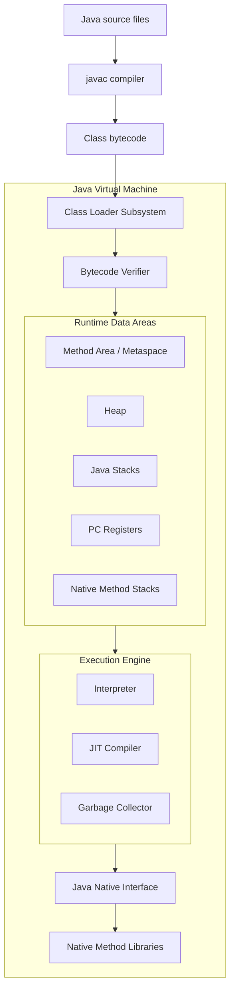

| Component | Responsibility | Scope |
|---|---|---|
| Class loader | Locates and defines classes | JVM process |
| Verifier | Rejects structurally invalid or unsafe bytecode | Class-loading pipeline |
| Runtime data areas | Store objects, class metadata, frames, and instruction positions | Shared and per-thread |
| Interpreter | Executes bytecode instruction by instruction | Runtime |
| JIT compiler | Compiles frequently executed methods to native code | Runtime optimization |
| Garbage collector | Reclaims unreachable heap objects | Runtime memory |
| JNI | Bridges Java and native code | Interoperability boundary |

### Execution Engine Sequence

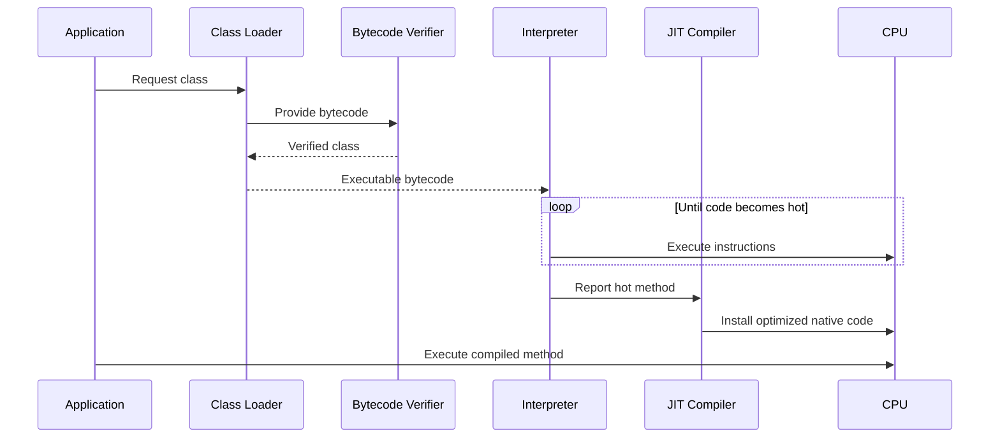

### Java Example

```java
public class JitCandidate {
    static long sum(int limit) {
        long result = 0;
        for (int number = 0; number < limit; number++) {
            result += number;
        }
        return result;
    }

    public static void main(String[] args) {
        for (int run = 0; run < 20_000; run++) {
            sum(10_000); // Repetition can make this method a JIT candidate.
        }
    }
}
```

**Real-world example:** A service starts with interpreted code, then becomes faster as HotSpot profiles and compiles frequently used request paths.

**Interview question:** What is the difference between the interpreter and JIT compiler?

**Expected answer:** The interpreter starts quickly and executes bytecode one instruction at a time. The JIT uses runtime profiling to compile hot code into optimized native instructions, trading compilation cost for faster repeated execution.

**Common mistakes**

- Assuming every method is compiled immediately.
- Calling the JVM an operating system process without distinguishing the specification from its implementations.

**Best practices**

- Measure warmed-up code with a harness such as JMH rather than timing one invocation.
- Diagnose JVM behavior with supported observability tools before changing flags.

## JDK vs JRE vs JVM

The reference images show these as nested layers: the JDK contains development tools and a runtime; the runtime contains libraries and the JVM.

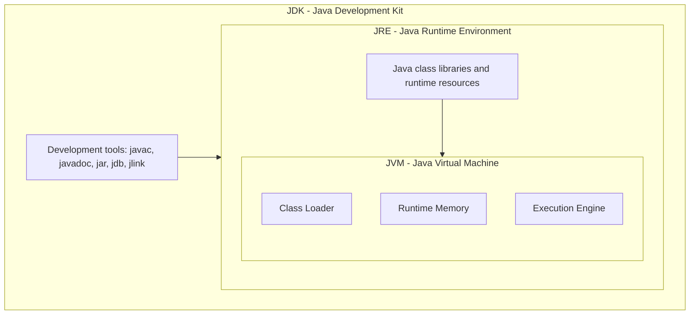

| Layer | Contains | Primary user |
|---|---|---|
| JVM | Class loading, runtime memory, execution engine, GC, JNI | Running program |
| JRE | JVM plus runtime libraries and resources | Application operator |
| JDK | Runtime plus compiler, debugger, packaging, and diagnostic tools | Developer |

> **Note:** Since Java 9, vendors generally distribute JDKs and applications may create custom runtime images with `jlink`; a separate public JRE download is no longer the universal deployment model.

### Java Example

```bash
javac HelloJava.java
java HelloJava
javadoc HelloJava.java
```

**Real-world example:** CI uses the JDK to compile and test; a production container may use a reduced runtime image containing only required modules.

**Interview question:** Can a JVM compile Java source code?

**Expected answer:** Source compilation is normally performed by the JDK's `javac`. The JVM consumes bytecode and may JIT-compile it to native code during execution.

**Common mistakes**

- Saying JRE and JVM are identical.
- Assuming `javac` is part of the JVM.

**Best practice:** Keep build and runtime Java versions compatible, and pin them in CI and deployment configuration.

## Compilation and Execution

### Compilation Process

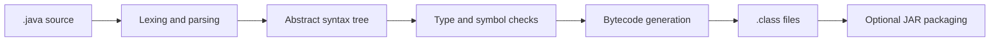

`javac` checks syntax and static types, resolves symbols, and emits one or more `.class` files. Inner, nested, record, and anonymous classes may produce additional class files.

### Execution Process

```mermaid
flowchart LR
    COMMAND[java command] --> START[Create JVM process]
    START --> LOAD[Load main class]
    LOAD --> LINK[Verify, prepare, resolve]
    LINK --> INIT[Initialize class]
    INIT --> MAIN[Invoke main method]
    MAIN --> PROFILE[Interpret and profile]
    PROFILE --> JIT[JIT-compile hot code]
    JIT --> NATIVE[Execute native instructions]
```

### Java Example

```java
public class OrderTotal {
    static int total(int price, int quantity) {
        return Math.multiplyExact(price, quantity);
    }

    public static void main(String[] args) {
        System.out.println(total(250, 4));
    }
}
```

```bash
javac OrderTotal.java
java OrderTotal
```

**Real-world example:** A Maven or Gradle build compiles many source sets, packages bytecode and resources into a JAR, and launches its entry point with `java -jar`.

**Interview question:** What happens from `java OrderTotal` to the first printed line?

**Expected answer:** The launcher creates the JVM, the class loader loads `OrderTotal`, linking verifies and prepares it, initialization runs static initialization, and the execution engine invokes `main` and executes its bytecode.

**Common mistakes**

- Confusing compile-time errors with runtime exceptions.
- Believing a JAR contains native machine code by default.

**Best practices**

- Treat compiler warnings as actionable and use reproducible build tooling.
- Compile with an explicit release target when distributing libraries across JDK versions.

## Memory Management

Java divides memory into shared areas and per-thread areas. Objects normally live on the heap; method frames and local variables live on each thread's Java stack; class metadata lives in Metaspace.

### Memory Layout

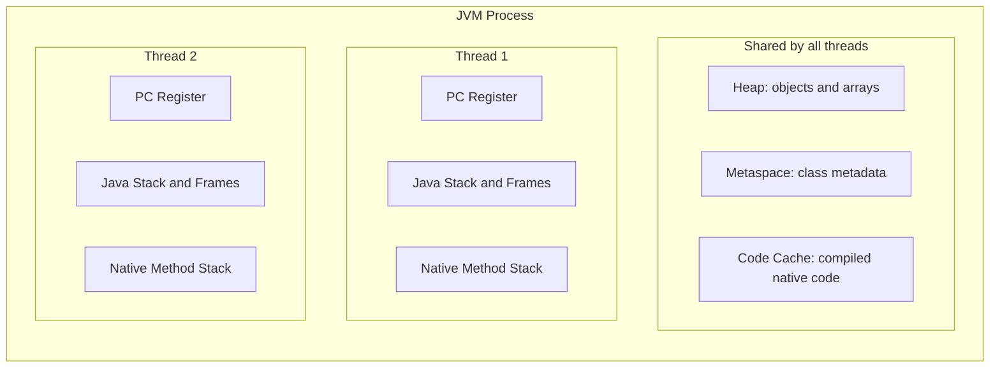

| Area | Shared? | Stores | Typical failure |
|---|---:|---|---|
| Heap | Yes | Objects and arrays | `OutOfMemoryError: Java heap space` |
| Java stack | No | Frames, locals, operand stacks, return data | `StackOverflowError` |
| Metaspace | Yes | Class metadata | `OutOfMemoryError: Metaspace` |
| PC register | No | Current bytecode instruction position | JVM-managed |
| Native method stack | No | Native call state | Implementation-dependent overflow |
| Code cache | Yes | JIT-compiled native code | Code cache exhaustion/warnings |

### Java Example

```java
public class MemoryExample {
    private final String orderId; // Object field belongs to a heap object.

    MemoryExample(String orderId) {
        this.orderId = orderId;
    }

    int length() {
        int result = orderId.length(); // Local variable belongs to this frame.
        return result;
    }
}
```

**Real-world example:** Every web request runs on a thread with its own stack, while request DTOs and cached domain objects are allocated on the shared heap.

**Interview question:** Are Java objects always allocated on the heap?

**Expected answer:** The Java language model exposes references without promising a physical location. Objects are logically heap objects, but a JIT may eliminate an allocation or scalar-replace a non-escaping object.

**Common mistakes**

- Claiming primitive values always live on the stack; fields are part of their containing object.
- Treating `System.gc()` as a command that guarantees collection.

**Best practices**

- Use heap dumps, allocation profiling, and GC logs to diagnose memory pressure.
- Bound caches, queues, and retained histories.

### Heap

The heap is the shared, garbage-collected area used for object and array storage. Many collectors organize it by object age, but exact regions vary by collector.

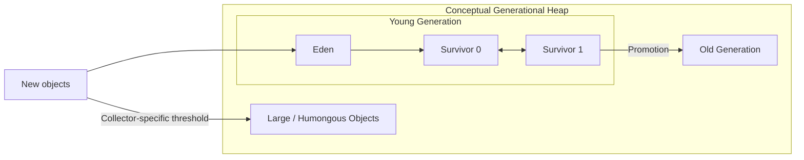

> **Note:** This is a conceptual generational view. G1 uses regions; ZGC and Shenandoah use different internal layouts and concurrent techniques.

### Java Example

```java
import java.util.ArrayList;
import java.util.List;

public class HeapExample {
    public static void main(String[] args) {
        List<byte[]> buffers = new ArrayList<>();
        buffers.add(new byte[1024 * 1024]);
        System.out.println(buffers.size());
    }
}
```

**Real-world example:** Short-lived request objects usually die young, while an application cache can retain objects long enough for promotion.

**Interview question:** Why do many collectors use generations?

**Expected answer:** Most objects die young. Grouping by age lets collectors reclaim short-lived objects frequently and cheaply while scanning long-lived objects less often.

**Common mistake:** Assuming `new` is inherently slow; JVM allocation is commonly a fast pointer bump in a thread-local allocation buffer.

**Best practice:** Reduce accidental retention before attempting to eliminate ordinary short-lived allocations.

### Stack

Each JVM thread owns a Java stack composed of frames. A method invocation creates a frame containing local variables, an operand stack, and method bookkeeping; return or exception unwinding removes it.

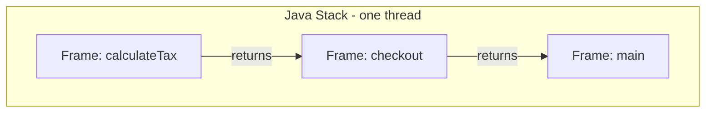

### Java Example

```java
public class StackExample {
    static int factorial(int number) {
        if (number <= 1) {
            return 1;
        }
        return number * factorial(number - 1);
    }
}
```

**Real-world example:** Deep recursion or circular method calls can exhaust a thread's finite stack even when heap space remains.

**Interview question:** Why is stack access thread-safe by default?

**Expected answer:** Each thread owns its stack, so another thread cannot directly access its frames. Referenced heap objects can still be shared and require synchronization.

**Common mistake:** Assuming a local reference makes the referenced object thread-confined.

**Best practice:** Prefer iterative algorithms when recursion depth depends on untrusted or very large input.

### Metaspace

Metaspace stores class metadata in native memory. It replaced PermGen in Java 8 and grows according to demand and configured limits.

### Java Example

```java
Class<?> type = Class.forName("java.util.ArrayList");
System.out.println(type.getDeclaredMethods().length);
```

**Real-world example:** Repeatedly creating class loaders during hot redeployment can leak loaders and all classes they define, causing Metaspace exhaustion.

**Interview question:** What is the difference between Metaspace and PermGen?

**Expected answer:** PermGen was a fixed JVM heap region used before Java 8. Metaspace uses native memory, grows dynamically by default, and can still be capped or exhausted.

**Common mistake:** Believing Metaspace cannot leak because it is native memory.

**Best practice:** Investigate class-loader retention when class counts keep increasing after redeployments.

## Garbage Collection

Garbage collection identifies objects that are not reachable from GC roots and reclaims their storage. It manages memory, not arbitrary external resources such as files or sockets.

### Reachability and Collection

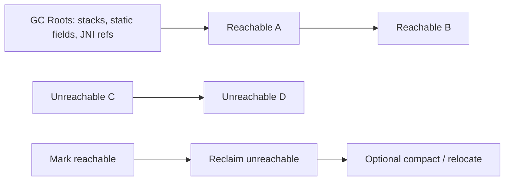

### Generational Collection Flow

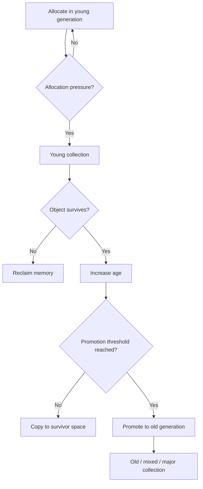

| Collector | General goal | Typical consideration |
|---|---|---|
| Serial | Simplicity and small heaps | Single GC worker |
| Parallel | Throughput | Stop-the-world parallel work |
| G1 | Balanced throughput and pause goals | Region-based; common server default |
| ZGC | Very low pauses on large heaps | Mostly concurrent; verify JDK/platform support |
| Shenandoah | Low pauses through concurrency | Distribution and version support vary |

### Java Example

```java
public final class ReportWriter implements AutoCloseable {
    @Override
    public void close() {
        System.out.println("Release file or network resource deterministically");
    }

    public static void main(String[] args) {
        try (ReportWriter writer = new ReportWriter()) {
            System.out.println("Write report");
        }
    }
}
```

**Real-world example:** A low-latency API may choose a concurrent collector and tune only after observing pause-time and allocation metrics under representative load.

**Interview question:** What are GC roots?

**Expected answer:** Starting points used for reachability analysis, including active stack references, static references from loaded classes, and certain JVM/JNI references.

**Common mistakes**

- Equating an unreachable object with immediate reclamation.
- Using finalizers or GC to release database connections.

**Best practices**

- Use try-with-resources for deterministic cleanup.
- Select a collector based on measured latency, throughput, heap size, and operational constraints.

## Class Loading

Class loading follows loading, linking, and initialization. Linking includes verification, preparation, and optional resolution.

### Class Loader Architecture

This parent-delegation structure recreates the class-loader hierarchy shown in the references.

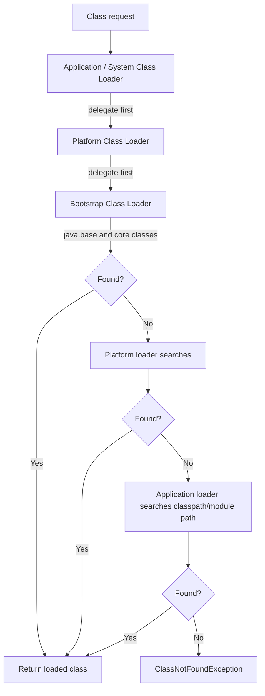

### Class Lifecycle

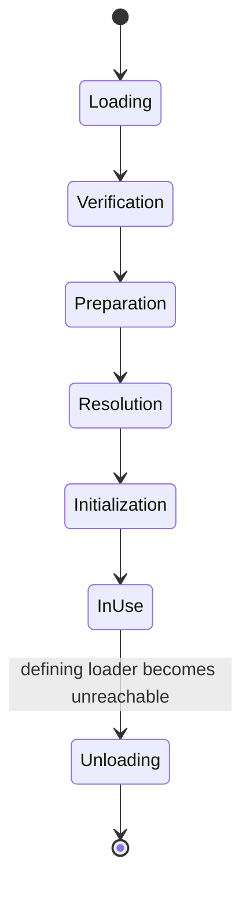

| Phase | Work performed |
|---|---|
| Loading | Find bytes and create a `Class` representation. |
| Verification | Validate bytecode structure and type safety. |
| Preparation | Allocate static storage and assign default values. |
| Resolution | Convert symbolic references to direct runtime references. |
| Initialization | Execute static field initializers and static blocks. |

### Java Example

```java
public class LoadingExample {
    static {
        System.out.println("Initialized once per defining class loader");
    }

    public static void main(String[] args) throws Exception {
        Class<?> type = Class.forName("LoadingExample");
        System.out.println(type.getClassLoader());
    }
}
```

**Real-world example:** Plugin systems use dedicated class loaders to discover implementations while isolating dependencies.

**Interview question:** Why does parent-first delegation matter?

**Expected answer:** It avoids duplicate definitions of core classes, improves consistency, and prevents application classes from casually replacing trusted platform classes.

**Common mistakes**

- Saying `ClassNotFoundException` and `NoClassDefFoundError` are identical.
- Assuming loading always initializes a class immediately.

**Best practices**

- Avoid custom class loaders unless isolation or dynamic loading is a real requirement.
- Close closeable loaders and release references during undeployment.

## Thread Lifecycle

A Java `Thread` moves through states exposed by `Thread.State`. `RUNNABLE` includes ready-to-run and running at the operating-system level.

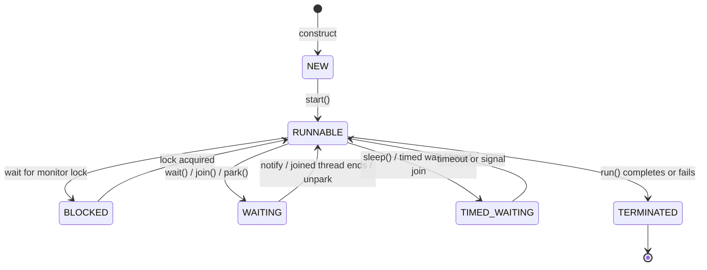

### Java Example

```java
public class ThreadStateExample {
    public static void main(String[] args) throws InterruptedException {
        Thread worker = new Thread(() -> System.out.println("Working"));
        System.out.println(worker.getState()); // NEW
        worker.start();
        worker.join();
        System.out.println(worker.getState()); // TERMINATED
    }
}
```

**Real-world example:** A server thread can be `WAITING` for work, `BLOCKED` on a contended monitor, or `RUNNABLE` while processing a request.

**Interview question:** What is the difference between `BLOCKED` and `WAITING`?

**Expected answer:** `BLOCKED` means waiting to acquire an intrinsic monitor. `WAITING` means waiting indefinitely for another action, such as notification, join completion, or unpark.

**Common mistakes**

- Calling `run()` directly and expecting a new thread.
- Swallowing `InterruptedException` without restoring interruption or ending the task.

**Best practices**

- Prefer executors or structured concurrency facilities appropriate to the target JDK over unmanaged thread creation.
- Minimize shared mutable state and keep critical sections short.

---

# Object-Oriented Programming

OOP models behavior around objects with state, responsibilities, and contracts. The four common pillars are encapsulation, inheritance, polymorphism, and abstraction.

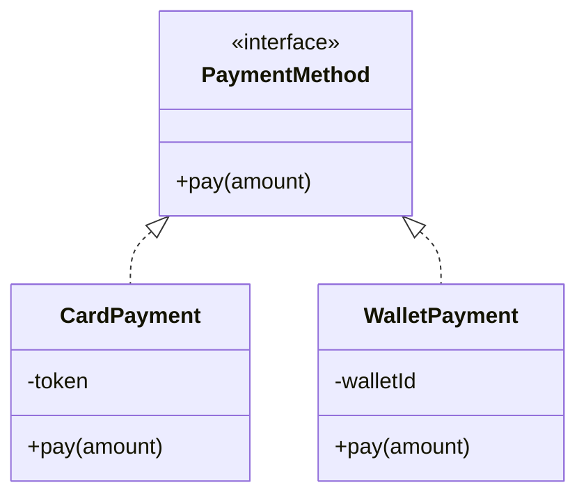

## Encapsulation

Encapsulation protects invariants by hiding representation and exposing controlled operations.

```java
import java.math.BigDecimal;

public final class BankAccount {
    private BigDecimal balance = BigDecimal.ZERO;

    public BigDecimal balance() {
        return balance;
    }

    public void deposit(BigDecimal amount) {
        if (amount.signum() <= 0) {
            throw new IllegalArgumentException("Amount must be positive");
        }
        balance = balance.add(amount);
    }
}
```

**Real-world example:** An account exposes `deposit` rather than a public balance field, so invalid transitions cannot bypass business rules.

**Interview question:** Is encapsulation the same as making fields private?

**Expected answer:** Private fields are a mechanism. Encapsulation is the broader design of protecting invariants and hiding implementation details behind a cohesive API.

**Common mistake:** Generating setters for every field and calling the class encapsulated.

**Best practice:** Expose behavior-oriented methods and return immutable views of internal collections.

## Inheritance

Inheritance creates an "is-a" relationship in which a subtype receives accessible behavior and can satisfy its parent's contract.

```java
abstract class Employee {
    abstract int monthlyPay();
}

final class SalariedEmployee extends Employee {
    private final int salary;

    SalariedEmployee(int salary) {
        this.salary = salary;
    }

    @Override
    int monthlyPay() {
        return salary;
    }
}
```

**Real-world example:** Framework base classes can define stable lifecycle hooks that specialized components implement.

**Interview question:** When should composition be preferred over inheritance?

**Expected answer:** Prefer composition when reuse does not represent a true substitutable "is-a" relationship, or when behavior must vary independently at runtime.

**Common mistake:** Extending a class only to reuse utility methods.

**Best practice:** Keep inheritance hierarchies shallow and preserve parent contracts.

## Polymorphism

Polymorphism lets client code invoke one contract while runtime dispatch selects the implementation.

```java
interface PriceRule {
    int apply(int price);
}

final class RegularPrice implements PriceRule {
    public int apply(int price) {
        return price;
    }
}

final class DiscountPrice implements PriceRule {
    public int apply(int price) {
        return price * 90 / 100;
    }
}
```

**Real-world example:** A checkout workflow applies any configured `PriceRule` without conditionals for every campaign type.

**Interview question:** What is compile-time versus runtime polymorphism?

**Expected answer:** Overloading is resolved from declared types and arguments at compile time. Overridden instance methods use dynamic dispatch based on the runtime object.

**Common mistake:** Assuming fields and static methods use runtime overriding like instance methods.

**Best practice:** Program to a stable contract and keep implementations behaviorally substitutable.

## Abstraction

Abstraction exposes essential capabilities while hiding implementation details. Java supports it through interfaces, abstract classes, and ordinary APIs.

```java
interface MessageSender {
    void send(String destination, String body);
}

final class EmailSender implements MessageSender {
    public void send(String destination, String body) {
        System.out.printf("Email to %s: %s%n", destination, body);
    }
}
```

**Real-world example:** Business logic depends on `MessageSender`, not SMTP connection details.

**Interview question:** Interface or abstract class?

**Expected answer:** Use an interface for a capability or role that unrelated types can implement. Use an abstract class when closely related types need shared state, protected implementation, or a controlled template.

**Common mistake:** Creating interfaces with only one implementation and no meaningful boundary or variation.

**Best practice:** Make abstractions small, cohesive, and owned by the code that consumes them.

---

# SOLID Principles

SOLID is a set of design heuristics for code that changes safely. It is not a requirement to create an interface for every class.

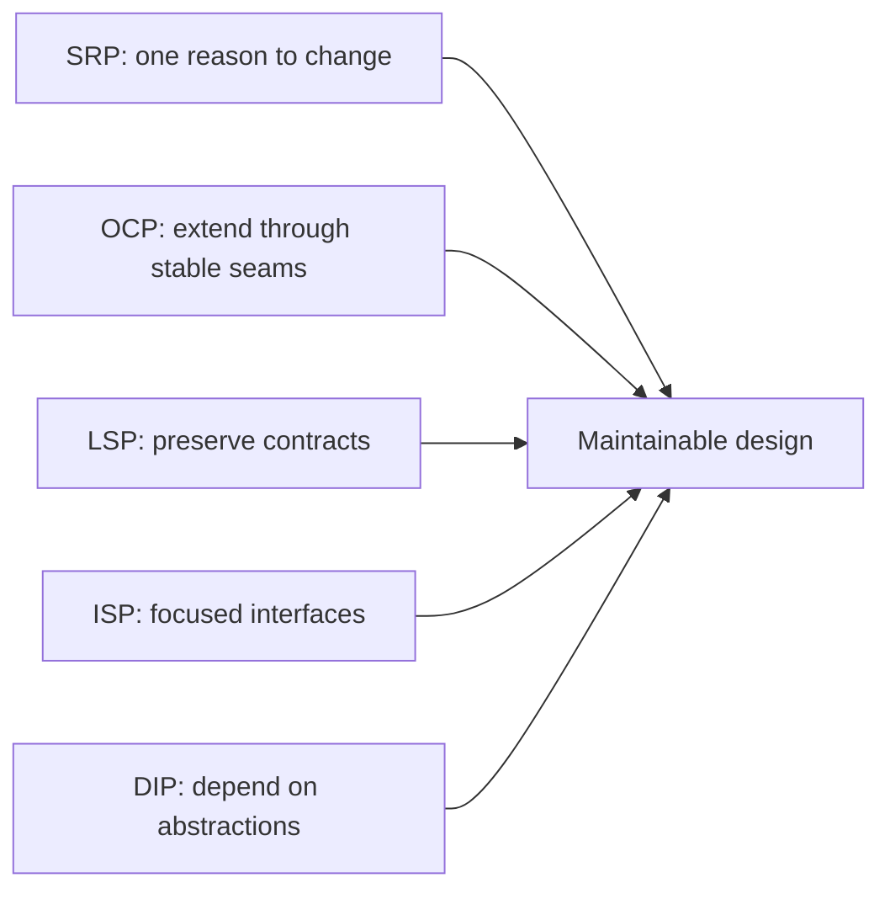

## Single Responsibility Principle

A module should have one reason to change, meaning one cohesive responsibility owned by one actor.

```java
record Invoice(String customerEmail, int total) {}

final class InvoiceCalculator {
    int calculateTotal(Invoice invoice) {
        return invoice.total();
    }
}

final class InvoiceEmailer {
    void send(Invoice invoice) {
        System.out.println("Sending invoice to " + invoice.customerEmail());
    }
}
```

**Real-world example:** Tax rules and email delivery change for different business reasons, so they belong in separate components.

**Interview question:** Does SRP mean every class should have one method?

**Expected answer:** No. A class can have many cohesive methods serving one responsibility and one primary reason to change.

**Common mistake:** Splitting code into tiny classes that add navigation cost but no ownership clarity.

**Best practice:** Group behavior by business responsibility, not by arbitrary technical verbs.

## Open Closed Principle

Software entities should be open for extension but closed for modification: stable behavior should accept new variants without repeatedly editing central conditionals.

```java
interface ShippingCost {
    int calculate(int weightInGrams);
}

final class StandardShipping implements ShippingCost {
    public int calculate(int weightInGrams) {
        return 50 + weightInGrams / 100;
    }
}

final class ExpressShipping implements ShippingCost {
    public int calculate(int weightInGrams) {
        return 150 + weightInGrams / 50;
    }
}
```

**Real-world example:** Adding a shipping strategy does not modify the checkout algorithm.

**Interview question:** Is code ever literally closed to modification?

**Expected answer:** No. OCP means identifying likely variation points and protecting stable policy from changes for each new variant, not forbidding edits.

**Common mistake:** Designing abstractions for speculative variants that may never exist.

**Best practice:** Introduce extension points after a real axis of change becomes clear.

## Liskov Substitution Principle

Any subtype should be usable where its base type is expected without breaking correctness. Subtypes must preserve preconditions, postconditions, and invariants.

```java
interface ReadableFile {
    byte[] read();
}

interface WritableFile extends ReadableFile {
    void write(byte[] content);
}

final class ReadOnlyFile implements ReadableFile {
    public byte[] read() {
        return new byte[0];
    }
}
```

**Real-world example:** A read-only file does not implement a writable contract and then throw `UnsupportedOperationException` for normal use.

**Interview question:** How can an override violate LSP?

**Expected answer:** It can require stricter inputs, promise less, throw unexpected exceptions, alter invariants, or otherwise surprise callers relying on the base contract.

**Common mistake:** Checking only whether code compiles, not whether behavior remains substitutable.

**Best practice:** Specify and test contracts at the abstraction level against every implementation.

## Interface Segregation Principle

Clients should not depend on methods they do not use. Prefer focused role interfaces over broad "god interfaces."

```java
interface Printer {
    void print(String document);
}

interface Scanner {
    String scan();
}

final class BasicPrinter implements Printer {
    public void print(String document) {
        System.out.println(document);
    }
}
```

**Real-world example:** A basic printer is not forced to implement fax and scan operations it cannot support.

**Interview question:** How does ISP improve testing?

**Expected answer:** A client depending on a small contract needs smaller fakes and has fewer unrelated reasons to change.

**Common mistake:** Creating one interface per method even when clients always use those methods together.

**Best practice:** Shape interfaces around consumer roles and cohesive use cases.

## Dependency Inversion Principle

High-level policy should not depend directly on low-level implementation details. Both should depend on abstractions, and abstractions should not depend on details.

A high-level module contains business decisions such as "notify a customer after an order is placed." A low-level module handles a mechanism such as SMTP, SMS, a database, or an HTTP SDK. DIP places a stable contract between them and wires the implementation at the composition root.

**Real-world example:** Order policy depends on a notification port; infrastructure supplies email, SMS, or an in-memory test implementation.

**Interview question:** Is dependency injection the same as dependency inversion?

**Expected answer:** No. DIP is a design principle about dependency direction. Dependency injection is a technique for supplying dependencies and can be used to implement DIP.

**Common mistake:** Moving `new EmailService()` into a framework configuration class while business code still depends on the concrete `EmailService` type.

**Best practice:** Define the abstraction near the policy that consumes it and compose concrete adapters at the application boundary.

---

# Dependency Inversion Deep Dive

## Problem

A notification workflow often begins by constructing concrete email and message services. That works initially, but the policy then knows transport details, making change and testing expensive.

## Bad Design: Before Architecture

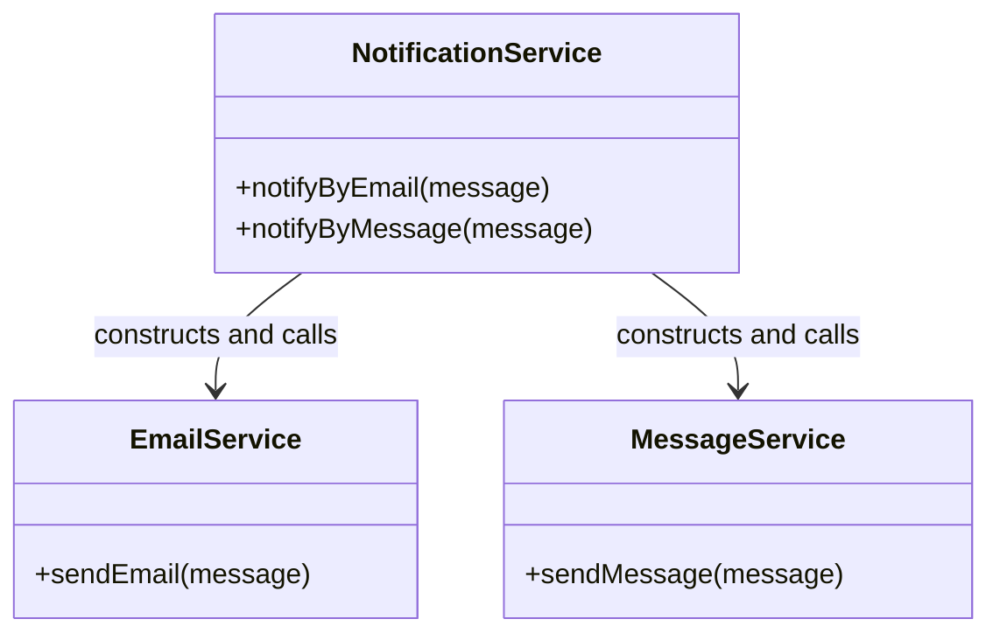

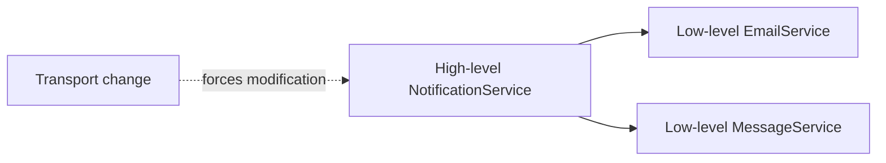

**Dependency direction:** high-level policy points directly toward low-level details. Adding push notification requires modifying `NotificationService`.

### Bad Java Example

```java
final class EmailService {
    void send(String recipient, String message) {
        System.out.printf("Email %s: %s%n", recipient, message);
    }
}

final class MessageService {
    void send(String recipient, String message) {
        System.out.printf("SMS %s: %s%n", recipient, message);
    }
}

final class NotificationService {
    private final EmailService emailService = new EmailService();
    private final MessageService messageService = new MessageService();

    void notifyCustomer(String channel, String recipient, String message) {
        if ("email".equals(channel)) {
            emailService.send(recipient, message);
        } else if ("sms".equals(channel)) {
            messageService.send(recipient, message);
        }
    }
}
```

### Why It Is Bad

- Business policy owns construction and transport selection details.
- Unit tests cannot replace network mechanisms without awkward workarounds.
- Every channel adds a field and conditional branch.
- High-level code changes when low-level vendors or protocols change.

## Better Design: After Architecture

The consumer owns a `MessageSender` abstraction. Email and SMS adapters implement it. The composition root chooses an adapter and injects it into the high-level service.

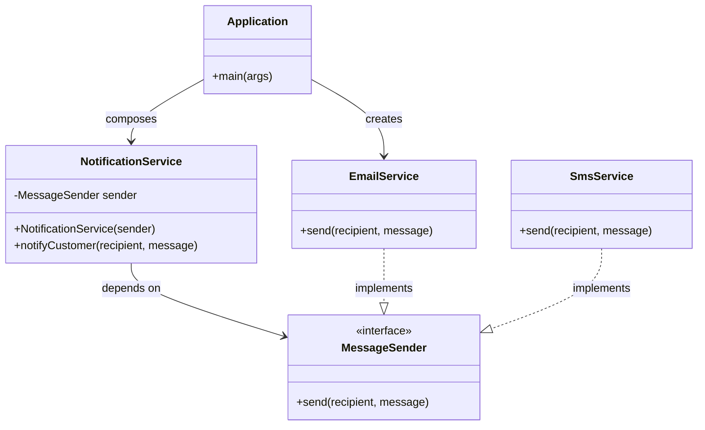

### Dependency Direction

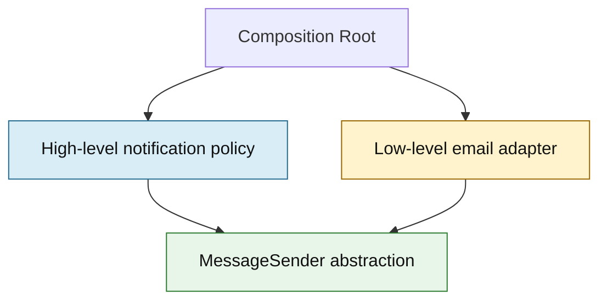

Both source-code dependencies point toward the abstraction. Runtime calls still flow from policy through the interface to the injected adapter.

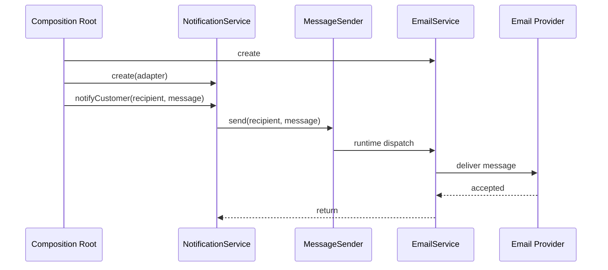

> **Note:** UML source arrows and runtime call arrows answer different questions. Source dependencies point from concrete adapters and policy toward the contract; runtime control passes through the selected implementation.

### Better Java Example

```java
interface MessageSender {
    void send(String recipient, String message);
}

final class EmailService implements MessageSender {
    @Override
    public void send(String recipient, String message) {
        System.out.printf("Email %s: %s%n", recipient, message);
    }
}

final class SmsService implements MessageSender {
    @Override
    public void send(String recipient, String message) {
        System.out.printf("SMS %s: %s%n", recipient, message);
    }
}

final class NotificationService {
    private final MessageSender sender;

    NotificationService(MessageSender sender) {
        this.sender = sender;
    }

    void notifyCustomer(String recipient, String message) {
        sender.send(recipient, message);
    }
}

public class Application {
    public static void main(String[] args) {
        MessageSender sender = new EmailService();
        NotificationService notifications = new NotificationService(sender);
        notifications.notifyCustomer("learner@example.com", "Interview scheduled");
    }
}
```

### Test Without Infrastructure

```java
final class RecordingSender implements MessageSender {
    String recipient;
    String message;

    @Override
    public void send(String recipient, String message) {
        this.recipient = recipient;
        this.message = message;
    }
}

// In a unit test:
RecordingSender sender = new RecordingSender();
NotificationService service = new NotificationService(sender);
service.notifyCustomer("candidate@example.com", "Welcome");
assert "Welcome".equals(sender.message);
```

## Good vs Bad Design

| Concern | Direct concrete dependency | Inverted dependency |
|---|---|---|
| Policy dependency | `NotificationService -> EmailService` | `NotificationService -> MessageSender` |
| Adapter dependency | None toward policy contract | `EmailService -> MessageSender` |
| Construction | Hidden inside business class | Visible at composition root |
| New channel | Modify central policy | Add adapter and change composition |
| Unit testing | Uses or mocks concrete mechanism | Injects a small fake |
| Framework coupling | Can leak into policy | Confined to outer wiring/adapters |

## Benefits

- Protects business rules from infrastructure churn.
- Makes implementations replaceable at deployment or test time.
- Makes object construction explicit.
- Encourages small contracts based on consumer needs.
- Supports hexagonal, clean, and ports-and-adapters architectures.

## DIP Interview Questions

<details>
<summary><strong>Why should the high-level module often own the interface?</strong></summary>

The interface expresses what the policy needs. Ownership near the consumer prevents transport details from shaping the business contract.
</details>

<details>
<summary><strong>Can DIP be used without Spring?</strong></summary>

Yes. Constructor injection in plain Java is enough. Spring is a composition container, not a prerequisite for the principle.
</details>

<details>
<summary><strong>Does every concrete class need an interface?</strong></summary>

No. Add an abstraction where it protects policy, supports meaningful substitution, or establishes a testing or ownership boundary.
</details>

<details>
<summary><strong>What is the composition root?</strong></summary>

It is the outer application location where concrete objects are created and connected. In a small Java program it may be `main`; in Spring it is represented by configuration and component wiring.
</details>

---

# Collections Framework

The Collections Framework provides interfaces, implementations, algorithms, and iteration conventions for groups of objects.

## Collections Hierarchy

```mermaid
classDiagram
    class Iterable~E~ {
        <<interface>>
    }
    class Collection~E~ {
        <<interface>>
    }
    class List~E~ {
        <<interface>>
    }
    class Set~E~ {
        <<interface>>
    }
    class Queue~E~ {
        <<interface>>
    }
    class Deque~E~ {
        <<interface>>
    }
    class Map~K_V~ {
        <<interface>>
    }
    class ArrayList
    class LinkedList
    class HashSet
    class TreeSet
    class PriorityQueue
    class ArrayDeque
    class HashMap
    class LinkedHashMap
    class TreeMap

    Iterable <|-- Collection
    Collection <|-- List
    Collection <|-- Set
    Collection <|-- Queue
    Queue <|-- Deque
    List <|.. ArrayList
    List <|.. LinkedList
    Deque <|.. LinkedList
    Set <|.. HashSet
    Set <|.. TreeSet
    Queue <|.. PriorityQueue
    Deque <|.. ArrayDeque
    Map <|.. HashMap
    Map <|.. LinkedHashMap
    Map <|.. TreeMap
```

> **Note:** `Map` is part of the framework but does not extend `Collection`.

| Need | Typical choice | Key property |
|---|---|---|
| Indexed sequence | `ArrayList` | Fast random access and append |
| Unique values | `HashSet` | Hash-based membership |
| Key/value lookup | `HashMap` | Average constant-time lookup with good hashing |
| Sorted keys/values | `TreeMap` / `TreeSet` | Comparator or natural ordering |
| FIFO processing | `ArrayDeque` | Efficient queue operations |
| Priority ordering | `PriorityQueue` | Head is least/greatest by comparator |

### Java Example

```java
import java.util.ArrayList;
import java.util.HashMap;
import java.util.List;
import java.util.Map;

List<String> topics = new ArrayList<>();
topics.add("JVM");
topics.add("SOLID");

Map<String, Integer> scores = new HashMap<>();
scores.put("JVM", 8);
scores.merge("JVM", 1, Integer::sum);
```

**Real-world example:** Use a `Map<UUID, Order>` for identity lookup and a `List<Order>` when preserving an ordered result set.

**Interview question:** How does `HashMap` find a value?

**Expected answer:** It spreads the key's hash to select a bucket, then compares candidate keys using hash and `equals`. Collisions share a bucket; high-collision buckets may become balanced trees in modern implementations.

**Common mistakes**

- Mutating a key in a way that changes its hash while it is stored in a hash collection.
- Choosing `LinkedList` for general-purpose indexed access.
- Modifying a non-concurrent collection structurally during enhanced iteration.

**Best practices**

- Program to interfaces such as `List` and `Map`.
- Implement `equals` and `hashCode` consistently for hash keys.
- Return immutable snapshots or unmodifiable views when callers must not mutate state.

---

# Exception Handling

Exceptions separate normal return values from abnormal control flow. Checked exceptions must be caught or declared; unchecked exceptions derive from `RuntimeException`. JVM errors generally represent conditions applications should not attempt to handle routinely.

## Exception Hierarchy

```mermaid
classDiagram
    class Object
    class Throwable
    class Error
    class Exception
    class RuntimeException
    class IOException
    class SQLException
    class NullPointerException
    class IllegalArgumentException
    class OutOfMemoryError
    class StackOverflowError

    Object <|-- Throwable
    Throwable <|-- Error
    Throwable <|-- Exception
    Exception <|-- RuntimeException
    Exception <|-- IOException
    Exception <|-- SQLException
    RuntimeException <|-- NullPointerException
    RuntimeException <|-- IllegalArgumentException
    Error <|-- OutOfMemoryError
    Error <|-- StackOverflowError
```

### Control Flow

```mermaid
flowchart TD
    CALL[Call operation] --> TRY{Succeeds?}
    TRY -- Yes --> RESULT[Return result]
    TRY -- No --> THROW[Throw exception]
    THROW --> MATCH{Matching catch?}
    MATCH -- Yes --> HANDLE[Handle or translate]
    MATCH -- No --> PROPAGATE[Unwind to caller]
    RESULT --> FINALLY[Run finally / close resources]
    HANDLE --> FINALLY
    PROPAGATE --> FINALLY
```

### Java Example

```java
import java.io.IOException;
import java.nio.file.Files;
import java.nio.file.Path;

public final class ConfigurationReader {
    static String read(Path path) {
        try {
            return Files.readString(path);
        } catch (IOException cause) {
            throw new ConfigurationException("Cannot read " + path, cause);
        }
    }
}

final class ConfigurationException extends RuntimeException {
    ConfigurationException(String message, Throwable cause) {
        super(message, cause);
    }
}
```

**Real-world example:** A repository can translate a vendor-specific `SQLException` into an application exception while preserving the cause for diagnosis.

**Interview question:** When should a custom exception be checked or unchecked?

**Expected answer:** Use a checked exception when callers can reasonably recover and the API should force a decision. Use an unchecked exception for programming errors, violated preconditions, or failures best handled at a higher boundary. Consistency with the surrounding API matters.

**Common mistakes**

- Catching `Exception` and silently continuing.
- Logging and rethrowing at every layer, creating duplicate logs.
- Losing the original cause when translating.
- Using exceptions for ordinary branching.

**Best practices**

- Catch only where code can recover, add context, translate, or establish a boundary response.
- Preserve causes and write actionable messages without sensitive data.
- Use try-with-resources for `AutoCloseable` resources.
- Define centralized exception-to-response mapping in service applications.

---

# Interview Preparation Roadmap

```mermaid
flowchart LR
    BASICS[1. Syntax and types] --> OOP[2. OOP and exceptions]
    OOP --> COLLECTIONS[3. Collections and generics]
    COLLECTIONS --> JVM[4. JVM and memory]
    JVM --> CONCURRENCY[5. Threads and concurrency]
    CONCURRENCY --> MODERN[6. Lambdas and streams]
    MODERN --> DESIGN[7. SOLID and patterns]
    DESIGN --> FRAMEWORKS[8. Spring and persistence]
    FRAMEWORKS --> SYSTEM[9. Testing and system design]
```

| Level | Focus | Demonstrate in an interview |
|---|---|---|
| Beginner | Syntax, types, methods, classes, strings, arrays | Trace code and explain value/reference behavior |
| Foundation | OOP, exceptions, collections, generics | Select data structures and model invariants |
| Intermediate | Streams, I/O, annotations, reflection, concurrency | Discuss tradeoffs and write testable code |
| Advanced | JVM, GC, class loading, memory model, performance | Diagnose behavior with evidence |
| Senior | SOLID, patterns, APIs, distributed systems, Spring | Define boundaries and defend architecture decisions |

## Practical Preparation Loop

1. Explain a concept without jargon.
2. Draw its runtime or dependency flow.
3. Write a minimal Java example.
4. Identify one failure mode and diagnose it.
5. Compare alternatives and state when each is appropriate.
6. Test the example and discuss production constraints.

## Final Rapid-Fire Questions

<details>
<summary><strong>Why are strings immutable?</strong></summary>

Immutability supports safe sharing, string pooling, stable hashing, security-sensitive API use, and simpler concurrency.
</details>

<details>
<summary><strong>What is the contract between equals and hashCode?</strong></summary>

Equal objects must have equal hash codes. Unequal objects may collide. Both should remain stable while an object is used as a hash key.
</details>

<details>
<summary><strong>What does volatile guarantee?</strong></summary>

A write to a volatile variable happens-before a subsequent read of that variable, providing visibility and ordering for that variable. It does not make compound operations such as increment atomic.
</details>

<details>
<summary><strong>What causes a memory leak in managed Java?</strong></summary>

Objects remain reachable even though the application no longer needs them, often through unbounded caches, listeners, static collections, thread locals, or class loaders.
</details>

<details>
<summary><strong>How do you investigate high GC pause time?</strong></summary>

Capture GC logs and runtime metrics, identify collector, heap occupancy, allocation and promotion rates, pause phases, and workload timing, then validate changes under representative load.
</details>

---

## Navigation

- [Back to top](#java-interview-handbook)
- [Java Platform](#java-platform)
- [Object-Oriented Programming](#object-oriented-programming)
- [SOLID Principles](#solid-principles)
- [Dependency Inversion Deep Dive](#dependency-inversion-deep-dive)
- [Collections Framework](#collections-framework)
- [Exception Handling](#exception-handling)
- [Repository README](../README.md)
