# The React Ecosystem Handbook

> A single-file, production-oriented guide to React 18+, React Router, Redux Toolkit, RTK Query, Axios, build tooling, architecture, performance, authentication, and deployment.

<a id="top"></a>

## How to Use This Book

This handbook assumes knowledge of JavaScript functions, objects, arrays, promises, modules, and `async`/`await`. Read Modules 1-5 in order, then follow the modules relevant to your work. Examples use React 18 behavior. Class components and Create React App (CRA) are covered for enterprise maintenance, but new client applications should normally use function components and Vite.

> [!NOTE]
> React is a UI library, not a complete application framework. Routing, remote-data caching, authentication policy, bundling, monitoring, and deployment remain architectural decisions.

> [!WARNING]
> Browser-delivered code is public. Environment variables, minification, and obfuscation do not protect secrets.

## Table of Contents

1. [React Fundamentals](#module-1-react-fundamentals)
2. [React Internals](#module-2-react-internals)
3. [Component Lifecycle](#module-3-component-lifecycle)
4. [React Hooks](#module-4-react-hooks)
5. [Component Communication](#module-5-component-communication)
6. [React Router](#module-6-react-router)
7. [Forms](#module-7-forms)
8. [Axios](#module-8-axios)
9. [Context API](#module-9-context-api)
10. [Redux Toolkit and RTK Query](#module-10-redux-toolkit-and-rtk-query)
11. [Performance Optimization](#module-11-performance-optimization)
12. [Environment Variables](#module-12-environment-variables)
13. [Webpack](#module-13-webpack)
14. [Vite](#module-14-vite)
15. [Tree Shaking](#module-15-tree-shaking)
16. [Authentication](#module-16-authentication)
17. [Error Handling](#module-17-error-handling)
18. [Project Architecture](#module-18-project-architecture)
19. [Build Process and Deployment](#module-19-build-process-and-deployment)
20. [Final Interview Handbook](#final-interview-handbook)

## Book Conventions

- "Render" means React calls components to calculate a candidate tree.
- "Commit" means React changes the host DOM and runs commit-related work.
- Effects synchronize with systems outside React; they are not a general tool for derived values.
- API examples use `/api` as a placeholder origin.
- Every production system must adapt examples to its threat model, browser support, observability, and API contract.

---

<a id="module-1-react-fundamentals"></a>
# Module 1: React Fundamentals

[Previous: Contents](#table-of-contents) | [Next: React Internals](#module-2-react-internals)

## Introduction

React is an open-source JavaScript library for building user interfaces from reusable components. A useful mental model is:

> **UI = f(state)**

For the same props, state, and context, a pure component should describe the same UI. Developers declare the desired result; React coordinates when components run and how their output reaches the browser DOM.

React is a **library**, not a complete framework. It owns component rendering and related APIs, but it does not prescribe one router, HTTP client, global store, folder structure, or deployment platform. This focused scope is an advantage when a team needs flexibility and a disadvantage when a team needs a single prescribed architecture.

### Why React Exists

Before component-oriented libraries became common, large interfaces often mixed DOM queries, event listeners, data mutation, and manual element updates. As state grew, developers had to remember every DOM location affected by each change. React changed the question from "Which DOM commands should run?" to "What should the interface look like for this state?"

Facebook open-sourced React in 2013 after using its ideas internally. Important milestones include:

| Period | Milestone | Why it mattered |
|---|---|---|
| 2013 | Public React release | Popularized declarative components and one-way data flow |
| 2015 | React Native | Applied the component model beyond browser DOM rendering |
| 2017 | Fiber architecture in React 16 | Enabled incremental work, priorities, and modern error boundaries |
| 2019 | Hooks in React 16.8 | Let function components compose stateful behavior |
| 2022 | React 18 | Added `createRoot`, automatic batching, transitions, and concurrent foundations |

### Industry Usage

React is commonly used for product interfaces that contain many interacting states: e-commerce catalogs, banking workspaces, CRM pipelines, administrative dashboards, HR systems, chat clients, social feeds, and internal enterprise tools. Its ecosystem, hiring market, testing support, and long-term adoption make it a common organizational choice, but popularity alone is not an architecture decision.

| Decision | Guidance |
|---|---|
| Advantages | Composition, declarative updates, predictable data flow, mature ecosystem, strong tooling, broad industry use |
| Disadvantages | Not a complete framework; state/effects can be misused; ecosystem choices add governance cost; client JavaScript has loading and runtime costs |
| Use it | Interactive products with reusable screens, evolving state, complex workflows, or long-term team ownership |
| Avoid it | Tiny static documents, content requiring almost no interaction, or environments where shipping client JavaScript is inappropriate |

### SPA vs MPA

An SPA keeps one document and JavaScript runtime while a client router changes views. An MPA requests another document for navigation. React can support either model; server-rendering frameworks can return route-specific documents and then hydrate React on the client.

| Concern | SPA | MPA or server-rendered navigation |
|---|---|---|
| First request | Often loads an application shell and JavaScript | Returns route-specific document content |
| Later navigation | Client router can update quickly | Browser requests another document |
| State continuity | Naturally remains in one runtime | Must be persisted or transferred |
| Failure isolation | One runtime may affect many screens | Document navigations create stronger isolation |
| SEO and previews | Requires correct rendering strategy | Content exists naturally in returned documents |
| Best fit | Highly interactive application-like products | Content-heavy or document-oriented experiences |

## Internal and Step-by-Step Working

JSX compiles to instructions that create immutable React element descriptions. An element is a small JavaScript description containing a type, props, and optional key. It is not a browser node and has no methods such as `focus()` or `appendChild()`.

React associates component state with a Fiber's identity and position in the rendered tree. Calling a state setter enqueues an update; it does not mutate the value captured by the currently running function. React later renders with a new state snapshot. If the resulting host output differs, the commit phase updates the DOM. The browser then performs any required style calculation, layout, paint, and compositing.

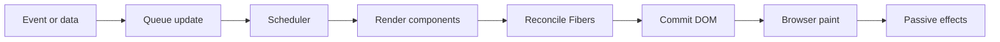

The arrows show causality:

1. An event, timer, request completion, context change, or external-store notification triggers an update.
2. React puts the update into an internal queue and assigns scheduling priority.
3. The render phase calls components and reconciles their new element output with previous Fibers.
4. Render must be pure because React may pause, restart, or discard uncommitted work.
5. The commit phase applies a completed set of DOM mutations and updates refs.
6. The browser converts changed DOM and styles into pixels.
7. Passive effects synchronize subscriptions, analytics, or other external systems after commit.

### Initial Render Execution Trace

```jsx
// src/main.jsx
import { StrictMode } from "react";
import { createRoot } from "react-dom/client";
import App from "./App.jsx";

const container = document.getElementById("root");
const root = createRoot(container);

root.render(
	<StrictMode>
		<App />
	</StrictMode>,
);
```

Line by line:

1. `StrictMode` enables additional development checks without adding visible DOM.
2. `createRoot` creates a React 18 root attached to the existing container.
3. `<App />` creates an element describing the root component.
4. `root.render` schedules initial rendering; it does not append a prebuilt `App` DOM node.
5. React calls `App` and descendants, commits their host output, and the browser paints it.

> [!NOTE]
> Development Strict Mode can call render logic more than once and test effect cleanup. This behavior exposes impurities; it does not mean production commits duplicate UI.

## Installation and Tooling

### Vite Setup (Recommended)

```bash
npm create vite@latest storefront -- --template react
cd storefront
npm install
npm run dev
```

The scaffold creates a package manifest, Vite configuration defaults, an HTML entry, and a React source entry. `npm install` resolves dependencies from the package manifest and lockfile. `npm run dev` starts Vite's development server with on-demand module transforms and hot updates.

Useful generated commands normally include:

| Command | Purpose |
|---|---|
| `npm run dev` | Start the local development server |
| `npm run build` | Create optimized production assets in `dist/` |
| `npm run preview` | Inspect the production build locally; not a production server |
| `npm run lint` | Run the scaffold's lint configuration when included |

### Create React App

CRA and `react-scripts` remain relevant in existing applications but are not the recommended starting point for a new client application. CRA hides Webpack/Babel configuration and uses `REACT_APP_*` environment variables. A migration to Vite commonly requires moving `index.html`, changing environment access to `import.meta.env.VITE_*`, translating proxy and asset behavior, and replacing CRA-specific test assumptions.

### Project Structure

A small application can remain simple:

```text
src/
|-- app/          # root providers, router, store
|-- features/     # business capabilities
|-- shared/       # reusable UI, hooks, utilities
|-- App.jsx
`-- main.jsx
```

| Path | Responsibility |
|---|---|
| `app/` | Composition root: providers, router, store, global error boundaries |
| `features/` | Business capabilities such as products, cart, students, or reports |
| `shared/` | Domain-neutral UI, hooks, and utilities used by multiple features |
| `App.jsx` | Top-level application composition |
| `main.jsx` | Browser bootstrap and root creation |

Do not create every possible folder on day one. Introduce a boundary when it expresses real ownership, removes harmful coupling, or supports multiple consumers.

## JSX and React Elements

JSX is syntax embedded in JavaScript. It resembles HTML, but expressions follow JavaScript rules and attributes often use DOM-property names such as `className` and `htmlFor`. JSX must produce one root expression; a fragment (`<>...</>`) groups siblings without creating a wrapper DOM element.

```jsx
function ProductHeading({ product, featured }) {
	const availability = product.stock > 0 ? "In stock" : "Unavailable";

	return (
		<>
			<h2>{featured ? "Featured: " : ""}{product.name}</h2>
			<p>{availability}</p>
		</>
	);
}
```

- Curly braces evaluate JavaScript expressions.
- `null`, `undefined`, and booleans render no text; numbers and strings do.
- React escapes string values before inserting them, reducing accidental markup injection.
- `dangerouslySetInnerHTML` bypasses this protection and requires trusted, sanitized content.

Conceptually, `<ProductHeading product={item} />` becomes an element-creation instruction. React does not call the component until rendering that element.

## Components

A component is a reusable rendering unit. Good components have a focused responsibility, explicit inputs, semantic output, and a name based on domain intent rather than visual accident.

### Function Components

Function components are the standard for new React code. React calls them with props. They may use hooks and must remain pure during render.

```jsx
function Price({ amount, currency = "USD" }) {
	const formatted = new Intl.NumberFormat("en-US", {
		style: "currency",
		currency,
	}).format(amount);

	return <strong>{formatted}</strong>;
}
```

For `amount={49.99}`, the expected output is `$49.99`. Formatting runs whenever `Price` renders. React can preserve the existing `strong` DOM node when its type and position remain the same.

### Class Components

Class components remain supported and common in legacy systems and error boundaries:

```jsx
import { Component } from "react";

class LegacyCounter extends Component {
	state = { count: 0 };

	render() {
		return (
			<button onClick={() => this.setState(({ count }) => ({ count: count + 1 }))}>
				Count: {this.state.count}
			</button>
		);
	}
}
```

Class state lives on the component instance. Function-component state is tracked by React through the Fiber/hook structure. Prefer functions for new feature code; learn classes to maintain existing applications and understand lifecycle/error-boundary APIs.

## Props and Component Contracts

Props are read-only inputs supplied by a parent. They may contain primitives, objects, arrays, elements, or callback functions. A child must never mutate a prop object because the parent owns it.

```jsx
function ProductCard({ product, onAddToCart, children }) {
	return (
		<article>
			<h2>{product.name}</h2>
			<Price amount={product.price} />
			{children}
			<button type="button" onClick={() => onAddToCart(product.id)}>
				Add to cart
			</button>
		</article>
	);
}
```

`children` is ordinary composition data. The card controls structure while its caller can provide badges or supporting content. In production, TypeScript or runtime validation can document and enforce component contracts.

## State, Snapshots, and Updates

State represents information that changes over time and affects visible output. Store only the minimum source of truth. Values calculable from props/state should normally be derived during render.

```jsx
import { useState } from "react";

function Counter() {
	const [count, setCount] = useState(0);

	function addThree() {
		setCount((current) => current + 1);
		setCount((current) => current + 1);
		setCount((current) => current + 1);
	}

	return <button onClick={addThree}>Count: {count}</button>;
}
```

Each functional updater receives the pending result of the previous update, so one click moves from `0` to `3`. With three `setCount(count + 1)` calls, each expression uses the same captured snapshot and typically requests the same replacement value.

### Object and Array State

```jsx
// Wrong: mutates the existing object and preserves its identity.
profile.name = "Asha";
setProfile(profile);

// Correct: create a replacement while preserving unchanged fields.
setProfile((current) => ({ ...current, name: "Asha" }));

// Correct array insertion.
setItems((current) => [...current, newItem]);
```

React compares state with `Object.is`. Immutable replacement makes changed identity explicit and allows memoization, selectors, and debugging tools to reason about transitions.

## Events and One-Way Data Flow

```jsx
import { useState } from "react";

function Quantity({ value, onChange }) {
	return (
		<div role="group" aria-label="Quantity">
			<button type="button" disabled={value <= 1}
				onClick={() => onChange(Math.max(1, value - 1))}>Decrease</button>
			<output aria-live="polite">{value}</output>
			<button type="button" onClick={() => onChange(value + 1)}>Increase</button>
		</div>
	);
}

function App() {
	const [quantity, setQuantity] = useState(1);
	return <Quantity value={quantity} onChange={setQuantity} />;
}
```

`App` owns state; `Quantity` receives the value and reports user intent through a callback. A click runs the handler, queues state, renders `App` and `Quantity`, and commits only changed host output. This parent-to-child data and child-to-parent event flow keeps ownership explicit.

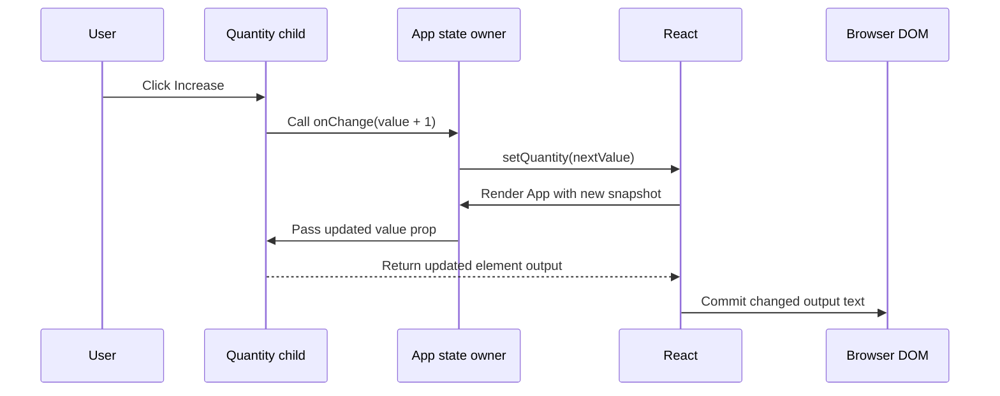

The sequence emphasizes ownership. The child does not mutate the parent's state. It reports intent through `onChange`; the parent queues the update; React renders a new snapshot; and only then does the committed DOM display the new quantity.

React uses synthetic event objects with browser-like APIs. Use `preventDefault()` to stop a form's default navigation when managing submission in React. Use `stopPropagation()` sparingly because it changes ancestor event behavior and can make component composition surprising.

```jsx
// Wrong: save runs while rendering.
<button onClick={save()}>Save</button>

// Correct: React receives a function to call after the click.
<button onClick={save}>Save</button>
```

## Conditional Rendering

React uses JavaScript control flow to choose elements:

```jsx
function AccountPanel({ status, account }) {
	if (status === "loading") return <p>Loading account...</p>;
	if (status === "failed") return <p role="alert">Account unavailable.</p>;
	if (!account) return null;

	return (
		<section>
			<h2>{account.name}</h2>
			{account.overdrawn && <strong>Action required</strong>}
		</section>
	);
}
```

Prefer explicit early returns for substantially different states. Be careful with `count && <Badge />`: when `count` is `0`, React renders `0`. Use `count > 0 && ...` when zero should render nothing.

## Lists and Keys

```jsx
function Orders({ orders }) {
	if (!orders.length) return <p>No orders.</p>;
	return <ul>{orders.map((o) => <li key={o.id}>{o.number}: {o.status}</li>)}</ul>;
}

// Wrong: random keys remount every row.
items.map((item) => <Row key={Math.random()} item={item} />);
// Correct: stable data identity preserves row state through reordering.
items.map((item) => <Row key={item.id} item={item} />);
```

Keys identify siblings, not global records. React uses type and key to match old and new children. Stable data IDs preserve row state during reordering. Array indexes are acceptable only when a list is static and cannot be reordered, filtered, inserted into, or deleted from.

### Rendering and Memory Behavior

Mapping creates new element descriptions in JavaScript memory. React reconciles them against existing child Fibers. Matching rows can preserve component state and DOM; removed rows unmount and become garbage-collection candidates after references and cleanup are released.

## Forms: Controlled and Uncontrolled

### Controlled Example

```jsx
function SearchForm({ onSearch }) {
	const [query, setQuery] = useState("");

	function submit(event) {
		event.preventDefault();
		const normalized = query.trim();
		if (normalized) onSearch(normalized);
	}

	return (
		<form onSubmit={submit}>
			<label>
				Search products
				<input value={query} onChange={(event) => setQuery(event.target.value)} />
			</label>
			<button disabled={!query.trim()}>Search</button>
		</form>
	);
}
```

Every change updates state and renders `SearchForm`. This enables immediate validation and dependent UI. Keep this state near the input so the entire page does not render on every keystroke.

### Uncontrolled Example

```jsx
function NewsletterForm({ subscribe }) {
	function submit(event) {
		event.preventDefault();
		const data = new FormData(event.currentTarget);
		subscribe(data.get("email"));
	}

	return (
		<form onSubmit={submit}>
			<label>Email <input name="email" type="email" required /></label>
			<button>Subscribe</button>
		</form>
	);
}
```

The browser owns the current input value. React does not render per keystroke unless another update occurs. This approach suits simple forms and libraries such as React Hook Form.

## Styling React Applications

React does not require one styling solution:

| Approach | Strength | Tradeoff |
|---|---|---|
| Plain stylesheet | Simple, cacheable, platform-native | Naming and global cascade need discipline |
| CSS Modules | Build-time local class names | Requires build-tool integration |
| Styled Components | Props can drive colocated runtime styles | Runtime work, SSR configuration, library dependency |
| Tailwind CSS | Fast utility composition and constrained tokens | Long class lists and build/content configuration |

```jsx
// CSS Module integration
import styles from "./Button.module.css";

function Button({ variant = "primary", children, ...buttonProps }) {
	return (
		<button className={`${styles.button} ${styles[variant]}`} {...buttonProps}>
			{children}
		</button>
	);
}
```

Choose a styling approach at the team/design-system level. Preserve semantic elements and accessibility regardless of visual implementation. Styling choices can affect bundle size, runtime memory, server rendering, and cache behavior.

## Complete Real-Project Example

```jsx
function ProductCatalog({ products, onAddToCart }) {
	const [query, setQuery] = useState("");
	const [inStockOnly, setInStockOnly] = useState(false);

	const normalizedQuery = query.trim().toLowerCase();
	const visibleProducts = products.filter((product) => {
		const matchesName = product.name.toLowerCase().includes(normalizedQuery);
		const matchesStock = !inStockOnly || product.stock > 0;
		return matchesName && matchesStock;
	});

	return (
		<section aria-labelledby="catalog-title">
			<h1 id="catalog-title">Product catalog</h1>
			<input
				aria-label="Search products"
				value={query}
				onChange={(event) => setQuery(event.target.value)}
			/>
			<label>
				<input
					type="checkbox"
					checked={inStockOnly}
					onChange={(event) => setInStockOnly(event.target.checked)}
				/>
				In stock only
			</label>

			{visibleProducts.length ? (
				<ul>
					{visibleProducts.map((product) => (
						<li key={product.id}>
							<ProductCard product={product} onAddToCart={onAddToCart} />
						</li>
					))}
				</ul>
			) : <p>No matching products.</p>}
		</section>
	);
}
```

Important behavior:

1. The component stores only user-controlled filters.
2. `visibleProducts` is derived during render, avoiding duplicated state and synchronization effects.
3. Typing or checking the box renders the catalog with a new snapshot.
4. Stable product IDs preserve card identity.
5. Memoization is unnecessary until profiling proves filtering or child rendering is expensive.
6. For a very large catalog, server filtering, deferred rendering, pagination, or virtualization may be better than `useMemo` alone.

## Real-World Applications

| Domain | Fundamentals in practice |
|---|---|
| E-commerce | Product props, cart state, keyed results, controlled checkout fields |
| Student management | Student rows, enrollment conditions, shared filters |
| Banking | Account summaries, transfer-state validation, explicit status UI |
| CRM | Lead cards, pipeline lists, callback-driven actions |
| Dashboard | Composed widgets with isolated loading and error states |
| HRMS | Controlled leave requests and conditional approval actions |
| Food ordering | Menu options, quantity state, derived basket totals |
| Chat | Message keys, draft state, event-driven sending |
| Social media | Feed items, reaction events, optimistic visible state |

The patterns remain the same across domains: identify state ownership, pass data down, report events up, derive output, preserve identity, and synchronize external systems outside render.

## Mistakes, Best Practices, and Performance

| Level | Common mistake | Production correction |
|---|---|---|
| Beginner | Mutating props or state | Create replacement objects/arrays and preserve ownership |
| Beginner | Invoking handlers during render | Pass a function reference or wrapper |
| Beginner | Missing/stable key problems | Use a persistent data ID among siblings |
| Intermediate | Copying props into state | Derive values unless an independent editable draft is required |
| Intermediate | Storing every calculated value | Keep minimal state and calculate pure output during render |
| Intermediate | Lifting input state too high | Colocate rapidly changing state with its narrow consumer |
| Senior | Memoizing every component | Profile production behavior and optimize measured hot paths |
| Senior | Treating React as the entire architecture | Define routing, data, security, testing, and deployment boundaries |

Performance guidance:

- A component render costs JavaScript even if React commits no DOM change.
- DOM changes may trigger browser style, layout, and paint work.
- Keep rendering pure and inexpensive; move external synchronization to events, effects, or data layers.
- Split components by responsibility, not solely to reduce line count.
- Use route/feature lazy loading for meaningful bundle boundaries.
- Avoid memoization until repeated expensive work and stable inputs are demonstrated.
- Test production builds because development checks and source tooling change performance.

---

<a id="module-2-react-internals"></a>
# Module 2: React Internals

[Previous: Fundamentals](#module-1-react-fundamentals) | [Next: Lifecycle](#module-3-component-lifecycle)

## Introduction

React internals explain observable application behavior: why a component can render without changing the DOM, why a changed key resets state, why effects need cleanup, why Strict Mode repeats development work, and how transitions keep urgent input responsive.

The most important boundary is that React and the browser perform different jobs:

- **React** calculates a desired host tree, tracks component state, schedules updates, reconciles identities, and commits host operations.
- **The browser** owns DOM nodes, style calculation, layout geometry, painting, compositing, event delivery, and pixels on the screen.
- **JavaScript memory** contains elements, Fibers, update queues, hook state, closures, application data, and references to browser objects.

React internals are useful mental models, not public application APIs. Fiber fields, lane constants, effect flags, and implementation file names may change between releases. Production code should depend on documented React behavior rather than private fields.

### Why React Introduced an Abstraction over DOM Updates

Direct DOM manipulation is not inherently slow or incorrect. The difficulty appears when a large product has many states and every state transition must manually update all affected nodes while preserving consistency. React provides a declarative state-to-UI model and centralizes update coordination.

| Concern | Manual imperative coordination | React coordination |
|---|---|---|
| Source of truth | Can become split between data and DOM | Component state/props/context describe output |
| Update logic | Developer selects every mutation | React reconciles previous and next output |
| Reuse | Usually convention-based | Components provide explicit boundaries |
| Scheduling | Commands execute when called | Updates enter React's scheduling model |
| State preservation | Developer manages node/instance identity | Type, position, and key guide identity |
| Cost | Can be optimal when carefully designed | Adds render/reconciliation overhead for consistency and composition |

## Browser Rendering Pipeline

When a browser loads an application, it parses HTML into the DOM and stylesheets into the CSSOM. It combines relevant information into a render representation, calculates geometry, paints drawing instructions, and composites layers. JavaScript and React normally execute on the main thread, so long work can delay user input and painting.

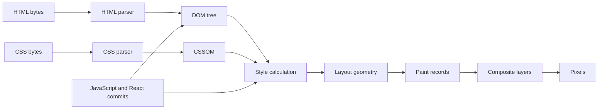

Diagram flow:

1. HTML parsing creates browser node objects in the DOM.
2. CSS parsing creates rules used by style calculation.
3. Style calculation determines applicable computed styles.
4. Layout calculates element sizes and positions.
5. Paint produces drawing commands for text, borders, images, and effects.
6. Compositing combines layers into the final frame.
7. A React commit can invalidate part of this work by changing DOM properties, structure, or styles.

### Browser Performance Consequences

Not every DOM change causes the same work:

| Change | Possible browser work |
|---|---|
| Text or color | Style and paint; layout may be unnecessary |
| Width, height, font metrics | Style, layout, paint, and composite |
| Transform or opacity on a promoted layer | Often compositing without full layout |
| Reading layout after a write | May force synchronous style/layout calculation |
| Adding thousands of nodes | DOM allocation, style matching, layout, paint, and memory growth |

> [!WARNING]
> React can reduce unnecessary DOM mutations, but it cannot make an inherently expensive layout, image, animation, or huge DOM tree free.

## DOM, Real DOM, and React Elements

The **DOM** is the browser's object representation of the document. A DOM node is mutable, participates in layout and events, and exposes methods such as `focus()`, `remove()`, and `getBoundingClientRect()`.

A **React element** is an immutable JavaScript description of desired output. It commonly includes a type, props, and key. Calling a component or evaluating JSX creates descriptions; it does not immediately create or mutate browser nodes.

"Virtual DOM" is an informal term for React's in-memory UI descriptions and comparison process. It is not one special browser API and should not be confused with the Fiber tree:

| Structure | Meaning | Mutable by application code? | Lifetime |
|---|---|---:|---|
| React element | Immutable output description | No | Usually one render calculation |
| Fiber | Internal work/state record | Never directly | Preserved while identity survives |
| DOM node | Browser host object | Through React/ref integration | Preserved while matching host identity survives |
| Component function | Reusable rendering definition | Source code, not an instance | Module lifetime |

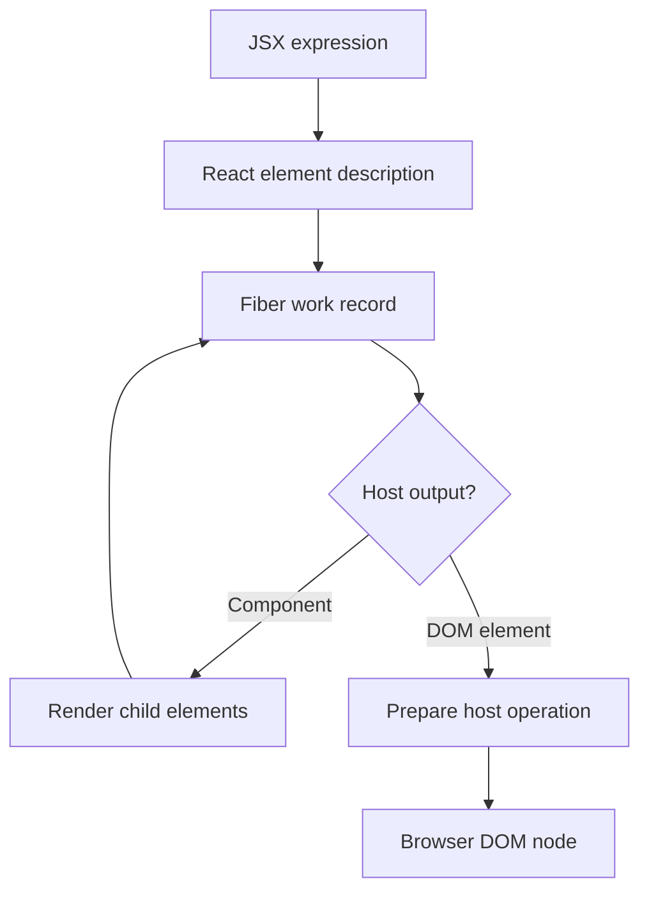

The diagram shows that JSX first becomes element data. Fiber records connect that output to preserved state and work. Only host elements such as `div`, `button`, and `input` lead to DOM operations. A component such as `ProductCard` is called to obtain more element descriptions.

## Reconciliation and the Diffing Algorithm

Reconciliation compares new element output with the current Fiber tree to determine which identities can be reused and which host operations are required. React uses practical heuristics rather than calculating the mathematically minimal edit sequence for arbitrary trees.

### Core Identity Rules

1. **Same component or host type at the same position:** preserve identity and reconcile props/children.
2. **Different type at the same position:** remove the old subtree and mount a new one.
3. **Same sibling type and key:** preserve identity even when its sibling position changes.
4. **Changed key:** create a new identity and reset state below that point.
5. **Removed child:** schedule unmount behavior and host removal.

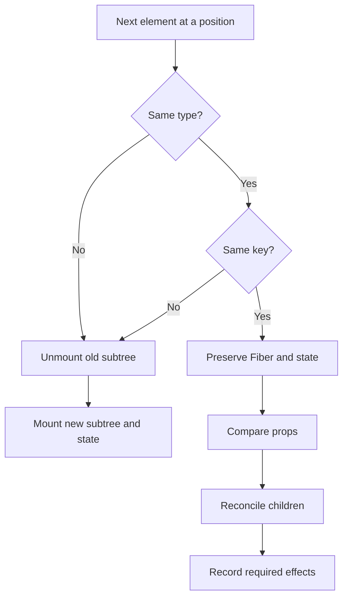

### State Preservation and Reset

```jsx
function ProfileWorkspace({ customerId }) {
	return (
		<section>
			{/* State resets intentionally when the business identity changes. */}
			<CustomerEditor key={customerId} customerId={customerId} />
		</section>
	);
}
```

Changing `customerId` changes the key, so React unmounts the previous editor identity and mounts a fresh one. This is appropriate when drafts must not leak between customers. It is inappropriate when the key changes accidentally on every render, such as `Math.random()`.

### List Reconciliation Example

```jsx
function StudentRows({ students }) {
	return students.map((student) => (
		<StudentRow key={student.id} student={student} />
	));
}
```

If a student moves from index 5 to index 1, the stable ID lets React associate the existing row state with that student. With index keys, React associates identities with positions, which can move input state, focus, or animation state to the wrong record.

> [!NOTE]
> A key only needs to be unique among siblings. React does not pass `key` as a normal prop; pass the ID separately when the component needs it.

## Fiber Architecture

Before Fiber, React's older stack reconciler processed a large update synchronously once it began. Fiber, introduced with React 16, represents the tree as linked units of work. This architecture supports priorities, interruption before commit, error boundaries, Suspense coordination, and concurrent rendering features.

A Fiber conceptually records information such as:

- Component or host type and key
- Parent, first child, and sibling relationships
- Current props and memoized state
- Hook state and update queues
- Pending work priority
- Flags describing commit work
- A link to the alternate Fiber in the other tree

These are conceptual categories, not a stable public schema.

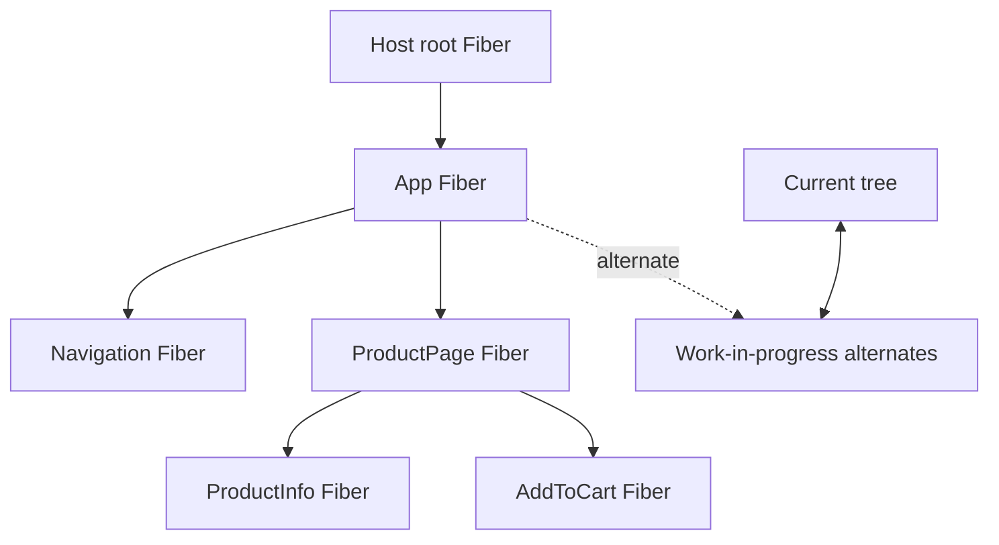

### Current and Work-in-Progress Trees

React maintains a current committed tree and prepares changes in work-in-progress Fibers. The work-in-progress tree can reuse alternate records rather than allocating an entirely unrelated permanent tree for every update.

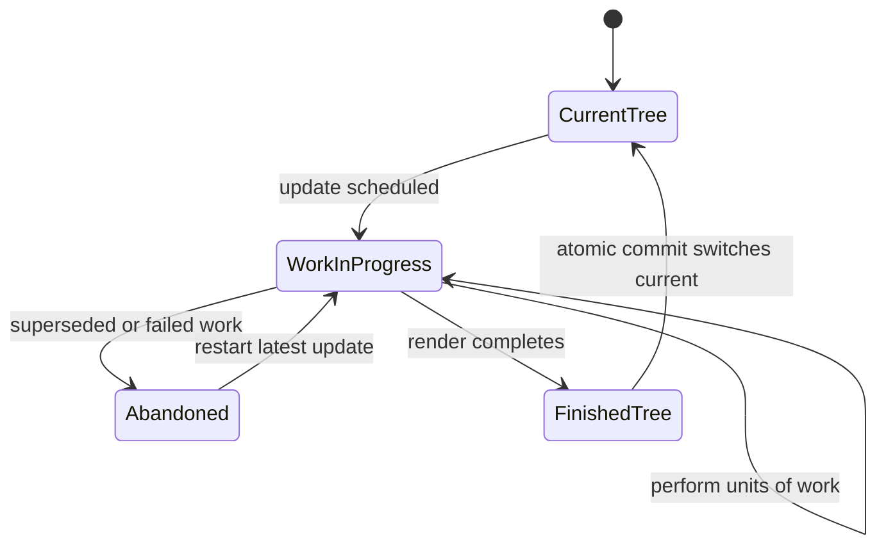

The state diagram explains why render must be restartable. Work that has not committed may be abandoned. Application-visible side effects during render would therefore run without a corresponding committed UI.

### Fiber Memory Behavior

While a component is mounted, its Fiber can retain hook state, update queues, memoized values, props, and closures referenced by those values. Removed Fibers and elements become eligible for garbage collection only when no remaining application, browser, cache, timer, subscription, or developer-tool reference retains them.

## Update Queues, Lanes, and the Scheduler

Calling a setter creates/enqueues an update associated with the relevant Fiber. React classifies work into priority lanes so urgent interaction can be processed before non-urgent rendering. The scheduler coordinates when render work should run or yield to the browser.

Important principles:

- A setter requests work; it does not mutate the current render's variable.
- Multiple queued updater functions are processed in order.
- Urgent input should not be blocked behind expensive non-urgent results.
- React may render lower-priority work later or restart it with newer inputs.
- Once a selected tree enters commit, React does not expose a half-committed tree.

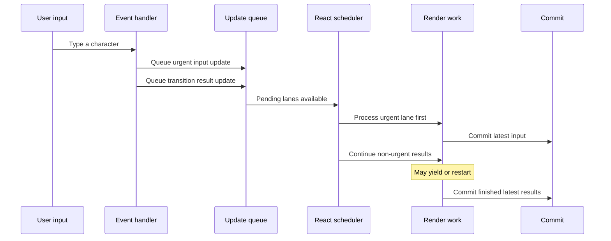

This sequence does not imply parallel JavaScript threads. It shows priority and interruptibility in React's render coordination.

## Render Phase

The render phase calculates the next UI and required work. At a high level React:

1. Selects pending lanes to process.
2. Begins at an affected Fiber/root.
3. Calls function components or class `render` methods.
4. Processes hooks and update queues for the selected work.
5. Reconciles returned children.
6. Records flags for insertions, updates, deletions, refs, and effects.
7. Completes the tree or yields/restarts before commit.

Render must not perform observable external mutation.

```jsx
// Wrong: an abandoned or repeated render still sends analytics.
function Product({ product }) {
	analytics.track("product_rendered", { id: product.id });
	return <h2>{product.name}</h2>;
}

// Correct: track the business event caused by user intent.
function Product({ product }) {
	function selectProduct() {
		analytics.track("product_selected", { id: product.id });
	}

	return <button onClick={selectProduct}>{product.name}</button>;
}
```

Pure rendering permits repeated calls with no external difference until commit. Calculations, local variable creation, and reading props/state are appropriate. Network requests, subscriptions, DOM mutation, timers, and analytics mutation belong in event handlers, effects, or dedicated integration layers.

### Render Without DOM Mutation

A parent update can call a child again even when the child returns equivalent host output. React still paid component and reconciliation CPU cost, but commit may have no host changes.

```jsx
function Greeting({ name }) {
	console.log("Greeting rendered");
	return <p>Hello, {name}</p>;
}
```

If the parent renders while `name` remains identical, the log can run again while the existing `p` and text remain unchanged. This distinction is essential when profiling.

## Commit Phase

Commit applies a finished render result to the host environment. Unlike concurrent render work, the selected commit is synchronous from the application's perspective so users do not observe a partially applied tree.

A simplified commit sequence is:

1. **Before mutation:** capture information needed before host changes, including class snapshots.
2. **Mutation:** insert, update, or remove host nodes and detach affected refs.
3. **Layout:** attach refs and run layout effects/class post-commit lifecycle work.
4. **Browser opportunity:** style, layout, and paint occur as required.
5. **Passive effects:** React later flushes `useEffect` cleanup/setup work.

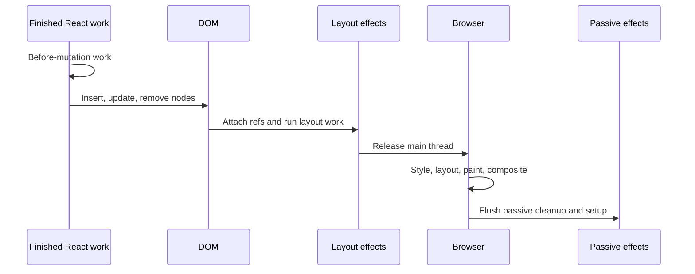

`useLayoutEffect` can read the committed DOM and synchronously queue correction before paint, but it blocks painting. `useEffect` is preferable for work that does not need to affect the current frame.

## Complete Rendering Pipeline

For a state update caused by a click:

1. The browser dispatches the click event.
2. React's event handler executes with the current render snapshot.
3. A state setter enqueues one or more updates.
4. React batches eligible updates until the event work completes.
5. The scheduler chooses lanes to process.
6. React creates/updates work-in-progress Fibers.
7. Components run and return element descriptions.
8. Reconciliation preserves or replaces identities.
9. React records required host and effect work.
10. A completed tree enters commit.
11. DOM mutations and layout work run.
12. The browser recalculates and paints only what its engine determines is invalidated.
13. Passive effects clean up previous synchronization and establish the next synchronization.

```mermaid
flowchart LR
	EV[Browser event] --> EH[React handler]
	EH --> UQ[Update queues]
	UQ --> BA[Batch eligible work]
	BA --> SC[Select lanes]
	SC --> RE[Render Fibers]
	RE --> DI[Diff identities]
	DI --> FW[Finished work]
	FW --> CM[Commit host changes]
	CM --> BP[Browser pipeline]
	BP --> PE[Passive effects]
```

This end-to-end model separates an update request, React calculation, host mutation, and browser rendering. Performance investigation should identify which stage is actually expensive.

## Concurrent Rendering

Concurrent rendering is React's ability to prepare certain UI work interruptibly before commit. It does not mean components execute safely on background threads, and it does not make all updates asynchronous. Urgent controlled inputs still need immediate state updates.

```jsx
import { useState, useTransition } from "react";

function SearchWorkspace() {
	const [query, setQuery] = useState("");
	const [filter, setFilter] = useState("");
	const [isPending, startTransition] = useTransition();

	function handleChange(event) {
		const nextQuery = event.target.value;
		setQuery(nextQuery); // Urgent: keep the controlled input responsive.
		startTransition(() => {
			setFilter(nextQuery); // Non-urgent: expensive results may lag.
		});
	}

	return (
		<>
			<input value={query} onChange={handleChange} />
			{isPending && <span>Updating results...</span>}
			<ExpensiveResults filter={filter} />
		</>
	);
}
```

If another keystroke arrives while results are rendering, React can prioritize the new input and supersede obsolete result work. This improves responsiveness but does not reduce the cost of `ExpensiveResults`; optimize or virtualize it when necessary.

### Tearing and External Stores

Concurrent rendering can expose inconsistency if components read a mutable external store at different times. `useSyncExternalStore` provides React with a subscription and stable snapshot contract so a committed tree observes a consistent external state.

## Automatic Batching

Batching groups multiple state updates into fewer render/commit cycles. With a React 18 `createRoot`, updates in React events, promises, timers, and native event callbacks are generally batched.

```jsx
function SaveButton() {
	const [status, setStatus] = useState("idle");
	const [savedCount, setSavedCount] = useState(0);

	async function save() {
		setStatus("saving");
		await api.save();
		setSavedCount((current) => current + 1);
		setStatus("saved");
	}

	return <button onClick={save}>{status}: {savedCount}</button>;
}
```

After the promise resolves, the count and status updates can be processed in one render. Batching improves throughput; it does not change snapshot semantics. Functional updaters remain necessary when next state depends on previous pending state.

`flushSync` can force React to commit synchronously for rare browser/third-party integration requirements. It defeats batching and can expose fallbacks or hurt responsiveness, so it should not be routine application code.

## Strict Mode

Strict Mode enables development-only checks for behavior that is unsafe under modern rendering. It can:

- Call component render logic more than once to expose impure calculations
- Invoke state initializer/updater functions more than once in development checks
- Run an additional effect setup-cleanup-setup cycle on initial mount
- Warn about deprecated or unsafe patterns

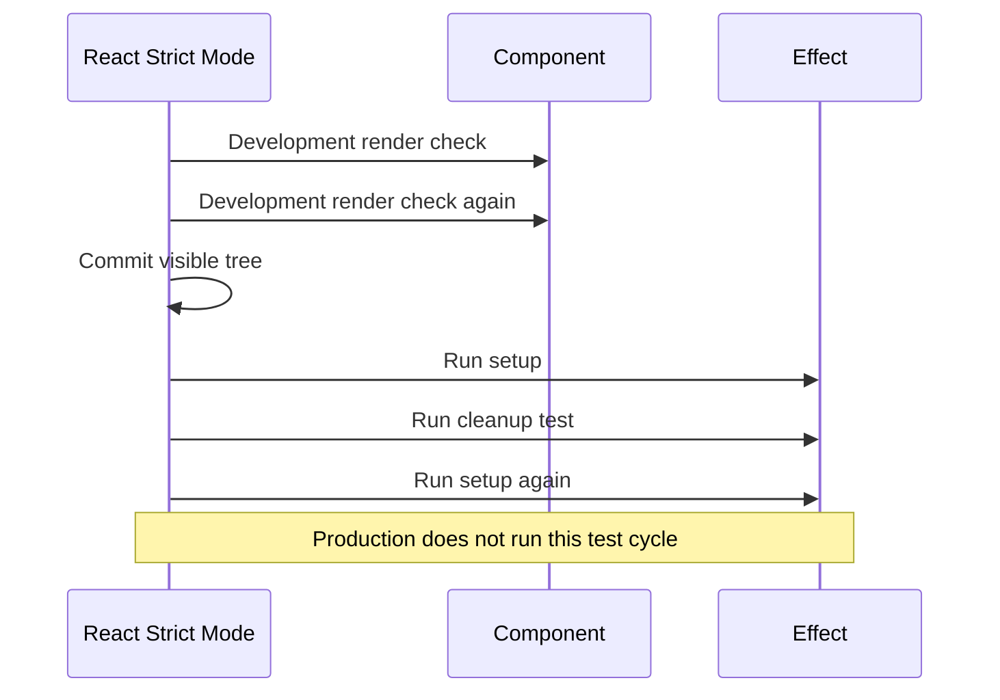

### Incorrect and Correct Cleanup

```jsx
// Wrong: no cleanup, so remount/testing can retain duplicate listeners.
useEffect(() => {
	window.addEventListener("resize", handleResize);
}, []);

// Correct: cleanup mirrors setup.
useEffect(() => {
	window.addEventListener("resize", handleResize);
	return () => window.removeEventListener("resize", handleResize);
}, []);
```

Disabling Strict Mode hides evidence; it does not repair impure rendering or leaked synchronization.

## Hydration and Server-Rendered Output

Hydration attaches React behavior to compatible HTML that was already generated on a server. React expects the client component tree to produce matching initial output. Differences caused by timestamps, random values, browser-only branches, locale mismatches, or invalid HTML can produce hydration warnings and replacement work.

```jsx
// Wrong for deterministic server/client first output.
function RequestId() {
	return <span>{Math.random()}</span>;
}

// Appropriate for stable accessibility relationships.
function EmailField() {
	const id = useId();
	return <><label htmlFor={id}>Email</label><input id={id} /></>;
}
```

Server rendering creates HTML; it does not preserve a server Fiber tree in the browser. The client creates its own React structures while hydrating the existing host nodes.

## Memory Model and Garbage Collection

React participates in JavaScript memory management but does not replace garbage collection. Memory remains reachable through references.

| Retained object | Common retaining reference | Release strategy |
|---|---|---|
| Component/Fiber state | Mounted tree | Unmount or replace identity |
| Subscription callback | External event source | Unsubscribe in cleanup |
| Timer closure | Browser timer queue | Clear timer in cleanup |
| In-flight request callback | Promise/request | Abort and ignore obsolete completion |
| Cached data | Store/query cache | Expiration, eviction, bounded policy |
| DOM node | Ref or third-party library | Clear integration and destroy plugin |
| Large memoized value | Mounted hook state | Remove unnecessary memo or unmount owner |

### Memory Leak Example

```jsx
function LivePrices({ productId }) {
	useEffect(() => {
		const subscription = prices.subscribe(productId, updatePrice);
		return () => subscription.unsubscribe();
	}, [productId]);

	return <PriceDisplay productId={productId} />;
}
```

When `productId` changes, cleanup releases the old subscription before the new synchronization is established. On unmount, final cleanup lets the external source release the callback closure and captured references.

## Performance Analysis

Separate four kinds of cost:

1. **Scheduling and queueing:** usually small, but update storms can accumulate work.
2. **Render/reconciliation:** JavaScript CPU spent calling components and comparing output.
3. **Commit:** refs, effects, and DOM mutations.
4. **Browser rendering:** style, layout, paint, compositing, and image work.

Use the React DevTools Profiler for component render and commit information. Use browser Performance and Memory tools for long tasks, event timing, forced layouts, paint, allocations, and retained objects. Measure a production build because development checks and source instrumentation change results.

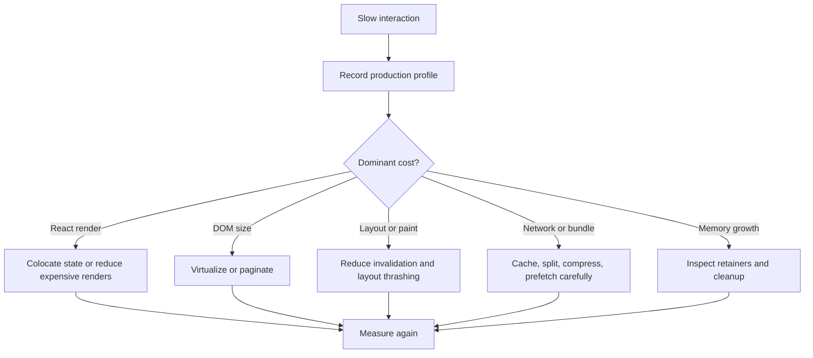

### Common Performance Problems

- State placed at the application root causes broad render work for local interactions.
- Unstable objects/functions defeat memoized child props.
- Huge lists create excessive React work and browser DOM/layout cost.
- Layout reads immediately after DOM/style writes force synchronous calculation.
- Effects trigger chains of state updates and additional commits.
- Duplicate server data is copied into several stores and drifts.
- Overuse of memoization increases comparison work and retained memory.

## Real-World Internal Flows

### E-Commerce Search

Typing updates the controlled input urgently. Product filtering can be deferred or transitioned. A virtualized result list controls DOM size. Stable product keys preserve row identity. Remote requests should be canceled or keyed in a server-state cache.

### Banking Transfer

Form input remains urgent and controlled. A submit event starts the external mutation. Pending/success/failure states create explicit render snapshots. Authorization occurs on the API. A transaction ID provides stable business identity; sensitive data must not appear in logs or client bundles.

### Chat Application

A subscription effect acquires a room connection after commit and releases it when the room changes. Incoming messages enqueue updates. Stable message IDs preserve rows. Windowing limits DOM size, while cleanup prevents callbacks from retaining unmounted room state.

### Analytics Dashboard

Route-level code splitting reduces initial modules. Query caching avoids duplicate remote work. A chart boundary isolates failures. Expensive chart layout can dominate browser paint even when React reconciliation is efficient, so both React and browser profiles are required.

## Common Mistakes and Production Best Practices

| Mistake | Why it fails | Better approach |
|---|---|---|
| Calling APIs during render | Render may repeat or be abandoned | Event handler, effect with cleanup, or data layer |
| Treating Virtual DOM as always faster | React calculation also costs CPU | Measure complete interaction cost |
| Random or index keys in changing lists | Identity/state attaches to wrong row | Stable data identifiers |
| Assuming render means DOM change | Reconciliation may find no host difference | Profile render and commit separately |
| Disabling Strict Mode to stop duplicates | Hides impurity/leaks | Make setup idempotent and add cleanup |
| Using transitions for controlled input state | Input can lag behind typing | Keep input urgent; transition slow consumers |
| Reading private Fiber fields | Internal schema is unsupported | Depend on documented behavior and DevTools |
| Memoizing everything | Adds comparisons and retains values | Optimize measured expensive paths |

Production guidance:

- Keep render deterministic and free of external mutation.
- Preserve identity deliberately with component type, position, and stable keys.
- Treat effects as synchronization processes with symmetric cleanup.
- Keep urgent interaction separate from non-urgent expensive rendering.
- Bound DOM size through pagination or virtualization.
- Use React Profiler and browser tooling together.
- Confirm behavior in production builds and representative devices.
- Document performance budgets and validate them in delivery pipelines.

---

<a id="module-3-component-lifecycle"></a>
# Module 3: Component Lifecycle

[Previous: Internals](#module-2-react-internals) | [Next: Hooks](#module-4-react-hooks)

## Introduction

A component lifecycle describes how a component identity is created, rendered, committed, updated, and removed from the React tree. Lifecycle is not simply the amount of time a function or class exists in memory. It follows the identity React preserves through component type, tree position, and key.

Three high-level lifecycle phases are visible to application developers:

1. **Mount:** React creates a component identity and commits its initial host output.
2. **Update:** existing identity receives new props, state, or context and may commit changed output.
3. **Unmount:** React removes that identity, runs cleanup, detaches refs, and removes associated host output.

Class components expose named lifecycle methods. Function components do not have equivalent methods for every phase. They render snapshots and use effects to synchronize independent external processes. This distinction matters: `useEffect` is not a generic "after lifecycle" callback and should not be used for pure calculations or user actions.

### Why Lifecycle APIs Exist

Rendering describes UI, but applications also interact with systems outside React:

- Network requests and streaming connections
- Browser event listeners and observers
- Timers and animation APIs
- Document title, focus, and selection
- Third-party widgets and imperative libraries
- Logging, monitoring, and analytics

Lifecycle APIs define safe times to acquire, update, and release those resources relative to React's commits.

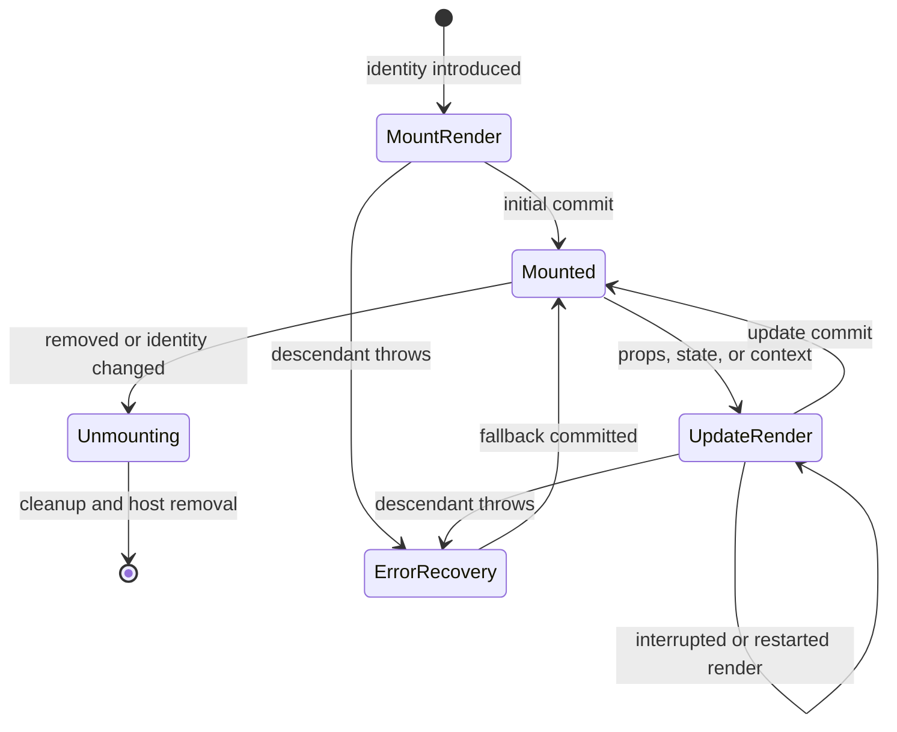

The state diagram separates render from commit. Mount and update rendering can be repeated before React commits. Cleanup occurs when synchronization dependencies change or when the component identity is removed. An ancestor error boundary can replace a failed subtree with fallback UI.

## Lifecycle and React Phases

Lifecycle methods and hooks execute within React's broader render and commit phases:

| React work | Class component | Function component | May perform side effects? |
|---|---|---|---:|
| Render calculation | `constructor`, `render`, static derived state | component body, state/reducer calculations | No |
| Optional render bailout | `shouldComponentUpdate` | `memo`, unchanged state, compiler/store optimizations | No |
| Before DOM mutation | `getSnapshotBeforeUpdate` | specialized layout-effect cleanup behavior | Read only for snapshot purpose |
| Layout commit work | `componentDidMount`, `componentDidUpdate` | `useLayoutEffect` setup | Yes, but blocks paint |
| Passive commit work | No direct class equivalent with identical timing | `useEffect` cleanup/setup | Yes |
| Removal | `componentWillUnmount` | layout/passive effect cleanup | Release resources |

> [!WARNING]
> Constructors, render methods, component functions, reducer functions, state initializers, and `shouldComponentUpdate` belong to render calculation. They must remain pure because React may invoke or discard render work.

## Class Component Lifecycle

Class components remain fully supported. They are especially important when maintaining established enterprise applications and when implementing error boundaries.

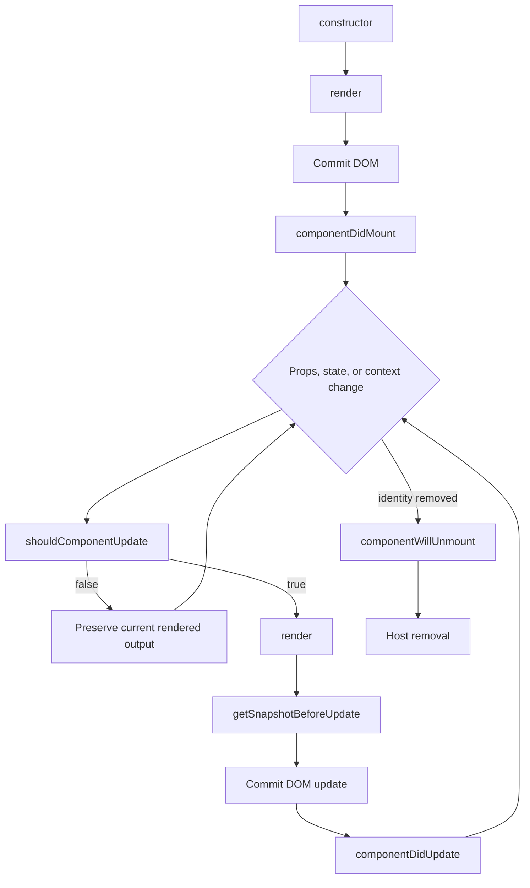

This is a simplified application-facing sequence. Context updates and error recovery can affect paths, and React's internal implementation contains additional work. The key rule is that render-side methods calculate, while did-mount/did-update/unmount methods synchronize around committed output.

### `constructor(props)`

The constructor initializes class state and binds methods when class-field syntax is not used.

```jsx
import { Component } from "react";

class OrderEditor extends Component {
	constructor(props) {
		super(props);
		this.state = {
			note: props.initialNote ?? "",
			saving: false,
		};
		this.handleNoteChange = this.handleNoteChange.bind(this);
	}

	handleNoteChange(event) {
		this.setState({ note: event.target.value });
	}

	render() {
		return <textarea value={this.state.note} onChange={this.handleNoteChange} />;
	}
}
```

`super(props)` initializes the base `Component` instance before `this` is used. The constructor must not subscribe, request data, set timers, or read DOM nodes because nothing has committed. Copying `initialNote` is appropriate only because this component intentionally owns an editable draft; ordinary props should not be duplicated into state.

### `render()`

`render` reads props/state/context and returns elements, strings, numbers, fragments, portals, arrays of keyed elements, or `null`. It must be pure.

```jsx
render() {
	const { order } = this.props;
	const { saving } = this.state;

	if (!order) return <p>No order selected.</p>;

	return (
		<section aria-busy={saving}>
			<h2>Order {order.number}</h2>
			<button disabled={saving} onClick={this.saveOrder}>
				{saving ? "Saving..." : "Save"}
			</button>
		</section>
	);
}
```

An event callback may cause a side effect because it runs in response to user intent. Calling the side effect directly from `render` would be unsafe.

### `componentDidMount()`

`componentDidMount` runs after the initial output is committed. The DOM and refs exist, so it can establish subscriptions, integrate a widget, focus an element, or start a request.

```jsx
class OnlineStatus extends Component {
	state = { online: navigator.onLine };

	componentDidMount() {
		window.addEventListener("online", this.updateStatus);
		window.addEventListener("offline", this.updateStatus);
	}

	componentWillUnmount() {
		window.removeEventListener("online", this.updateStatus);
		window.removeEventListener("offline", this.updateStatus);
	}

	updateStatus = () => {
		this.setState({ online: navigator.onLine });
	};

	render() {
		return <output>{this.state.online ? "Online" : "Offline"}</output>;
	}
}
```

The unmount method mirrors mount setup. Without cleanup, the browser retains the callback and class instance after removal.

### `shouldComponentUpdate(nextProps, nextState)`

This method can return `false` to skip rendering for an update. It is a performance optimization, not a correctness mechanism.

```jsx
shouldComponentUpdate(nextProps, nextState) {
	return (
		nextProps.product !== this.props.product ||
		nextState.expanded !== this.state.expanded
	);
}
```

Manual comparison is easy to get wrong. A skipped render also skips update lifecycle methods for that update. Prefer normal rendering unless profiling identifies a costly path; then use immutable data and a complete comparison or extend `PureComponent`, which performs shallow prop/state comparison.

> [!NOTE]
> Returning `false` does not permanently prevent all future rendering, and it should never be used to hide state synchronization defects.

### `getSnapshotBeforeUpdate(previousProps, previousState)`

This method runs after render has calculated updated output but immediately before React mutates the DOM. It captures information that would otherwise be lost, such as scroll position.

```jsx
class MessageList extends Component {
	listRef = React.createRef();

	getSnapshotBeforeUpdate(previousProps) {
		if (previousProps.messages.length < this.props.messages.length) {
			const list = this.listRef.current;
			return list.scrollHeight - list.scrollTop;
		}
		return null;
	}

	componentDidUpdate(_previousProps, _previousState, snapshot) {
		if (snapshot !== null) {
			const list = this.listRef.current;
			list.scrollTop = list.scrollHeight - snapshot;
		}
	}

	render() {
		return (
			<ul ref={this.listRef}>
				{this.props.messages.map((message) => (
					<li key={message.id}>{message.text}</li>
				))}
			</ul>
		);
	}
}
```

The returned snapshot becomes the third argument to `componentDidUpdate`. Do not perform asynchronous work here; capture the minimum pre-mutation value.

### `componentDidUpdate(previousProps, previousState, snapshot)`

This method runs after an update commits. It can synchronize an external system based on what changed, but conditions are essential to avoid loops.

```jsx
componentDidUpdate(previousProps) {
	if (previousProps.roomId !== this.props.roomId) {
		this.disconnectFromRoom(previousProps.roomId);
		this.connectToRoom(this.props.roomId);
	}
}
```

Calling `setState` unconditionally from `componentDidUpdate` creates a render-update loop. Guard by comparing previous and current values, or redesign the state so no synchronization update is needed.

### `componentWillUnmount()`

Unmount runs before a component identity and committed host subtree are removed. It must release every owned external resource:

```jsx
componentWillUnmount() {
	this.abortController?.abort();
	this.subscription?.unsubscribe();
	window.clearInterval(this.intervalId);
	this.widget?.destroy();
}
```

Do not call `setState` during unmount; the component will not render again. Cleanup should be idempotent where practical because integrations may already be closed.

## Complete Class Lifecycle Example

```jsx
class ChatRoom extends Component {
	state = { messages: [], status: "connecting" };

	componentDidMount() {
		this.connect(this.props.roomId);
	}

	componentDidUpdate(previousProps) {
		if (previousProps.roomId !== this.props.roomId) {
			this.disconnect();
			this.setState({ messages: [], status: "connecting" });
			this.connect(this.props.roomId);
		}
	}

	componentWillUnmount() {
		this.disconnect();
	}

	connect(roomId) {
		this.connection = chatApi.subscribe(roomId, {
			onOpen: () => this.setState({ status: "connected" }),
			onMessage: (message) => {
				this.setState(({ messages }) => ({ messages: [...messages, message] }));
			},
		});
	}

	disconnect() {
		this.connection?.unsubscribe();
		this.connection = null;
	}

	render() {
		return (
			<section aria-busy={this.state.status === "connecting"}>
				<p>Status: {this.state.status}</p>
				<MessageList messages={this.state.messages} />
			</section>
		);
	}
}
```

One synchronization concern is distributed across mount, update, and unmount methods. This fragmentation is one reason hooks model synchronization by concern instead of by lifecycle phase.

## Function Component Lifecycle

A function component has no persistent function instance. React calls the function for each render and associates state/effects with the preserved Fiber identity. Local variables belong to one render snapshot; refs and hook state survive through React's bookkeeping.

### Functional Mount Flow

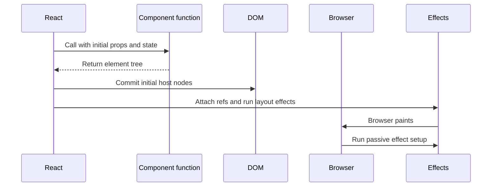

Mount execution:

1. State initializers and component logic run during render.
2. React reconciles the returned elements.
3. Commit creates/updates host nodes and attaches refs.
4. Layout effects run before paint.
5. The browser paints.
6. Passive effects normally run after commit/paint opportunity.

### Functional Update Flow

An update begins when state, parent rendering, consumed context, or an external-store subscription changes.

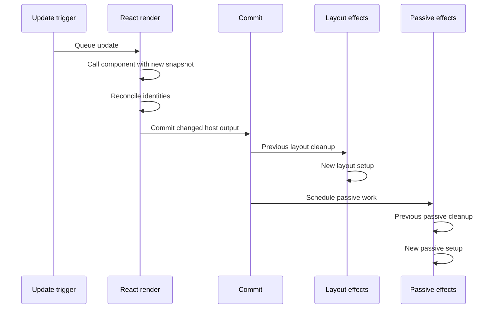

Only effects whose dependency comparisons indicate a change need resynchronization. Effects without a dependency array run after every relevant commit; `[]` effects rerun when the component remounts and receive an extra development test cycle under Strict Mode.

### Functional Unmount Flow

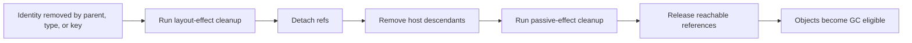

Garbage collection is not immediate or controlled by React. Cleanup removes external references so unreachable Fibers, closures, and DOM-related objects can become eligible.

## Effects as Synchronization Processes

An effect should describe one independent synchronization relationship: connect to a room, observe an element, control a map widget, or report a committed page view. Setup acquires/configures the external resource; cleanup reverses that work.

```jsx
import { useEffect, useState } from "react";

function ChatRoom({ roomId }) {
	const [messages, setMessages] = useState([]);
	const [status, setStatus] = useState("connecting");

	useEffect(() => {
		setMessages([]);
		setStatus("connecting");

		const connection = chatApi.subscribe(roomId, {
			onOpen: () => setStatus("connected"),
			onMessage: (message) => {
				setMessages((current) => [...current, message]);
			},
		});

		return () => connection.unsubscribe();
	}, [roomId]);

	return (
		<section aria-busy={status === "connecting"}>
			<p>Status: {status}</p>
			<MessageList messages={messages} />
		</section>
	);
}
```

When `roomId` changes, React renders and commits the new snapshot, cleans up the old room subscription, and establishes the new one. On unmount, cleanup releases the final connection.

> [!TIP]
> If changing `roomId` represents a completely new screen identity and every nested draft should reset, key the room subtree by `roomId` instead of resetting many independent state variables in an effect.

### Dependency Arrays

```jsx
// Runs after every commit of this component.
useEffect(() => synchronize());

// Resynchronizes when roomId or serverUrl changes, and on mount/remount.
useEffect(() => {
	const connection = connect(serverUrl, roomId);
	return () => connection.disconnect();
}, [serverUrl, roomId]);

// Synchronizes with no reactive values, but still remounts and is tested by Strict Mode.
useEffect(() => {
	const listener = () => reportViewport(window.innerWidth);
	window.addEventListener("resize", listener);
	return () => window.removeEventListener("resize", listener);
}, []);
```

Dependencies are not an optimization wish list. They describe every reactive value read by setup/cleanup. Suppressing the exhaustive-deps rule can preserve stale closures and connect cleanup to the wrong resource.

### Stale Closure Example

```jsx
// Wrong: interval always sees the first count because count is omitted.
useEffect(() => {
	const id = setInterval(() => console.log(count), 1000);
	return () => clearInterval(id);
}, []);

// Correct when the interval should reflect each committed count.
useEffect(() => {
	const id = setInterval(() => console.log(count), 1000);
	return () => clearInterval(id);
}, [count]);
```

If recreating the interval is undesirable, redesign around a functional update, ref, or effect-event pattern appropriate to the actual requirement rather than lying about dependencies.

## `useEffect` Lifecycle Timing

`useEffect` is passive synchronization. It normally runs after React commits, often after the browser has painted. It is suitable for subscriptions, requests, analytics, storage coordination, and nonvisual third-party integrations.

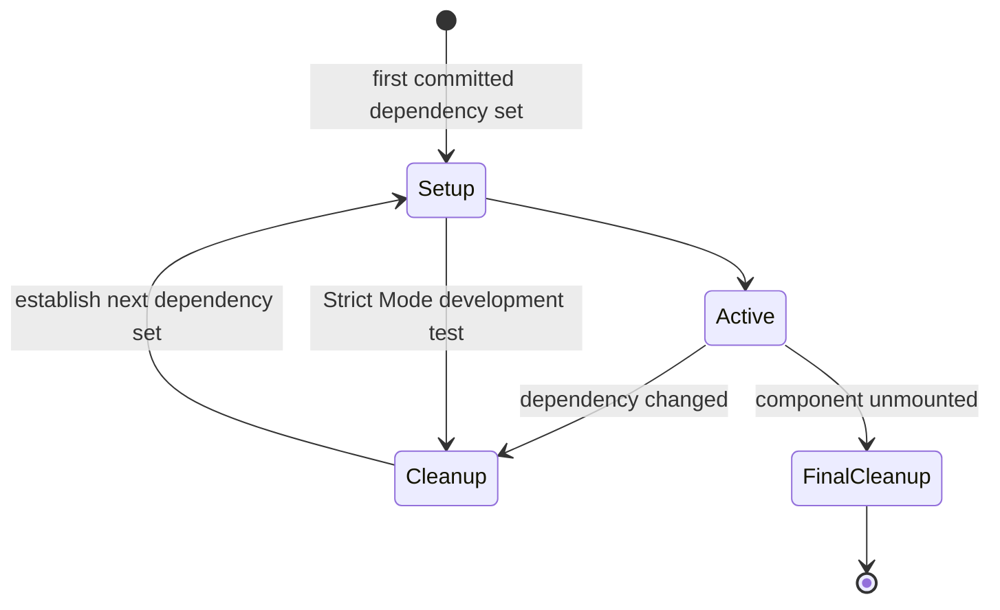

The lifecycle belongs to the synchronization process, not merely the component. A component can stay mounted while an effect repeatedly cleans up and restarts because one dependency changed.

### Cancellable Request Example

```jsx
function UserProfile({ userId }) {
	const [state, setState] = useState({ status: "loading", user: null, error: null });

	useEffect(() => {
		const controller = new AbortController();
		setState({ status: "loading", user: null, error: null });

		async function loadUser() {
			try {
				const response = await fetch(`/api/users/${userId}`, {
					signal: controller.signal,
				});
				if (!response.ok) throw new Error(`HTTP ${response.status}`);
				const user = await response.json();
				setState({ status: "succeeded", user, error: null });
			} catch (error) {
				if (error.name !== "AbortError") {
					setState({ status: "failed", user: null, error });
				}
			}
		}

		loadUser();
		return () => controller.abort();
	}, [userId]);

	if (state.status === "loading") return <Spinner />;
	if (state.status === "failed") return <p role="alert">Unable to load user.</p>;
	return <UserCard user={state.user} />;
}
```

Cancellation prevents an obsolete request from continuing to consume resources or committing stale data. Production applications with shared server state usually benefit from RTK Query or another data layer rather than repeating request lifecycle logic in components.

## `useLayoutEffect` Lifecycle Timing

`useLayoutEffect` has the same dependency/cleanup model as `useEffect`, but setup runs synchronously after DOM mutation and before the browser paints. It is intended for layout measurement or visual correction that cannot tolerate one frame of incorrect geometry.

```jsx
import { useLayoutEffect, useRef, useState } from "react";

function Tooltip({ targetRect, children }) {
	const tooltipRef = useRef(null);
	const [height, setHeight] = useState(0);

	useLayoutEffect(() => {
		const nextHeight = tooltipRef.current.getBoundingClientRect().height;
		setHeight(nextHeight);
	}, [children]);

	return (
		<div
			ref={tooltipRef}
			style={{ position: "fixed", top: targetRect.top - height }}
		>
			{children}
		</div>
	);
}
```

React first commits a measurable tooltip, the layout effect reads its geometry, and a synchronous corrective render occurs before paint. This avoids a visible jump but delays painting. Use passive effects for all work that does not require this timing.

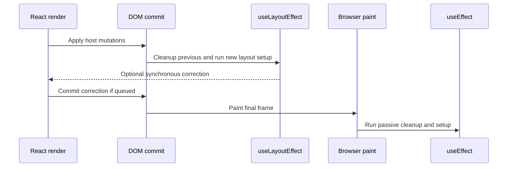

## When No Effect Is Needed

Effects are frequently overused. Do not use an effect for pure derived data, event-specific work, or resetting an entire identity.

```jsx
// Wrong: adds an unnecessary commit and can show stale data briefly.
useEffect(() => {
	setFullName(`${firstName} ${lastName}`);
}, [firstName, lastName]);

// Correct: derive during render.
const fullName = `${firstName} ${lastName}`;
```

```jsx
// Wrong: an effect observes state to infer the user just submitted.
useEffect(() => {
	if (submitted) ordersApi.create(order);
}, [submitted, order]);

// Correct: the submit event owns the action.
async function handleSubmit(event) {
	event.preventDefault();
	await ordersApi.create(order);
}
```

Removing unnecessary effects reduces render chains, synchronization bugs, and memory complexity.

## Error Boundaries

An error boundary is a class component that catches errors thrown while rendering descendants, in descendant constructors, and in descendant lifecycle methods. It commits fallback UI instead of leaving a corrupted subtree.

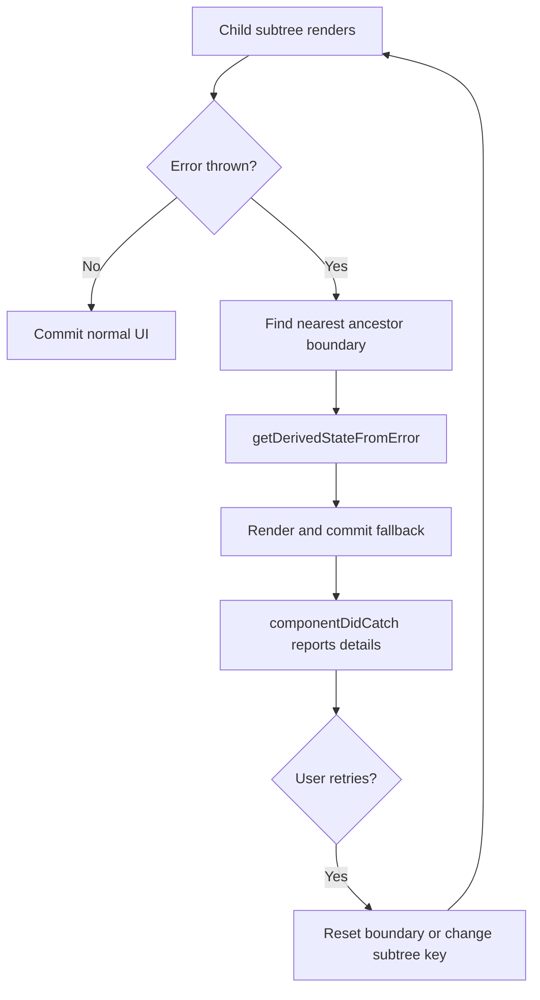

### Production Error Boundary

```jsx
class ErrorBoundary extends React.Component {
	state = { error: null, resetKey: 0 };

	static getDerivedStateFromError(error) {
		return { error };
	}

	componentDidCatch(error, info) {
		monitoring.captureException(error, {
			componentStack: info.componentStack,
			feature: this.props.feature,
		});
	}

	handleRetry = () => {
		this.setState(({ resetKey }) => ({ error: null, resetKey: resetKey + 1 }));
	};

	render() {
		if (this.state.error) {
			return <Fallback onRetry={this.handleRetry} />;
		}

		return <React.Fragment key={this.state.resetKey}>{this.props.children}</React.Fragment>;
	}
}
```

Boundaries do not catch:

- Errors thrown in event handlers (use `try/catch` or rejected-state handling)
- Arbitrary asynchronous callbacks and promise rejections
- Server/API error responses unless rendering code throws them deliberately
- Errors thrown inside the boundary itself
- Errors during server rendering for that same boundary instance

Place boundaries around routes and independently recoverable widgets. A single root boundary prevents a blank application but cannot preserve unaffected regions when one small widget fails.

## Lifecycle Identity and Remounting

A component unmounts and mounts again when its identity changes because of type, key, or tree removal.

```jsx
function CustomerPage({ customerId }) {
	return <CustomerForm key={customerId} customerId={customerId} />;
}
```

When the ID changes:

1. The old form's layout/passive cleanup runs.
2. Its local draft state is discarded.
3. React creates a new form identity with fresh hook state.
4. New host output commits.
5. New effects establish synchronization.

This is useful for deliberate reset. Accidental dynamic keys create repeated requests, lost focus, destroyed input drafts, and unnecessary allocation.

## Class vs Function Lifecycle Comparison

| Requirement | Class pattern | Function pattern |
|---|---|---|
| Initialize local state | constructor/class field | `useState` or `useReducer` initializer |
| Render output | `render()` | component function return |
| Subscribe after commit | `componentDidMount` | `useEffect` |
| Replace subscription on prop change | compare in `componentDidUpdate` | dependency-driven effect cleanup/setup |
| Release subscription | `componentWillUnmount` | effect cleanup |
| Measure before paint | snapshot/did-update combination | `useLayoutEffect` |
| Skip expensive render | `PureComponent`/`shouldComponentUpdate` | `memo` after profiling |
| Catch descendant render failure | error-boundary class | class boundary/library wrapper |
| Reuse stateful behavior | render props/HOC/helper class | custom hook |

Hooks do not make lifecycle disappear. They organize related setup and cleanup together, while class methods organize work by lifecycle phase.

## Memory Changes Across the Lifecycle

```mermaid
flowchart TB
	M[Mount] --> A[Allocate Fiber, hook/class state, closures, host nodes]
	A --> S[Effect setup adds external references]
	S --> U[Updates create snapshots and replace retained values]
	U --> C[Dependency cleanup releases old external references]
	C --> S
	U --> X[Unmount]
	X --> FC[Final cleanup and ref detachment]
	FC --> G[Unreachable objects become GC eligible]
```

Common retainers include event targets, timers, observers, subscriptions, unresolved requests, query caches, and third-party widgets. React can remove its tree references, but it cannot automatically unsubscribe from an external API that still holds a callback.

## Lifecycle Performance

- Rendering is JavaScript work even when commit makes no DOM changes.
- A layout effect blocks paint and may force synchronous layout when reading geometry.
- An effect that immediately sets state adds another render and commit.
- Repeated mount/unmount destroys caches, DOM state, focus, and subscriptions.
- Broad parent state can update many children and run their render calculations.
- Cleanup/setup churn can be costly for sockets, observers, media streams, and widgets.
- Strict Mode development behavior should reveal defects, not be used for production timing measurements.

### Optimized Subscription Ownership

```jsx
function Dashboard({ selectedRoomId }) {
	return (
		<DashboardLayout>
			<StaticNavigation />
			<ChatRoom roomId={selectedRoomId} />
		</DashboardLayout>
	);
}
```

Keep the subscription in the narrow `ChatRoom` owner rather than the entire dashboard. Room updates then affect a smaller render subtree, and cleanup responsibility remains near acquisition.

## Real-World Lifecycle Scenarios

| Domain | Mount | Update | Unmount/cleanup |
|---|---|---|---|
| E-commerce | Load or subscribe to cart state | Product/cart identity changes | Cancel obsolete requests |
| Student management | Initialize selected student workspace | Student ID or filters change | Release observers and drafts |
| Banking | Establish secure session/status listener | Account or transfer state changes | Clear sensitive timers/subscriptions |
| CRM | Connect lead activity stream | Selected lead changes | Disconnect previous lead stream |
| Dashboard | Initialize charts after host commit | Data/size/theme changes | Destroy chart instances and observers |
| HRMS | Load leave workflow | Employee or policy changes | Cancel validation and upload work |
| Food ordering | Open restaurant/menu context | Restaurant changes | Reset basket according to business rule |
| Chat | Subscribe to room | Room identity changes | Unsubscribe and release callbacks |
| Social media | Observe feed sentinel | Filter/account changes | Disconnect observer and abort pages |

## Common Mistakes and Production Best Practices

| Mistake | Result | Production correction |
|---|---|---|
| Side effect in constructor/render | Repeats during discarded render work | Move to event or effect/did-mount |
| Missing cleanup | Duplicate callbacks and retained memory | Mirror every acquired resource |
| Unconditional update in did-update/effect | Infinite or excessive render loop | Compare dependencies or derive during render |
| Empty dependency array used to silence lint | Stale closure and wrong resource | Include dependencies or restructure ownership |
| One effect handles unrelated systems | Coupled restart and difficult cleanup | Split by synchronization concern |
| Layout effect for network/analytics | Blocks paint unnecessarily | Use passive effect/data layer |
| Random key to "refresh" component | Repeated remount, lost state/focus | Stable identity; explicit reset only when required |
| Root-only error boundary | Small failure replaces entire app | Add route/widget recovery boundaries |
| Manual class bailout with incomplete comparison | Stale UI | Preserve correctness; optimize measured paths |

Production guidance:

- Treat render as a pure calculation and commit APIs as integration points.
- Pair setup and cleanup in the same conceptual concern.
- Use dependency arrays as correctness declarations.
- Cancel obsolete requests and ignore expected cancellation errors.
- Prefer explicit status state over ambiguous booleans.
- Use layout effects only for pre-paint visual requirements.
- Preserve or reset identity deliberately through type, position, and key.
- Place boundaries according to recovery scope and report errors with release context.
- Profile mount/update churn on production builds and representative devices.

---

<a id="module-4-react-hooks"></a>
# Module 4: React Hooks

[Previous: Lifecycle](#module-3-component-lifecycle) | [Next: Communication](#module-5-component-communication)

## Introduction

Hooks are React functions that let function components use state, reducers, refs, context, effects, concurrent scheduling, and external-store integration. Hooks were introduced in React 16.8 to make stateful behavior composable without class instances, higher-order wrappers, or lifecycle logic split across unrelated methods.

Hooks do not make functions stateful by storing values in local variables. React stores hook records on the component's preserved Fiber identity. Each render receives snapshots from those records and returns new element descriptions.

### Why Hooks Exist

Before hooks, reusable stateful behavior commonly required render props, higher-order components, mixins in older systems, or helper classes. Those patterns could create deep wrapper trees, prop collisions, and lifecycle fragmentation. Hooks let a custom hook colocate setup, cleanup, state, and reusable policy.

| Advantage | Tradeoff |
|---|---|
| Composes stateful behavior through functions | Call order rules must be respected |
| Keeps one synchronization concern together | Dependency mistakes create stale closures |
| Removes most wrapper components | Hooks can hide expensive or surprising behavior if poorly named |
| Works with concurrent rendering semantics | Render purity becomes non-negotiable |
| Supports focused custom APIs | Custom hooks share logic, not state automatically |

## Hook Storage and Internal Working

React associates a linked sequence of hook records with each function-component Fiber. During rendering, React advances through those records in call order. Variables such as `count` or `theme` do not identify hook state; position does.

```mermaid
flowchart LR
	F[ProductPage Fiber] --> H1[Hook 1: state queue]
	H1 --> H2[Hook 2: ref object]
	H2 --> H3[Hook 3: memo value and deps]
	H3 --> H4[Hook 4: effect and deps]
	N[Next render] --> O[Call hooks in identical order]
	O --> H1
```

On initial mount, React creates hook records. On update, it reuses the records in the same order, processes pending updates, compares dependencies with `Object.is`, and returns the current values for that render.

### Rules of Hooks

1. Call hooks only at the top level of a React function component or custom hook.
2. Do not call hooks in conditions, loops, event handlers, nested functions, or ordinary utilities.
3. Custom hook names begin with `use` so tooling can enforce these rules.
4. Components and hooks must remain pure during render.

```jsx
// Wrong: the second render may skip a hook and shift later records.
if (authenticated) {
	const [profile, setProfile] = useState(null);
}

// Correct: always call the hook; put the condition in behavior or output.
const [profile, setProfile] = useState(null);
if (!authenticated) return <Login />;
```

```mermaid
flowchart TD
	R1[Render 1 calls state, effect, ref] --> M1[Records: 1 state, 2 effect, 3 ref]
	R2[Render 2 condition skips effect] --> M2[Calls: 1 state, 2 ref]
	M2 --> E[Record 2 is misinterpreted]
	E --> B[Broken hook state association]
```

## Hook Reference

| Hook | Primary purpose | Schedules rendering? | Main production rule |
|---|---|---:|---|
| `useState` | Local state snapshot | Setter does | Use updater when next depends on previous |
| `useReducer` | Action-driven transitions | `dispatch` does | Reducer must be pure |
| `useEffect` | Passive external synchronization | Only if effect queues state | Complete dependencies and cleanup |
| `useLayoutEffect` | Pre-paint synchronization | Only if setup queues state | Blocks paint; reserve for visual measurement |
| `useRef` | Stable mutable cell or host ref | No | Do not use for visible state |
| `useMemo` | Cache calculation result | No | Optimization, not semantic storage |
| `useCallback` | Cache function identity | No | Use only when identity is observed |
| `useContext` | Read nearest provider value | Provider change does | Split broad/high-frequency contexts |
| `useImperativeHandle` | Customize exposed ref API | No by itself | Expose narrow operations |
| `useTransition` | Mark updates non-urgent | Yes | Keep controlled inputs urgent |
| `useDeferredValue` | Let a consumer lag behind a value | Yes | Does not debounce requests itself |
| `useId` | Hydration-safe accessibility IDs | No | Never use for list keys |
| `useSyncExternalStore` | Consistent external-store snapshot | Subscription does | Snapshot must be cached/stable |
| `useInsertionEffect` | Insert dynamic styles before layout work | Not for state updates | Library-author API |

## `useState`

`useState(initialState)` returns the state snapshot for the current render and a stable setter. Passing a function as the initial argument performs lazy initialization on mount.

```jsx
import { useState } from "react";

function CartLine({ product }) {
	const [quantity, setQuantity] = useState(() => {
		return Math.max(1, product.initialQuantity ?? 1);
	});

	function increase() {
		setQuantity((current) => current + 1);
	}

	return (
		<div>
			<span>{product.name}</span>
			<output>{quantity}</output>
			<button onClick={increase}>Increase</button>
		</div>
	);
}
```

The lazy initializer runs when React creates the component state, though development Strict Mode may invoke it again to verify purity. The functional updater receives the pending queue value, so it is safe when multiple updates compose.

### State Queue Execution

```mermaid
sequenceDiagram
	participant E as Event handler snapshot count=0
	participant Q as State update queue
	participant R as Next render
	E->>Q: enqueue current => current + 1
	E->>Q: enqueue current => current + 1
	E->>Q: enqueue current => current + 1
	Q->>R: process from base state 0
	R->>R: 0 to 1 to 2 to 3
	R-->>E: commit output count=3
```

Three `setCount(count + 1)` calls instead capture `0` and commonly enqueue the same replacement `1`. State setters do not mutate the current render snapshot.

### Object and Array State

```jsx
const [profile, setProfile] = useState({ name: "Asha", role: "Student" });

// Wrong: mutation keeps the same object identity.
profile.role = "Mentor";
setProfile(profile);

// Correct: preserve unchanged fields in a replacement object.
setProfile((current) => ({ ...current, role: "Mentor" }));
```

React uses `Object.is` when deciding whether a state value changed. Store the minimum source of truth and derive values such as totals or full names during render.

## `useReducer`

`useReducer` centralizes related transitions as actions. It is useful when state has several fields, transitions must be explicit, or many handlers update the same model.

```jsx
import { useReducer } from "react";

const initialState = {
	status: "idle",
	draft: { amount: "", recipientId: "" },
	error: null,
};

function transferReducer(state, action) {
	switch (action.type) {
		case "fieldChanged":
			return {
				...state,
				draft: { ...state.draft, [action.field]: action.value },
			};
		case "submitted":
			return { ...state, status: "pending", error: null };
		case "succeeded":
			return { ...initialState, status: "succeeded" };
		case "failed":
			return { ...state, status: "failed", error: action.error };
		default:
			throw new Error(`Unknown transfer action: ${action.type}`);
	}
}

function TransferForm() {
	const [state, dispatch] = useReducer(transferReducer, initialState);
	// Render fields and dispatch domain events.
}
```

Reducers execute during render and must be pure. `dispatch` has stable identity and queues an action. A reducer improves transition modeling; it does not make state global and does not run asynchronous work.

```mermaid
flowchart LR
	UI[Event handler] -->|dispatch action| Q[Reducer update queue]
	Q --> RR[Render calls reducer]
	RR --> NS[Next immutable state]
	NS --> RC[Reconcile output]
	RC --> C[Commit changes]
```

Use state for independent values and a reducer when transitions benefit from names, atomic updates, or standalone tests.

## `useEffect`

`useEffect` synchronizes a committed component with systems outside React. Setup runs after commit; cleanup runs before setup repeats and during unmount.

```jsx
import { useEffect, useState } from "react";

function UserProfile({ userId }) {
	const [user, setUser] = useState(null);
	const [error, setError] = useState(null);

	useEffect(() => {
		const controller = new AbortController();

		async function loadUser() {
			try {
				const response = await fetch(`/api/users/${userId}`, {
					signal: controller.signal,
				});
				if (!response.ok) throw new Error(`HTTP ${response.status}`);
				setUser(await response.json());
			} catch (requestError) {
				if (requestError.name !== "AbortError") setError(requestError);
			}
		}

		loadUser();
		return () => controller.abort();
	}, [userId]);

	if (error) return <p role="alert">Unable to load profile.</p>;
	return user ? <UserCard user={user} /> : <Spinner />;
}
```

```mermaid
stateDiagram-v2
	[*] --> Setup: first committed dependencies
	Setup --> Active
	Active --> Cleanup: dependencies change
	Cleanup --> Setup: synchronize next values
	Active --> FinalCleanup: unmount
	FinalCleanup --> [*]
```

Do not make the effect callback itself `async`; React expects cleanup or `undefined`, not a Promise. Production remote data often belongs in RTK Query because caching, deduplication, retries, invalidation, and races span many components.

### Effects You Do Not Need

```jsx
// Wrong: duplicated derived state adds a render and can drift.
useEffect(() => setFullName(`${firstName} ${lastName}`), [firstName, lastName]);

// Correct: calculate pure output during render.
const fullName = `${firstName} ${lastName}`;
```

User actions belong in handlers. Effects are for synchronization caused by the component being committed with particular reactive values.

## `useLayoutEffect`

`useLayoutEffect` follows the same dependency and cleanup model as `useEffect`, but setup runs after DOM mutation and before browser paint. It can measure layout and synchronously request a correction.

```jsx
function Popover({ anchorRect, children }) {
	const ref = useRef(null);
	const [height, setHeight] = useState(0);

	useLayoutEffect(() => {
		setHeight(ref.current.getBoundingClientRect().height);
	}, [children]);

	return (
		<div ref={ref} style={{ position: "fixed", top: anchorRect.top - height }}>
			{children}
		</div>
	);
}
```

```mermaid
sequenceDiagram
	participant R as Render
	participant D as DOM commit
	participant L as useLayoutEffect
	participant B as Browser paint
	participant E as useEffect
	R->>D: Apply host changes
	D->>L: Measure and optionally update
	L->>R: Synchronous correction
	R->>D: Commit corrected position
	D->>B: Paint
	B->>E: Passive synchronization
```

Layout effects block paint. Use them only when the current frame depends on measurement or imperative visual state.

## `useRef`

`useRef(initialValue)` returns the same mutable object across renders. React does not monitor `.current`, so changing it does not schedule rendering.

```jsx
function SearchBox() {
	const inputRef = useRef(null);
	const requestSequence = useRef(0);

	function focus() {
		inputRef.current?.focus();
	}

	async function search(query) {
		const sequence = ++requestSequence.current;
		const result = await api.search(query);
		if (sequence === requestSequence.current) display(result);
	}

	return (
		<>
			<input ref={inputRef} onChange={(event) => search(event.target.value)} />
			<button onClick={focus}>Focus search</button>
		</>
	);
}
```

Refs suit DOM handles, timer IDs, previous integration values, and mutable bookkeeping. If changing a value must update visible output, use state or a store.

| Use state | Use ref |
|---|---|
| Value affects rendering | Value is invisible bookkeeping |
| Transition should be observable | Mutation should not render |
| Snapshot semantics are desired | Latest mutable value is required |
| DevTools/state flow should show it | DOM or third-party handle is stored |

## `useMemo`

`useMemo(calculate, dependencies)` caches a calculation result between renders while dependencies remain `Object.is`-equal.

```jsx
function ProductResults({ products, query }) {
	const rankedProducts = useMemo(() => {
		return expensiveRank(products, query);
	}, [products, query]);

	return <ProductList products={rankedProducts} />;
}
```

React may discard memoized values in situations where re-computation is valid, so `useMemo` must never be required for correctness. It retains the value and dependencies while the component identity remains mounted, increasing memory usage.

Use it when profiling shows an expensive repeated calculation or when stable result identity is required by another measured optimization. Do not memoize trivial arithmetic or every object by default.

## `useCallback`

`useCallback(fn, dependencies)` returns a stable function identity while dependencies remain equal. It is conceptually similar to memoizing the function itself.

```jsx
const ProductList = memo(function ProductList({ products, onSelect }) {
	return products.map((product) => (
		<button key={product.id} onClick={() => onSelect(product.id)}>
			{product.name}
		</button>
	));
});

function Catalog({ products, selectProduct }) {
	const handleSelect = useCallback((productId) => {
		selectProduct(productId);
	}, [selectProduct]);

	return <ProductList products={products} onSelect={handleSelect} />;
}
```

This helps only if `ProductList` is costly, memoized, and receives otherwise stable props. `useCallback` does not stop creation of the function expression during render; React returns the cached reference when dependencies match.

```mermaid
flowchart TD
	P[Parent renders] --> F{Callback identity stable?}
	F -->|No| CR[Memoized child props changed]
	CR --> R[Child renders]
	F -->|Yes| O{Other props equal?}
	O -->|No| R
	O -->|Yes| S[Child render may be skipped]
```

## `useContext`

`useContext(Context)` reads the nearest matching provider above the component. React subscribes the consumer to provider value changes.

```jsx
const ThemeContext = createContext(null);

function useTheme() {
	const theme = useContext(ThemeContext);
	if (!theme) throw new Error("useTheme must be used inside ThemeProvider");
	return theme;
}

function Toolbar() {
	const { mode, toggleMode } = useTheme();
	return <button onClick={toggleMode}>Current theme: {mode}</button>;
}
```

When the provider value changes by `Object.is`, every consuming component under that provider is eligible to render, even through memoized ancestors. Split unrelated or differently changing context values. Context solves delivery, not ownership, caching, reducers, or high-frequency selector performance.

```mermaid
flowchart TB
	P[ThemeProvider value changes] --> C1[Toolbar consumer renders]
	P --> C2[Settings consumer renders]
	P --> C3[Deep button consumer renders]
	M[Memoized intermediary] -. does not block context .-> C3
```

## `useImperativeHandle`

This hook customizes the value exposed through a ref. Use it for small imperative operations that are difficult to express declaratively, such as focus, selection, or media control.

```jsx
import { forwardRef, useImperativeHandle, useRef } from "react";

export const SearchInput = forwardRef(function SearchInput(props, forwardedRef) {
	const inputRef = useRef(null);

	useImperativeHandle(forwardedRef, () => ({
		focus() {
			inputRef.current?.focus();
		},
		selectAll() {
			inputRef.current?.select();
		},
	}), []);

	return <input ref={inputRef} type="search" {...props} />;
});
```

The parent receives only `focus` and `selectAll`, not unrestricted DOM access. Keep the exposed object stable through correct dependencies. Prefer props/state when the behavior can be declarative.

## `useTransition`

`useTransition` returns a pending flag and `startTransition`. Updates scheduled synchronously inside `startTransition` are marked non-urgent and may be interrupted by newer urgent work.

```jsx
function ReportsWorkspace() {
	const [tab, setTab] = useState("overview");
	const [isPending, startTransition] = useTransition();

	function openTab(nextTab) {
		startTransition(() => setTab(nextTab));
	}

	return (
		<>
			<TabList value={tab} onChange={openTab} />
			{isPending && <span>Updating report...</span>}
			<ExpensiveReport tab={tab} />
		</>
	);
}
```

Do not transition the state controlling a text input because controlled input output must follow typing immediately. Transitions improve scheduling responsiveness; they do not make expensive algorithms cheaper.

```mermaid
sequenceDiagram
	participant U as User
	participant S as Scheduler
	participant I as Urgent input render
	participant T as Transition render
	U->>S: Type character plus update results
	S->>I: Process urgent input
	I-->>U: Commit responsive input
	S->>T: Start non-urgent results
	U->>S: Type another character
	S--xT: Supersede obsolete render
	S->>I: Commit latest input
	S->>T: Render latest results
```

## `useDeferredValue`

`useDeferredValue(value)` returns a deferred version that may temporarily lag behind the latest value while React prioritizes urgent work.

```jsx
function SearchPage() {
	const [query, setQuery] = useState("");
	const deferredQuery = useDeferredValue(query);
	const stale = query !== deferredQuery;

	return (
		<>
			<input value={query} onChange={(event) => setQuery(event.target.value)} />
			<div aria-busy={stale} style={{ opacity: stale ? 0.6 : 1 }}>
				<SlowResults query={deferredQuery} />
			</div>
		</>
	);
}
```

Use a transition when you control the state update; use a deferred value when a slow consumer receives a rapidly changing value. It is not a fixed-time debounce and does not stop effects from requesting every value. Debounce network initiation separately or use a cache that handles request identity.

## `useId`

`useId` generates a stable identifier prefix designed to match across server rendering and client hydration.

```jsx
function PasswordField() {
	const id = useId();
	const helpId = `${id}-help`;

	return (
		<>
			<label htmlFor={id}>Password</label>
			<input id={id} type="password" aria-describedby={helpId} />
			<p id={helpId}>Use at least 12 characters.</p>
		</>
	);
}
```

Use IDs for accessibility relationships, not list keys. List identity must come from data because `useId` follows component call position rather than business records.

## `useSyncExternalStore`

This hook provides a consistent contract for state held outside React. It accepts a subscription function, a client snapshot getter, and an optional server snapshot getter.

```jsx
import { useSyncExternalStore } from "react";

function subscribe(callback) {
	window.addEventListener("online", callback);
	window.addEventListener("offline", callback);
	return () => {
		window.removeEventListener("online", callback);
		window.removeEventListener("offline", callback);
	};
}

function getSnapshot() {
	return navigator.onLine;
}

export function useOnlineStatus() {
	return useSyncExternalStore(subscribe, getSnapshot, () => true);
}
```

React reads the snapshot during rendering and subscribes around commit. When notified, it reads again and schedules an update if the snapshot changed. Object snapshots must be cached; returning a new object on every call can cause repeated updates.

```mermaid
sequenceDiagram
	participant R as React
	participant G as getSnapshot
	participant S as subscribe
	participant X as External store
	R->>G: Read consistent render snapshot
	R->>S: Subscribe after commit
	X->>S: Store changed notification
	S->>R: Request snapshot check
	R->>G: Read latest snapshot
	G-->>R: Changed value schedules render
```

Library authors and integrations should use this instead of hand-written effect subscriptions when concurrent consistency matters.

## `useInsertionEffect`

`useInsertionEffect` runs during commit before layout effects so CSS-in-JS libraries can insert dynamic rules before components measure layout. It is not a general component hook.

```jsx
// Simplified library-level illustration, not typical application code.
function useDynamicStyle(rule) {
	useInsertionEffect(() => {
		const style = document.createElement("style");
		style.textContent = rule;
		document.head.appendChild(style);
		return () => style.remove();
	}, [rule]);
}
```

Refs are not ready for ordinary measurement at this timing, and state updates are inappropriate. Application teams should normally use their styling system rather than writing this hook directly.

```mermaid
flowchart LR
	C[Commit begins] --> I[useInsertionEffect: insert rules]
	I --> D[DOM mutation complete]
	D --> L[useLayoutEffect: measure layout]
	L --> P[Browser paint]
	P --> E[useEffect: passive work]
```

## Custom Hooks

A custom hook extracts reusable React behavior behind a purpose-specific API. Each caller gets independent hook state unless the custom hook connects them to a shared context or external store.

### Beginner Custom Hook: Debounced Value

```jsx
function useDebouncedValue(value, delayMs) {
	const [debounced, setDebounced] = useState(value);

	useEffect(() => {
		const timerId = window.setTimeout(() => setDebounced(value), delayMs);
		return () => window.clearTimeout(timerId);
	}, [value, delayMs]);

	return debounced;
}
```

Every value or delay change cancels the previous timer and starts a new one. Unmount cancels final pending work.

### Production Custom Hook: Document Visibility

```jsx
function subscribeToVisibility(callback) {
	document.addEventListener("visibilitychange", callback);
	return () => document.removeEventListener("visibilitychange", callback);
}

function getVisibilitySnapshot() {
	return document.visibilityState;
}

export function useDocumentVisibility() {
	return useSyncExternalStore(
		subscribeToVisibility,
		getVisibilitySnapshot,
		() => "visible",
	);
}
```

This custom hook names the domain concept, hides subscription mechanics, supports server rendering, and uses the correct external-store consistency contract.

### Custom Hook Design Principles

- Name the behavior, not the implementation (`useOnlineStatus`, not `useWindowListeners`).
- Keep the returned API small and stable.
- Expose data and commands, not internal setters by default.
- Preserve errors and status explicitly for asynchronous behavior.
- Accept dependencies as parameters rather than importing hidden mutable globals.
- Test behavior through a representative component or hook test harness.
- Avoid a custom hook that merely renames one built-in hook without adding meaning.

```mermaid
flowchart TB
	C1[Component A] --> H1[Custom hook instance A]
	C2[Component B] --> H2[Custom hook instance B]
	H1 --> S1[Independent hook state]
	H2 --> S2[Independent hook state]
	H1 --> X[Optional shared context/store]
	H2 --> X
```

## Choosing the Correct Hook

```mermaid
flowchart TD
	Q[What does the value or behavior represent?] --> V{Affects visible output?}
	V -->|Yes, simple local value| ST[useState]
	V -->|Yes, structured transitions| RD[useReducer]
	V -->|Shared provider dependency| CT[useContext]
	V -->|External mutable store| ES[useSyncExternalStore]
	V -->|No, mutable bookkeeping or DOM| RF[useRef]
	Q --> SY{Synchronize external system?}
	SY -->|After paint is fine| EF[useEffect]
	SY -->|Before paint required| LE[useLayoutEffect]
	Q --> OP{Measured optimization?}
	OP -->|Expensive result| MM[useMemo]
	OP -->|Observed function identity| CB[useCallback]
	Q --> PR{Priority control?}
	PR -->|Own update| TR[useTransition]
	PR -->|Slow consumer value| DV[useDeferredValue]
```

The diagram is a decision aid, not a substitute for architecture. Server data usually belongs in a data cache; global workflow state may belong in Redux Toolkit; URL state belongs in the router.

## Hook Memory and Rendering Behavior

| Hook category | Retained while mounted | Render effect |
|---|---|---|
| State/reducer | Current state and update queues | Updates schedule render |
| Ref | Stable object and referenced value | Mutation does not render |
| Memo/callback | Cached value/function and dependencies | No render by itself; retains memory |
| Effect | Setup function, dependencies, cleanup | Setup may queue updates after commit |
| Context | Dependency on provider value | Provider changes schedule consumer render |
| Transition/deferred | Priority-related state/work | Coordinates additional renders |
| External store | Subscribe/getSnapshot contract | Changed snapshot schedules render |

Unmount removes React's hook records from the active tree. External resources remain retained if cleanup is missing. Memoized large objects and closures remain reachable while their owning component is mounted.

## Performance Guidance

- Keep high-frequency state close to the component that consumes it.
- Prefer deriving pure values over effect-driven duplicate state.
- Use reducers for clarity, not because they are inherently faster.
- Memoize only measured expensive work with sufficiently stable dependencies.
- Do not use refs to bypass rendering when UI should update.
- Split contexts by ownership and update rate.
- Use transitions for scheduling, then optimize the underlying slow work separately.
- Cancel stale asynchronous work and bound subscriptions, timers, and caches.
- Profile production builds with React DevTools and browser tools.

## Common Mistakes and Production Best Practices

| Mistake | Consequence | Production correction |
|---|---|---|
| Hook inside condition/loop | Hook records shift | Always call at top level |
| Missing effect dependency | Stale closure or wrong cleanup | Include reactive dependencies or restructure |
| Effect for derived value | Extra render and drift | Calculate during render |
| Async effect callback | Promise returned instead of cleanup | Define and call async function inside |
| Ref stores visible state | UI remains stale | Use state/reducer/store |
| State stores timer/instance handle | Unnecessary rendering | Use a ref |
| Memoization everywhere | Comparison and memory overhead | Profile before optimizing |
| Transition controls input value | Typing can lag | Keep controlled input state urgent |
| `useId` used for keys | Identity follows call position, not data | Use persistent record IDs |
| New object from external snapshot | Infinite/repeated checks | Return cached immutable snapshot |
| Imperative handle exposes DOM | Tight implementation coupling | Expose narrow commands |
| Custom hook hides side effects | Surprising consumers | Name behavior and document lifecycle |

## Real-World Hook Architecture

### E-Commerce

Use state for cart drafts, reducers for checkout transitions, refs for focus and idempotency handles, RTK Query for products, deferred values for costly search results, and effects only for genuine external synchronization.

### Banking

Use reducers for explicit transfer states, layout effects only for accessibility focus correction, external-store hooks for network/session signals, and refs for request IDs that should not render. Authorization remains server-owned.

### CRM and Dashboards

Use context for stable workspace dependencies, Redux selectors for global workflow state, memoization for measured chart transformations, transitions for non-urgent tab/report rendering, and cleanup-aware hooks for observers or live feeds.

### Chat and Social Media

Use effects or a data layer for room/feed subscriptions, refs for scroll/sequence bookkeeping, stable state updates for messages, deferred rendering for expensive filters, and virtualization to control DOM size.

Production hook design starts with ownership and lifecycle, not with choosing a hook by name.

---

<a id="module-5-component-communication"></a>
# Module 5: Component Communication

[Previous: Hooks](#module-4-react-hooks) | [Next: Router](#module-6-react-router)

## Communication as Data Ownership

React component communication begins with one architectural question: **which component or system owns the source of truth?** Once ownership is clear, values move down to readers and user intent moves back to the owner. React does not automatically synchronize duplicated state in different components.

The default model is one-way data flow:

- A parent passes data and configuration through props.
- A child reports intent through callback props.
- Siblings coordinate through their nearest common owner.
- Composition passes elements or components into structural slots.
- Context distributes a dependency through a subtree.
- External stores coordinate client state outside one component branch.
- Server-state libraries own remote data, caching, invalidation, and request status.

```mermaid
flowchart TB
	O[Canonical owner] -->|state snapshot as props| A[Child A]
	O -->|state snapshot as props| B[Child B]
	A -->|intent callback| O
	B -->|intent callback| O
	O --> R[Render next consistent snapshot]
	R --> A
	R --> B
```

This loop is declarative. Children do not directly mutate a parent's state. They request a transition, the owner decides whether and how to apply it, and React renders the resulting snapshot.

## Communication Pattern Reference

| Pattern | Direction | Best use | Main risk |
|---|---|---|---|
| Props | Parent to child | Local explicit data/configuration | Long forwarding chains |
| Callback props | Child to parent | Report user intent | Passing implementation-oriented setters |
| Lifted state | Shared owner to siblings | Keep sibling views consistent | Owner becomes too broad |
| Controlled API | Owner manages value | Coordinated, resettable components | Excessive boilerplate |
| Uncontrolled API | Component manages value | Local reusable defaults | Harder external coordination |
| Composition/slots | Parent supplies UI structure | Flexible layouts and wrappers | Unclear slot contracts |
| Context | Provider to descendants | Subtree-wide stable dependencies | Broad updates and hidden coupling |
| Compound components | Related descendants coordinate | Expressive cohesive component APIs | Accessibility/state complexity |
| Render prop | Component calls function child/prop | Dynamic behavior sharing | Nested markup and unstable functions |
| Higher-order component | Wrapper enhances component | Legacy/library cross-cutting behavior | Prop collisions and wrapper depth |
| Imperative ref | Parent invokes narrow child command | Focus, selection, media control | Tight coupling |
| External store | Store to subscribers | Cross-feature client workflow state | Global state overuse |
| Server cache | Cache to query consumers | Remote entities and request lifecycle | Duplicating cache into local/global state |

## Parent-to-Child Communication with Props

Props are immutable inputs for one render. A parent creates an element with values; React later invokes the child with that props snapshot. The child may derive output from props but must not mutate objects received through them.

```jsx
function ProductCard({ product, currency, featured = false }) {
	const formattedPrice = new Intl.NumberFormat("en-IN", {
		style: "currency",
		currency,
	}).format(product.price);

	return (
		<article data-featured={featured || undefined}>
			<h3>{product.name}</h3>
			<p>{formattedPrice}</p>
		</article>
	);
}

function ProductGrid({ products }) {
	return products.map((product) => (
		<ProductCard
			key={product.id}
			product={product}
			currency="INR"
			featured={product.rating >= 4.5}
		/>
	));
}
```

### Designing Professional Prop APIs

- Name props by domain meaning: `onInvoiceApprove`, not `handleClickFromParent`.
- Prefer positive booleans such as `disabled` or `readOnly` over confusing double negatives.
- Avoid passing an entire model when the child needs only two stable fields.
- Keep required data distinct from optional presentation settings.
- Use default parameter values rather than deprecated `defaultProps` patterns for function components.
- Preserve native HTML props when building reusable controls.
- Document mutually exclusive combinations or model them as explicit variants.

```jsx
function StatusBadge({ status }) {
	const labels = {
		pending: "Pending review",
		approved: "Approved",
		rejected: "Rejected",
	};

	if (!(status in labels)) {
		throw new Error(`Unsupported status: ${status}`);
	}

	return <span data-status={status}>{labels[status]}</span>;
}
```

Prop validation can be implemented with TypeScript, PropTypes in applicable JavaScript projects, schema validation at external boundaries, and focused tests. Runtime data from APIs must still be validated because static types disappear at runtime.

## Child-to-Parent Communication with Callbacks

Function props let children report semantic events. The child supplies relevant data; the parent owns the transition and side effects.

```jsx
function QuantityEditor({ value, min = 1, max = 20, onChange }) {
	function requestChange(nextValue) {
		const boundedValue = Math.min(max, Math.max(min, nextValue));
		onChange(boundedValue);
	}

	return (
		<div aria-label="Quantity">
			<button disabled={value <= min} onClick={() => requestChange(value - 1)}>
				Decrease
			</button>
			<output aria-live="polite">{value}</output>
			<button disabled={value >= max} onClick={() => requestChange(value + 1)}>
				Increase
			</button>
		</div>
	);
}

function CartLine({ item }) {
	const [quantity, setQuantity] = useState(item.quantity);
	return <QuantityEditor value={quantity} onChange={setQuantity} />;
}
```

Passing `setQuantity` is acceptable for a small generic input whose event precisely means replacing the value. Domain components should usually expose intent such as `onMemberInvite`, allowing the owner to validate, authorize, log, or reject the action without exposing state mechanics.

```mermaid
sequenceDiagram
	participant U as User
	participant C as Child component
	participant P as Parent owner
	participant R as React
	U->>C: Select quantity 3
	C->>P: onChange(3)
	P->>P: Validate and update state
	P->>R: Queue render
	R->>C: New value prop equals 3
	C-->>U: Display committed value
```

Callbacks execute in the render snapshot where they were created. If an asynchronous callback calculates from previous state, use a functional updater or reducer to avoid stale captured values.

## Lifting State for Sibling Communication

When siblings need the same evolving value, move one canonical value to their nearest common owner. Pass the value to each reader and callbacks to components that can request changes.

```jsx
function ProductWorkspace({ products }) {
	const [filters, setFilters] = useState({ query: "", inStockOnly: false });

	const visibleProducts = products.filter((product) => {
		const matchesQuery = product.name
			.toLowerCase()
			.includes(filters.query.toLowerCase());
		return matchesQuery && (!filters.inStockOnly || product.stock > 0);
	});

	return (
		<>
			<ProductFilters
				value={filters}
				onChange={setFilters}
			/>
			<ProductCount count={visibleProducts.length} />
			<ProductList products={visibleProducts} />
		</>
	);
}
```

```mermaid
flowchart TB
	W[ProductWorkspace owns filters] -->|filters| F[ProductFilters]
	W -->|derived count| C[ProductCount]
	W -->|derived visible products| L[ProductList]
	F -->|onChange next filters| W
	D[Duplicate filter state in siblings] -. creates disagreement .-> X[Inconsistent UI]
```

Lift state only as high as necessary. Moving every local interaction to the application root increases render reach, API surface, and maintenance cost. If the state belongs in navigation, such as a shareable search or page number, the URL can be the common owner.

## Controlled and Uncontrolled Components

A controlled component receives its current value and reports changes. An uncontrolled component initializes internal state from a default and manages later transitions itself.

```jsx
function Disclosure({ open, defaultOpen = false, onOpenChange, children }) {
	const controlled = open !== undefined;
	const [internalOpen, setInternalOpen] = useState(defaultOpen);
	const currentOpen = controlled ? open : internalOpen;

	function setOpen(nextOpen) {
		if (!controlled) setInternalOpen(nextOpen);
		onOpenChange?.(nextOpen);
	}

	return (
		<section>
			<button
				aria-expanded={currentOpen}
				onClick={() => setOpen(!currentOpen)}
			>
				Details
			</button>
			{currentOpen && children}
		</section>
	);
}
```

```mermaid
flowchart LR
	Q{Is open prop supplied?} -->|Yes| CP[Read controlled prop]
	Q -->|No| IS[Read internal state]
	CP --> E[User requests change]
	IS --> E
	E --> CB[Call onOpenChange]
	E -->|uncontrolled only| US[Update internal state]
	CB --> PO[Parent may provide next prop]
```

Do not switch between controlled and uncontrolled behavior during one mounted lifetime. A controlled parent must update the prop after receiving the callback; otherwise the component correctly continues displaying the parent's unchanged value.

### Resetting State Deliberately

State is tied to tree position and component identity. A changed `key` intentionally replaces an instance and resets its local state.

```jsx
function CustomerEditor({ customer }) {
	return <ProfileForm key={customer.id} initialProfile={customer} />;
}
```

Do not mirror every prop into state with an effect. Use a controlled value, derive output directly, or use an intentional identity reset based on the required user experience.

## Composition and `children`

Composition communicates structure instead of only data. A wrapper receives elements and decides where they render without knowing their internal implementation.

```jsx
function Dialog({ title, actions, children, onClose }) {
	return (
		<div role="dialog" aria-modal="true" aria-labelledby="dialog-title">
			<header>
				<h2 id="dialog-title">{title}</h2>
				<button aria-label="Close" onClick={onClose}>Close</button>
			</header>
			<div>{children}</div>
			<footer>{actions}</footer>
		</div>
	);
}

function DeleteCustomerDialog({ customer, onCancel, onConfirm }) {
	return (
		<Dialog
			title="Delete customer"
			onClose={onCancel}
			actions={(
				<>
					<button onClick={onCancel}>Cancel</button>
					<button onClick={() => onConfirm(customer.id)}>Delete</button>
				</>
			)}
		>
			<p>This permanently deletes {customer.name}.</p>
		</Dialog>
	);
}
```

Named slots such as `actions`, `toolbar`, `sidebar`, or `emptyState` make complex composition explicit. Elements passed as children retain the context of where they were created; the wrapper controls placement, not ownership of their closures.

```mermaid
flowchart TB
	P[Consumer creates element tree] --> D[Dialog composition boundary]
	D --> H[Header slot]
	D --> B[children body slot]
	D --> A[Actions slot]
	B --> U[Consumer-owned content and callbacks]
	A --> U
```

Avoid `cloneElement` as a default communication mechanism because it creates implicit prop injection and fragile assumptions about child shape. Prefer explicit props, context, or render functions when descendants require coordination.

## Context Communication

Context lets descendants read a value without forwarding it through every intermediate component. It is appropriate for subtree-scoped dependencies such as theme, locale, authenticated principal, feature configuration, or a compound component's internal contract.

```jsx
const WorkspaceContext = createContext(null);

function WorkspaceProvider({ workspaceId, children }) {
	const [density, setDensity] = useState("comfortable");

	const value = useMemo(() => ({
		workspaceId,
		density,
		setDensity,
	}), [workspaceId, density]);

	return (
		<WorkspaceContext.Provider value={value}>
			{children}
		</WorkspaceContext.Provider>
	);
}

function useWorkspace() {
	const context = useContext(WorkspaceContext);
	if (!context) {
		throw new Error("useWorkspace must be used within WorkspaceProvider");
	}
	return context;
}
```

```mermaid
flowchart TB
	PR[WorkspaceProvider] --> L[Layout does not consume]
	L --> T[Toolbar consumes density]
	L --> G[Grid consumes workspaceId and density]
	PR -->|provider value changes| T
	PR -->|provider value changes| G
	N[Unrelated subtree outside provider] -. no subscription .-> PR
```

Memoizing a provider object prevents changes caused only by a newly allocated wrapper, but consumers still render when a genuine dependency changes. Split contexts when values have different ownership or update frequencies. Context selectors or an external store may be more suitable for high-frequency large state.

### Prop Drilling Is Not Automatically a Problem

Passing a value through one or two meaningful layers is explicit, traceable, and reusable. Context is justified when many distant descendants need a stable dependency or intermediary components should not conceptually know about it. Replacing every forwarded prop with context hides dependencies and makes isolated reuse/testing harder.

## Compound Components

Compound components expose related parts that coordinate through a private context. They provide flexible composition while one root owns the shared behavior.

```jsx
const TabsContext = createContext(null);

function Tabs({ value, onValueChange, children }) {
	const context = useMemo(
		() => ({ value, onValueChange }),
		[value, onValueChange],
	);

	return <TabsContext.Provider value={context}>{children}</TabsContext.Provider>;
}

function useTabs() {
	const context = useContext(TabsContext);
	if (!context) throw new Error("Tab components must be inside Tabs");
	return context;
}

Tabs.List = function TabList({ label, children }) {
	return <div role="tablist" aria-label={label}>{children}</div>;
};

Tabs.Tab = function Tab({ value, panelId, children }) {
	const tabs = useTabs();
	const selected = tabs.value === value;

	return (
		<button
			role="tab"
			id={`${panelId}-tab`}
			aria-controls={panelId}
			aria-selected={selected}
			tabIndex={selected ? 0 : -1}
			onClick={() => tabs.onValueChange(value)}
		>
			{children}
		</button>
	);
};

Tabs.Panel = function TabPanel({ value, id, children }) {
	const tabs = useTabs();
	if (tabs.value !== value) return null;

	return (
		<div role="tabpanel" id={id} aria-labelledby={`${id}-tab`}>
			{children}
		</div>
	);
};
```

```jsx
function AccountTabs() {
	const [tab, setTab] = useState("profile");

	return (
		<Tabs value={tab} onValueChange={setTab}>
			<Tabs.List label="Account settings">
				<Tabs.Tab value="profile" panelId="profile-panel">Profile</Tabs.Tab>
				<Tabs.Tab value="security" panelId="security-panel">Security</Tabs.Tab>
			</Tabs.List>
			<Tabs.Panel value="profile" id="profile-panel"><Profile /></Tabs.Panel>
			<Tabs.Panel value="security" id="security-panel"><Security /></Tabs.Panel>
		</Tabs>
	);
}
```

```mermaid
flowchart TB
	RT[Tabs root owns selected value] --> CT[Private TabsContext]
	CT --> TL[Tabs.List provides structure]
	CT --> T1[Tabs.Tab reads selection and sends intent]
	CT --> T2[Tabs.Tab reads selection and sends intent]
	CT --> PN[Tabs.Panel renders matching content]
	T1 -->|onValueChange| RT
	T2 -->|onValueChange| RT
```

A production tabs implementation must also support arrow-key navigation, Home/End keys, focus movement, orientation, disabled tabs, stable IDs, and server rendering. Compound syntax does not provide accessibility automatically.

## Render Props

A render prop is a function prop that receives behavior or state and returns UI. It remains useful when the consumer must control rendering at a particular point.

```jsx
function PointerTracker({ children }) {
	const [position, setPosition] = useState({ x: 0, y: 0 });

	return (
		<div onPointerMove={(event) => {
			setPosition({ x: event.clientX, y: event.clientY });
		}}>
			{children(position)}
		</div>
	);
}

function Canvas() {
	return (
		<PointerTracker>
			{({ x, y }) => <Cursor x={x} y={y} />}
		</PointerTracker>
	);
}
```

Custom hooks replace many behavior-only render props with flatter code, but render props can still be appropriate for headless components, dynamic item rendering, and library APIs. A newly created render function can defeat shallow memoization; optimize only when profiling identifies an actual cost.

## Higher-Order Components

A higher-order component (HOC) is a function that receives a component and returns an enhanced component. HOCs remain common in older React applications and some libraries.

```jsx
function withPermission(requiredPermission) {
	return function enhance(WrappedComponent) {
		function PermissionBoundary(props) {
			const permissions = usePermissions();
			if (!permissions.includes(requiredPermission)) {
				return <Forbidden />;
			}
			return <WrappedComponent {...props} />;
		}

		PermissionBoundary.displayName =
			`withPermission(${WrappedComponent.displayName ?? WrappedComponent.name ?? "Component"})`;

		return PermissionBoundary;
	};
}

const ProtectedPayroll = withPermission("payroll:read")(PayrollPage);
```

HOCs should pass unrelated props through, avoid mutating the wrapped component, use collision-resistant injected prop names, preserve a useful display name, and consider ref forwarding where required. Hooks are usually clearer for application behavior because they avoid wrapper depth and implicit injected props.

```mermaid
flowchart LR
	C[Original component] --> H1[withPermission wrapper]
	H1 --> H2[withTelemetry wrapper]
	H2 --> E[Rendered enhanced component]
	W[Wrapper depth and injected props] -. maintenance cost .-> E
```

## Imperative Communication with Refs

Declarative props should be the default. A parent ref is justified when it must invoke a narrow command that naturally belongs to an imperative platform API.

```jsx
const PaymentField = forwardRef(function PaymentField(props, ref) {
	const inputRef = useRef(null);

	useImperativeHandle(ref, () => ({
		focusInvalid() {
			inputRef.current?.focus();
		},
	}), []);

	return <input ref={inputRef} inputMode="decimal" {...props} />;
});

function PaymentForm() {
	const amountRef = useRef(null);

	function submit(event) {
		event.preventDefault();
		if (!isValidAmount(event.currentTarget.amount.value)) {
			amountRef.current?.focusInvalid();
		}
	}

	return (
		<form onSubmit={submit}>
			<PaymentField ref={amountRef} name="amount" />
			<button>Pay</button>
		</form>
	);
}
```

Do not expose the complete child DOM tree or methods that mutate business state behind React's data flow. Commands such as `focus`, `scrollTo`, `play`, `pause`, and `selectText` are narrow and understandable.

## External Stores and Server State

Communication scope determines whether local React ownership is still appropriate.

```mermaid
flowchart TD
	S[State requirement] --> Q1{Only one component?}
	Q1 -->|Yes| LS[Local state]
	Q1 -->|No| Q2{Nearby siblings?}
	Q2 -->|Yes| LU[Lift to common owner]
	Q2 -->|No| Q3{Subtree-wide stable dependency?}
	Q3 -->|Yes| CX[Context]
	Q3 -->|No| Q4{Remote server data?}
	Q4 -->|Yes| SC[RTK Query or server cache]
	Q4 -->|No| Q5{Cross-feature client workflow?}
	Q5 -->|Yes| ES[Redux Toolkit or external store]
	Q5 -->|No| URL[Consider URL or component composition]
```

Redux Toolkit can coordinate authenticated workflow state, drafts shared across routes, notifications, or normalized client entities. RTK Query, TanStack Query, or an equivalent data layer should own fetched server data when caching and invalidation are required. Do not copy query results into component state or Redux slices without a specific editing/snapshot requirement.

External stores should expose focused selectors so components subscribe only to data they render. Commands or action creators preserve domain intent better than direct object mutation.

## Events and Communication Boundaries

React events bubble through the React tree, which often matches the DOM tree but can differ with portals. Event propagation is useful for generic interaction boundaries, not as a replacement for explicit domain callbacks.

```jsx
function SelectableRow({ customer, onSelect }) {
	return (
		<tr onClick={() => onSelect(customer.id)}>
			<td>{customer.name}</td>
			<td>
				<button onClick={(event) => {
					event.stopPropagation();
					archiveCustomer(customer.id);
				}}>
					Archive
				</button>
			</td>
		</tr>
	);
}
```

Use propagation deliberately. A nested interactive element inside another interactive element may be invalid HTML or inaccessible even if `stopPropagation` appears to fix behavior. Prefer structurally valid controls with explicit callbacks.

## Communication Across Portals

Portals change physical DOM placement but preserve the React ownership tree. Context still reaches portal content, and React events bubble to ancestors in the React tree.

```mermaid
flowchart LR
	subgraph ReactTree[React ownership tree]
		A[App] --> M[Modal component]
		M --> P[Portal content]
	end
	subgraph DOMTree[DOM placement]
		R[app root]
		B[modal root] --> PD[Portal DOM]
	end
	A -->|context and event ancestry| P
	P -. rendered into .-> PD
```

Modals still require focus trapping, initial focus, focus restoration, Escape handling, accessible labeling, background inertness, and scroll management. A portal solves stacking and placement, not modal behavior.

## Performance and Render Reach

Communication choices affect how broadly updates propagate:

- State updates render the owning component and reconcile its descendants.
- Changed context values notify every consumer of that context beneath the provider.
- External-store selectors can limit updates to subscribers whose selected values changed.
- Stable keys preserve child identity; incorrect keys can reset or move state unexpectedly.
- `memo` can skip child rendering only when observable inputs remain equal.
- `useCallback` and `useMemo` are useful only when stable identity participates in a measured optimization.
- Composition can move stateful children outside an updating wrapper's render work.

```jsx
// The slow child element is supplied by the parent and can retain its identity
// while Panel updates only its local expanded state.
function Panel({ children }) {
	const [expanded, setExpanded] = useState(false);
	return (
		<section>
			<button onClick={() => setExpanded((value) => !value)}>Toggle</button>
			{expanded && children}
		</section>
	);
}
```

Measure with React DevTools Profiler before adding identity management. A clear ownership boundary usually produces larger gains than scattered memoization.

## Common Failure Modes

| Failure | Why it happens | Correction |
|---|---|---|
| Siblings keep duplicate state | No canonical owner | Lift one source of truth |
| Child mutates a prop object | Parent and child share reference | Request immutable owner update |
| Callback is invoked during render | JSX receives result, not function | Pass a function such as `() => save(id)` |
| Child receives raw domain setter | Parent policy leaks outward | Expose semantic event callback |
| Props copied to state by effect | Two sources drift and add renders | Derive, control, or intentionally reset |
| Context stores everything | Every change has broad reach | Split ownership and update frequency |
| Provider creates value every render | Consumers see changed identity | Stabilize value where beneficial |
| Index used as key in mutable list | State follows position | Use persistent data identity |
| HOC overwrites a prop | Injected contract is implicit | Use explicit names and pass-through rules |
| Compound control lacks keyboard behavior | Visual API mistaken for accessibility | Implement the complete ARIA pattern |
| Ref exposes internal DOM/state | Parent couples to implementation | Expose narrow imperative commands |
| Server data copied into local state | Cache and copy diverge | Read from cache; separate edit draft only |
| Event propagation is used as state bus | Dependencies become implicit | Use callbacks, context, or store |

## Production Design Checklist

1. Identify the canonical owner before writing communication code.
2. Keep local state local and lift only genuinely shared values.
3. Pass immutable snapshots downward and semantic intent upward.
4. Choose URL state for shareable navigation and filter state.
5. Prefer composition when a parent needs layout flexibility rather than child data.
6. Use context for coherent subtree dependencies, not as a universal store.
7. Separate client workflow state from cached server state.
8. Preserve child identity with domain keys.
9. Include loading, empty, error, pending, disabled, and permission states in contracts.
10. Verify keyboard operation, focus behavior, labels, and announcements for compound UI.
11. Test communication at the observable behavior boundary.
12. Profile render reach before introducing memoization.

## Real-World Architectures

### E-Commerce Product Filters

Place shareable filters in search parameters, let the router own their serialized form, derive query arguments from the URL, and let a server cache own products. Filter controls report semantic changes rather than maintaining disconnected copies.

### Banking Transfer Workflow

Use a reducer in the workflow owner for draft, review, authorization, submission, and result transitions. Child fields report edits; the server remains authoritative for account permissions, balances, limits, and idempotency.

### CRM Workspace

Use route parameters for the selected customer, query caching for customer records, local state for an unsaved edit draft, context for workspace-level permissions/configuration, and an external store only for cross-feature client workflows.

### Dashboard Widgets

Use composition for widget shells and toolbars, explicit props for display configuration, server caches for metrics, and scoped contexts for shared date range or dashboard editing mode. Subscribe each widget to the smallest useful snapshot.

Professional component communication minimizes the number of owners, makes dependencies visible, and selects the narrowest mechanism that matches the required lifetime and scope.

---

<a id="module-6-react-router"></a>
# Module 6: React Router

[Previous: Communication](#module-5-component-communication) | [Next: Forms](#module-7-forms)

## Introduction

React Router maps a browser location to a branch of React UI. The URL is not merely a string displayed in the address bar; it is durable application state that supports navigation history, bookmarks, refreshes, sharing, server requests, analytics, and accessibility.

React Router does not replace HTTP APIs, authentication, authorization, or server routing. It coordinates client-side location changes and renders the route branch associated with the current location.

```bash
npm install react-router-dom
```

This chapter uses React Router 6.4+ concepts, including data routers. The declarative `<BrowserRouter>` API remains useful, while `createBrowserRouter` and `<RouterProvider>` add loaders, actions, route-level errors, pending navigation, and scroll restoration.

## Routing Mental Model

A location contains four relevant pieces:

| Location part | Example | Typical responsibility |
|---|---|---|
| Pathname | `/customers/42/invoices` | Resource and nested view identity |
| Search | `?status=overdue&page=2` | Shareable filters, sorting, pagination |
| Hash | `#payment-history` | In-document target or specialized state |
| History state | `{ from: "/checkout" }` | Ephemeral same-session navigation metadata |

The router ranks route branches, matches the strongest branch, extracts dynamic parameters, runs relevant data work, and renders nested elements through outlets.

```mermaid
flowchart LR
	L[Location changes] --> M[Rank route branches]
	M --> B[Match best branch]
	B --> P[Extract path parameters]
	P --> D[Run loaders or actions]
	D --> E{Data result}
	E -->|success| R[Render nested route branch]
	E -->|redirect| N[Navigate to target]
	E -->|error| X[Render nearest route error boundary]
```

### Client Navigation Lifecycle

```mermaid
sequenceDiagram
	participant U as User
	participant L as Link or form
	participant H as Browser history
	participant R as React Router
	participant D as Route data
	participant V as Route UI
	U->>L: Activate navigation
	L->>R: Request target location
	R->>D: Load or mutate route data
	D-->>R: Data, redirect, or error
	R->>H: Push or replace history entry
	R->>V: Commit matched route branch
	V-->>U: Focusable updated interface
```

Client-side links avoid downloading a completely new HTML document for each internal route. The router updates browser history and reconciles the next React branch. A normal anchor is still correct for external sites, downloads, documents outside the SPA, and navigation that intentionally requires a full reload.

## Router API Families

React Router offers two primary application styles.

| Style | Core API | Appropriate use |
|---|---|---|
| Declarative router | `BrowserRouter`, `Routes`, `Route` | Existing applications or component-driven fetching |
| Data router | `createBrowserRouter`, `RouterProvider` | Route loaders/actions, pending UI, errors, redirects, scroll restoration |

Do not create both router roots for the same application tree. Components using router hooks must render beneath the selected router provider.

### Declarative Router

```jsx
import {
	BrowserRouter,
	Navigate,
	Outlet,
	Route,
	Routes,
} from "react-router-dom";

function AppRoutes() {
	return (
		<BrowserRouter>
			<Routes>
				<Route element={<AppLayout />}>
					<Route index element={<Dashboard />} />
					<Route path="products" element={<Products />} />
					<Route path="products/:productId" element={<ProductDetails />} />
					<Route element={<RequireSession />}>
						<Route path="account" element={<Account />} />
					</Route>
					<Route path="*" element={<NotFound />} />
				</Route>
			</Routes>
		</BrowserRouter>
	);
}
```

### Data Router

```jsx
import {
	createBrowserRouter,
	RouterProvider,
} from "react-router-dom";

const router = createBrowserRouter([
	{
		path: "/",
		element: <AppLayout />,
		errorElement: <RootRouteError />,
		children: [
			{ index: true, element: <Dashboard /> },
			{
				path: "products",
				element: <Products />,
				loader: productsLoader,
			},
			{
				path: "products/:productId",
				element: <ProductDetails />,
				loader: productLoader,
			},
			{ path: "*", element: <NotFound /> },
		],
	},
]);

function App() {
	return <RouterProvider router={router} fallbackElement={<AppBootScreen />} />;
}
```

Create the router outside the component tree so it is not reconstructed during rendering.

## Route Matching and Ranking

React Router ranks route branches by specificity rather than using declaration order as a simple first-match list. Static segments generally outrank dynamic segments, which outrank splats.

| Pattern | Matches | Captured value |
|---|---|---|
| `/products` | Exact products route | None |
| `/products/new` | Static creation route | None |
| `/products/:productId` | `/products/42` | `productId = "42"` |
| `/files/*` | `/files/reports/2026.pdf` | Remaining splat path |
| Index route | Parent path exactly | None |
| Pathless route | No URL segment | Groups layout, guard, or behavior |

```mermaid
flowchart TD
	URL[URL: /products/new] --> S{Static products/new?}
	S -->|highest specificity| NEW[NewProduct route]
	S -->|otherwise| D{Dynamic products/:productId?}
	D -->|match| PD[ProductDetails route]
	D -->|otherwise| SP[Products splat or not found]
```

Dynamic parameters are strings and may be absent. Validate identifiers before using them in requests. Do not assume a numeric-looking route parameter is a valid integer or an authorized resource.

## Nested Routes and Layouts

Nested routes model nested UI. A parent element renders shared chrome and an `<Outlet>` at the location where the matched child belongs.

```jsx
function AppLayout() {
	return (
		<div className="app-shell">
			<PrimaryNavigation />
			<main id="main-content">
				<Outlet />
			</main>
		</div>
	);
}

function CustomerLayout() {
	const { customerId } = useParams();

	return (
		<section>
			<CustomerHeader customerId={customerId} />
			<CustomerNavigation customerId={customerId} />
			<Outlet />
		</section>
	);
}
```

```jsx
<Routes>
	<Route path="/" element={<AppLayout />}>
		<Route index element={<Dashboard />} />
		<Route path="customers" element={<CustomerList />} />
		<Route path="customers/:customerId" element={<CustomerLayout />}>
			<Route index element={<CustomerOverview />} />
			<Route path="contacts" element={<CustomerContacts />} />
			<Route path="invoices" element={<CustomerInvoices />} />
		</Route>
	</Route>
</Routes>
```

```mermaid
flowchart TB
	URL[customers/42/invoices] --> A[AppLayout]
	A --> AO[App outlet]
	AO --> C[CustomerLayout with customerId 42]
	C --> CO[Customer outlet]
	CO --> I[CustomerInvoices]
```

An index route is the default child rendered when the parent path matches exactly. A pathless route contributes behavior or layout without adding a URL segment.

### Outlet Context

Parents may pass narrowly scoped values to matched children through outlet context.

```jsx
function ProjectLayout() {
	const project = useLoaderData();
	return <Outlet context={{ project }} />;
}

function ProjectMembers() {
	const { project } = useOutletContext();
	return <MemberList projectId={project.id} />;
}
```

Use outlet context for data inherently owned by a route layout. Use broader context or a cache when the dependency extends beyond that route branch.

## Links and Active Navigation

Use `<Link>` for internal navigation and `<NavLink>` when the destination needs active or pending styling and semantics.

```jsx
function CustomerNavigation({ customerId }) {
	const links = [
		{ to: ".", end: true, label: "Overview" },
		{ to: "contacts", label: "Contacts" },
		{ to: "invoices", label: "Invoices" },
	];

	return (
		<nav aria-label="Customer">
			{links.map((link) => (
				<NavLink
					key={link.to}
					to={link.to}
					end={link.end}
					className={({ isActive, isPending }) =>
						[isActive && "active", isPending && "pending"]
							.filter(Boolean)
							.join(" ")
					}
				>
					{link.label}
				</NavLink>
			))}
		</nav>
	);
}
```

Relative links make nested route modules portable. `to="contacts"` resolves from the current route hierarchy, while an absolute path begins with `/`. Use the `end` prop when a parent link should not remain active for all descendants.

## Route Parameters with `useParams`

`useParams` returns parameters captured by the matched route branch. Validate and normalize them at a boundary before requesting data.

```jsx
function ProductDetails() {
	const { productId } = useParams();
	const numericProductId = Number(productId);

	if (!Number.isSafeInteger(numericProductId) || numericProductId <= 0) {
		return <InvalidResource message="Invalid product identifier." />;
	}

	return <Product productId={numericProductId} />;
}
```

Route parameters communicate identity, not authorization. The server must verify whether the authenticated principal may access that product, customer, account, or invoice.

## Search Parameters as Shareable State

Search parameters are appropriate for filters, sort order, pagination, selected views, and other state users should bookmark, share, refresh, or navigate through.

```jsx
function ProductFilters() {
	const [searchParams, setSearchParams] = useSearchParams();
	const query = searchParams.get("q") ?? "";
	const page = Math.max(1, Number(searchParams.get("page")) || 1);
	const sort = ["name", "price", "rating"].includes(searchParams.get("sort"))
		? searchParams.get("sort")
		: "name";

	function updateFilter(name, value) {
		setSearchParams((current) => {
			const next = new URLSearchParams(current);
			if (value) next.set(name, value);
			else next.delete(name);
			if (name !== "page") next.set("page", "1");
			return next;
		}, { replace: true });
	}

	return (
		<FilterBar
			query={query}
			page={page}
			sort={sort}
			onFilterChange={updateFilter}
		/>
	);
}
```

```mermaid
flowchart LR
	U[User changes filter] --> SP[Update URLSearchParams]
	SP --> H[Replace or push history entry]
	H --> R[Router exposes new search]
	R --> V[Validate and derive query model]
	V --> Q[Request or select matching data]
	Q --> UI[Render shareable filtered view]
```

Treat the URL as untrusted input. Apply defaults, allowlists, bounds, and decoding rules. Use `replace` for rapid edits such as typing when each character should not create a Back-button entry; use push behavior for meaningful navigation steps.

## Location and Navigation Hooks

### `useLocation`

`useLocation` returns the current pathname, search, hash, history state, and a location key. It is useful for analytics, route transition behavior, and preserving a requested destination.

```jsx
function RouteAnalytics() {
	const location = useLocation();

	useEffect(() => {
		analytics.pageView({
			path: `${location.pathname}${location.search}`,
		});
	}, [location.pathname, location.search]);

	return null;
}
```

Never include secrets, access tokens, private personal data, or sensitive financial values in URLs. URLs appear in browser history, logs, screenshots, analytics, referrer headers, and shared links.

### `useNavigate`

Use declarative links and redirects for ordinary navigation. Use `navigate` after an imperative event such as a successful form submission.

```jsx
function CreateCustomerForm() {
	const navigate = useNavigate();

	async function submit(event) {
		event.preventDefault();
		const customer = await createCustomer(new FormData(event.currentTarget));
		navigate(`/customers/${customer.id}`, {
			replace: true,
			state: { notice: "Customer created" },
		});
	}

	return <form onSubmit={submit}>{/* fields */}</form>;
}
```

`navigate(-1)` depends on a usable history entry and may leave the application. For a reliable Cancel destination, use an explicit route and optionally enhance it with known safe history behavior.

### Declarative Redirects

`<Navigate>` redirects during rendering in a declarative router. Data-router loaders and actions should usually return or throw `redirect(...)` before rendering protected content.

```jsx
function LegacyCustomerRoute() {
	const { customerId } = useParams();
	return <Navigate to={`/customers/${customerId}/overview`} replace />;
}
```

## Data Routers: Loaders

A loader obtains route data before rendering the route element. It receives route parameters and a Web `Request` whose signal is aborted when navigation makes the request obsolete.

```jsx
import { json } from "react-router-dom";

export async function productLoader({ params, request }) {
	const productId = Number(params.productId);
	if (!Number.isSafeInteger(productId) || productId <= 0) {
		throw new Response("Invalid product ID", { status: 400 });
	}

	const response = await fetch(`/api/products/${productId}`, {
		signal: request.signal,
		headers: { Accept: "application/json" },
	});

	if (response.status === 404) {
		throw new Response("Product not found", { status: 404 });
	}
	if (!response.ok) {
		throw new Response("Unable to load product", { status: response.status });
	}

	return json(await response.json());
}

function ProductDetails() {
	const product = useLoaderData();
	return <ProductView product={product} />;
}
```

```mermaid
sequenceDiagram
	participant U as User
	participant R as Router
	participant L as Loader
	participant A as API
	U->>R: Navigate to product 42
	R->>L: params plus Request signal
	L->>A: Fetch product 42
	U->>R: Navigate to product 84
	R--xL: Abort obsolete request
	R->>L: Load product 84
	L->>A: Fetch product 84
	A-->>L: Product data
	L-->>R: Route data
	R-->>U: Commit product 84 route
```

Loaders improve routing coordination but are not automatically a complete server cache. Use RTK Query or another cache when data is shared broadly, requires normalized updates, background refetching, sophisticated invalidation, or offline behavior.

## Data Routers: Actions and Forms

An action handles mutations submitted to a route. React Router's `<Form>` progressively models navigation and mutation using Web `FormData` semantics.

```jsx
import {
	Form,
	redirect,
	useActionData,
	useNavigation,
} from "react-router-dom";

export async function createProjectAction({ request }) {
	const formData = await request.formData();
	const name = String(formData.get("name") ?? "").trim();

	if (name.length < 3) {
		return { errors: { name: "Enter at least three characters." } };
	}

	const project = await api.projects.create({ name });
	return redirect(`/projects/${project.id}`);
}

function NewProjectRoute() {
	const actionData = useActionData();
	const navigation = useNavigation();
	const submitting = navigation.state === "submitting";

	return (
		<Form method="post">
			<label htmlFor="project-name">Project name</label>
			<input
				id="project-name"
				name="name"
				aria-invalid={Boolean(actionData?.errors?.name)}
				aria-describedby={actionData?.errors?.name ? "name-error" : undefined}
			/>
			{actionData?.errors?.name && (
				<p id="name-error" role="alert">{actionData.errors.name}</p>
			)}
			<button disabled={submitting}>
				{submitting ? "Creating..." : "Create project"}
			</button>
		</Form>
	);
}
```

After an action completes, the data router revalidates relevant loaders so the UI can reflect server truth. The server must validate every field and enforce authorization regardless of client behavior.

```mermaid
flowchart LR
	F[Route Form submission] --> A[Action validates input]
	A -->|invalid| FE[Return field errors]
	A -->|valid| API[Mutate through API]
	API -->|success| RD[Redirect or result]
	RD --> RV[Revalidate relevant loaders]
	RV --> UI[Render fresh server state]
	API -->|failure| EB[Route error boundary]
```

## Pending UI and Fetchers

`useNavigation` exposes global route navigation state: `idle`, `submitting`, or `loading`. Use it for page-level progress and pending form feedback without inventing disconnected local flags.

```jsx
function AppLayout() {
	const navigation = useNavigation();
	const busy = navigation.state !== "idle";

	return (
		<>
			<ProgressBar active={busy} />
			<main aria-busy={busy}>
				<Outlet />
			</main>
		</>
	);
}
```

`useFetcher` loads or submits route data without navigation. It is appropriate for inline mutations, optimistic controls, autocomplete, and resource interactions that should preserve the current location.

```jsx
function FavoriteButton({ productId, favorite }) {
	const fetcher = useFetcher();
	const optimisticFavorite = fetcher.formData
		? fetcher.formData.get("favorite") === "true"
		: favorite;

	return (
		<fetcher.Form method="post" action={`/products/${productId}/favorite`}>
			<input type="hidden" name="favorite" value={String(!optimisticFavorite)} />
			<button aria-pressed={optimisticFavorite}>
				{optimisticFavorite ? "Remove favorite" : "Add favorite"}
			</button>
		</fetcher.Form>
	);
}
```

Optimistic UI must define rollback behavior, duplicate-submission policy, idempotency expectations, and accessible pending/error feedback.

## Route Error Boundaries

Data routers render the nearest `errorElement` when rendering, loading, or action processing throws. Route errors should distinguish expected HTTP responses from unexpected exceptions.

```jsx
import {
	isRouteErrorResponse,
	useRouteError,
} from "react-router-dom";

function ProductRouteError() {
	const error = useRouteError();

	if (isRouteErrorResponse(error)) {
		if (error.status === 404) {
			return <NotFoundResource resource="product" />;
		}
		return <RouteProblem status={error.status} message={error.statusText} />;
	}

	reportError(error);
	return <UnexpectedError />;
}
```

```mermaid
flowchart TB
	E[Loader, action, or render throws] --> N[Find nearest matched errorElement]
	N --> T{Route error response?}
	T -->|404| NF[Resource not found UI]
	T -->|401 or 403| AU[Authentication or permission UI]
	T -->|other HTTP| HP[HTTP problem UI]
	T -->|unexpected exception| RP[Report and show recovery UI]
```

Place error boundaries at meaningful recovery levels. A product failure should not necessarily replace the application shell; a root failure should still offer navigation or reload recovery where possible.

## Authentication and Authorization

A client route guard improves navigation and prevents inappropriate UI display. It is not a security boundary because users can call APIs directly or modify client code. APIs must authenticate requests and authorize every protected operation.

### Declarative Guard

```jsx
function RequireSession({ allowedRoles }) {
	const session = useSession();
	const location = useLocation();

	if (session.status === "loading") return <SessionLoading />;

	if (!session.user) {
		return (
			<Navigate
				to="/login"
				replace
				state={{ from: `${location.pathname}${location.search}` }}
			/>
		);
	}

	if (allowedRoles && !allowedRoles.includes(session.user.role)) {
		return <Navigate to="/forbidden" replace />;
	}

	return <Outlet />;
}
```

### Loader Guard

```jsx
import { redirect } from "react-router-dom";

async function requireSession(request, allowedRoles = []) {
	const session = await sessionStore.read(request.signal);
	const url = new URL(request.url);

	if (!session.user) {
		const returnTo = `${url.pathname}${url.search}`;
		throw redirect(`/login?returnTo=${encodeURIComponent(returnTo)}`);
	}

	if (allowedRoles.length && !allowedRoles.includes(session.user.role)) {
		throw new Response("Forbidden", { status: 403 });
	}

	return session;
}
```

```mermaid
flowchart TD
	N[Protected navigation] --> S{Session known?}
	S -->|loading| W[Wait or loader resolves]
	S -->|anonymous| LG[Redirect to login]
	S -->|authenticated| P{Required permission?}
	P -->|missing| F[Forbidden route]
	P -->|allowed| R[Render protected branch]
	R --> API[API independently authorizes request]
```

Validate post-login return destinations. Accept only same-origin application paths, typically strings beginning with one `/` but not `//`, and fall back to a known route. Never navigate directly to an arbitrary URL supplied by a query parameter.

## Code Splitting by Route

Routes are natural code-splitting boundaries because users do not need every screen on initial load.

### Component Lazy Loading

```jsx
const ReportsPage = lazy(() => import("./routes/ReportsPage.jsx"));

function AppRoutes() {
	return (
		<Suspense fallback={<RouteSkeleton />}>
			<Routes>
				<Route path="reports" element={<ReportsPage />} />
			</Routes>
		</Suspense>
	);
}
```

### Lazy Data Route Module

```jsx
const router = createBrowserRouter([
	{
		path: "/reports",
		lazy: () => import("./routes/reports.route.jsx"),
	},
]);
```

```jsx
// reports.route.jsx
export async function loader({ request }) {
	return loadReports({ signal: request.signal });
}

export function Component() {
	const reports = useLoaderData();
	return <ReportList reports={reports} />;
}

export function ErrorBoundary() {
	return <ReportsError error={useRouteError()} />;
}
```

Split at meaningful route boundaries, not every tiny component. Provide stable loading UI and monitor chunk failures because a deployment can invalidate assets requested by an older open tab.

## Scroll and Focus Management

Data routers provide `<ScrollRestoration>` for history-aware scroll behavior. Applications still need deliberate focus management after navigation so keyboard and assistive-technology users know the view changed.

```jsx
function AppLayout() {
	const location = useLocation();
	const headingRef = useRef(null);

	useEffect(() => {
		headingRef.current?.focus();
	}, [location.pathname]);

	return (
		<>
			<PrimaryNavigation />
			<main>
				<h1 ref={headingRef} tabIndex={-1}>Workspace</h1>
				<Outlet />
			</main>
			<ScrollRestoration />
		</>
	);
}
```

Focus the route's meaningful heading or main region, not an arbitrary body element. Avoid moving focus for search-parameter changes that only update filters within the same conceptual page.

```mermaid
sequenceDiagram
	participant U as Keyboard user
	participant R as Router
	participant D as Document
	U->>R: Activate customer link
	R->>D: Commit customer route
	D->>D: Update title and heading
	D-->>U: Move focus to route heading
	U->>D: Continue navigation from known position
```

## Navigation Blocking and Unsaved Changes

Blocking navigation can protect unsaved work, but it should be a last resort because it interrupts expected browser behavior. Persist drafts where possible and ask only when data loss is real.

An implementation may use the router version's blocker API for in-app navigation and `beforeunload` for document exits. These APIs and their stability vary by React Router version, so isolate the behavior in one hook and test Back, Forward, links, reload, tab close, and successful submission.

```mermaid
stateDiagram-v2
	[*] --> Clean
	Clean --> Dirty: user edits draft
	Dirty --> Saving: submit
	Saving --> Clean: save succeeds
	Saving --> Dirty: save fails
	Dirty --> Confirming: navigation requested
	Confirming --> Dirty: user stays
	Confirming --> Discarded: user leaves
	Discarded --> [*]
```

Do not use blockers to trap users in marketing funnels or prevent ordinary navigation.

## Not-Found and Canonical Routing

Use a splat route for unmatched client paths and resource-specific 404 handling for valid route shapes whose records do not exist.

```jsx
<Route path="*" element={<NotFound />} />
```

These cases differ:

| Situation | Example | Correct handling |
|---|---|---|
| Unknown application path | `/does-not-exist` | App-level 404 route |
| Known pattern, missing record | `/products/999999` | Loader/API 404 and resource UI |
| Old path with replacement | `/catalog/42` | Permanent server redirect or client replace |
| Unauthorized record | `/accounts/secret` | 401/403 without revealing sensitive existence |

Use canonical URL forms for trailing slashes, casing, aliases, and legacy paths. Search engines and analytics benefit from one stable identity per public resource.

## SPA Deployment and Deep Links

Client routing works only after the application JavaScript loads. When a user directly requests `/customers/42`, the web server receives that path first.

```mermaid
flowchart TD
	B[Browser requests /customers/42] --> S[Web server or CDN]
	S --> A{Static asset or API path?}
	A -->|yes| F[Serve requested resource]
	A -->|no SPA route| I[Rewrite to index.html]
	I --> J[Load application JavaScript]
	J --> R[React Router matches /customers/42]
	R --> UI[Render customer route]
```

Configure the host to serve `index.html` for unknown frontend routes while excluding API paths and static assets. Without this fallback, in-app navigation works but refreshes and shared deep links return server 404 responses.

When an application is deployed below a subpath, configure the router basename and asset paths consistently.

```jsx
const router = createBrowserRouter(routes, {
	basename: "/scholar-desk",
});
```

## BrowserRouter, HashRouter, and MemoryRouter

| Router | Location source | Typical use |
|---|---|---|
| `BrowserRouter` | History API pathname | Production web application with server fallback |
| `HashRouter` | URL fragment after `#` | Static hosting where rewrites are impossible |
| `MemoryRouter` | In-memory entries | Component tests, stories, non-browser environments |
| `createMemoryRouter` | Data router in memory | Tests for loaders, actions, redirects, and errors |

Hash routing avoids server fallback requirements but produces less natural URLs and limits normal fragment semantics. Prefer browser routing when deployment configuration is available.

## Testing Routes

Test observable routing behavior: matched content, active navigation, parameter handling, redirects, pending UI, errors, and history changes. Avoid mocking every router hook because doing so can produce tests that no longer represent actual matching behavior.

### Component Route Test

```jsx
import { render, screen } from "@testing-library/react";
import { MemoryRouter, Route, Routes } from "react-router-dom";

test("renders the selected customer", () => {
	render(
		<MemoryRouter initialEntries={["/customers/42"]}>
			<Routes>
				<Route path="customers/:customerId" element={<CustomerDetails />} />
			</Routes>
		</MemoryRouter>,
	);

	expect(screen.getByRole("heading", { name: /customer 42/i })).toBeVisible();
});
```

### Data Router Test

```jsx
test("shows a route-level not-found response", async () => {
	const router = createMemoryRouter([
		{
			path: "/products/:productId",
			loader: () => {
				throw new Response("Not found", { status: 404 });
			},
			element: <ProductDetails />,
			errorElement: <ProductRouteError />,
		},
	], { initialEntries: ["/products/404"] });

	render(<RouterProvider router={router} />);
	expect(await screen.findByText(/product not found/i)).toBeVisible();
});
```

Use user-event interactions for links and forms. Add a small number of browser end-to-end tests for refreshes on deep links, authentication returns, Back/Forward behavior, hosting rewrites, scroll/focus, and chunk loading.

## Routing Performance

- Split code at substantial route boundaries.
- Start route data before rendering when loaders fit the architecture.
- Cancel obsolete requests through the loader request signal.
- Keep search-parameter parsing deterministic and inexpensive.
- Avoid remounting layouts through unstable route definitions or keys.
- Use cache-aware data libraries when multiple routes consume the same entities.
- Prefetch only likely destinations and respect bandwidth constraints.
- Monitor navigation timings, loader failures, and lazy-chunk errors.

Do not wrap route configuration in a component that recreates the router on every render. Avoid fetching the same route data independently in several nested components when one owner or cache can coordinate it.

## Routing Security

| Risk | Example | Mitigation |
|---|---|---|
| Open redirect | `?returnTo=https://attacker.example` | Allow only validated same-origin app paths |
| Sensitive URL data | Token or account details in query | Keep secrets out of paths/search/history state |
| Client-only authorization | Hidden admin route | Enforce permissions on every API operation |
| Identifier trust | `/accounts/42` assumed accessible | Validate format and authorize server-side |
| Unsafe external link | New-tab link controls opener | Use appropriate `rel="noopener noreferrer"` |
| Route data injection | Unescaped API content | Render as text; sanitize intentional HTML |
| History-state trust | Privilege carried in location state | Treat navigation state as untrusted metadata |

Route guards improve experience, not security authority. The browser is controlled by the user.

## Common Mistakes

| Mistake | Consequence | Production correction |
|---|---|---|
| Using `<a>` for every internal route | Full document reload and lost client state | Use `Link` or `NavLink` |
| Using `Link` for an external document | Router handles a non-app destination | Use a normal anchor |
| Duplicating filters in component state and URL | Back/Forward and sharing disagree | Make URL canonical or define explicit synchronization |
| Treating parameters as valid records | Invalid requests and misleading UI | Validate format and handle resource 404 |
| Absolute paths throughout nested modules | Routes become difficult to move | Prefer intentional relative links |
| Missing `<Outlet>` | Child route matches but cannot render | Place outlet in parent layout |
| Recreating router during render | Router state and subscriptions reset | Define router outside components |
| Guard checks only the UI | Direct API access remains possible | Authorize on server |
| Arbitrary post-login redirect | Open-redirect vulnerability | Validate same-origin return path |
| No host rewrite | Deep-link refresh returns 404 | Configure SPA fallback |
| One root error screen for everything | Small failures replace whole app | Add recovery boundaries by route scope |
| No route focus management | Screen-reader/keyboard context is unclear | Focus meaningful heading/main region |
| Index route confused with index key | Wrong conceptual model | Index route is default nested UI, not list identity |
| Navigation effect used instead of redirect | Protected UI may render briefly | Redirect in loader/route guard |

## Production Architecture Checklist

1. Model URLs around stable user-facing resources and workflows.
2. Decide whether declarative routing or a data router owns route data flow.
3. Use nested layouts and outlets to match persistent UI structure.
4. Validate path and search parameters at route boundaries.
5. Put bookmarkable filters, sorting, and pagination in the URL.
6. Keep secrets and sensitive personal data out of locations.
7. Enforce authentication and authorization on the server.
8. Define loading, empty, 404, forbidden, and unexpected-error states.
9. Cancel obsolete requests and prevent duplicate mutations.
10. Split bundles at meaningful route boundaries.
11. Manage document titles, focus, scrolling, and active navigation semantics.
12. Configure deep-link rewrites and test direct URL requests.
13. Test routes through real matching and representative navigation.
14. Observe navigation latency, failed loaders, redirects, and chunk errors.

## Real-World Route Architectures

### E-Commerce

Use paths for product/category identity, search parameters for filters and pagination, loaders or a query cache for products, actions/fetchers for cart mutations, and resource-level 404 handling. Preserve checkout steps deliberately and never place payment secrets in the URL.

### Banking

Use nested account routes, strict parameter validation, server-enforced permissions, short-lived session handling, explicit forbidden states, and idempotent actions for transfers. Avoid exposing sensitive account information in route segments, search strings, analytics, or history state.

### CRM

Use `/customers/:customerId` as the resource layout with nested contacts, activity, invoices, and notes. Keep selected tabs in route segments, grid filters in search parameters, customer data in a server cache, and unsaved edit drafts in a scoped form owner.

### Dashboard and Analytics

Use route segments for dashboards/reports, search parameters for time range and comparison settings, lazy route modules for heavy visualization bundles, and route errors that preserve the application shell. Validate expensive query ranges before sending requests.

A professional routing architecture makes navigation durable, predictable, secure at server boundaries, accessible after every transition, and observable in production.

---

<a id="module-7-forms"></a>
# Module 7: Forms

[Previous: Router](#module-6-react-router) | [Next: Axios](#module-8-axios)

## Introduction

A form is a stateful interaction protocol between a user, the browser, React, and a server. Professional form design must handle more than collecting strings: ownership, validation timing, accessibility, pending mutations, server errors, retries, files, data loss, security, and successful completion all belong to the workflow.

HTML already provides robust form semantics. React should coordinate those semantics rather than replace them unnecessarily.

```mermaid
flowchart LR
	U[User intent] --> C[HTML form controls]
	C --> O[Value owner: React, DOM, or form library]
	O --> V[Client validation for guidance]
	V -->|invalid| F[Accessible correction feedback]
	V -->|valid| M[Server mutation]
	M -->|field or form error| F
	M -->|success| S[Reset, confirmation, or navigation]
```

## Form Architecture Principles

1. Use semantic HTML controls and labels before adding abstractions.
2. Choose one clear owner for each current field value.
3. Treat client validation as user assistance and server validation as authority.
4. Preserve user input when submission fails.
5. Model idle, editing, validating, submitting, success, and failure explicitly.
6. Prevent accidental duplicate mutations without trapping legitimate retries.
7. Put errors next to fields and provide a form-level summary when useful.
8. Design keyboard, focus, autofill, password-manager, and assistive-technology behavior.
9. Keep sensitive data out of logs, URLs, analytics, and long-lived client storage.
10. Test the form as a user workflow rather than only testing validation functions.

## Native HTML Foundation

Native controls provide keyboard interaction, focus behavior, mobile keyboard hints, autofill integration, browser validation primitives, and form submission semantics.

```jsx
function ContactForm({ onSubmit }) {
	return (
		<form onSubmit={onSubmit}>
			<div>
				<label htmlFor="contact-name">Name</label>
				<input
					id="contact-name"
					name="name"
					type="text"
					autoComplete="name"
					required
					maxLength={100}
				/>
			</div>

			<div>
				<label htmlFor="contact-email">Email</label>
				<input
					id="contact-email"
					name="email"
					type="email"
					inputMode="email"
					autoComplete="email"
					required
				/>
			</div>

			<button type="submit">Send message</button>
		</form>
	);
}
```

### Important Native Attributes

| Attribute | Purpose | Production note |
|---|---|---|
| `name` | Submission key and `FormData` identity | Required for native serialization |
| `type` | Control behavior and value rules | Use the most specific correct type |
| `autoComplete` | Browser/password-manager assistance | Use standardized tokens |
| `inputMode` | Mobile keyboard hint | Does not validate input |
| `required` | Empty-value constraint | Server must repeat the rule |
| `min` / `max` | Numeric/date bounds | Parse and validate server-side |
| `minLength` / `maxLength` | Text length constraints | Define whether length means code units or domain characters |
| `pattern` | Regular-expression constraint | Keep messages understandable |
| `multiple` | Multiple files/emails/selections | Changes submitted value shape |
| `accept` | File-picker hint | Not a security validation mechanism |
| `disabled` | Excludes control from interaction and submission | Prefer `readOnly` when value must still submit |
| `aria-describedby` | Connects help/error text | IDs must be stable and unique |

Buttons inside forms default to `type="submit"`. Give utility buttons such as Add row, Show password, and Cancel an explicit `type="button"`.

## Controlled and Uncontrolled Ownership

React supports two primary field ownership models.

```mermaid
flowchart TD
	Q{Who owns the current value?}
	Q -->|React state| C[Controlled field]
	Q -->|DOM control| U[Uncontrolled field]
	C --> CR[Every edit queues React state and render]
	U --> UR[Read with FormData or ref when needed]
	CR --> X[Immediate dependent UI and validation]
	UR --> Y[Lower per-keystroke React work]
	X --> SUB[Submit normalized payload]
	Y --> SUB
```

| Concern | Controlled | Uncontrolled |
|---|---|---|
| Current value | React state | DOM element |
| Initial value | State initializer | `defaultValue` / `defaultChecked` |
| Update observation | `onChange` on every edit | Submit, ref, or library subscription |
| Dependent UI | Straightforward | Requires reading/subscription |
| Programmatic reset | Set state | `form.reset()` or ref |
| Large-form rendering | May require architecture work | Naturally avoids parent render per edit |
| Typical library | Hand-rolled React state | React Hook Form registration |

Neither model is universally superior. Choose based on required coordination and rendering behavior, and avoid switching a mounted field between models.

## Controlled Forms

A controlled field receives `value` or `checked` from React and reports edits through `onChange`. The rendered state is authoritative.

```jsx
const initialProfile = {
	name: "",
	email: "",
	role: "student",
	newsletter: false,
};

function ProfileForm() {
	const [fields, setFields] = useState(initialProfile);

	function updateField(event) {
		const { name, type, checked, value } = event.target;
		setFields((current) => ({
			...current,
			[name]: type === "checkbox" ? checked : value,
		}));
	}

	return (
		<form>
			<label>
				Name
				<input name="name" value={fields.name} onChange={updateField} />
			</label>
			<label>
				Email
				<input name="email" type="email" value={fields.email} onChange={updateField} />
			</label>
			<label>
				Role
				<select name="role" value={fields.role} onChange={updateField}>
					<option value="student">Student</option>
					<option value="mentor">Mentor</option>
				</select>
			</label>
			<label>
				<input
					name="newsletter"
					type="checkbox"
					checked={fields.newsletter}
					onChange={updateField}
				/>
				Receive updates
			</label>
		</form>
	);
}
```

Input values are usually strings, including `type="number"`. Parse at a deliberate boundary and preserve an empty string while the user edits, rather than converting an incomplete field to `0` or `NaN`.

### Controlled Update Lifecycle

```mermaid
sequenceDiagram
	participant U as User
	participant I as Input
	participant H as onChange handler
	participant S as React state
	participant R as Render
	U->>I: Type character
	I->>H: Change event with next DOM value
	H->>S: Queue immutable state update
	S->>R: Render next snapshot
	R->>I: Commit value prop
	I-->>U: Display controlled value
```

Keep controlled text updates urgent. Do not wrap the input's own state update in a transition; defer only expensive consumers of the value.

## Uncontrolled Forms and `FormData`

An uncontrolled form lets the browser retain field values. At submission, `FormData` serializes successful named controls.

```jsx
function NewsletterForm() {
	const formRef = useRef(null);
	const [status, setStatus] = useState("idle");

	async function submit(event) {
		event.preventDefault();
		setStatus("submitting");

		const formData = new FormData(event.currentTarget);
		const payload = {
			email: String(formData.get("email") ?? "").trim(),
			topics: formData.getAll("topics").map(String),
		};

		try {
			await newsletterApi.subscribe(payload);
			formRef.current?.reset();
			setStatus("success");
		} catch {
			setStatus("error");
		}
	}

	return (
		<form ref={formRef} onSubmit={submit}>
			<label>
				Email
				<input name="email" type="email" required />
			</label>
			<fieldset>
				<legend>Topics</legend>
				<label><input name="topics" type="checkbox" value="react" /> React</label>
				<label><input name="topics" type="checkbox" value="testing" /> Testing</label>
			</fieldset>
			<button disabled={status === "submitting"}>Subscribe</button>
		</form>
	);
}
```

Unchecked checkboxes are omitted from `FormData`; repeated names require `getAll`; files appear as `File` objects. Disabled controls are omitted entirely. Convert browser values into a validated domain payload instead of relying on `Object.fromEntries(formData)` for every shape.

## Form State Modeling

Field values are only one part of form state.

| State category | Examples | Typical owner |
|---|---|---|
| Values | Name, date, selected role | React, DOM, or form library |
| Metadata | Touched, dirty, visited | Form component/library |
| Validation | Field and form errors | Derived validator plus server response |
| Submission | Idle, submitting, success, failure | Mutation owner/data router |
| Server version | Record revision or ETag | Data layer |
| UI state | Expanded section, password visibility | Local component state |

For complex workflows, a reducer can make transitions explicit.

```jsx
const initialFormState = {
	values: { amount: "", recipientId: "" },
	touched: {},
	errors: {},
	status: "editing",
	serverError: null,
};

function formReducer(state, action) {
	switch (action.type) {
		case "fieldChanged":
			return {
				...state,
				values: { ...state.values, [action.name]: action.value },
				serverError: null,
			};
		case "fieldBlurred":
			return {
				...state,
				touched: { ...state.touched, [action.name]: true },
			};
		case "validationFailed":
			return { ...state, errors: action.errors, status: "editing" };
		case "submissionStarted":
			return { ...state, status: "submitting", serverError: null };
		case "submissionFailed":
			return { ...state, status: "editing", serverError: action.error };
		case "submissionSucceeded":
			return { ...state, status: "success" };
		default:
			throw new Error(`Unknown form action: ${action.type}`);
	}
}
```

```mermaid
stateDiagram-v2
	[*] --> Pristine
	Pristine --> Editing: first change
	Editing --> Validating: blur or submit
	Validating --> Editing: validation fails
	Validating --> Submitting: client validation passes
	Submitting --> Editing: server rejects or network fails
	Submitting --> Success: server commits
	Success --> Editing: edit again
	Success --> [*]: navigate or reset
```

Do not model submission as one ambiguous boolean if the UI must distinguish validation, mutation, success, and failure.

## Validation Architecture

Validation should occur at multiple boundaries because each layer solves a different problem.

```mermaid
flowchart TB
	I[User input] --> H[HTML constraints]
	H --> C[Client domain validation]
	C -->|guidance| UI[Inline accessible feedback]
	C -->|valid candidate| S[Server validation]
	S --> A[Authorization and business rules]
	A --> D[Database constraints and transaction]
	D -->|accepted| OK[Committed result]
	H -. never trusted alone .-> S
	C -. never trusted alone .-> S
```

| Layer | Appropriate checks | Authority |
|---|---|---|
| HTML | Required, type, simple length/range | User guidance |
| Client schema/domain | Cross-field shape, normalization, immediate feedback | User guidance |
| Server | All shape, business, permission, uniqueness rules | Authoritative |
| Database | Unique, foreign-key, transaction invariants | Final persistence authority |

### Pure Validation Function

```jsx
function validateRegistration(values) {
	const errors = {};

	if (!values.name.trim()) {
		errors.name = "Enter your name.";
	}
	if (!/^\S+@\S+\.\S+$/.test(values.email)) {
		errors.email = "Enter a valid email address.";
	}
	if (values.password.length < 12) {
		errors.password = "Use at least 12 characters.";
	}
	if (values.password !== values.confirmPassword) {
		errors.confirmPassword = "Passwords do not match.";
	}

	return errors;
}
```

Keep pure validation separate from rendering and transport so it can be tested directly. Avoid overly restrictive email, name, address, and phone regular expressions; domain rules must reflect real users and locales.

### Validation Timing

Common strategies include:

- On submit: least interruption, but feedback arrives later.
- On blur: useful after the user finishes a field.
- On change after first error: helps users see when a known error is corrected.
- On change immediately: appropriate for constrained live feedback, but can feel punitive.

Do not show a wall of errors before the user interacts. Preserve server errors until the associated field changes or the user resubmits.

## Accessible Errors

An invalid field needs a visible message, programmatic association, and clear correction path. Color alone is insufficient.

```jsx
function EmailField({ value, error, onChange, onBlur }) {
	const inputId = useId();
	const helpId = `${inputId}-help`;
	const errorId = `${inputId}-error`;
	const describedBy = [helpId, error && errorId].filter(Boolean).join(" ");

	return (
		<div>
			<label htmlFor={inputId}>Work email</label>
			<input
				id={inputId}
				name="email"
				type="email"
				value={value}
				onChange={onChange}
				onBlur={onBlur}
				aria-invalid={Boolean(error)}
				aria-describedby={describedBy}
			/>
			<p id={helpId}>Use the address associated with your organization.</p>
			{error && <p id={errorId}>{error}</p>}
		</div>
	);
}
```

### Error Summary and Focus

For long forms, render a summary after failed submission, focus its heading or container, and link each error to its field.

```jsx
function ErrorSummary({ errors, fieldLabels }) {
	const summaryRef = useRef(null);
	const entries = Object.entries(errors);

	useEffect(() => {
		if (entries.length) summaryRef.current?.focus();
	}, [entries.length]);

	if (!entries.length) return null;

	return (
		<section ref={summaryRef} tabIndex={-1} aria-labelledby="error-title">
			<h2 id="error-title">Correct the following fields</h2>
			<ul>
				{entries.map(([name, message]) => (
					<li key={name}>
						<a href={`#${name}`}>{fieldLabels[name]}: {message}</a>
					</li>
				))}
			</ul>
		</section>
	);
}
```

Avoid assigning `role="alert"` to every error during typing; repeated live announcements can overwhelm users. Reserve assertive announcements for important dynamic changes and test with representative assistive technology.

```mermaid
sequenceDiagram
	participant U as User
	participant F as Form
	participant S as Error summary
	participant I as Invalid field
	U->>F: Submit incomplete form
	F->>F: Validate all fields
	F->>S: Render linked errors
	S-->>U: Receive focus and error count
	U->>S: Activate error link
	S->>I: Move to associated field
	I-->>U: Read label, value, and error description
```

## Submission Workflow

Submission should be one coherent mutation with explicit client and server outcomes.

```jsx
function RegistrationForm() {
	const [values, setValues] = useState({ name: "", email: "", password: "" });
	const [errors, setErrors] = useState({});
	const [status, setStatus] = useState("idle");
	const abortRef = useRef(null);

	async function submit(event) {
		event.preventDefault();
		if (status === "submitting") return;

		const nextErrors = validateRegistration(values);
		if (Object.keys(nextErrors).length) {
			setErrors(nextErrors);
			setStatus("invalid");
			return;
		}

		abortRef.current?.abort();
		const controller = new AbortController();
		abortRef.current = controller;
		setErrors({});
		setStatus("submitting");

		try {
			await accountsApi.register(values, { signal: controller.signal });
			setStatus("success");
		} catch (error) {
			if (error.name === "AbortError") return;
			if (error.kind === "validation") setErrors(error.fields);
			else setErrors({ form: "Registration failed. Try again." });
			setStatus("error");
		}
	}

	useEffect(() => () => abortRef.current?.abort(), []);

	return <form onSubmit={submit}>{/* fields and status UI */}</form>;
}
```

```mermaid
flowchart TD
	SUB[Submit event] --> DUP{Already submitting?}
	DUP -->|yes| IGN[Ignore duplicate intent]
	DUP -->|no| CV[Run client validation]
	CV -->|invalid| ERR[Display and focus errors]
	CV -->|valid| MUT[Start cancellable mutation]
	MUT -->|field errors| ERR
	MUT -->|network/server error| RET[Preserve input and offer retry]
	MUT -->|success| DONE[Confirm, reset, or navigate]
```

Disabling Submit prevents accidental repeats in one client, but critical operations such as payments and orders also require server-side idempotency keys. A timeout does not prove that a mutation failed; the server may have committed after the client stopped waiting.

## Server Error Mapping

Define a stable API error contract instead of parsing arbitrary message strings.

```json
{
  "type": "validation_error",
  "message": "Correct the highlighted fields.",
  "fields": {
    "email": "An account already uses this email.",
    "startDate": "Start date must be before end date."
  }
}
```

Unknown field keys should become a form-level message and be logged safely for contract investigation. Never render raw server stack traces. Preserve values after rejection, except secrets that should be cleared for security policy.

## React Hook Form

React Hook Form registers native controls and uses subscriptions to reduce broad renders. It is particularly useful for large forms, dynamic arrays, nested values, and standardized validation integration.

```bash
npm install react-hook-form
```

```jsx
import { useForm } from "react-hook-form";

function EmployeeForm({ onCreate }) {
	const {
		register,
		handleSubmit,
		setError,
		formState: { errors, isDirty, isSubmitting },
	} = useForm({
		defaultValues: {
			name: "",
			email: "",
			department: "engineering",
		},
		mode: "onBlur",
	});

	async function submit(values) {
		try {
			await onCreate(values);
		} catch (error) {
			if (error.fields) {
				for (const [name, message] of Object.entries(error.fields)) {
					setError(name, { type: "server", message });
				}
				return;
			}
			setError("root.server", { message: "Unable to create employee." });
		}
	}

	return (
		<form onSubmit={handleSubmit(submit)} noValidate>
			<label htmlFor="employee-name">Name</label>
			<input
				id="employee-name"
				aria-invalid={Boolean(errors.name)}
				{...register("name", {
					required: "Enter the employee name.",
					maxLength: { value: 100, message: "Use 100 characters or fewer." },
				})}
			/>
			{errors.name && <p>{errors.name.message}</p>}

			<label htmlFor="employee-email">Email</label>
			<input
				id="employee-email"
				type="email"
				aria-invalid={Boolean(errors.email)}
				{...register("email", { required: "Enter an email address." })}
			/>
			{errors.email && <p>{errors.email.message}</p>}

			{errors.root?.server && <p role="alert">{errors.root.server.message}</p>}
			<button disabled={isSubmitting}>
				{isSubmitting ? "Creating..." : "Create employee"}
			</button>
			{isDirty && <span>Unsaved changes</span>}
		</form>
	);
}
```

```mermaid
flowchart LR
	DOM[Registered native controls] --> SUB[Field subscriptions]
	SUB --> FS[React Hook Form state]
	FS --> FV[Subscribed field/error views]
	DOM --> HS[handleSubmit]
	HS --> VAL[Rules or schema resolver]
	VAL -->|valid| APP[Application submit function]
	VAL -->|invalid| FV
```

Registration does not remove the need for labels, error associations, server validation, mutation architecture, or accessible focus behavior.

### Controlled Third-Party Inputs

Use React Hook Form's `Controller` when a custom component does not expose a native ref/value contract compatible with `register`.

```jsx
<Controller
	name="department"
	control={control}
	rules={{ required: "Choose a department." }}
	render={({ field, fieldState }) => (
		<DepartmentSelect
			value={field.value}
			onChange={field.onChange}
			onBlur={field.onBlur}
			inputRef={field.ref}
			error={fieldState.error?.message}
		/>
	)}
/>
```

Do not wrap ordinary native inputs in `Controller` without need; registration is simpler and typically cheaper.

## Schema Validation

Schema libraries such as Zod, Yup, or Valibot can centralize parsing and validation. Use the resolver package matching the chosen library and keep transport/domain transformations explicit.

```jsx
import { z } from "zod";

const employeeSchema = z.object({
	name: z.string().trim().min(1, "Enter a name.").max(100),
	email: z.string().trim().email("Enter a valid email address."),
	startDate: z.coerce.date(),
	salary: z.coerce.number().nonnegative(),
});
```

Client and server may share schema concepts, but server validation must run independently. Avoid assuming JavaScript date/number coercion matches locale-specific user expectations. Parse display formats deliberately.

## Dynamic Field Arrays

Dynamic rows require stable business or generated field identity. Array indexes may identify form paths, but they should not be the React key when rows can be inserted, reordered, or removed.

```jsx
import { useFieldArray, useForm } from "react-hook-form";

function TeamForm() {
	const { control, register, handleSubmit } = useForm({
		defaultValues: { members: [{ name: "", role: "member" }] },
	});
	const { fields, append, remove, move } = useFieldArray({
		control,
		name: "members",
	});

	return (
		<form onSubmit={handleSubmit(saveTeam)}>
			{fields.map((field, index) => (
				<fieldset key={field.id}>
					<legend>Member {index + 1}</legend>
					<input
						aria-label={`Member ${index + 1} name`}
						{...register(`members.${index}.name`, { required: true })}
					/>
					<select {...register(`members.${index}.role`)}>
						<option value="member">Member</option>
						<option value="lead">Lead</option>
					</select>
					<button type="button" onClick={() => remove(index)}>Remove</button>
					{index > 0 && (
						<button type="button" onClick={() => move(index, index - 1)}>Move up</button>
					)}
				</fieldset>
			))}
			<button type="button" onClick={() => append({ name: "", role: "member" })}>
				Add member
			</button>
			<button type="submit">Save team</button>
		</form>
	);
}
```

After adding or removing a row, manage focus and announce the structural change where needed. Validate cross-row rules such as duplicate email addresses and minimum/maximum team size.

```mermaid
flowchart TB
	A[Add, remove, or reorder row] --> ID[Preserve stable field IDs]
	ID --> REG[Update registered field paths]
	REG --> F[Move focus intentionally]
	F --> ANN[Announce structural change]
	ANN --> VAL[Revalidate array and cross-row rules]
```

## File Uploads

File inputs are uncontrolled. Browsers do not allow applications to set their value to an arbitrary local file path.

```jsx
const MAX_AVATAR_BYTES = 2_000_000;
const ALLOWED_AVATAR_TYPES = new Set(["image/jpeg", "image/png", "image/webp"]);

function AvatarForm() {
	const [previewUrl, setPreviewUrl] = useState(null);
	const [error, setError] = useState(null);

	function chooseFile(event) {
		const file = event.target.files?.[0];
		setError(null);

		if (!file) return;
		if (!ALLOWED_AVATAR_TYPES.has(file.type)) {
			setError("Choose a JPEG, PNG, or WebP image.");
			return;
		}
		if (file.size > MAX_AVATAR_BYTES) {
			setError("Choose an image smaller than 2 MB.");
			return;
		}

		setPreviewUrl((current) => {
			if (current) URL.revokeObjectURL(current);
			return URL.createObjectURL(file);
		});
	}

	useEffect(() => () => {
		if (previewUrl) URL.revokeObjectURL(previewUrl);
	}, [previewUrl]);

	return (
		<form encType="multipart/form-data">
			<label htmlFor="avatar">Profile image</label>
			<input
				id="avatar"
				name="avatar"
				type="file"
				accept="image/jpeg,image/png,image/webp"
				onChange={chooseFile}
				aria-describedby={error ? "avatar-error" : undefined}
			/>
			{previewUrl && }
			{error && <p id="avatar-error">{error}</p>}
		</form>
	);
}
```

```mermaid
flowchart LR
	P[User picks file] --> CV[Client type and size guidance]
	CV -->|invalid| E[Accessible local error]
	CV -->|valid| FD[Append File to FormData]
	FD --> UP[Multipart upload]
	UP --> SV[Server verifies size, signature, permissions]
	SV --> SC[Malware scan and safe storage policy]
	SC --> URL[Return controlled resource identifier]
```

The `accept` attribute and `file.type` are hints, not security guarantees. The server must inspect content, enforce size limits, generate safe storage names, scan where appropriate, restrict public access, and prevent executable content from being served unsafely. When sending `FormData`, do not manually set the multipart `Content-Type`; the browser or HTTP client adds the required boundary.

## Upload Progress and Cancellation

Progress needs determinate and indeterminate states because total size may be unknown.

```jsx
async function uploadDocument(file, { signal, onProgress }) {
	const formData = new FormData();
	formData.append("document", file);

	return http.post("/documents", formData, {
		signal,
		onUploadProgress: ({ loaded, total }) => {
			onProgress(total ? loaded / total : null);
		},
	});
}
```

Canceling the client request does not necessarily delete a partially stored server upload. Define server cleanup, resumability, and idempotency for large or critical files.

## Multi-Step Forms

Multi-step forms reduce visual complexity but introduce persistence, navigation, cross-step validation, and recovery concerns.

```mermaid
stateDiagram-v2
	[*] --> Identity
	Identity --> Contact: step valid
	Contact --> Identity: back
	Contact --> Review: step valid
	Review --> Contact: edit
	Review --> Submitting: confirm
	Submitting --> Review: server rejects
	Submitting --> Complete: committed
	Complete --> [*]
```

Choose where the draft lives based on lifetime:

| Required lifetime | Suitable owner |
|---|---|
| One rendered step | Local state or form library |
| Across sibling steps | Common route/layout owner |
| Across routes | Route context, external store, or server draft |
| Across devices/sessions | Authenticated server-side draft |

Validate each step for progression and validate the complete payload again at final submission. Keep Back navigation predictable, indicate progress textually, and let users review consequential values before commitment.

## Conditional Fields

Conditional fields should follow explicit business state and have a defined value policy when hidden.

```jsx
{employmentType === "contract" && (
	<label>
		Contract end date
		<input name="contractEndDate" type="date" required />
	</label>
)}
```

Decide whether hiding a field unregisters and clears it or preserves its draft for later. Never submit a hidden stale value accidentally. Server validation must apply conditions independently from the client display.

## Async Field Validation

Checks such as username availability require race control and should complement, not replace, authoritative submission validation.

```jsx
function useUsernameAvailability(username) {
	const [state, setState] = useState({ status: "idle", message: null });

	useEffect(() => {
		if (username.length < 3) {
			setState({ status: "idle", message: null });
			return;
		}

		const controller = new AbortController();
		const timerId = window.setTimeout(async () => {
			setState({ status: "checking", message: null });
			try {
				const available = await accountsApi.isUsernameAvailable(username, {
					signal: controller.signal,
				});
				setState({
					status: available ? "available" : "unavailable",
					message: available ? "Username is available." : "Username is already used.",
				});
			} catch (error) {
				if (error.name !== "AbortError") {
					setState({ status: "error", message: "Availability check failed." });
				}
			}
		}, 400);

		return () => {
			window.clearTimeout(timerId);
			controller.abort();
		};
	}, [username]);

	return state;
}
```

```mermaid
sequenceDiagram
	participant U as User
	participant D as Debounce timer
	participant A as Availability API
	participant F as Field status
	U->>D: Type candidate one
	U->>D: Type candidate two
	D--xD: Cancel obsolete timer
	D->>A: Check latest candidate
	U->>D: Type candidate three
	D--xA: Abort obsolete request
	D->>A: Check latest candidate
	A-->>F: Latest result only
```

Availability can change between the check and submission. A unique database constraint and clear server error remain mandatory.

## Editing Existing Records

Separate server snapshots from editable drafts. Initialize a draft when the record identity changes, then track dirty fields rather than continuously overwriting edits when background data refreshes.

Potential conflict strategies include:

- Reject stale updates using an entity version or ETag.
- Show changed server values and let the user reconcile.
- Merge only non-dirty fields where domain-safe.
- Lock records for workflows that genuinely require exclusive editing.

```mermaid
flowchart TD
	S[Server snapshot version 4] --> D[User edit draft]
	D --> M[Submit with expected version 4]
	M --> V{Current server version?}
	V -->|4| C[Commit version 5]
	V -->|5 or later| X[Conflict response]
	X --> R[Reload, compare, or merge explicitly]
```

Blindly replacing server records from an old form can silently erase another user's changes.

## Unsaved Changes

Track meaningful dirtiness by comparing normalized draft values with the loaded baseline or by using form-library metadata. A navigation blocker should appear only when leaving would lose real work.

Persist drafts when the workflow is long, but avoid storing passwords, payment data, health information, tokens, or other sensitive values in local storage. Clear server drafts according to retention policy.

## Form Security

```mermaid
flowchart TB
	B[Browser form] --> TLS[HTTPS transport]
	TLS --> CSRF[CSRF and origin policy]
	CSRF --> AUTH[Authentication and authorization]
	AUTH --> PARSE[Strict parsing and size limits]
	PARSE --> VALID[Server validation]
	VALID --> TX[Parameterized transaction]
	TX --> AUDIT[Redacted audit and response]
```

| Risk | Required mitigation |
|---|---|
| Client validation bypass | Repeat every rule server-side |
| CSRF with cookie auth | SameSite policy plus token/origin defenses as required |
| Injection | Parameterized database/API operations; never concatenate commands |
| XSS | Render data as text; sanitize intentional rich HTML |
| Mass assignment | Allowlist accepted server fields |
| Overposting privilege fields | Ignore/reject client-controlled roles and ownership |
| Duplicate financial/order mutation | Server idempotency key and transaction rules |
| Sensitive logging | Redact passwords, tokens, payment and personal data |
| File upload abuse | Size/type/signature validation, scanning, safe storage |
| Brute force/abuse | Rate limits, monitoring, and risk-appropriate controls |

Password confirmation, disabled buttons, hidden inputs, and route guards are user-interface features, not security boundaries. Hidden fields are fully editable by users.

## Form Performance

- Keep rapidly changing field state close to the field or form owner.
- Prefer uncontrolled registration/subscriptions for very large independent forms.
- Split sections so unrelated fields do not rerender together.
- Derive simple validation instead of synchronizing duplicate error state through effects.
- Debounce only expensive or remote checks, not the visible input value.
- Virtualize exceptionally large repeated editors only after preserving keyboard/focus behavior.
- Avoid recreating large schemas and default-value objects unnecessarily.
- Profile before applying `memo`, `useMemo`, or `useCallback` broadly.

Rendering a normal form on each keystroke is often acceptable. Optimization is justified when profiling shows expensive dependent UI, broad context updates, very large arrays, or heavy third-party controls.

## Testing Forms

Test forms through labels, roles, visible messages, keyboard interactions, and submission outcomes.

```jsx
import { render, screen } from "@testing-library/react";
import userEvent from "@testing-library/user-event";

test("preserves input and shows a server email error", async () => {
	const user = userEvent.setup();
	const createAccount = vi.fn().mockRejectedValue({
		fields: { email: "An account already uses this email." },
	});

	render(<AccountForm onCreate={createAccount} />);

	await user.type(screen.getByLabelText(/name/i), "Asha Rao");
	await user.type(screen.getByLabelText(/email/i), "asha@example.com");
	await user.click(screen.getByRole("button", { name: /create account/i }));

	expect(await screen.findByText(/already uses this email/i)).toBeVisible();
	expect(screen.getByLabelText(/email/i)).toHaveValue("asha@example.com");
});
```

Coverage should include:

- Keyboard-only completion and submission.
- Native and custom validation behavior.
- Error associations and focus movement.
- Loading, duplicate click, failure, retry, and success.
- Server field and form-level errors.
- Dynamic add/remove/reorder behavior.
- File type, size, cancellation, and upload failure.
- Dirty-state navigation and draft restoration.
- Browser autofill and password-manager behavior where critical.
- End-to-end validation of the real API contract.

Do not test by calling component handlers directly. Use representative user interactions so DOM and accessibility contracts participate.

## Common Mistakes

| Mistake | Consequence | Production correction |
|---|---|---|
| Missing label | Control lacks an accessible name | Associate `<label>` with stable `id` |
| Placeholder used as label | Instruction disappears during entry | Use persistent visible label |
| Utility button lacks type | Unexpected form submission | Set `type="button"` |
| Controlled value can become `undefined` | Controlled/uncontrolled warning | Initialize with a compatible value |
| Number parsed on every keystroke | Empty/intermediate states break | Store edit string; parse at boundary |
| Errors shown before interaction | Hostile and noisy experience | Validate on submit/blur or after touch |
| Client validation trusted | Attackers bypass rules | Validate and authorize server-side |
| Input cleared after server failure | User loses work | Preserve draft and map errors |
| One `isLoading` flag | Validation/submission states blur | Model explicit status |
| Submit disabled forever after error | Retry becomes impossible | Restore editing state |
| Multipart header set manually | Missing boundary breaks upload | Let browser/client set it |
| File type trusted from client | Malicious content accepted | Inspect and validate server-side |
| Array index used as React key | Row values/focus move incorrectly | Use stable generated record ID |
| Server data continuously copied into draft | User edits are overwritten | Initialize by identity and handle conflicts |
| Sensitive draft stored locally | Data persists beyond intended scope | Keep sensitive values ephemeral |
| Every field in global state | Broad renders and coupling | Keep draft state near the form |

## Production Checklist

1. Define the form's data owner, mutation owner, and success destination.
2. Use semantic controls, labels, fieldsets, legends, and button types.
3. Select controlled, uncontrolled, or library ownership intentionally.
4. Normalize and validate values at explicit boundaries.
5. Repeat all validation and authorization on the server.
6. Associate help and error text programmatically with fields.
7. Focus a useful error summary or first invalid field after submission.
8. Preserve input across recoverable failures.
9. Prevent accidental duplicates and use server idempotency where needed.
10. Cancel obsolete requests and define retry behavior.
11. Handle dirty drafts, record conflicts, and navigation loss.
12. Validate files by content and policy on the server.
13. Redact sensitive values from logs, analytics, and storage.
14. Test keyboard, assistive-technology, mobile, autofill, and API behavior.
15. Monitor validation failures, abandonment, latency, and mutation errors without collecting sensitive field contents.

## Real-World Form Architectures

### E-Commerce Checkout

Use semantic address/payment sections, server-owned cart totals, explicit shipping and tax recalculation, idempotent order creation, and a final review step. Never trust hidden prices, discounts, inventory, or client-computed totals.

### Banking Transfer

Use a reducer or state machine for entry, review, authorization, submission, and receipt. Validate recipient, limits, balances, and permissions server-side; use idempotency; avoid ambiguous retries; and provide a stable transaction reference.

### HRMS Employee Onboarding

Use React Hook Form for dynamic dependents/documents, schema guidance, server field errors, resumable server drafts, role-aware sections, file scanning, and an accessible progress model. Restrict who can read the submitted personal data.

### CRM Record Editing

Keep a local edit draft separate from cached server data, track dirty fields, submit with a record version, map domain errors, and provide explicit conflict resolution when another user updates the record.

### Search and Filters

Use urgent controlled state for typing and place shareable committed filters in URL search parameters. Defer expensive result rendering or debounce remote requests without delaying visible input feedback.

A professional form preserves user effort, exposes a clear correction path, treats the server as authority, and remains usable across keyboard, touch, assistive technology, slow networks, and failure states.

---

<a id="module-8-axios"></a>
# Module 8: Axios

[Previous: Forms](#module-7-forms) | [Next: Context](#module-9-context-api)

## Introduction

Axios is a promise-based HTTP client for browsers and Node.js. It provides configured instances, request and response interceptors, automatic JSON handling, query serialization, cancellation through `AbortSignal`, timeouts, upload/download progress, and adapter-based transport.

Axios is a transport tool, not a React state manager or server cache. A professional architecture separates four responsibilities:

1. **Transport policy:** base URL, credentials, headers, timeout, error normalization, telemetry.
2. **Endpoint services:** domain-oriented request functions and payload contracts.
3. **Server-state layer:** caching, deduplication, invalidation, retries, and background refresh.
4. **UI integration:** loading, empty, error, pending, and success presentation.

```mermaid
flowchart LR
	UI[React UI] --> Q[Server-state hook or feature service]
	Q --> S[Domain endpoint service]
	S --> H[Configured Axios instance]
	H --> I[Interceptors and transport policy]
	I --> API[HTTP API]
	API --> I
	I --> N[Normalized response or AppError]
	N --> Q
	Q --> UI
```

```bash
npm install axios
```

## Axios Request and Response Model

An Axios request combines instance defaults with per-request configuration. It resolves with an Axios response when `validateStatus` accepts the HTTP status and rejects with an Axios error otherwise.

```jsx
const response = await axios.get("/api/products", {
	params: { page: 2, category: "books" },
	headers: { Accept: "application/json" },
	timeout: 10_000,
});

console.log(response.data);
console.log(response.status);
console.log(response.headers);
console.log(response.config);
```

| Request option | Responsibility |
|---|---|
| `url`, `method` | Target resource and HTTP operation |
| `baseURL` | Prefix for relative request URLs |
| `params` | URL query values |
| `data` | Request body for supported methods |
| `headers` | Representation, authorization, tracing, preconditions |
| `signal` | Caller-controlled cancellation |
| `timeout` | Maximum client wait configured by Axios |
| `withCredentials` | Cross-origin cookie/credential participation |
| `responseType` | Expected representation such as `json` or `blob` |
| `validateStatus` | Status codes treated as resolved responses |

```mermaid
sequenceDiagram
	participant C as Caller
	participant D as Instance defaults
	participant RI as Request interceptors
	participant A as Adapter and network
	participant SI as Response interceptors
	C->>D: Request configuration
	D->>RI: Merge defaults and request options
	RI->>A: Transformed request
	A-->>SI: HTTP response or transport failure
	SI-->>C: Response data or normalized rejection
```

## Creating Configured Instances

Use `axios.create` instead of mutating global Axios defaults. Separate instances when APIs have genuinely different origins, credentials, media types, or reliability policies.

```jsx
// src/api/http.js
import axios from "axios";

const apiBaseUrl = import.meta.env.VITE_API_URL;

if (!apiBaseUrl) {
	throw new Error("VITE_API_URL is required");
}

export const http = axios.create({
	baseURL: apiBaseUrl,
	timeout: 15_000,
	withCredentials: true,
	headers: {
		Accept: "application/json",
	},
});
```

Only variables intentionally exposed by the build tool belong in frontend configuration. Any value shipped to a browser is observable by users; never place private API keys or server secrets in frontend environment variables.

### Configuration Precedence

```mermaid
flowchart LR
	L[Library defaults] --> M[Merge]
	I[Instance defaults] --> M
	R[Per-request config] --> M
	M --> F[Final Axios request config]
	R -->|highest precedence| F
```

Per-request values override instance defaults, which override library defaults. Avoid changing `http.defaults` after startup because global mutable policy makes requests dependent on timing and complicates tests.

## Domain Endpoint Services

Components should not repeatedly construct URLs, parse response envelopes, or know transport details. Feature services expose domain operations and return the smallest useful contract.

```jsx
// src/features/products/productsApi.js
import { http } from "../../api/http.js";

export const productsApi = {
	async list({ cursor, query, category, signal }) {
		const response = await http.get("/products", {
			params: { cursor, q: query || undefined, category: category || undefined },
			signal,
		});
		return response.data;
	},

	async getById(productId, { signal } = {}) {
		const response = await http.get(`/products/${encodeURIComponent(productId)}`, {
			signal,
		});
		return response.data;
	},

	async create(input, { idempotencyKey } = {}) {
		const response = await http.post("/products", input, {
			headers: idempotencyKey
				? { "Idempotency-Key": idempotencyKey }
				: undefined,
		});
		return response.data;
	},

	async update(productId, patch, { version } = {}) {
		const response = await http.patch(
			`/products/${encodeURIComponent(productId)}`,
			patch,
			{ headers: version ? { "If-Match": version } : undefined },
		);
		return response.data;
	},

	async remove(productId) {
		await http.delete(`/products/${encodeURIComponent(productId)}`);
	},
};
```

`encodeURIComponent` protects path segment structure, not authorization or validation. The API must validate identifiers and permissions.

## HTTP Method Semantics

| Method | Typical meaning | Idempotent by specification? | Axios call |
|---|---|---:|---|
| `GET` | Read representation | Yes | `http.get(url, config)` |
| `HEAD` | Read response metadata | Yes | `http.head(url, config)` |
| `POST` | Create or execute command | Usually no | `http.post(url, data, config)` |
| `PUT` | Replace resource at target | Yes | `http.put(url, data, config)` |
| `PATCH` | Apply partial modification | Depends on operation | `http.patch(url, data, config)` |
| `DELETE` | Remove target | Idempotent semantics | `http.delete(url, config)` |

Idempotent semantics do not mean every implementation is safe or side-effect-free. Retrying a request requires API-specific knowledge, especially for payments, messages, orders, and file operations.

## Request Interceptors

Request interceptors can add cross-cutting metadata such as a correlation ID, locale, or current access token. Keep them deterministic and fast.

```jsx
const requestInterceptorId = http.interceptors.request.use((config) => {
	const accessToken = sessionStore.getAccessToken();

	config.headers.set("X-Request-ID", crypto.randomUUID());
	config.headers.set("Accept-Language", localeStore.getLocale());

	if (accessToken) {
		config.headers.set("Authorization", `Bearer ${accessToken}`);
	}

	return config;
});
```

Do not log authorization headers, cookies, request bodies containing personal data, or full URLs containing sensitive query values. Avoid using interceptors to hide domain behavior that belongs in an endpoint service.

If an interceptor is installed dynamically, eject it during cleanup:

```jsx
http.interceptors.request.eject(requestInterceptorId);
```

## Response Interceptors and Error Normalization

Axios distinguishes three broad failure locations:

- `error.response`: the server responded, but status validation rejected it.
- `error.request`: a request was sent but no usable response arrived.
- neither: setup, serialization, interceptor, or caller code failed.

Normalize this shape once so UI code does not depend on Axios internals.

```jsx
// src/api/errors.js
import axios from "axios";

export class AppError extends Error {
	constructor(message, details = {}) {
		super(message);
		this.name = "AppError";
		Object.assign(this, details);
	}
}

export function normalizeHttpError(error) {
	if (axios.isCancel(error)) {
		return new AppError("Request canceled", {
			kind: "canceled",
			retryable: false,
			cause: error,
		});
	}

	if (error.response) {
		const status = error.response.status;
		return new AppError(
			error.response.data?.message ?? `Request failed with status ${status}`,
			{
				kind: "http",
				status,
				code: error.response.data?.code,
				fields: error.response.data?.fields,
				requestId: error.response.headers["x-request-id"],
				retryable: status === 408 || status === 429 || status >= 500,
				cause: error,
			},
		);
	}

	if (error.request) {
		return new AppError("No response received", {
			kind: "network",
			retryable: true,
			cause: error,
		});
	}

	return new AppError(error.message || "Request setup failed", {
		kind: "client",
		retryable: false,
		cause: error,
	});
}
```

```jsx
http.interceptors.response.use(
	(response) => response,
	(error) => Promise.reject(normalizeHttpError(error)),
);
```

```mermaid
flowchart TD
	E[Axios rejection] --> C{Canceled?}
	C -->|yes| CA[Canceled AppError]
	C -->|no| R{Has response?}
	R -->|yes| HTTP[HTTP AppError with status and fields]
	R -->|no| Q{Has request?}
	Q -->|yes| NET[Network AppError]
	Q -->|no| SET[Client/setup AppError]
	HTTP --> UI[Stable UI error contract]
	NET --> UI
	SET --> UI
	CA --> UI
```

User-facing messages should be safe and actionable. Preserve the original error as `cause` for controlled diagnostics, but redact it before telemetry if it contains sensitive request information.

## Cancellation with `AbortController`

Cancel requests when their result is no longer relevant: component unmount, changed search criteria, superseding navigation, or explicit user cancellation.

```jsx
function ProductSearch({ query }) {
	const [state, setState] = useState({ status: "loading", products: [] });

	useEffect(() => {
		const controller = new AbortController();
		setState((current) => ({ ...current, status: "loading" }));

		productsApi.list({ query, signal: controller.signal })
			.then((result) => {
				setState({ status: "success", products: result.items });
			})
			.catch((error) => {
				if (error.kind !== "canceled") {
					setState({ status: "error", products: [], error });
				}
			});

		return () => controller.abort();
	}, [query]);

	return <ProductResults state={state} />;
}
```

```mermaid
sequenceDiagram
	participant U as User
	participant C as Component
	participant A as Axios
	participant API as API
	U->>C: Search for react
	C->>A: Request A with signal
	A->>API: GET q=react
	U->>C: Search for router
	C--xA: Abort request A
	C->>A: Request B with new signal
	A->>API: GET q=router
	API-->>A: Response B
	A-->>C: Commit only current result
```

Cancellation prevents stale client work but does not guarantee that the server stopped processing a request. Mutations need idempotency and server-side transaction semantics.

## Timeout Versus Cancellation

Timeout and cancellation answer different questions:

| Mechanism | Owner | Meaning |
|---|---|---|
| Axios `timeout` | Transport policy | Client waited beyond configured duration |
| `AbortController` | Caller/lifecycle | Result is no longer wanted |
| Server timeout | API/infrastructure | Server stopped processing by policy |
| Proxy/load-balancer timeout | Infrastructure | Connection exceeded intermediary policy |

A client timeout does not prove that a mutation failed. The response may have been lost after the server committed. Use idempotency keys and status lookup for consequential operations.

## Authentication and Credential Strategy

Prefer secure, `HttpOnly`, `Secure`, appropriately `SameSite` cookies when the architecture supports them. JavaScript cannot read an HttpOnly cookie, reducing token theft through XSS, though cookie authentication requires deliberate CSRF defenses.

When using access tokens in memory:

- Keep token reading centralized.
- Never persist tokens casually in local storage.
- Redact authorization data from logs and monitoring.
- Refresh through one coordinated flow.
- Clear session state when refresh is definitively rejected.
- Avoid adding credentials to untrusted origins.

`withCredentials: true` does not bypass CORS. The server must return an explicit allowed origin and credential policy; wildcard origin is incompatible with credentialed browser requests.

## Single-Flight Token Refresh

If several requests receive `401` simultaneously, they must share one refresh operation. Each original request should retry at most once.

```jsx
let refreshPromise = null;

async function refreshSession() {
	if (!refreshPromise) {
		refreshPromise = authHttp.post("/session/refresh")
			.then((response) => {
				sessionStore.setAccessToken(response.data.accessToken);
				return response.data.accessToken;
			})
			.finally(() => {
				refreshPromise = null;
			});
	}

	return refreshPromise;
}

http.interceptors.response.use(undefined, async (error) => {
	const original = error.config;
	const unauthorized = error.response?.status === 401;
	const refreshRequest = original?.url === "/session/refresh";

	if (!unauthorized || original._retry || refreshRequest) {
		throw normalizeHttpError(error);
	}

	original._retry = true;

	try {
		const token = await refreshSession();
		original.headers.set("Authorization", `Bearer ${token}`);
		return http(original);
	} catch (refreshError) {
		sessionStore.clear();
		throw normalizeHttpError(refreshError);
	}
});
```

```mermaid
sequenceDiagram
	participant A as Request A
	participant B as Request B
	participant I as Response interceptor
	participant R as Shared refresh promise
	participant API as Auth API
	A->>I: 401
	B->>I: 401
	I->>R: Create refresh
	R->>API: One refresh request
	I->>R: Join existing refresh
	API-->>R: New access token
	R-->>I: Resolve all waiters
	I->>A: Retry once
	I->>B: Retry once
```

The exact implementation depends on the authentication contract. Refresh rotation, cookie use, cross-tab coordination, logout races, and replay detection require server participation and dedicated tests.

## Retry Strategy

Retries can improve resilience for temporary failures, but unsafe retry policy can duplicate mutations and amplify outages.

```mermaid
flowchart TD
	F[Request failed] --> M{Method/operation safe to retry?}
	M -->|no| STOP[Return failure]
	M -->|yes| S{Transient status or network failure?}
	S -->|no| STOP
	S -->|yes| C{Attempts remaining?}
	C -->|no| STOP
	C -->|yes| RA{Retry-After supplied?}
	RA -->|yes| WAIT[Wait server-directed duration]
	RA -->|no| BACK[Exponential backoff plus jitter]
	WAIT --> RE[Retry with cancellation support]
	BACK --> RE
	RE --> F
```

A common delay model is:

$$
d_n = \min(d_{max}, d_0 \cdot 2^n) + J
$$

where $d_0$ is the base delay, $d_{max}$ is a cap, $n$ is the attempt number, and $J$ is randomized jitter. Honor a valid `Retry-After` header for `429` or applicable service responses.

Never blindly retry `400`, validation failures, authentication failures, authorization failures, or non-idempotent operations. Bound attempts, support cancellation, and ensure retry load does not worsen an incident. A mature server-state library may already provide tested retry policy.

## Concurrent Requests

Use `Promise.all` when all independent results are required and one failure should reject the combined operation.

```jsx
const controller = new AbortController();

const [products, categories] = await Promise.all([
	productsApi.list({ signal: controller.signal }),
	categoriesApi.list({ signal: controller.signal }),
]);
```

Use `Promise.allSettled` when partial results are useful and each outcome will be handled.

```jsx
const results = await Promise.allSettled([
	reportsApi.loadSales(),
	reportsApi.loadInventory(),
	reportsApi.loadReturns(),
]);

const panels = results.map((result) =>
	result.status === "fulfilled"
		? { status: "success", data: result.value }
		: { status: "error", error: result.reason },
);
```

```mermaid
flowchart LR
	S[Start independent requests] --> A[Request A]
	S --> B[Request B]
	S --> C[Request C]
	A --> ALL{Aggregation policy}
	B --> ALL
	C --> ALL
	ALL -->|Promise.all| FF[Fail fast; all values required]
	ALL -->|allSettled| PO[Preserve every outcome]
```

Avoid unconstrained fan-out over large collections. Use server batch endpoints, pagination, or a concurrency limiter.

## Pagination

### Offset Pagination

```jsx
const response = await http.get("/products", {
	params: { page: 3, pageSize: 25, sort: "name" },
});
```

Offset pagination is simple and supports direct page navigation, but concurrent insertions/deletions can shift records.

### Cursor Pagination

```jsx
const response = await http.get("/activity", {
	params: { cursor, limit: 50 },
	 signal,
});

const { items, nextCursor } = response.data;
```

Cursor pagination provides stable continuation for ordered feeds when the server constructs opaque cursors correctly. Clients should not parse or invent cursor values.

```mermaid
sequenceDiagram
	participant C as Client
	participant A as API
	C->>A: GET activity limit 50
	A-->>C: items plus nextCursor abc
	C->>A: GET activity cursor abc
	A-->>C: next items plus cursor def
	C->>A: GET activity cursor def
	A-->>C: final items plus null cursor
```

Infinite scrolling additionally needs duplicate prevention, stable keys, termination, loading/error recovery, focus/accessibility alternatives, and scroll restoration. A visible Load more control is often a useful accessible fallback.

## File Uploads

Use `FormData` for multipart requests and let Axios/browser set the multipart boundary.

```jsx
export async function uploadDocument(file, metadata, { signal, onProgress }) {
	const formData = new FormData();
	formData.append("document", file);
	formData.append("title", metadata.title);
	formData.append("category", metadata.category);

	const response = await http.post("/documents", formData, {
		signal,
		onUploadProgress: ({ loaded, total }) => {
			onProgress(total ? { kind: "determinate", value: loaded / total } : {
				kind: "indeterminate",
			});
		},
	});

	return response.data;
}
```

```mermaid
flowchart LR
	F[Selected File] --> FD[FormData]
	FD --> AX[Axios multipart request]
	AX --> P[Progress events]
	AX --> API[Upload API]
	API --> V[Server size, signature, malware checks]
	V --> ST[Controlled storage]
	ST --> ID[Return safe resource ID]
```

Client file type and size checks are guidance only. The server must enforce limits, inspect content, sanitize storage names, scan when appropriate, authorize access, and serve risky content with safe headers/origins.

For large files, consider chunked/resumable upload protocols rather than one enormous multipart request. Define abandoned-upload cleanup and integrity verification.

## File Downloads

Request binary data as a blob and derive the filename from a trusted contract.

```jsx
export async function downloadInvoice(invoiceId, { signal } = {}) {
	const response = await http.get(`/invoices/${encodeURIComponent(invoiceId)}/pdf`, {
		responseType: "blob",
		signal,
	});

	const url = URL.createObjectURL(response.data);
	const anchor = document.createElement("a");
	anchor.href = url;
	anchor.download = `invoice-${invoiceId}.pdf`;
	anchor.click();
	URL.revokeObjectURL(url);
}
```

For very large files, normal browser navigation or a short-lived signed download URL may avoid buffering the entire file in application memory. Signed URLs must be short-lived, scoped, and protected from logging leakage.

## Caching and Axios

Axios does not provide an application server-state cache by itself. Repeating `axios.get` repeats the request unless HTTP/browser infrastructure satisfies it.

```mermaid
flowchart TD
	R[Remote data requirement] --> Q{Shared, cached, invalidated, or refetched?}
	Q -->|yes| SQ[RTK Query or server-state library]
	Q -->|no, one-off command/read| AS[Axios feature service]
	SQ --> BF[Axios or fetch base transport]
	AS --> AX[Configured Axios instance]
	D[Do not copy one response into multiple caches] --> Q
```

Choose one owner for server cache behavior. If RTK Query owns products, do not also maintain an independent Axios-plus-Redux product cache. Axios can still serve one-off exports, specialized uploads, or as a custom base query when there is a clear reason.

HTTP caching headers such as `Cache-Control`, `ETag`, and `Last-Modified` are server contracts. Conditional requests can use `If-None-Match` or `If-Modified-Since`, but application caching and HTTP caching solve related, not identical, concerns.

## React Integration Without a Cache

For a genuinely local one-off request, model all visible states and cancel obsolete work.

```jsx
function ExportButton({ reportId }) {
	const [status, setStatus] = useState("idle");
	const controllerRef = useRef(null);

	async function exportReport() {
		controllerRef.current?.abort();
		const controller = new AbortController();
		controllerRef.current = controller;
		setStatus("loading");

		try {
			await reportsApi.download(reportId, { signal: controller.signal });
			setStatus("success");
		} catch (error) {
			if (error.kind !== "canceled") setStatus("error");
		}
	}

	useEffect(() => () => controllerRef.current?.abort(), []);

	return (
		<button onClick={exportReport} disabled={status === "loading"}>
			{status === "loading" ? "Preparing export..." : "Download report"}
		</button>
	);
}
```

Do not create a generic `useFetch` hook that silently reinvents cache keys, races, invalidation, retries, hydration, and deduplication. Use an established server-state library once those requirements appear.

## Request and Response Transformation

Axios supports `transformRequest` and `transformResponse`, but transformations should remain transport-oriented and predictable. Domain mapping often belongs in endpoint services.

```jsx
async function getCustomer(customerId, options) {
	const response = await http.get(`/customers/${encodeURIComponent(customerId)}`, options);
	const dto = response.data;

	return {
		id: dto.id,
		name: dto.display_name,
		createdAt: new Date(dto.created_at),
		version: response.headers.etag,
	};
}
```

Validate runtime response shape at trust boundaries for critical contracts. TypeScript types describe expectations but do not validate network data.

## Observability

Record enough metadata to diagnose reliability without collecting sensitive content.

Useful fields include:

- Request/correlation ID.
- Endpoint template rather than raw sensitive URL.
- HTTP method and status category.
- Duration and timeout/cancellation reason.
- Retry count.
- Response size category.
- Application error code.
- Release/version and network state where appropriate.

```mermaid
sequenceDiagram
	participant C as Client
	participant API as API
	participant O as Observability
	C->>C: Generate request ID
	C->>API: Request with X-Request-ID
	API-->>C: Response echoes request ID
	C->>O: Method, route template, status, duration
	Note over C,O: Redact tokens, cookies, bodies, and sensitive query data
```

Measure at one layer to avoid duplicate events from components, services, and interceptors. Sampling and retention must follow privacy and compliance policy.

## Testing Axios Code

Test at the boundary appropriate to the behavior:

| Test scope | What to verify |
|---|---|
| Pure unit | Error normalization, parameter mapping, retry decision |
| Axios adapter/mock | Interceptor headers, refresh queue, response mapping |
| Mock Service Worker | Browser-visible request/response integration |
| API contract | Payloads, statuses, error envelopes, headers |
| End-to-end | Authentication expiry, upload/download, cancellation, user recovery |

```jsx
import { http, HttpResponse } from "msw";
import { setupServer } from "msw/node";

const server = setupServer(
	http.get("https://api.example.test/products", ({ request }) => {
		const url = new URL(request.url);
		return HttpResponse.json({
			items: [{ id: "p1", name: "Notebook" }],
			query: url.searchParams.get("q"),
		});
	}),
);

test("maps product search parameters and response", async () => {
	const result = await productsApi.list({ query: "note" });
	expect(result.items[0].name).toBe("Notebook");
	expect(result.query).toBe("note");
});
```

Reset handlers and interceptor state between tests. Explicitly cover concurrent `401` responses, failed refresh, retry limits, cancellation, network failure, malformed payloads, `429 Retry-After`, and cleanup.

## Security

| Risk | Mitigation |
|---|---|
| Token theft | Prefer HttpOnly cookies where suitable; harden against XSS |
| CSRF with cookie auth | SameSite plus token/origin controls according to architecture |
| Credential leakage | Restrict origins; redact headers/logs; never put secrets in URLs |
| Open proxy/SSRF-like client misuse | Allowlist API origins and do not concatenate arbitrary target URLs |
| Overposting | Server allowlists accepted fields |
| Insecure object access | Server authorizes every resource operation |
| Duplicate mutation | Idempotency key and transactional server handling |
| Malicious response content | Render as text; sanitize intentional HTML |
| Upload abuse | Server limits, content inspection, scanning, safe storage |
| Dependency vulnerability | Maintain Axios and audit dependencies |

Axios does not make an API secure. TLS, browser policies, server validation, authorization, rate limiting, audit controls, and secure deployment remain necessary.

## Performance and Reliability

- Reuse configured instances; do not recreate clients per render.
- Cancel obsolete reads and bound request concurrency.
- Let a server-state cache deduplicate shared reads.
- Compress suitable responses server-side and paginate large collections.
- Avoid returning fields the current view never needs.
- Use cursor pagination for changing feeds where appropriate.
- Bound retries and honor backpressure.
- Avoid large blob buffering when browser-native download can stream.
- Track request duration and payload size before optimizing.
- Treat offline detection as a hint, not proof that a request will succeed or fail.

Connection pooling and low-level transport behavior differ between browser and Node adapters. Optimize based on the actual runtime.

## Recommended Project Structure

```text
src/
  api/
    http.js               # configured instance and transport policy
    errors.js             # stable AppError model
    authInterceptors.js   # refresh coordination when required
  features/
    products/
      productsApi.js      # domain endpoint functions
      productsSchemas.js  # runtime payload validation if used
      productsQueries.js  # RTK Query/query integration
      components/         # UI state and presentation
```

Keep transport code independent from React so it can be tested, reused by loaders or server-state libraries, and reasoned about without component lifecycle concerns.

## Common Mistakes

| Mistake | Consequence | Production correction |
|---|---|---|
| Axios called throughout components | Duplicated policy and inconsistent errors | Central instance plus domain services |
| Global defaults mutated at runtime | Timing-dependent behavior | Configure stable instances |
| Every response returns Axios shape to UI | Transport leaks across application | Return domain data/contracts |
| No cancellation | Stale results and wasted work | Pass `AbortSignal` from caller lifecycle |
| Cancellation shown as failure | Misleading error UI | Classify cancellation separately |
| Timeout treated as server rollback | Duplicate mutation on retry | Use idempotency and status reconciliation |
| Every failure retried | Duplicate work and outage amplification | Retry only bounded transient safe operations |
| Multiple simultaneous refreshes | Refresh storm and race conditions | Use one shared refresh promise |
| Retried request loops forever | Infinite network cycle | Add retry marker and exclude refresh endpoint |
| Dynamic interceptor never ejected | Duplicate handlers and memory retention | Store ID and eject during cleanup |
| Multipart header set manually | Missing boundary breaks upload | Let Axios/browser set it |
| Tokens logged or put in query | Credential exposure | Redact and use secure credential transport |
| `withCredentials` expected to fix CORS | Browser still blocks response | Configure server CORS correctly |
| Axios and RTK Query both cache same data | Divergent sources of truth | Choose one cache owner |
| Response TypeScript type trusted at runtime | Malformed API data reaches UI | Validate critical external contracts |
| Error messages parsed as logic | Contract breaks when text changes | Use stable status and error codes |

## Production Checklist

1. Create stable Axios instances per real transport policy.
2. Validate public base URLs at startup and keep secrets off the client.
3. Expose domain endpoint functions rather than raw Axios calls to UI.
4. Normalize cancellation, network, HTTP, and client failures.
5. Pass caller-owned `AbortSignal` through every relevant layer.
6. Define timeout, retry, backoff, and idempotency policies explicitly.
7. Coordinate authentication refresh as a single flight with a retry guard.
8. Enforce CORS, CSRF, authentication, and authorization server-side.
9. Choose one server-cache owner and avoid duplicate caches.
10. Handle pagination, partial failure, and concurrency intentionally.
11. Validate upload content and manage large transfers safely.
12. Redact credentials and personal data from observability.
13. Test interceptors, races, refresh failure, retries, and cancellation.
14. Monitor latency, status rates, timeouts, retry volume, and payload size.
15. Keep Axios and related dependencies maintained.

## Real-World Architectures

### E-Commerce

Use a server-state cache for catalog reads, Axios services for specialized upload/export operations, cursor or page contracts for browsing, idempotency keys for order creation, and server-authoritative pricing and inventory.

### Banking

Use short timeouts appropriate to each operation, request correlation IDs, strict redaction, idempotent transfer commands, transaction-status reconciliation after ambiguous failures, server authorization, and no blind mutation retries.

### CRM

Use query caching for customer records, conditional updates with ETags or versions, cancelable search, bounded parallel dashboard requests, structured validation errors, and audit-safe request IDs.

### File Management

Use multipart upload for ordinary files, resumable protocols for large files, explicit progress/cancellation, server content inspection, short-lived authorized downloads, and cleanup for abandoned uploads and object URLs.

### Analytics Dashboard

Use bounded concurrent requests or batch endpoints, `allSettled` for independent panels, cancellation on filter changes, cache-aware queries, route-template telemetry, and partial-failure UI that preserves successful panels.

A professional Axios layer makes transport policy consistent, keeps authentication and retries bounded, preserves cancellation through every abstraction, and leaves caching and rendering to the systems designed to own them.

---

<a id="module-9-context-api"></a>
# Module 9: Context API

[Previous: Axios](#module-8-axios) | [Next: Redux Toolkit](#module-10-redux-toolkit-and-rtk-query)

## Introduction

React Context distributes a value from a provider to descendants without forwarding that value through every intermediate component. It is primarily a **dependency-delivery mechanism**. State, reducers, external stores, caches, and services still own the values being delivered.

Context is well suited to coherent subtree-wide dependencies such as:

- Theme and display density.
- Locale and formatting services.
- Authenticated session snapshots and session commands.
- Feature configuration.
- Route- or workspace-scoped dependencies.
- Form or design-system component coordination.
- Swappable services for dependency injection.

Context is not automatically global state management, async orchestration, persistent storage, server caching, or fine-grained subscriptions.

```mermaid
flowchart LR
	O[Owner: state, reducer, store, or service] --> P[Context Provider]
	P --> C1[Direct consumer]
	P --> N[Non-consuming intermediary]
	N --> C2[Deep consumer]
	C1 -->|intent callback| O
	C2 -->|intent callback| O
```

## Context Mental Model

Context has three central operations:

1. `createContext(defaultValue)` creates a context identity.
2. A matching provider supplies a value to a React subtree.
3. `useContext(SomeContext)` reads and subscribes to the nearest provider above the calling component.

The component calling `useContext` must be inside the provider in the rendered React tree. A provider returned later from the same component cannot affect a hook call that already occurred in that component.

```jsx
import { createContext, useContext } from "react";

const DensityContext = createContext("comfortable");

function CompactPanel() {
	return (
		<DensityContext.Provider value="compact">
			<ResultsTable />
		</DensityContext.Provider>
	);
}

function ResultsTable() {
	const density = useContext(DensityContext);
	return <table data-density={density}>{/* rows */}</table>;
}
```

The default value is used only when no matching provider exists above the consumer. Passing `undefined` as a provider value does not fall back to the default.

## Nearest-Provider Resolution

Providers can be nested. A consumer reads the closest provider for that exact context identity.

```jsx
function Application() {
	return (
		<DensityContext.Provider value="comfortable">
			<Dashboard />
			<AnalyticsWorkspace />
		</DensityContext.Provider>
	);
}

function AnalyticsWorkspace() {
	return (
		<DensityContext.Provider value="compact">
			<ReportGrid />
		</DensityContext.Provider>
	);
}
```

```mermaid
flowchart TB
	R[Root Density: comfortable] --> D[Dashboard consumer: comfortable]
	R --> A[Analytics subtree]
	A --> N[Nested Density: compact]
	N --> G[ReportGrid consumer: compact]
	R --> F[Footer consumer: comfortable]
```

Resolution follows React ownership, including through portals. It does not search by provider name, DOM position, or object shape. Provider and consumer must import the same context object; duplicated package modules can accidentally create different identities.

## Creating a Strict Context Contract

A default such as `null` can hide a missing provider or conflict with a valid domain value. A unique sentinel lets a custom hook fail clearly when the provider is absent.

```jsx
import { createContext, useContext } from "react";

const MISSING_WORKSPACE = Symbol("MISSING_WORKSPACE");
const WorkspaceContext = createContext(MISSING_WORKSPACE);

export function useWorkspace() {
	const value = useContext(WorkspaceContext);

	if (value === MISSING_WORKSPACE) {
		throw new Error("useWorkspace must be used within WorkspaceProvider");
	}

	return value;
}
```

The custom hook gives consumers a domain-specific API, centralizes the invariant, and keeps the context object private when direct access is not part of the feature contract.

### Context Module Structure

```text
src/features/workspace/
  WorkspaceContext.js   # context identity and strict hook
  WorkspaceProvider.jsx # ownership and provider value
  workspaceReducer.js   # pure transitions when needed
  workspace.test.jsx    # provider contract tests
```

Avoid a generic `contexts.js` file containing unrelated global values. Colocate each context with the feature or system that owns its contract.

## Ownership Versus Delivery

Context itself does not store or update a value. The provider component usually owns state or reads another owner and passes its current snapshot through context.

```mermaid
flowchart TD
	E[User or external event] --> O[State owner calculates next value]
	O --> R[Provider component renders]
	R --> CMP{Object.is old and new provider value?}
	CMP -->|same| N[No context-driven consumer update]
	CMP -->|different| PUB[Publish new context snapshot]
	PUB --> C1[Consumer A renders]
	PUB --> C2[Consumer B renders]
```

This distinction helps choose the correct architecture:

| Requirement | Owner | Context role |
|---|---|---|
| Static theme tokens | Configuration object | Deliver tokens/mode |
| Editable theme mode | Provider state or external preference store | Deliver mode and command |
| Authenticated user | Session state machine/store | Deliver session snapshot and commands |
| Remote products | RTK Query/server cache | Usually no context needed |
| Workspace reducer | Provider's `useReducer` | Deliver state and dispatch/commands |
| API client | Configured service instance | Deliver dependency for subtree/testing |

## Stateful Provider Pattern

A provider can own local state when the value belongs to that subtree and changes at a moderate frequency.

```jsx
const ThemeContext = createContext(null);

export function ThemeProvider({ initialMode = "system", children }) {
	const [mode, setMode] = useState(initialMode);

	const resolvedMode = mode === "system"
		? getSystemColorScheme()
		: mode;

	const value = useMemo(() => ({
		mode,
		resolvedMode,
		setMode,
	}), [mode, resolvedMode]);

	return (
		<ThemeContext.Provider value={value}>
			{children}
		</ThemeContext.Provider>
	);
}
```

The provider owns the preference; context distributes it. A complete system-theme implementation also subscribes to `matchMedia`, cleans up the listener, persists only according to product policy, and avoids server/client hydration mismatches.

## Context with `useReducer`

Combining a reducer and context provides explicit transitions for a coherent subtree. It still does not add Redux middleware, selector subscriptions, time-travel DevTools, persistence, or server caching.

```jsx
const CartStateContext = createContext(null);
const CartDispatchContext = createContext(null);

const initialCart = { lines: [], status: "idle" };

function cartReducer(state, action) {
	switch (action.type) {
		case "itemAdded": {
			const existing = state.lines.find((line) => line.productId === action.product.id);
			if (existing) {
				return {
					...state,
					lines: state.lines.map((line) =>
						line.productId === action.product.id
							? { ...line, quantity: line.quantity + 1 }
							: line,
					),
				};
			}
			return {
				...state,
				lines: [...state.lines, { productId: action.product.id, quantity: 1 }],
			};
		}
		case "itemRemoved":
			return {
				...state,
				lines: state.lines.filter((line) => line.productId !== action.productId),
			};
		case "cartCleared":
			return initialCart;
		default:
			throw new Error(`Unknown cart action: ${action.type}`);
	}
}

export function CartProvider({ children }) {
	const [state, dispatch] = useReducer(cartReducer, initialCart);

	return (
		<CartDispatchContext.Provider value={dispatch}>
			<CartStateContext.Provider value={state}>
				{children}
			</CartStateContext.Provider>
		</CartDispatchContext.Provider>
	);
}
```

```mermaid
sequenceDiagram
	participant C as Cart control
	participant D as Dispatch context
	participant R as Reducer owner
	participant S as State context
	participant V as Cart views
	C->>D: dispatch itemAdded
	D->>R: Queue action
	R->>R: Calculate immutable next state
	R->>S: Provider publishes next state
	S->>V: Consumers render next snapshot
```

Keep reducers pure. Run API calls in event handlers, dedicated services, data libraries, or effect/listener architecture rather than inside the reducer.

## Splitting State and Actions

Reducer `dispatch` and state setters have stable identities. Separating state from actions means components that only issue commands do not subscribe to every state change.

```jsx
export function useCartState() {
	const state = useContext(CartStateContext);
	if (state === null) throw new Error("useCartState requires CartProvider");
	return state;
}

export function useCartActions() {
	const dispatch = useContext(CartDispatchContext);
	if (dispatch === null) throw new Error("useCartActions requires CartProvider");

	return useMemo(() => ({
		addItem: (product) => dispatch({ type: "itemAdded", product }),
		removeItem: (productId) => dispatch({ type: "itemRemoved", productId }),
		clearCart: () => dispatch({ type: "cartCleared" }),
	}), [dispatch]);
}
```

```mermaid
flowchart TB
	P[CartProvider] --> SC[Cart state context]
	P --> AC[Cart actions context]
	SC --> B[CartBadge subscribes to state]
	SC --> L[CartList subscribes to state]
	AC --> BTN[AddButton subscribes only to stable actions]
	SC -->|state changes| B
	SC -->|state changes| L
	AC -. unchanged .-> BTN
```

If action wrappers are recreated, their context value changes. Stabilize them only when this separation has a measurable benefit or exposes a cleaner domain API.

## Provider Update Semantics

React compares the previous and next provider values with `Object.is`. A different object, array, or function identity is a changed context value even when its contents appear equivalent.

```jsx
// Creates a new object every provider render.
<PreferencesContext.Provider value={{ locale, timeZone }}>
	{children}
</PreferencesContext.Provider>

// Stable while dependencies are unchanged.
const preferences = useMemo(
	() => ({ locale, timeZone }),
	[locale, timeZone],
);

return (
	<PreferencesContext.Provider value={preferences}>
		{children}
	</PreferencesContext.Provider>
);
```

Memoization prevents context updates caused only by wrapper allocation. It cannot prevent an update when `locale` or `timeZone` genuinely changes, and it should not be added without understanding the render path.

### Consumer Propagation

```mermaid
flowchart TD
	PR[Provider renders] --> EQ{Object.is previous and next value?}
	EQ -->|true| SAME[No context publication]
	EQ -->|false| SUB[Notify matching consumers]
	SUB --> C1[Consumer inside memoized parent]
	SUB --> C2[Deep consumer]
	SUB --> C3[Consumer with no changed props]
	M[React.memo ancestor] -. does not block consumed context .-> C1
```

`React.memo` compares props, not context consumed inside the component. A consumer renders when its selected context object changes, even if its props are equal.

## Render Reach and Performance

Context has all-or-nothing subscription semantics for a given context value: `useContext` does not select one field for update purposes.

```jsx
const appValue = {
	user,
	theme,
	locale,
	notifications,
	liveCursor,
};
```

If this object is one context, a change to `liveCursor` can notify consumers that only read `theme`. This is why one application-wide context often performs and scales poorly.

### Split by Concern and Update Frequency

```mermaid
flowchart LR
	BAD[One AppContext] --> U[User consumers]
	BAD --> T[Theme consumers]
	BAD --> L[Locale consumers]
	BAD --> C[High-frequency cursor consumers]
	GOOD[Separated providers] --> AU[Auth context]
	GOOD --> TH[Theme context]
	GOOD --> LO[Locale context]
	GOOD --> ES[External selector store for cursor]
```

Use separate contexts when values have distinct ownership, consumers, or update rates. Do not split mechanically into dozens of contexts without coherent contracts; each provider is an API and maintenance boundary.

### Colocate Providers

Place a provider at the narrowest stable subtree that needs it. A checkout provider belongs around checkout routes, not necessarily around the entire application. Narrow placement limits coupling, resets state naturally when leaving the feature, and reduces update reach.

```mermaid
flowchart TB
	APP[Application providers: locale, session] --> ROUTER[Router]
	ROUTER --> SHOP[Shop routes]
	ROUTER --> CHECK[Checkout routes]
	CHECK --> CP[CheckoutProvider]
	CP --> ADDR[Address step]
	CP --> PAY[Payment step]
	SHOP -. does not subscribe to checkout .-> CP
```

### Separate the Updating Owner from Stable Children

Provider children created outside an updating provider component may retain their element identity, but context consumers still update when the value changes. Composition can reduce unrelated parent-driven renders; it does not bypass context publication.

## Context Versus Props

Props remain the most explicit local communication mechanism.

| Use props when | Use context when |
|---|---|
| One or a few levels need the value | Many distant descendants share one dependency |
| The dependency is part of component reuse | Intermediaries should not conceptually know it |
| Call sites should configure behavior explicitly | A subtree establishes an ambient contract |
| Different instances receive different inputs | One provider defines scope for descendants |

```mermaid
flowchart TD
	V[Value needed by descendant] --> D{How distant and widespread?}
	D -->|local or few consumers| P[Pass explicit props]
	D -->|many descendants in coherent subtree| C[Consider context]
	C --> F{High-frequency or selector needs?}
	F -->|no| CTX[Scoped context]
	F -->|yes| STORE[External selector store]
```

Prop drilling is not inherently harmful. Passing a value through two meaningful layers can be clearer than introducing an ambient dependency.

## Context Versus Composition

Composition can eliminate forwarding when intermediate components only need to place content.

```jsx
function Page({ user }) {
	return (
		<Layout
			header={<UserMenu user={user} />}
			content={<Dashboard userId={user.id} />}
		/>
	);
}
```

Use composition when the parent can supply the final element or slot. Use context when descendants independently need to read the same scoped dependency.

## Context Versus External Stores and Redux

Context publication and selector-based store subscriptions have different update models.

| Capability | Context | Redux Toolkit/external store |
|---|---|---|
| Subtree dependency delivery | Native and direct | Provider plus store subscription |
| State ownership | Must be supplied separately | Store owns state |
| Fine-grained selectors | Not built into `useContext` | Standard capability |
| Middleware/listeners | None | Available depending on store |
| DevTools/action history | None | Strong Redux support |
| Entity normalization | Manual | Entity adapters/selectors |
| High-frequency updates | Often broad | Selector subscriptions can narrow |
| Multiple isolated instances | Natural with providers | Possible with separate stores |

```mermaid
flowchart LR
	CTX[Context provider value changes] --> ALL[All consumers of that context are notified]
	ST[External store state changes] --> SEL[Each subscriber reruns selector]
	SEL --> EQ{Selected result equal?}
	EQ -->|yes| SKIP[Skip subscriber render]
	EQ -->|no| RENDER[Render subscriber]
```

Use Context for stable or moderately changing subtree dependencies. Use Redux Toolkit or another established store when cross-feature event workflows, middleware, DevTools, entity selectors, or fine-grained subscriptions justify it.

## Context Versus Server-State Caches

Remote data has lifecycle requirements Context does not provide:

- Cache keys and deduplication.
- Freshness and stale-time policy.
- Cancellation and race handling.
- Retry and backoff.
- Pagination and partial data.
- Mutation invalidation.
- Background refresh.
- Optimistic updates and rollback.

Use RTK Query, TanStack Query, React Router data APIs, or another appropriate data layer. A library may use Context internally to deliver a cache client, but the cache owns remote data behavior.

```mermaid
flowchart TD
	REQ[Shared remote resource] --> CACHE[Server-state cache owns lifecycle]
	CACHE --> C1[Consumer query A]
	CACHE --> C2[Consumer query B]
	CFG[Cache client/config] --> CTX[Context may deliver client]
	CTX --> C1
	CTX --> C2
	BAD[Raw fetched data in broad Context] -. lacks cache policy .-> REQ
```

## Context as Dependency Injection

Context can deliver a service interface while production, test, and story environments provide different implementations.

```jsx
const AnalyticsContext = createContext(null);

export function AnalyticsProvider({ client, children }) {
	if (!client) throw new Error("AnalyticsProvider requires a client");

	return (
		<AnalyticsContext.Provider value={client}>
			{children}
		</AnalyticsContext.Provider>
	);
}

export function useAnalytics() {
	const client = useContext(AnalyticsContext);
	if (!client) throw new Error("useAnalytics requires AnalyticsProvider");
	return client;
}
```

```jsx
const productionAnalytics = {
	track(eventName, properties) {
		telemetry.send({ eventName, properties });
	},
};

root.render(
	<AnalyticsProvider client={productionAnalytics}>
		<App />
	</AnalyticsProvider>,
);
```

Define a narrow interface and avoid a service-locator context containing every application dependency. Hidden ambient dependencies make components harder to understand and reuse.

## Authentication Context

Authentication context should expose a normalized session state, not treat a token's presence as proof of authorization.

```jsx
const SessionContext = createContext(null);

export function SessionProvider({ sessionStore, children }) {
	const session = useSyncExternalStore(
		sessionStore.subscribe,
		sessionStore.getSnapshot,
		sessionStore.getServerSnapshot,
	);

	const value = useMemo(() => ({
		status: session.status,
		user: session.user,
		signIn: sessionStore.signIn,
		signOut: sessionStore.signOut,
	}), [session, sessionStore]);

	return (
		<SessionContext.Provider value={value}>
			{children}
		</SessionContext.Provider>
	);
}
```

```mermaid
stateDiagram-v2
	[*] --> Loading
	Loading --> Anonymous: no valid session
	Loading --> Authenticated: session restored
	Anonymous --> Authenticating: sign in
	Authenticating --> Authenticated: accepted
	Authenticating --> Anonymous: rejected
	Authenticated --> Refreshing: expiry approaches
	Refreshing --> Authenticated: refreshed
	Refreshing --> Anonymous: refresh rejected
	Authenticated --> Anonymous: sign out
```

The API must authorize every protected operation. Context controls client experience and delivers session information; it is not a security boundary. Avoid exposing raw tokens unless required, and never place secrets in rendered markup, URLs, logs, or analytics.

## Theme and Locale Contexts

Theme and locale are classic Context use cases because many descendants need coherent, relatively low-frequency configuration.

Separate concerns that may change independently:

```jsx
function ApplicationProviders({ children }) {
	return (
		<LocaleProvider>
			<ThemeProvider>
				<FeatureFlagsProvider>
					{children}
				</FeatureFlagsProvider>
			</ThemeProvider>
		</LocaleProvider>
	);
}
```

Provider composition is acceptable when each provider has a focused contract. If bootstrap becomes difficult to read, extract a named application provider component rather than inventing a generic provider registry.

For locale, distribute stable formatter services or locale/time-zone configuration. Do not recreate expensive formatters in every cell of a large table.

## Compound Components

Private Context helps related component parts coordinate without exposing internal wiring.

```jsx
const AccordionContext = createContext(null);

function Accordion({ value, onValueChange, children }) {
	const context = useMemo(
		() => ({ value, onValueChange }),
		[value, onValueChange],
	);

	return (
		<AccordionContext.Provider value={context}>
			{children}
		</AccordionContext.Provider>
	);
}

function AccordionItem({ id, title, children }) {
	const accordion = useContext(AccordionContext);
	if (!accordion) throw new Error("AccordionItem requires Accordion");

	const open = accordion.value === id;
	const panelId = `${id}-panel`;

	return (
		<section>
			<h3>
				<button
					aria-expanded={open}
					aria-controls={panelId}
					onClick={() => accordion.onValueChange(open ? null : id)}
				>
					{title}
				</button>
			</h3>
			<div id={panelId} hidden={!open}>{children}</div>
		</section>
	);
}
```

```mermaid
flowchart TB
	ROOT[Accordion root owns open ID] --> PC[Private context]
	PC --> I1[Item A reads open ID]
	PC --> I2[Item B reads open ID]
	I1 -->|onValueChange| ROOT
	I2 -->|onValueChange| ROOT
```

Context coordinates state; semantic HTML, focus behavior, keyboard interaction, and ARIA requirements still need deliberate implementation.

## Portals and Context

A portal changes DOM placement but keeps React-tree ownership. Context reaches portal content through the React tree.

```jsx
function Modal({ children }) {
	const theme = useTheme();

	return createPortal(
		<div role="dialog" data-theme={theme.resolvedMode}>
			{children}
		</div>,
		document.getElementById("modal-root"),
	);
}
```

```mermaid
flowchart LR
	subgraph ReactTree[React tree]
		TP[ThemeProvider] --> APP[Application]
		APP --> MOD[Modal portal component]
		MOD --> CON[Portal consumer reads theme]
	end
	subgraph DOMTree[DOM tree]
		AR[app-root]
		MR[modal-root] --> MD[Modal DOM]
	end
	CON -. rendered into .-> MD
```

DOM-based systems outside React, including separately mounted roots, do not automatically inherit Context. Wrap each independent root with required providers or share state through an external store/service.

## Provider Placement and State Lifetime

Provider identity and tree position determine the lifetime of state owned inside the provider.

```jsx
function CheckoutRoute() {
	return (
		<CheckoutProvider>
			<Outlet />
		</CheckoutProvider>
	);
}
```

Entering checkout mounts the provider; leaving checkout unmounts it and releases its local state and subscriptions. Moving a stateful provider or changing its key can reset the workflow.

Choose placement based on required lifetime:

| Lifetime | Provider placement |
|---|---|
| Entire application session | Application composition root |
| Authenticated area | Authenticated route layout |
| One workspace/project | Workspace route boundary keyed by identity |
| One checkout flow | Checkout route layout |
| One component family | Compound component root |
| Across tabs/devices | Context is insufficient; use server/persistent owner |

## Server Rendering and Hydration

For server-rendered applications, the server and first client render must receive compatible provider values. Differences in theme, locale, time zone, session, or feature configuration can cause hydration mismatches or visible flashes.

```mermaid
sequenceDiagram
	participant S as Server render
	participant H as HTML/bootstrap data
	participant C as Client hydrate
	participant P as Providers
	S->>P: Supply request-scoped values
	P->>H: Render HTML plus safe serialized bootstrap
	H->>C: Deliver document
	C->>P: Recreate matching initial values
	P-->>C: Hydrate existing markup
	C->>P: Continue client updates
```

Never store request-specific server context in a process-wide mutable singleton; one user's data could leak into another request. Create request-scoped owners and serialize only data safe for the browser. Escape serialized content correctly and apply content security policy.

## Async Work and Effects

Providers may coordinate subscriptions or async session bootstrapping, but Context itself provides no race, cache, cancellation, retry, or persistence model.

```jsx
function FeatureFlagsProvider({ client, children }) {
	const flags = useSyncExternalStore(
		client.subscribe,
		client.getSnapshot,
		client.getServerSnapshot,
	);

	return (
		<FeatureFlagsContext.Provider value={flags}>
			{children}
		</FeatureFlagsContext.Provider>
	);
}
```

Use `useSyncExternalStore` for mutable external sources rather than copying a subscription into Context with an ad hoc effect. Use a server-state library for remote resources. Keep provider loading and failure states explicit so consumers do not interpret `null` ambiguously.

## Testing Context

Test provider contracts through representative consumers. Verify defaults/invariants, updates, nested overrides, cleanup, and render reach where performance is part of the requirement.

```jsx
import { render, screen } from "@testing-library/react";
import userEvent from "@testing-library/user-event";

function ThemeProbe() {
	const { mode, setMode } = useTheme();
	return (
		<>
			<output>Mode: {mode}</output>
			<button onClick={() => setMode("dark")}>Use dark mode</button>
		</>
	);
}

test("publishes theme updates to consumers", async () => {
	const user = userEvent.setup();

	render(
		<ThemeProvider initialMode="light">
			<ThemeProbe />
		</ThemeProvider>,
	);

	expect(screen.getByText("Mode: light")).toBeVisible();
	await user.click(screen.getByRole("button", { name: /use dark mode/i }));
	expect(screen.getByText("Mode: dark")).toBeVisible();
});
```

### Test Wrapper

```jsx
function renderWithProviders(ui, {
	theme = "light",
	locale = "en-IN",
} = {}) {
	return render(
		<LocaleProvider initialLocale={locale}>
			<ThemeProvider initialMode={theme}>
				{ui}
			</ThemeProvider>
		</LocaleProvider>,
	);
}
```

Avoid one oversized test wrapper that silently supplies every application provider to every test. Focused wrappers make dependencies visible and missing-provider tests meaningful.

```mermaid
flowchart TD
	T[Test scenario] --> P[Render focused provider]
	P --> C[Representative consumer]
	C --> A[Assert initial contract]
	A --> E[Trigger user/domain event]
	E --> U[Assert consumer update]
	U --> N[Test nested override or cleanup when relevant]
```

## Debugging Context Updates

When consumers render unexpectedly:

1. Use React DevTools Profiler to identify the update source and cost.
2. Inspect whether the provider creates a new object/function every render.
3. Check whether unrelated fields share one broad context.
4. Verify provider placement and parent render frequency.
5. Confirm the consumer imports the intended context identity.
6. Measure before adding memoization or restructuring.

When a consumer sees the default unexpectedly, check that the provider is above it in the same React tree, that imports resolve to the same module instance, and that tests/stories include the provider.

## Security and Privacy

Context values are client-side memory and are inspectable by users with control of the browser. Context does not protect secrets.

| Risk | Correction |
|---|---|
| Raw access token distributed broadly | Prefer secure credential architecture and narrow session API |
| Authorization inferred from hidden UI | Enforce permissions on every API operation |
| Personal data placed in generic app context | Minimize scope and retained data |
| Sensitive context logged by debug tooling | Redact logs and production diagnostics |
| Feature flag treated as permission | Keep server authorization independent |
| Request data stored in server singleton | Create request-scoped provider ownership |
| Untrusted rich content supplied through context | Sanitize at rendering boundary |

Theme, feature flags, and permissions delivered through Context may influence UI, but server policy remains authoritative.

## Common Mistakes

| Mistake | Consequence | Production correction |
|---|---|---|
| Context used for every shared value | Hidden dependencies and broad updates | Start with props; scope context intentionally |
| One giant `AppContext` | Unrelated consumers update together | Split by concern and frequency |
| New provider object each render | Avoidable consumer notifications | Stabilize value when dependencies are unchanged |
| `React.memo` expected to block context | Consumer still renders | Split context or move to selector store |
| Remote data fetched into Context | Missing cache and race policies | Use a server-state library |
| Reducer performs API calls | Impure transitions | Keep reducer pure; coordinate async externally |
| Missing provider silently uses fake default | Production misconfiguration is hidden | Use strict custom hook/sentinel |
| Provider mounted too high | Excessive lifetime and update reach | Colocate at narrow stable boundary |
| Provider mounted conditionally around same UI | State resets or dependency disappears | Keep provider topology predictable |
| `null` means loading, anonymous, and missing provider | Ambiguous UI and bugs | Use explicit status and strict contract |
| High-frequency cursor/animation in Context | Large render fan-out | Use external store or local state |
| Duplicate context module identity | Provider appears invisible | Deduplicate packages and imports |
| Sensitive values placed in Context | Client exposure | Minimize and use secure server architecture |
| Test wrapper supplies everything | Dependencies become invisible | Use focused provider wrappers |

## Production Checklist

1. Identify the real owner before creating a context.
2. Confirm many descendants need the same coherent dependency.
3. Define a narrow domain-specific context contract.
4. Use a strict custom hook when a provider is mandatory.
5. Place the provider at the narrowest stable lifetime boundary.
6. Split contexts by ownership and update frequency, not arbitrarily.
7. Stabilize object/function values when it prevents measured updates.
8. Keep reducers pure and async/cache behavior in appropriate systems.
9. Use a selector-based store for high-frequency or fine-grained state.
10. Use a server-state cache for remote resource lifecycles.
11. Model loading, anonymous, ready, and failure states explicitly.
12. Keep credentials and sensitive data out of broad context contracts.
13. Match initial provider values during server rendering and hydration.
14. Test missing providers, nested overrides, updates, and cleanup.
15. Profile render propagation before optimizing.

## Real-World Architectures

### E-Commerce

Use Context for currency/locale, checkout workflow scope, and stable service dependencies. Use a server-state cache for catalog/inventory and a reducer/store for cart transitions according to required persistence and cross-route scope.

### Banking

Use a narrowly scoped session context with explicit status, route-scoped transfer workflow ownership, strict redaction, and server-authoritative permissions. Never treat a role or feature flag in Context as authorization.

### CRM

Use workspace context for tenant identity, display configuration, and stable commands. Keep customer records in a query cache, edit drafts local to forms, and high-frequency notifications in a selector-based store.

### Design System

Use Context privately for compound controls, theme tokens, direction, form-field coordination, and portal-aware overlays. Preserve native semantics and ensure nested provider overrides are intentional and testable.

### Analytics Dashboard

Use Context for stable dashboard configuration and date-range scope when update frequency is moderate. Keep streaming metrics and cursor movement outside broad Context so widgets subscribe to focused external-store selectors.

A professional Context architecture makes dependency scope explicit, keeps ownership in the correct system, and controls update reach through focused contracts rather than treating one provider as a universal store.

---

<a id="module-10-redux-toolkit-and-rtk-query"></a>
# Module 10: Redux Toolkit and RTK Query

[Previous: Context](#module-9-context-api) | [Next: Performance](#module-11-performance-optimization)

## Introduction

Redux is a predictable event-driven state container. Redux Toolkit is the official, recommended way to write Redux applications. It standardizes store configuration, immutable updates, action creation, async workflows, middleware, normalized entities, selector tooling, and development checks.

RTK Query is included with Redux Toolkit and specializes in remote server state. It manages request lifecycle, cache entries, subscriptions, deduplication, invalidation, polling, prefetching, and generated React hooks.

These systems solve different problems:

| System | Primary responsibility |
|---|---|
| React local state | One component or nearby subtree interaction state |
| Context | Deliver stable dependencies through a subtree |
| Redux Toolkit slices | Cross-feature client state and event workflows |
| RTK Query | Shared remote server data and mutation lifecycle |
| URL/router | Navigation, resource identity, shareable filters |

```bash
npm install @reduxjs/toolkit react-redux
```

## Redux Mental Model

Redux uses one-way event flow:

1. Application code dispatches a plain action describing what happened.
2. Middleware may observe, delay, transform, reject, or react to the action.
3. The root reducer calculates the next state from the previous state and action.
4. The store publishes the new state snapshot.
5. Subscriptions run; React-Redux selectors determine which components need rendering.

```mermaid
flowchart LR
	UI[UI or application event] -->|dispatch action| MW[Middleware pipeline]
	MW --> R[Root reducer]
	R --> NS[Next immutable state]
	NS --> SUB[Store subscriptions]
	SUB --> SEL[Component selectors]
	SEL -->|selected value changed| UI
	MW --> FX[Optional async workflow]
	FX -->|dispatch result action| MW
```

Redux state is a snapshot, and reducers are pure calculations. Middleware surrounds dispatch and is the appropriate extension point for side effects and cross-cutting behavior.

## When Redux Is Appropriate

Redux Toolkit is useful when several of these conditions are true:

- Many distant features read or update the same client state.
- Transitions should be represented as named domain events.
- Async workflows span multiple features or respond to actions.
- Fine-grained selector subscriptions are valuable.
- Debugging benefits from action history and Redux DevTools.
- Entity normalization and reusable selectors reduce duplication.
- Middleware must coordinate analytics, persistence, or workflows.
- The team needs one consistent state architecture at application scale.

Redux is usually unnecessary for an isolated input, modal toggle, hover state, or component-local draft. Shared server resources normally belong in RTK Query rather than hand-written slices.

```mermaid
flowchart TD
	S[State requirement] --> L{Local to one component/subtree?}
	L -->|yes| RS[React state or reducer]
	L -->|no| U{Shareable URL/navigation state?}
	U -->|yes| URL[Router/search parameters]
	U -->|no| R{Remote server resource?}
	R -->|yes| Q[RTK Query]
	R -->|no| W{Cross-feature client workflow?}
	W -->|yes| RTK[Redux Toolkit slice]
	W -->|no| C[Props or scoped Context]
```

## Core Redux Terms

| Term | Meaning |
|---|---|
| Store | Holds the current state and coordinates dispatch/subscriptions |
| State | Serializable application snapshot owned by the store |
| Action | Plain event object, conventionally with `type` and optional `payload` |
| Reducer | Pure function calculating next state from state and action |
| Dispatch | Sends an action through middleware to reducers |
| Selector | Reads or derives a value from store state |
| Middleware | Wraps dispatch to implement side effects or cross-cutting behavior |
| Slice | Feature reducer, actions, and case logic created together |
| Thunk | Function dispatched for imperative async or conditional workflow |
| Listener | Declarative reaction to matching actions/state changes |

## Configuring the Store

`configureStore` combines reducers, adds thunk middleware, enables development checks, and connects Redux DevTools.

```jsx
// src/app/store.js
import { configureStore } from "@reduxjs/toolkit";
import { api } from "../services/api.js";
import sessionReducer from "../features/session/sessionSlice.js";
import notificationsReducer from "../features/notifications/notificationsSlice.js";
import { listenerMiddleware } from "./listenerMiddleware.js";

export const store = configureStore({
	reducer: {
		session: sessionReducer,
		notifications: notificationsReducer,
		[api.reducerPath]: api.reducer,
	},
	middleware: (getDefaultMiddleware) =>
		getDefaultMiddleware()
			.prepend(listenerMiddleware.middleware)
			.concat(api.middleware),
	devTools: import.meta.env.MODE !== "production",
});
```

Mount one React-Redux provider around the application:

```jsx
import { Provider } from "react-redux";

root.render(
	<Provider store={store}>
		<App />
	</Provider>,
);
```

Create the store outside component rendering for a browser SPA. Server-rendered applications should create an isolated store per request to prevent cross-user state leakage.

```mermaid
flowchart TB
	P[React-Redux Provider] --> A[Application tree]
	ST[Configured store] --> P
	ST --> SR[Slice reducers]
	ST --> MW[Middleware]
	ST --> API[RTK Query reducer and middleware]
	A -->|useDispatch| MW
	ST -->|useSelector subscriptions| A
```

## Designing State Shape

Organize state by ownership and domain responsibility, not by component name or transport endpoint.

```jsx
{
	session: {
		status: "authenticated",
		userId: "u42"
	},
	notifications: {
		ids: ["n1", "n2"],
		entities: {
			n1: { id: "n1", kind: "success", message: "Saved" },
			n2: { id: "n2", kind: "warning", message: "Session expires soon" }
		}
	},
	checkout: {
		step: "review",
		draftId: "draft-9"
	},
	api: {
		/* RTK Query-managed cache state */
	}
}
```

State design rules:

- Store the minimum canonical source of truth.
- Derive totals, filtered arrays, and status labels with selectors.
- Avoid duplicating the same entity in several slices.
- Keep state and actions serializable unless a documented middleware configuration justifies an exception.
- Store IDs rather than deeply embedding repeated related records.
- Keep React elements, DOM nodes, promises, class instances, controllers, and functions outside state.
- Keep server query data in RTK Query unless creating a deliberate editable snapshot.

## Creating Slices

`createSlice` generates action creators and a reducer from named case reducers.

```jsx
import { createSlice, nanoid } from "@reduxjs/toolkit";

const notificationsSlice = createSlice({
	name: "notifications",
	initialState: [],
	reducers: {
		notificationAdded: {
			reducer(state, action) {
				state.push(action.payload);
			},
			prepare({ kind = "info", message }) {
				return {
					payload: {
						id: nanoid(),
						kind,
						message,
						createdAt: Date.now(),
					},
				};
			},
		},
		notificationRemoved(state, action) {
			return state.filter((notification) => notification.id !== action.payload);
		},
		allNotificationsCleared() {
			return [];
		},
	},
});

export const {
	notificationAdded,
	notificationRemoved,
	allNotificationsCleared,
} = notificationsSlice.actions;

export default notificationsSlice.reducer;
```

The `prepare` callback centralizes payload construction while keeping reducers focused on transitions. Action names become `sliceName/reducerName`, such as `notifications/notificationAdded`.

## Immer and Immutable Updates

Redux Toolkit wraps case reducers with Immer. Reducers may use mutation-like syntax on a draft; Immer creates an immutable next state with structural sharing.

```jsx
const preferencesSlice = createSlice({
	name: "preferences",
	initialState: {
		theme: "system",
		table: { density: "comfortable", pageSize: 25 },
	},
	reducers: {
		themeChanged(state, action) {
			state.theme = action.payload;
		},
		tableDensityChanged(state, action) {
			state.table.density = action.payload;
		},
	},
});
```

```mermaid
flowchart LR
	PS[Previous immutable state] --> D[Immer draft proxy]
	A[Case reducer mutations] --> D
	D --> C{Which branches changed?}
	C -->|unchanged| REUSE[Reuse previous references]
	C -->|changed| COPY[Create changed branch copies]
	REUSE --> NS[Next immutable state]
	COPY --> NS
```

Do not mutate values before they enter the reducer, and do not retain draft references outside reducer execution. A case reducer should either mutate the draft or return a replacement value; mixing both for the same execution is invalid.

## Actions as Domain Events

Prefer action names describing what happened rather than imperative setter names.

```jsx
// Less expressive
dispatch(setStatus("approved"));

// Domain event
dispatch(applicationApproved({ applicationId, approvedBy }));
```

Event-oriented actions improve logs, listener workflows, analytics, and reducer reuse. Keep payloads minimal but sufficient to calculate the transition. Do not include sensitive values merely for debugging convenience.

## `reducers` and `extraReducers`

`reducers` defines cases owned by the slice and generates matching action creators. `extraReducers` lets the slice respond to actions defined elsewhere without generating new action creators.

```jsx
const sessionSlice = createSlice({
	name: "session",
	initialState: { status: "unknown", user: null, error: null },
	reducers: {
		signedOut(state) {
			state.status = "anonymous";
			state.user = null;
		},
	},
	extraReducers: (builder) => {
		builder
			.addCase(restoreSession.pending, (state) => {
				state.status = "loading";
			})
			.addCase(restoreSession.fulfilled, (state, action) => {
				state.status = action.payload ? "authenticated" : "anonymous";
				state.user = action.payload;
				state.error = null;
			})
			.addCase(restoreSession.rejected, (state, action) => {
				state.status = "anonymous";
				state.error = action.payload ?? action.error.message;
			});
	},
});
```

Builder callbacks provide safe matching for thunk lifecycle actions and actions from other slices.

## React-Redux Hooks

`useDispatch` returns the store dispatch function. `useSelector` subscribes to the store and returns selected state.

```jsx
import { useDispatch, useSelector } from "react-redux";

function NotificationBadge() {
	const dispatch = useDispatch();
	const unreadCount = useSelector((state) =>
		state.notifications.filter((item) => !item.read).length,
	);

	return (
		<button onClick={() => dispatch(allNotificationsRead())}>
			Unread notifications: {unreadCount}
		</button>
	);
}
```

By default, `useSelector` compares the previous and next selected result with strict reference equality. Returning a new object or array each time can render the component after every store update.

```mermaid
sequenceDiagram
	participant S as Redux store
	participant U as Store update
	participant SEL as Component selector
	participant C as React component
	U->>S: Publish next state
	S->>SEL: Run selector
	SEL->>SEL: Compare previous and next result
	SEL-->>C: Render only when selected result changed
```

Select the smallest values needed. Use multiple `useSelector` calls or a memoized selector for related derived results instead of selecting an entire slice automatically.

## Selectors and Derived Data

Selectors hide state shape and centralize derivation.

```jsx
export const selectNotifications = (state) => state.notifications;

export const selectUnreadNotifications = createSelector(
	[selectNotifications],
	(notifications) => notifications.filter((item) => !item.read),
);

export const selectUnreadCount = createSelector(
	[selectUnreadNotifications],
	(unread) => unread.length,
);
```

`createSelector` memoizes the most recent calculation based on input selector results. Memoization is useful when derivation is expensive or returns a new reference consumed by equality checks.

### Parameterized Selectors

```jsx
const selectProducts = (state) => state.products.entities;
const selectCategoryId = (_state, categoryId) => categoryId;

export const selectProductsByCategory = createSelector(
	[selectProducts, selectCategoryId],
	(products, categoryId) =>
		Object.values(products).filter((product) => product.categoryId === categoryId),
);
```

Shared parameterized selectors may thrash a one-entry cache when many component instances pass different parameters. Prefer entity lookups by ID, selector factories when warranted, or RTK Query endpoint selectors for cached server data.

## Normalized State with `createEntityAdapter`

Normalized state stores entity IDs separately from an entity lookup table, avoiding repeated nested copies.

```jsx
import { createEntityAdapter, createSlice } from "@reduxjs/toolkit";

const customersAdapter = createEntityAdapter({
	selectId: (customer) => customer.id,
	sortComparer: (left, right) => left.name.localeCompare(right.name),
});

const customersSlice = createSlice({
	name: "customers",
	initialState: customersAdapter.getInitialState({
		selectedCustomerId: null,
	}),
	reducers: {
		customersReceived: customersAdapter.setAll,
		customerAdded: customersAdapter.addOne,
		customerUpdated: customersAdapter.updateOne,
		customerRemoved: customersAdapter.removeOne,
		customerSelected(state, action) {
			state.selectedCustomerId = action.payload;
		},
	},
});

export const customersSelectors = customersAdapter.getSelectors(
	(state) => state.customers,
);
```

```mermaid
flowchart LR
	LIST[Repeated nested customer objects] --> NORM[Normalize]
	NORM --> IDS[ids ordered identity list]
	NORM --> ENT[entities lookup by ID]
	ENT --> UP[Direct update by ID]
	IDS --> SEL[Generated ordered selectors]
	ENT --> SEL
```

Entity adapters are most useful for client-owned normalized collections. RTK Query intentionally caches each endpoint/argument result independently and does not create one global normalized cache automatically.

## Async Logic with `createAsyncThunk`

Use thunks for imperative async workflows that do not primarily represent shared server-cache reads, such as session restoration, multi-step orchestration, or combining services and store decisions.

```jsx
import { createAsyncThunk } from "@reduxjs/toolkit";

export const submitTransfer = createAsyncThunk(
	"transfers/submit",
	async ({ draft, idempotencyKey }, { signal, rejectWithValue }) => {
		try {
			return await transfersApi.create(draft, {
				signal,
				idempotencyKey,
			});
		} catch (error) {
			if (error.kind === "validation") {
				return rejectWithValue({
					kind: "validation",
					fields: error.fields,
				});
			}
			throw error;
		}
	},
	{
		condition: (_argument, { getState }) =>
			getState().transfers.status !== "submitting",
	},
);
```

Dispatching creates a promise with an `abort` method:

```jsx
useEffect(() => {
	const promise = dispatch(loadWorkspace(workspaceId));
	return () => promise.abort();
}, [dispatch, workspaceId]);
```

Use `.unwrap()` when event code needs normal promise semantics:

```jsx
try {
	const transfer = await dispatch(submitTransfer(input)).unwrap();
	navigate(`/transfers/${transfer.id}`);
} catch (error) {
	setSubmissionError(error);
}
```

```mermaid
stateDiagram-v2
	[*] --> Condition
	Condition --> Skipped: condition false
	Condition --> Pending: condition true
	Pending --> Fulfilled: payload creator resolves
	Pending --> RejectedValue: rejectWithValue
	Pending --> RejectedError: throws
	Pending --> Aborted: abort requested
	Fulfilled --> [*]
	RejectedValue --> [*]
	RejectedError --> [*]
	Aborted --> [*]
	Skipped --> [*]
```

The thunk `signal` must be passed into the HTTP client for real cancellation. Aborting Redux lifecycle alone cannot stop transport work that never receives the signal.

## Listener Middleware

Listener middleware reacts to actions or state changes and supports cancellation-aware workflows. It is appropriate for event-driven side effects that should not live in components.

```jsx
import { createListenerMiddleware, isAnyOf } from "@reduxjs/toolkit";

export const listenerMiddleware = createListenerMiddleware();

listenerMiddleware.startListening({
	matcher: isAnyOf(
		preferencesSlice.actions.themeChanged,
		preferencesSlice.actions.tableDensityChanged,
	),
	effect: async (_action, listenerApi) => {
		const preferences = listenerApi.getState().preferences;
		preferencesStorage.save(preferences);
	},
});

listenerMiddleware.startListening({
	actionCreator: searchQueryChanged,
	effect: async (action, listenerApi) => {
		listenerApi.cancelActiveListeners();
		await listenerApi.delay(300);
		listenerApi.dispatch(searchCommitted(action.payload));
	},
});
```

```mermaid
sequenceDiagram
	participant D as Dispatch
	participant L as Listener middleware
	participant R as Reducer
	participant E as Listener effect
	D->>L: searchQueryChanged
	L->>R: Forward action
	L->>E: Start matching effect
	D->>L: New searchQueryChanged
	L--xE: Cancel previous listener task
	L->>E: Delay then dispatch latest searchCommitted
```

Listener middleware is not a substitute for RTK Query caching. Use it for workflows, orchestration, persistence, and reactions to domain events.

## Custom Middleware

Custom middleware follows the signature `storeAPI => next => action => result`.

```jsx
export const auditMiddleware = (storeApi) => (next) => (action) => {
	const startedAt = performance.now();
	const result = next(action);

	if (action.meta?.audit) {
		auditClient.record({
			type: action.type,
			durationMs: performance.now() - startedAt,
			userId: storeApi.getState().session.user?.id,
		});
	}

	return result;
};
```

Always forward ordinary actions exactly once and return `next(action)`'s result unless the middleware intentionally changes dispatch semantics. Redact payloads; action objects may contain personal or confidential business data.

## Serializability and Development Checks

Redux Toolkit enables serializable-state and immutable-state checks in development. These catch functions, promises, class instances, accidental mutation, and other problematic values.

Prefer storing:

- Strings, numbers, booleans, `null`.
- Plain objects and arrays.
- Stable IDs and timestamps represented as numbers/ISO strings.
- Explicit status/error data safe for DevTools.

Keep outside Redux:

- DOM elements and refs.
- Abort controllers and active promises.
- React components/elements.
- Open sockets and service instances.
- Raw `Error`, `Date`, `Map`, `Set`, or class instances unless transformed/configured deliberately.
- Secrets and large binary files.

Do not disable checks globally merely to silence one architecture mistake.

## RTK Query Mental Model

RTK Query creates cache entries using the endpoint name and serialized query argument. Components subscribe to those entries through generated hooks.

```mermaid
flowchart TB
	C1[Component A getProduct 42] --> K[Cache key: getProduct plus 42]
	C2[Component B getProduct 42] --> K
	K --> D{Cached or request in flight?}
	D -->|yes| SHARE[Share data/request state]
	D -->|no| FETCH[Execute baseQuery]
	FETCH --> K
	K --> C1
	K --> C2
```

RTK Query deduplicates subscribers using the same cache key. Different arguments create different entries, even for overlapping data. Cache entries track data, error, request status, subscription count, timestamps, and tags.

## Creating an API Slice

Create one API slice per base URL or coherent backend boundary in most applications. Multiple API slices add middleware and prevent automatic tag invalidation across slices.

```jsx
// src/services/api.js
import {
	createApi,
	fetchBaseQuery,
} from "@reduxjs/toolkit/query/react";

const rawBaseQuery = fetchBaseQuery({
	baseUrl: "/api",
	credentials: "include",
	prepareHeaders: (headers, { getState }) => {
		const csrfToken = getState().session.csrfToken;
		if (csrfToken) headers.set("X-CSRF-Token", csrfToken);
		headers.set("Accept", "application/json");
		return headers;
	},
});

export const api = createApi({
	reducerPath: "api",
	baseQuery: rawBaseQuery,
	tagTypes: ["Product", "Customer", "Invoice"],
	keepUnusedDataFor: 60,
	refetchOnFocus: false,
	refetchOnReconnect: true,
	endpoints: () => ({}),
});
```

Inject feature endpoints from feature modules when code organization requires it:

```jsx
export const productsApi = api.injectEndpoints({
	endpoints: (build) => ({
		getProduct: build.query({
			query: (productId) => `products/${encodeURIComponent(productId)}`,
		}),
	}),
});
```

Register both `api.reducer` and `api.middleware`, and call `setupListeners(store.dispatch)` when using focus/reconnect behaviors that require listeners.

## Queries and Generated Hooks

```jsx
export const productsApi = api.injectEndpoints({
	endpoints: (build) => ({
		getProducts: build.query({
			query: ({ cursor, category, query }) => ({
				url: "products",
				params: {
					cursor,
					category: category || undefined,
					q: query || undefined,
				},
			}),
			transformResponse: (response) => ({
				items: response.items,
				nextCursor: response.nextCursor ?? null,
			}),
			providesTags: (result) => result
				? [
					{ type: "Product", id: "LIST" },
					...result.items.map((product) => ({ type: "Product", id: product.id })),
				]
				: [{ type: "Product", id: "LIST" }],
		}),
	}),
});

export const { useGetProductsQuery } = productsApi;
```

```jsx
function ProductList({ filters }) {
	const {
		data,
		error,
		isLoading,
		isFetching,
		refetch,
	} = useGetProductsQuery(filters);

	if (isLoading) return <ProductListSkeleton />;
	if (error) return <QueryError error={error} onRetry={refetch} />;
	if (!data.items.length) return <EmptyProducts />;

	return (
		<section aria-busy={isFetching}>
			<ProductGrid products={data.items} />
		</section>
	);
}
```

`isLoading` means no data exists for the first request; `isFetching` can be true while previous data remains available during refetch. This distinction supports stable refresh UI without replacing useful content with a full skeleton.

## Cache Entry Lifecycle

```mermaid
stateDiagram-v2
	[*] --> Uninitialized
	Uninitialized --> Pending: first subscribed request
	Pending --> Fulfilled: response succeeds
	Pending --> Rejected: response fails
	Fulfilled --> Refetching: invalidation, focus, polling, manual refetch
	Rejected --> Pending: retry/refetch
	Refetching --> Fulfilled: fresh response
	Fulfilled --> Unused: last subscriber unmounts
	Rejected --> Unused: last subscriber unmounts
	Unused --> Fulfilled: subscriber returns before expiry
	Unused --> Removed: keepUnusedDataFor expires
	Removed --> [*]
```

`keepUnusedDataFor` starts after the final subscription is removed. It is not a freshness guarantee. Refetch policies, invalidation, polling, and explicit actions determine when data is requested again.

## Conditional Queries and Lazy Queries

Use `skipToken` or `skip` when required arguments are unavailable.

```jsx
import { skipToken } from "@reduxjs/toolkit/query";

function CustomerPanel({ customerId }) {
	const queryArgument = customerId ? customerId : skipToken;
	const result = useGetCustomerQuery(queryArgument);
	return <CustomerView query={result} />;
}
```

Use a lazy query when an imperative user event should trigger the read:

```jsx
const [trigger, result] = useLazyGetInvoicePreviewQuery();

<button onClick={() => trigger(invoiceId, true)}>
	Preview invoice
</button>
```

The second trigger argument can prefer cached data when available. Do not use lazy queries simply to recreate effect-based fetching when a normal declarative subscription matches the UI.

## Query Arguments and Cache Keys

Cache identity depends on serialized arguments. Pass serializable, stable domain values.

```jsx
const filters = {
	category: searchParams.get("category") ?? "all",
	query: searchParams.get("q") ?? "",
	page: Number(searchParams.get("page")) || 1,
};

const result = useGetProductsQuery(filters);
```

RTK Query serializes arguments deterministically, but values such as functions, class instances, or arbitrary non-serializable objects do not belong in query arguments. Normalize defaults so semantically identical requests use the same cache identity.

## Mutations

Mutations represent server changes and expose a trigger plus mutation state.

```jsx
const productsApi = api.injectEndpoints({
	endpoints: (build) => ({
		createProduct: build.mutation({
			query: (input) => ({
				url: "products",
				method: "POST",
				body: input,
			}),
			invalidatesTags: [{ type: "Product", id: "LIST" }],
		}),
		updateProduct: build.mutation({
			query: ({ id, patch, version }) => ({
				url: `products/${encodeURIComponent(id)}`,
				method: "PATCH",
				body: patch,
				headers: version ? { "If-Match": version } : undefined,
			}),
			invalidatesTags: (_result, _error, argument) => [
				{ type: "Product", id: argument.id },
			],
		}),
	}),
});
```

```jsx
function ProductEditor({ product }) {
	const [updateProduct, { isLoading, error }] = useUpdateProductMutation();

	async function save(patch) {
		try {
			await updateProduct({
				id: product.id,
				patch,
				version: product.version,
			}).unwrap();
		} catch (mutationError) {
			focusMutationError(mutationError);
		}
	}

	return <ProductForm onSave={save} pending={isLoading} error={error} />;
}
```

Mutation hook instances have independent result state by default. Use `fixedCacheKey` only when separate instances intentionally need to share mutation status.

## Tag Invalidation

Tags describe cache data relationships. A mutation invalidating a tag causes active cache entries providing that tag to refetch; unused invalidated entries can be removed.

```mermaid
flowchart LR
	Q1[getProducts all provides LIST and IDs] --> TAG[Product tags]
	Q2[getProduct 42 provides ID 42] --> TAG
	M[updateProduct 42] -->|invalidates ID 42| TAG
	TAG --> R1[Refetch active getProduct 42]
	TAG --> R2[Refetch active list that provided 42]
```

Use abstract IDs such as `LIST` for collection membership and specific IDs for entities. Broadly invalidating an entire type is simple but can trigger unnecessary requests. Tags model data relationships, not page names.

## Optimistic Updates

Optimistic updates patch cached data before the server confirms success, then rollback on failure.

```jsx
updateProduct: build.mutation({
	query: ({ id, patch }) => ({
		url: `products/${id}`,
		method: "PATCH",
		body: patch,
	}),
	async onQueryStarted({ id, patch, listArgs }, { dispatch, queryFulfilled }) {
		const productPatch = dispatch(
			api.util.updateQueryData("getProduct", id, (draft) => {
				Object.assign(draft, patch);
			}),
		);

		const listPatch = dispatch(
			api.util.updateQueryData("getProducts", listArgs, (draft) => {
				const product = draft.items.find((item) => item.id === id);
				if (product) Object.assign(product, patch);
			}),
		);

		try {
			await queryFulfilled;
		} catch {
			productPatch.undo();
			listPatch.undo();
		}
	},
	invalidatesTags: (_result, _error, { id }) => [{ type: "Product", id }],
}),
```

```mermaid
sequenceDiagram
	participant U as User
	participant C as RTK Query cache
	participant API as Server
	U->>C: Trigger optimistic mutation
	C->>C: Apply reversible cache patches
	C-->>U: Render optimistic state
	C->>API: Send mutation
	alt server succeeds
		API-->>C: Confirmed result
		C->>C: Keep or reconcile cache
	else server fails
		API-->>C: Error
		C->>C: Undo patches or invalidate
		C-->>U: Show corrected state and error
	end
```

Patch the exact endpoint and argument cache keys. Overlapping optimistic mutations can make rollback ordering complex; invalidating and refetching after failure may be safer. Do not optimistically confirm high-risk irreversible operations such as bank transfers.

## Pessimistic Cache Updates

Wait for the server response, then patch cache entries with authoritative data.

```jsx
async onQueryStarted(argument, { dispatch, queryFulfilled }) {
	try {
		const { data: updatedProduct } = await queryFulfilled;
		dispatch(
			api.util.updateQueryData("getProduct", argument.id, (draft) => {
				Object.assign(draft, updatedProduct);
			}),
		);
	} catch {
		// Mutation state exposes the error.
	}
}
```

This avoids speculative UI and is appropriate when server transformations, authorization, conflict detection, or business rules significantly determine the result.

## Prefetching, Polling, Focus, and Reconnect

Use refetch mechanisms according to data freshness requirements rather than enabling every option globally.

```jsx
const prefetchProduct = api.usePrefetch("getProduct");

<Link
	to={`/products/${product.id}`}
	onPointerEnter={() => prefetchProduct(product.id, { ifOlderThan: 60 })}
	onFocus={() => prefetchProduct(product.id, { ifOlderThan: 60 })}
>
	{product.name}
</Link>
```

```jsx
const result = useGetJobStatusQuery(jobId, {
	pollingInterval: 5_000,
	skipPollingIfUnfocused: true,
});
```

Prefetch only likely destinations and respect bandwidth. Polling should stop when no longer needed, account for tab visibility, and use server push when real-time requirements justify it. Reconnect/focus are hints for revalidation, not proof that data changed.

## Pagination and Infinite Lists

The query argument should represent the page or cursor. Standard page queries naturally create one cache entry per argument.

```jsx
function CustomersPage({ page }) {
	const { data, isFetching } = useGetCustomersQuery({ page, pageSize: 25 });
	return <CustomerTable data={data} busy={isFetching} />;
}
```

For accumulated cursor pages, use the RTK Query capabilities available in the installed version or design a deliberate endpoint merge policy. Define:

- Cache-key behavior across cursors.
- Duplicate entity prevention.
- Merge ordering.
- Forced-refetch conditions.
- Termination when no cursor remains.
- Invalidation after inserts/removals.
- Accessible Load more and retry controls.
- Scroll restoration and memory limits.

Do not concatenate pages in component effects while also treating RTK Query as cache owner.

## Selecting from Query Results

`selectFromResult` can limit component updates to a derived portion of a query result.

```jsx
function ProductPrice({ productId }) {
	const { price, isFetching } = useGetProductsQuery(
		{ category: "all", query: "", cursor: null },
		{
			selectFromResult: ({ data, isFetching }) => ({
				price: data?.items.find((product) => product.id === productId)?.price,
				isFetching,
			}),
		},
	);

	return <output aria-busy={isFetching}>{formatCurrency(price)}</output>;
}
```

Return stable values where possible. A newly allocated array/object inside `selectFromResult` can undermine shallow result comparison unless memoized appropriately.

## RTK Query Error Handling

`fetchBaseQuery` returns structured errors instead of throwing ordinary HTTP failures.

```jsx
function QueryError({ error, onRetry }) {
	if ("status" in error) {
		if (error.status === 404) return <NotFoundResource />;
		if (error.status === 403) return <Forbidden />;
	}

	return (
		<div role="alert">
			<p>Unable to load this information.</p>
			<button onClick={onRetry}>Try again</button>
		</div>
	);
}
```

Wrap `baseQuery` when the application needs one normalized error contract, token refresh, or retry policy. Keep refresh single-flight, prevent retry loops, and do not expose raw server diagnostics to users.

## Cache Ownership and Editable Drafts

Do not copy query data into a slice merely to make it accessible globally; query data is already in Redux and available through generated hooks/selectors.

Create a separate draft only when editing semantics require divergence:

```mermaid
flowchart LR
	CACHE[RTK Query server snapshot] --> INIT[Initialize edit draft once]
	INIT --> DRAFT[Local form or workflow draft]
	DRAFT --> MUT[Submit mutation with version]
	MUT --> API[Server validates and commits]
	API --> INV[Update/invalidate cache]
	INV --> CACHE
```

Track dirty fields and record versions so background refreshes do not overwrite user edits. After success, reset or close the draft based on workflow policy.

## Store Persistence

Persist only state that must survive reload and is safe to retain. Version the persisted schema and migrate or discard incompatible snapshots.

Suitable candidates may include:

- Non-sensitive display preferences.
- Explicitly supported local drafts.
- Dismissed onboarding state.

Avoid persisting:

- RTK Query cache by default without a deliberate hydration/offline design.
- Access tokens and sensitive personal information.
- Loading/error flags from a previous runtime.
- Non-serializable values.
- State that can be cheaply and correctly reconstructed.

Listener middleware can persist selected slices after relevant actions. Throttle writes and handle storage quota, corruption, multi-tab conflicts, and sign-out cleanup.

## Code Splitting and Reducer Injection

Large applications may inject endpoints or reducers with lazy routes. Endpoint injection is built into RTK Query. Dynamic reducer injection requires a stable reducer-manager architecture and tests for initialization, removal, and state retention.

Do not introduce runtime reducer injection merely to reduce a small bundle. Static feature reducers are simpler and often compress well.

## Performance

- Keep state normalized and canonical.
- Select the smallest values components render.
- Memoize expensive derivations that return references.
- Use entity lookup selectors rather than filtering large arrays per row.
- Use `selectFromResult` for focused query subscriptions.
- Avoid dispatching high-frequency pointer/animation data globally.
- Batch domain changes into meaningful actions when transitions are atomic.
- Keep middleware work small and move expensive processing off the dispatch path.
- Use Redux DevTools and React Profiler to measure before restructuring.
- Configure development checks thoughtfully for very large states, but fix root causes first.

```mermaid
flowchart TD
	UP[Store update] --> S1[Selector A returns same primitive]
	UP --> S2[Selector B returns changed entity]
	UP --> S3[Selector C creates new array]
	S1 --> SKIP[Component A skips]
	S2 --> RB[Component B renders]
	S3 --> RC[Component C renders even if contents match]
	RC --> FIX[Memoize derivation or select canonical data]
```

## Security and Privacy

Redux state and actions are client-side and inspectable. Redux DevTools, logs, persistence, error reports, and analytics can expose payloads.

| Risk | Mitigation |
|---|---|
| Token stored in persistent slice | Prefer secure credential architecture; minimize client exposure |
| Password/payment data dispatched | Keep sensitive form values local and ephemeral |
| Authorization based on Redux role | Enforce permissions on every API request |
| Personal data visible in DevTools/logs | Minimize, redact, and disable unsafe telemetry |
| Persisted state survives sign-out | Purge user-scoped persisted state |
| Optimistic UI implies server success | Reconcile failures and reserve risky operations for confirmation |
| Query cache leaks across SSR requests | Create isolated store per request |
| Feature flag treated as security | Keep server-side authorization independent |

Reducers and selectors must not be trusted to enforce security. Users control the browser and can dispatch arbitrary actions.

## Testing Redux Toolkit

Test pure reducers and selectors directly, and test connected behavior through a real configured store.

```jsx
test("marks all notifications as read", () => {
	const previous = [
		{ id: "n1", read: false },
		{ id: "n2", read: true },
	];

	const next = notificationsReducer(previous, allNotificationsRead());

	expect(next.every((notification) => notification.read)).toBe(true);
	expect(previous[0].read).toBe(false);
});
```

```jsx
function renderWithStore(ui, { preloadedState } = {}) {
	const store = configureStore({
		reducer: rootReducer,
		preloadedState,
		middleware: (getDefaultMiddleware) =>
			getDefaultMiddleware().concat(api.middleware),
	});

	return {
		store,
		...render(<Provider store={store}>{ui}</Provider>),
	};
}
```

Prefer a fresh store per test. Do not mock `useSelector` and `useDispatch`; those mocks bypass subscription and selector behavior.

## Testing RTK Query

Use Mock Service Worker or an equivalent network boundary so base query, serialization, middleware, cache state, generated hooks, and UI participate together.

```jsx
test("invalidates the product after an update", async () => {
	const store = makeTestStore();

	const subscription = store.dispatch(
		api.endpoints.getProduct.initiate("p42"),
	);
	await subscription.unwrap();

	await store.dispatch(
		api.endpoints.updateProduct.initiate({
			id: "p42",
			patch: { name: "Updated notebook" },
		}),
	).unwrap();

	const queryState = api.endpoints.getProduct.select("p42")(store.getState());
	expect(queryState.status).toMatch(/pending|fulfilled/);

	subscription.unsubscribe();
});
```

Cover cache deduplication, argument identity, loading versus fetching, invalidation, optimistic rollback, mutation errors, polling cleanup, refetch policy, auth refresh, and unsubscription. Reset API state between tests when reusing a store is unavoidable.

```mermaid
flowchart LR
	T[Test store] --> API[RTK Query reducer and middleware]
	API --> MSW[Mock HTTP boundary]
	MSW --> RESP[Success/error response]
	RESP --> CACHE[Cache transition]
	CACHE --> UI[Connected component or selector]
	UI --> ASSERT[Assert user-visible behavior and cache policy]
```

## Recommended Project Structure

```text
src/
  app/
    store.js
    hooks.js
    listenerMiddleware.js
  services/
    api.js
  features/
    session/
      sessionSlice.js
      sessionSelectors.js
    notifications/
      notificationsSlice.js
      Notifications.jsx
    products/
      productsApi.js
      ProductList.jsx
      ProductEditor.jsx
```

Keep slice actions, selectors, and feature components near their domain. Keep the base API slice focused on shared transport and cache policy; inject domain endpoints from feature modules when useful.

## Context, Redux, Thunks, and RTK Query

| Requirement | Preferred tool |
|---|---|
| Stable theme/locale/service dependency | Context |
| Local form or component interaction | React state/reducer |
| Cross-feature client workflow | Redux Toolkit slice |
| Arbitrary async orchestration | Thunk or listener middleware |
| React to actions over time | Listener middleware |
| Shared remote resource cache | RTK Query |
| Bookmarkable filters/page | URL search parameters |

Use the smallest system that fully owns the requirement. Combining tools is normal when ownership remains clear.

## Common Mistakes

| Mistake | Consequence | Production correction |
|---|---|---|
| Every value put in Redux | Boilerplate and global coupling | Keep local state local |
| One giant slice | Ownership and updates become tangled | Split by domain responsibility |
| Reducer performs side effects | Nondeterministic state transitions | Use thunk/listener/middleware |
| State mutated outside reducer | Subscribers and history become unreliable | Dispatch actions; use reducer drafts only |
| Non-serializable state/actions | DevTools, persistence, and checks break | Store plain serializable data |
| Whole slice selected | Unrelated updates render component | Select narrow values |
| Selector returns new array each update | Avoidable rendering | Use `createSelector` when warranted |
| Server data copied into slice | Divergent duplicate cache | Let RTK Query own remote data |
| One API slice per endpoint | Extra middleware and isolated tags | Share API slice by backend boundary |
| API middleware not registered | Cache lifecycle features fail | Add reducer and middleware |
| Query arguments not normalized | Duplicate semantic cache entries | Canonicalize defaults and values |
| Broad tag invalidation | Request storms | Use LIST and entity IDs intentionally |
| Optimistic update patches wrong args | Visible cache stays stale | Patch exact endpoint/argument key |
| Optimistic update has no rollback | Failed mutation leaves false UI | Undo or invalidate/refetch |
| Thunk signal not passed to transport | Abort does not stop request | Propagate `signal` |
| Dispatch called during render | Render loop and impurity | Dispatch in events/effects/workflows |
| Sensitive values included in actions | Exposure through DevTools/logging | Keep data local and redact |
| Shared store used during SSR | Cross-user state leakage | Create store per request |

## Production Checklist

1. Classify state as local, URL, client workflow, or remote server state.
2. Configure one stable store with development checks and DevTools policy.
3. Organize slices by domain ownership.
4. Keep reducers pure and use Immer draft syntax correctly.
5. Name actions as meaningful domain events.
6. Keep state/actions serializable and free of secrets.
7. Select narrowly and memoize measured derived data.
8. Normalize client-owned entity collections where useful.
9. Use thunks/listeners for async workflows, not shared query caches.
10. Pass cancellation signals through every async layer.
11. Register RTK Query reducer, middleware, and focus/reconnect listeners as needed.
12. Design query arguments and tag relationships deliberately.
13. Roll back or reconcile every optimistic update failure.
14. Avoid duplicating RTK Query data into ordinary slices.
15. Define cache lifetime, refetch, polling, and pagination policy.
16. Create isolated stores for tests and SSR requests.
17. Test reducers, selectors, workflows, cache transitions, and user behavior.
18. Profile subscriptions and monitor failed queries/mutations in production.

## Real-World Architectures

### E-Commerce

Use RTK Query for catalog, inventory, promotions, and order status; a client slice or server cart according to product ownership; URL parameters for filters; and idempotent server mutations for checkout. Invalidate entity and collection tags precisely.

### Banking

Use slices for explicit client workflow state, thunks/listeners for controlled orchestration, RTK Query for authorized account snapshots, pessimistic confirmation for transfers, idempotency keys, strict redaction, and isolated SSR stores.

### CRM

Use RTK Query for customers, leads, activity, and invoices; local forms for drafts; entity/version-aware mutations for conflicts; listener middleware for cross-feature notifications; and selectors for client-owned workspace workflow state.

### Analytics Dashboard

Use RTK Query cache entries keyed by validated filters, polling only for active panels, `selectFromResult` for focused widget updates, partial-error handling, prefetch for likely reports, and bounded cache lifetimes for large datasets.

### Collaboration Application

Use RTK Query for initial snapshots and ordinary mutations, an external real-time transport for live events, listener middleware to coordinate domain reactions, normalized client state only where events require it, and explicit reconciliation after reconnect.

A professional Redux architecture records meaningful events, keeps reducers deterministic, narrows subscriptions with selectors, and lets RTK Query own remote cache behavior instead of rebuilding it in slices and effects.

---

<a id="module-11-performance-optimization"></a>
# Module 11: Performance Optimization

[Previous: Redux Toolkit](#module-10-redux-toolkit-and-rtk-query) | [Next: Environment Variables](#module-12-environment-variables)

## Introduction

Frontend performance is the ability to deliver useful content quickly, respond to user input promptly, remain visually stable, and sustain those qualities during long sessions on real devices and networks.

Performance optimization is not the number of `useMemo` calls in a codebase. It is an evidence-driven engineering loop:

1. Define the user journey and performance target.
2. Measure a representative production build.
3. Classify the bottleneck.
4. Change the smallest controlling cause.
5. Verify behavior and accessibility.
6. Measure again and prevent regression.

```mermaid
flowchart LR
	G[Define user goal and budget] --> M[Measure representative journey]
	M --> C[Classify bottleneck]
	C --> H[Form falsifiable hypothesis]
	H --> O[Apply focused optimization]
	O --> V[Verify correctness and accessibility]
	V --> R[Measure again]
	R --> B{Budget met?}
	B -->|no| C
	B -->|yes| P[Protect with monitoring and tests]
```

## Performance Layers

Different bottlenecks require different tools and corrections.

| Layer | Typical symptom | Evidence | Common direction |
|---|---|---|---|
| Network | Slow first content or data | Waterfall, TTFB, transfer sizes | Cache, compress, reduce requests, CDN |
| Bundle | Long parse/evaluation before interactivity | Coverage, bundle analyzer, main-thread profile | Remove/split dependencies, tree shake |
| React render | Components repeatedly execute expensive work | React Profiler | Colocate state, narrow subscriptions, memoize measured paths |
| DOM/layout | Long style/layout, forced reflow | Browser Performance panel | Reduce DOM, batch reads/writes, simplify layout |
| Paint/composite | Expensive visual updates | Paint flashing, layer tools | Reduce paint area, animate compositor-friendly properties |
| JavaScript CPU | Long tasks block input | Performance trace, INP breakdown | Reduce/slice work, improve algorithm, worker |
| Memory | Increasing heap and degraded session | Heap snapshots, allocation timeline | Cleanup, bound caches, remove retained references |
| Server/data | Slow API or repeated fetching | Request traces, cache metrics | Server optimization, query cache, pagination |

```mermaid
flowchart TD
	S[Slow user experience] --> Q{Where is time spent?}
	Q -->|Waiting for bytes| N[Network/server]
	Q -->|Parsing/evaluating JS| B[Bundle/runtime startup]
	Q -->|React work| R[Render/reconciliation]
	Q -->|Style/layout/paint| D[Browser rendering]
	Q -->|Long computation| CPU[Main-thread JavaScript]
	Q -->|Gets worse over time| MEM[Memory/retention]
```

## User-Centered Metrics

Core Web Vitals summarize loading, responsiveness, and visual stability. Evaluate field data at the 75th percentile across relevant mobile and desktop populations.

| Metric | Measures | Good target | Main causes |
|---|---|---:|---|
| LCP | Largest visible content loading | $\leq 2.5\text{s}$ | TTFB, render-blocking assets, image priority, client rendering |
| INP | Interaction responsiveness | $\leq 200\text{ms}$ | Long event work, render/commit, layout, main-thread contention |
| CLS | Unexpected visual movement | $\leq 0.1$ | Missing dimensions, inserted content, font shifts, unstable ads |

Supporting metrics include:

| Metric | Purpose |
|---|---|
| TTFB | Server/network time until first response byte |
| FCP | First visible DOM content |
| TBT | Lab estimate of main-thread blocking before interactivity |
| Resource timing | DNS, connection, request, transfer, cache behavior |
| Long tasks | Main-thread tasks exceeding 50 ms |
| React commit duration | Time React spends committing one update |
| Memory trend | Whether reachable heap and DOM nodes remain bounded |

Targets are product budgets, not guarantees for every individual request. Segment by route, device class, connection, geography, release, and authenticated state.

```mermaid
sequenceDiagram
	participant N as Navigation starts
	participant S as Server/network
	participant P as Browser paint
	participant U as User interaction
	participant R as Response rendered
	N->>S: Request document and assets
	S-->>P: Content becomes renderable
	P->>P: Largest content paints: LCP
	U->>R: Interaction begins
	R-->>U: Next frame presents: INP
	Note over P,R: Unexpected movement accumulates into CLS
```

## Lab Data Versus Field Data

Lab tools provide repeatable synthetic conditions and deep diagnostics. Real-user monitoring (RUM) captures actual devices, networks, data volumes, extensions, caches, and behavior.

| Lab | Field |
|---|---|
| Lighthouse, browser traces, controlled profiles | Real-user Web Vitals and custom timings |
| Reproducible before/after comparison | Represents production diversity |
| Excellent for root-cause analysis | Excellent for impact and regression detection |
| May miss real long-session/data behavior | Usually less detailed per session |

Use both. A perfect developer-machine trace does not prove acceptable mobile performance; a field regression alert still needs a diagnostic reproduction.

## Performance Budgets

Budgets turn performance from an aspiration into an acceptance criterion.

```text
Example route budget
- Initial compressed JavaScript: <= 180 KB
- Route lazy chunk: <= 90 KB
- LCP image: <= 180 KB at common mobile viewport
- Main-thread long tasks during load: <= 2
- Search interaction p75 INP: <= 200 ms
- Product grid DOM nodes: bounded through pagination/virtualization
```

Budgets should reflect product and audience, then be enforced in CI or release dashboards where reliable. Avoid gaming one metric by degrading accessibility, correctness, or later interactions.

## Measuring a Production Build

Development mode includes warnings, source transforms, extra checks, Strict Mode behavior, and unoptimized assets. Diagnose correctness in development, but benchmark an optimized production build with representative data.

Measurement workflow:

1. Define the exact route and interaction.
2. Build and serve production output locally or in staging.
3. Use realistic network/CPU throttling and dataset size.
4. Record multiple runs with cold and warm cache conditions.
5. Inspect medians/distributions, not one best run.
6. Preserve traces or screenshots as evidence.
7. Compare after changing one primary variable.

## Browser Rendering Pipeline

JavaScript and React usually share the main thread with style calculation, layout, paint preparation, and input processing.

```mermaid
flowchart LR
	JS[JavaScript and React] --> STYLE[Style calculation]
	STYLE --> LAYOUT[Layout geometry]
	LAYOUT --> PAINT[Paint records]
	PAINT --> COMP[Compositing]
	COMP --> FRAME[Presented frame]
	INPUT[User input] --> JS
	LONG[Long task] -. delays .-> INPUT
	LONG -. delays .-> FRAME
```

At a 60 Hz display, a frame interval is about:

$$
\frac{1000\text{ ms}}{60} \approx 16.7\text{ ms}
$$

The application does not receive all 16.7 ms; browser and system work also consume time. Long tasks block input handling and frame presentation even when React's own render is fast.

## React Render and Commit Costs

React performance has two main phases:

- **Render:** execute components, process hooks, create elements, reconcile trees, and determine changes.
- **Commit:** apply host changes, update refs, run layout effects, and schedule passive effects.

```mermaid
flowchart LR
	T[State, prop, context, or store update] --> R[Render component work]
	R --> REC[Reconcile children and identities]
	REC --> C[Commit DOM/ref/layout effects]
	C --> P[Browser style/layout/paint]
	R -->|may produce no DOM changes| C
```

A component can render without changing the DOM. Optimizing DOM mutations alone will not fix expensive component calculation, and memoizing React components will not fix a costly layout or oversized image.

## React DevTools Profiler

The Profiler shows which components rendered, why they rendered, and how much time React spent. Record the specific slow interaction rather than profiling an idle application indefinitely.

Investigate:

- Long commits.
- Frequently rendered expensive components.
- Components rendered by broad parent updates.
- Changed props, local state, or context.
- Repeated rendering caused by effects.
- Store selectors returning unstable references.

The `<Profiler>` API can collect targeted development or controlled telemetry measurements:

```jsx
import { Profiler } from "react";

function recordProfile(
	id,
	phase,
	actualDuration,
	baseDuration,
	startTime,
	commitTime,
) {
	performanceLogger.record({
		id,
		phase,
		actualDuration,
		baseDuration,
		startTime,
		commitTime,
	});
}

<Profiler id="ProductGrid" onRender={recordProfile}>
	<ProductGrid />
</Profiler>
```

Profiling itself adds overhead. Sample carefully and avoid recording sensitive props or user data.

## Render Triggers and Render Reach

A component can render because:

- Its local state changed.
- Its parent rendered and no bailout applied.
- A consumed context value changed.
- An external-store selected value changed.
- Its identity was replaced through type, position, or key.

```mermaid
flowchart TB
	U[Update source] --> OWN[Owning component renders]
	OWN --> C1[Child A]
	OWN --> C2[Child B]
	OWN --> C3[Child C]
	C1 --> B1{Valid bailout?}
	C2 --> B2{Valid bailout?}
	C3 --> B3{Valid bailout?}
	B1 -->|yes| S1[Skip component work]
	B1 -->|no| R1[Render]
	B2 -->|yes| S2[Skip]
	B2 -->|no| R2[Render]
	B3 -->|yes| S3[Skip]
	B3 -->|no| R3[Render]
```

The first optimization is often changing ownership so a frequent update starts closer to its consumers.

## State Colocation

Do not lift rapidly changing state higher than necessary.

```jsx
// Broad ownership: every keystroke renders the page and all descendants.
function CatalogPage() {
	const [query, setQuery] = useState("");
	return (
		<PageLayout>
			<SearchInput value={query} onChange={setQuery} />
			<ExpensiveDashboard />
			<SearchResults query={query} />
		</PageLayout>
	);
}
```

```jsx
// Narrow ownership: unrelated dashboard work does not depend on typing.
function CatalogPage() {
	return (
		<PageLayout>
			<CatalogSearch />
			<ExpensiveDashboard />
		</PageLayout>
	);
}

function CatalogSearch() {
	const [query, setQuery] = useState("");
	return (
		<>
			<SearchInput value={query} onChange={setQuery} />
			<SearchResults query={query} />
		</>
	);
}
```

Colocation reduces update reach without comparison caches. State that truly coordinates distant features may still belong in a common owner, URL, or selector-based store.

## Composition as a Performance Boundary

Passing stable child elements into an updating wrapper can avoid recreating unrelated subtrees.

```jsx
function ExpandablePanel({ children }) {
	const [expanded, setExpanded] = useState(false);

	return (
		<section>
			<button onClick={() => setExpanded((value) => !value)}>
				Toggle filters
			</button>
			{expanded && <FilterControls />}
			{children}
		</section>
	);
}

function ReportsPage() {
	return (
		<ExpandablePanel>
			<ExpensiveReport />
		</ExpandablePanel>
	);
}
```

The element supplied through `children` was created by `ReportsPage`, not by `ExpandablePanel`'s state update. This pattern is architectural; verify actual behavior with the Profiler.

## `React.memo`

`memo` may skip a component render when its parent renders and all props compare equal using `Object.is`.

```jsx
const ProductRow = memo(function ProductRow({ product, onSelect }) {
	return (
		<button onClick={() => onSelect(product.id)}>
			{product.name}: {product.price}
		</button>
	);
});
```

`memo` does not block:

- The component's own state updates.
- Context values consumed by the component.
- External-store selector changes.
- Remount caused by changed key/type/position.

Memoization is useful when rendering is measurably expensive, parent renders are frequent, and props are usually stable. It adds prop comparison work and code complexity.

### Custom Comparators

```jsx
const Chart = memo(ChartView, (previous, next) =>
	previous.series === next.series &&
	previous.width === next.width &&
	previous.height === next.height,
);
```

Custom comparison must include every prop, including functions that close over state. A deep comparison can cost more than rendering and may freeze stale behavior if incorrect. Measure comparator cost with realistic data.

## `useMemo`

`useMemo` caches a calculation result while dependencies remain `Object.is`-equal.

```jsx
function Catalog({ products, query, sort }) {
	const visibleProducts = useMemo(() => {
		const matching = products.filter((product) =>
			product.name.toLowerCase().includes(query.toLowerCase()),
		);
		return sortProducts(matching, sort);
	}, [products, query, sort]);

	return <ProductGrid products={visibleProducts} />;
}
```

Use it when:

- The calculation is expensive and often receives unchanged inputs.
- A stable result identity enables a measured child or hook optimization.

Do not use it as semantic storage or for trivial arithmetic. React may discard cached values; correctness must survive recomputation. Memoized values also retain dependencies and result objects while mounted.

## `useCallback`

`useCallback` caches function identity, not execution results.

```jsx
function ProductList({ products, onProductSelect }) {
	const selectProduct = useCallback((productId) => {
		onProductSelect(productId);
	}, [onProductSelect]);

	return products.map((product) => (
		<ProductRow
			key={product.id}
			product={product}
			onSelect={selectProduct}
		/>
	));
}
```

This matters only when identity is observed, such as a memoized child prop or effect dependency. The function expression is still created during render; React returns the cached reference when dependencies match.

```mermaid
flowchart TD
	P[Parent render] --> CH{Child render expensive?}
	CH -->|no| END[Do not optimize by default]
	CH -->|yes| F{Parent renders frequently?}
	F -->|no| END
	F -->|yes| ST{Props usually stable?}
	ST -->|no| OWN[Fix ownership/prop identity first]
	ST -->|yes| MEMO[Measure React.memo plus stable values]
	MEMO --> VERIFY[Profile again]
```

## Referential Stability

Fresh object, array, and function identities can defeat memoization.

```jsx
// New object and function on every parent render.
<ProductGrid
	filters={{ category, inStock: true }}
	onSelect={(id) => selectProduct(id)}
/>
```

Before adding hooks, consider a better API:

```jsx
<ProductGrid
	category={category}
	inStockOnly
	onSelect={selectProduct}
/>
```

Primitive props often produce simpler contracts and stable comparisons. Do not contort every API for identity; optimize only meaningful hot paths.

## React Compiler Considerations

Some modern React toolchains can use the React Compiler to automate safe memoization. Follow the project's compiler configuration and supported patterns. Compiler adoption does not remove the need to:

- Keep render pure.
- Colocate state.
- Narrow context/store subscriptions.
- Optimize algorithms and DOM size.
- Measure network, layout, paint, and memory.
- Validate generated performance in production.

Do not mix manual memoization changes into a compiler-enabled project without checking team guidance and profiling evidence.

## Effects and Render Chains

Effects that derive state often create an avoidable render-commit-effect-update cycle.

```jsx
// Avoid: commit stale fullName, run effect, then render again.
useEffect(() => {
	setFullName(`${firstName} ${lastName}`);
}, [firstName, lastName]);

// Prefer: calculate during render.
const fullName = `${firstName} ${lastName}`;
```

```mermaid
sequenceDiagram
	participant R as Render
	participant C as Commit
	participant E as Effect
	participant S as State update
	R->>C: Commit derived value from previous state
	C->>E: Run effect
	E->>S: Set derived state
	S->>R: Render again
	Note over R,S: Pure render derivation removes the extra cycle
```

Audit effect chains before adding memoization. Removing unnecessary state and effects often improves both correctness and performance.

## Concurrent Rendering and Scheduling

React concurrency can prioritize urgent work and render non-urgent updates interruptibly. It improves scheduling; it does not reduce algorithmic cost.

### `useTransition`

```jsx
function ReportTabs() {
	const [tab, setTab] = useState("overview");
	const [isPending, startTransition] = useTransition();

	function selectTab(nextTab) {
		startTransition(() => setTab(nextTab));
	}

	return (
		<>
			<TabList value={tab} onChange={selectTab} />
			<div aria-busy={isPending}>
				<ExpensiveReport tab={tab} />
			</div>
		</>
	);
}
```

### `useDeferredValue`

```jsx
function ProductSearch() {
	const [query, setQuery] = useState("");
	const deferredQuery = useDeferredValue(query);
	const stale = deferredQuery !== query;

	return (
		<>
			<input value={query} onChange={(event) => setQuery(event.target.value)} />
			<div aria-busy={stale}>
				<ExpensiveResults query={deferredQuery} />
			</div>
		</>
	);
}
```

```mermaid
sequenceDiagram
	participant U as User input
	participant S as React scheduler
	participant I as Urgent input UI
	participant R as Non-urgent results
	U->>S: Type character
	S->>I: Render and commit urgent value
	S->>R: Begin deferred result render
	U->>S: Type newer character
	S--xR: Interrupt obsolete result work
	S->>I: Commit latest input
	S->>R: Render latest results
```

Never transition the controlled value of a text input. Debounce network initiation separately; deferred rendering does not automatically reduce request count.

## Algorithmic Complexity

Memoizing an inefficient algorithm may hide cost temporarily but does not improve a cache miss.

```jsx
// O(n) lookup repeated for every row can become O(n^2).
const selectedRows = rows.map((row) => ({
	...row,
	selected: selectedIds.includes(row.id),
}));

// Build a Set once, then use average O(1) membership checks.
const selectedIdSet = new Set(selectedIds);
const selectedRows = rows.map((row) => ({
	...row,
	selected: selectedIdSet.has(row.id),
}));
```

For input size $n$:

$$
T(n) = n \cdot O(n) = O(n^2)
$$

Replacing repeated linear membership with a set changes the mapping to approximately $O(n)$. Profile realistic sizes and include allocation/memory costs.

## Large Lists and DOM Size

Thousands of mounted rows increase React work, DOM memory, style calculation, layout, paint, accessibility-tree size, and browser query cost.

Choose among:

| Technique | Appropriate use |
|---|---|
| Pagination | User works with discrete result pages |
| Load more | Progressive browsing with explicit control |
| Virtualization | Large scrollable collection where only a window is visible |
| Server filtering | Dataset is too large to transfer/process locally |
| Grouping/aggregation | Users need summaries rather than every record |

```mermaid
flowchart TD
	DATA[Large dataset] --> NEED{Must all records be visible together?}
	NEED -->|no| PAGE[Paginate or load more]
	NEED -->|yes| SIZE{Viewport shows small window?}
	SIZE -->|yes| VIRT[Virtualize with proven library]
	SIZE -->|no| REDUCE[Aggregate, filter, or redesign]
	DATA --> SERVER{Transfer itself too large?}
	SERVER -->|yes| SF[Server pagination/filtering]
```

## Virtualization

Virtualization renders a visible window plus overscan rather than every item.

```mermaid
flowchart TB
	ALL[100,000 logical rows] --> VP[Current viewport range]
	VP --> OS[Add overscan before and after]
	OS --> DOM[Render bounded DOM window]
	SCROLL[Scroll position] --> VP
	MEASURE[Row dimensions] --> VP
```

Use an established library rather than hand-rolling windowing. Production requirements include:

- Stable item keys based on data identity.
- Fixed or accurately measured dimensions.
- Overscan to avoid blank edges.
- Keyboard navigation across unmounted items.
- Focus retention and restoration.
- Semantic table/list structure where required.
- Screen-reader behavior and a non-virtualized alternative when necessary.
- Dynamic row expansion and resize handling.
- Scroll anchoring and restoration.

Virtualization trades DOM size for coordination complexity. Pagination is often simpler and more accessible.

## Code Splitting

Dynamic `import()` creates an asynchronous module boundary in supported bundlers.

```jsx
import { lazy, Suspense } from "react";

const AnalyticsRoute = lazy(() => import("./routes/AnalyticsRoute.jsx"));

function ReportsPage() {
	return (
		<Suspense fallback={<ReportRouteSkeleton />}>
			<AnalyticsRoute />
		</Suspense>
	);
}
```

```mermaid
flowchart LR
	ENTRY[Initial application chunk] --> CORE[Critical shell and current route]
	ENTRY -. user navigates .-> IMP[Dynamic import]
	IMP --> CHUNK[Analytics route chunk]
	CHUNK --> EXEC[Parse and execute]
	EXEC --> UI[Render route]
```

Good boundaries include routes, heavy editors, visualization packages, admin-only tools, and optional workflows. Avoid splitting tiny modules into a request waterfall or lazy-loading critical first-viewport content.

## Suspense and Loading Boundaries

Suspense renders a fallback when a supported descendant suspends. `React.lazy` supports component code loading. Arbitrary data fetching in an effect does not become Suspense-aware automatically.

Place boundaries so:

- Persistent navigation remains available.
- Fallback dimensions minimize layout shift.
- Related content reveals together.
- One optional panel does not blank the entire page.
- Errors have a corresponding error boundary.

```jsx
<AppShell>
	<ErrorBoundary fallback={<ReportsError />}>
		<Suspense fallback={<ReportsSkeleton />}>
			<ReportsRoute />
		</Suspense>
	</ErrorBoundary>
</AppShell>
```

Fallbacks should communicate progress without flickering for very short loads. Preserve accessible names and avoid repeatedly moving focus during boundary transitions.

## Bundle Analysis

Bundle size affects transfer, decompression, parsing, compilation, execution, and memory. Analyze production output to identify:

- Large dependencies.
- Duplicate package versions.
- Locale/data bundles imported wholesale.
- CommonJS modules that tree shake poorly.
- Source maps accidentally deployed publicly.
- Heavy code in the initial route.
- Polyfills for unsupported or unnecessary targets.

```mermaid
flowchart TD
	OUT[Production bundle report] --> BIG[Large modules]
	OUT --> DUP[Duplicate dependencies]
	OUT --> INIT[Initial-route ownership]
	BIG --> ALT[Smaller API/import/alternative]
	DUP --> DEDUPE[Align and deduplicate versions]
	INIT --> SPLIT[Move optional code to route boundary]
	ALT --> REBUILD[Rebuild and measure]
	DEDUPE --> REBUILD
	SPLIT --> REBUILD
```

Do not replace a mature library solely because its raw package size looks large. Compare actually shipped code, capability, maintenance, correctness, and runtime cost.

## Tree Shaking and Imports

Tree shaking relies on statically analyzable ES modules and accurate package side-effect declarations.

```jsx
// Prefer direct named APIs that the package documents as tree-shakeable.
import { format } from "date-fns";

// Avoid importing an entire namespace if only one operation is needed.
import * as dateUtilities from "date-fns";
```

Production build analysis is the authority. Some packages internally map both forms efficiently; others do not. Module 15 covers tree shaking in depth.

## Network Waterfalls

Sequential discovery delays completion when requests could begin together.

```mermaid
sequenceDiagram
	participant B as Browser
	participant H as HTML
	participant J as JavaScript
	participant A as API
	B->>H: Request document
	H-->>B: HTML references JS
	B->>J: Request application JS
	J-->>B: Execute route
	B->>A: Discover and request data late
	A-->>B: Data
	Note over B,A: Each dependent discovery extends the critical path
```

Reduce waterfalls through server rendering where appropriate, route loaders, parallel independent requests, preload/modulepreload for known critical resources, and server-state prefetching. Do not preload everything; high-priority unnecessary resources compete with critical work.

## Data Fetching and Caching

Repeated effect-based requests can waste bandwidth and create loading flicker. Use a server-state cache such as RTK Query when data is shared or requires deduplication, freshness, invalidation, polling, and retries.

```mermaid
flowchart LR
	C1[Component A] --> KEY[Query cache key]
	C2[Component B] --> KEY
	KEY -->|one in-flight request| API[Server]
	API --> KEY
	KEY --> C1
	KEY --> C2
	M[Mutation] -->|invalidate affected tags| KEY
```

Cache policy is a correctness decision. Define freshness, invalidation, memory bounds, retry policy, and authorization changes. Never show one user's cached data after sign-out or tenant switch.

## Prefetching

Prefetch likely next resources when probability and benefit justify bandwidth and server load.

Useful triggers include:

- Route link hover and keyboard focus.
- Viewport proximity.
- Known next step in a workflow.
- Idle time after critical work.

Consider data saver, connection quality, cache freshness, request cost, and user privacy. Prefetching a sensitive resource can leave traces and perform unnecessary authorized work.

## Image Performance

Images often dominate LCP and transfer size.

```jsx

```

Guidance:

- Supply intrinsic width/height or aspect ratio to prevent layout shift.
- Serve responsive dimensions rather than scaling oversized originals.
- Use efficient formats with a tested fallback policy.
- Give the real LCP image appropriate priority; do not lazy-load it.
- Lazy-load below-the-fold images.
- Use CDN transforms and long-lived caching for content-addressed assets.
- Preserve meaningful alternative text.

```mermaid
flowchart TD
	IMG[Image candidate] --> VIEW{Likely first viewport/LCP?}
	VIEW -->|yes| PRI[Prioritize and load eagerly]
	VIEW -->|no| LAZY[Lazy load near viewport]
	PRI --> RESP[Serve responsive dimensions and format]
	LAZY --> RESP
	RESP --> DIM[Reserve width/height or aspect ratio]
	DIM --> CACHE[CDN and immutable cache policy]
```

## Font Performance

Web fonts affect transfer, text rendering, and layout stability.

- Use only required families, weights, styles, and character subsets.
- Prefer modern compressed formats.
- Preload only critical font files actually used early.
- Choose `font-display` behavior according to brand and readability needs.
- Select fallback metrics that minimize reflow.
- Cache versioned fonts for a long duration.
- Respect font licensing and hosting policy.

System fonts reduce downloads but are a design decision, not a universal requirement. Variable fonts can replace several files but may be larger than one narrowly used static face.

## CSS Performance

Most applications should prioritize maintainable CSS and bounded DOM over micro-optimizing selectors. Important concerns include:

- Remove large unused framework CSS when verified.
- Load route- or component-specific styles according to bundler strategy.
- Avoid layout-invalidating style changes in tight loops.
- Use CSS containment carefully for isolated complex regions.
- Reserve dimensions for asynchronously loaded content.
- Avoid expensive broad visual effects over large areas.
- Keep critical above-the-fold styling available without a flash of unstyled content.

CSS-in-JS runtime cost, server extraction, hydration, cache behavior, and bundle size vary significantly by library; profile the actual stack.

## Layout Thrashing

Alternating DOM writes and geometry reads can force repeated synchronous layout.

```jsx
// Risk: each write may invalidate layout before the next read.
for (const row of rows) {
	row.style.height = `${targetHeight}px`;
	console.log(row.getBoundingClientRect().height);
}

// Better: group reads, then group writes.
const heights = rows.map((row) => row.getBoundingClientRect().height);
rows.forEach((row, index) => {
	row.style.height = `${Math.max(heights[index], targetHeight)}px`;
});
```

```mermaid
flowchart LR
	W1[DOM write] --> R1[Geometry read]
	R1 --> FL1[Forced layout]
	FL1 --> W2[DOM write]
	W2 --> R2[Geometry read]
	R2 --> FL2[Forced layout]
	GOOD[Batch all reads] --> CALC[Calculate]
	CALC --> WRITES[Batch writes]
```

Use browser traces to confirm forced layout. React layout effects that read and write geometry can create the same issue.

## Animation Performance

Prefer animations that avoid layout and large paints. `transform` and `opacity` are often compositor-friendly, but layer promotion consumes memory and is not guaranteed.

```css
.drawer {
	transform: translateX(100%);
	transition: transform 180ms ease;
}

.drawer[data-open="true"] {
	transform: translateX(0);
}

@media (prefers-reduced-motion: reduce) {
	.drawer {
		transition: none;
	}
}
```

Do not add `will-change` broadly; reserve it for verified short-lived hot paths. Respect reduced-motion preferences and ensure motion does not block interaction.

## Event Handling

High-frequency events such as scroll, resize, pointer movement, and input can produce excessive work.

- Use passive listeners for touch/scroll only when cancellation is not needed.
- Throttle visual work to animation frames.
- Debounce work that should occur after activity pauses.
- Avoid global state dispatch for every pointer coordinate.
- Use `IntersectionObserver` or `ResizeObserver` instead of repeated polling where suitable.
- Clean up listeners and observers.

```jsx
function useRafPointerPosition() {
	const [position, setPosition] = useState({ x: 0, y: 0 });
	const frameRef = useRef(null);
	const latestRef = useRef(position);

	useEffect(() => {
		function handlePointerMove(event) {
			latestRef.current = { x: event.clientX, y: event.clientY };
			if (frameRef.current !== null) return;

			frameRef.current = requestAnimationFrame(() => {
				frameRef.current = null;
				setPosition(latestRef.current);
			});
		}

		window.addEventListener("pointermove", handlePointerMove);
		return () => {
			window.removeEventListener("pointermove", handlePointerMove);
			if (frameRef.current !== null) cancelAnimationFrame(frameRef.current);
		};
	}, []);

	return position;
}
```

## Web Workers

Move CPU-heavy, data-oriented computation off the main thread when reducing or slicing it is insufficient.

```jsx
const worker = new Worker(
	new URL("./ranking.worker.js", import.meta.url),
	{ type: "module" },
);

worker.postMessage({ products, query });
worker.addEventListener("message", (event) => {
	setRankedProducts(event.data);
});
```

```mermaid
sequenceDiagram
	participant UI as Main-thread React UI
	participant W as Web Worker
	UI->>W: Structured-clone input or transfer buffer
	UI->>UI: Remain available for input/paint
	W->>W: Run CPU-heavy calculation
	W-->>UI: Return result
	UI->>UI: Render result
```

Workers cannot directly access the DOM and introduce messaging, serialization, startup, cancellation, error, and deployment complexity. Large structured clones can erase the benefit; transferable objects may help for binary data.

## Memory and Long-Session Performance

JavaScript garbage collection releases unreachable objects, not objects that are still referenced accidentally.

Common retention sources:

- Unremoved event listeners and observers.
- Timers and intervals.
- WebSocket/subscription callbacks.
- Unbounded caches and history arrays.
- Object URLs not revoked.
- Closures retained by long-lived services.
- Detached DOM nodes referenced by application code.
- Large memoized values in mounted components.
- Development tooling snapshots during profiling.

```mermaid
flowchart TD
	ROOT[Reachable root: window, store, mounted Fiber, service] --> REF[Retained reference]
	REF --> OBJ[Large object or detached DOM]
	UNMOUNT[Component unmount] -. insufficient if reference remains .-> OBJ
	CLEAN[Cleanup listener/timer/cache entry] --> DROP[Reference removed]
	DROP --> GC[Object becomes garbage-collection eligible]
```

Memory is not released immediately after cleanup; garbage collection timing is implementation-dependent. Compare heap snapshots and retainer paths after repeating the same interaction and forcing collection only in controlled diagnostics.

## Cleanup and Resource Lifetimes

```jsx
useEffect(() => {
	const controller = new AbortController();
	const observer = new ResizeObserver(handleResize);
	observer.observe(element);

	const intervalId = window.setInterval(refreshStatus, 30_000);
	loadData({ signal: controller.signal });

	return () => {
		controller.abort();
		observer.disconnect();
		window.clearInterval(intervalId);
	};
}, [element]);
```

Acquisition and cleanup should be symmetrical. Strict Mode's development setup-cleanup-setup cycle helps expose missing cleanup but is not itself a production performance regression.

## Server Rendering and Hydration

Server rendering can improve initial content delivery and discoverability, but it moves work rather than eliminating it. The client still downloads JavaScript and hydrates interactive regions.

```mermaid
sequenceDiagram
	participant B as Browser
	participant S as Server
	participant H as HTML
	participant J as JavaScript
	B->>S: Request route
	S-->>H: Stream/render useful HTML
	H-->>B: Early content paint
	B->>J: Download route JavaScript
	J-->>B: Hydrate matching UI
	Note over B,J: Poorly sized JS can still delay interaction
```

SSR tradeoffs include server latency/cost, cache strategy, streaming boundaries, hydration CPU, request isolation, data serialization, and mismatch risk. Use framework-supported architecture for production SSR rather than assembling it casually.

## Third-Party Scripts

Analytics, tag managers, chat, ads, A/B testing, and monitoring can consume network, CPU, memory, and main-thread time.

- Inventory every script owner and business purpose.
- Load after consent where legally required.
- Delay non-critical scripts until after primary interaction readiness.
- Prefer server-side or lightweight integrations when appropriate.
- Set performance budgets and expiration reviews.
- Monitor script errors and long tasks separately.
- Apply content security policy and supply-chain controls.

One uncontrolled third-party tag can negate many application optimizations.

## Production Observability

Collect Web Vitals and custom journey timings with release and route context.

```jsx
import { onCLS, onINP, onLCP } from "web-vitals";

function reportMetric(metric) {
	performanceTelemetry.send({
		name: metric.name,
		value: metric.value,
		rating: metric.rating,
		navigationType: metric.navigationType,
		routeTemplate: getCurrentRouteTemplate(),
		release: APP_RELEASE,
	});
}

onCLS(reportMetric);
onINP(reportMetric);
onLCP(reportMetric);
```

Do not attach raw URLs, search terms, record IDs, input values, or personal data. Sample appropriately and preserve metric attribution only within privacy policy.

```mermaid
flowchart LR
	RUM[Real-user metrics] --> SEG[Segment by route/device/release]
	SEG --> ALERT[Detect budget regression]
	ALERT --> REPRO[Reproduce in lab]
	REPRO --> TRACE[Collect browser/React trace]
	TRACE --> FIX[Apply focused fix]
	FIX --> DEPLOY[Deploy]
	DEPLOY --> RUM
```

## Performance Testing and Regression Prevention

Use several layers:

| Layer | Purpose |
|---|---|
| Unit benchmark | Compare a pure hot algorithm with stable fixtures |
| Component profile | Detect render-count or commit-duration regression |
| Bundle budget | Prevent initial/route chunk growth |
| Lighthouse CI | Track repeatable loading/accessibility indicators |
| Browser journey | Measure key interaction and network waterfall |
| RUM alert | Detect real production regression |

Microbenchmarks are sensitive to warmup, engine optimization, fixtures, and environment noise. Benchmark only proven hot code, and keep user-level metrics primary.

## Accessibility and Performance

Performance work must preserve usability:

- Virtualized content needs keyboard and assistive-technology strategy.
- Lazy routes need meaningful loading and error states.
- Skeletons need stable dimensions and should not create noisy announcements.
- Focus must survive rerenders, pagination, and optimistic updates.
- Reduced-motion settings must be respected.
- Image optimization must preserve alternative text.
- Debounce must not make controls feel unresponsive.
- Infinite scrolling should offer an explicit navigation alternative.

An inaccessible interface is not successfully optimized.

## Common Mistakes

| Mistake | Consequence | Production correction |
|---|---|---|
| Measuring development mode only | Misleading timings and render behavior | Profile production build |
| Optimizing without a user journey | Work targets irrelevant code | Define route, interaction, and budget |
| Memoizing every component | Comparison, memory, and complexity overhead | Optimize measured expensive paths |
| Deep custom memo comparison | Comparator costs more or becomes stale | Prefer stable inputs and shallow checks |
| State lifted to application root | Broad render reach | Colocate frequent state |
| Effect derives render data | Extra render cycle | Derive during render |
| Transition used for controlled input | Typing can lag | Keep input state urgent |
| 50,000 hidden DOM nodes | Layout/memory cost remains | Paginate or virtualize |
| Every component lazy-loaded | Chunk/request waterfalls | Split meaningful optional boundaries |
| LCP image lazy-loaded | Critical content delayed | Prioritize first-viewport image |
| Images lack dimensions | Layout shift | Set width/height or aspect ratio |
| Preload everything | Critical resources compete | Prioritize only known critical assets |
| Cache without invalidation/bounds | Stale data and memory growth | Define ownership, freshness, eviction |
| Layout reads/writes interleaved | Forced synchronous layouts | Batch reads then writes |
| `will-change` everywhere | Excess layers and memory | Apply only to measured animation paths |
| Event listener lacks cleanup | Long-session retention and duplicate work | Remove listener/observer/timer |
| Worker used for tiny task | Messaging overhead exceeds gain | Measure computation and transfer cost |
| One Lighthouse score treated as truth | Misses distributions and interactions | Combine repeated lab and field data |
| Optimization harms accessibility | Faster but unusable experience | Include accessibility in verification |

## Production Checklist

1. Define key journeys and measurable budgets.
2. Collect production field metrics by route, device, and release.
3. Profile an optimized build with representative data.
4. Classify network, bundle, React, DOM, CPU, and memory costs separately.
5. Colocate frequent state and narrow context/store subscriptions.
6. Remove unnecessary effects and duplicate derived state.
7. Apply memoization only to measured paths with stable inputs.
8. Use transitions/deferred values for scheduling, not cost reduction.
9. Improve algorithms before caching inefficient work.
10. Bound list and DOM size through pagination or virtualization.
11. Split substantial optional code and analyze output bundles.
12. Prevent network waterfalls and deduplicate server data requests.
13. Optimize images, fonts, CSS, and critical-resource priority.
14. Batch layout reads/writes and verify animation paint cost.
15. Move suitable heavy computation to a worker only after measurement.
16. Clean up resources and bound caches for long sessions.
17. Audit third-party script cost and ownership.
18. Protect accessibility, correctness, privacy, and security.
19. Add bundle/journey budgets and production regression alerts.
20. Re-measure after every optimization.

## Real-World Architectures

### E-Commerce Catalog

Use server pagination/filtering, responsive prioritized product imagery, RTK Query deduplication, route splitting, stable entity identities, deferred expensive ranking, and virtualization only when product browsing genuinely requires a long continuous list.

### Banking Dashboard

Prioritize account summary content, keep sensitive telemetry redacted, split optional analytics, use focused selectors, avoid optimistic confirmation for transfers, bound polling, and monitor interaction latency on lower-end authenticated devices.

### CRM

Use normalized/selective subscriptions, server-paginated grids, virtualize large activity feeds with accessible controls, lazy-load heavy editors, prefetch likely customer routes, and detect edit-session memory growth.

### Analytics Platform

Move heavy transformations to server or workers, split chart libraries by route, aggregate data before transfer, avoid rendering invisible chart points, cache by validated filter keys, and measure pan/zoom INP separately from initial load.

### Collaboration Application

Bound message history, virtualize carefully, batch real-time updates, keep typing/cursor signals outside broad React state, reconnect with cache reconciliation, and profile memory over hours rather than only initial load.

A professional performance program optimizes the user journey across network, JavaScript, React, browser rendering, and long-session memory, then protects the result with budgets and real production evidence.

---

<a id="module-12-environment-variables"></a>
# Module 12: Environment Variables

[Previous: Performance](#module-11-performance-optimization) | [Next: Webpack](#module-13-webpack)

Frontend environment variables are build-time configuration replacements. Vite exposes only `VITE_*` through `import.meta.env`; CRA exposes `REACT_APP_*` through `process.env`. Mode files commonly load with precedence such as `.env`, `.env.local`, `.env.development`, and `.env.production` (tool-specific rules apply).

```mermaid
flowchart LR
 E[Mode env files + process env] --> T[Build tool load/expand]
 T --> R[Static replacements]
 R --> B[Browser bundle]
 B --> U[User can inspect values]
```

```env
# .env.development
VITE_API_URL=http://localhost:8080/api
VITE_APP_ENV=development
```

```js
const required = ["VITE_API_URL", "VITE_APP_ENV"];
for (const key of required) {
	if (!import.meta.env[key]) throw new Error(`Missing environment variable: ${key}`);
}
export const config = Object.freeze({
	apiUrl: import.meta.env.VITE_API_URL,
	environment: import.meta.env.VITE_APP_ENV,
	production: import.meta.env.PROD,
});
```

Values are strings unless the tool provides built-ins; parse and validate them. Never store private keys, database credentials, signing secrets, or privileged tokens. Public API origins and public telemetry identifiers are configuration, not secrets. Build once per environment when values are embedded, or intentionally load a validated runtime config file before boot if one artifact must deploy everywhere.

**Mistakes:** committing `.env.local`, assuming prefixes secure values, boolean string errors (`"false"` is truthy), reading dynamic property names that cannot be statically replaced, and mixing environments in one build. **Assignment:** typed config validation with clear startup failure and deployment injection.

---

<a id="module-13-webpack"></a>
# Module 13: Webpack

[Previous: Environment](#module-12-environment-variables) | [Next: Vite](#module-14-vite)

Webpack builds a dependency graph from one or more entries, transforms matching modules with loaders, lets plugins participate across compilation lifecycle hooks, and emits assets/chunks. Babel transforms syntax; it is not a bundler. `webpack-dev-server` serves memory output and HMR updates changed modules while preserving state when boundaries accept updates.

```mermaid
flowchart LR
 E[Entry] --> G[Module graph]
 G --> L[Loaders transform modules]
 L --> P[Plugins optimize compilation]
 P --> C[Chunks]
 C --> O[Hashed output assets]
```

```js
// webpack.config.js
const HtmlWebpackPlugin = require("html-webpack-plugin");
module.exports = (_, argv) => ({
	mode: argv.mode ?? "development",
	entry: "./src/main.jsx",
	output: { filename: "assets/[name].[contenthash].js", clean: true },
	module: { rules: [{ test: /\.jsx?$/, exclude: /node_modules/, use: "babel-loader" }] },
	resolve: { extensions: [".js", ".jsx"] },
	plugins: [new HtmlWebpackPlugin({ template: "./public/index.html" })],
	devtool: argv.mode === "production" ? "source-map" : "eval-cheap-module-source-map",
	optimization: { splitChunks: { chunks: "all" }, runtimeChunk: "single" },
	devServer: { historyApiFallback: true, hot: true },
});
```

Production mode enables minification and tree-shaking-related optimizations. Content hashes support long caching; source maps aid diagnosis but require an intentional exposure policy. Asset modules handle files. Dynamic imports split chunks. Bundle analyzers reveal duplicate/large modules. Loaders transform individual modules; plugins coordinate compilation-wide behavior.

**Mistakes:** one giant vendor chunk, cache-busting filenames without cache headers, transpiling all dependencies, source maps exposed accidentally, and assuming HMR equals production. **Mini project:** build a React app with Babel, CSS/assets, HMR, route chunks, analyzer, budgets, and long-term caching.

---

<a id="module-14-vite"></a>
# Module 14: Vite

[Previous: Webpack](#module-13-webpack) | [Next: Tree Shaking](#module-15-tree-shaking)

Vite serves source through native browser ESM during development, transforms requested modules on demand, and pre-bundles dependencies for efficiency. Its HMR graph invalidates affected modules. Production builds use Rollup, so dev and build pipelines differ and both must be tested.

```mermaid
flowchart TB
 B[Browser requests module] --> D[Vite dev server]
 D --> X[Transform on demand]
 X --> B
 H[File change] --> G[HMR module graph]
 G --> B
 S[Production command] --> R[Rollup bundle]
 R --> A[Optimized assets]
```

```js
import { defineConfig } from "vite";
import react from "@vitejs/plugin-react";

export default defineConfig(({ mode }) => ({
	plugins: [react()],
	server: { proxy: { "/api": { target: "http://localhost:8080", changeOrigin: true } } },
	build: { sourcemap: mode !== "production", chunkSizeWarningLimit: 600 },
}));
```

Vite treats `index.html` as an entry and rewrites imported assets. Plugins use Rollup-compatible hooks plus Vite extensions. Use `import.meta.env`, `import.meta.glob` for controlled file discovery, and `vite preview` only to inspect a build, not as a production server.

| Concern | Vite | Webpack |
|---|---|---|
| Development | native ESM/on-demand transforms | bundled graph/dev compilation |
| Production | Rollup | Webpack optimizer |
| Configuration | conventionally smaller | highly mature/customizable |
| Best fit | modern app development | legacy/custom enterprise pipelines too |

**Assignment:** migrate a CRA app, translating env variables, aliases, proxy, tests, SVG/assets, and deployment fallback; verify production rather than assuming dev parity.

---

<a id="module-15-tree-shaking"></a>
# Module 15: Tree Shaking

[Previous: Vite](#module-14-vite) | [Next: Authentication](#module-16-authentication)

Tree shaking removes statically provable unused exports, primarily from ESM's static import/export graph. Minifiers perform dead-code elimination after bundler analysis. CommonJS and dynamic access are harder to analyze. Package `sideEffects` metadata tells bundlers which files may be safely omitted; incorrect `false` can remove CSS or initialization.

```mermaid
flowchart LR
 M[ES module graph] --> U[Mark used exports]
 U --> S[Respect side effects]
 S --> D[Drop unreachable code]
 D --> N[Minify]
 N --> A[Analyze bundle]
```

```js
// Better analyzability
import { formatCurrency } from "./money.js";

// Dynamic import is code splitting, not by itself tree shaking.
const module = await import("./heavy-report.js");
module.openReport();
```

Named imports do not guarantee a small bundle if the package is CommonJS or has broad side effects. Barrel files can accidentally pull initialization or create cycles; measure rather than banning them categorically. Configure `sideEffects: ["**/*.css", "./src/polyfills.js"]`, publish ESM correctly, avoid top-level effects, and inspect source-map-explorer/rollup visualizer/webpack analyzer output.

**Interview:** code splitting changes when code loads; tree shaking changes whether unused code is emitted. **Assignment:** create an intentionally bloated bundle, identify retained modules, correct imports/metadata, and record before/after parsed and compressed sizes.

---

<a id="module-16-authentication"></a>
# Module 16: Authentication

[Previous: Tree Shaking](#module-15-tree-shaking) | [Next: Error Handling](#module-17-error-handling)

Authentication proves identity; authorization decides permission. JWT is a token format, not an authentication architecture. Access tokens should be short-lived; refresh tokens rotate and require replay protection. Browser storage choice is a threat-model decision: `localStorage` is readable by successful XSS; HttpOnly Secure SameSite cookies resist token theft by JavaScript but require CSRF controls where applicable. In-memory access tokens reduce persistence but are lost on reload.

```mermaid
sequenceDiagram
 participant U as User
 participant R as React app
 participant A as Auth API
 participant P as Protected API
 U->>R: Submit credentials
 R->>A: Login over TLS
 A-->>R: Secure refresh cookie + access/session state
 R->>P: Authorized request
 P-->>R: 401 expired
 R->>A: Single-flight refresh
 A-->>R: Rotated session/access token
 R->>P: Retry once
```

```jsx
function RequireRole({ allow }) {
	const { status, user } = useAuth();
	if (status === "loading") return <PageSpinner />;
	if (!user) return <Navigate to="/login" replace />;
	return allow.includes(user.role) ? <Outlet /> : <Navigate to="/forbidden" replace />;
}
```

This guard improves UX only. The API must enforce authorization for every protected operation. On startup, resolve session before rendering protected content to avoid flashes. A refresh implementation should queue concurrent failures behind one promise, retry once, reject on refresh failure, clear cached user data, and redirect without loops. Logout should invalidate the server session/refresh token, clear client caches, close sensitive subscriptions, and broadcast across tabs if required.

Never decode a JWT and treat claims as trusted authorization without server verification. Do not log tokens, place them in URLs, or store secrets in the bundle. Add CSP, output encoding, dependency hygiene, CSRF strategy, idle/absolute timeout policy, audit logging, and step-up authentication for high-risk banking actions.

**Mini project:** role-based banking shell with bootstrap, cookie session, refresh rotation simulation, multi-tab logout, return URL validation, and authorization tests. **Interview:** private routes do not secure data; only server authorization does.

---

<a id="module-17-error-handling"></a>
# Module 17: Error Handling

[Previous: Authentication](#module-16-authentication) | [Next: Architecture](#module-18-project-architecture)

Errors belong to different boundaries: render failures, event failures, network/HTTP failures, validation, authorization, and unexpected global failures. Normalize transport errors into a domain-safe model and present actionable messages without leaking internals.

```mermaid
flowchart TB
 E[Failure] --> C{Category}
 C -->|Render| B[Error boundary fallback]
 C -->|API| N[Normalize + retry policy]
 C -->|Validation| F[Field/form errors]
 C -->|Auth| A[Refresh/logout/forbidden]
 B --> O[Monitoring]
 N --> O
 A --> O
```

Place boundaries around routes and risky widgets so one chart does not blank the application. Include reset/retry and correlation ID. Event handlers use `try/catch`; rejected async work must be awaited/caught. Retry transient idempotent failures with capped exponential backoff and jitter; never retry every 4xx or non-idempotent mutation blindly.

```jsx
async function save() {
	setStatus("pending");
	try {
		await ordersApi.submit(draft);
		setStatus("succeeded");
	} catch (error) {
		monitoring.capture(error, { feature: "checkout" });
		setStatus("failed");
	}
}
```

Global `error`/`unhandledrejection` listeners are last-resort telemetry, not recovery architecture. Redact PII/tokens, attach release/environment/route/correlation context, upload source maps securely, sample noisy events, and test fallback paths.

**Mistakes:** swallowing errors, endless spinner, raw server messages, retry storms, one root boundary only, and logging sensitive payloads. **Assignment:** route/widget boundaries plus normalized API errors, retry, offline UI, and monitoring assertions.

---

<a id="module-18-project-architecture"></a>
# Module 18: Project Architecture

[Previous: Error Handling](#module-17-error-handling) | [Next: Deployment](#module-19-build-process-and-deployment)

Architecture manages change. Organize by business capability as the application grows, define dependency direction, separate server state from client workflow state, and keep feature internals private. Avoid both one global `components` bucket and premature micro-frontends.

```mermaid
flowchart TB
 APP[app: bootstrap/providers/router] --> PAGES[pages/routes]
 PAGES --> FEATURES[features]
 FEATURES --> ENTITIES[domain entities]
 FEATURES --> SHARED[shared UI/hooks/utils]
 ENTITIES --> SHARED
 API[services/API] --> FEATURES
```

### Small

```text
src/{components,hooks,services,App.jsx,main.jsx}
```

### Medium Feature-Based

```text
src/
|-- app/{router,store,providers}
|-- features/
|   |-- products/{api,components,hooks,productsSlice.js}
|   `-- checkout/{components,hooks,validation.js}
|-- shared/{ui,hooks,utils,constants,assets}
`-- main.jsx
```

### Enterprise

```text
src/
|-- app/                    # composition root only
|-- pages/                  # route composition
|-- features/               # user capabilities
|-- entities/               # domain models/selectors/UI
|-- services/               # transport, telemetry, config
|-- shared/                 # domain-neutral primitives
`-- test/                   # cross-feature fixtures/setup
```

Use PascalCase components, `useX` hooks, event-named Redux actions, and explicit public `index.js` boundaries. Components render/coordinate; hooks integrate React behavior; services perform transport; selectors derive data; constants represent stable semantics; utilities remain pure. Tests should follow risk: reducers/selectors, integration flows, route/auth boundaries, and a few critical end-to-end journeys.

```mermaid
journey
 title Architecture growth
 section Small app
 Colocate simple code: 5: Team
 section Product grows
 Extract feature boundaries: 4: Team
 Add store/API policies: 4: Team
 section Enterprise
 Enforce dependency rules: 5: Team
 Observe and deploy independently where justified: 3: Team
```

**Mistakes:** folders by file type at large scale, circular feature imports, business logic in shared UI, API calls throughout components, duplicated server state, and abstractions with one consumer. **Mini project:** design an e-commerce repository with dependency rules, ADRs, test strategy, ownership, and migration path from small to medium.

---

<a id="module-19-build-process-and-deployment"></a>
# Module 19: Build Process and Deployment

[Previous: Architecture](#module-18-project-architecture) | [Next: Interview Handbook](#final-interview-handbook)

Development prioritizes feedback: source maps, HMR, diagnostics, and unminified modules. Production prioritizes correctness and delivery: validated environment configuration, transformed syntax, bundled/split assets, tree shaking, minification, hashing, compression at the host/CDN, and observable releases.

```mermaid
flowchart LR
 S[Source + config] --> Q[Lint/test/type checks]
 Q --> B[Production build]
 B --> A[Analyze/test artifact]
 A --> D[Deploy immutable assets]
 D --> C[CDN + cache headers]
 C --> M[Monitor canary]
 M -->|bad release| R[Rollback]
```

```bash
npm ci
npm test -- --run
npm run build
```

Deploy `dist` for Vite and `build` for CRA. Netlify uses a rewrite such as `/* /index.html 200`; Vercel uses a rewrite to `/index.html`; static GitHub Pages often needs a correct base path and SPA fallback strategy. Each platform should inject public config at build time, serve HTTPS, compress assets, and preserve hashed files with long immutable caching while giving HTML short/no cache so it discovers new hashes.

CI/CD overview: install from lockfile, static checks, tests, build, vulnerability/policy checks, artifact smoke test, deploy preview, approval/canary, production, synthetic check, telemetry, rollback. Do not rebuild during rollback; redeploy a known immutable artifact. Upload source maps to monitoring with release IDs and restrict public exposure. Set CSP/security headers at the host.

### Production Checklist

- Deep links and refresh work; base paths are correct.
- Environment values are validated and contain no secrets.
- Error/loading/empty/offline paths work.
- Bundle and performance budgets pass.
- Hashed assets and HTML use appropriate cache policies.
- Source maps, release metadata, monitoring, and alerts are configured.
- Accessibility and critical browser/device flows pass.
- Rollback is documented and tested.

**Mini project:** deploy the same Vite SPA to Netlify and Vercel with preview environments, route rewrites, security headers, immutable caching, smoke tests, and rollback evidence. **Interview:** a successful build only proves asset generation; deployment must also prove routing, configuration, headers, cache behavior, runtime API access, and observability.

---

<a id="final-interview-handbook"></a>
# Final Interview Handbook

[Previous: Deployment](#module-19-build-process-and-deployment) | [Back to Top](#top)

## Consolidated Summary, Practice, and Interview Preparation

This end-of-book section centralizes review material so the teaching modules can remain focused on concepts, execution, and production implementation.

### React Fundamentals Summary

React converts declarative element descriptions into focused host updates. Components define reusable boundaries, props provide read-only inputs, state represents changing source data, events express user intent, and keys preserve sibling identity. Correct state ownership and pure rendering are more important than premature optimization.

### React Internals Summary

Fiber represents schedulable work; reconciliation preserves identity through type, position, and key; commit changes the host DOM; and the browser turns those changes into pixels. Render work may be restarted, so it must remain pure.

### Beginner Questions

1. **What is React?** A declarative UI library based on components and one-way data flow.
2. **What is JSX?** Syntax transformed into React element-creation instructions.
3. **Element vs component?** An element describes desired output; a component is code React calls to produce elements.
4. **What are props?** Read-only inputs owned by the caller.
5. **What is state?** React-managed data whose update schedules rendering.
6. **What is a controlled input?** A form control whose value comes from React state.
7. **Why use keys?** To match sibling identity across renders.
8. **How are events passed?** As callback functions such as `onClick={save}`.
9. **What does `createRoot` do?** It creates a React 18 root associated with a host container.
10. **Why must render be pure?** React may invoke or restart render work without committing it.

### Intermediate Questions

1. Explain state as a snapshot and why logs show an old value after a setter.
2. Compare controlled and uncontrolled forms by ownership and rendering cost.
3. Explain why copied or derived state can become inconsistent.
4. Describe how stable keys preserve state during list reordering.
5. Compare SPA and MPA navigation and failure boundaries.
6. Explain why changing a component key resets state.
7. Compare class-instance state with function-component hook state.
8. Explain React's role versus the browser's layout and paint work.
9. Describe the purpose of development Strict Mode.
10. Compare CSS Modules, runtime CSS-in-JS, and utility-generated CSS.

### Advanced Questions

1. How do element type, key, Fiber, and DOM identity relate?
2. Where should state live in a multi-step checkout and why?
3. How can hydration fail when server and client output differ?
4. When does component composition produce a better API than configuration props?
5. How would you measure whether filtering needs memoization?
6. What memory remains while a component is mounted?
7. How can unstable object props defeat memoized children?
8. Which UI states should live in the URL instead of local state?
9. What accessibility responsibilities remain when using reusable components?
10. How would you migrate a CRA application to Vite safely?

### Coding Problems and Assignments

- **Easy:** Build a controlled quantity picker with minimum and maximum limits.
- **Medium:** Build a searchable, sortable order table using stable keys and an explicit empty state.
- **Hard:** Build an optimistic cart editor with rollback after simulated server rejection.
- **Internals assignment:** Profile a 20,000-row search, then add deferred rendering and virtualization.
- **Mini assignment:** Convert a class counter to a function component and compare where state is retained.
- **Mini assignment:** Fix a list that uses index or random keys and demonstrate preserved input state.
- **Mini project:** Build an inventory dashboard with product filters, create/edit forms, conditional status UI, reusable components, and feature-based folders.

### Detailed Interview Answers

**Why does state not change inside the current handler?** The handler closes over one render snapshot. A setter queues later work; a functional updater receives the pending queue value when next state depends on previous state.

**Why should props not be mutated?** The parent owns the value and other consumers may share its reference. Mutation hides the transition from React and breaks one-way reasoning, memoization, and debugging. Report an event to the owner or create a local editable copy for a deliberate draft.

**A reordered list moves typed input to another row. What is wrong?** The rows likely use array indexes as keys. React preserved state by position rather than record identity. Use a stable record ID so state follows the corresponding item.

**Does React update the entire DOM after every render?** No. React may call many components during render, then reconciliation identifies host differences. Commit applies necessary DOM changes. Rendering and DOM mutation are separate costs.

**When should state be lifted?** Lift state to the nearest common owner when multiple descendants need one synchronized source of truth. Do not automatically move transient state to the application root; broader ownership broadens update and coordination costs.

**A render sends duplicate network requests. What is the likely defect?** Network work is occurring during impure render logic. Move it to an event, an effect with cancellation and cleanup, or a dedicated data layer such as RTK Query.

## High-Value Theory Questions

### React and Rendering

**1. Render versus commit?** Render calls components and reconciles a candidate Fiber tree; it must be pure and may restart. Commit applies a finished tree to the DOM, updates refs, and runs layout work. Passive effects follow. A render can occur with no DOM mutation.

**2. What causes a render?** Initial mount, local state update, parent render (unless a valid bailout), consumed context change, or external-store subscription update. Changing a ref does not render.

**3. Why are keys important?** Type plus key identify siblings. Stable keys preserve component/Fiber/DOM state across movement; changed keys remount and reset. Index keys misassociate state when collections change.

**4. Virtual DOM versus Fiber?** "Virtual DOM" describes in-memory UI elements/tree comparison. Fiber is React's concrete work-unit/tree architecture for state, effects, reconciliation, and scheduling.

**5. What is concurrent rendering?** React may interrupt and supersede noncommitted render work according to priority. It is not automatic parallel JavaScript and never permits render side effects.

### Hooks

**6. Why exhaustive dependencies?** An effect closure uses reactive values from a render. Dependencies tell React when that synchronization process is stale. Omitting values produces stale behavior; restructure rather than silence the rule.

**7. Ref versus state?** State is an immutable render snapshot whose updates schedule UI work. A ref is a stable mutable cell invisible to rendering, suitable for DOM handles, timers, and instance-like bookkeeping.

**8. `useMemo` versus `useCallback`?** The first caches a calculation result; the second caches a function reference. Both are conditional performance tools, not semantic guarantees.

**9. Transition versus debounce?** A transition schedules React updates as non-urgent and can be interrupted. Debounce delays starting work until activity pauses. They solve different problems and can be combined.

**10. Why can an effect loop?** It updates state, that state changes an effect dependency (often due to unstable identity), and setup updates again. Remove unnecessary effect/state or stabilize the true dependency.

### Redux Toolkit and RTK Query

**11. Why Redux Toolkit?** It standardizes store setup, reducers/actions, immutable updates via Immer, middleware, serializability checks, async workflows, entities, and RTK Query while preserving Redux's event-driven model.

**12. Thunk versus RTK Query?** Thunks model arbitrary async workflows. RTK Query specializes in fetching/mutating cached server data with subscriptions, deduplication, invalidation, and generated hooks.

**13. Why normalize entities?** One canonical record per ID reduces duplication, enables direct updates, and supports stable selectors/order arrays.

**14. How do tags work?** Queries declare data they provide; mutations invalidate related tags; active affected queries refetch. Overly broad tags create unnecessary traffic.

**15. Describe optimistic update.** Patch the exact cached entry immediately, retain an undo patch, await server fulfillment, and rollback on failure. Handle overlapping mutation race policy deliberately.

### Routing, Axios, Authentication

**16. Is a protected route secure?** No. It prevents unauthorized UI navigation. The API must authenticate and authorize each protected operation.

**17. Axios interceptor risks?** Refresh loops, concurrent refresh storms, leaked interceptors, hidden global mutation, token logging, and retrying unsafe requests. Use one configured client, single-flight refresh, retry guard, and tests.

**18. Cookie versus local storage?** HttpOnly cookies reduce token theft through JavaScript but require CSRF/SameSite design. Local storage is simpler for headers but exposed to successful XSS. Choose from threat model, not convenience.

**19. What belongs in a URL?** Shareable/navigation state such as page, sort, query, tab, and filters. Do not put secrets or large private state in URLs.

**20. GET/PUT/PATCH/DELETE retry?** Retry only transient failures and operations known to be idempotent. GET/PUT/DELETE are defined as idempotent but application behavior still matters; POST needs idempotency keys or explicit guarantees.

## Scenario and Debugging Questions

**A search screen shows old results after fast typing.** Requests resolved out of order. Cancel obsolete requests with `AbortController`, track request identity, or use RTK Query keyed caching. Debounce may reduce requests but does not by itself prevent stale completion.

**A context update renders the whole dashboard.** The provider creates a new broad value and many consumers subscribe to it. Split contexts by update rate/concern, stabilize value where useful, move high-frequency state to a selector store, and profile.

**Typing freezes in a large table.** Keep input state local/urgent, defer or transition expensive results, optimize the algorithm, virtualize rows, and measure production. `useCallback` alone cannot fix excessive DOM.

**After deployment, refreshing `/orders/42` returns 404.** The static host looks for that file. Configure a history fallback rewrite to the SPA entry while allowing real assets/API routes through.

**Users see an endless spinner after API failure.** Loading is modeled as a boolean without terminal failure or cancellation. Use an explicit state machine (`idle/pending/succeeded/failed`), normalize error, offer retry, and log correlation context.

**A list input moves to another item after deletion.** Index keys associate state with positions. Use stable item IDs.

**The app sends two requests in development.** Strict Mode may test effect setup/cleanup. Ensure cleanup cancels the first request and fetching is idempotent/cached; do not disable Strict Mode to hide the defect.

**A memoized child still renders.** Its local state/context changed, or a prop has new identity. Use Profiler, inspect object/function creation, and optimize only if the render is expensive.

**An optimistic update remains after failure.** The mutation did not retain/apply its inverse patch, patched the wrong query args, or overlapping mutations invalidated assumptions. Roll back or invalidate/refetch with an explicit concurrency policy.

**A production secret was placed in `VITE_API_KEY`.** Assume compromise, rotate it, remove privileged use from the browser, move the operation behind a trusted service, and audit logs/history. Prefixes expose variables; they do not secure them.

## Output-Based Questions

```jsx
setCount(count + 1);
setCount(count + 1);
setCount((current) => current + 1);
```

Starting from `0`, the common result is `2`: two replacement updates both request `1`; the functional updater then transforms pending `1` to `2`.

```jsx
const [value, setValue] = useState(0);
function click() {
	setValue(1);
	console.log(value);
}
```

The log is `0` for that render's handler. The setter queues a render; it does not mutate the captured snapshot.

```jsx
{show ? <Counter /> : <Counter />}
```

State is normally preserved because the same component type occupies the same position. Props may differ, but identity remains. Giving branches different keys intentionally resets it.

## Module Exercise Matrix

Every module should finish with this 30-question drill: ten beginner questions defining its public APIs, ten intermediate questions tracing execution and failures, and ten advanced questions defending architecture/performance/security tradeoffs. Add one easy reproduction, one medium integration, one hard production scenario, and one mini project with tests and measurements.

| Module | Easy | Medium | Hard production exercise |
|---|---|---|---|
| Fundamentals | Controlled counter | Keyed filter list | Optimistic accessible cart |
| Internals | Trace one render | Profile commits | Diagnose scheduler/browser bottleneck |
| Lifecycle | Timer cleanup | Subscription replacement | Boundary + cancellation architecture |
| Hooks | Custom debounce | Reducer workflow | External store without tearing |
| Communication | Callback props | Compound tabs | Controlled/uncontrolled component library |
| Router | Dynamic route | Nested guarded routes | Lazy route system with deep-link hosting |
| Forms | Controlled login | Dynamic fields/upload | Accessible async enterprise form |
| Axios | CRUD service | Cancellation/pagination | Single-flight refresh/retry layer |
| Context | Theme provider | Split auth contexts | Render-frequency redesign |
| RTK | Slice/selectors | RTKQ tags | Optimistic normalized CRM |
| Performance | Profiler trace | Route splitting | Budgeted virtual catalog |
| Environment | Validate URL | Mode switching | Runtime config and promotion |
| Webpack | Entry/output | loaders/plugins | cache/analyzer production build |
| Vite | Scaffold | plugin/proxy | CRA migration and parity checks |
| Tree shaking | Named export | analyze barrel | package side-effects audit |
| Authentication | Guard | bootstrap/logout | rotating session threat model |
| Errors | Fallback | normalized errors | monitoring/retry/offline design |
| Architecture | Folder map | feature boundary | enterprise dependency governance |
| Deployment | Local build | SPA rewrite | canary, observability, rollback |

## Final Production Checklist

1. Rendering is pure; effects have symmetric cleanup and complete dependencies.
2. State has one deliberate owner; server data uses a cache rather than copied local state.
3. Routes, forms, loading, errors, empty states, and accessibility are tested.
4. Authentication and authorization follow a documented threat model; APIs enforce permissions.
5. Requests are cancellable, errors normalized, retries bounded, and mutations idempotent where needed.
6. Performance decisions have profiler/bundle evidence and budgets.
7. Configuration is validated and contains no browser secrets.
8. Production assets are hashed, compressed, cached correctly, and deep links resolve.
9. Monitoring links errors to release/source maps without leaking personal or secret data.
10. Deployment uses immutable artifacts, smoke checks, canary/approval policy, and tested rollback.

---

## Closing Summary

Production React is less about memorizing APIs than maintaining correct boundaries: render versus effect, client state versus server state, authentication versus authorization, development server versus production artifact, and optimization hypothesis versus measured evidence. Use the diagrams to trace work, the examples as adaptable patterns, and the exercise matrix to turn reading into implementation.

[Back to Top](#top)