# The React Ecosystem Handbook

> A single-file, production-oriented guide to React 18+, React Router, Redux Toolkit, RTK Query, Axios, build tooling, architecture, performance, authentication, and deployment.

<a id="top"></a>

## How to Use This Book

This handbook assumes knowledge of JavaScript functions, objects, arrays, promises, modules, and `async`/`await`. Read Modules 1-5 in order, then follow the modules relevant to your work. Examples use React 18 behavior. Class components and Create React App (CRA) are covered for enterprise maintenance, but new client applications should normally use function components and Vite.

> [!NOTE]
> React is a UI library, not a complete application framework. Routing, remote-data caching, authentication policy, bundling, monitoring, and deployment remain architectural decisions.

> [!WARNING]
> Browser-delivered code is public. Environment variables, minification, and obfuscation do not protect secrets.

## Table of Contents

1. [React Fundamentals](#module-1-react-fundamentals)
2. [React Internals](#module-2-react-internals)
3. [Component Lifecycle](#module-3-component-lifecycle)
4. [React Hooks](#module-4-react-hooks)
5. [Component Communication](#module-5-component-communication)
6. [React Router](#module-6-react-router)
7. [Forms](#module-7-forms)
8. [Axios](#module-8-axios)
9. [Context API](#module-9-context-api)
10. [Redux Toolkit and RTK Query](#module-10-redux-toolkit-and-rtk-query)
11. [Performance Optimization](#module-11-performance-optimization)
12. [Environment Variables](#module-12-environment-variables)
13. [Webpack](#module-13-webpack)
14. [Vite](#module-14-vite)
15. [Tree Shaking](#module-15-tree-shaking)
16. [Authentication](#module-16-authentication)
17. [Error Handling](#module-17-error-handling)
18. [Project Architecture](#module-18-project-architecture)
19. [Build Process and Deployment](#module-19-build-process-and-deployment)
20. [Final Interview Handbook](#final-interview-handbook)

## Book Conventions

- "Render" means React calls components to calculate a candidate tree.
- "Commit" means React changes the host DOM and runs commit-related work.
- Effects synchronize with systems outside React; they are not a general tool for derived values.
- API examples use `/api` as a placeholder origin.
- Every production system must adapt examples to its threat model, browser support, observability, and API contract.

---

<a id="module-1-react-fundamentals"></a>
# Module 1: React Fundamentals

[Previous: Contents](#table-of-contents) | [Next: React Internals](#module-2-react-internals)

## Introduction

React is a declarative library for describing UI as a function of state. Facebook open-sourced it in 2013 after using its ideas in production. It addressed increasingly stateful pages where direct DOM commands created hidden dependencies. React brought components, one-way data flow, and reconciliation; Hooks arrived in 16.8 and React 18 added automatic batching and the concurrent-rendering foundation.

| Decision | Guidance |
|---|---|
| Advantages | Composition, predictable data flow, ecosystem, tooling, broad industry use |
| Disadvantages | Not a complete framework; effects/state can be misused; client JavaScript has a cost |
| Use it | Interactive commerce, CRM, banking, HRMS, dashboards, chat, social feeds |
| Avoid it | Tiny static documents or environments where client JavaScript is inappropriate |

An SPA keeps one document/runtime while a client router changes views. An MPA requests a document per navigation. React supports either; SSR frameworks can combine server documents with client hydration.

## Internal and Step-by-Step Working

JSX compiles to instructions that create immutable React element descriptions. Elements are not DOM nodes. `createRoot(...).render(<App />)` schedules work; React calls components, updates a Fiber tree, reconciles type/position/key, commits necessary DOM mutations, and lets the browser perform style calculation, layout, paint, and compositing.

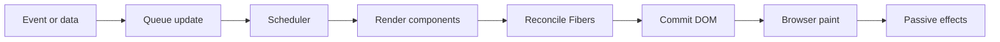

The arrows show causality: a trigger queues work; render is calculation and may restart; commit applies a finished tree; browser work creates pixels; passive effects synchronize afterward.

## Setup and Structures

```bash
npm create vite@latest storefront -- --template react
cd storefront
npm install
npm run dev
```

CRA is maintained for existing applications but is not the recommended new-app scaffold. A practical small structure is:

```text
src/
|-- app/          # root providers, router, store
|-- features/     # business capabilities
|-- shared/       # reusable UI, hooks, utilities
|-- App.jsx
`-- main.jsx
```

## JSX, Elements, Components, Props, State, and Events

```jsx
import { useState } from "react";
import { createRoot } from "react-dom/client";

function Quantity({ value, onChange }) {
	return (
		<div role="group" aria-label="Quantity">
			<button type="button" disabled={value <= 1}
				onClick={() => onChange(Math.max(1, value - 1))}>Decrease</button>
			<output aria-live="polite">{value}</output>
			<button type="button" onClick={() => onChange(value + 1)}>Increase</button>
		</div>
	);
}

function App() {
	const [quantity, setQuantity] = useState(1);
	return <Quantity value={quantity} onChange={setQuantity} />;
}

createRoot(document.getElementById("root")).render(<App />);
```

`App` owns state; `Quantity` receives read-only props and reports intent. A click queues a new snapshot and renders both components; commit changes only affected DOM. State is associated with component type, key, and tree position, not stored in the function.

### Lists, Keys, Conditions, and Forms

```jsx
function Orders({ orders }) {
	if (!orders.length) return <p>No orders.</p>;
	return <ul>{orders.map((o) => <li key={o.id}>{o.number}: {o.status}</li>)}</ul>;
}

// Wrong: random keys remount every row.
items.map((item) => <Row key={Math.random()} item={item} />);
// Correct: stable data identity preserves row state through reordering.
items.map((item) => <Row key={item.id} item={item} />);
```

A controlled input uses React state as its source of truth; an uncontrolled input keeps its current value in the DOM and is read with a ref or `FormData`. Keep rapidly changing input state near the field. CSS Modules scope generated names at build time; Styled Components generates runtime styles; Tailwind generates styles from detected utility classes. These are integrations, not React features.

Class components remain supported for maintenance and error boundaries. Function components are preferred because hooks compose behavior without splitting one concern across lifecycle methods.

## Mistakes, Best Practices, and Performance

- Never mutate props/state or perform side effects during render.
- Pass a handler (`onClick={save}`), do not invoke it during render (`onClick={save()}`).
- Store minimal state; derive totals and flags during render.
- Use stable keys; change a key intentionally when a subtree must reset.
- Colocate transient state and profile before adding memoization.
- Browser code and environment values are observable by users.

## Summary, Practice, and Interview Preparation

React converts declarative element trees into focused host updates. Props are inputs, state is a render snapshot, events express intent, and keys define sibling identity.

**10 beginner prompts:** element vs component; JSX; props; state; event; controlled field; key; conditional output; root; pure render.  
**10 intermediate prompts:** snapshots; batching; derived state; uncontrolled forms; state reset; SPA/MPA; class/function; key reorder; Strict Mode; styling tradeoffs.  
**10 advanced prompts:** Fiber/element/DOM identity; hydration; browser pipeline; state ownership; transition priority; runtime styling cost; accessibility; remounts; profiling; architecture boundaries.

**Coding:** quantity picker (easy), filterable keyed order table (medium), optimistic cart editor with rollback (hard). **Mini project:** inventory dashboard with forms, filters, empty/error states, and feature folders.

**Interview answer - why does state not change inside the current handler?** The handler closes over one render snapshot. A setter queues later work; a functional updater receives the pending queue value when next state depends on previous state.

---

<a id="module-2-react-internals"></a>
# Module 2: React Internals

[Previous: Fundamentals](#module-1-react-fundamentals) | [Next: Lifecycle](#module-3-component-lifecycle)

## Introduction and Internal Working

The browser owns the DOM and pixel pipeline. React holds element descriptions, update queues, hook state, and current/work-in-progress Fiber trees in JavaScript memory. Fiber replaced the older synchronous stack reconciler with units of work that can be prioritized, paused, discarded, and resumed before commit. Fiber fields are private implementation details.

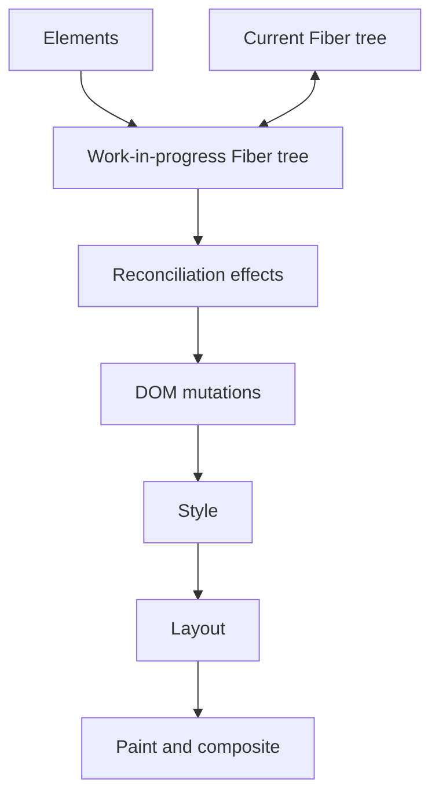

React's diffing heuristics preserve a subtree when type, position, and key match. Different type/key replaces it and resets state. Stable keys match siblings across insertion and movement. Render calculates and may be interrupted; commit applies the selected finished work synchronously, assigns refs, and runs layout work. Passive effects follow.

The scheduler uses priority lanes. Concurrent rendering does not run components on parallel threads; it allows interruptible coordination. Automatic batching in React 18 groups updates from React events, promises, timers, and native handlers when using `createRoot`, reducing commits.

```jsx
function ResettableEditor({ customerId }) {
	// A changed key intentionally creates a new identity and state.
	return <CustomerEditor key={customerId} customerId={customerId} />;
}
```

Strict Mode performs development-only checks, including repeated render calculations and an extra effect setup-cleanup-setup cycle. This exposes impure render and missing cleanup; production output is not doubled.

## Performance and Memory

Rendering costs JavaScript even when no DOM changes result. Commit can trigger style/layout/paint. Long main-thread tasks delay input. Retained timers, subscriptions, detached DOM, caches, and closures can prevent garbage collection. Keep render pure, cancel obsolete work, virtualize large lists, avoid layout read/write thrashing, and use transitions only where stale content is acceptable.

## Summary and Review

Fiber represents schedulable work; reconciliation preserves identity; commit changes the host; the browser creates pixels.

**Questions:** DOM vs element vs Fiber; render vs commit; diff heuristics; key reset; batching; lanes; concurrent interruption; Strict Mode; garbage collection; forced layout. **Assignment:** profile a 20,000-row search, then add deferred rendering and virtualization. **Interview diagnosis:** duplicate network calls from render indicate an impure component; move work to an event, effect with cleanup, or data layer.

---

<a id="module-3-component-lifecycle"></a>
# Module 3: Component Lifecycle

[Previous: Internals](#module-2-react-internals) | [Next: Hooks](#module-4-react-hooks)

## Introduction and Lifecycle Map

Lifecycle describes mount, update, and unmount. Class APIs spread synchronization across methods; function components model independent setup/cleanup processes with effects.

| Phase | Class API | Function model |
|---|---|---|
| Initialize | `constructor` | state initializer during render |
| Calculate | `render` | component function |
| After mount | `componentDidMount` | effect setup |
| Before update commit | `getSnapshotBeforeUpdate` | layout-effect cleanup/measurement patterns |
| After update | `componentDidUpdate` | effect resynchronization |
| Bailout | `shouldComponentUpdate` | `memo`/stable state |
| Remove | `componentWillUnmount` | effect cleanup |

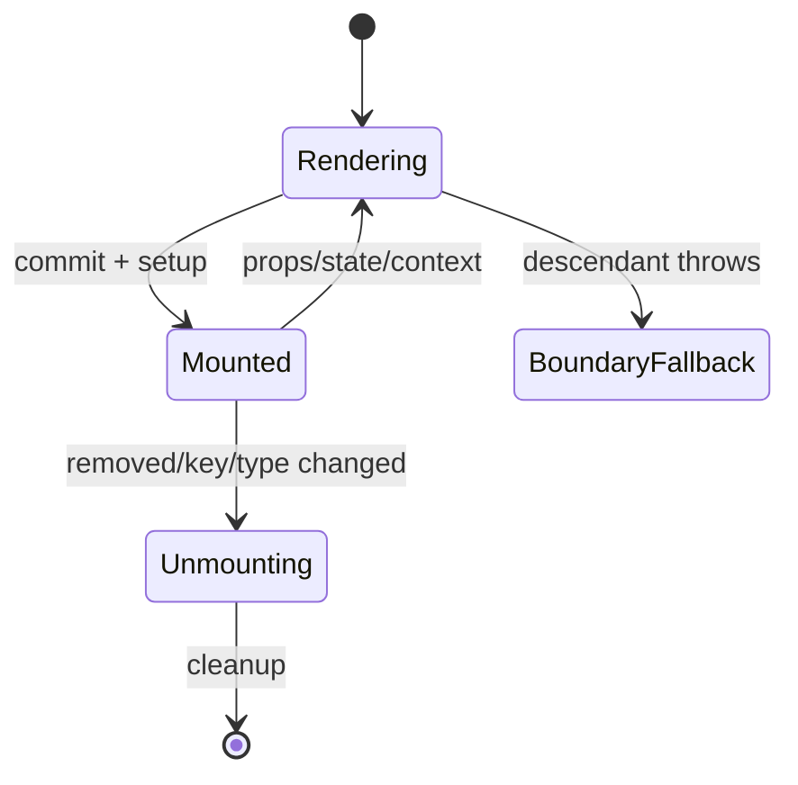

```jsx
import { useEffect } from "react";

function ChatRoom({ roomId }) {
	useEffect(() => {
		const connection = chatApi.subscribe(roomId);
		return () => connection.unsubscribe();
	}, [roomId]);
	return <MessageList roomId={roomId} />;
}
```

After commit, setup subscribes. When `roomId` changes, old cleanup runs and new setup acquires the replacement. Unmount performs final cleanup. `useLayoutEffect` runs after DOM mutation but before paint and blocks paint, so reserve it for measurement/visual correction.

Error boundaries catch descendant render/lifecycle failures, but not event handlers, arbitrary asynchronous callbacks, or their own errors:

```jsx
class ErrorBoundary extends React.Component {
	state = { failed: false };
	static getDerivedStateFromError() { return { failed: true }; }
	componentDidCatch(error, info) { monitoring.capture(error, info); }
	render() { return this.state.failed ? <Fallback /> : this.props.children; }
}
```

**Mistakes:** missing cleanup, unconditional state-setting effects, suppressed dependencies, layout effects for nonvisual work, and treating `useEffect([])` as a guaranteed once-only command. **Assignment:** implement a cancellable room subscription and route-level boundary. **Interview answer:** an effect is not `componentDidMount`; it declares synchronization for reactive dependencies and must mirror acquisition with cleanup.

---

<a id="module-4-react-hooks"></a>
# Module 4: React Hooks

[Previous: Lifecycle](#module-3-component-lifecycle) | [Next: Communication](#module-5-component-communication)

Hooks are ordered cells on a component Fiber. Call them only at the top level of components/custom hooks. A conditional call shifts later positions and breaks state association.

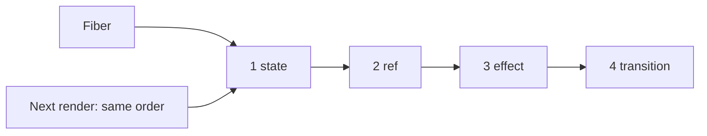

| Hook | Purpose | Key production rule |
|---|---|---|
| `useState` | local snapshot | updater when next depends on previous |
| `useReducer` | action-driven transitions | pure reducer; exhaustive actions |
| `useEffect` | passive external sync | complete dependencies and cleanup |
| `useLayoutEffect` | pre-paint sync | use only when paint must wait |
| `useRef` | stable mutable cell/DOM ref | mutation does not render |
| `useMemo` | cache calculation | performance hint after measurement |
| `useCallback` | cache function identity | only when identity is observed |
| `useContext` | nearest provider value | changed value renders consumers |
| `useImperativeHandle` | narrow ref API | prefer declarative props |
| `useTransition` | non-urgent update | never transition controlled input value |
| `useDeferredValue` | lag slow consumer | does not debounce network calls |
| `useId` | SSR-safe accessibility ID | never a list key |
| `useSyncExternalStore` | consistent external subscription | stable cached snapshot |
| `useInsertionEffect` | CSS library insertion | library API; no refs/state updates |

```jsx
// State and reducer
const [count, setCount] = useState(0);
setCount((current) => current + 1);
const [state, dispatch] = useReducer(reducer, initialState);

// Ref: survives renders without causing one.
const inputRef = useRef(null);
inputRef.current?.focus();

// Memoization: valuable only when cost/identity matters.
const visible = useMemo(() => expensiveRank(items, query), [items, query]);
const select = useCallback((id) => onSelect(id), [onSelect]);
```

### Effects and Cancellation

```jsx
useEffect(() => {
	const controller = new AbortController();
	fetch(`/api/users/${userId}`, { signal: controller.signal })
		.then((r) => { if (!r.ok) throw new Error(`HTTP ${r.status}`); return r.json(); })
		.then(setUser)
		.catch((e) => { if (e.name !== "AbortError") reportError(e); });
	return () => controller.abort();
}, [userId]);

// Wrong: derived state causes an extra render and can drift.
useEffect(() => setFullName(`${first} ${last}`), [first, last]);
// Correct:
const fullName = `${first} ${last}`;
```

### Concurrent and Specialized Hooks

```jsx
const [query, setQuery] = useState("");
const deferredQuery = useDeferredValue(query);
const [isPending, startTransition] = useTransition();

<input value={query} onChange={(e) => setQuery(e.target.value)} />
<button onClick={() => startTransition(() => setTab("reports"))}>Reports</button>
<SlowResults query={deferredQuery} pending={isPending} />
```

`useId` generates hydration-stable label/help IDs. `useSyncExternalStore(subscribe, getSnapshot, getServerSnapshot)` prevents tearing for external state. `useInsertionEffect` exists mainly for CSS-in-JS library authors. `useImperativeHandle` should expose narrow operations such as `focus`, not an unrestricted DOM implementation.

### Custom Hook

```jsx
function useDebouncedValue(value, delayMs) {
	const [debounced, setDebounced] = useState(value);
	useEffect(() => {
		const id = setTimeout(() => setDebounced(value), delayMs);
		return () => clearTimeout(id);
	}, [value, delayMs]);
	return debounced;
}
```

Each caller receives independent state; custom hooks share logic, not state. Common failures are conditional hooks, stale closures, refs for visible state, state for timer IDs, effects for user actions, and memoization without profiling.

**Practice:** explain all 15 hooks; implement `useOnlineStatus`; implement abortable search; compare debounce vs deferred value; diagnose three stale closures. **Interview answer:** three `setCount(count + 1)` calls capture one snapshot and usually replace with the same value; three functional updaters compose.

---

<a id="module-5-component-communication"></a>
# Module 5: Component Communication

[Previous: Hooks](#module-4-react-hooks) | [Next: Router](#module-6-react-router)

Data flows parent-to-child through props; intent flows child-to-parent through callbacks. Siblings share state in their closest common owner. Context distributes cross-cutting values. Composition passes components/elements into slots. Render props and HOCs remain important legacy/library patterns; compound components coordinate a cohesive API through shared context.

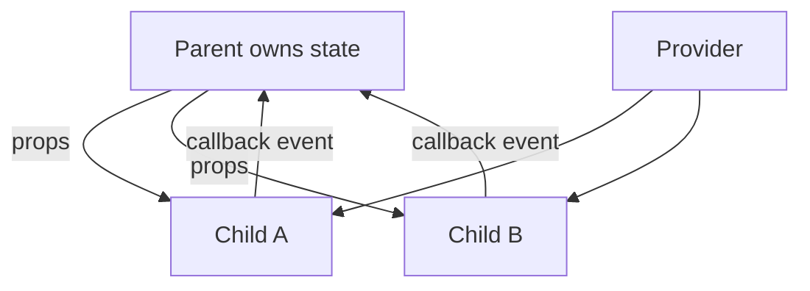

```jsx
function Tabs({ children, value, onChange }) {
	return <TabsContext.Provider value={{ value, onChange }}>{children}</TabsContext.Provider>;
}
Tabs.List = function List({ children }) { return <div role="tablist">{children}</div>; };
Tabs.Tab = function Tab({ id, children }) {
	const { value, onChange } = useContext(TabsContext);
	return <button role="tab" aria-selected={value === id} onClick={() => onChange(id)}>{children}</button>;
};
```

Prefer explicit props for local data, composition for visual flexibility, context for subtree-wide dependencies, and a store/server cache for complex cross-feature state. Avoid prop drilling only when it is genuinely harmful; context creates coupling and broad update reach.

**Common mistakes:** duplicate sibling state, callback loops, context as a dumping ground, HOCs that hide prop collisions, and compound children without accessibility semantics. **Mini project:** accessible tabs and modal components supporting controlled/uncontrolled modes. **Interview scenario:** two sibling filters disagree; lift one canonical filter model to the nearest common owner or URL.

---

<a id="module-6-react-router"></a>
# Module 6: React Router

[Previous: Communication](#module-5-component-communication) | [Next: Forms](#module-7-forms)

React Router maps browser locations to a nested UI tree. `BrowserRouter` uses the History API; `Routes` ranks branches; `Route` defines path/element; `Outlet` renders a matched child; `Link`/`NavLink` navigate without document reload. `useParams`, `useSearchParams`, `useLocation`, and `useNavigate` expose route state.

```bash
npm install react-router-dom
```

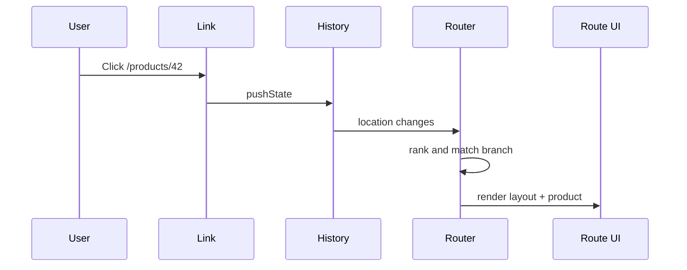

```jsx
const ProductPage = lazy(() => import("./ProductPage.jsx"));

function RequireAuth() {
	const auth = useAuth();
	const location = useLocation();
	if (auth.status === "loading") return <PageSpinner />;
	return auth.user ? <Outlet /> : <Navigate to="/login" replace state={{ from: location }} />;
}

function AppRoutes() {
	return (
		<BrowserRouter>
			<Suspense fallback={<PageSpinner />}>
				<Routes>
					<Route element={<AppLayout />}>
						<Route index element={<Home />} />
						<Route path="products/:productId" element={<ProductPage />} />
						<Route element={<RequireAuth />}>
							<Route path="account" element={<Account />} />
						</Route>
						<Route path="*" element={<NotFound />} />
					</Route>
				</Routes>
			</Suspense>
		</BrowserRouter>
	);
}
```

Authorization must also be enforced by the API; a route guard only controls UI/navigation. Put shareable filters in search params, use stable relative links, provide a server rewrite to `index.html` for SPA deep links, and split at meaningful route boundaries.

**Practice:** nested CRM routes; dynamic product IDs; search-param pagination; post-login return path; role guard; lazy route; 404; test navigation; preserve filter URL; configure hosting fallback. **Interview answer:** `Link` updates history and router state without fetching a new document; a plain anchor performs browser document navigation unless intended.

---

<a id="module-7-forms"></a>
# Module 7: Forms

[Previous: Router](#module-6-react-router) | [Next: Axios](#module-8-axios)

Controlled forms provide immediate React-driven validation and dependent UI. Uncontrolled forms keep values in DOM controls and can reduce per-keystroke rendering. Validate on both client (experience) and server (authority). Preserve server field errors and submission state.

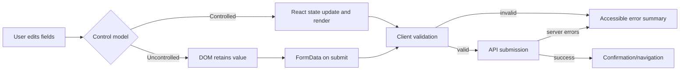

The first branch distinguishes where current values live. Both models converge at validation and submission; server validation remains authoritative; failure returns focusable/announced feedback while success advances the workflow.

```jsx
function ProfileForm() {
	const [errors, setErrors] = useState({});
	async function submit(event) {
		event.preventDefault();
		const data = new FormData(event.currentTarget);
		const file = data.get("avatar");
		if (file.size > 2_000_000) return setErrors({ avatar: "Maximum 2 MB" });
		await api.post("/profile", data);
	}
	return (
		<form onSubmit={submit} noValidate>
			<input name="name" required />
			<input name="avatar" type="file" accept="image/*" />
			{errors.avatar && <p role="alert">{errors.avatar}</p>}
			<button>Save</button>
		</form>
	);
}
```

React Hook Form uses uncontrolled registration/subscriptions to limit renders and supports dynamic arrays and schema resolvers. Do not manually set multipart `Content-Type`; the browser adds its boundary. Revoke object URLs, validate type/size server-side, prevent duplicate submit, focus the first invalid field, and announce errors.

**Mini project:** dynamic HRMS employee form with field arrays, async uniqueness validation, upload progress, dirty-state navigation guard, and accessible error summary.

---

<a id="module-8-axios"></a>
# Module 8: Axios

[Previous: Forms](#module-7-forms) | [Next: Context](#module-9-context-api)

Axios is a promise-based HTTP client offering instances, transforms, interceptors, timeouts, cancellation, and progress APIs. HTTP work is external to React; keep transport policy in an API layer and UI status in a data layer/component.

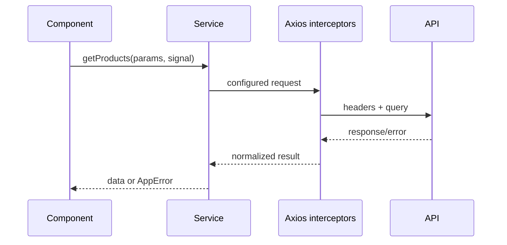

```jsx
import axios from "axios";

export const http = axios.create({
	baseURL: import.meta.env.VITE_API_URL,
	timeout: 10_000,
	withCredentials: true,
	headers: { Accept: "application/json" },
});

http.interceptors.response.use(
	(response) => response,
	(error) => Promise.reject({
		kind: error.response ? "http" : error.request ? "network" : "client",
		status: error.response?.status,
		message: error.response?.data?.message ?? error.message,
		cause: error,
	}),
);

export const productsApi = {
	list: ({ page, query, signal }) => http.get("/products", { params: { page, query }, signal }),
	create: (data) => http.post("/products", data),
	replace: (id, data) => http.put(`/products/${id}`, data),
	update: (id, data) => http.patch(`/products/${id}`, data),
	remove: (id) => http.delete(`/products/${id}`),
};
```

Use `AbortController`; timeout and cancellation solve different problems. Retry only idempotent/transient operations with capped exponential backoff and jitter. Never blindly retry validation/auth failures. `Promise.all` is fail-fast for independent concurrent calls; `allSettled` preserves partial outcomes. Cursor pagination is robust under insertions; infinite scroll needs duplicate prevention, termination, accessibility, and scroll restoration.

```jsx
const controller = new AbortController();
const [products, categories] = await Promise.all([
	http.get("/products", { signal: controller.signal }),
	http.get("/categories", { signal: controller.signal }),
]);

// Upload; let the browser create the multipart boundary.
await http.post("/files", formData, { onUploadProgress: ({ loaded, total }) => setProgress(loaded / total) });
// Download
const { data } = await http.get("/report", { responseType: "blob" });
```

For JWT refresh, prefer secure HttpOnly cookies when architecture permits. A single-flight refresh prevents many 401s from starting many refresh requests; `_retry` guards loops; failure clears session. Interceptors must be ejected when dynamically installed.

```text
src/api/http.js             # transport policy
src/api/errors.js           # normalized error model
src/features/products/api.js# endpoint service
src/features/products/hooks/# React integration
```

**Mistakes:** token in every component, global mutable defaults, no cancellation, treating every error alike, infinite retries, manually setting multipart boundaries, and duplicating RTK Query caching. **Interview:** Axios rejects non-2xx by default; inspect `response`, `request`, or setup error. **Project:** paginated catalog with cancellation, retry, upload/download, normalized errors, and interceptor tests.

---

<a id="module-9-context-api"></a>
# Module 9: Context API

[Previous: Axios](#module-8-axios) | [Next: Redux Toolkit](#module-10-redux-toolkit-and-rtk-query)

Context distributes a value through a subtree without forwarding it through every intermediate component. A provider owns a value; `useContext` reads the nearest provider. Consumers re-render when provider value changes by `Object.is`, even through memoized ancestors.

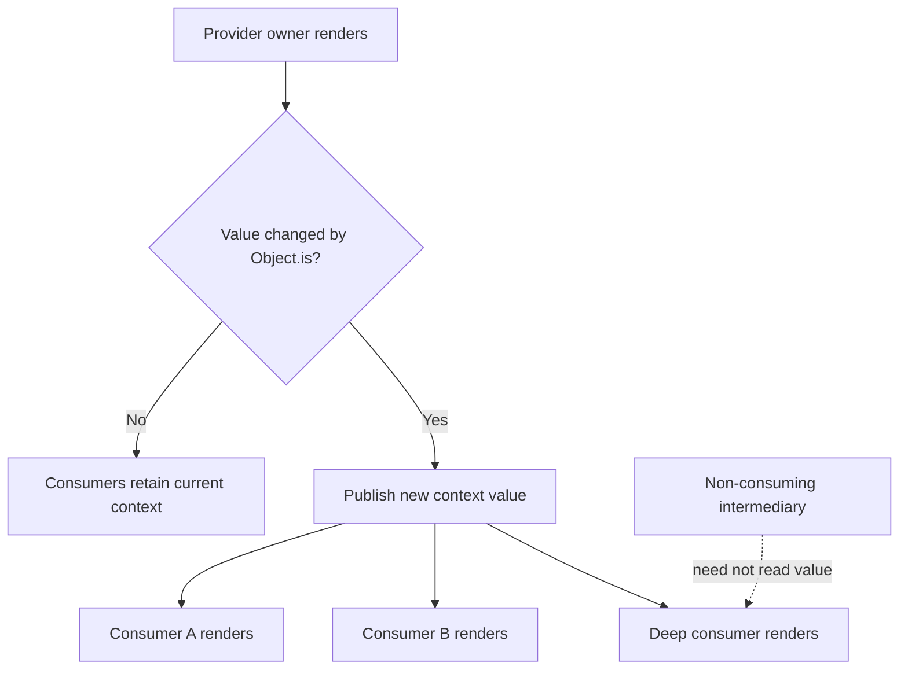

The owner computes the provider value; React compares its identity; a real change notifies every subscribed consumer beneath that provider. Intermediate components need not receive props, but context consumers still pay for relevant provider updates.

```jsx
const AuthContext = createContext(null);
export function AuthProvider({ children }) {
	const [user, setUser] = useState(null);
	const value = useMemo(() => ({ user, signOut: () => setUser(null) }), [user]);
	return <AuthContext.Provider value={value}>{children}</AuthContext.Provider>;
}
export function useAuth() {
	const context = useContext(AuthContext);
	if (!context) throw new Error("useAuth must be inside AuthProvider");
	return context;
}
```

Memoizing value avoids changes caused only by object recreation, but every actual `user` change still notifies all consumers. Split state/dispatch or fast/slow contexts; colocate providers; consider selector-based stores for high-frequency global data.

| Context | Redux Toolkit |
|---|---|
| Dependency distribution, simple low-frequency shared state | Complex transitions, middleware, DevTools, selectors, entity normalization |
| No built-in async/cache model | Thunks, listeners, RTK Query cache |
| Provider value update reaches consumers | Subscription selectors limit updates |

**Assignment:** theme/auth contexts with invariant hooks and render-count tests. **Interview:** Context does not eliminate state ownership; it changes delivery. It can be combined with a reducer but does not gain Redux middleware, DevTools, or server caching.

---

<a id="module-10-redux-toolkit-and-rtk-query"></a>
# Module 10: Redux Toolkit and RTK Query

[Previous: Context](#module-9-context-api) | [Next: Performance](#module-11-performance-optimization)

Redux implements one-way event flow: UI dispatches actions, middleware may react, reducers calculate next state, and subscribers select updates. Redux Toolkit (RTK) is the official way to write Redux: `configureStore`, `createSlice`, Immer-powered immutable updates, thunks, listeners, entity adapters, and RTK Query.

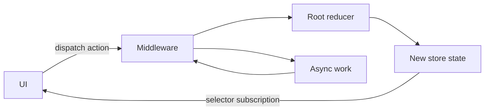

```jsx
import { configureStore, createAsyncThunk, createEntityAdapter, createSlice } from "@reduxjs/toolkit";

const products = createEntityAdapter();
export const fetchProducts = createAsyncThunk("products/fetch", async (_, { signal, rejectWithValue }) => {
	try { return (await http.get("/products", { signal })).data; }
	catch (error) { return rejectWithValue(error.message); }
});

const slice = createSlice({
	name: "products",
	initialState: products.getInitialState({ status: "idle", error: null }),
	reducers: { productUpdated: products.updateOne },
	extraReducers: (builder) => builder
		.addCase(fetchProducts.pending, (state) => { state.status = "pending"; })
		.addCase(fetchProducts.fulfilled, (state, action) => { state.status = "succeeded"; products.setAll(state, action.payload); })
		.addCase(fetchProducts.rejected, (state, action) => { state.status = "failed"; state.error = action.payload ?? action.error.message; }),
});

export const store = configureStore({ reducer: { products: slice.reducer } });
```

Immer lets reducers use mutation syntax on a draft while producing immutable structural sharing. State/actions should remain serializable. Select narrowly; normalized `{ids, entities}` data avoids duplication and makes updates direct. Use listener middleware for workflows reacting to actions/state; custom middleware must call `next(action)` and return its result.

## RTK Query

RTK Query caches server state by endpoint plus serialized arguments, deduplicates requests, tracks subscribers, expires unused cache, and invalidates tags.

```jsx
import { createApi, fetchBaseQuery } from "@reduxjs/toolkit/query/react";

export const api = createApi({
	reducerPath: "api",
	baseQuery: fetchBaseQuery({ baseUrl: "/api", credentials: "include" }),
	tagTypes: ["Product"],
	endpoints: (build) => ({
		getProducts: build.query({
			query: (params) => ({ url: "products", params }),
			providesTags: (result = []) => ["Product", ...result.map(({ id }) => ({ type: "Product", id }))],
		}),
		updateProduct: build.mutation({
			query: ({ id, ...patch }) => ({ url: `products/${id}`, method: "PATCH", body: patch }),
			async onQueryStarted({ id, ...patch }, { dispatch, queryFulfilled }) {
				const undo = dispatch(api.util.updateQueryData("getProducts", undefined, (draft) => {
					Object.assign(draft.find((p) => p.id === id), patch);
				}));
				try { await queryFulfilled; } catch { undo.undo(); }
			},
			invalidatesTags: (_r, _e, { id }) => [{ type: "Product", id }],
		}),
	}),
});
```

Register `api.reducer` and `api.middleware`. Use generated hooks, `prefetch`, polling options, and focus/reconnect listeners deliberately. Optimistic updates must patch the exact cache key/arguments and rollback failures. Tags describe data relationships, not UI screens.

```text
src/app/store.js
src/app/listenerMiddleware.js
src/services/api.js
src/features/products/productsSlice.js
src/features/products/selectors.js
src/features/products/components/
```

**Context vs Redux:** use context for stable dependency distribution; Redux for cross-feature event/state workflows; RTK Query for shared server cache. Do not copy query data into slices unless creating a deliberate editable snapshot.

**Common mistakes:** giant slice, nonserializable values, dispatching in render, selecting whole state, hand-written immutable nesting, duplicate Axios/RTKQ caches, broad invalidation, and optimistic updates without rollback.

**Practice:** configure store; build slice; thunk abort; adapter selectors; middleware; listener workflow; API slice; tag invalidation; optimistic update; polling/prefetch. **Mini project:** CRM leads with normalized local workflow state and RTK Query server data. **Interview:** reducers are pure calculations; middleware surrounds dispatch; `extraReducers` responds to external action types without generating them.

---

<a id="module-11-performance-optimization"></a>
# Module 11: Performance Optimization

[Previous: Redux Toolkit](#module-10-redux-toolkit-and-rtk-query) | [Next: Environment Variables](#module-12-environment-variables)

## Introduction and Measurement Model

Performance is user experience under real devices and networks, not the number of optimization hooks. Measure loading (LCP), responsiveness (INP), layout stability (CLS), JavaScript long tasks, React render/commit duration, memory growth, and bundle transfer/parse cost. Optimize the measured bottleneck while preserving correctness.

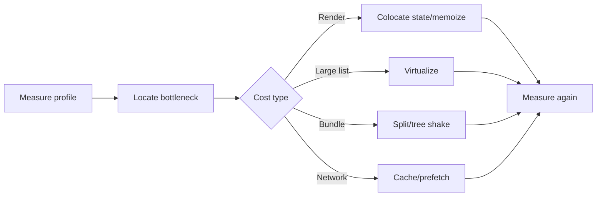

`React.memo` can skip rendering when props compare equal by `Object.is`; context and local state still update it. `useMemo` caches a calculation and `useCallback` caches function identity. All add comparison/cache/retention overhead. The React DevTools Profiler shows why and how long components rendered; browser Performance tools show main-thread, layout, paint, and network work.

```jsx
const ProductRow = memo(function ProductRow({ product, onSelect }) {
	return <button onClick={() => onSelect(product.id)}>{product.name}</button>;
});

function Catalog({ products, query, onSelect }) {
	const filtered = useMemo(() => rank(products, query), [products, query]);
	const select = useCallback((id) => onSelect(id), [onSelect]);
	return filtered.map((product) => <ProductRow key={product.id} product={product} onSelect={select} />);
}
```

This is useful only when ranking/rows are costly and `product` identities are stable. An inline reconstructed product object defeats the bailout.

## Lazy Loading, Suspense, and Virtualization

```jsx
const Analytics = lazy(() => import("./Analytics.jsx"));
function ReportsRoute() {
	return <Suspense fallback={<ReportSkeleton />}><Analytics /></Suspense>;
}
```

Dynamic import creates an asynchronous chunk. Split at routes or heavy optional capabilities; too many chunks increase request/coordination overhead. Suspense displays fallback while a supported child suspends; it does not automatically make arbitrary effect fetching Suspense-aware.

Virtualization renders a visible window rather than thousands of DOM rows. Use a proven library, stable item keys, overscan, measured/fixed dimensions, accessible semantics, and focus handling. Optimize images with correct dimensions, responsive sources, modern formats, lazy loading below the fold, and CDN caching.

**Wrong:** memoize trivial arithmetic, create unstable props, render 50,000 hidden nodes, lazy-load above-the-fold essentials, or judge only development Strict Mode. **Best:** production profile, state colocation, server cache, route splitting, virtualization, and budgets. **Assignment:** compare baseline and optimized catalog with profiler evidence. **Interview:** memoization reduces repeated work; it does not make a calculation free and is not a correctness guarantee.

---

<a id="module-12-environment-variables"></a>
# Module 12: Environment Variables

[Previous: Performance](#module-11-performance-optimization) | [Next: Webpack](#module-13-webpack)

Frontend environment variables are build-time configuration replacements. Vite exposes only `VITE_*` through `import.meta.env`; CRA exposes `REACT_APP_*` through `process.env`. Mode files commonly load with precedence such as `.env`, `.env.local`, `.env.development`, and `.env.production` (tool-specific rules apply).

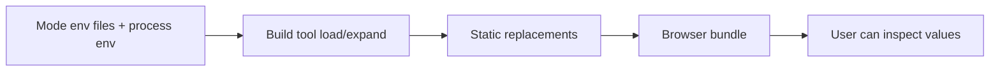

```env
# .env.development
VITE_API_URL=http://localhost:8080/api
VITE_APP_ENV=development
```

```js
const required = ["VITE_API_URL", "VITE_APP_ENV"];
for (const key of required) {
	if (!import.meta.env[key]) throw new Error(`Missing environment variable: ${key}`);
}
export const config = Object.freeze({
	apiUrl: import.meta.env.VITE_API_URL,
	environment: import.meta.env.VITE_APP_ENV,
	production: import.meta.env.PROD,
});
```

Values are strings unless the tool provides built-ins; parse and validate them. Never store private keys, database credentials, signing secrets, or privileged tokens. Public API origins and public telemetry identifiers are configuration, not secrets. Build once per environment when values are embedded, or intentionally load a validated runtime config file before boot if one artifact must deploy everywhere.

**Mistakes:** committing `.env.local`, assuming prefixes secure values, boolean string errors (`"false"` is truthy), reading dynamic property names that cannot be statically replaced, and mixing environments in one build. **Assignment:** typed config validation with clear startup failure and deployment injection.

---

<a id="module-13-webpack"></a>
# Module 13: Webpack

[Previous: Environment](#module-12-environment-variables) | [Next: Vite](#module-14-vite)

Webpack builds a dependency graph from one or more entries, transforms matching modules with loaders, lets plugins participate across compilation lifecycle hooks, and emits assets/chunks. Babel transforms syntax; it is not a bundler. `webpack-dev-server` serves memory output and HMR updates changed modules while preserving state when boundaries accept updates.

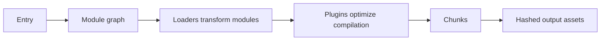

```js
// webpack.config.js
const HtmlWebpackPlugin = require("html-webpack-plugin");
module.exports = (_, argv) => ({
	mode: argv.mode ?? "development",
	entry: "./src/main.jsx",
	output: { filename: "assets/[name].[contenthash].js", clean: true },
	module: { rules: [{ test: /\.jsx?$/, exclude: /node_modules/, use: "babel-loader" }] },
	resolve: { extensions: [".js", ".jsx"] },
	plugins: [new HtmlWebpackPlugin({ template: "./public/index.html" })],
	devtool: argv.mode === "production" ? "source-map" : "eval-cheap-module-source-map",
	optimization: { splitChunks: { chunks: "all" }, runtimeChunk: "single" },
	devServer: { historyApiFallback: true, hot: true },
});
```

Production mode enables minification and tree-shaking-related optimizations. Content hashes support long caching; source maps aid diagnosis but require an intentional exposure policy. Asset modules handle files. Dynamic imports split chunks. Bundle analyzers reveal duplicate/large modules. Loaders transform individual modules; plugins coordinate compilation-wide behavior.

**Mistakes:** one giant vendor chunk, cache-busting filenames without cache headers, transpiling all dependencies, source maps exposed accidentally, and assuming HMR equals production. **Mini project:** build a React app with Babel, CSS/assets, HMR, route chunks, analyzer, budgets, and long-term caching.

---

<a id="module-14-vite"></a>
# Module 14: Vite

[Previous: Webpack](#module-13-webpack) | [Next: Tree Shaking](#module-15-tree-shaking)

Vite serves source through native browser ESM during development, transforms requested modules on demand, and pre-bundles dependencies for efficiency. Its HMR graph invalidates affected modules. Production builds use Rollup, so dev and build pipelines differ and both must be tested.

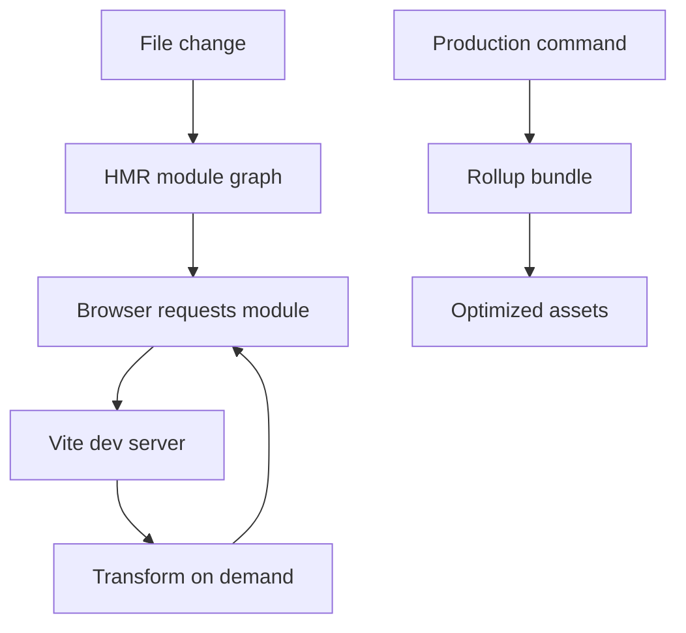

```js
import { defineConfig } from "vite";
import react from "@vitejs/plugin-react";

export default defineConfig(({ mode }) => ({
	plugins: [react()],
	server: { proxy: { "/api": { target: "http://localhost:8080", changeOrigin: true } } },
	build: { sourcemap: mode !== "production", chunkSizeWarningLimit: 600 },
}));
```

Vite treats `index.html` as an entry and rewrites imported assets. Plugins use Rollup-compatible hooks plus Vite extensions. Use `import.meta.env`, `import.meta.glob` for controlled file discovery, and `vite preview` only to inspect a build, not as a production server.

| Concern | Vite | Webpack |
|---|---|---|
| Development | native ESM/on-demand transforms | bundled graph/dev compilation |
| Production | Rollup | Webpack optimizer |
| Configuration | conventionally smaller | highly mature/customizable |
| Best fit | modern app development | legacy/custom enterprise pipelines too |

**Assignment:** migrate a CRA app, translating env variables, aliases, proxy, tests, SVG/assets, and deployment fallback; verify production rather than assuming dev parity.

---

<a id="module-15-tree-shaking"></a>
# Module 15: Tree Shaking

[Previous: Vite](#module-14-vite) | [Next: Authentication](#module-16-authentication)

Tree shaking removes statically provable unused exports, primarily from ESM's static import/export graph. Minifiers perform dead-code elimination after bundler analysis. CommonJS and dynamic access are harder to analyze. Package `sideEffects` metadata tells bundlers which files may be safely omitted; incorrect `false` can remove CSS or initialization.


```js
// Better analyzability
import { formatCurrency } from "./money.js";

// Dynamic import is code splitting, not by itself tree shaking.
const module = await import("./heavy-report.js");
module.openReport();
```

Named imports do not guarantee a small bundle if the package is CommonJS or has broad side effects. Barrel files can accidentally pull initialization or create cycles; measure rather than banning them categorically. Configure `sideEffects: ["**/*.css", "./src/polyfills.js"]`, publish ESM correctly, avoid top-level effects, and inspect source-map-explorer/rollup visualizer/webpack analyzer output.

**Interview:** code splitting changes when code loads; tree shaking changes whether unused code is emitted. **Assignment:** create an intentionally bloated bundle, identify retained modules, correct imports/metadata, and record before/after parsed and compressed sizes.

---

<a id="module-16-authentication"></a>
# Module 16: Authentication

[Previous: Tree Shaking](#module-15-tree-shaking) | [Next: Error Handling](#module-17-error-handling)

Authentication proves identity; authorization decides permission. JWT is a token format, not an authentication architecture. Access tokens should be short-lived; refresh tokens rotate and require replay protection. Browser storage choice is a threat-model decision: `localStorage` is readable by successful XSS; HttpOnly Secure SameSite cookies resist token theft by JavaScript but require CSRF controls where applicable. In-memory access tokens reduce persistence but are lost on reload.

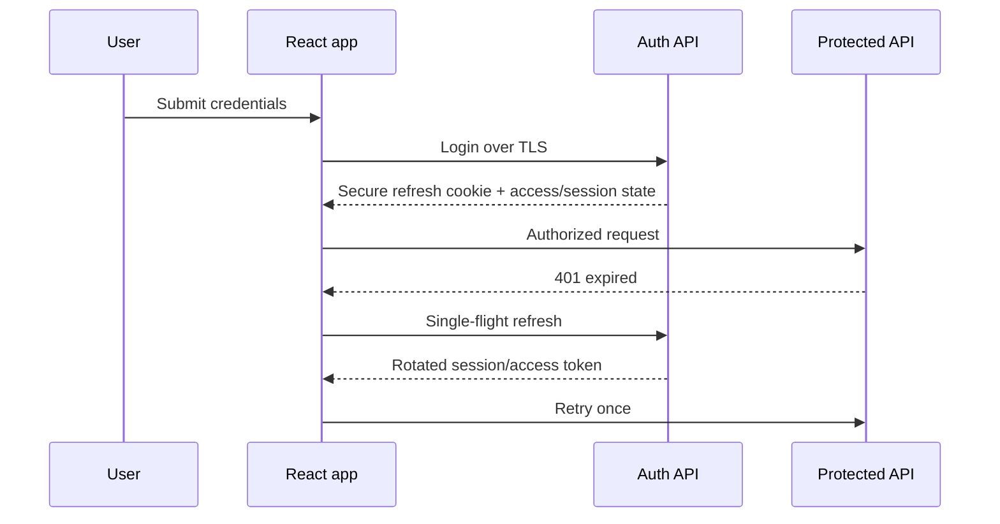

```jsx
function RequireRole({ allow }) {
	const { status, user } = useAuth();
	if (status === "loading") return <PageSpinner />;
	if (!user) return <Navigate to="/login" replace />;
	return allow.includes(user.role) ? <Outlet /> : <Navigate to="/forbidden" replace />;
}
```

This guard improves UX only. The API must enforce authorization for every protected operation. On startup, resolve session before rendering protected content to avoid flashes. A refresh implementation should queue concurrent failures behind one promise, retry once, reject on refresh failure, clear cached user data, and redirect without loops. Logout should invalidate the server session/refresh token, clear client caches, close sensitive subscriptions, and broadcast across tabs if required.

Never decode a JWT and treat claims as trusted authorization without server verification. Do not log tokens, place them in URLs, or store secrets in the bundle. Add CSP, output encoding, dependency hygiene, CSRF strategy, idle/absolute timeout policy, audit logging, and step-up authentication for high-risk banking actions.

**Mini project:** role-based banking shell with bootstrap, cookie session, refresh rotation simulation, multi-tab logout, return URL validation, and authorization tests. **Interview:** private routes do not secure data; only server authorization does.

---

<a id="module-17-error-handling"></a>
# Module 17: Error Handling

[Previous: Authentication](#module-16-authentication) | [Next: Architecture](#module-18-project-architecture)

Errors belong to different boundaries: render failures, event failures, network/HTTP failures, validation, authorization, and unexpected global failures. Normalize transport errors into a domain-safe model and present actionable messages without leaking internals.

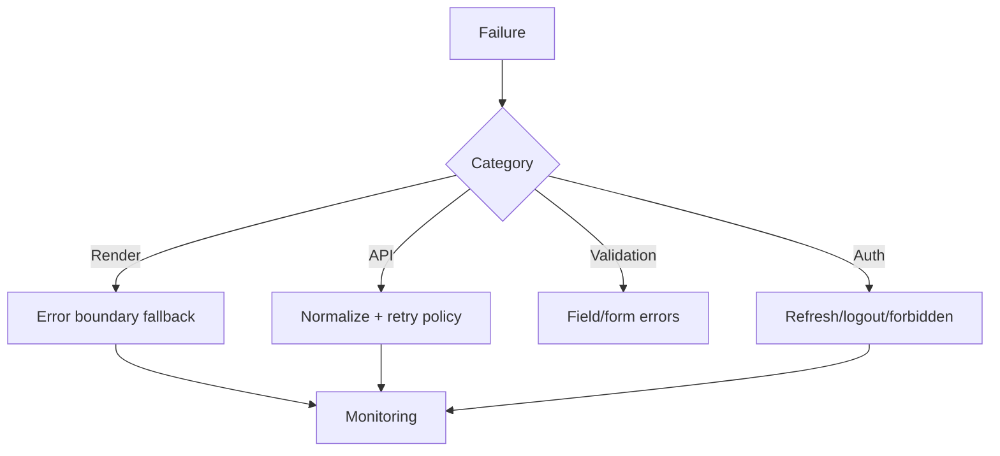

Place boundaries around routes and risky widgets so one chart does not blank the application. Include reset/retry and correlation ID. Event handlers use `try/catch`; rejected async work must be awaited/caught. Retry transient idempotent failures with capped exponential backoff and jitter; never retry every 4xx or non-idempotent mutation blindly.

```jsx
async function save() {
	setStatus("pending");
	try {
		await ordersApi.submit(draft);
		setStatus("succeeded");
	} catch (error) {
		monitoring.capture(error, { feature: "checkout" });
		setStatus("failed");
	}
}
```

Global `error`/`unhandledrejection` listeners are last-resort telemetry, not recovery architecture. Redact PII/tokens, attach release/environment/route/correlation context, upload source maps securely, sample noisy events, and test fallback paths.

**Mistakes:** swallowing errors, endless spinner, raw server messages, retry storms, one root boundary only, and logging sensitive payloads. **Assignment:** route/widget boundaries plus normalized API errors, retry, offline UI, and monitoring assertions.

---

<a id="module-18-project-architecture"></a>
# Module 18: Project Architecture

[Previous: Error Handling](#module-17-error-handling) | [Next: Deployment](#module-19-build-process-and-deployment)

Architecture manages change. Organize by business capability as the application grows, define dependency direction, separate server state from client workflow state, and keep feature internals private. Avoid both one global `components` bucket and premature micro-frontends.

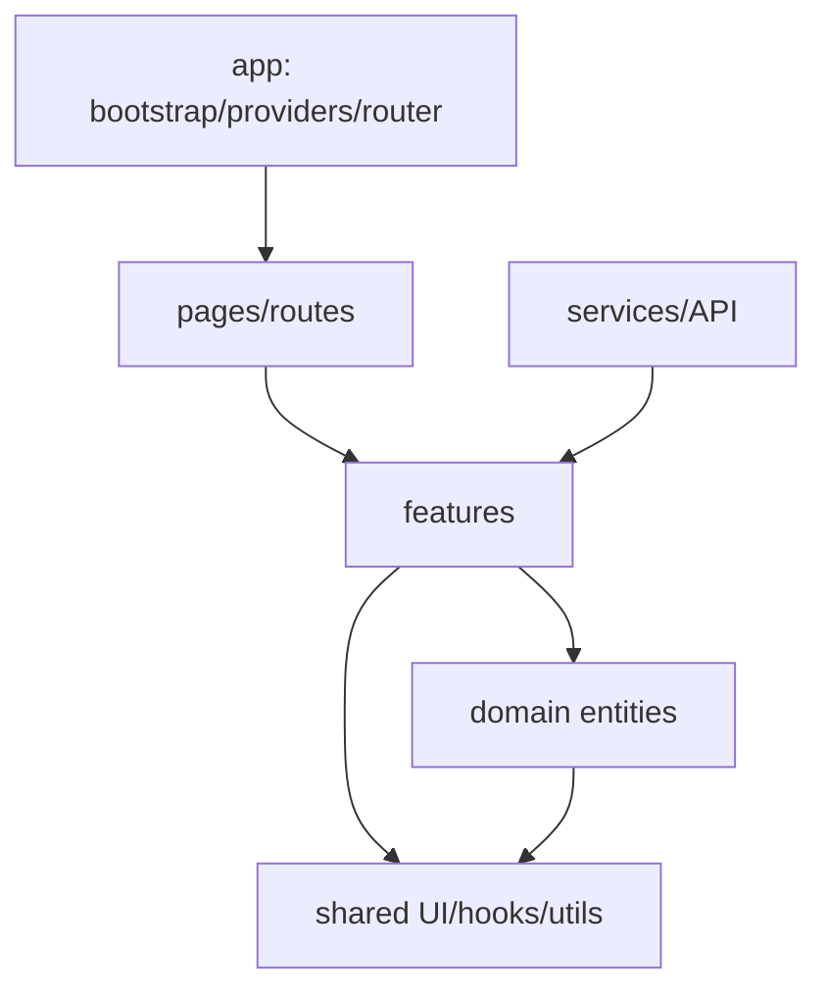

### Small

```text
src/{components,hooks,services,App.jsx,main.jsx}
```

### Medium Feature-Based

```text
src/
|-- app/{router,store,providers}
|-- features/
|   |-- products/{api,components,hooks,productsSlice.js}
|   `-- checkout/{components,hooks,validation.js}
|-- shared/{ui,hooks,utils,constants,assets}
`-- main.jsx
```

### Enterprise

```text
src/
|-- app/                    # composition root only
|-- pages/                  # route composition
|-- features/               # user capabilities
|-- entities/               # domain models/selectors/UI
|-- services/               # transport, telemetry, config
|-- shared/                 # domain-neutral primitives
`-- test/                   # cross-feature fixtures/setup
```

Use PascalCase components, `useX` hooks, event-named Redux actions, and explicit public `index.js` boundaries. Components render/coordinate; hooks integrate React behavior; services perform transport; selectors derive data; constants represent stable semantics; utilities remain pure. Tests should follow risk: reducers/selectors, integration flows, route/auth boundaries, and a few critical end-to-end journeys.

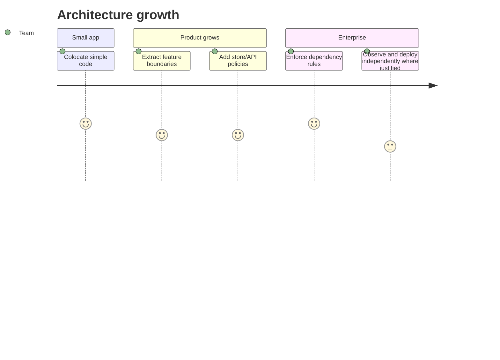

**Mistakes:** folders by file type at large scale, circular feature imports, business logic in shared UI, API calls throughout components, duplicated server state, and abstractions with one consumer. **Mini project:** design an e-commerce repository with dependency rules, ADRs, test strategy, ownership, and migration path from small to medium.

---

<a id="module-19-build-process-and-deployment"></a>
# Module 19: Build Process and Deployment

[Previous: Architecture](#module-18-project-architecture) | [Next: Interview Handbook](#final-interview-handbook)

Development prioritizes feedback: source maps, HMR, diagnostics, and unminified modules. Production prioritizes correctness and delivery: validated environment configuration, transformed syntax, bundled/split assets, tree shaking, minification, hashing, compression at the host/CDN, and observable releases.

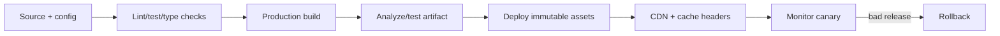

```bash
npm ci
npm test -- --run
npm run build
```

Deploy `dist` for Vite and `build` for CRA. Netlify uses a rewrite such as `/* /index.html 200`; Vercel uses a rewrite to `/index.html`; static GitHub Pages often needs a correct base path and SPA fallback strategy. Each platform should inject public config at build time, serve HTTPS, compress assets, and preserve hashed files with long immutable caching while giving HTML short/no cache so it discovers new hashes.

CI/CD overview: install from lockfile, static checks, tests, build, vulnerability/policy checks, artifact smoke test, deploy preview, approval/canary, production, synthetic check, telemetry, rollback. Do not rebuild during rollback; redeploy a known immutable artifact. Upload source maps to monitoring with release IDs and restrict public exposure. Set CSP/security headers at the host.

### Production Checklist

- Deep links and refresh work; base paths are correct.
- Environment values are validated and contain no secrets.
- Error/loading/empty/offline paths work.
- Bundle and performance budgets pass.
- Hashed assets and HTML use appropriate cache policies.
- Source maps, release metadata, monitoring, and alerts are configured.
- Accessibility and critical browser/device flows pass.
- Rollback is documented and tested.

**Mini project:** deploy the same Vite SPA to Netlify and Vercel with preview environments, route rewrites, security headers, immutable caching, smoke tests, and rollback evidence. **Interview:** a successful build only proves asset generation; deployment must also prove routing, configuration, headers, cache behavior, runtime API access, and observability.

---

<a id="final-interview-handbook"></a>
# Final Interview Handbook

[Previous: Deployment](#module-19-build-process-and-deployment) | [Back to Top](#top)

## High-Value Theory Questions

### React and Rendering

**1. Render versus commit?** Render calls components and reconciles a candidate Fiber tree; it must be pure and may restart. Commit applies a finished tree to the DOM, updates refs, and runs layout work. Passive effects follow. A render can occur with no DOM mutation.

**2. What causes a render?** Initial mount, local state update, parent render (unless a valid bailout), consumed context change, or external-store subscription update. Changing a ref does not render.

**3. Why are keys important?** Type plus key identify siblings. Stable keys preserve component/Fiber/DOM state across movement; changed keys remount and reset. Index keys misassociate state when collections change.

**4. Virtual DOM versus Fiber?** "Virtual DOM" describes in-memory UI elements/tree comparison. Fiber is React's concrete work-unit/tree architecture for state, effects, reconciliation, and scheduling.

**5. What is concurrent rendering?** React may interrupt and supersede noncommitted render work according to priority. It is not automatic parallel JavaScript and never permits render side effects.

### Hooks

**6. Why exhaustive dependencies?** An effect closure uses reactive values from a render. Dependencies tell React when that synchronization process is stale. Omitting values produces stale behavior; restructure rather than silence the rule.

**7. Ref versus state?** State is an immutable render snapshot whose updates schedule UI work. A ref is a stable mutable cell invisible to rendering, suitable for DOM handles, timers, and instance-like bookkeeping.

**8. `useMemo` versus `useCallback`?** The first caches a calculation result; the second caches a function reference. Both are conditional performance tools, not semantic guarantees.

**9. Transition versus debounce?** A transition schedules React updates as non-urgent and can be interrupted. Debounce delays starting work until activity pauses. They solve different problems and can be combined.

**10. Why can an effect loop?** It updates state, that state changes an effect dependency (often due to unstable identity), and setup updates again. Remove unnecessary effect/state or stabilize the true dependency.

### Redux Toolkit and RTK Query

**11. Why Redux Toolkit?** It standardizes store setup, reducers/actions, immutable updates via Immer, middleware, serializability checks, async workflows, entities, and RTK Query while preserving Redux's event-driven model.

**12. Thunk versus RTK Query?** Thunks model arbitrary async workflows. RTK Query specializes in fetching/mutating cached server data with subscriptions, deduplication, invalidation, and generated hooks.

**13. Why normalize entities?** One canonical record per ID reduces duplication, enables direct updates, and supports stable selectors/order arrays.

**14. How do tags work?** Queries declare data they provide; mutations invalidate related tags; active affected queries refetch. Overly broad tags create unnecessary traffic.

**15. Describe optimistic update.** Patch the exact cached entry immediately, retain an undo patch, await server fulfillment, and rollback on failure. Handle overlapping mutation race policy deliberately.

### Routing, Axios, Authentication

**16. Is a protected route secure?** No. It prevents unauthorized UI navigation. The API must authenticate and authorize each protected operation.

**17. Axios interceptor risks?** Refresh loops, concurrent refresh storms, leaked interceptors, hidden global mutation, token logging, and retrying unsafe requests. Use one configured client, single-flight refresh, retry guard, and tests.

**18. Cookie versus local storage?** HttpOnly cookies reduce token theft through JavaScript but require CSRF/SameSite design. Local storage is simpler for headers but exposed to successful XSS. Choose from threat model, not convenience.

**19. What belongs in a URL?** Shareable/navigation state such as page, sort, query, tab, and filters. Do not put secrets or large private state in URLs.

**20. GET/PUT/PATCH/DELETE retry?** Retry only transient failures and operations known to be idempotent. GET/PUT/DELETE are defined as idempotent but application behavior still matters; POST needs idempotency keys or explicit guarantees.

## Scenario and Debugging Questions

**A search screen shows old results after fast typing.** Requests resolved out of order. Cancel obsolete requests with `AbortController`, track request identity, or use RTK Query keyed caching. Debounce may reduce requests but does not by itself prevent stale completion.

**A context update renders the whole dashboard.** The provider creates a new broad value and many consumers subscribe to it. Split contexts by update rate/concern, stabilize value where useful, move high-frequency state to a selector store, and profile.

**Typing freezes in a large table.** Keep input state local/urgent, defer or transition expensive results, optimize the algorithm, virtualize rows, and measure production. `useCallback` alone cannot fix excessive DOM.

**After deployment, refreshing `/orders/42` returns 404.** The static host looks for that file. Configure a history fallback rewrite to the SPA entry while allowing real assets/API routes through.

**Users see an endless spinner after API failure.** Loading is modeled as a boolean without terminal failure or cancellation. Use an explicit state machine (`idle/pending/succeeded/failed`), normalize error, offer retry, and log correlation context.

**A list input moves to another item after deletion.** Index keys associate state with positions. Use stable item IDs.

**The app sends two requests in development.** Strict Mode may test effect setup/cleanup. Ensure cleanup cancels the first request and fetching is idempotent/cached; do not disable Strict Mode to hide the defect.

**A memoized child still renders.** Its local state/context changed, or a prop has new identity. Use Profiler, inspect object/function creation, and optimize only if the render is expensive.

**An optimistic update remains after failure.** The mutation did not retain/apply its inverse patch, patched the wrong query args, or overlapping mutations invalidated assumptions. Roll back or invalidate/refetch with an explicit concurrency policy.

**A production secret was placed in `VITE_API_KEY`.** Assume compromise, rotate it, remove privileged use from the browser, move the operation behind a trusted service, and audit logs/history. Prefixes expose variables; they do not secure them.

## Output-Based Questions

```jsx
setCount(count + 1);
setCount(count + 1);
setCount((current) => current + 1);
```

Starting from `0`, the common result is `2`: two replacement updates both request `1`; the functional updater then transforms pending `1` to `2`.

```jsx
const [value, setValue] = useState(0);
function click() {
	setValue(1);
	console.log(value);
}
```

The log is `0` for that render's handler. The setter queues a render; it does not mutate the captured snapshot.

```jsx
{show ? <Counter /> : <Counter />}
```

State is normally preserved because the same component type occupies the same position. Props may differ, but identity remains. Giving branches different keys intentionally resets it.

## Module Exercise Matrix

Every module should finish with this 30-question drill: ten beginner questions defining its public APIs, ten intermediate questions tracing execution and failures, and ten advanced questions defending architecture/performance/security tradeoffs. Add one easy reproduction, one medium integration, one hard production scenario, and one mini project with tests and measurements.

| Module | Easy | Medium | Hard production exercise |
|---|---|---|---|
| Fundamentals | Controlled counter | Keyed filter list | Optimistic accessible cart |
| Internals | Trace one render | Profile commits | Diagnose scheduler/browser bottleneck |
| Lifecycle | Timer cleanup | Subscription replacement | Boundary + cancellation architecture |
| Hooks | Custom debounce | Reducer workflow | External store without tearing |
| Communication | Callback props | Compound tabs | Controlled/uncontrolled component library |
| Router | Dynamic route | Nested guarded routes | Lazy route system with deep-link hosting |
| Forms | Controlled login | Dynamic fields/upload | Accessible async enterprise form |
| Axios | CRUD service | Cancellation/pagination | Single-flight refresh/retry layer |
| Context | Theme provider | Split auth contexts | Render-frequency redesign |
| RTK | Slice/selectors | RTKQ tags | Optimistic normalized CRM |
| Performance | Profiler trace | Route splitting | Budgeted virtual catalog |
| Environment | Validate URL | Mode switching | Runtime config and promotion |
| Webpack | Entry/output | loaders/plugins | cache/analyzer production build |
| Vite | Scaffold | plugin/proxy | CRA migration and parity checks |
| Tree shaking | Named export | analyze barrel | package side-effects audit |
| Authentication | Guard | bootstrap/logout | rotating session threat model |
| Errors | Fallback | normalized errors | monitoring/retry/offline design |
| Architecture | Folder map | feature boundary | enterprise dependency governance |
| Deployment | Local build | SPA rewrite | canary, observability, rollback |

## Final Production Checklist

1. Rendering is pure; effects have symmetric cleanup and complete dependencies.
2. State has one deliberate owner; server data uses a cache rather than copied local state.
3. Routes, forms, loading, errors, empty states, and accessibility are tested.
4. Authentication and authorization follow a documented threat model; APIs enforce permissions.
5. Requests are cancellable, errors normalized, retries bounded, and mutations idempotent where needed.
6. Performance decisions have profiler/bundle evidence and budgets.
7. Configuration is validated and contains no browser secrets.
8. Production assets are hashed, compressed, cached correctly, and deep links resolve.
9. Monitoring links errors to release/source maps without leaking personal or secret data.
10. Deployment uses immutable artifacts, smoke checks, canary/approval policy, and tested rollback.

---

## Closing Summary

Production React is less about memorizing APIs than maintaining correct boundaries: render versus effect, client state versus server state, authentication versus authorization, development server versus production artifact, and optimization hypothesis versus measured evidence. Use the diagrams to trace work, the examples as adaptable patterns, and the exercise matrix to turn reading into implementation.

[Back to Top](#top)